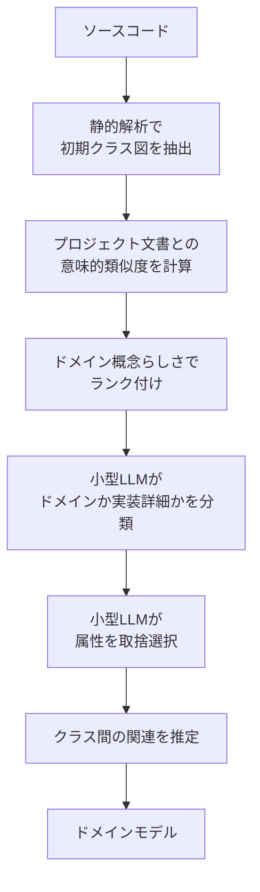

レガシーシステムの刷新で最初にぶつかるのは、「そもそも、このコードはどんな業務概念を扱っているのか」が誰にも説明できないことです。設計書は古く、書いた人はもういない。残っているのはソースコードだけ。

ここでLLMに読ませたくなりますが、多くの現場ではその瞬間に止まります。**基幹システムのソースコードを外部サービスへ送信できないからです。**

arXivで公開された [Towards Automated Domain Model Extraction from Source Code using Heuristics and Open-Source LLMs](https://arxiv.org/abs/2608.12228) は、この制約を前提に置いたまま、ローカルで動く小型のオープンソースLLMだけでドメインモデルを抽出する手法を提案しています。

この記事では、その手法が「小型モデルの弱点をどう回避しているか」という構造を読み解き、自社でレガシー分析ツールを内製・導入するときに何を設計指針として持てるかを整理します。

*この記事の全体像。以下、順に解説します。*

## 3行でわかる結論

- コードを外部に出せない現場では、**巨大コンテキストモデルへの一括投入は選択肢にならない**。制約は技術ではなく企業ポリシー側にある。
- 小型LLMのコンテキスト長不足は、**「何を読ませるか」を決定論的に絞り込む前処理**で回避できる。静的解析と意味的類似度でコード要素を順位付けし、上位から少しずつ渡す。
- 汎用化すると、これは「**決定論的ヒューリスティクスで候補を絞り、LLMには判定だけをさせる**」というアーキテクチャパターン。LLMに要約を丸投げする設計とは別物。

## なぜ「巨大モデルに全部読ませる」が使えないのか

技術だけを見れば、100万トークン級のコンテキストを持つモデルにリポジトリ全体を投入するほうが単純で強力です。分割による文脈の欠落も起きません。

それでも採用できない理由は、性能ではなく**送信可否**にあります。

| 論点 | 巨大LLM一括投入 | ローカル小型LLM + 段階探索 |
| --- | --- | --- |
| コードの外部送信 | 発生する | 発生しない |
| 必要なコンテキスト長 | 非常に長い | 短くてよい |
| 実行環境 | 外部API前提 | 手元のマシン・社内環境 |
| パイプラインの複雑さ | 低い | 高い（前処理が必要） |

つまりこの手法は、「精度で勝つための工夫」ではなく、**送信できないという前提のもとで唯一成立する構成**として設計されています。この位置づけを取り違えると、「巨大モデルのほうが良いのだから不要」という誤った結論になります。

判断基準はシンプルです。**自社のコードを外部LLMへ送信できるか。** 送信できるなら一括投入で構いません。送信できないなら、以下の話が効いてきます。

## パイプラインの5段階

提案されているのは、静的解析とLLMを交互に使う段階的なパイプラインです。

各段階の役割を分解すると次のようになります。

### 1. 実装レベルの構造抽出

静的解析ツールでソースコードからクラス図を機械的に起こします。この時点の図には `UserController` や `OrderRepository` のような実装都合のクラスも、ログ出力用のユーティリティも、すべて混ざっています。

ここはLLMを使いません。**構造の取得は決定論的にできる作業だから**です。

### 2. 意味的類似度によるランク付け

抽出したクラス群と、既存のプロジェクトドキュメント（READMEや要求仕様など）との意味的類似度をEmbeddingモデルで計算し、**ドメイン概念である可能性が高い順**に並べます。

この段階が、この手法の要です。業務文書に「注文」「配送」「与信」といった語が出てくるなら、それらに意味的に近い名前を持つクラスは業務概念である可能性が高い。逆に、どの業務文書にも登場しない `AbstractBaseHandler` は実装詳細である可能性が高い。

**「LLMに読ませる順番」を決めることが、コンテキスト長制約への回答になっています。**

### 3. 反復的なクラス分類

ランク付けされたリストを上位から順に小型LLMへ渡し、「ドメインに属する概念か、実装詳細か」を分類させます。一度に全部ではなく、部分集合ごとに反復します。

LLMに求めているのは要約でも設計でもなく、**二値の判定**です。タスクを小さく切ることで、小型モデルでも安定して答えられる粒度に落としています。

### 4. 属性のフィルタリング

ドメイン概念と判定されたクラスについて、内部の属性が業務上の意味を持つものか、実装都合のものかをさらに判定させます。

クラス単位で残しても、そのままでは `createdBy` や `serialVersionUID` のようなフィールドが混ざります。ドメインモデルとして読める粒度にするには、この層のフィルタが要ります。

### 5. 関連の推定

残った純粋なドメインクラス間の構造的な関係性を分析し、最終的なドメインモデルを構築します。

## この構成から取り出せる設計パターン

個別の実装より、**役割分担の型**のほうが持ち帰る価値があります。

| 工程 | 担当 | 理由 |
| --- | --- | --- |
| 構造の取得 | 静的解析 | 正解が一意に決まる。LLMを使う必要がない |
| 候補の絞り込み | 類似度検索 | 順序付けは計算可能。ここでコンテキスト量が決まる |
| 意味の判定 | LLM | 「業務概念かどうか」は文脈依存で、規則で書けない |
| 出力の構築 | 決定論的処理 | 再現性が要る |

言い換えると、**LLMは「規則で書けない判断」だけに使い、その前後は決定論的処理で固める**という分担です。

この型には副次的な利点があります。

- **コンテキストの上限に依存しない**: 渡す量を前処理側で制御できるため、モデルを差し替えても構成が壊れない
- **失敗箇所が特定できる**: どの段階で誤ったかを段階ごとに検証できる。一括要約では「なぜこの結論になったか」を切り分けられない
- **段階ごとに人が介入できる**: ランク付け結果や分類結果に人がレビューを挟める

逆に、複雑さというコストを払っています。段階が増えるほど実装・運用の手間は増えます。

## この手法が抱える限界

論文自身が挙げている限界が2つあります。どちらも実務判断に直結します。

### ドメインモデリングには「正解」がない

ドメインの境界線や概念の抽出は、専門家の間でも判断が分かれる主観的な作業です。そのため**評価基準の標準化が難しい**という根本的な課題が残ります。

これは手法の欠陥というより、対象の性質です。実務では次のように扱うのが現実的です。

- 抽出結果を「正解」ではなく**議論のたたき台**として使う
- 業務部門とのレビューを前提に組み込む
- 自動化のゴールを「モデルの確定」ではなく「**候補の網羅と初期案の生成**」に置く

### 前提が変われば不要になりうる

将来、1Mトークン以上を処理できるモデルが一般的なローカルマシンで高速に動くようになれば、段階的パイプラインの複雑さは不要になる可能性があります。

ここでも判断基準は同じです。**制約が消えたら構成も見直す。** 段階的パイプラインは目的ではなく、制約への適応です。制約が変わったのに構成だけ残ると、複雑さのコストだけを払い続けることになります。

## まだ解けていない問い

論文が未解決として残している論点は2つあります。どちらも「抽出したあと」の話で、実務ではむしろここからが本番です。

- 抽出されたドメイン境界を、**稼働中のDBスキーマ・外部向けAPI定義・業務部門の用語集とどう自動照合・同期させるか**。コードから起こしたモデルと、データと、言葉が食い違うのがレガシーの常態です。
- **1:N や N:M といった関連の多重度を、コードから正確に逆算する確実な手法**は確立されていません。多重度は業務ルールそのものなので、構造だけからは決めきれません。

いずれも、**コードだけを情報源にしている限り解けない**という点が共通しています。ドメインモデルの正しさは、最終的にコードの外にある情報（データの実態と、人が使っている言葉）と突き合わせないと確認できません。

## 実務でどう使うか

以上を踏まえると、レガシー分析にAIを組み込むときの指針は2点に整理できます。

### 「LLMに一括要約させる」設計を選ばない

内製・導入のどちらでも、まず確認すべきはツールの内部構成です。コードをまとめてLLMに投げて要約させる作りは、次の理由で推奨できません。

- コードの外部送信が発生しやすい
- モデルのコンテキスト長に構成が縛られる
- 誤りの原因を切り分けられない

代わりに、**決定論的ヒューリスティクス（静的解析・類似度検索）＋ LLMの段階的判定**というパイプライン型を選びます。この構成なら、モデルを入れ替えても、対象言語が変わっても、骨格は維持できます。

### 検証は「差分抽出」で行う

抽出したモデルの有用性は、モデル単体を眺めても評価できません。前述のとおり「正解」がないからです。

実用性を測るなら、**抽出した概念モデルと、現場の既存仕様書やRDBスキーマとの差分**を見ます。

- コードにはあるが仕様書にない概念 → 仕様書の陳腐化、または隠れた業務ルール
- 仕様書にはあるがコードにない概念 → 未実装、または別の呼び名で実装済み
- 名前が一致するのに構造が違う → 用語の分裂

**差分そのものが、レガシーの実態を示す最も価値ある成果物**になります。モデルの精度を競うより、差分を出す工程を先に作るほうが実務では早く効きます。

## まとめ

- 基幹システムのコードを外部LLMへ送信できない現場では、巨大コンテキストモデルへの一括投入は技術的優位に関わらず選択肢にならない。
- 提案手法は、静的解析で構造を取り、プロジェクト文書との意味的類似度でクラスをランク付けし、上位から小型LLMに分類させることで、**コンテキスト長の制約を「渡す順番」の問題に置き換えている**。
- 汎用化すると「決定論的ヒューリスティクスで絞り込み、LLMには規則で書けない判断だけをさせる」という型になる。モデル差し替えに強く、誤りの切り分けも効く。
- 限界は2つ。ドメインモデリングに正解がないこと、そして前提（ローカルで扱えるコンテキスト長）が変われば構成ごと不要になりうること。
- 実務では、抽出モデルを「正解」ではなく**既存仕様書・DBスキーマとの差分を出すための入力**として使うほうが、価値が早く出る。

レガシー刷新でAIに期待すべきなのは、正しい設計図を出してくれることではなく、**食い違いがどこにあるかを機械的に洗い出してくれること**だと言えそうです。

この記事が少しでも参考になった、あるいは改善点などがあれば、ぜひリアクションやコメント、SNSでのシェアをいただけると励みになります！

## 参考リンク

- [Towards Automated Domain Model Extraction from Source Code using Heuristics and Open-Source LLMs (arXiv:2608.12228)](https://arxiv.org/abs/2608.12228)
