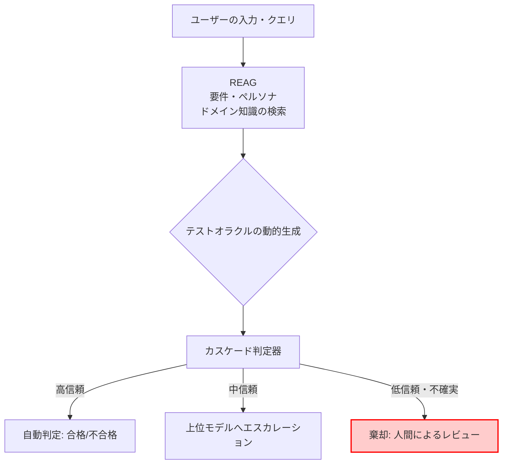

LLMを組み込んだアプリケーションで、「この出力は合格か、不合格か」を誰がどう決めているでしょうか。

多くの現場では、この判定が評価担当者の頭の中か、LLM-as-a-Judgeのプロンプト本文の中にあります。どちらも、判定基準がプロダクトの要件定義から切り離された場所に置かれている状態です。

この記事では、判定基準を要件・ドメイン知識・ペルソナから動的に組み立てる **REAG (Requirements-Augmented Generation)** と、判定の信頼度を測って低信頼のケースを人間へ戻す **カスケード判定** の構造を扱います。arXivで公開された論文 [Requirements-Augmented Generation for Trustworthy Acceptance Testing of LLM-Based Software](https://arxiv.org/abs/2608.12970) の提案手法を、発注側・評価基盤を設計する側の視点で読み解きます。

読み終えたときに持ち帰れるものは、次の3つです。

- なぜ従来の受け入れテストがLLMアプリで機能しないのか、その構造的な理由
- 判定基準を「書き溜めたテストケース」から「要件から生成するもの」へ移すときの設計
- この手法を自組織に持ち込む前に確認すべき前提と、報告されている限界

*この記事の全体像。以下、順に解説します。*

## 従来の受け入れテストが機能しなくなる理由

従来のソフトウェアテストは、**固定されたテストオラクル**を前提にしています。入力Xに対して期待値Yを事前に書き、実際の出力と突き合わせる構造です。

LLMベースのソフトウェア (以下、LBS) では、この前提が2か所で崩れます。

| 前提 | 従来のソフトウェア | LLMベースのソフトウェア |
|---|---|---|
| 出力の決定性 | 同じ入力なら同じ出力 | 確率的で、実行ごとに揺れる |
| 正解の定義 | 仕様として静的に固定できる | ユーザーのペルソナと業務文脈で動的に変わる |

2つ目が特に厄介です。たとえば栄養助言アプリで「1日の塩分を控えてください」という出力があったとき、これが合格かどうかは利用者が誰かによって変わります。高血圧の既往がある利用者に対しては適切でも、アスリートに対しては不十分な助言かもしれません。同じ出力文字列に対する正解ラベルが、文脈次第で反転するということです。

事前に正解データを固定するアプローチは、この反転を表現できません。結果として、テストスイートは「無難な出力しか通さない」か、「揺れを許容しすぎて何も検出しない」かのどちらかへ寄っていきます。

ここでLLM-as-a-Judgeを導入して判定を任せる選択肢が出てきますが、素朴に導入すると問題の置き場所が変わるだけです。判定基準がジャッジ用プロンプトの中に埋め込まれ、要件定義書とは別系統で管理される状態になります。要件が変わったときにプロンプトが追随する保証はなく、判定の根拠を後から説明することもできません。

## REAG: 判定基準を要件から動的に生成する

REAGは、この「判定基準の置き場所」を要件側へ戻すアーキテクチャです。

一般的なRAGが質問応答のために知識を検索するのに対し、REAGが検索するのは次の3種類です。

1. **ソフトウェア要件** (何を満たすべきか)
2. **ドメイン知識** (その分野で守るべき制約)
3. **ユーザーペルソナ** (誰にとっての正しさか)

検索したこれらを材料に、「この文脈においてシステムが満たすべき合否基準」をその場で再構築します。つまりテストオラクルが、静的なデータではなく**要件からの生成物**になります。

この置き換えが効くのは、次の点です。

- **判定の根拠が要件へ接続される**。なぜ不合格なのかを「要件Rの制約を満たしていないから」と説明できる
- **要件を更新すれば判定基準が追随する**。プロンプトを書き直す運用から離れられる
- **ペルソナを差し替えるだけで観点が切り替わる**。同じシナリオを複数の利用者像で評価できる

裏を返すと、REAGの品質は**検索対象となる要件ドキュメントの品質にそのまま従属します**。ここは後述する限界の中心でもあります。

## カスケード判定: 迷ったケースを人間へ戻す

REAGでオラクルを作れても、そのオラクルに照らした判定自体をLLMが行う以上、判定の誤りは残ります。論文が組み合わせているのが、**信頼度較正済みカスケード判定 (confidence-calibrated cascade judgment)** です。

構造は次のとおりです。

- GPT系・Gemini系のように**異なるモデルファミリー**の判定器をカスケードに並べる
- 模擬的な専門家の合意 (agreement) から、判定の信頼度を定量化する
- **conformal risk control** で閾値を設定し、信頼度に応じて処理を3つに分岐する

分岐先は次の3つです。

| 信頼度 | 処理 | 意図 |
|---|---|---|
| 高 | 自動で合否を確定 | 人間の確認コストをかけない |
| 中 | 上位モデルへエスカレーション | 精度が要るところにだけ強いモデルを使う |
| 低・不確実 | 棄却 (abstain) して人間レビューへ | 誤判定を無理に出さない |

設計思想として重要なのは、3行目の存在です。すべてのケースに機械が答えを出すことをやめ、**答えないという選択肢を明示的に持たせている**点が、この手法を実用側へ寄せています。

自動判定の精度を上げる話ではなく、「自動で判定してよい範囲を、統計的な保証つきで区切る」話だと読むと、設計意図がつかみやすくなります。

## 全体の流れ

ここまでの2つの仕組みを1つのパイプラインとしてまとめると、次の構造になります。

左半分 (REAG) が**何を正解とするか**を決め、右半分 (カスケード判定) が**その判定をどこまで自動で確定してよいか**を決めます。この2つは独立した関心事であり、片方だけを導入することもできます。

判定基準が要件と切れている組織であれば左半分から、判定の信頼性が測れていない組織であれば右半分から着手する、という読み方ができます。

## 報告されている効果と、その数字の読み方

論文では、実際の栄養助言アプリを対象としたケーススタディが報告されています。

| 項目 | 報告値 |
|---|---|
| テストシナリオ数 | 346 |
| カスケード判定の精度 | 98.8% |
| 単一の強力な判定器と比べたコスト | 31.7%削減 |
| 生成されたオラクルの品質評価 | 3.91 / 5 |

この数字の読み方には注意が要ります。

**精度98.8%は、全ケースを自動判定した結果ではありません。** 低信頼のケースを棄却して人間へ回した上での、自動判定領域における精度です。したがって「人手が98.8%不要になる」という読み方は成り立ちません。棄却率と合わせて見る必要があります。

**コスト31.7%削減の比較対象は、単一の強力な判定器です。** 全ケースを上位モデルで判定する構成と比べた差分であり、既存の評価体制が人手中心であれば、比較の起点そのものが異なります。

**オラクル品質3.91/5は、伸びしろの指標でもあります。** 満点ではない以上、生成されたオラクル自体に誤りが混じる前提で運用設計する必要があります。

## 導入前に踏むべき順序

自組織や支援先へ持ち込むときは、次の順序が現実的です。

### 1. 要件ドキュメントを検索可能な形にする

REAGは検索できる要件がなければ成立しません。仕様がスライドや議事録に散っている状態では、検索結果が貧弱になり、そのままオラクル品質の低下として現れます。

Markdown化やドキュメント構造の整理は、評価基盤の構築と**並行して進める前提作業**です。評価基盤ができてから着手すると、基盤が空回りします。

### 2. ペルソナ定義を要件と同じ場所に置く

「誰にとっての正しさか」が判定に効く以上、ペルソナ定義は付随資料ではなく判定入力です。要件と同じリポジトリ、同じレビュー経路で管理する対象になります。

### 3. 棄却したケースを受け止める体制を先に決める

棄却は、人間のレビュー待ち行列を作る操作です。この行列を誰が処理するかを決めないままパイプラインを組むと、棄却されたケースが滞留し、結局は無条件通過と変わらない状態になります。

**先に決めるべきは自動化率ではなく、レビューの受け皿です。**

### 4. その上で、判定基準をプロンプトから要件へ移す

ここまでの前提が整ってはじめて、ジャッジ用プロンプトのチューニングから離れる意味が出ます。順序を逆にすると、プロンプトを触る作業が残り続けます。

## 限界と、そのまま持ち込めないところ

論文が自ら挙げている妥当性への脅威と、実運用上の限界は次の3点です。

- **単一ドメインへの依存**。報告されている精度とオラクル品質は、栄養助言アプリという単一の産業事例に基づきます。REAGの性能上限は検索対象の要件ドキュメントの質に従属するため、要件が構造化されていないドメインではオラクル品質が著しく低下します。この記述は論文の自己評価であり、第三者による追試ではない点も踏まえて読む必要があります。
- **合成ペルソナの分布のズレ**。テスト網羅性を高めるためにエージェントが生成した合成ペルソナが、実運用のペルソナ分布と乖離するリスクがあります。網羅しているように見えて、実際の利用者がいない領域を厚くテストしている可能性が残ります。
- **LLMの相関エラー**。カスケードに異なるモデルファミリーを用いても、LLM全般に共通する相関した失敗を排除しきれません。複数の判定器が**同じ誤ったオラクルに合意する**ケースは残存します。判定器を増やすことは独立性を保証しません。

3点目は、この手法の信頼度そのものに関わります。合意ベースの信頼度は「モデル間で意見が割れなかったこと」を測っており、「正しいこと」を直接測ってはいません。この差は、conformal risk controlで閾値を較正しても消えません。

したがって、棄却されなかった高信頼ケースについても、抜き取りで人間が確認する経路は残すべきです。

## まとめ

- LLMベースのソフトウェアでは、出力が確率的であることに加え、**正解の定義がペルソナと文脈で動的に変わる**ため、固定オラクルの受け入れテストが成立しません。
- **REAG**は、要件・ドメイン知識・ペルソナを検索し、合否基準をその場で生成します。判定基準がプロンプトではなく要件側に置かれるため、根拠を説明でき、要件更新に追随します。
- **カスケード判定**は、判定の信頼度を定量化し、高信頼は自動確定、中信頼はエスカレーション、低信頼は棄却して人間へ回します。答えないという選択肢を持つことが実用性の中心です。
- 報告値 (346シナリオで精度98.8%、コスト31.7%削減) は、棄却を前提とした自動判定領域の数字であり、比較対象は単一の強力な判定器です。人手が不要になる話ではありません。
- 導入の順序は、**要件の構造化 → ペルソナ定義の同居 → 棄却の受け皿を決める → 判定基準を要件へ移す**。この順序を逆にすると基盤が空回りします。
- 限界は、単一ドメインでの検証、合成ペルソナの分布のズレ、そしてモデル間の相関エラーです。合意は正しさを保証しないため、高信頼ケースの抜き取り確認は残します。

判定の自動化を検討するとき、最初に問うべきは「どこまで自動で判定できるか」ではなく、**「判定基準は今どこに書かれているか」**です。それが要件定義書ではなくプロンプトの中にあるなら、精度を上げる作業は要件と切り離されたまま積み上がっていきます。

この記事が少しでも参考になった、あるいは改善点などがあれば、ぜひリアクションやコメント、SNSでのシェアをいただけると励みになります！

## 参考リンク

- [Requirements-Augmented Generation for Trustworthy Acceptance Testing of LLM-Based Software (arXiv:2608.12970)](https://arxiv.org/abs/2608.12970)
