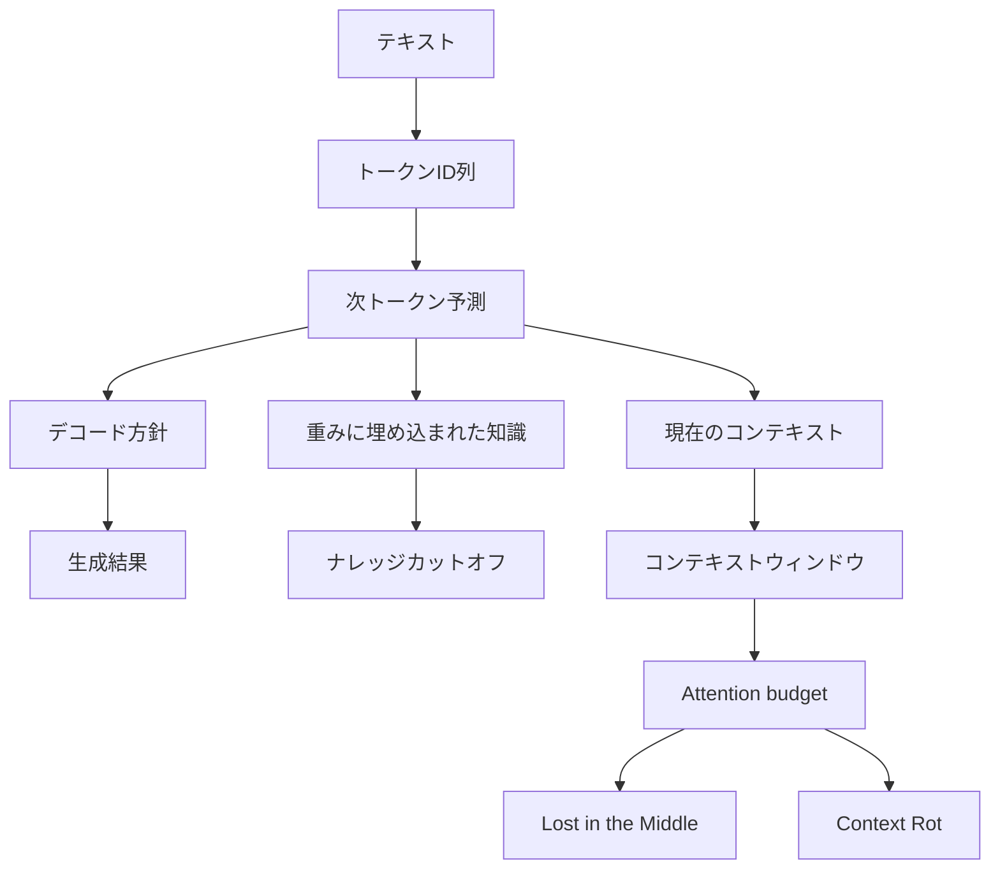

LLMを使っていると、「同じ質問なのに答えが変わる」「長い資料を渡したのに見落とす」「最新情報を知っているように見える」といった現象に出会います。これらをモデルの賢さだけで説明しようとすると、原因と対策を取り違えます。

必要なのは、次の6概念を分けて考えることです。

- 次トークン予測
- 決定論と非決定論
- ナレッジカットオフ
- コンテキストウィンドウ
- Lost in the Middle
- Context Rot

この記事では、各概念の意味と相互関係を整理し、LLMを使ったプロダクトやAIエージェントの設計にどう反映すべきかを解説します。

*この記事の全体像。以下、順に解説します。*

## 6概念を一枚の地図にする

6概念は独立した用語集ではありません。LLMが文章を生成する流れに沿って積み重なっています。

上から順に見ると、問いは次のように変わります。

1. 何を単位に、どう文章を生成するのか
2. 同じ条件なら同じ結果になるのか
3. モデルの重みには、いつまでの知識が入っているのか
4. 今回のリクエストで、どれだけの情報を参照できるのか
5. 窓の中にある情報を、位置によらず使えるのか
6. 入力が長くなっても、同じ精度で処理できるのか

Attention budgetは、4の「容量」と5・6の「利用精度」をつなぐ補助概念として扱います。

この区別ができると、「100万トークン入るモデルなら最新情報を正確に扱える」といった誤解を避けられます。窓の大きさは作業領域の容量であり、知識の鮮度や長文処理の精度を保証しません。

## LLMは「次の文字」ではなく「次のトークン」を予測する

現在の主流LLMは、それまでのトークン列を条件として、次に来るトークンの確率分布を計算する自己回帰モデルです。予測対象は、文字や単語そのものではなく、トークナイザが割り当てた語彙上のIDです。

トークンは、1文字、単語の一部、単語全体、空白や記号など、さまざまな粒度を取ります。日本語の1文字や絵文字が複数トークンに分かれる場合もあります。[OpenAIの解説](https://help.openai.com/en/articles/4936856-what-are-tokens-and-how-to-count-them)にある「英語では1トークンがおよそ4文字」という目安も、特定の言語とエンコーディングに依存します。

学習時と生成時にも違いがあります。

- 学習時: 正解の列を見ながら、各位置の次トークン予測誤差を並列に計算
- 生成時: 選ばれたトークンを末尾に追加し、次の1トークンを逐次予測

したがって、課金やコンテキスト長を文字数だけで見積もるのは危険です。実際に利用するモデルのトークナイザ、またはAPIのusage情報で数える必要があります。

また、「LLMが回答時に学習データを検索している」という説明も正確ではありません。通常の生成では、モデルの重みに埋め込まれた統計的な関係から次トークンを選びます。検索結果や社内文書を使わせる場合は、Web検索、RAG、ファイル検索などを外付けし、その結果をコンテキストへ入れます。

:::message
「次の文字を予測する」は直感的な比喩としては使えますが、設計やコスト計算では「次のトークンIDを予測する」と捉える必要があります。
:::

なお、すべての言語モデルが自己回帰方式とは限りません。マスクされた箇所を並列に復元する拡散言語モデルも登場しています。ただし、2026年時点で広く使われるGPT、Claude、Geminiの主力モデルを理解する基本として、次トークン予測は依然として有効です。

## temperatureを0にしても完全には再現できない

「同じプロンプトなら同じ出力になるか」を考えるとき、決定論を一つの設定値に縮めてはいけません。少なくとも次の4層があります。

| 層 | 変動するもの | temperature=0で固定できるか |
|---|---|---|
| デコード方針 | greedy、temperature、top-p、top-k | おおむね固定できる |
| 乱数源 | samplingに使うseed | greedyなら原則使わない |
| 推論実装 | バッチサイズ、カーネル、MoE、量子化 | 固定できない |
| 実行環境 | モデルのsnapshot、GPU、推論エンジン | 固定できない |

temperatureを0にすると、通常は各ステップで確率が最大のトークンを選ぶgreedy decodingに近づきます。理論上、同じlogitsが得られれば選択結果も同じです。しかし、ホスト型APIではlogitsを計算する過程まで固定できません。

[Thinking Machines Labの検証](https://thinkingmachines.ai/blog/defeating-nondeterminism-in-llm-inference/)では、同じプロンプトをtemperature 0で1000回実行しても、既定のvLLMでは80種類の出力が生じました。一方、バッチサイズが変わっても数値結果が変わらないカーネルを使うと、1000回すべてが一致しました。

原因は、単純に「GPUが乱数を出すから」ではありません。サーバーの混雑状況によってバッチサイズが変わると、行列演算やattentionの計算順序が変わり、浮動小数点の丸め誤差がわずかに変化します。候補トークンの確率が近ければ、その微差が最初の分岐を生み、その後の文章全体を変えます。

再現性が必要な評価や監査では、次のように設計します。

- temperature=0だけを再現性の保証にしない
- 利用できる場合はseedとモデルsnapshotを記録する
- プロンプト、ツール結果、モデル名、パラメータ、レスポンスを保存する
- 文字列の完全一致ではなく、許容範囲や評価指標を定義する
- 厳密な一致が必要なら、自前推論でエンジンとバッチ不変カーネルまで固定する

## ナレッジカットオフは「重みの知識」の時間境界

ナレッジカットオフは、モデルのパラメータに埋め込まれた世界知識が、どの時点までを主な根拠にしているかを示す時間境界です。モデルの公開日や、コンテキストウィンドウの大きさとは別です。

似た用語も区別する必要があります。

| 用語 | 意味 |
|---|---|
| Training data cutoff | 事前学習や一部の追加学習に使ったデータの時間的な境界 |
| Knowledge cutoff | パラメータ知識として広く信頼できるとベンダーが示す境界 |
| Model release date | モデルが公開・提供された日 |

たとえばAnthropicは、[Models overview](https://platform.claude.com/docs/en/about-claude/models/overview)で「reliable knowledge cutoff」と「training data cutoff」を区別しています。より新しいデータが学習データに一部含まれていても、その時期の知識を網羅的かつ安定して回答できるとは限らないためです。

カットオフは、硬い壁でもありません。カットオフより後の出来事を正しく回答する経路には、次のものがあります。

- ユーザーがプロンプトや添付ファイルで与えた情報
- Web検索やRAG、MCPなどのツール結果
- 学習データに部分的に含まれた新しい情報
- 偶然正しく推測した結果

このため、「カットオフ後のことは絶対に答えられない」も、「一度正解したから最新情報を知っている」も誤りです。ニュース、価格、法令、人事、製品仕様など鮮度が必要な情報では、モデルの内部知識に頼らず、検索と出典確認を処理の一部にします。

## コンテキストウィンドウは容量であって能力ではない

コンテキストウィンドウは、1回のリクエストでモデルが参照できるトークン数の上限です。学習データ全体ではなく、生成時の「作業記憶」に相当します。

窓を占めるのは、ユーザーが入力した本文だけではありません。

- system、developer、user、assistantの各メッセージ
- ツール定義とツールの実行結果
- 添付した画像、PDF、ファイル
- 過去の会話履歴
- 生成する回答
- モデルによってはreasoningやthinking用のトークン

[OpenAIのConversation stateガイド](https://developers.openai.com/api/docs/guides/conversation-state)も、コンテキストウィンドウには入力・出力・reasoning tokenが含まれると説明しています。出力を長く確保するほど、入力に使える余白は減ります。

プロンプトキャッシュについても注意が必要です。キャッシュは同じプレフィックスを再計算するコストや待ち時間を減らしますが、情報そのものが窓から消えるわけではありません。「キャッシュしたからコンテキストが空く」わけではないのです。

さらに、公称100万トークンの窓があっても、100万トークンを均一な精度で使えるとは限りません。

### Attention budgetは「窓の中で使えるか」の判断軸

コンテキストウィンドウが表すのは、情報を載せられる容量です。
そのすべてを同じ精度で利用できることまでは意味しません。

Anthropicは、長いコンテキストを処理するときにLLMが使える注意を[Attention budget](https://www.anthropic.com/engineering/effective-context-engineering-for-ai-agents)と表現しています。
Transformerでは各トークンがほかのトークンを参照するため、入力がnトークンなら考慮する組み合わせはn²の規模に増えます。
入力が長くなるほど、必要な情報どうしの関係を捉えることが難しくなるという見方です。

ただし、Attention budgetは、Lost in the MiddleやContext Rotの単一原因を証明する用語ではありません。
位置、長さ、妨害情報、タスク、モデルの違いを考えながら、「窓に入るか」だけでなく「窓の中で使えるか」を設計するための補助概念です。

この見方を挟むと、後続の2概念を区別しやすくなります。

- Lost in the Middle：入力長を固定し、関連情報の位置を変えたときの性能差
- Context Rot：入力全体を長くしたときの性能低下

## Lost in the Middleは「どこに置いたか」の問題

Lost in the Middleは、入力の長さを固定し、正解に必要な情報の位置だけを動かしたとき、先頭と末尾では性能が高く、中央付近では低くなる現象です。典型的にはU字型の性能曲線として現れます。

[Liuらの論文](https://doi.org/10.1162/tacl_a_00638)では、多文書QAとkey-value retrievalで位置効果を測定しました。20文書の多文書QAにおけるGPT-3.5-Turboの正答率は、正解文書が先頭なら75.8%、中央付近なら53.8%、末尾なら63.2%でした。中央の53.8%は、文書を与えないclosed-book条件の56.1%も下回っています。

重要なのは、「LLMは常に真ん中を無視する」という法則ではないことです。

- 短い入力では現れない場合がある
- 単純な文字列検索では、近年のモデルが高得点を出す場合がある
- タスク、モデル規模、妨害文書の意味的な近さによって形が変わる
- 長いコンテキストに対応したモデルでも、複雑な多文書QAでは残る場合がある

Needle in a Haystackで高得点でも、長文理解全体が解決したとは言えません。単純な文字列の針を探すタスクと、複数文書を比較して答えるタスクでは必要な処理が異なるためです。

実務では、重要な制約や結論を長いログの中央に一度だけ置かないようにします。冒頭で目的と制約を明示し、末尾で現在の依頼を再提示します。RAGの検索結果も、取得した順に大量投入するのではなく、再ランキングして少数に絞る方が安全です。

## Context Rotは「どれだけ長くしたか」の問題

Context Rotは、タスクの複雑さをなるべく固定したまま入力を長くすると、コンテキストを使う性能が非一様に低下する現象です。Lost in the Middleと似ていますが、操作している変数が違います。

| | Lost in the Middle | Context Rot |
|---|---|---|
| 主な操作変数 | 関連情報の位置 | 入力全体の長さ |
| 典型的な現れ方 | 中央が弱いU字型 | 長さに伴う緩やかな低下や崖 |
| 主な問い | 窓のどこを使えるか | 窓を長くしても使い続けられるか |
| 実務上の対策 | 要点の配置、再ランキング | 圧縮、不要情報の除去、セッション更新 |

技術的な用法を広めたのは、Chromaの[Context Rotレポート](https://www.trychroma.com/research/context-rot)です。18モデルを対象に、針と質問の意味的な近さ、妨害情報、会話履歴の長さ、反復文字列などを変えて評価しています。約300トークンに絞った会話履歴と約11万3000トークンの全文を比べるLongMemEvalでは、全モデルファミリーで短く絞った条件が上回りました。

ただし、このレポートは査読論文ではなく、検索・RAG製品を提供する企業による技術レポートです。また、「10Kから100Kで一律20〜50%低下する」といった単純な横断値は本文にはありません。Context Rotを固定の低下率ではなく、長さを伸ばしたときの実効性能を自分のタスクで測るための問題設定として捉えるのが適切です。

AIエージェントでは、長さだけでなく、失敗したツール呼び出し、重複した検索結果、撤回済みの仮説などが蓄積します。これらは次の判断を妨げる「毒」として働く可能性があります。会話を無限に継ぎ足すのではなく、確定事項と未解決事項を要約して新しいコンテキストへ移す設計が必要です。

## 6概念を実装判断へ落とし込む

6概念を押さえたら、プロンプトを長く工夫するだけでなく、システム全体の設計へ反映します。

| 設計上の操作 | 主に対処する概念 |
|---|---|
| 利用モデルのトークナイザで入力を数える | 次トークン予測、コンテキストウィンドウ |
| Web検索やRAGに出典を付ける | ナレッジカットオフ |
| 入力を必要最小限の高シグナル情報に絞る | Attention budget、Context Rot |
| 要点を冒頭と末尾へ配置する | Lost in the Middle |
| 検索結果を再ランキングして件数を絞る | Lost in the Middle、Context Rot |
| 古いログや失敗トレースを捨てて要約する | Context Rot、コンテキストウィンドウ |
| snapshotと全パラメータを記録する | 非決定論 |
| 同じ入力を複数回評価し、ばらつきを測る | 非決定論、長文利用の実効性能 |

実務では、次の順序で点検すると切り分けやすくなります。

1. 鮮度が必要な事実なら、検索結果と出典を与えているか
2. 入力・出力・ツール結果の合計が窓に収まっているか
3. 関連情報を絞り、見つけやすい位置に置いているか
4. 入力を短くした条件と比較して、長さによる低下を測ったか
5. 1回の出力だけでなく、複数回のばらつきを確認したか

「より大きなモデルに替える」は、この確認の後です。モデル変更だけでは、古い情報を検索しない設計、大量のノイズを渡す設計、完全一致を前提にする評価設計は直りません。

## まとめ

LLMの振る舞いは、ひとまとめに「確率的だから」「コンテキストが長いから」と説明できません。

- 主流LLMは、文字ではなくトークンIDを単位に次トークンを予測する
- temperature=0はデコードをgreedyにするが、推論基盤まで決定論にはしない
- ナレッジカットオフは重みに埋め込まれた知識の時間境界である
- コンテキストウィンドウは現在の作業領域の容量であり、Attention budgetは窓内の情報を利用する能力が有限であるという見方である
- Lost in the Middleは、固定長の中での情報位置による性能差である
- Context Rotは、入力の長さに伴う非一様な性能低下である

モデルの公称スペックを見るだけでなく、「何を外部から与え、どこへ置き、どこまで残し、どの程度のばらつきを許すか」を設計することが、LLMを安定して使う近道です。

この記事が少しでも参考になった、あるいは改善点などがあれば、ぜひリアクションやコメント、SNSでのシェアをいただけると励みになります！

## 参考リンク

- [What are tokens and how to count them - OpenAI](https://help.openai.com/en/articles/4936856-what-are-tokens-and-how-to-count-them)
- [Conversation state - OpenAI](https://developers.openai.com/api/docs/guides/conversation-state)
- [Models overview - Anthropic](https://platform.claude.com/docs/en/about-claude/models/overview)
- [Effective context engineering for AI agents - Anthropic](https://www.anthropic.com/engineering/effective-context-engineering-for-ai-agents)
- [Defeating Nondeterminism in LLM Inference - Thinking Machines Lab](https://thinkingmachines.ai/blog/defeating-nondeterminism-in-llm-inference/)
- [Lost in the Middle: How Language Models Use Long Contexts](https://aclanthology.org/2024.tacl-1.9/)
- [Context Rot: How Increasing Input Tokens Impacts LLM Performance](https://www.trychroma.com/research/context-rot)
- [Needle In A Haystack](https://github.com/gkamradt/LLMTest_NeedleInAHaystack)
