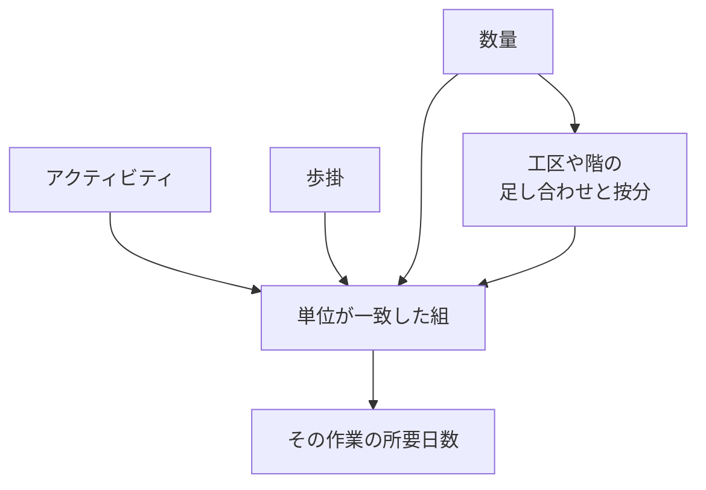
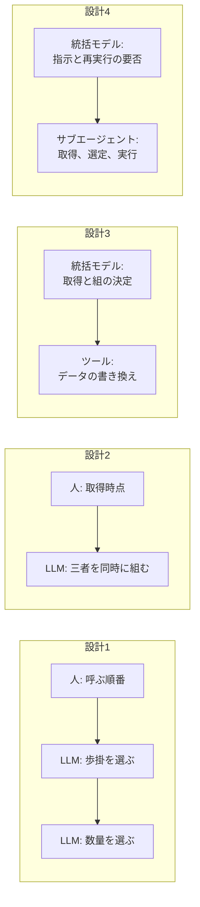

建設工事の工程計画では、ある作業に何日かかるかを、作業と、1日にどれだけ進むかと、全部でどれだけあるかとが、単位の揃った組になってから決めます。株式会社KENCOPAの工程AIエージェントは、この組を作る場所を4つの設計で移しています。[2026年9月25日の技術記事](https://zenn.dev/kencopa/articles/19ae96ba79ca40)は、その移り方を開発当事者の回顧として公開しています。一致率の表は付いていません。

この記事では、所要日数がどの組から出るか、各設計で人とモデルのどちらが組を持つか、公開された数字をどこまで工程の正しさとして読んでよいかを整理します。

*この記事の全体像。以下、順に解説します。*

## 工程計画の所要日数とは

工程計画が決めることは4つあります。何をやるか、どれだけかかるか、いつやるか、どんな条件下でやるかです。技術記事が実装として書いているのは、2番目の「どれだけかかるか」だけです。

条件下では、資材と機材の調達、職種ごとの人員、発注者と約束した竣工日、天候が計画を動かします。ある作業が20日でも、資材の到着が3週間後なら、その日数どおりには始められません。同じ職種を同じ時期に重ねると、人が足りません。工程計画は、所要日数をこれらの条件と突き合わせて成立します。

日数は、次の3点の組から出ます。

- アクティビティ。その現場の工法と規模に合わせて分解した作業です。
- 歩掛。1日にどれだけ進むかの基準です。
- 数量。全部でどれだけあるかの数字です。

組が成立する条件は、単位の一致です。歩掛と数量のどちらかが欠けると、その作業の日数は出ません。工区や階で分かれた数量は、組を作る前に足すか按分します。現場によっては、同じ作業が工区や階の数だけ現れます。

公開記事の例は、アクティビティ「コンクリート打設」、歩掛「コンクリート打設150㎥あたり1日」、数量「コンクリート1000㎥」です。3点が揃うと日数が決まる、と記事は書いています。計算後の日数は書いていません。単位を立方メートルに揃えて1000を150で割ると、約6.7日になります。これは公開された結果ではなく、例の単位から行う割り算です。歩掛が立方メートルあたりの日数なら、数量も立方メートルである必要があります。

規模の言い方は、現場によってはアクティビティが数百個、歩掛は階層を持ち、数量は数千個に達することもある、です。階層の歩掛から1つ、数千の数量から1つを、単位が一致する組として選びます。

4つの設計は、この組をどのコンポーネントが持つかの違いです。

### 設計1: 人が呼ぶ順番を固定する

ワークフロー型では、処理の順番を人が先に決め、その順番でLLMを呼びます。設計1は、先にアクティビティへ歩掛を付け、次にそのペアへ数量を付けます。記事は、当時のモデルを GPT-5.4 と書き、複雑な紐付けを行えなかったことと、手軽に処理を組めることを理由に挙げています。

アクティビティと歩掛の紐付けは、現場固有の事情を考慮したうえで一定できた、と記事は書いています。数量を選ぶ時点では、ペアはすでに決まっています。単位の合う数量が無い作業には、数量が付きません。歩掛が「コンクリート打設150㎥あたり1日」なら、数量は立方メートルのコンクリートである必要があります。歩掛データがリッチになるほど、この取りこぼしは起きやすい、と記事は書いています。

### 設計2: 三者を同じプロンプトで組む

設計2は、アクティビティ、歩掛、数量を同じプロンプトに渡し、同時に組ませます。記事はモデル名を GPT-5.5 と書き、能力の向上が追い風だった、と続けます。データが揃っているのに紐付かない、という状態はこの段で外れた、と記事は書いています。

取得する時点は、ワークフローを設計したときに固定されたままです。不足を避けるために歩掛と数量を事前にすべて入れると、処理可能なトークン量を超えるか、ノイズで紐付けの精度が下がる、と記事は条件として書いています。超えたトークン数は書いていません。記事が次に必要だと書く動きは、紐付ける相手に合わせて必要分だけ取り、紐付かなかったアクティビティは情報を取り直してもう一度試すことです。順番が固定されたワークフローでは、この取得のやり直しはできませんでした。

### 設計3: 組の決定を統括モデルへ移す

紐付けワークフローは、1つのツールとして登録されています。どのツールをいつ使うかは、全体を統括するLLMが決めます。紐付けは、統括モデルがそのツールを選んだときに実行されます。統括モデルは、現場固有の紐付けナレッジ、歩掛、数量を取得できます。

設計3は、組を考えるのを統括モデルへ移します。登録済みのツールは、紐付けデータの書き換えだけを行います。ペアの中身は統括モデルが決め、書き換えツールを実行します。記事は、ワークフロー型ではできなかった複雑な紐付けが可能になり、現場ごとの特殊なナレッジがあれば様々な現場で組めるようになった、と書いています。あわせて、精度の高い工程計画を立てられるようになった、とも書いています。

歩掛と数量を統括モデルへ載せると、コンテキストが圧迫されます。圧迫されると、工程エージェント全体のツール選択の質が落ち、指示が複雑なツールに対応できなくなります。紐付けの複雑さに合わせようとすると、統括モデルのプロンプトが肥大化し、制御しづらくなります。

### 設計4: 取得と選定と実行を専用サブエージェントへ移す

設計4は、取得、ペアの選定、紐付けの実行を専用サブエージェントへ移します。統括モデルは、大まかな指示を出し、返ってきた評価から再紐付けが必要かを判断します。紐付け用の情報は、統括モデルに取得させません。コンテキストにも載せません。サブエージェントのプロンプトには、紐付けだけを想定した具体的な指示を書けます。記事は、こうすると統括モデルのコンテキストに余裕が生まれ、ツールの選択と指示の質が落ちない、と書いています。

記事は、この分割で紐付けの精度がさらに上がり、数百のアクティビティに数千の数量を紐付けられるようになった、と書いています。いまは複数のサブエージェントがいる、と続きます。この段で新しく壊れた結び付きは、記事は列挙していません。

## 注意点

設計の手順は、公開記事から読めます。正しさの割合は、公開範囲では読めません。到達の言い方と、測定の有無は揃っていません。

| 公開文 | 書かれていること | 読み方 |
|---|---|---|
| 規模と精度 | アクティビティは数百個にのぼることがある。数量は数千個に達することがある。設計4で数百のアクティビティに数千の数量を紐付けられるようになった。設計2は精度高く、設計3は精度の高い工程計画 | 開発当事者の自己申告。評価セットの件数、正答率、誤紐付けの定義は無い。数百と数千は、現場規模の上限の言い方でもある |
| 設計3の成功文 | 精度の高い工程計画を立てられるようになった | 実装の対象は「どれだけかかるか」だけ。工程表全体の正しさの測定としては範囲が広い |
| 2026-03-26の製品版発表 | 見出しは、2週間かかる全体工程表が最短15分。本文の実績は、通常1週間の概略工程表作成が1日。使用感アンケートは5点満点の平均4.2。約35社のトライアル決定。建設DX展で1,200名超 | 自己申告。15分と「1週間が1日」は、対象も結果も別。4.2は使用感で、回答数は無い。紐付けの一致率ではない |
| 2026-06-23の歩掛AIデータベース | 工程表が生成された時点で、総施工量と標準歩掛または自社歩掛が自動で紐づく | 自己申告。誤り率は無い。9月の記事は、同じ種類の結び付きについて失敗した設計を日付なしで書く。6月の文がどの設計のあとなのかは未確認 |
| モデル名 | 設計1の限界に GPT-5.4。設計2の追い風に GPT-5.5 | GPT-5.4の公開は2026-03-05、GPT-5.5の公開は2026-04-23、API提供の追記は2026-04-24。製品版発表の2026-03-26は GPT-5.5の公開より前。4設計の実施日は記事に無い |
| トークン | 歩掛と数量を事前にすべて入れると、処理可能なトークン量を超えるか、ノイズで精度が下がる | 条件としての記述。超過したトークン数は未確認。利用経路がAPIか会話製品かも未確認 |
| 特許 | 2026-03-26と2026-06-23のプレスは特許申請中 | 自己申告。登録番号はプレスに無い。Google Patentsのクエリ KENCOPA は2026-09-26の取得で結果0。未公開の出願が無い、とは言えない |
| LangGraph | トピックタグにある | 本文の実装説明には無い。公開記事の github_repository は null。実装が LangGraph であるかは、公開範囲では確認できない |

タイトルは、「とりあえず LLM に投げる」では解けなかった工程計画、と置いています。公開本文が最初に壊している結び付きは、片側を先に固定したときの単位の一致です。全文を一括で生成して失敗した測定は、公開本文にはありません。

[2026年3月26日のプレス](https://prtimes.jp/main/html/rd/p/000000013.000166783.html)の見出しは、2週間かかる全体工程表が最短15分で作成可能、です。本文が実績として書くのは、通常1週間かかる概略工程表の作成が1日になったこと、です。使用感のアンケートは、1が「使えない」、5が「是非使いたい」の5点満点で、平均4.2です。回答数は書いてありません。建設DX展の来場関心は1,200名超、トライアル決定は約35社です。これらは紐付けの一致率ではありません。

[2026年6月23日のプレス](https://prtimes.jp/main/html/rd/p/000000019.000166783.html)は、工程表が生成された時点で、設計図書などから読み取った総施工量と、標準歩掛または自社歩掛が、各工程線へ自動で紐づく、と書いています。誤り率はありません。9月の技術記事は、アクティビティ、歩掛、数量の結び付きについて、うまくいかなかった設計を日付なしで書いています。6月の機能が4設計のどれのあとなのかは、公開された日付からは決まりません。

モデルの公開日は、OpenAIの一次告知にあります。[GPT-5.4](https://openai.com/index/introducing-gpt-5-4/)は2026年3月5日、[GPT-5.5](https://openai.com/index/introducing-gpt-5-5/)は2026年4月23日です。API提供の追記は2026年4月24日です。4設計の実施日が無いため、モデルの能力と分割のどちらが効いたかは切り分けられません。能力差を、分割の効果としては書けません。

トークンについては、OpenAIの2026年3月5日の公開文が、APIについて最大100万トークンと tool search を書いています。同じ公開文は、Codexの100万トークンを実験的サポートとし、標準のコンテキスト窓は272K、それを超えるリクエストは利用枠が2倍、と分けています。KENCOPAの記事は、利用経路を書いていません。

特許は、両プレスが「特許申請中」と書いています。登録番号はありません。2026年9月26日の Google Patents 検索（クエリ `KENCOPA`）は、結果件数0でした。これは公開検索の結果です。未公開の出願が無いことの証明ではありません。

公開記事のトピックには LangGraph があります。本文は LangGraph という実装名を述べません。[Zenn APIのメタデータ](https://zenn.dev/api/articles/19ae96ba79ca40)では、`github_repository` は null です。実装が LangGraph であるかは、公開範囲では確認できません。

顧客が自社名義で出した誤り率と、評価論文は、参照した公開資料の範囲では見当たりません。

## 設計ごとに人が残した判断

境界は、公開記事の動詞から読んだものです。記事自身は、人が残した判断という見出しでは書いていません。

| 設計 | 人が残した判断 | エージェントへ渡した判断 | 記事が壊れたと書く結び付き |
|---|---|---|---|
| 1. 逐次ワークフロー | 呼ぶ順番。先に歩掛、後に数量 | アクティビティに対する歩掛。その後、確定ペアに対する数量 | 単位の一致。ペアが先に決まると、単位の合う数量が無い作業に数量が付かない |
| 2. 三者同時 | 取得のタイミング。ワークフローなので設計時に固定 | 三者を見たうえでの組 | データが揃っているのに紐付かない状態は解けた、と記事はこの段で書く。残るのは、相手に合わせて必要分だけ取り、外れたアクティビティを取り直す動き。全量の事前投入はトークン超過かノイズ、という条件。実測は未確認 |
| 3. 統括モデルへ委譲 | ツールの役割を書き換えに限る。取得権限は統括モデルに渡す | 現場ナレッジ、歩掛、数量の取得と、組の中身 | 統括モデルのコンテキスト。歩掛と数量を載せると、工程エージェント全体のツール選択の質が落ちる。紐付け用のプロンプトが肥大化して制御しづらくなる |
| 4. 専用サブエージェント | 組のデータを統括モデルに取得させない。サブエージェントを紐付け専用にする | サブエージェントが取得、選定、実行。統括モデルは大まかな指示と、評価に基づく再実行の要否 | 記事はこの段の新しい壊れ方を列挙しない。到達の文は自己申告の規模 |

単位と数量と歩掛が同時に効く仕事では、最初に固定する見方を片側だけのマッチに置くより、両側が見える組に置きます。KENCOPAの記事は、逐次に固定したときの取りこぼしを、コンクリートの単位の例で追えます。全文生成の失敗実験としては読めません。

この事例をエージェント設計の判断に使うときは、分割の教訓を次に置きます。単位の両側を、同じ判断主体が同時に見る。全文生成を禁じる一般則の材料は、この公開記事にはありません。

数値は、自己申告と使用感のまま置きます。最短15分、平均4.2、数百と数千、精度が高い、を工程表全体の正しさへ接続しません。モデル名は、記事が経験として書いた GPT-5.4 と GPT-5.5 に留めます。公開日との前後は注記し、能力差を分割の効果とは書きません。

逆転条件は、日付付きの設計ログと、同じデータでの一致率が公開され、逐次と同時とサブエージェントを切り分けられることです。全文生成を最初の単位から外す、と実証つきで書くには、その失敗の分母が別に要ります。

探索、候補化、評価を分ける構成は、探すことと採点することを別の契約にします。この計画業務は、その隣で、数量と歩掛が見えてから所要が決まります。設計4の動詞は、必要な情報の取得、組の選定、実行、評価を受けた再実行の判断までを含みます。三段の名前、候補を何件残すか、評価関数、按分をどの段が持つかは、記事が定義しません。設計4を三段分割の実装例と同一視する根拠は、公開本文にはありません。

隣接として置ける問いは1つです。数量と所要が先に固定される仕事では、候補を出す前に、単位の両側を同じ判断主体へ見せているか。

設計ごとの記録は、3列で足ります。人が残した判断、渡した判断、壊れた結び付きです。設計4の壊れた結び付きは、記事は未記載、とします。未記載は、起きていないことの証明ではありません。設計4のあとにも、按分の担当、同じ数量の二重割り当て、評価だけを見た再実行判断の誤り、サブエージェント側のコンテキスト再超過、複数サブエージェントの整合は、公開記事にありません。

## まだ公開されていない確認項目

次は、公開された範囲では決まらない項目です。

- 4設計の実施日と、2026年3月26日の製品版、2026年6月23日の歩掛機能の対応。
- 一致率、分母、誤紐付けの定義。
- 工区と階の按分を、人、決定的な処理、サブエージェントのどれが持つか。
- 統括モデルが受け取る評価に、組の中身がどれだけ残るか。
- 利用経路がAPIか会話製品か。トークン超過の実測。
- 特許の出願公開の有無。

## まとめ

所要日数は、アクティビティ、歩掛、数量が単位ごと一致した組から出ます。KENCOPAの4設計は、その組を持つ場所を、人の呼ぶ順番、三者同時のプロンプト、統括モデル、専用サブエージェントへと移しています。公開された精度、最短15分、使用感4.2は、一致率の測定ではありません。発注側が確認するのは、単位の両側を同じ判断主体が同時に見ているか、です。

この記事が少しでも参考になった、あるいは改善点などがあれば、ぜひリアクションやコメント、SNSでのシェアをいただけると励みになります！

## 参考リンク

- [「とりあえず LLM に投げる」 では解けなかった工程計画](https://zenn.dev/kencopa/articles/19ae96ba79ca40)（KENCOPA テックブログ、2026-09-25）
- [記事メタデータ（Zenn API）](https://zenn.dev/api/articles/19ae96ba79ca40)
- [Introducing GPT-5.4](https://openai.com/index/introducing-gpt-5-4/)（OpenAI、2026-03-05）
- [Introducing GPT-5.5](https://openai.com/index/introducing-gpt-5-5/)（OpenAI、2026-04-23。API追記 2026-04-24）
- [製品版正式提供開始](https://prtimes.jp/main/html/rd/p/000000013.000166783.html)（株式会社KENCOPA、PR TIMES、2026-03-26）
- [歩掛AIデータベース機能](https://prtimes.jp/main/html/rd/p/000000019.000166783.html)（株式会社KENCOPA、PR TIMES、2026-06-23）
- [Google Patents クエリ KENCOPA](https://patents.google.com/xhr/query?url=q%3DKENCOPA)（2026-09-26取得、結果件数0）
