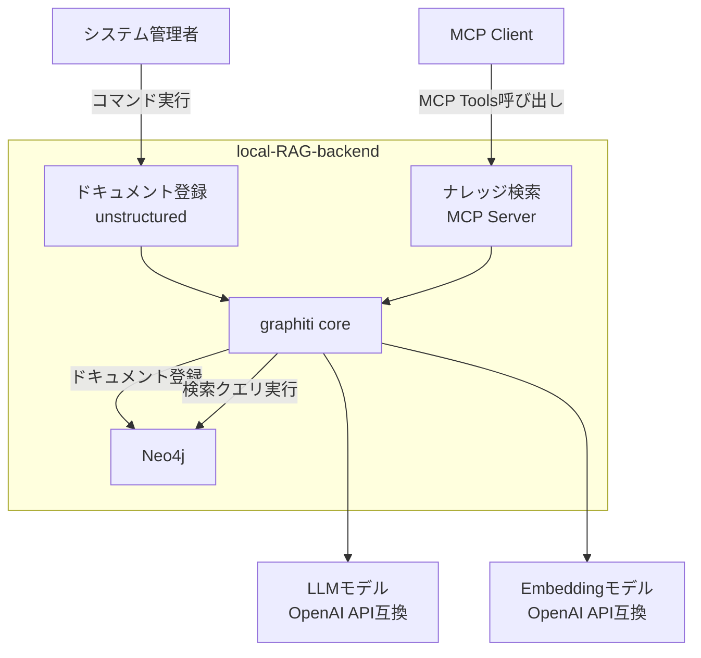
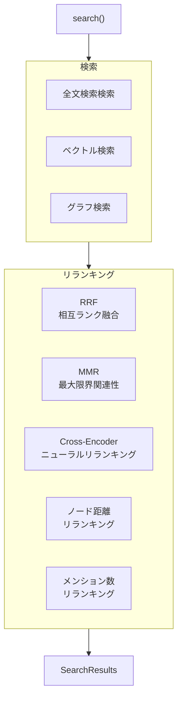

AI活用、特に自社データを使った生成AIの実現において、RAG（Retrieval-Augmented Generation）はもはや標準的なアプローチになりました。
しかし、いざRAGを構築しようとすると、多くの開発者が共通の課題に直面します。

  * **多様なドキュメントへの対応**: PDF, Word, PowerPointなど、社内に散在する多様なファイル形式を、どうやって効率的にテキスト化し、取り込むか？
  * **精度が出ないチャンキング**: 単純な文字数やトークン数での分割（チャンキング）では、文章の重要な文脈が失われ、検索精度が上がらずに頭を抱える。
  * **ブラックボックスなベクトル検索**: どうにかチャンキングしてEmbeddingし、ベクトルDBに保存したものの、検索すると全く見当違いの結果が返ってくる…。
  * **遅れる本来の目的**: 結果として、本来集中したいはずの最終的な回答を生成するLLMのプロンプト設計に、なかなか着手できない。

これらの課題と格闘するうちに、「期待した精度が出ない」という壁に突き当たってしまう…。そんな経験はありませんか？

### その課題、「local-RAG-backend」が解決します

今回ご紹介する「**local-RAG-backend**」は、そうしたRAG構築の障壁を取り除くために開発した、Docker Composeで簡単に導入できる高機能なRAGバックエンドシステムです。

https://github.com/suwa-sh/local-RAG-backend

このシステムは、従来のベクトル検索の弱点を**グラフ構造による文脈理解**で補い、RAGの検索精度を飛躍的に向上させます。



### 主な特徴

#### 1\. 多様なファイル形式に対応した高精度なデータ取り込み

内部的にOSSの`unstructured`ライブラリを活用し、多様なファイル形式から単にテキストを抜き出すだけでなく、**ドキュメントのレイアウトや意味のまとまりを解析し、文脈を維持したままインテリジェントにチャンキング**します。

**サポートファイル形式**

| カテゴリ             | 対応形式                             |
| -------------------- | ------------------------------------ |
| **テキスト**         | txt, md, rst, org                    |
| **Web**              | html, xml                            |
| **PDF**              | pdf                                  |
| **Microsoft Office** | doc, docx, ppt, pptx, xls, xlsx      |
| **OpenDocument**     | odt                                  |
| **リッチテキスト**   | rtf                                  |
| **eBook**            | epub                                 |
| **データ**           | csv, tsv                             |
| **メール**           | eml, msg, p7s                        |
| **画像**             | bmp, heic, jpeg, jpg, png, tiff, tif |

https://github.com/Unstructured-IO/unstructured

https://zenn.dev/suwash/articles/unstructured_20250619

#### 2\. ドキュメント間の関係性を"時系列"で捉えるグラフ構造

抽出したチャンク（情報の断片）は、内部の`graphiti`エンジンによってエンティティや概念が分析され、その関係性が**時系列情報と共にグラフデータベースに格納**されます。

これにより、「点」の検索であったベクトル検索の弱点を補い、**文書間の繋がりや時間経過による文脈の変化**を捉えることが可能になります。例えば、「**去年と今年で、製品Aに関する社内議論はどう変化したか？**」といった、時間軸を含む高度な分析が実現できます。


*https://github.com/getzep/graphiti から引用*

https://github.com/getzep/graphiti

https://zenn.dev/suwash/articles/graphithi_20250605

#### 3\. 複数手法を組み合わせたハイブリッド検索とリランキング

`mcp server`がエントリーポイントとなり、以下の3つの検索を並行実行。さらに、グラフDBに格納されたドキュメント間の関係性や時系列を用いて検索結果をリランキングすることで、**単一の検索手法では見つけられなかった、文脈的に真に関連性の高い情報**を特定します。

* **ハイブリッド検索**
  * **ベクトル検索**: 意味の類似性に基づき、関連性の高い情報を探し出します。
  * **グラフ検索**: データ間の「関係性」を辿り、隠れた繋がりを発見します。
  * **全文検索**: キーワードで情報を網羅的にスキャンします。
* **リランキング**
  * **RRF**: 複数の検索結果を、検索順位から再評価します。
  * **MMR**: 検索結果を、関連性と多様性のバランスで再評価します。
  * **Cross-Encoder**: 検索結果を、文脈での関連性で再評価します。
  * **ノード距離**: 検索結果を、中心ノードからの距離で再評価します。
  * **メンション数**: 検索結果を、原文での言及回数で再評価します。

**graphitiでの検索フロー**




### 導入と利用方法

**前提条件:**

  * Docker、Docker Desktopが利用できること。
  * OpenAPI互換のLLMエンドポイントが利用できること。

**インストール (約2分):**

```bash
# 1. 作業ディレクトリを作成し、移動します
mkdir -p path/to/RAG/data/input
cd path/to/RAG/

# 2. 設定ファイルをダウンロードします
# docker-compose.yml: 複数のコンテナを定義・実行するための設計図
curl -Lo docker-compose.yml https://raw.githubusercontent.com/suwa-sh/local-RAG-backend/main/docker-compose.yml
# .env: LLMのエンドポイントなど、環境に合わせた設定を記述するファイル
curl -Lo .env https://raw.githubusercontent.com/suwa-sh/local-RAG-backend/main/.env.example

# 3. .envファイルにご自身の環境設定を記述します
vi .env

# 4. コンテナ群をバックグラウンドで起動します
docker compose up -d
```

これだけで、高機能な検索用MCPサーバーが起動します。

- .envファイルの設定例:

```dotenv
# -------------------------------------
# ドキュメント登録、MCPサーバー 共通設定
# -------------------------------------
# Neo4j データベース設定
NEO4J_URI=bolt://localhost:7687
NEO4J_USER=neo4j
NEO4J_PASSWORD=password

# LLM API設定
LLM_MODEL_URL=https://api.openai.com/v1
LLM_MODEL_KEY=your_openai_api_key_here
LLM_MODEL_NAME=gpt-4o-mini
# Rerankモデル（省略時はLLM_MODEL_NAMEと同じ）
RERANK_MODEL_NAME=gpt-4.1-nano

# 埋め込みモデル API設定
EMBEDDING_MODEL_URL=http://host.docker.internal:11434/v1
EMBEDDING_MODEL_KEY=dummy
EMBEDDING_MODEL_NAME=kun432/cl-nagoya-ruri-large:latest

# テナント識別子設定
GROUP_ID=default

# -------------------------------------
# ドキュメント登録設定
# -------------------------------------
# ログレベル設定
LOG_LEVEL=INFO

# チャンク分割設定
# チャンクの最大文字数（デフォルト: 2000）
CHUNK_SIZE_MAX=2000
# チャンクの最小文字数（デフォルト: 200）
CHUNK_SIZE_MIN=200
# チャンクのオーバーラップ（デフォルト: 0）
CHUNK_OVERLAP=0

# 並列処理設定
# チャンク処理の並列ワーカー数（デフォルト: 3）
INGEST_CHUNK_WORKERS=3
# 登録処理の並列ワーカー数（デフォルト: 2）
INGEST_REGISTER_WORKERS=2

# -------------------------------------
# MCPサーバー設定
# -------------------------------------
# LLM温度
# 0.0-1.0の範囲で設定。低い値ほど出力が決定的になる（デフォルト: 0.0）
# RAGシステムでは構造化出力のため、0.0-0.3を推奨
LLM_TEMPERATURE=0.0
```

**ドキュメント登録:**

```bash
# 1. `path/to/RAG/data/input/` ディレクトリに、解析したいドキュメントを配置します
# (例)
# cp -r /path/to/your/documents/* path/to/RAG/data/input/

# 2. ドキュメント登録処理（チャンキング、グラフ化、Embedding）を実行します
#    設定ミスやLLMの料金超過などで取り込み処理でエラー終了した場合、同じコマンドで、途中から再開できます。
docker compose run --rm ingest
```

**検索の実行:**
起動した「mcp server」のエンドポイント (`http://localhost:8000/sse`) を、お使いのアプリケーションやLLMエージェントに登録するだけで、すぐに高度な検索機能を利用できます。

### 連携例: n8nワークフローへの組み込み

例えば、ノーコードでワークフローを構築できるツール「n8n」をお使いの場合、既存のワークフローにmcp serverを呼び出す「AI Agent」ノードを挟むだけで、簡単に連携できます。`path/to/RAG/data/input/`のファイル検知トリガーで、ドキュメント登録を起動すれば、ファイルを配置するだけですぐに登録され、検索できるようになります。


### 最後に

「local-RAG-backend」が、皆さんのAI・RAG開発を一段階先に進めるための一助となれば幸いです。

https://github.com/suwa-sh/local-RAG-backend

機能要望やバグ報告は、ぜひGitHubのIssueにお寄せください。また、この記事へのコメントやSNSでのシェアが、開発の何よりの励みになります。
