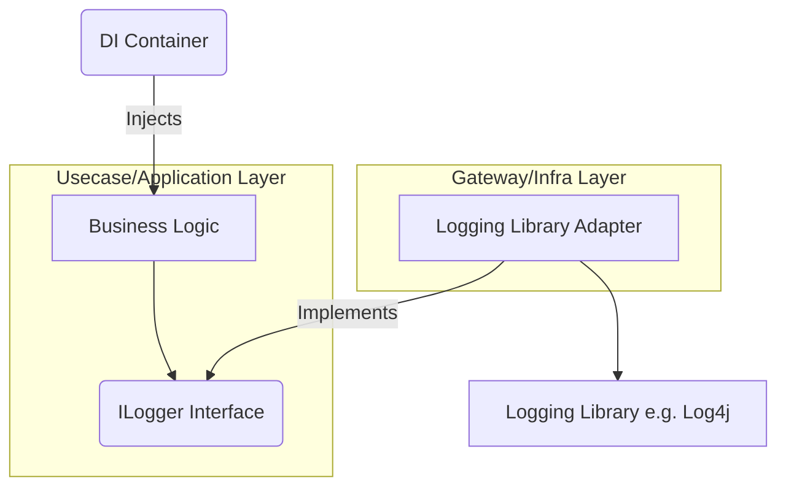
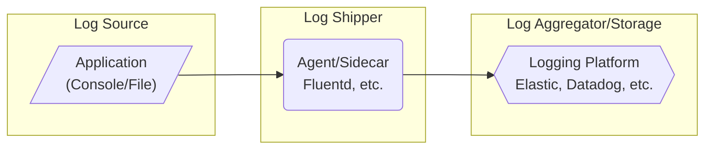
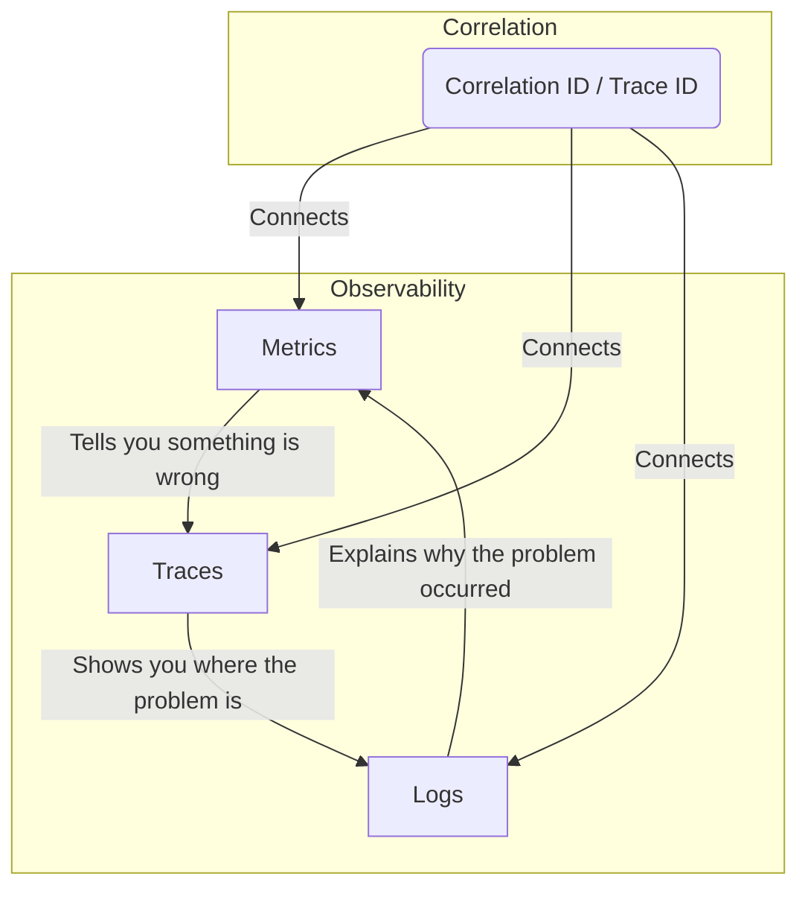

この記事では、クリーンアーキテクチャでのログ出力方針を整理し、**「戦略的データ資産」としての高品質なログ出力のための実践的な指針**を提示します。ロギングはシステムの観測可能性 (Observability) やセキュリティを支える上で不可欠なデータ資産です。記事を通じて、アプリケーションのロギング品質を劇的に向上させ、運用・保守の効率化とシステム全体の堅牢性強化に役立つ知識を習得することを目指します。

### 第1部 ロギングの基礎・原則

効果的なロギング方針を策定するため、ログを戦略的データとして扱うための基礎原則を確立します。このセクションでは、「なぜログが必要なのか」という本質的な問いから始め、現代のシステムが求めるログの要件を整理します。

#### 1.1 効果的なロギングの柱

ログの目的は、システムの観測可能性を高め、価値あるデータを生成することです。ログ戦略の策定時には、**「何のためにログを取得するのか」という目的を明確に定義**しましょう。単なるデバッグ情報としてだけでなく、ビジネス的な洞察やセキュリティ分析にも活用できるデータとしての視点を持つことが重要です。
すべてのログは意図的で実用的な情報を含むべきです。 **過剰なログは重要な情報の発見を困難にし、ストレージや処理のコストを増大させます。** ログを追加する際は、そのログがどのような意思決定を支援するのかを常に考慮し、「必要なものを、必要なレベルで、必要な時だけ」出力する意識が求められます。

#### 1.2 構造化ロギングの採用

ログは、人間と機械の双方にとって判読しやすい**JSON形式の構造化ログ**を標準とします。構造化ログは、ログ管理プラットフォームでの高速な検索、フィルタリング、集計、可視化を可能にし、ログデータを強力な分析対象へと変えます。これにより、**異常検知、パフォーマンスボトルネックの特定、ユーザー行動分析といった多角的なデータ活用が可能になります。**

##### 非構造化ログと構造化ログの比較

  - **非構造化ログの例**
    `"INFO: User login successful for user with ID 123456 from IP 192.168.1.100 at 2024-09-18T12:00:00Z."`
    この形式では、特定の情報を抽出するために複雑な正規表現によるパース処理が必要となり、**エラーが発生しやすく、分析効率が低下します。**

  - **構造化ログ（JSON）の例**

    ```json
    {
      "timestamp": "2024-09-18T12:00:00Z",
      "level": "INFO",
      "message": "User login successful",
      "context": {
        "user_id": "123456",
        "session_id": "abcde12345",
        "source_ip": "192.168.1.100"
      }
    }
    ```

    この形式により、「`context.user_id`が`123456`であるログ」といった**効率的なクエリをログ管理システム上で直接実行でき、データの解析や可視化が容易になります。**

#### 1.3 価値あるログイベントの構成要素

全てのログイベントに含めるべき**必須フィールドを定義**し、組織全体のログ品質を保証します。これらのフィールドは、ログの検索性、相関性、および分析可能性を最大限に高めるために不可欠です。

| 要素名 | 説明 |
| :--- | :--- |
| **`timestamp`** | イベント発生時刻（ISO 8601形式） |
| **`level`** | イベントの重要度（例: INFO, WARN, ERROR） |
| **`correlation_id` / `trace_id`** | 複数のサービスやコンポーネントを横断するリクエストやトランザクションを追跡するためのユニークな識別子。**分散システムにおけるトラブルシューティングの要となります。** |
| **`service`** | ログを生成したコンポーネントの名称とバージョン。マイクロサービス環境では特に重要です。 |
| **`message`** | イベントを簡潔に説明するテキスト（動的な値は含めない）。**静的なメッセージと動的なコンテキスト情報を分離することで、検索性が向上します。** |
| **`context`** | イベントの理解に必要な全ての追加情報（例: `user_id`, `order_id`）。キーバリューペア形式で柔軟に情報を追加できます。 |

#### 1.4 セキュリティとコンプライアンス

ログに記録する情報と、記録してはいけない情報を明確に定義します。**ログは機密情報の漏洩経路となり得るため、厳格なデータ保護ポリシーの適用が必須です。** IPアドレスや端末識別子も法域（例: GDPR）によっては個人データに該当します。必要時のみ収集し、マスク/匿名化（例: `192.168.1.0/24`）を基本としてください。

##### ログに記録してはいけない情報

  - **認証情報**: パスワード、APIキー、アクセストークン
  - **個人を特定できる情報 (PII)**: マイナンバー、運転免許証番号、健康情報、メールアドレス、電話番号
  - **金融データ**: クレジットカード番号、銀行口座情報
  - **知的財産**: ソースコード、機密性の高いアルゴリズム、設計文書の一部

##### データマスキングと匿名化

機密情報への参照が必要な場合は、以下の技術を適用します。これらの技術を適切に使い分けることで、**コンプライアンス要件を満たしつつ、デバッグに必要な情報を確保します。**

  - **マスキング**: 機密データを`****`のような文字で置換。主にログビューアでの表示保護に利用されます。
  - **ハッシュ化**: 元の値を復元できないハッシュ値（例: SHA-256）に置換。特定のユーザーを追跡する際に、元のPIIを晒すことなく利用できます。
  - **暗号化**: 法的要件などで元の値を復元する必要がある場合に適用。復元が必要なため、アクセス制御が厳格になります。

#### 1.5 ログレベルのガイドライン

ログレベルの使用法を統一し、効果的な監視とアラートを実現します。**各レベルの厳格な定義と使い分けは、ログのノイズを減らし、本当に重要なイベントを見逃さないために不可欠です。**

| レベル | 定義 | 主な対象者 | ユースケースの例 |
| :--- | :--- | :--- | :--- |
| FATAL | アプリケーションが回復不能なエラーに遭遇し、強制終了する状況。システムが完全に機能停止する**致命的な問題。** | オンコールエンジニア, SRE | 必須データベースへの接続失敗、必須設定ファイルの読み込み失敗、OSのファイルディスクリプタ枯渇 |
| ERROR | 特定の操作が失敗するなど、機能の一部に影響を与える深刻なエラー。**ユーザー体験に直接影響を及ぼす可能性が高い問題。** | オンコールエンジニア, 開発者 | 未処理の例外発生、外部システム呼び出しの最終的な失敗、重要なビジネスロジックの異常終了 |
| WARN | 即座にエラーではないが、将来問題を引き起こす可能性のある予期しない状況。**注意喚起が必要な、潜在的なリスクや軽微な異常。** | 開発者, 運用担当者 | 非推奨APIの使用、リソース使用量の閾値超過、予期しない入力値の受信、キャッシュのヒット率低下 |
| INFO | システムの正常な動作における重要なイベントやマイルストーン。**システムの健全性を把握するための主要なイベント。** | 運用担当者, プロダクトマネージャー, 開発者 | サービスの起動・停止、ユーザーのログイン成功、バッチジョブの開始・終了、主要なAPIのエンドポイント呼び出し |
| DEBUG | 開発者が問題診断のために使用する詳細情報（本番環境では通常無効）。**特定の機能や処理パスの動作を追跡するための情報。** | 開発者 | メソッド呼び出しシーケンス、重要な変数の値、外部APIのリクエスト/レスポンス本文、データベースクエリの実行前情報 |
| TRACE | DEBUGよりさらに詳細な、システムの実行フローを追跡するための情報。**極めて粒度の細かい情報で、パフォーマンス問題や複雑なバグの調査に利用されます。** | 開発者 | メソッドの開始と終了、ループの各イテレーション、低レベルなフレームワークの内部動作 |

*※ Spring Boot デフォルトの Logback には FATAL レベルは存在せず、実際には ERROR にマップされます。*


### 第2部 クリーンアーキテクチャでのロギング統合

クリーンアーキテクチャの原則を遵守しながら、横断的関心事であるロギングを効果的に統合するパターンを解説します。このセクションでは、**内部のビジネスロジックをロギング実装の詳細からいかに隔離し、保守性とテスト容易性を高めるか**に焦点を当てます。

#### 2.1 依存性ルールへの準拠

クリーンアーキテクチャの最も厳格なルールは、ソースコードの依存関係が常に外側から内側（例: インフラ層からUsecase層）へ向かうことです。Usecase層やDomain層が具体的なロギングライブラリに直接依存すると、このルールに違反し、**コアビジネスロジックが特定のライブラリにロックインされ、将来的な変更やテストが困難になります。**

#### 2.2 解決策：依存性逆転の原則（DIP）

この課題は、 **依存性逆転の原則（DIP）** を適用して解決します。高レベルのビジネスロジックと低レベルのロギング実装が、両方とも抽象に依存するように設計します。

1.  **抽象の定義**: Usecase層(Application層)に、特定のライブラリに依存しないロギング用のインターフェース（例: `ILogger`）を定義します。これは **「契約」として機能し、ロギングの抽象的な機能のみを規定します。**
2.  **抽象への依存**: Usecase層やDomain層は、この`ILogger`インターフェースにのみ依存します。これにより、**コアロジックはロギングの実装詳細を知る必要がなくなります。**
3.  **具象の実装**: `ILogger`インターフェースを実装する具体的なクラス（アダプタ）を、最も外側のGateway層(Infrastructure層)に配置します。ここでは、SLF4JやLogbackなどの具体的なロギングライブラリを利用します。
4.  **依存性の注入（DI）**: アプリケーションの起動時に、DIコンテナが`ILogger`を要求する箇所へ具象クラスのインスタンスを注入します。これにより、**実行時に適切なロギング実装が提供されます。**



| 要素名 | 説明 |
| :--- | :--- |
| **`Business Logic`** | アプリケーションの核心的なビジネスロジック |
| **`ILogger Interface`** | ロギングのための抽象インターフェース。**クリーンアーキテクチャの依存性ルールを遵守するための鍵です。** |
| **`Logging Library Adapter`** | `ILogger`を実装し、具体的なロギングライブラリをラップするクラス。インフラストラクチャ層に属し、外部ライブラリとの橋渡し役を担います。 |
| **`DI Container`** | 実行時に依存性を解決し、具象クラスを注入するコンテナ。Springなどのフレームワークが提供する機能です。 |
| **`Logging Library`** | Log4jやSerilogなどの具体的なロギングライブラリ。インフラストラクチャ層の具体的な実装。 |

##### 例: Usecase層でのロギング利用（概念コード）

```java
// Usecase層に定義されるロギングインターフェース
package com.example.domain.services; // または application.ports.output

public interface ILogger {
    void info(String message, Object... args);
    void warn(String message, Object... args);
    void error(String message, Throwable t, Object... args);
    // その他のログレベルメソッド
}

// Usecase層のビジネスロジック
package com.example.application.usecases;

import com.example.domain.services.ILogger; // 抽象インターフェースに依存

public class UserRegistrationService {
    private final ILogger logger;

    public UserRegistrationService(ILogger logger) {
        this.logger = logger;
    }

    public void registerUser(String username, String email) {
        // ... ユーザー登録処理 ...
        logger.info("ユーザー登録が完了しました。ユーザー名: {}", username);
        // 例外発生時
        // logger.error("ユーザー登録中にエラーが発生しました。", e);
    }
}
```

この概念コードは、Usecase層が具体的なロギングライブラリに依存せず、`ILogger`という抽象にのみ依存することで、**クリーンアーキテクチャの依存性ルールを厳格に遵守**できることを示しています。

#### 2.3 高度な実装アーキテクチャパターン

ロギングロジックをよりクリーンに適用するための高度なパターンを紹介します。これらのパターンは、特に複数の箇所でロギングを適用する必要がある場合に、**コードの重複を避け、保守性を高めるのに役立ちます。**

| パターン | 概要 | 利点 | 欠点 |
| :--- | :--- | :--- | :--- |
| **デコレータパターン** | ビジネスロジックを持つクラスを、ロギング機能を持つ別のクラスでラップする。既存のインターフェースを変更せずに機能を追加できます。 | ビジネスロジックの純粋性を維持、高いテスト容易性、ロギングの適用が局所的で制御しやすい | クラス数が倍増する可能性、デコレータの多層化による複雑性 |
| **アスペクト指向プログラミング (AOP)** | ロギングのような横断的関心事を「アスペクト」として集約し、宣言的に適用する。メソッドの前後などに自動的にロギング処理を挿入できます。 | ボイラープレートコードを劇的に削減、ロジックの一元管理、横断的関心事の管理が容易 | 挙動が暗黙的になり、デバッグが困難になる場合がある、学習コストが高い |
| **パイプラインビヘイビア** | MediatRなどのライブラリで、リクエスト処理パイプラインにロギング処理を挟み込む。リクエスト/コマンド処理の前後にロギングを挿入できます。 | 横断的な処理を規約ベースで一元化、AOPほどの魔法感がない、特定の処理フローに特化したロギングが可能 | 特定のライブラリやアーキテクチャスタイルに依存、パイプラインの深さによるオーバーヘッド |

### 第3部 Spring Boot 3.4+による実装例

ここでは、Spring Boot 3.4以降でネイティブサポートされた構造化ロギング機能を利用し、これまでの原則を実践するサンプルコードを提示します。ビルドツールにはGradle Kotlin DSLを使用します。このセクションを通じて、読者は**Spring Boot環境でECS (Elastic Common Schema) 準拠の構造化ログを簡単に導入する方法**を理解できるでしょう。

#### 3.1 settings.gradle.kts (プロジェクト設定)

Gradleプロジェクトのルートに配置し、プロジェクト名を定義します。

```kotlin
rootProject.name = "structured-logging-demo"
```

#### 3.2 build.gradle.kts (Gradleビルドスクリプト)

```kotlin
import org.jetbrains.kotlin.gradle.tasks.KotlinCompile

plugins {
    id("org.springframework.boot") version "3.4.10"
    id("io.spring.dependency-management") version "1.1.7"
    kotlin("jvm") version "1.9.25"
    kotlin("plugin.spring") version "1.9.25"
}

group = "com.example"
version = "0.0.1-SNAPSHOT"

java {
    sourceCompatibility = JavaVersion.VERSION_21 // LTS推奨
}

repositories {
    mavenCentral()
}

dependencies {
    implementation("org.springframework.boot:spring-boot-starter")
    implementation("org.springframework.boot:spring-boot-starter-actuator") // 5.3の動的ログレベル変更で使用
    testImplementation("org.springframework.boot:spring-boot-starter-test")
}

tasks.withType<KotlinCompile> {
    kotlinOptions {
        freeCompilerArgs += "-Xjsr305=strict"
        jvmTarget = "21"
    }
}

tasks.withType<Test> {
    useJUnitPlatform()
}
```

*注: Spring Boot 3.4.xはKotlin 2.0.x / 2.1.xでも動作可能ですが、互換性に注意が必要です。*

#### 3.3 application.properties (設定ファイル)

`src/main/resources/application.properties` に配置します。この設定により、ログ出力がECS準拠のJSON形式になります。

```properties
# アプリケーション名を設定（ログにも含まれます）
spring.application.name=my-structured-log-app

# コンソールへのログ出力をECS形式のJSONに設定
logging.structured.format.console=ecs

# (オプション) 構造化ログをファイルにも出す場合 (ECS, Logstashなど複数形式をサポート)
# logging.structured.format.file=ecs
# logging.file.name=logs/app.json

# (オプション) ログに含める追加の静的フィールド
logging.structured.ecs.service.version=1.0.0
logging.structured.ecs.service.environment=development

# Actuator で動的にログレベル変更を有効化 (5.3で解説)
management.endpoints.web.exposure.include=loggers
```

#### 3.4 Javaアプリケーションコード

`CommandLineRunner` を使用して、基本的なログ、MDCを利用したログ、Fluent Logging APIを利用したログの3種類を出力します。

`src/main/java/com/example/structuredloggingdemo/StructuredLoggingDemoApplication.java`

```java
package com.example.structuredloggingdemo;

import org.slf4j.Logger;
import org.slf4j.LoggerFactory;
import org.slf4j.MDC;
import org.springframework.boot.CommandLineRunner;
import org.springframework.boot.SpringApplication;
import org.springframework.boot.autoconfigure.SpringBootApplication;
import org.springframework.stereotype.Component;

@SpringBootApplication
public class StructuredLoggingDemoApplication {

    public static void main(String[] args) {
        SpringApplication.run(StructuredLoggingDemoApplication.class, args);
    }
}

@Component
class MyLogger implements CommandLineRunner {

    private static final Logger LOGGER = LoggerFactory.getLogger(MyLogger.class);

    @Override
    public void run(String... args) throws Exception {
        // 1. 基本的なINFOレベルのログ
        LOGGER.info("Application has started successfully.");

        // 2. MDCを使用してカスタムフィールドを追加するログ
        // MDCに設定した値は、クリアするまで同じスレッド内の後続のログすべてに含まれます。
        MDC.put("userId", "user-123");
        MDC.put("transactionId", "txn-abc-987");
        LOGGER.warn("A potential issue was detected during user processing.");
        // MDCから値を削除。MDCはスレッドローカルな情報なので、処理が終了したら必ずクリアしましょう。
        MDC.remove("userId");
        MDC.remove("transactionId");


        // 3. Fluent Logging APIを使用してカスタムフィールドを追加するログ
        // こちらは特定のログイベントにのみキーと値を追加します。MDCとは異なり、ログ呼び出しごとに完結します。
        LOGGER.atInfo()
            .setMessage("User profile updated.")
            .addKeyValue("userId", "user-456")
            .addKeyValue("profileUpdateFields", new String[]{"email", "address"})
            .log();

        // 4. エラーログの例
        try {
            int result = 10 / 0;
        } catch (Exception e) {
            LOGGER.atError()
                .setMessage("An exception occurred during a critical calculation.")
                .setCause(e) // 例外情報をログに含める
                .log();
        }
    }
}
```

#### 3.5 出力結果の例

プロジェクトを実行すると、以下のようなJSON形式のログがコンソールに出力されます。

  - **基本的なINFOログ:**
    ```json
    {
        "@timestamp": "2025-09-24T08:21:00.123Z",
        "log.level": "INFO",
        "message": "Application has started successfully.",
        "process.pid": 12345,
        "process.thread.name": "main",
        "service.name": "my-structured-log-app",
        "service.version": "1.0.0",
        "service.environment": "development",
        "log.logger": "com.example.structuredloggingdemo.MyLogger"
    }
    ```
  - **MDCを使用したWARNログ:**
    ```json
    {
        "@timestamp": "2025-09-24T08:21:00.124Z",
        "log.level": "WARN",
        "message": "A potential issue was detected during user processing.",
        "process.pid": 12345,
        "process.thread.name": "main",
        "service.name": "my-structured-log-app",
        "service.version": "1.0.0",
        "service.environment": "development",
        "log.logger": "com.example.structuredloggingdemo.MyLogger",
        "userId": "user-123",
        "transactionId": "txn-abc-987"
    }
    ```
  - **Fluent APIを使用したINFOログ:**
    ```json
    {
        "@timestamp": "2025-09-24T08:21:00.125Z",
        "log.level": "INFO",
        "message": "User profile updated.",
        "process.pid": 12345,
        "process.thread.name": "main",
        "service.name": "my-structured-log-app",
        "service.version": "1.0.0",
        "service.environment": "development",
        "log.logger": "com.example.structuredloggingdemo.MyLogger",
        "userId": "user-456",
        "profileUpdateFields": [
            "email",
            "address"
        ]
    }
    ```
  - **エラーログ:**
    ```json
    {
        "@timestamp": "2025-09-24T08:21:00.126Z",
        "log.level": "ERROR",
        "message": "An exception occurred during a critical calculation.",
        "process.pid": 12345,
        "process.thread.name": "main",
        "service.name": "my-structured-log-app",
        "service.version": "1.0.0",
        "service.environment": "development",
        "log.logger": "com.example.structuredloggingdemo.MyLogger",
        "error.type": "java.lang.ArithmeticException",
        "error.message": "/ by zero",
        "error.stack_trace": "java.lang.ArithmeticException: / by zero\n\tat com.example.structuredloggingdemo.MyLogger.run(StructuredLoggingDemoApplication.java:51)\n..."
    }
    ```

### 第4部 アーキタイプ別の多層ロギング戦略

アプリケーションのアーキテクチャ（Web、バッチ、ストリーム）ごとに最適化されたロギングパターンを定義します。このセクションでは、**異なるアプリケーションの特性とアーキテクチャ層に応じて、どの種類のログを、どのレベルで、どのような内容で出力すべきか**を具体的に解説します。

#### 4.1 ログカテゴリの定義

本章で用いるログの分類法を定義します。これらのカテゴリに分類することで、**ログの目的が明確になり、収集・分析戦略を立てやすくなります。**

| カテゴリ | 説明 |
| :--- | :--- |
| **アクセスログ** | システムへの入口と出口（例: HTTPリクエスト、RPC呼び出し）を記録。主に外部との通信状況やユーザーのアクセスパターンを把握するために利用されます。 |
| **監査ログ** | セキュリティ上またはビジネス上重要なイベントの不変な記録。誰が、いつ、何を、どうしたかを追跡し、不正検知やコンプライアンス遵守に不可欠です。 |
| **診断ログ** | 開発者がシステムの内部フローを追跡し、デバッグするための詳細なログ。問題発生時の根本原因特定に役立ちます。 |
| **依存関係ログ** | データベースや外部API、メッセージキューなど、外部システムとの通信を記録。分散システムにおけるボトルネックや障害点を特定するのに重要です。 |

#### 4.2 クリーンアーキテクチャロギング戦略

各アーキテクチャ層とアプリケーションアーキタイプに応じたロギング戦略を一覧化します。このマトリクスは、**ログ出力設計における意思決定のガイドラインとして活用できます。**

**Webアプリケーションのロギング戦略**

| カテゴリ | レベル | レイヤー | 説明 |
| :--- | :--- | :--- | :--- |
| **アクセスログ** | ERROR | Presentation | サーバーエラー（5xx）のHTTPリクエスト/レスポンスのメタデータ |
|  | WARN | Presentation | クライアントエラー（4xx）のHTTPリクエスト/レスポンスのメタデータ |
|  | INFO | Presentation | 成功したHTTPリクエスト/レスポンスのメタデータ（2xx, 3xx） |
| **監査ログ** | INFO | Usecase / Application | 重要なビジネスイベントの記録（誰が、何を、どうしたか） |
| **診断ログ** | INFO | Usecase / Application | 機能の開始・終了 |
| **依存関係ログ** | INFO | Gateway / Infrastructure | 外部DB/API呼び出しの開始・終了、処理時間、成否ステータス |
|  | DEBUG | Gateway / Infrastructure | 外部DB/API呼び出しの詳細情報（SQLクエリ、リクエスト/レスポンス本文など） |
| (直接的なロギングは行わない) | - | Domain | ドメインイベントの発行または例外のスローを通じて状態変化を通知する |

**バッチジョブのロギング戦略**

| カテゴリ | レベル | レイヤー | 説明 |
| :--- | :--- | :--- | :--- |
| **監査ログ** | INFO | Usecase / Application | 重要なビジネスイベントの記録 |
|  | INFO | Gateway / Infrastructure | 処理後の照合用集計情報（合計金額、チェックサムなど） |
| **診断ログ** | INFO | Presentation | ジョブの起動、実行パラメータの記録、ジョブの終了（COMPLETED, FAILEDなど） |
|  | INFO | Usecase / Application | 総実行時間、処理件数のサマリー |
|  | ERROR | Gateway / Infrastructure | アイテム単位の処理エラー情報（対象アイテム、例外詳細） |
|  | DEBUG | Gateway / Infrastructure | 定期的な処理進捗（ハートビート） |
| **依存関係ログ** | INFO | Gateway / Infrastructure | 重要な外部DB/API呼び出しの開始・終了、処理時間、成否ステータス |
| (直接的なロギングは行わない) | - | Domain | ドメインイベントの発行または例外のスローを通じて状態変化を通知する |

**ストリームプロセッサのロギング戦略**

| カテゴリ | レベル | レイヤー | 説明 |
| :--- | :--- | :--- | :--- |
| **監査ログ** | WARN | Usecase / Application | 重要なセキュリティイベントの検出など |
| **診断ログ** | INFO | Presentation | ストリーム処理アプリケーション（パイプライン）の起動・停止 |
|  | ERROR | Usecase / Application | 処理不能メッセージ（ポイズンピル）と例外情報 |
| **依存関係ログ** | INFO | Gateway / Infrastructure | 集約されたメッセージ処理メトリクス（例: 1秒あたりの処理件数） |
|  | WARN | Gateway / Infrastructure | パフォーマンス低下の兆候（コミット遅延の増大など） |
|  | DEBUG | Gateway / Infrastructure | 定期的な状態ストアのメトリクス（サイズ、キャッシュヒット率など） |
|  | DEBUG/TRACE | Gateway / Infrastructure | （開発環境限定）個別メッセージのメタデータ（オフセット、パーティションIDなど） |
| (直接的なロギングは行わない) | - | Domain | ドメインイベントの発行または例外のスローを通じて状態変化を通知する |

#### 4.2 戦略に沿ったログ出力サンプル

**Webアプリケーションのログ出力サンプル**

シナリオ: ユーザーがAPIを呼び出し、プロファイル情報を更新する。

```javascript
// Framework 診断ログ: アプリケーション起動
{
    "@timestamp": "2025-09-25T08:00:00.123Z",
    "log.level": "INFO",
    "message": "Starting StructuredLoggingDemoApplication using Java 21",
    "service.name": "my-structured-log-app",
    "service.version": "1.0.0",
    "process.thread.name": "main",
    "log.logger": "com.example.structuredloggingdemo.StructuredLoggingDemoApplication"
}
// Presentation アクセスログ: HTTPリクエスト受信 (trace.id発行)
{
    "@timestamp": "2025-09-25T08:01:15.500Z",
    "log.level": "INFO",
    "message": "Incoming HTTP request",
    "service.name": "my-structured-log-app",
    "trace.id": "trace-a1b2c3d4-e5f6-7890-g1h2-i3j4k5l6m7n8",
    "http.request.method": "POST",
    "url.path": "/api/users/123",
    "url.scheme": "http",
    "source.ip": "203.0.113.45",
    "user_agent.original": "curl/8.8.0",
    "log.logger": "com.example.structuredloggingdemo.filters.AccessLogFilter"
}
// Usecase/Application 監査ログ: ビジネスロジック開始
{
    "@timestamp": "2025-09-25T08:01:15.550Z",
    "log.level": "INFO",
    "message": "User profile update process started.",
    "service.name": "my-structured-log-app",
    "trace.id": "trace-a1b2c3d4-e5f6-7890-g1h2-i3j4k5l6m7n8",
    "audit.action": "update_user_profile",
    "context.actor.id": "user-789",
    "context.target.id": "123",
    "log.logger": "com.example.structuredloggingdemo.usecases.UpdateUserProfileService"
}
// Gateway/Infrastructure 依存関係ログ: DB書き込み完了
{
    "@timestamp": "2025-09-25T08:01:15.580Z",
    "log.level": "INFO",
    "message": "Database write operation completed.",
    "service.name": "my-structured-log-app",
    "trace.id": "trace-a1b2c3d4-e5f6-7890-g1h2-i3j4k5l6m7n8",
    "db.system": "postgresql",
    "db.operation": "UPDATE",
    "duration.ms": 25,
    "outcome": "success",
    "log.logger": "com.example.structuredloggingdemo.gateways.UserPostgresRepository"
}
// Usecase/Application 監査ログ: ビジネスロジック完了
{
    "@timestamp": "2025-09-25T08:01:15.590Z",
    "log.level": "INFO",
    "message": "User profile update process completed successfully.",
    "service.name": "my-structured-log-app",
    "trace.id": "trace-a1b2c3d4-e5f6-7890-g1h2-i3j4k5l6m7n8",
    "audit.action": "update_user_profile",
    "outcome": "success",
    "log.logger": "com.example.structuredloggingdemo.usecases.UpdateUserProfileService"
}
// Presentation アクセスログ: HTTPレスポンス完了 (全体処理時間)
{
    "@timestamp": "2025-09-25T08:01:15.650Z",
    "log.level": "INFO",
    "message": "Outgoing HTTP response",
    "service.name": "my-structured-log-app",
    "trace.id": "trace-a1b2c3d4-e5f6-7890-g1h2-i3j4k5l6m7n8",
    "http.request.method": "POST",
    "url.path": "/api/users/123",
    "http.response.status_code": 200,
    "duration.ms": 150,
    "log.logger": "com.example.structuredloggingdemo.filters.AccessLogFilter"
}
```

**バッチジョブのログ出力サンプル**

シナリオ: 日次ユーザー集計バッチが実行される。処理中に1件の不正なデータをスキップし、集計完了後に監査ログを記録して正常終了する。

```javascript
// Presentation 診断ログ: ジョブ開始 (job.execution.id発行)
{
    "@timestamp": "2025-09-25T03:00:00.100Z",
    "log.level": "INFO",
    "message": "Batch job started.",
    "service.name": "my-batch-app",
    "job.name": "daily-user-aggregation-batch",
    "job.execution.id": "exec-501",
    "context.job.parameters": { "targetDate": "2025-09-24" },
    "log.logger": "com.example.batch.JobRunner"
}
// Gateway/Infrastructure 診断ログ: 処理中のハートビート
{
    "@timestamp": "2025-09-25T03:05:10.500Z",
    "log.level": "DEBUG",
    "message": "Chunk processing heartbeat.",
    "service.name": "my-batch-app",
    "job.name": "daily-user-aggregation-batch",
    "job.execution.id": "exec-501",
    "step.name": "aggregateUsersStep",
    "context.progress.read.count": 500,
    "context.progress.total.count": 1000,
    "log.logger": "com.example.batch.ChunkProgressListener"
}
// Gateway/Infrastructure 診断ログ: 不正データをスキップ
{
    "@timestamp": "2025-09-25T03:07:25.215Z",
    "log.level": "ERROR",
    "message": "Skipping invalid item due to processing error.",
    "service.name": "my-batch-app",
    "job.name": "daily-user-aggregation-batch",
    "job.execution.id": "exec-501",
    "step.name": "aggregateUsersStep",
    "context.item.key": "user-id-abc",
    "error.type": "com.example.batch.InvalidUserDataException",
    "error.message": "User age is negative: -5",
    "log.logger": "com.example.batch.ItemProcessErrorLogger"
}
// Gateway/Infrastructure 診断ログ: ステップ完了後の件数検証
{
    "@timestamp": "2025-09-25T03:10:30.800Z",
    "log.level": "INFO",
    "message": "Step verification summary.",
    "service.name": "my-batch-app",
    "job.name": "daily-user-aggregation-batch",
    "job.execution.id": "exec-501",
    "step.name": "aggregateUsersStep",
    "context.verification.read.count": 1000,
    "context.verification.write.count": 999,
    "context.verification.skip.count": 1,
    "log.logger": "com.example.batch.StepVerificationListener"
}
// Usecase/Application 監査ログ: ビジネス成果の記録
{
    "@timestamp": "2025-09-25T03:10:30.900Z",
    "log.level": "INFO",
    "message": "Daily user aggregation result confirmed.",
    "service.name": "my-batch-app",
    "job.name": "daily-user-aggregation-batch",
    "job.execution.id": "exec-501",
    "audit.action": "daily_user_aggregation_completed",
    "context.summary": {
        "aggregatedUsers": 999,
        "totalSales": "150000.00",
        "currency": "JPY"
    },
    "log.logger": "com.example.batch.AggregationAuditLogger"
}
// Usecase/Application 診断ログ: ビジネス的な終了 (結果サマリー)
{
    "@timestamp": "2025-09-25T03:10:30.950Z",
    "log.level": "INFO",
    "message": "Batch job finished.",
    "service.name": "my-batch-app",
    "job.name": "daily-user-aggregation-batch",
    "job.execution.id": "exec-501",
    "job.status": "COMPLETED",
    "duration.ms": 630850,
    "context.summary": { "readCount": 1000, "writeCount": 999, "skipCount": 1 },
    "log.logger": "com.example.batch.JobExecutionListener"
}
// Presentation 診断ログ: 技術的な終了 (プロセス正常終了)
{
    "@timestamp": "2025-09-25T03:10:31.000Z",
    "log.level": "INFO",
    "message": "Job process finished with status: COMPLETED",
    "service.name": "my-batch-app",
    "job.name": "daily-user-aggregation-batch",
    "job.execution.id": "exec-501",
    "exit.code": 0,
    "log.logger": "com.example.batch.JobRunner"
}
```

**ストリームプロセッサのログ出力サンプル**

シナリオ: 不正検知ストリームが稼働中に、不正な決済を検知して監査ログを記録し、その後パフォーマンス低下の警告を出す。

```javascript
// Presentation 診断ログ: パイプライン開始
{
    "@timestamp": "2025-09-25T09:00:00.150Z",
    "log.level": "INFO",
    "message": "Stream processing pipeline started.",
    "service.name": "payment-fraud-detector",
    "stream.application.id": "payment-fraud-detector-v1",
    "context.kafka.source.topics": [ "payments" ],
    "context.kafka.sink.topics": [ "alerts", "dlq.payments" ],
    "log.logger": "com.example.streams.PipelineLifecycleLogger"
}
// Gateway/Infrastructure 依存関係ログ: 定期的なスループット報告
{
    "@timestamp": "2025-09-25T09:10:00.000Z",
    "log.level": "INFO",
    "message": "Stream processing metrics summary.",
    "service.name": "payment-fraud-detector",
    "stream.application.id": "payment-fraud-detector-v1",
    "context.metrics.records.processed.rate": 1250.5,
    "context.metrics.process.latency.avg.ms": 50,
    "log.logger": "com.example.streams.MetricsReporter"
}
// Usecase/Application 監査ログ: 不正検知イベントの記録
{
    "@timestamp": "2025-09-25T09:11:35.120Z",
    "log.level": "WARN",
    "message": "Fraudulent payment detected and alert issued.",
    "service.name": "payment-fraud-detector",
    "stream.application.id": "payment-fraud-detector-v1",
    "trace.id": "trace-f1g2-h3i4-j5k6",
    "audit.action": "fraud_payment_detected",
    "context.kafka.message.key": "txn-xyz-789",
    "context.user.id": "user-456",
    "context.reason": "Transaction amount exceeds user's average by 300%",
    "log.logger": "com.example.streams.FraudDetectionService"
}
// Gateway/Infrastructure 依存関係ログ: コミット遅延を検知
{
    "@timestamp": "2025-09-25T09:12:00.000Z",
    "log.level": "WARN",
    "message": "High commit latency detected.",
    "service.name": "payment-fraud-detector",
    "stream.application.id": "payment-fraud-detector-v1",
    "context.metrics.commit.latency.avg.ms": 2500,
    "context.threshold.ms": 1000,
    "log.logger": "com.example.streams.PerformanceMonitor"
}
// Gateway/Infrastructure 依存関係ログ: 個別メッセージ追跡 (開発・調査用)
{
    "@timestamp": "2025-09-25T09:15:00.850Z",
    "log.level": "DEBUG",
    "message": "Message processed successfully.",
    "service.name": "payment-fraud-detector",
    "stream.application.id": "payment-fraud-detector-v1",
    "trace.id": "trace-f1g2-h3i4-j5k6",
    "context.kafka.source.topic": "payments",
    "context.kafka.partition": 1,
    "context.kafka.offset": 102345,
    "context.message.key": "txn-xyz-789",
    "log.logger": "com.example.streams.MessageProcessor"
}
```


### 第5部 パフォーマンスとコストの最適化

パフォーマンスとコストを管理しながら観測可能性を維持するための高度な戦略を解説します。このセクションでは、特に高トラフィックなシステムにおいて、**ログがパフォーマンスのボトルネックになったり、コスト増大の原因となったりする問題を解決するための実践的なアプローチ**を探ります。

#### 5.1 非同期ロギング

高スループットなシステムでは、同期的なロギングがアプリケーションのレイテンシ増大の原因となります。**非同期ロギング**は、ロギング処理をアプリケーションのメインスレッドから切り離し、専用のスレッドやバッファキューで処理することで、**パフォーマンスへの影響を最小限に抑えます。**

  - **利点**: アプリケーションの処理速度を維持し、高いスループットと低いレイテンシを実現します。
  - **欠点**: アプリケーションクラッシュ時や急激な負荷増大時に、バッファリングされたログがディスクに書き込まれる前に失われるリスクがあります。データの順序性が保証されにくい場合もあります。

監査ログなど、絶対に失われてはならないログには同期的書き込みを、それ以外の診断ログなどには非同期ロギングを適用する **ハイブリッドアプローチ** が最も有効です。重要なログは即時書き込み、詳細なログは非同期処理というように、ログの種類によって戦略を使い分けることが重要です。

#### 5.2 インテリジェントなサンプリング

ログの生成、転送、保存にはコストがかかります。**ログサンプリング**は、全てのイベントではなく、統計的に意味のあるサブセットのみを記録することで、ログの総量を削減する技術です。これにより、**ログコストを削減しつつ、必要な情報を効率的に収集できます。**

  - **ランダム確率的サンプリング**: 指定された確率でログをランダムに記録します。実装が容易ですが、重要なイベントがサンプリングされないリスクがあります。
  - **トレースベースサンプリング**: 分散トレーシングの対象となったリクエストに関連する全てのログを記録します。一貫したトレーシングパス全体を分析できるため、分散システムで特に有効です。
  - **ルールベースサンプリング**: ログレベルや特定のフィールド値に基づいて、記録する割合を定義します（例: ERRORは100%、INFOは1%）。重要度の高いログは常に保持し、低頻度のログは削減するといった柔軟な制御が可能です。

#### 5.3 動的なログレベル変更

本番環境の一時的な調査では、アプリケーションを再起動することなく、稼働中にログレベルを変更できる機能が極めて効果的です。**Spring Boot Actuatorの `/actuator/loggers` エンドポイントを有効化することで、HTTP経由で特定のロガーのレベルを動的に変更できます。** これにより、必要時のみ`DEBUG`や`TRACE`に引き上げて詳細な情報を収集し、調査が完了したらすぐに元のレベルに戻す、といった柔軟な運用が可能になります。

- サンプル

  ```yaml: application.yaml
  management:
    endpoints:
      web:
        exposure:
          # すべてのActuatorエンドポイント(*)を公開する
          include: "*"
          
          # health、loggersを個別に追加する場合
          # include: health, loggers
  ```

  ```bash
  # ログレベルの確認
  curl http://localhost:8080/actuator/loggers/com.example.actuatorloggersdemo

  # com.example.actuatorloggersdemo.SampleController のログレベルをDEBUGに変更
  curl -i -X POST -H "Content-Type: application/json" \
    -d '{"configuredLevel": "DEBUG"}' \
    http://localhost:8080/actuator/loggers/com.example.actuatorloggersdemo.SampleController

  # ログレベルをリセット
  curl -i -X POST -H "Content-Type: application/json" \
    -d '{"configuredLevel": null}' \
    http://localhost:8080/actuator/loggers/com.example.actuatorloggersdemo.SampleController
  ```

### 第6部 ロギングエコシステムの選定

分散システム全体でロギング戦略を実現するため、中央集権型のロギングプラットフォームの選定と実装について解説します。このセクションでは、**ログを効果的に収集・分析し、システムの全体像を把握するための環境構築**に焦点を当てます。

#### 6.1 中央集権化の必要性

マイクロサービスなどの分散アーキテクチャでは、複数の独立したサービスからログが出力されます。これらのログを単一の場所に集約する**中央集権型ロギングプラットフォーム**が不可欠です。これにより、横断的な検索・分析、長期保存、リアルタイムのアラートなどが可能になり、**システム全体の健全性を一元的に監視し、迅速なトラブルシューティングを実現します。**

#### 6.2 ログ収集パイプラインとライフサイクル管理

アプリケーションが出力したログは、通常、以下のようなパイプラインを経て中央プラットフォームに集約されます。



このプロセスにおいて、ログは量に応じてコストに直結します。そのため、 **保持期間のポリシー（例: ホット7日、ウォーム30日、コールド1年）** を定め、ログのライフサイクル（ホット→ウォーム→コールドストレージ）管理や圧縮を効果的に活用し、予算内に収める設計が不可欠です。

#### 6.3 主要プラットフォームの比較分析

組織の要件に応じて適切なプラットフォームを選定します。**各プラットフォームには強みと弱みがあり、予算、運用体制、既存のインフラストラクチャとの連携などを考慮して選択することが重要です。**

| 評価基準 | Datadog | Elastic Stack (ELK) | Splunk | AWS CloudWatch Logs |
| :--- | :--- | :--- | :--- | :--- |
| **デプロイモデル** | SaaS | オープンソース or マネージドSaaS | SaaS or オンプレミス | AWSマネージドサービス (SaaS) |
| **主要な強み** | 統合された観測可能性 (Logs, APM, Metricsの連携)、豊富な統合機能と簡単なセットアップ | 高度な検索・分析機能、高い柔軟性、大規模データ処理に強み、オープンソースエコシステム | 強力な検索言語(SPL)、セキュリティ(SIEM)機能、エンタープライズ向けの堅牢な機能 | AWSエコシステムとのシームレスな統合、サーバーレス環境との親和性、初期導入の容易さ |
| **価格モデル** | SKUベース（ホスト単位、GB単位など） | オープンソースは無料、マネージドはリソースベース | 取り込みデータ量に基づく課金 | 取り込み、保存、スキャンデータ量に基づく従量課金 |

#### 6.4 ログから完全な観測可能性へ

ロギングは、システムの **観測可能性（Observability）** を構成する三つの柱の一つです。これらの柱が連携することで、**システムの「何が」「どこで」「なぜ」という問いに答えることが可能になります。**



| 要素名 | 説明 |
| :--- | :--- |
| **`Metrics`** | システムの状態を集計した数値データ（例: CPU使用率、エラーレート）。「何かがおかしい」という**異変を迅速に検知します。** |
| **`Traces`** | 単一リクエストがシステム内をどう伝播したかを示すデータ。「問題がどこで発生しているか」を**特定するのに役立ちます。** |
| **`Logs`** | 特定イベントに関する詳細なコンテキスト情報。「なぜ問題が発生したのか」という**根本原因を解明するために不可欠です。** |
| **`Correlation ID` / `Trace ID`** | メトリクス、トレース、ログの三つの柱を結びつける接着剤。分散システム全体で一貫したコンテキストを提供し、シームレスな分析を可能にします。<br>結びつけることで、**「メトリクスで異常を発見し、トレースで場所を特定し、ログで原因を解明する」というシームレスなデバッグワークフローが実現します。** これにより、インシデント対応の迅速化と、システムの安定性向上が期待できます。 |

##### 自動的な相関付けの実装

Spring Boot 3以降では、 **Micrometer Tracing** や **OpenTelemetry (OTel)** を導入するだけで、`traceId`や`spanId`が自動的にMDC（Mapped Diagnostic Context）に設定され、各ログ行に相関IDが自動的に埋め込まれます。これにより、特別なコーディングなしでログとトレースが結びつき、ログプラットフォーム上で「このログに関連するトレースへジャンプする」といった操作が容易になります。

### まとめ

本記事で提示したフレームワークは、一度作成して終わりではありません。組織の成長と共に進化し続けるべき **「生きた標準（Living Standard）」** です。

#### 主要な推奨事項の要約

  - **原則の確立**: JSON形式の構造化、相関IDの付与、機密情報のマスキング、統一されたログレベルガイドラインの遵守。
  - **アーキテクチャの遵守**: 依存性逆転の原則を適用し、ビジネスロジックをロギング実装から分離。
  - **アーキタイプ別の戦略**: アプリケーションの特性に応じてロギングの重点を最適化。
  - **高度な戦略の導入**: 高トラフィック環境では非同期ロギングとインテリジェントなサンプリングを導入し、パフォーマンスとコストを両立。
  - **エコシステムの構築**: ログを中央集権型プラットフォームに集約し、メトリクス、トレースと連携させることで完全な観測可能性を目指す。

この方針を開発者ガイドラインとして明文化し、継続的にレビューと改善を行うことで、ロギングは技術的な卓越性だけでなく、迅速なインシデント対応やデータ駆動の意思決定を可能にする組織文化の一部になります。

この記事が少しでも参考になった、あるいは改善点などがあれば、ぜひリアクションやコメント、SNSでのシェアをいただけると励みになります！

-----

### 引用リンク

  - **ロギングの基本とベストプラクティス**

      - [ベストプラクティスのログ記録 - AWS 規範ガイダンス](https://docs.aws.amazon.com/ja_jp/prescriptive-guidance/latest/logging-monitoring-for-application-owners/logging-best-practices.html)
      - [Logging best practices - AWS Prescriptive Guidance](https://docs.aws.amazon.com/prescriptive-guidance/latest/logging-monitoring-for-application-owners/logging-best-practices.html)
      - [Logging best practices - GitHub Gist](https://gist.github.com/mayank-kansal15/68ddbeee93c9980d99571191afc72540)
      - [ログ設計の基礎とベストプラクティスについて開発に役立つログと運用で必要なログ - アルアカ](https://ar-aca.tech/posts/log-design/)
      - [Logging Best Practices: 12 Dos and Don'ts | Better Stack Community](https://betterstack.com/community/guides/logging/logging-best-practices/)
      - [Expert Guide to Logging Best Practices - New Relic](https://newrelic.com/blog/best-practices/best-log-management-practices)
      - [Logging Best Practices: An Engineer's Checklist | Honeycomb](https://www.honeycomb.io/blog/engineers-checklist-logging-best-practices)
      - [12 Python Logging Best Practices To Debug Apps Faster - Middleware](https://middleware.io/blog/python-logging-best-practices/)
      - [Java Logging Best Practices: 10+ Tips You Should Know to Get the Most Out of Your Logs](https://sematext.com/blog/java-logging-best-practices/)
      - [ログのベストプラクティスについて考える - Qiita](https://qiita.com/nishiken1118/items/7c16190effa1676ce002)
      - [Go言語のログに関するベストプラクティス - Zenn](https://zenn.dev/hareku/articles/golang-logging-best-practices)
      - [Logging Best Practices for Developers - Daily.dev](https://daily.dev/blog/logging-best-practices-for-developers)
      - [Question about Best Practices for Logging in Golang Microservices - Reddit](https://www.reddit.com/r/golang/comments/1d77o64/question_about_best_practices_for_logging_in/)
      - [今さら聞けないログの基本と設計指針 - Qiita](https://qiita.com/tadashiro_ninomiya/items/19c774898c68add6185e)
      - [ロギングベストプラクティス - kawasima](https://scrapbox.io/kawasima/%E3%83%AD%E3%82%AE%E3%83%B3%E3%82%B0%E3%83%99%E3%82%B9%E3%83%88%E3%83%97%E3%83%A9%E3%82%AF%E3%83%86%E3%82%A3%E3%82%B9)
      - [[初心者向け]コードレビューを依頼する前にログを見ておこうという話 - Qiita](https://qiita.com/satoshi256kbyte/items/2407862e90712e430dd6)

  - **構造化ロギング**

      - [Structured logging: What it is and why you need it - New Relic](https://newrelic.com/blog/how-to-relic/structured-logging)
      - [JSON Logs | Best Practices, benefits, and examples - SigNoz](https://signoz.io/blog/json-logs/)
      - [The importance of structured logging | Penna](https://hkupty.github.io/penna/blog/the-importance-of-structured-logging/)
      - [What is Structured Logging? - Middleware](https://middleware.io/blog/what-is-structured-logging/)
      - [Why Structured Logging is Fundamental to Observability | Better Stack Community](https://betterstack.com/community/guides/logging/structured-logging/)
      - [Benefits of Structured Logging vs basic logging - Software Engineering Stack Exchange](https://softwareengineering.stackexchange.com/questions/312197/benefits-of-structured-logging-vs-basic-logging)

  - **ログレベル**

      - [Log Levels Explained for SREs and Platform Engineers | Best ...](https://zenduty.com/blog/log-levels/)
      - [Log Levels: Different Types and How to Use Them - Last9](https://last9.io/blog/log-levels-explained/)
      - [Log Levels Explained and How to Use Them | Better Stack Community](https://betterstack.com/community/guides/logging/log-levels-explained/)
      - [When to use the different log levels - Stack Overflow](https://stackoverflow.com/questions/2031163/when-to-use-the-different-log-levels)
      - [Understanding Logging Levels: What They Are & How To Use Them - Sematext](https://sematext.com/blog/logging-levels/)

  - **クリーンアーキテクチャとロギング**

      - [Balancing Cross-Cutting Concerns in Clean Architecture - Milan Jovanović](https://www.milanjovanovic.tech/blog/balancing-cross-cutting-concerns-in-clean-architecture)
      - [【読書レポート】Clean Architecture 達人に学ぶソフトウェアの構造と設計 - Qiita](https://qiita.com/y_horikiri/items/f68ad3df2cae4f4e0176)
      - [Complete Guide to Clean Architecture - GeeksforGeeks](https://www.geeksforgeeks.org/system-design/complete-guide-to-clean-architecture/)
      - [Keeping Your Code Clean while Logging - DaedTech](https://daedtech.com/keeping-code-clean-logging/)
      - [Clean architecture logging - Stack Overflow](https://stackoverflow.com/questions/60808994/clean-architecture-logging)
      - [Clean Architecture in ASP .NET Core Web API | by Mohaned Zekry | Medium](https://medium.com/@mohanedzekry/clean-architecture-in-asp-net-core-web-api-d44e33893e1d)
      - [Configuring Logging in ASP.NET Core Clean Architecture | Infrastructure Integration | Part-17 - YouTube](https://www.youtube.com/watch?v=xqAuxVlRZSo)
      - [architecture - How should I architect logging within my application? - Stack Overflow](https://stackoverflow.com/questions/6701344/how-should-i-architect-logging-within-my-application)

  - **アプリケーションタイプ別ロギング**

      - [Log Files - Apache HTTP Server Version 2.4](https://httpd.apache.org/docs/2.4/logs.html)
      - [Understanding Browser Access Log Fields - Zscaler Help Portal](https://help.zscaler.com/zpa/understanding-browser-access-log-fields)
      - [Understanding the apache access log: how to view, locate, and analyze - Sumo Logic](https://www.sumologic.com/blog/apache-access-log)
      - [Access and Error Logs - The Ultimate Guide To Logging - Loggly](https://www.loggly.com/ultimate-guide/access-and-error-logs/)
      - [Viewing Java batch job logs - IBM](https://www.ibm.com/docs/en/was-liberty/nd?topic=liberty-viewing-java-batch-job-logs)
      - [Chapter 11. Common Batch Patterns - Spring](https://docs.spring.io/spring-batch/docs/2.2.x/reference/html/patterns.html)
      - [Common Batch Patterns - Spring](https://docs.spring.io/spring-batch/reference/common-patterns.html)
      - [Batch Processing Best Practices - Community Support - Temporal](https://community.temporal.io/t/batch-processing-best-practices/1139)
      - [Monitor Kafka Streams Applications in Confluent Platform](https://docs.confluent.io/platform/current/streams/monitoring.html)
      - [What is stream processing? - Middleware](https://middleware.io/blog/what-is-stream-processing/)
      - [Logs and real-time stream processing - O'Reilly Media](https://www.oreilly.com/content/i-heart-logs-realtime-stream-processing/)
      - [Performance Tuning RocksDB for Kafka Streams' State Stores - Confluent](https://www.confluent.io/blog/how-to-tune-rocksdb-kafka-streams-state-stores-performance/)

  - **高度なロギング戦略**

      - [Asynchronous loggers :: Apache Log4j - Apache Logging Services](https://logging.apache.org/log4j/2.x/manual/async.html)
      - [Log4j 2 Asynchronous Loggers for Low-Latency Logging - Apache Logging Services](https://logging.apache.org/log4j/2.3.x/manual/async.html)
      - [Asynchronous Logging with Golang: Optimizing Performance in High-Throughput Systems](https://faun.pub/asynchronous-logging-with-golang-optimizing-performance-in-high-throughput-systems-bae474f5825a)
      - [Asynchronous Logging in API Architecture: A Comprehensive Guide | by Sujith C - Medium](https://sujithchenanath.medium.com/asynchronous-logging-in-api-architecture-a-comprehensive-guide-06aaace50591)
      - [Log sampling - .NET | Microsoft Learn](https://learn.microsoft.com/en-us/dotnet/core/extensions/log-sampling)
      - [Fine-tune the volume of logs your app produces - .NET Blog](https://devblogs.microsoft.com/dotnet/finetune-the-volume-of-logs-your-app-produces/)
      - [Log Sampling - What is it, Benefits, When To Use it, Challenges, and ...](https://edgedelta.com/company/blog/what-is-log-sampling)
      - [How to Reduce Logging Costs with Log Sampling | Better Stack Community](https://betterstack.com/community/guides/logging/log-sampling/)
      - [Three Advanced Techniques to Reduce Logging Costs - Part II](https://www.grepr.ai/blog/reducing-logging-costs-part-2)

  - **セキュリティと監査**

      - [Logging - OWASP Cheat Sheet Series](https://cheatsheetseries.owasp.org/cheatsheets/Logging_Cheat_Sheet.html)
      - [Audit trails: What they are & how they work - New Relic](https://newrelic.com/blog/best-practices/what-is-an-audit-trail)
      - [Best Practices for Application Log and Audit - Visual Guard](https://www.visual-guard.com/EN/application-security-resources/dotnet-security-article-ressources/application-audit-traceability.html)
      - [Audit Logging: What It Is & How It Works | Datadog](https://www.datadoghq.com/knowledge-center/audit-logging/)

  - **ロギングツールと比較**

      - [Splunk vs Datadog vs Elastic : r/devops - Reddit](https://www.reddit.com/r/devops/comments/otdcv5/splunk_vs_datadog_vs_elastic/)
      - [6 Best Cloud Log Management Services in 2024 Reviewed - eSecurity Planet](https://www.esecurityplanet.com/cloud/best-cloud-log-management-services/)
      - [Top 10 Log Analysis Tools in 2025: Features, Pros, Cons & Comparison](https://www.devopsschool.com/blog/top-10-log-analysis-tools-in-2025-features-pros-cons-comparison/)
      - [10 Best Open Source Log Management Tools in 2025 [Complete Guide] - SigNoz](https://signoz.io/blog/open-source-log-management/)
      - [Decoding The 19 Best Log Management Software Of 2025 - The CTO Club](https://thectoclub.com/tools/best-log-management-software/)
      - [2024's Best Log analysis Solutions for IT Professionals and DevOps Engineers](https://dev.to/kaustubhyerkade/best-tools-for-log-analysis-3cb7)
      - [Datadog vs Elastic stack - In-Depth Comparison Guide [2025] - SigNoz](https://signoz.io/comparisons/datadog-vs-elasticstack/)
