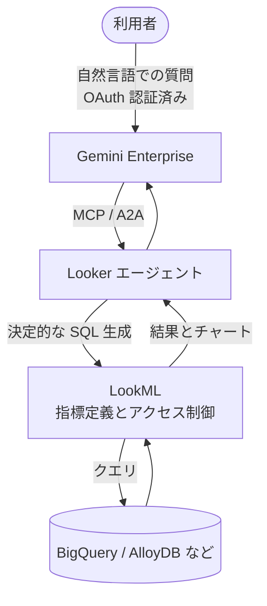

社内データに自然言語で質問できる仕組みを検討すると、必ず同じ壁にぶつかります。「その数字の定義は誰が決めたのか」と「その人はそのデータを見てよいのか」の2点です。

Google Cloud は、Looker のセマンティックレイヤーを Gemini Enterprise に接続する構成を公開しました。この構成の要点は、**LLM に SQL を書かせないこと**にあります。

この記事では、この統合が何を解決し、何を解決しないのかを整理します。読み終えると、自社に導入するかどうかを判断するための観点と、導入前に必要な準備の量が見積もれます。

対象読者は、社内 BI と生成 AI の接続を設計・意思決定する立場の方です。

*この記事の全体像。以下、順に解説します。*

## 何が繋がったのか

構成要素は3層に分かれます。

| 層 | 担当 | 具体例 |
|---|---|---|
| 対話 | 自然言語の解釈と応答 | Gemini Enterprise のチャット UI |
| 意味と権限 | 指標定義・アクセス制御・SQL 生成 | Looker（LookML） |
| データ | 実際の格納と実行 | BigQuery、AlloyDB など |

接続には Model Context Protocol（MCP）と Agent-to-Agent（A2A）が使われます。Gemini は「Looker というエージェントに問い合わせる」役割に徹し、データそのものには触れません。

## なぜ LLM に SQL を書かせないのか

一般的な NL2SQL は、LLM がスキーマを読んで SQL を組み立てます。この方式には構造的な弱点があります。

- 構文としては正しいが、業務定義としては誤った SQL が生成されうる
- 「売上」がどのテーブルのどの列を、どの条件で集計したものかは、スキーマだけでは決まらない
- 誤りが数値の形で出力されるため、読み手が誤りに気づきにくい

Looker 連携では、SQL 生成の責任を LookML に移します。指標の計算式・結合条件・フィルタはすべて LookML 側で定義済みであり、Gemini は「どの指標を、どの切り口で見たいか」を伝えるだけです。

結果として、LLM の確率的な出力は「意図の解釈」までに閉じ込められ、数値そのものは決定的に生成されます。

出力はテキストだけではありません。Looker が生成したインタラクティブなチャートが、そのままチャット UI 上に返ります。可視化のスタイルを LLM に再発明させない設計です。

## 権限はどこで効くのか

この構成の実務上の肝は、Gemini が独自の権限モデルを持たない点にあります。

- 利用者は OAuth で Looker に紐づく
- クエリは常に「質問した本人の権限」で実行される
- Looker の行レベルセキュリティ（RLS）と列レベルセキュリティ（CLS）がそのまま適用される

AI エージェントに強い権限を持たせて代理実行させる設計とは逆の発想です。エージェントに特権を与えると、権限管理の正本が二重化し、監査が破綻します。パススルー型はその分岐を作りません。

一方で、これは「Looker 側の権限設計が正しいこと」に全面的に依存する構成でもあります。RLS が緩い状態のまま自然言語インターフェースを開けば、これまで SQL を書けなかった層にも、緩い権限がそのまま開放されます。

## RAG と食い違ったらどうなるか

社内 Wiki や PDF を対象とした RAG と、Looker を同時に接続する構成は現実的にあり得ます。このとき「昨年度の売上」の答えが2系統から出る可能性があります。

Google Cloud の説明では、定義が厳密な指標について両者が矛盾した場合、LookML の定義が優先されます。Reranking を用いた評価ループにより、検証済みの権威あるソースがベクトル検索結果より高い引用優先度を得る仕組みです。

ただし、これは自動的に成立するものではありません。**LookML 側の記述が薄いと、そもそもマッピングに失敗します。**

たとえば LookML に `churn_rate` というメジャーがあっても、description が空でシノニムも未登録なら、「解約率を教えて」という質問がそのメジャーに到達しない可能性があります。到達しなければ、RAG が拾った古い社内文書の数字が答えとして返ります。構文エラーは起きず、それらしい数値だけが出るため、誤りが表面化しません。

## 導入前に見積もるべき制約

導入判断の前に確認すべき制約を整理します。

**クエリと計算の制約**

- 取得行数に上限があります（Google Cloud の記載では最大5,000行）。全件エクスポート的な用途には向きません
- Code Interpreter で使えるライブラリが限定され、地図系など一部の可視化は行えません
- 複数の Explore をまたぐ同時クエリは苦手とされ、データモデルの事前フラット化が求められます

**セキュリティ**

Looker および周辺の実行環境については、過去に SQL インジェクションや XSS、ブラウザ拡張機能の乗っ取りに関する脆弱性が報告されています。自然言語インターフェースを開くことは、BI の攻撃面を「SQL を書ける人」から「チャットを使える人」まで広げる行為でもあります。導入時は、利用するバージョンの公式アドバイザリを確認し、パッチ適用状況と設定管理を運用手順に組み込んでください。

**準備工数**

この統合はプラグアンドプレイではありません。既存 LookML に対する「AI 対応監査」が実質的な前提条件になります。

- 全ディメンション・メジャーへの自然言語 description の付与
- 業務用語のシノニム登録（「解約率」「チャーン」「離脱率」を同一メジャーへ寄せる、など）
- アクセスフィルタの棚卸しと不足分の追加

既存の LookML が長年の継ぎ足しで育っている場合、ここが最大のコストになります。

## 導入判断のチェックリスト

以下に該当数が多いほど、この構成の適合度が高くなります。

1. 主要 KPI の定義がすでに LookML に集約されている
2. Looker の RLS / CLS が現在の組織構造と一致している
3. 質問の大半が「既存の Explore の範囲内」で答えられる
4. 数千行を超える生データの取り出しが主用途ではない
5. 重要 KPI について、人による検証プロセスを運用に置ける

逆に、指標定義が各部門のスプレッドシートに散在している状態では、この統合を導入しても効果が出ません。**セマンティック層の整備が先で、AI 接続は後です。** 順序を逆にすると、整備されていない定義を AI が増幅して配る仕組みになります。

## 設計原則として残るもの

製品固有の話を除いて、この構成から取り出せる原則は3つです。

- **数値の定義は、確率的な層ではなく決定的な層に置く。** AI には「テキストを探させる」のではなく「定義済みの API を叩かせる」
- **権限の正本は1つにする。** エージェントに特権を持たせず、実行者の権限で通す
- **重要 KPI には人間の検証を残す。** 生成された SQL や計算は、影響の大きい指標ほど確認する

## まとめ

- Gemini Enterprise と Looker の統合は、LLM から SQL 生成の責任を外し、LookML に委ねる構成である
- 権限は Gemini 側で再定義されず、OAuth を通じて Looker の RLS / CLS を継承する
- RAG と併用しても LookML の定義が優先されるが、description とシノニムが薄いと到達自体に失敗する
- 行数上限・可視化ライブラリ・Explore 横断クエリに制約があり、用途を選ぶ
- 実質的な前提条件は LookML の AI 対応監査であり、ここが導入コストの中心になる

判断のポイントは製品選定ではなく、**自社の指標定義がすでに1か所に集まっているかどうか**です。集まっていないなら、まずそこから着手する方が投資対効果は高くなります。

この記事が少しでも参考になった、あるいは改善点などがあれば、ぜひリアクションやコメント、SNSでのシェアをいただけると励みになります！

## 参考リンク

- [Integrating Looker and Gemini Enterprise（Google Cloud Blog）](https://cloud.google.com/blog/products/business-intelligence/integrating-looker-and-gemini-enterprise/)
- [Model Context Protocol 公式サイト](https://modelcontextprotocol.io/)
