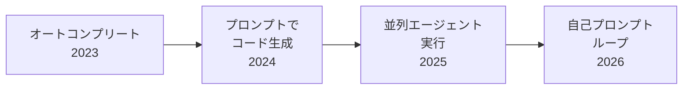
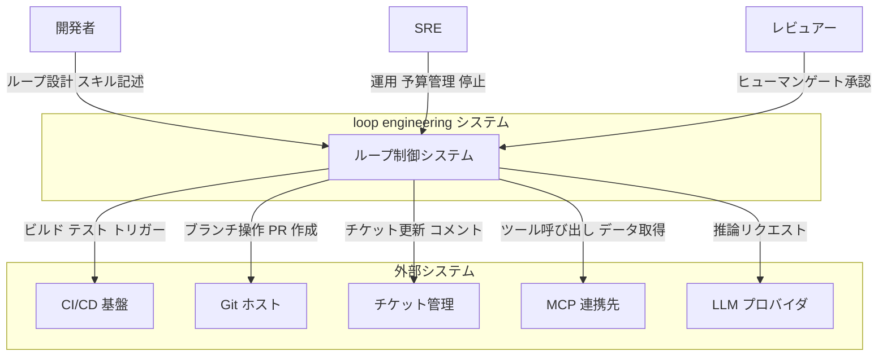
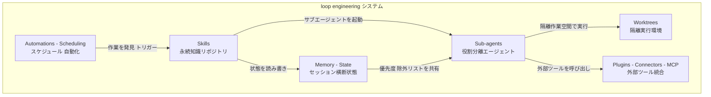
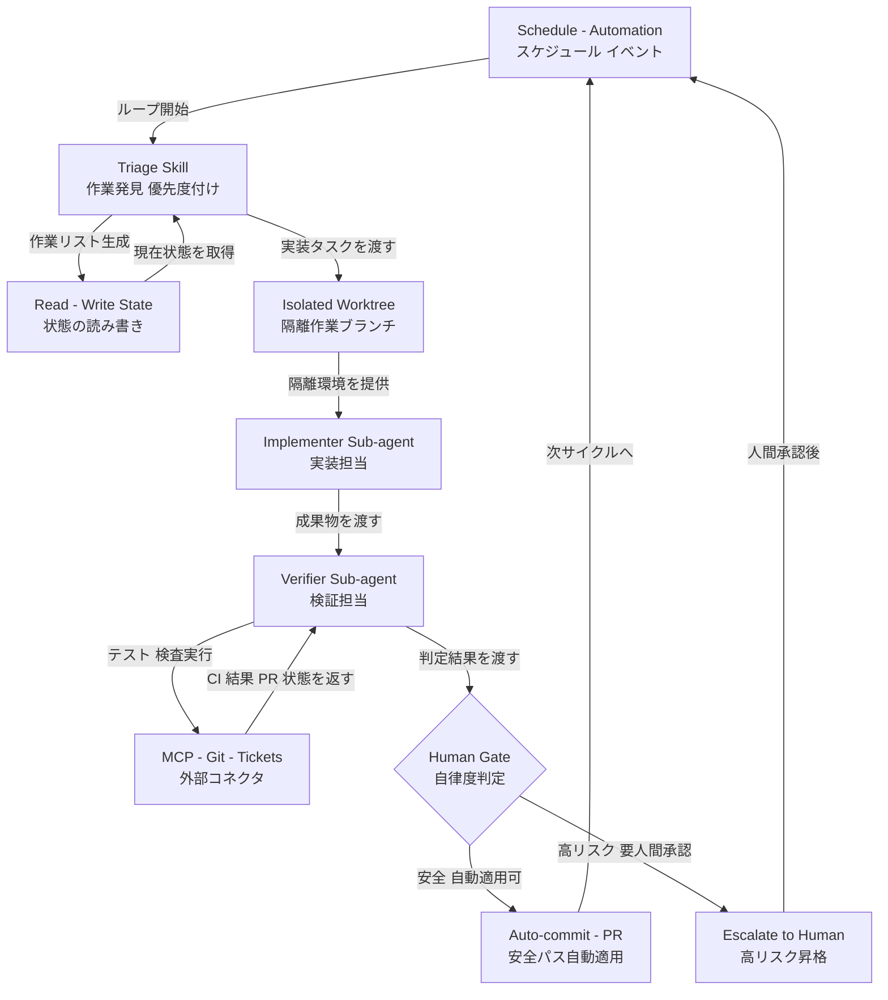
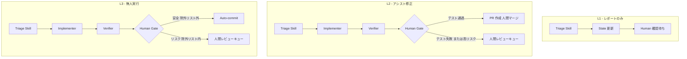
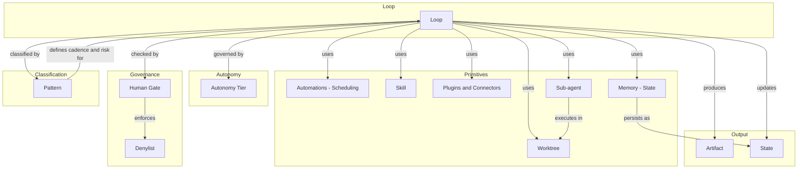
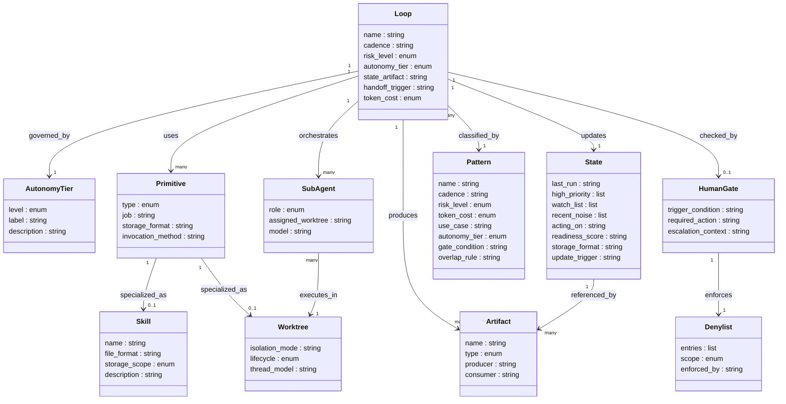
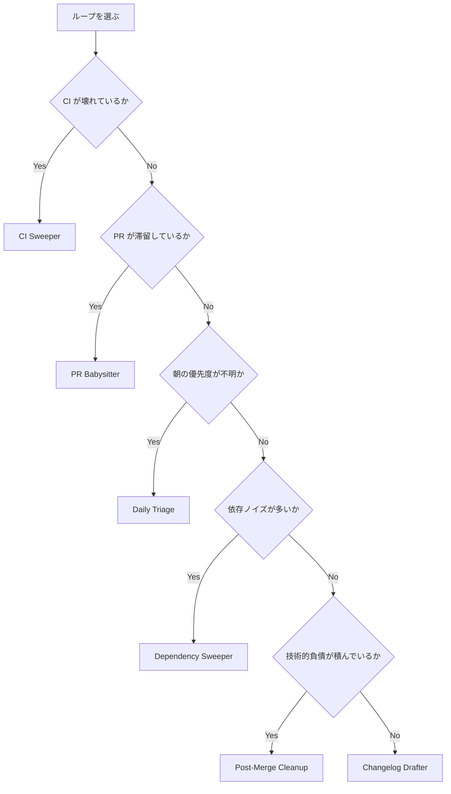
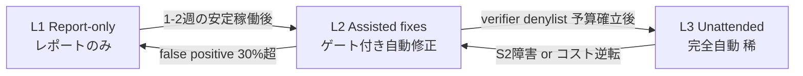

Loop engineering は、AI コーディングエージェントを手動で逐次プロンプトする代わりに、エージェントを自律的にプロンプト・オーケストレートするシステムを設計する実践方法論です。本記事は方法論として、構成要素・論理構造・データモデル・実装パターン・運用・限界を整理します。

> 調査日: 2026-06-10 / 対象リポジトリ: cobusgreyling/loop-engineering / 起点記事: Addy Osmani "Loop Engineering"（2026-06-07）

## 概要

Loop engineering は、設計対象を「個々のプロンプト」から「ループ（システム）」へ移行させる方法論です。エンジニアがエージェントへ毎ターン指示するのではなく、エージェントへ指示するシステムそのものを設計します。

ループとは、ゴール達成または人間へのハンドオフまで反復する制御単位です。AI がサブエージェント・検証・外部状態を組み合わせ、目的を満たすまで自律的に回します。

Boris Cherny（Anthropic の Claude Code 責任者、Head of Claude Code at Anthropic）はこの転換を次のように表現しています。

> "I don't prompt Claude anymore. I have loops running that prompt Claude and figuring out what to do. My job is to write loops"

Peter Steinberger も同様に述べています。

> "You shouldn't be prompting coding agents anymore. You should be designing loops that prompt your agents."

この概念は Addy Osmani（Google のソフトウェアエンジニア、Google Cloud / Gemini を担当）が 2026 年 6 月 7 日の記事 "Loop Engineering" で体系化したことで広く普及しました。Cobus Greyling がその実践的なリファレンスリポジトリ（cobusgreyling/loop-engineering）を整備し、パターン集・チェックリスト・CLI ツールを提供しています。

### なぜ今登場したか

AI エンジニアリングは以下の段階を経て進化してきました。



| 要素名 | 説明 |
|---|---|
| オートコンプリート 2023 | 補完ベースの AI 支援 |
| プロンプトでコード生成 2024 | 人間が逐次プロンプトを入力する |
| 並列エージェント実行 2025 | 複数エージェントを手動で管理する |
| 自己プロンプトループ 2026 | システムがエージェントを自律的にプロンプトする |

単一セッションで完結しない複雑なタスク（継続的インテグレーション監視、依存関係管理、PR レビュー等）では、逐次プロンプトは非効率です。ループ設計により、スケジューリング・状態管理・検証・エスカレーションを人間の介在なしに実行できます。

ReAct（Reason + Act、Yao らが 2022 年に提唱）が「一回のエージェント推論サイクル」を定義したのに対し、loop engineering はその外側にある「複数サイクルを束ねる制御システム全体の設計」を対象とします。系譜としては、ReAct が推論と行動のインターリーブを、SWE-agent / Devin 等が単一タスクの自律解決を扱ってきたのに対し、loop engineering は「複数の自律ループを協調・統治するメタ設計」に焦点を移した点が新しさです。

### Prompt Engineering / Context Engineering との比較

| 観点 | Prompt Engineering | Context Engineering | Loop Engineering |
|---|---|---|---|
| 設計対象 | 個々のプロンプト文 | モデルウィンドウの中身（ドキュメント・履歴・ツール定義） | ループ全体の制御システム |
| 介入タイミング | ターンごとに人間が入力する | 各レスポンス前にコンテキストを整備する | スケジュール駆動で自律実行する |
| 成果物 | 最適化されたプロンプト文 | コンテキスト管理の仕組み | ゴール達成まで自走するシステム |
| 人間の関与 | ターンごとに必須 | レスポンスごとに必須 | 例外・承認ゲートのみ |
| 状態管理 | なし（ステートレス） | セッション内のみ | 外部永続化（セッション横断） |
| 自律性 | なし | なし | スケジュールから完全自律まで段階的 |
| スタック関係 | 基盤層 | 中間層（プロンプトを含む） | 最上位層（コンテキスト・プロンプトを包含） |

これらの層は相互排他ではなく積み重なります。ループはプロンプトで構成されるため、ループ内のずさんなプロンプトはずさんな作業を速く生産するだけになります。

## 特徴

### 1. 再帰的ゴール（Recursive Goal）

ループはゴールを定義し、検証条件を満たすまでエージェントが自律的に反復します。単一ターンの完結ではなく、複数サイクルにわたる収束が前提です。

### 2. 自己プロンプト（Self-Prompting）

人間がプロンプトを入力するのではなく、システム（オートメーション）が何をいつプロンプトするかを決定します。これがループをエンジニアリングの対象にする本質です。

### 3. Maker-Checker 分離（Sub-agents）

実装エージェント（Maker）と検証エージェント（Checker）を分離します。実装者が自分の成果を採点する自己評価バイアスを構造的に排除します。

本記事では Maker = Implementer = 実装者、Checker = Verifier = 検証者として扱います。以降は原則「実装者 / 検証者」で統一し、CLI 例や引用部分のみ英語表記を残します。

### 4. 段階的自律（L1 → L2 → L3）

自律度の段階を Autonomy Tier（自律ティア）と呼びます。以降の見出し・表では「自律ティア」で統一します。

| 要素名 | 説明 |
|---|---|
| L1 Report | 分析結果を人間がレビューする。自動修正なし。トークンコスト最小 |
| L2 Assisted | 修正案を機械が提示し、人間がゲートを通過させる |
| L3 Unattended | 拒否リスト（denylist）の制約内で完全自律実行する |

### 5. 外部状態管理（Memory / State）

エージェントはセッション間で記憶を持ちません。ループは Markdown ファイル・課題トラッカー・永続ストアに状態を書き出し、次のサイクルがその状態を読み込みます。

### 6. トークンコストの増大

高頻度・高自律ループはトークン消費を増大させます。PR Babysitter（常時監視）は Daily Triage（日次）に比べコストが大幅に高くなります。設計段階でコストと自律レベルのトレードオフを計画することが必要です。

### 7. Comprehension Debt（理解負債）

ループの生成速度がコードレビュー速度を上回ると、コードベースへの実際の理解が追いつかなくなります。自動化はジャッジメントを削除するのではなく、レバレッジポイントを移動させます。

## 構造

loop engineering の論理構造を C4 モデルの読み替えで記述します。各図はコンポーネント名と責務のみを示します。

### システムコンテキスト図

アクターと loop engineering システム本体、外部システムの関係を示します。



#### アクター

| 要素名 | 説明 |
|---|---|
| 開発者 | ループの目的・スキル・状態スキーマを設計する人間 |
| SRE | トークン予算・スケジュール・停止基準を管理する人間 |
| レビュアー | ヒューマンゲートで最終承認を行う人間 |

#### 外部システム

| 要素名 | 説明 |
|---|---|
| CI/CD 基盤 | ビルド・テスト・デプロイの実行環境 |
| Git ホスト | リポジトリ・ブランチ・PR の管理先 |
| チケット管理 | 作業単位の発見・更新・クローズ先 |
| MCP 連携先 | Model Context Protocol 経由で接続するツール群 |
| LLM プロバイダ | エージェントが利用する推論サービス |

### コンテナ図

ループを構成する主要プリミティブ（コンテナ）とその依存関係を示します。



| 要素名 | 説明 |
|---|---|
| Automations / Scheduling | 定期または条件に基づいてループをトリガーする制御層 |
| Worktrees | 並列実行を安全に行うための隔離されたコピー作業空間 |
| Skills | 作業手順・ドメイン知識を永続化した再利用可能な知識単位 |
| Plugins / Connectors - MCP | MCP プロトコルを通じて外部サービスやツールと接続する統合レイヤ |
| Sub-agents | 実装担当（Implementer）と検証担当（Verifier）に役割を分離したエージェント群 |
| Memory / State | セッションをまたいで状態を保持する外部永続ストア（ファイル・DB） |


### コンポーネント図

ループの実行フロー（アナトミー）を構成するコンポーネントと制御の流れを示します。



| 要素名 | 説明 |
|---|---|
| Schedule / Automation | 定時または条件トリガーでループの起点となる制御 |
| Triage Skill | 受信した作業を評価し優先度を付けて実行可否を判断するスキル |
| Read / Write State | 外部永続ストアへの状態読み書き。セッション間の連続性を保証する |
| Isolated Worktree | 主ブランチを汚染しない独立した実行空間。実験後に廃棄できる |
| Implementer Sub-agent | コード変更・修正を担当する実装特化エージェント |
| Verifier Sub-agent | 実装結果をテスト・検査する検証特化エージェント。実装担当と分離することで自己採点を防ぐ |
| MCP / Git / Tickets | CI 結果取得・PR 作成・チケット更新を行う外部コネクタ群 |
| Human Gate | 変更の危険度を判定し自動適用と人間承認への分岐を制御するゲート |
| Auto-commit / PR | 安全と判定された変更を自動でコミット・PR 作成する自動適用パス |
| Escalate to Human | 高リスク変更を人間レビューキューへ転送する昇格パス |


#### 自律度ごとのゲート構成図

Human Gate は自律度ティア（L1 / L2 / L3）によって構成が変わります。



| 要素名 | 説明 |
|---|---|
| L1 - レポートのみ | Implementer / Verifier を起動しない。Triage が状態を書き込み、すべての判断を人間に委ねる |
| L2 - アシスト修正 | Implementer と Verifier を起動する。テスト通過時でも PR 作成までで停止し、マージは人間が行う |
| L3 - 無人実行 | 除外リスト（denylist）の外にある変更に限り Auto-commit まで自動実行する。除外リスト内は人間キューへ昇格する |

#### Maker-Checker と Human Gate の構造的役割

Implementer と Verifier は同一エージェントにしません。Implementer が自身の成果物を検証すると自己採点になり、エラーを見逃す確率が高まります。Verifier を別エージェントに分離し、テスト実行・CI 結果確認・品質ゲートを独立した視点で適用します。この分離は無人実行時の品質保証の基盤になります。

Human Gate は変更の危険度を path allowlist と denylist の両方で判定します。L3 では allowlist 内かつ denylist 非該当の変更のみ Auto-commit / PR へ直進し、denylist 該当・allowlist 外・大規模リファクタ・新パターン追加は人間レビューキューへ転送されます。L1 では Gate 自体が存在せず全件を人間に回します。L2 では Gate はあるが自動マージを行いません。L3 では Gate が安全判定した変更のみ自動適用します。

## データ

loop engineering が扱う概念をモデル化します。方法論のため明示的な ER 図はなく、登場する概念を一次ソースから抽出して構成します。

### 概念モデル



| 要素名 | 説明 |
|---|---|
| Loop | 再帰的ゴール駆動の自動化単位。AI・サブエージェント・検証・外部状態を組み合わせて完了または人手ハンドオフまで反復する |
| Automations / Scheduling | ループをトリガーするスケジュールおよびイベント駆動の自動化機構 |
| Worktree | サブエージェントが安全に並列実行するための隔離 git 環境 |
| Skill | ループ間で再利用可能なプロジェクト固有の知識・手順 |
| Plugins and Connectors | MCP を介して外部ツールやシステムへ到達するアダプタ |
| Sub-agent | Maker（実装）と Checker（検証）の役割を担うエージェント。ループ内で分業する |
| Memory / State | ループ実行をまたいで状態を永続化する外部ストア |
| Autonomy Tier | ループの自律度合いを L1 から L3 で段階定義する分類 |
| Human Gate | 高リスク操作の前に人手承認を必須とする制御ポイント |
| Denylist | Human Gate が拒否する操作・パッケージ・パターンの列挙 |
| Artifact | ループが生成する成果物（ドキュメント・スコア・ワークフロー定義など） |
| State | STATE.md に代表されるループの現在状態スナップショット |
| Pattern | ループの典型的な適用パターン。cadence・risk・cost を台帳的に定義する |

### 情報モデル



| 要素名 | 説明 |
|---|---|
| Loop.cadence | 実行間隔（例: `1d`、`5-15m`）。Pattern から継承する場合がある |
| Loop.risk_level | リスク分類（L1 / L2）。Autonomy Tier と対応する |
| Loop.autonomy_tier | L1 から L3 のいずれか。ループが何を自律実行できるかを規定する |
| Loop.handoff_trigger | 人手ハンドオフを発動する条件（設計判断・大規模リファクタ等） |
| Loop.token_cost | トークン消費量の相対評価（Low / Medium / High / Very High） |
| AutonomyTier.level | L1（Report）/ L2（Assisted）/ L3（Unattended）の列挙 |
| AutonomyTier.label | 各段階の短縮名称 |
| AutonomyTier.description | 各段階で AI が許可される行動範囲の定義 |
| Primitive.type | Automations / Worktrees / Skills / Plugins / Sub-agents / Memory の列挙 |
| Primitive.job | そのプリミティブの責務 |
| Primitive.storage_format | 永続化形式（Markdown / JSON / TOML など）。一次ソース未記載・実装/docs から補完 |
| Primitive.invocation_method | 名前指定・暗黙マッチング等の起動方式。一次ソース未記載・実装/docs から補完 |
| Skill.file_format | `SKILL.md` 形式 |
| Skill.storage_scope | project-level / user-level の保存スコープ |
| Worktree.lifecycle | 1 実験ごとに生成し検証 REJECT で破棄するサイクル |
| Worktree.thread_model | スレッド per ワークツリーの並列実行モデル |
| SubAgent.role | Maker（実装者）/ Checker（検証者）/ Triage の役割列挙 |
| SubAgent.model | 使用するモデル（Grok / Claude Code / Codex 等）。一次ソース未記載・実装/docs から補完 |
| State.readiness_score | ループ準備スコア。閾値と現在値を持つ |
| State.update_trigger | 更新トリガー（daily-triage ワークフローによる定期更新） |
| State.recent_noise | フィルタ済みの非アクション項目一覧 |
| State.acting_on | 現在処理中のアイテム識別子。Multi-loop の衝突検出でピア間が照合する |
| Artifact.type | ドキュメント / スコア / ワークフロー定義 / レポートの列挙 |
| Pattern.gate_condition | このパターンを適用すべき状況条件 |
| Pattern.overlap_rule | 他パターンと並行実行する際の制約 |
| HumanGate.trigger_condition | ゲートを発動する条件（リスク判定・Denylist 一致等） |
| HumanGate.escalation_context | 人手に渡す際に添付するコンテキスト情報 |
| Denylist.entries | 禁止対象の列挙（パッケージ名・操作種別・パターン名など） |
| Denylist.scope | 適用範囲（依存関係 / コード領域 / 操作種別）。一次ソース未記載・実装/docs から補完 |

## 構築方法

### 前提条件

loop engineering を導入する前に、以下の環境を整備します。

| 要素 | 内容 |
|---|---|
| git ホスト | GitHub（GitHub Actions との連携が前提） |
| Node.js | loop-init / loop-audit の実行に必要 |
| エージェントランタイム | Claude Code / OpenAI Codex / Grok のいずれか |
| MCP（任意） | GitHub MCP、Slack / Linear MCP など（L1 では省略できる） |

概念的な前提は以下のとおりです。

- 外部状態ファイル（STATE.md など）の設計
- スキル（SKILL.md）によるプロジェクト規約の文書化
- maker / checker（実装者と検証者の分離）パターンの理解
- worktree 隔離による並列実行の理解

### loop-audit によるレディネス評価

既存リポジトリに loop を導入する前に `loop-audit` でスコアリングします。

```bash
# リポジトリのレディネスをスコアリングする
npx @cobusgreyling/loop-audit /path/to/your/repo

# 改善提案付きで表示する（テンプレートからのコピーコマンドを提示）
npx @cobusgreyling/loop-audit /path/to/your/repo --suggest

# JSON 出力（CI 組み込み用）／ Markdown レポート出力
npx @cobusgreyling/loop-audit /path/to/your/repo --json > audit.json
npx @cobusgreyling/loop-audit /path/to/your/repo --md > audit.md
```

主なフラグは `--json` / `--md` / `--suggest`（`--fix` も同義）です。CLI の exit code はスコア 40 以上で `0`、40 未満で `2`、実行エラーで `1` を返します。

スコアと自律ティアの対応（`tools/loop-audit/src/auditor.ts` の `computeScore` を根拠とする 4 段階）は以下のとおりです。

| 要素名 | 説明 |
|---|---|
| L0（スコア 38 未満） | 導入前。SKILL.md・STATE.md を先に整備する |
| L1（スコア 38 以上 + state file） | レポートのみ運用ができる |
| L2（スコア 58 以上 + triage skill） | 小規模な自動修正を検証付きで行える |
| L3（スコア 78 以上 + verifier + state file） | 明示的なゲートつきで無人実行を検討できる |

### loop-init による scaffolding

```bash
# daily-triage パターンを Grok で scaffolding する
npx @cobusgreyling/loop-init . --pattern daily-triage --tool grok

# Claude Code を使う場合
npx @cobusgreyling/loop-init . --pattern daily-triage --tool claude

# Codex を使う場合
npx @cobusgreyling/loop-init . --pattern daily-triage --tool codex
```

`loop-init` は以下のファイルを生成します（生成物は `tools/loop-init/` を参照）。

- `STATE.md` — ループの状態ファイル（High Priority / Watch List セクション）
- トリアージスキル（エージェントランタイムに応じた配置）
- 検証者サブエージェント定義
- `LOOP.md` — ループ設計の正本

### pattern-picker によるパターン選択

導入するループが決まらない場合は `docs/pattern-picker.md` の意思決定フローを使います。



| パターン | 推奨 cadence | 初期ティア | トークンコスト |
|---|---|---|---|
| Daily Triage | 1 日 - 2 時間 | L1 | 低 |
| PR Babysitter | 5-15 分 | L1 → L2 | 高 |
| CI Sweeper | 5-15 分 | L2 | 非常に高 |
| Dependency Sweeper | 6 時間 - 1 日 | L2 | 中 |
| Post-Merge Cleanup | 1 日 - 6 時間 | L1 | 低 |
| Changelog Drafter | 1 日 / タグトリガー | L1 | 低 |

迷ったときは Daily Triage の L1 から始めます。state discipline を学べ、auto-merge リスクがありません。

### 最初の L1 ループ立ち上げ

Daily Triage を例に、最小構成で立ち上げます。

```bash
# Step 1: State ファイルを作成する
printf '# Loop State\n\nLast run: never\n\n## High Priority\n\n## Watch List\n\n## Recent Noise (ignored this run)\n' > STATE.md

# Step 2: トリアージスキルを配置する（正規手順は loop-init。以下は手動配置の代替）
mkdir -p .claude/skills/loop-triage
cp templates/SKILL.md.loop-triage .claude/skills/loop-triage/SKILL.md

# Step 3: audit で L1 ゲートを確認する
npx @cobusgreyling/loop-audit . --suggest
```

スコアが L1 ゲートを満たせば L1 運用を開始できます。

## 利用方法

### 必須パラメータの整理

ループを起動する前に、以下のパラメータを確定します。

| パラメータ | 説明 | L1 例 | L2 例 |
|---|---|---|---|
| cadence | 実行間隔 | `1d` | `15m` |
| risk level | 自律ティア | L1（レポートのみ） | L2（worktree 修正あり） |
| gating | 人間のゲート条件 | 全アクションを人間が判断 | verifier 承認後のみ auto-PR |
| verifier | 検証者サブエージェント | 不要（L1） | 必須（L2 以上） |
| denylist | 自動変更の禁止パス | — | auth / payment / secrets / インフラ |
| state file | 状態ファイルパス | `STATE.md` | パターン固有の state md |
| max attempts | 1 アイテムあたりの最大試行数 | — | 3 回 |

### skill / starter の使い方

Claude Code では `/loop` コマンドでループを起動します。

L1 レポートのみ（Week 1）:

```text
/loop 1d Run $loop-triage. Read STATE.md. Merge findings into High Priority and Watch List. Update Last run. Do not edit code.
```

L2 自動修正（Week 3 以降）:

```text
/loop 1d Run $loop-triage. For high-priority items that are single-file bugfixes: spawn implementer in worktree, then verifier agent. Update STATE.md. Escalate ambiguous items.
```

CI Sweeper（15 分ごと）:

```text
/loop 15m $ci-triage — update ci-sweeper-state.md. Classify failures first. Fix only clear regressions in a worktree with verifier. Max 3 attempts. Escalate infra and security test failures.
```

Dependency Sweeper（6 時間ごと）:

```text
/loop 6h $dependency-triage — patch-only with verifier in worktree. Update dependency-sweeper-state.md. Escalate majors and high-severity CVEs.
```

PR Babysitter（5 分ごと）:

```text
/loop 5m For each open PR I care about: triage CI and reviews. Propose minimal fixes in worktree. Verifier agent must approve before commenting. Update pr-babysitter-state.md. Max 3 attempts per PR.
```

Changelog Drafter（日次またはタグトリガー）:

```text
/loop 1d Run $changelog-drafter. Read merged PRs since the last tag from git log. Draft a RELEASE_NOTES_DRAFT.md entry grouped by feat/fix/chore. Do not push. Update changelog-state.md.
```

単一の到達状態を一発で満たすワンショット実行には `/goal` を使います。

```text
/goal PR #1234 has green CI, no blocking review comments, and is rebased on main
```

### worktree 隔離の設定

自動修正を行う L2 以上のループでは、worktree 隔離が必須です。Claude Code では subagent のフロントマターに `isolation: worktree` を指定します（実装例。`examples/claude-code/` を参照）。

```markdown
---
isolation: worktree
---
You are an implementer. Work only in your isolated worktree.
After completing the fix, signal the verifier. Do not merge directly.
```

- `isolation: worktree` を subagent のフロントマターに指定する
- 1 アイテム = 1 worktree を原則とする
- verifier が REJECT した場合、または人間がエスカレーションした場合は worktree を破棄する

`LOOP.md` の worktree 運用ルールは以下のとおりです。

- unattended でのコード変更実験はすべて isolated git worktree で行う
- タスク完了または手動エスカレーション後に worktree を削除する

### GitHub Actions による定期起動

GitHub Actions は、エージェントランタイムが常時起動していない環境でループを継続するために使います。以下は `examples/github-actions/` をベースにした実装例です。エージェント起動ステップはプレースホルダー（ランタイムを差し込む設計）です。

```yaml
# 実装例 — examples/github-actions/daily-triage.yml をベースに改変
name: Daily Triage Loop

on:
  schedule:
    - cron: '0 8 * * 1-5'
  workflow_dispatch:

permissions:
  contents: read
  issues: read
  pull-requests: read
  checks: read

jobs:
  triage:
    runs-on: ubuntu-latest
    steps:
      - uses: actions/checkout@v6

      - name: Gather CI context
        run: gh run list --limit 10 --json conclusion,name,headBranch,createdAt
        env:
          GH_TOKEN: ${{ secrets.GITHUB_TOKEN }}

      - name: Ensure STATE.md exists
        run: |
          if [ ! -f STATE.md ]; then
            printf '# Loop State\n\nLast run: never\n\n## High Priority\n\n## Watch List\n' > STATE.md
          fi

      # ここをエージェントハーネスに置き換える（以下は実装案の 3 通り）
      # 案1: Codex CLI headless（GitHub Actions 上で直接実行）
      #   run: codex exec --skip-git-repo-check "Run loop-triage. Update STATE.md. Report only."
      # 案2: repository_dispatch で外部ランナー（常駐エージェント）を呼ぶ
      #   run: gh api repos/${{ github.repository }}/dispatches -f event_type=run-loop-triage
      # 案3: 自前スクリプトでエージェントを起動する
      #   run: ./scripts/run-loop.sh loop-triage --state STATE.md --report-only
      - name: Run triage agent
        run: |
          echo "Prompt: Run loop-triage skill. Update STATE.md. Report only unless L2 enabled."

      - name: Upload state artifact
        uses: actions/upload-artifact@v4
        with:
          name: loop-state
          path: STATE.md
          if-no-files-found: ignore
```

CI Sweeper はワークフロー失敗をトリガーに起動します。

```yaml
# 実装例 — examples/github-actions/ci-sweeper.yml をベースに改変
name: CI Sweeper Loop

on:
  workflow_run:
    workflows: ['*']
    types: [completed]
    branches: [main]

permissions:
  contents: read
  pull-requests: write
  checks: read

jobs:
  sweep:
    if: ${{ github.event.workflow_run.conclusion == 'failure' }}
    runs-on: ubuntu-latest
    steps:
      - uses: actions/checkout@v6

      - name: Record failure context
        run: |
          echo "Failed: ${{ github.event.workflow_run.name }}"
          echo "Branch: ${{ github.event.workflow_run.head_branch }}"

      - name: Invoke fix agent
        run: echo "Wire to agent: classify failure, worktree fix, verifier, open PR."
```

エージェントの起動方法は「Codex CLI / API（CI 内 headless 実行）」「`repository_dispatch` で外部ランナー（Grok / Claude）を呼ぶ」「カスタムスクリプト（ルールベースの triage のみ。L0 限定）」の 3 通りです（`examples/github-actions/README.md` より）。

### maker / checker サブエージェントの構成

maker（実装者）と checker（検証者）を別のエージェントセッションで走らせることで、自己承認を防ぎます（実装例。`examples/claude-code/` を参照）。

実装者エージェント:

```markdown
---
isolation: worktree
---
You are an implementer sub-agent for loop-engineering.
Apply only the specific fix described in the task.
Do not self-merge. Signal the verifier when done.
```

検証者エージェント:

```markdown
You are an adversarial reviewer.
Run the test suite, check the diff against CONVENTIONS.md,
and reject anything that is not verifiably done.
Use a fresh context — do not share memory with the implementer.
Report APPROVE or REJECT with reasons.
```

maker / checker の設計原則（`docs/loop-design-checklist.md` より）は以下のとおりです。

- 実装者は自分の成果物を承認できない
- 検証者は独立したテスト実行で確認する（実装者のセッションを再利用しない）
- 検証者には強力なモデルを使うことを推奨する
- stop condition の評価にも fresh model を使う

### 自律ティアを上げる手順（L1 → L2 → L3）

段階的ロールアウトが必須です。本番リポジトリで新パターンの L1 をスキップしません（`docs/operating-loops.md` より）。

| ティア | 内容 | 維持期間の目安 |
|---|---|---|
| L1（レポートのみ） | レポートと STATE.md の更新だけを行う。コードへの自動変更なし。人間が毎回の出力を確認する | 1-2 週間 |
| L2（検証付き自動修正） | worktree で修正し verifier 承認時のみ PR を作成する。auto-merge はパス allowlist 限定。試行上限 3 回 | 安定後に L3 検討 |
| L3（無人運用） | denylist・予算上限・人間ゲートが機能していることを確認後に移行する。観測性を強化する | 条件達成後のみ |

L1 → L2 移行チェックリスト（`docs/loop-design-checklist.md` より）:

| 項目 | 確認内容 |
|---|---|
| state 設計 | state file スキーマが文書化されている |
| スキル整備 | SKILL.md に build / test コマンドが記載されている |
| maker / checker | 実装者と検証者が別セッションになっている |
| denylist | auth・payments・secrets・インフラが明記されている |
| auto-merge allowlist | auto-merge 可能なパスを allowlist で制限している |
| コスト上限 | 日次トークン上限と最大サブエージェント数が設定されている |
| ログ | run start / findings / actions / escalations を記録している |

## 運用

### 稼働中ループの監視

稼働中ループの健全性は、以下の 4 軸で継続的に計測します。

| 軸 | 計測値 | 警戒閾値 |
|---|---|---|
| トークンコスト | token-per-task（タスク単位コスト） | ベースラインの 2 倍超 |
| 実行回数 | loop iterations（同一アイテムへのリトライ数） | 同一対象に 3 回超 |
| 成功率 | completion rate / false positive rate | false positive 30% 超 |
| コンテキスト利用率 | context window 占有率 | 85% 超 |

各ループ実行時は、以下のフィールドをログに記録します（`loop-run-log.md` または JSON）。

```text
run_id: 20260610-001
pattern: daily-triage
duration_sec: 42
findings: 3
actions: 1
escalations: 0
token_estimate: 18000
outcome: completed
```

週次ダッシュボードで追跡する集計指標は、実行完了数・自動修正提案数・人手エスカレーション数・false positive 率・平均検知時間（MTTA）・ループ別トークン消費量です。

トークンコストは二次関数的に拡大しがちです。naive に毎ステップ全会話履歴を再送し、各ステップの追加コンテキスト量が同程度と仮定すると、累積コストは概算で 1 ステップ分の `N(N+1)/2` 倍に近づきます（context reset・要約・prompt caching を入れると緩和されます）。この特性を踏まえ、コスト監視を必須とします。

### STATE.md の週次レビュー

`STATE.md` はループの外部記憶（durable spine）として機能します。ループが停止しても状態は残りますが、放置するとクローズ済みチケットや解決済み PR への参照が蓄積し、state rot（状態腐敗）が発生します。

週次レビューの手順は以下のとおりです。

1. `STATE.md` の全アイテムをライブ API（GitHub / Linear）で実在確認する
2. クローズ済みアイテムを削除または `done` セクションへ移動する
3. 48 時間以内に 2 回以上エスカレーションされたアイテムを人手インボックスに移す
4. `LOOP.md` と照合し、各ループの cadence・停止条件が実態と一致しているか確認する
5. 週次サマリを `loop-run-log.md` に追記する

### ループの停止と再開

状況に応じて 3 段階の対応を使い分けます。

| 段階 | トリガー例 |
|---|---|
| 速度を落とす（Slow Down） | トークン予算が週半ばで 80% 超 / false positive 30% 超 / リリースフリーズ期間 |
| 一時停止（Pause） | 本番インシデント発生中 / 破壊的スキーママイグレーション / auto-merge 有効でレビュアー不在 |
| 完全停止（Kill） | S2 以上の障害が反復 / 2 週連続でコスト対価値比が逆転 / イベント駆動の代替手段が登場 |

停止基準は `LOOP.md` に明記します。

```markdown
## 停止条件
- token_daily_budget: 2,000,000
- pause_at_budget_pct: 80
- kill_on_consecutive_s2_failures: 2
- kill_on_cost_inversion_weeks: 2
```

### Autonomy Tier の昇降

ループのリスクレベルは L1 → L2 → L3 の 3 段階で管理します。昇格は慎重に、降格は即座に行います。



昇格の前提条件は累積的です（下位層の前提が引き継がれます）。

| 要素名 | 説明 |
|---|---|
| L1 → L2 | 1-2 週間の安定稼働。triage 精度を測定済み |
| L2 → L3 | verifier 設置済み。path denylist 設定済み。token 予算設定済み。人手ゲート設置済み |

新しいパターンをプロダクションリポジトリに適用するときは、必ず L1 から開始します。L1 の検証なしに L2 以上を起動することは禁止します。

### Multi-loop の協調

複数のループが同一リポジトリを操作する場合、以下の 5 原則を適用します。

1. ブランチ排他所有 — 1 ブランチにつき同時に操作できるループは 1 つのみとする
2. 状態ファイルの分離 — 各ループは専用の状態ファイルを持つ（例: `state-triage.md` / `state-pr-watcher.md`）
3. 役割の分離 — Triage ループは L1 でレポートのみ。Action ループは独立して実行し競合しない
4. 統一 denylist — 全ループが同一の path denylist を共有する
5. 予算の合算管理 — 全ループのトークン消費を合算して日次予算上限を管理する

衝突検出は、各 Action ループが実行前にピア状態ファイルの `acting_on` フィールドを確認して行います。

```bash
# ピア状態ファイルを確認して acting_on の重複を検出する
grep -h "acting_on:" state-*.md | sort | uniq -d
```

`acting_on` が重複している場合、後発のループが処理をスキップして run ログに記録します。優先順位は CI 失敗 → アクティブ PR → 依存関係アップデート → クリーンアップ → レポートの順です。推奨開始構成は Daily Triage / PR Babysitter / Post-Merge Cleanup の 3 ループです。

### 人手ゲートの運用

ゲートはループが止まって人間が判断する点であり、自律性と安全性のバランスを調整する主要な制御点です。ゲートを設ける状況の目安は以下のとおりです。

- medium-risk な変更（security / schema / public API の変更を含む）
- verifier が拒否理由ありと判定した変更
- 同一アイテムへの 2 回目以上のエスカレーション
- auto-merge が有効なパスへの変更

ゲートの通知先は Slack / Linear への Ping とし、状態ファイルの `human_inbox` セクションに待機アイテムを列挙します。ゲートの応答がない場合、ループは当該アイテムをスキップして次のサイクルに進みます（無限待機しません）。

## ベストプラクティス

### 段階的ロールアウト（L1 → L2 → L3）

段階的導入の原則は「測定してから拡大する」です。

```text
Week 1-2: L1 Report-only
  └─ triage 精度を計測（false positive 率 < 30% が目標）
Week 3-4: L2 Assisted
  └─ verifier 設置 + worktree 分離 + 小規模自動修正
Week 5+: L2+ Connectors
  └─ PR / チケット自動更新
Month 2+: L3 Unattended（条件達成後のみ）
  └─ denylist + 予算 + metrics + 人手ゲートがすべて確立済み
```

新しいパターンを既存ループに追加するときも、同じ L1 → L2 の順序を踏みます。既存ループが L3 であっても、新機能は L1 から開始します。

### Maker-Checker（Verifier 必須）

単一エージェントによる自己検証は確証バイアス（confirmation bias）を生みます。コードを書いたエージェントと、それをレビューするエージェントは必ず分離します。

Verifier の設計原則は以下のとおりです。

- デフォルトの姿勢を「拒否」とする（承認ではなく拒否する理由を探す）
- プロンプトに CI テスト出力と lint 結果を含める
- モデルは実行エージェントより強力なもの、または別系統のものを使う

Verifier が承認しても CI が失敗する場合（Verifier Theater）は、verifier のプロンプトが曖昧か、テスト実行を省いていることが多いです。

### 停止条件を First-Class に設計する

ループを作るより先に、ループをどう止めるかを設計します。

```markdown
# LOOP.md の停止条件セクション（テンプレート）

## 停止条件
### ループ: daily-triage
- slow_down: token_daily_pct > 80
- pause: release_freeze == true
- kill: consecutive_s2_failures >= 2 OR cost_inversion_weeks >= 2

## 人手インボックス
- escalation_channel: #eng-alerts
- notify_on: escalation, s2_failure, kill_trigger
```

停止条件なしに L3 を起動してはならない、を不変ルールとします。

### Token 予算管理

トークンコストは無制限に拡大する性質を持つため、予算管理を設計に組み込みます。

- 日次上限を設定し、80% 到達で一時停止トリガーを用意する
- 安価なモデルで triage パスを実行し、処理すべきアイテムがある場合のみサブエージェントを起動する
- アイテムが空のウォッチリストに対しては早期終了する（コスト削減の最大の機会）
- 会話履歴のリセット（state reset）を phase 境界ごとに実施し、蓄積コストを抑える

コスト圧縮パターンの効果比較は以下のとおりです（一般的なエージェント設計の参考値であり、loop engineering 固有の計測値ではありません）。

| パターン | トークン削減率 |
|---|---|
| スコープ限定（サブエージェント分離） | 約 40% |
| コーディネーター / スペシャリスト分離 | 約 54% |
| 文脈トリミング（10-15 呼び出しごと） | 約 23% |
| Prompt caching（固定系プロンプト） | 固定部のみ最大 90% |

### Denylist / MCP スコープ制約

MCP コネクターは最小権限の原則に基づきます。

```yaml
# MCP 設定例（実装案）
connectors:
  github:
    read: [repo, issues, pulls]
    write: [pull_request_comments]
    deny: [branch_protection, secrets, admin]

path_denylist:
  - "**/.env"
  - "**/credentials*"
  - "**/secrets*"
  - "**/migration/*.sql"
  - "**/infrastructure/**"
```

段階別の権限設定は以下のとおりです。

| 要素名 | 説明 |
|---|---|
| L1 | Read-only。PR コメントへの書き込みのみ許可する |
| L2 | 承認済み path への limited write。branch 作成を許可する |
| L3 | allowlist 内パスへの write。auto-merge は allowlist 必須 |

denylist は全ループで共有します。ループごとに個別 denylist を持つと、一部ループからの侵害が検知されなくなります。

### Security（最小権限化）

無人自動化は攻撃対象領域を広げます。以下を必ず実施します。

- クレデンシャル・`.env`・シークレットファイルを denylist に含める
- シークレットがログに出力されないことを確認する
- allowlist 外のパスへの変更は人手レビューを必須とする
- 依存関係の初回更新は auto-merge しない（supply chain attack 対策）
- コネクターのトークンは短命・タスクスコープ型にする（長命な広権限トークンを避ける）

### Comprehension Debt の管理

ループの速度が上がるほど、人間の理解が追いつかない Comprehension Debt（理解債務）が蓄積します。放置すると Cognitive Surrender（認知的降伏）に至り、チームがループの出力をそのまま受け入れる状態になります。

防止策は以下のとおりです。

- 週次ダイジェストを義務化し、auto-merge された変更を人間が定期的にレビューする
- medium-risk 以上の変更には人手ゲートを設ける
- 「ループが解決した」ではなく「チームがループを使って解決した」という姿勢を維持する
- 成功指標を処理量ではなく品質に紐付ける

Cognitive Surrender に陥っていないかは、以下の判定基準で確認します。

- 週次レビューで auto-merge された変更を 1 件ずつ自分の言葉で要約できるか
- 変更の意図と根拠を、ループの出力に頼らず説明できるか
- ループが承認した変更に後追いの Revert が 2 週連続で発生していないか（発生したら当該ループを L2 へ降格する）

## トラブルシューティング

### 頻出 Failure Mode 一覧

| 症状 | 原因 | 対処 |
|---|---|---|
| 同一 PR に 5 回以上自動修正が適用される | Verifier が弱い、または根本原因の診断が誤っている（Infinite Fix Loop） | リトライ上限を 3 回に設定。より強力なモデルで Verifier を置き換える |
| CI が通らないのに Verifier が承認する | Verifier プロンプトが曖昧。テスト実行を省略している（Verifier Theater） | プロンプトに「拒否する理由を探す」フレーミングを追加。テスト / lint 出力を必須化する |
| `STATE.md` にクローズ済みチケットが増殖する | pruning ステップなし。複数ループが同一ファイルを書き込む（State Rot） | 実行ごとにクローズ済みアイテムを削除。ループごとにファイルを分離する |
| 変更内容の意図がチームに理解されなくなる | auto-merge 範囲の拡大。週次レビューの省略（Comprehension Debt Spiral） | 週次ダイジェストを義務化。medium-risk の auto-merge を人手ゲートに戻す |
| チームが「ループが何とかする」と思い始める | 品質指標なしの量的メトリクス優先（Cognitive Surrender） | KPI を品質に紐付ける。medium-risk 作業に人手ゲートを追加する |
| 同一ファイルへのマージコンフリクトが多発する | worktree 分離なし。複数ループが同一ブランチを操作（Parallel Collision） | `isolation: worktree` を設定。`acting_on` フィールドでピア確認を義務化する |
| ループが無限リトライして通知も来ない | attempt cap なし。サイレントエスカレーション設定（Escalation Failure） | attempt cap を 3 に設定。Slack / Linear への Ping を escalation 時に送信する |
| コストが週の途中で予算を超過する | 低コスト triage パスなし。空のウォッチリストへの処理継続（Token Burn） | triage-first パターンに変更。早期終了ロジックを追加。日次予算 80% で一時停止する |
| 無関係なモジュールやファイルが変更される | path denylist なし（Over-Reach） | denylist を即時設定。変更ファイルが denylist 内かを verifier で確認する |
| コンテキスト肥大化でエージェントの品質が劣化する | 会話履歴が無制限に蓄積（Context Rot） | phase 境界でコンテキストリセット。10-15 呼び出しごとに文脈トリミングを実施する |
| エスカレーション通知が多すぎてチームが無視する | 人手不要な更新も全件通知している（Notification Fatigue） | 人手アクションが必要な場合のみ通知。報告のみの更新はバッチ化する |

### Context Rot（コンテキスト腐敗）

会話履歴が蓄積されるにつれモデルの実効性能が低下し、ループの後半ターンで提案の品質が低下します。phase 境界（triage → fix → verify の切り替え時）でコンテキストをリセットし、外部ファイル（`STATE.md` / git）に状態を引き渡します。10-15 ツール呼び出しごとに文脈トリミングを実施し、スペシャリストにはタスクスコープの文脈のみ渡します。

### トークン爆発（Token Explosion）

1 ステップごとに全会話履歴を再送する naive ループ、または空のウォッチリストへの継続処理が原因でコストが急増します。`token-per-task` を監視して 2 倍超でアラートを発火し、「アイテムなし → 即時終了」パスを実装します。安価なモデルで triage パスを通し、アクションが必要な場合のみ強力なモデルを起動します。

### 無限ループ（Infinite Loop）

attempt cap の未設定、または verifier の誤承認が自動修正を再トリガーすることで、同一アイテムへのリトライが収束しません。attempt cap を 3 に設定して上限到達時は人手インボックスにエスカレーションし、ループ cadence をサブ分単位にせず数分以上に設定します。kill switch を `LOOP.md` に明記します。

### Verifier すり抜け

Verifier プロンプトの曖昧さやテスト実行の省略、path denylist の未設定により、承認された変更が CI で失敗します。Verifier プロンプトを「拒否する理由を探す」フレーミングに変更し、CI テスト出力と lint 結果を必須入力にします。auto-merge を path allowlist 限定にし、allowlist 外は人手レビュー必須にします。

### 競合する Multi-loop

worktree 分離なし、`acting_on` フィールド未確認により、マージコンフリクトや状態ファイル破損が発生します。全 Action ループで `isolation: worktree` を設定し、実行前に全ピアの `acting_on` を確認して重複時はスキップします。状態ファイルをループごとに分離します。

### コスト暴走

予算上限の未設定、サブ分 cadence、triage パスなしによりトークン予算を大幅超過します。日次上限を設定して 80% 到達で自動一時停止し、triage パス（安価なモデル）→ action パス（強力なモデル）の 2 段構造にします。「アイテムなし → 即時終了」を実装し、cadence を 5-10 分以上に設定します。observability プラットフォームでリアルタイム監視します。

### 限界と適用条件

loop engineering は強力な方法論ですが、以下の点を過信しません。

- 無人ループは無人ミスも生む。自動化はスループットを上げるが、判断の品質は保証しない
- ループは良い判断も悪い判断も増幅する。verifier が弱ければ、速度が上がるほど被害が広がる
- Verification は人間の責任。ループが承認したことは、人間が確認した代替にならない
- Comprehension Debt は静かに蓄積する。ループを高速化するほど、積極的な読書と週次レビューが必要になる
- コストは予測通りにいかない。token 消費の二次関数的性質を前提に予算設計する
- L3 は目標ではなく、条件が揃ったときの選択肢。多くのパターンは L2 で十分な価値を生む

## まとめ

Loop engineering は、AI コーディングエージェントを「手で動かす」段階から「動かすシステムを設計する」段階へ引き上げる方法論です。6 つのプリミティブと L1 → L3 の段階的自律、実装者・検証者の分離、停止条件の先行設計を押さえれば、暴走やコスト爆発を避けながら自動化のレバレッジを効かせられます。

この記事が少しでも参考になった、あるいは改善点などがあれば、ぜひリアクションやコメント、SNSでのシェアをいただけると励みになります！

## 参考リンク

- 公式リポジトリ（cobusgreyling/loop-engineering）
  - [GitHub - cobusgreyling/loop-engineering](https://github.com/cobusgreyling/loop-engineering)
  - [README.md](https://raw.githubusercontent.com/cobusgreyling/loop-engineering/main/README.md)
  - [LOOP.md](https://raw.githubusercontent.com/cobusgreyling/loop-engineering/main/LOOP.md)
  - [AGENTS.md](https://raw.githubusercontent.com/cobusgreyling/loop-engineering/main/AGENTS.md)
  - [STATE.md](https://raw.githubusercontent.com/cobusgreyling/loop-engineering/main/STATE.md)
  - [SECURITY.md](https://raw.githubusercontent.com/cobusgreyling/loop-engineering/main/SECURITY.md)
- 概念・系譜
  - [Loop Engineering - Addy Osmani](https://addyosmani.com/blog/loop-engineering/)
  - [Loop Engineering - Addy Osmani (Substack)](https://addyo.substack.com/p/loop-engineering)
  - [Loop Engineering - Cobus Greyling (Medium)](https://cobusgreyling.medium.com/loop-engineering-62926dd6991c)
  - [docs/concepts.md](https://raw.githubusercontent.com/cobusgreyling/loop-engineering/main/docs/concepts.md)
  - [docs/primitives-matrix.md](https://raw.githubusercontent.com/cobusgreyling/loop-engineering/main/docs/primitives-matrix.md)
  - [ReAct: Synergizing Reasoning and Acting in Language Models (Yao et al. 2022)](https://arxiv.org/abs/2210.03629)
  - [AI Coding Just Evolved Again - Princeton AI Newsletter](https://princetonainewsletter.substack.com/p/ai-coding-just-evolved-again-from)
- 実装・パターン・examples
  - [docs/pattern-picker.md](https://raw.githubusercontent.com/cobusgreyling/loop-engineering/main/docs/pattern-picker.md)
  - [docs/loop-design-checklist.md](https://raw.githubusercontent.com/cobusgreyling/loop-engineering/main/docs/loop-design-checklist.md)
  - [docs/operating-loops.md](https://raw.githubusercontent.com/cobusgreyling/loop-engineering/main/docs/operating-loops.md)
  - [examples/claude-code/daily-triage.md](https://raw.githubusercontent.com/cobusgreyling/loop-engineering/main/examples/claude-code/daily-triage.md)
  - [examples/github-actions/README.md](https://raw.githubusercontent.com/cobusgreyling/loop-engineering/main/examples/github-actions/README.md)
  - [.github/workflows/audit.yml](https://raw.githubusercontent.com/cobusgreyling/loop-engineering/main/.github/workflows/audit.yml)
  - [.github/workflows/daily-triage.yml](https://raw.githubusercontent.com/cobusgreyling/loop-engineering/main/.github/workflows/daily-triage.yml)
- 反証・運用・失敗モード・セキュリティ
  - [docs/anti-patterns.md](https://raw.githubusercontent.com/cobusgreyling/loop-engineering/main/docs/anti-patterns.md)
  - [docs/failure-modes.md](https://raw.githubusercontent.com/cobusgreyling/loop-engineering/main/docs/failure-modes.md)
  - [docs/multi-loop.md](https://raw.githubusercontent.com/cobusgreyling/loop-engineering/main/docs/multi-loop.md)
  - [AI Agent Loop Token Costs - Augment Code](https://www.augmentcode.com/guides/ai-agent-loop-token-cost-context-constraints)
  - [Agentic AI Cost Runaway and Token Budget 2026 - LeanOps](https://leanopstech.com/blog/agentic-ai-cost-runaway-token-budget-2026/)
  - [Least Privilege Access for AI Agents - Security Boulevard](https://securityboulevard.com/2026/05/least-privilege-access-for-ai-agents-the-control-youre-missing/)
- 解説記事
  - [Loop Engineering: AI Coding Agents Guide - LushBinary](https://lushbinary.com/blog/loop-engineering-ai-coding-agents-guide/)
  - [What is Loop Engineering? - MindStudio](https://www.mindstudio.ai/blog/what-is-loop-engineering-ai-coding-agents)
  - [Loop Engineering Concepts - LoomStack](https://loomstack.co/concepts/loop-engineering/)
  - [Context Engineering: Agent Reliability Playbook 2026 - Digital Applied](https://www.digitalapplied.com/blog/context-engineering-agent-reliability-playbook-2026)
