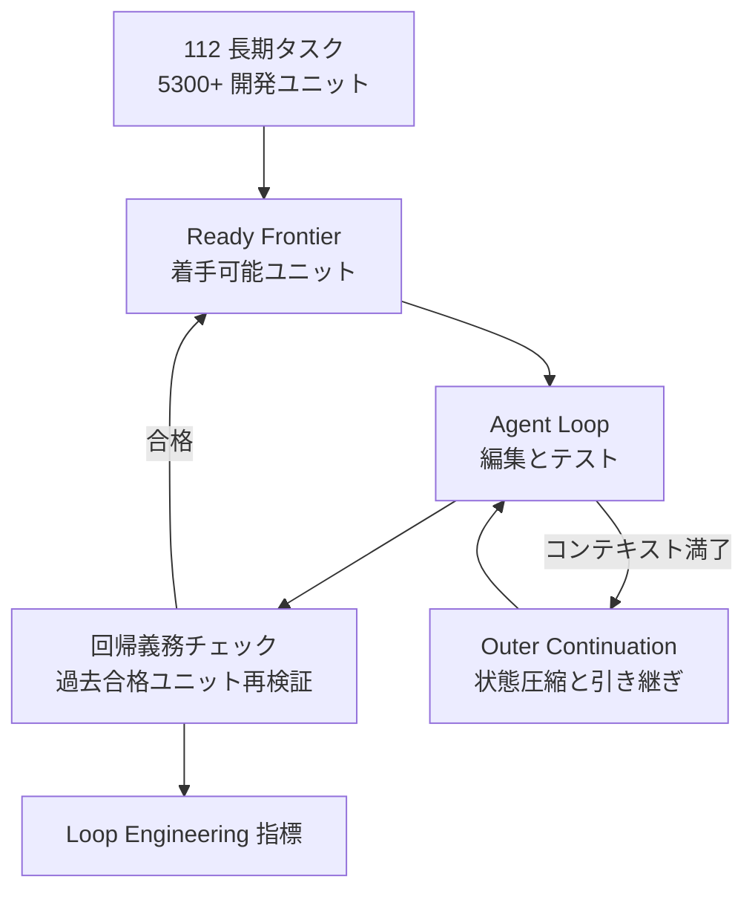
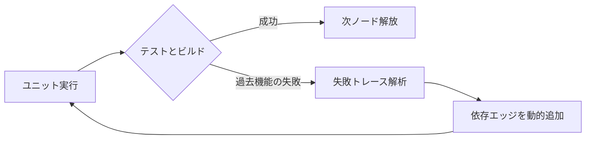

## この記事で扱うこと

コーディングエージェントの評価は、これまで「1 つの Issue に対するパッチが通るか」を測るものが主流でした。
2026 年 8 月に公開された論文 **LoopsBench** ([arXiv:2608.00267](https://arxiv.org/abs/2608.00267)) は、この評価軸を「数週間から数ヶ月にわたる開発ループを回し続けられるか」へ移そうと提案しています。

この記事では、次の 3 点を整理します。

- LoopsBench が何を測っているのか（依存 DAG と回帰義務という 2 つの軸）
- 実験結果が示した数字と、そこから読み取れる限界
- 自分たちのエージェント運用に落とすときの設計上の勘所

対象読者は、開発チームに AI エージェントを組み込むかどうかを判断する立場の方、およびエージェント実行基盤（ハーネス）を設計する方です。

:::message
本記事の数値はすべて LoopsBench 論文（arXiv:2608.00267, 2026-08）の記載に基づきます。追試はしていません。
:::

*この記事の全体像。以下、順に解説します。*

## 何が変わったのか: Harness Engineering から Loop Engineering へ

論文の主張は、副題の「From Harness Engineering to Loop Engineering」に集約されています。

| 観点 | Harness Engineering（従来） | Loop Engineering（LoopsBench） |
|---|---|---|
| 測る単位 | 1 タスク 1 パッチ | 依存関係を持つ開発ユニット群 |
| 合否判定 | 最終状態のテストが通るか | 前提条件の順序充足 + 過去テストの維持 |
| 時間軸 | 単発 | 継続（Loop Trace として追跡） |
| 主な工夫の対象 | プロンプト、ツール呼び出し | 状態の引き継ぎ、回帰検知、計画の補正 |

従来型の評価では「最後にテストが緑なら勝ち」でした。
LoopsBench は、そこに次の 2 つの義務を追加します。

1. **前提条件の充足（Prerequisite fulfillment）**: 依存関係の順に開発ユニットを解いているか
2. **回帰義務（Regression obligations）**: 過去に通したテストを壊していないか

この 2 つは、実際のプロダクト開発でレビュアーが暗黙に見ている条件と同じです。
「動くけれど既存機能を壊した」パッチは現場では通りません。従来のベンチマークはそれを減点していませんでした。

## ベンチマークの構造

### タスクの内訳

実在の OSS リポジトリや大学講義の課題などから抽出された **112 件の長期タスク**（合計 5,300 以上の開発ユニット、8 言語 / 9 ドメイン）で構成されます。

| タスクソース | 件数 | 性格 |
|---|---|---|
| Course Labs | 57 | モジュール構造が明確、依存が浅い |
| PR Sequences | 29 | 実リポジトリの PR チェーン、最も実務に近い |
| Research Evolutions | 26 | 研究コードの発展的改修 |

### 依存 DAG と Flow-Aware Runtime

タスクは単一プロンプトではなく、検証可能な開発ユニットの **依存 DAG（有向非巡回グラフ）** としてモデル化されます。
実行環境（Flow-Aware Runtime）は、前提となるユニットがクリアされて初めて後続ユニットの要求仕様とテストを開示します。この「いま着手できるユニットの集合」を **Ready Frontier** と呼びます。

つまりエージェントは、ゴール全体を最初から見渡せません。実務で仕様が段階的に明らかになる状況を模した設計です。

### 評価指標

| 指標 | 意味 |
|---|---|
| Resolve Rate | 完遂率。全ユニット通過という厳格な判定 |
| Test Pass Rate | 平均テストパス率 |
| Dependency Depth | DAG をどこまで深く到達できたか |
| Regression Rate | 過去に通した機能をどれだけ壊したか |
| Billed Tokens | 消費トークン。コストの代理変数 |

完遂率だけでなく Dependency Depth と Regression Rate を併記するところが要点です。
「途中まで進めたが後半で崩れた」のか「浅いところで止まった」のかを区別できます。

## 実験結果: 最良でも完遂率 25%

### モデル別（Claude Code ループ固定）

| モデル | Continuation なし | Continuation あり | pass@3 | 平均トークン |
|---|---|---|---|---|
| Opus-4.7 | 16.96% | **25.00%** | 26.79% | 6.91 M |
| GPT-5.5 | 13.39% | 21.43% | 23.21% | 7.18 M |
| GLM-5.1 | 13.39% | 18.75% | - | 4.37 M |
| DeepSeek-V4P | 11.61% | 16.96% | - | 3.59 M |
| Gemini-3.1-Pro | 8.93% | 14.29% | - | 4.99 M |
| Qwen3.6-Plus | 6.25% | 9.82% | 11.61% | 4.25 M |
| Kimi-2.6 | 3.57% | 6.25% | - | 2.02 M |
| Grok-4.1-FR | 2.68% | 4.46% | - | 1.83 M |

最良構成は Opus-4.7 に Claude Code ループと外付け継続ループを組み合わせたもので、完遂率 **25.00%** でした。
4 タスクに 3 つは完遂できない、という水準です。

### ループインフラ別（モデルを azure/gpt-5.4 に固定）

| ループインフラ | Continuation なし | Continuation あり | 平均トークン |
|---|---|---|---|
| Codex | 13.39% | 21.43% | 7.94 M |
| Claude Code | 12.50% | 19.64% | 7.03 M |
| GitHub Copilot | 10.71% | 16.07% | 8.26 M |
| OpenHands | 6.25% | 10.71% | 6.75 M |
| SWE-agent | 5.36% | 8.93% | 7.18 M |
| mini-swe-agent | 4.46% | 7.14% | 8.86 M |

同じモデルでもループインフラを変えるだけで完遂率は 7.14% から 21.43% まで、約 3 倍の開きが出ます。
モデル選定だけでは説明できない差が、実行基盤側にあるということです。

### タスクソース別のギャップ

- **Course Labs（n=57）**: Opus-4.7 で 24.56%。全成功タスクの 7 割以上を占める。依存が浅い（メディアン深さ 33）
- **PR Sequences（n=29）**: Opus-4.7 でのみ **3.45%（1/29）**。残り 13 構成中 9 構成が 0.00%

最も実務に近い PR Sequences がほぼ全滅している点が、この論文でいちばん重い結果です。
過去の PR が確立した不変条件を後続の実装が維持できず、依存の連鎖が途中で破綻します。

## 数字の読み方: どこで壊れているのか

3 つの表から読み取れる構造を整理します。

**1. 継続ループの追加が単独で最も効いている**

Opus-4.7 で 16.96% から 25.00% へ、約 1.5 倍。他のモデルでも同様の比率で改善しています。
コンテキストを伸ばすのではなく、外部システムが状態を構造化して引き継ぐことが効いた、という読み方ができます。

**2. 成功はほぼ依存の浅いタスクに偏っている**

Course Labs が成功の 7 割以上を占め、PR Sequences は 3.45%。
「ベンチマークで 25% 取れた」という数字を、実リポジトリの改修に読み替えてはいけません。実務相当の条件では 1 桁前半です。

**3. 失敗の原因は能力不足だけではない**

論文は、エージェントが最初に立てた計画 DAG と実際の依存グラフの合致度（Edge F1）が低いことを報告しています。
つまり、そもそも依存関係を事前に見通せていない。見えていない依存に沿って作業した結果、過去の前提を壊す、という順序で崩れます。

論文が示す対処の方向は、静的な `plan.md` を守らせることではなく、ビルドエラーとテスト失敗を「隠れた依存の発見シグナル」として扱い、実行中に依存グラフを書き換えることです。

## 自分たちの運用にどう落とすか

ここからは、この結果をエージェント運用の設計判断に翻訳します。

### 1. 回帰テストをループの内側に置く

エージェントは目先のユニットに最適化し、過去に通したテストを壊します。
新規テストの合格だけを完了条件にすると、この破壊が検知されません。

設計としては、完了判定を「新規テスト合格 かつ 既存テスト全件合格」の連言にします。
CI で後追いするのではなく、エージェントのループ内で毎周回すのが要点です。壊れたことを次の周回のシグナルとして使えるからです。

### 2. コンテキストは伸ばすのではなく引き継ぐ

Continuation の追加で完遂率が約 1.5 倍になった事実は、投資先を示しています。
引き継ぐ内容は、生の会話ログではなく次の 3 点に絞るのが論文の示す方針です。

- 現在の依存グラフの状態
- パス済みユニットの一覧
- 未解決の阻害要因

セッションをまたぐ状態ファイル（`state.json` 相当）を正本にし、会話履歴は失われてよい前提で設計します。

### 3. 事前計画を信頼度の低い仮説として扱う

計画 DAG と実依存の合致度が低い以上、事前計画は「作業順の初期値」でしかありません。
実行中に依存を発見して計画を書き換える経路を、最初から仕組みに入れておきます。

### 4. コスト上限を先に決める

1 タスクあたり平均 6M から 8M トークンです。
完遂率が 25% ということは、成功 1 件あたりの期待コストはその数倍になります。タイムアウトとコスト上限を設けずに走らせる設計は、金額面で成立しません。

### 5. diff サイズを制約する

論文は、エージェントのパッチ行数が人間の模範解答に比べ不自然に大きくなる傾向（Implementation Surplus）を指摘しています。
不要なスタイル書き換えや重複コードが混ざるため、レビュー段階で diff サイズの上限を明示的に決めておくと、レビュー負荷の暴発を抑えられます。

## 限界と注意点

この結果をそのまま一般化する前に、次の点を留保しておきます。

- **ベンチマークは実務の代理でしかない**: 112 件のタスク構成（Course Labs が半数）は、任意の組織のリポジトリ分布とは一致しません
- **数字は 2026 年 8 月時点のもの**: モデルもエージェントループも更新が速く、絶対値は短期間で動きます。相対比較と構造的な示唆のほうが寿命が長いです
- **筆者は追試していません**: 本記事の数値はすべて論文記載の引用です。導入判断に使う場合は、自分たちのリポジトリで小規模に再現することを勧めます

そのうえで、「最新モデルを使えば複雑な PR も自律的に解ける」という期待は、現時点では明確に否定されています。人間のレビューと段階的な介入は、当面は設計の前提です。

## まとめ

- LoopsBench は、コーディングエージェントの評価を単発パッチから継続的な開発ループへ移す提案です
- 依存 DAG による段階的な仕様開示と、過去テストを維持する回帰義務の 2 軸で評価します
- 最良構成でも完遂率 25.00%、実務に近い PR Sequences では 3.45% にとどまります
- 同一モデルでもループインフラの違いで完遂率は約 3 倍変わり、外付けの継続ループ追加で約 1.5 倍に伸びます
- 運用側の勘所は、回帰テストをループ内に置くこと、状態を構造化して引き継ぐこと、事前計画を仮説として扱うこと、コストと diff サイズに上限を置くことです

エージェントの実力差を語るとき、モデル名だけを比べても足りません。どのループの上で走らせるかが、同じくらいの幅を持つ変数です。

この記事が少しでも参考になった、あるいは改善点などがあれば、ぜひリアクションやコメント、SNSでのシェアをいただけると励みになります！

## 参考リンク

- [LoopsBench: From Harness Engineering to Loop Engineering in Coding Agent Evaluation (arXiv:2608.00267)](https://arxiv.org/abs/2608.00267)
- [microsoft/Loopsbench (公式リポジトリ)](https://github.com/microsoft/Loopsbench)
