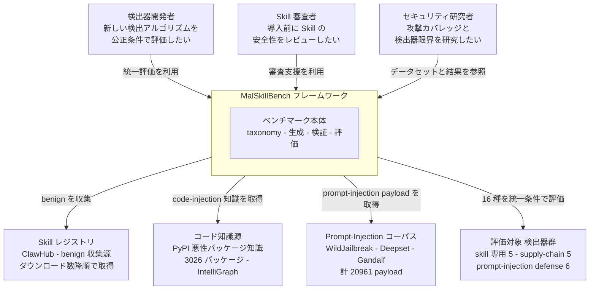
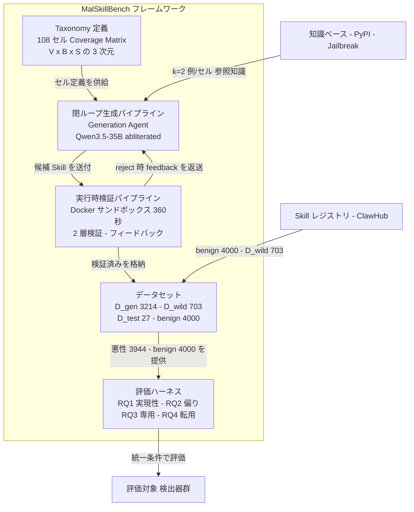
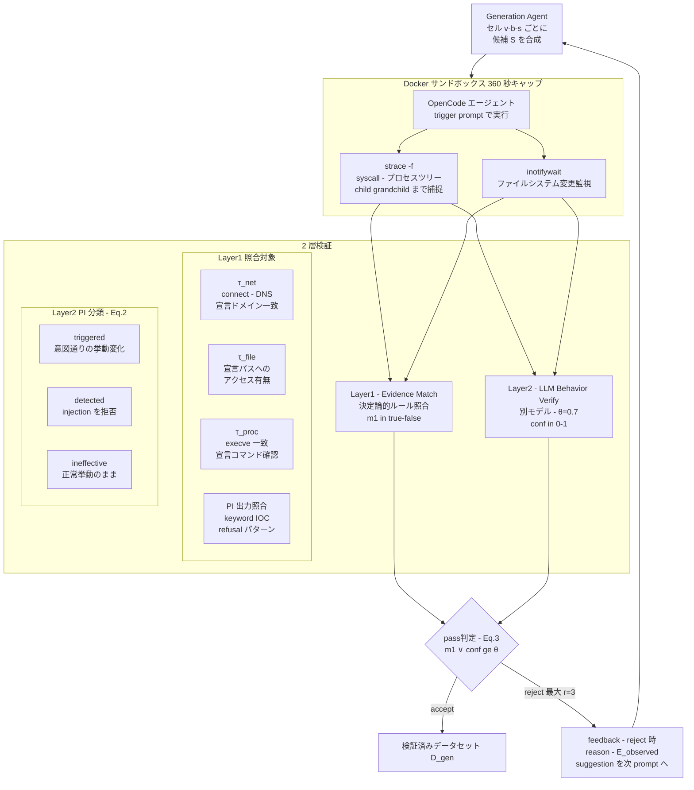
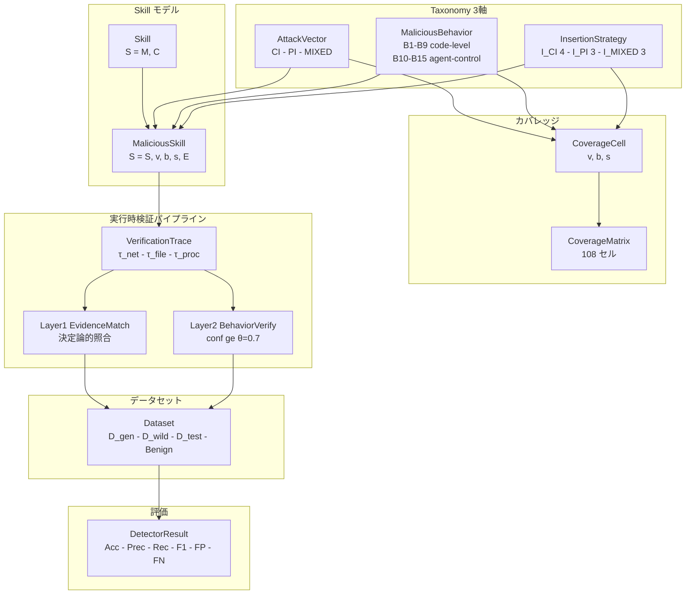
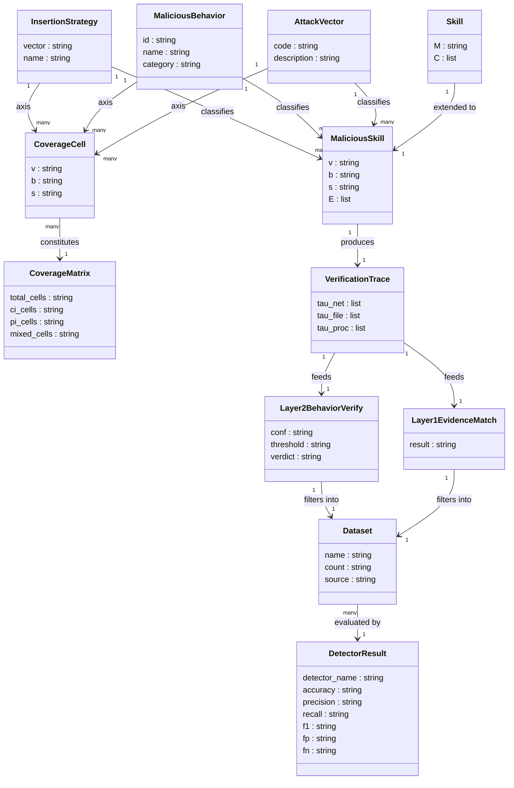

> 本稿は防御的セキュリティ研究の観点で整理します。攻撃手順や悪用可能コードは扱いません。中核の一次ソースは arXiv:2606.07131「MalSkillBench: A Runtime-Verified Benchmark of Malicious Agent Skills」(2026-06-05 投稿) です。業界統計には「二次情報」、一次で裏が取れていない箇所には「一次未確認」と明記します。掲載するコード例・設定例は論文の主張ではなく実装案です。

## 概要

### Agent Skill とは何か

Claude Code や Gemini CLI などの AI コーディングエージェントは、サードパーティの **Skill** で機能を自己拡張します。Anthropic 公式ドキュメントは Skill を「instructions・metadata・optional resources (scripts, templates) を束ねたモジュール能力」と定義します。実体は `SKILL.md` を含むディレクトリであり、3 つの要素を 1 つの配布物に束ねます。

| 要素 | 内容 | 審査上の意味 |
|---|---|---|
| 自然言語指示 | SKILL.md 本文(手順・ガイダンス) | エージェントの推論・ツール呼び出しを制御 |
| 実行コード | `scripts/` を実行 | コード本体はコンテキスト・監査ログに残らない(出力のみ返る) |
| 権限 | frontmatter `allowed-tools` | 実行サーフェスにより危険度が変わる(後述) |

この束ね方が新しい審査問題を生みます。Skill は「純粋なコードでも純粋なプロンプトでもないハイブリッド成果物」(§3.1) です。従来の supply-chain スキャナ(コードを読む)と prompt-injection 防御(自然言語を読む)の、どちらの射程からも半分はみ出します。

### なぜ今ベンチマークが必要か

MalSkillBench (§1) は、Skill 固有の検出評価に 3 つのギャップがあると指摘します。

- グラウンドトゥルース不在。業界レポートはサンプルを非公開とし、公開ベンチは約 157 サンプル規模にとどまる
- 攻撃カバレッジの偏り。wild 収集サンプルは dependency-impersonation 攻撃に集中(86.3%)し、他パターンが評価不可視になる
- 統一評価の不在。各検出ツールが独自データセット・独自指標を使い、公正比較ができない

### MalSkillBench が測ったこと

MalSkillBench は、この空白を埋める最初の runtime-verified ベンチマークを主張します。

- 3 次元 taxonomy 108 セル(Attack Vector × Malicious Behavior × Insertion Strategy、Eq.1)で悪性 Skill を体系化
- 3,944 件の悪性 Skill を整備。うち 3,214 件は Docker サンドボックスでの実行時検証を通じた合成サンプル
- 4,000 件の benign 対照サンプルを用意
- 既存検出器 16 種以上を統一条件で評価

最大の発見は「悪性のシグナルは code と instruction の関係に宿り、片側だけ読む検出器を OR/AND 型の集合演算で組み合わせても復元できない」という構造的事実です (§4.6)。なお論文が実験したのは OR/AND 型の組合せです。cascading(段階的評価)など別設計は評価範囲外です(後述の反証 CE-4)。

## 特徴

### 1. 攻撃面の非対称性 — 悪性の大半が自然言語側に潜む

先行研究 (arXiv:2602.06547) は、Skill の脆弱性の **84.2%(632 件中 532 件)が SKILL.md の自然言語側**にあると報告します(同論文の一次記述)。コードスキャナはこの大半を原理的に見逃します。Anthropic 公式も「悪性 Skill は stated purpose と一致しない形で Claude にツール実行やコード実行を指示しうる」と明言します。自然言語指示は単なるデータではなく、エージェントの推論を乗っ取る第二の実行面として機能します。

### 2. 実行サーフェスで権限が激変

同じ SKILL.md でも、実行環境によって危険度が大きく異なります。

| 実行サーフェス | ネットワーク | パッケージインストール |
|---|---|---|
| Claude Code | フルアクセス(ユーザー権限と同等) | 可 |
| claude.ai | 管理者/ユーザー設定により可変 | 可変 |
| Claude API | なし | なし |

Claude Code 上の Skill は実質「ユーザー権限で動く任意プログラム」です。npm パッケージと同等以上のコード実行リスクを持ちます。

### 3. 監査の死角 — スクリプトはログに残らない

公式設計のとおり、`scripts/` のコード本体はコンテキスト・トランスクリプトに載らず、出力だけが返ります。これはトークン効率の利点です。一方で、事後監査でエージェントが何を実行したか追跡しづらい盲点を生みます。

### 4. 古典的サプライチェーン攻撃の写像

npm/PyPI で確立した攻撃パターンが Agent Skill に構造的に写像されます(二次情報)。

| 古典的 SC 攻撃 (npm/PyPI) | Agent Skill での対応 |
|---|---|
| Typosquatting | 人気 Skill に似た名前 + 悪性指示の Skill |
| Dependency confusion | Skill が参照する未 claim パッケージを攻撃者が後から公開 |
| Malicious postinstall | approval fatigue を突いた任意コード実行 |
| unpinned 依存の時限発火 | 無害な依存を後日悪性版に差し替え(実行時まで静的監査をすり抜ける) |
| Remote config fetch | 実行時に攻撃者制御の指示を外部取得 |
| Maintainer 乗っ取り | リポジトリの放棄 claim・アカウント侵害 |

Snyk の ToxicSkills 調査(二次情報)は 3,984 Skill を監査し、**36.8%(1,467 件)が何らかのセキュリティ問題**、**13.4%(534 件)が critical 級**を持つと報告します。確認済み悪性サンプルの **91% が prompt injection を併用**します。

### 5. 公式の暗号署名検証が未出荷 (2026-06 時点)

公式 community marketplace の保護は「自動検証 + commit SHA ピン留め + install 前の中身提示 + trust-the-source 警告」にとどまります。公式 Warning は「Anthropic は plugin に含まれる MCP サーバ・ファイル等を制御せず、意図通り動くことを検証できない」と明記します。暗号署名検証・verified marketplace の機能要望は GitHub Issue `anthropics/claude-code#30727`(state: open, 2026-03-04)として登録されており、これが「まだ出荷されていない」ことの裏付けになります(Issue の現在の状態は一次未確認)。

### 類似・関連との比較

| 軸 | Prompt-Injection ベンチ(先行) | Supply-Chain スキャナ(転用) | MalSkillBench |
|---|---|---|---|
| 読む対象 | instruction 層のみ | code 層のみ | code + instruction の両層 |
| 攻撃カバレッジ | PI パターン中心 | CI / dependency 偏重 | 108 セル taxonomy |
| サンプル規模 | 数百〜数千(多くは合成) | wild 収集のみ(約 157 件の公開ベンチ) | 3,944 悪性 + 4,000 benign |
| Runtime 検証 | なし(静的・意味的) | なし(静的解析) | Docker + strace/inotifywait で実行時確認 |
| wild バイアス対応 | 評価なし | wild のみ評価 | wild の偏りを定量分析し補正 |
| 核心的発見 | — | — | OR/AND 型の集合演算では code–instruction の関係を復元できない |

## 構造

ベンチマーク構築フレームワークの論理構造を C4 Model 3 段階で表現します。

### システムコンテキスト図



| 要素名 | 説明 |
|---|---|
| 検出器開発者 | 悪性 Skill 検出アルゴリズムを開発し、統一条件での評価を必要とするアクター |
| Skill 審査者 | 組織に Skill を導入する前にセキュリティレビューを行うアクター |
| セキュリティ研究者 | 攻撃カバレッジ・検出限界・ベンチマーク設計を研究するアクター |
| MalSkillBench フレームワーク | taxonomy 定義・閉ループ生成・実行時検証・評価ハーネスを統合する本体 |
| Skill レジストリ - ClawHub | benign Skill の収集源。ダウンロード数降順で 4,000 件の対照データを提供 |
| コード知識源 - IntelliGraph | PyPI 3,026 パッケージから code-injection パターンを抽出した知識ベース |
| Prompt-Injection コーパス | WildJailbreak / Deepset / Gandalf の計 20,961 payload をまとめた知識ベース |
| 評価対象 検出器群 | skill 専用 5 種・supply-chain scanner 5 種・prompt-injection defense 6 種 計 16 種 |

### コンテナ図



| 要素名 | 説明 |
|---|---|
| Taxonomy 定義 - 108 セル | Attack Vector × Malicious Behavior × Insertion Strategy の 3 次元。CI 36 + PI 45 + MIXED 27 = 108 セル |
| 閉ループ生成パイプライン | セル ごとに知識検索・テンプレート選択・LLM 合成を行う。生成 backbone は Qwen3.5-35B abliterated |
| 実行時検証パイプライン | Docker サンドボックス上で OpenCode を実行し strace/inotifywait で監視、2 層検証と最大 r=3 ループで候補を篩にかける |
| データセット | D_gen 3,214(検証済み合成)+ D_wild 703 + D_test 27 = 悪性 3,944、benign 対照 4,000 |
| 評価ハーネス - RQ1-4 | RQ1 攻撃実現性 / RQ2 wild 偏り / RQ3 skill 専用検出器 / RQ4 転用ツール を統一条件で測定 |

### コンポーネント図

実行時検証パイプラインをドリルダウンします。



#### Docker サンドボックス要素

| 要素名 | 説明 |
|---|---|
| Docker サンドボックス | 候補 Skill を隔離実行する環境。実行時間は 360 秒でキャップ |
| OpenCode エージェント | Skill の広告された benign 目的に合わせた trigger prompt を受けて動作する OSS コーディングエージェント |
| strace -f | システムコール・プロセスツリーを監視。child / grandchild プロセスまで捕捉 |
| inotifywait | ファイルシステムの変更イベントをリアルタイムで監視 |

#### Layer1 Evidence Match 要素

| 要素名 | 説明 |
|---|---|
| τ_net - ネットワーク証跡 | connect() / DNS 解決が宣言ドメインと一致するか決定論的に照合 |
| τ_file - ファイル証跡 | 宣言パスへのアクセス有無を照合 |
| τ_proc - プロセス証跡 | execve() が宣言コマンドと一致するか照合 |
| PI 出力照合 | PI ベクトルでは、エージェント出力中の keyword IOC と refusal パターンを走査 |

#### Layer2 LLM Behavior Verify 要素

| 要素名 | 説明 |
|---|---|
| LLM Behavior Verify | 別モデルが trace summary + expected behaviors を評価し conf(e) を返す。生成バイアス緩和のため生成 backbone と別モデルを使用(検証モデル名は一次未確認) |
| θ = 0.7 しきい値 | conf(e) がこの値以上で Layer2 合格とみなす |
| triggered / detected / ineffective | PI の 3 帰結分類。意図通り挙動変化 / injection を拒否 / 正常挙動のまま |

#### 合格判定とフィードバックループ要素

| 要素名 | 説明 |
|---|---|
| 合格判定 - Eq.3 | pass(S*) ⇔ ∃e∈E : m₁(e) ∨ conf(e)≥θ。Layer1 一致または Layer2 が θ 以上で確認(選言)。両層とも失敗した場合のみ reject |
| feedback ループ | reject 時に reason / E_observed / suggestion を次プロンプトに append して再合成 |
| 最大 r=3 リトライ | セルあたり最大 3 回再生成し、それでも合格しない場合は discard |
| 検証済みデータセット D_gen | 合格した Skill のみを格納する最終的な合成サンプル群(3,214 件) |

## データ

### 概念モデル



### 情報モデル



### 3 次元 taxonomy の内訳

| 軸 | 値 | 補足 |
|---|---|---|
| Attack Vector | CI / PI / MIXED | MIXED は M がエージェントに中間生成物の準備を指示し C が消費 |
| Behavior B1–B9 (code-level) | Data Exfiltration / Credential Theft / Remote Code Execution / Malware Delivery / Persistence / Reverse Shell / Ransomware / Resource Abuse / Privilege Escalation | CI または PI で実現可能 |
| Behavior B10–B15 (agent-control) | Role Hijack / Safety Bypass / Instruction Override / System Prompt Leak / Goal Hijacking / Content Manipulation | PI でのみ実現 |
| Insertion Strategy | CI 4種 / PI 3種 / MIXED 3種 | 隠蔽度の段階 |

108 セル = CI (9×4=36) + PI (15×3=45) + MIXED (9×3=27)。

## 構築方法

掲載するコード例・設定例は実装案です。論文の主張ではありません。論文に存在しない閾値・推測キーは記載しません。

### ベンチマーク再現の前提

論文 (§3.3 / §4.1) が明示した前提です。

| 項目 | 論文記述 |
|---|---|
| コンテナ | Docker コンテナ |
| エージェント | OpenCode(OSS コーディングエージェント) |
| syscall 監視 | `strace -f`(child/grandchild まで追跡) |
| ファイルシステム監視 | `inotifywait` |
| 実行上限 | 360 秒でキャップ |
| 生成バックボーン LLM | Qwen3.5-35B abliterated(一次確認済み) |
| 検証 LLM | 生成と別モデル(生成バイアス緩和、モデル名は一次未確認) |
| 信頼度しきい値 | θ = 0.7 |

合格判定は Eq.3 です。`pass(S*) ⇔ ∃ e ∈ E : m₁(e) ∨ conf(e) ≥ θ`。Layer1(決定論的 Evidence Match)か Layer2(LLM Behavior Verify で conf ≥ 0.7)のどちらかを満たせば行動 e が確定します。

### Skill 審査パイプラインの実装案 — サンドボックス隔離

MalSkillBench の証跡 τ = {τ_net, τ_file, τ_proc} に対応する監視ツールの役割です。

| 証跡種別 | ツール例 | 見るべき挙動 |
|---|---|---|
| τ_proc | `strace -f` | `execve()` / child プロセスのコマンド一致 |
| τ_net | `strace` / `tcpdump` | `connect()` / DNS 解決(宣言外ドメインへの接続) |
| τ_file | `inotifywait` | 宣言外パスへの読み書き(`.env` / SSH key 等) |

構造的な盲点があります(反証 CE-1)。360 秒キャップは time-delayed payload を観測窓の外に逃がします。ランタイム検証は必要条件であり、十分条件ではありません。

## 利用方法

### 必須パラメータ・前提条件

| パラメータ / 前提 | 説明 | 論文の根拠 |
|---|---|---|
| Skill 形式 | `SKILL.md` を含むディレクトリ。S = (M, C) | §3.1.1 Definition 1 |
| 監視証跡 τ | τ_net / τ_file / τ_proc の 3 種を収集 | §3.3 Layer-1 |
| 信頼度しきい値 θ | LLM-judge が返す conf のカットオフ。論文は 0.7 | §4.1 |
| 実行上限 | 360 秒。短縮は時間遅延攻撃の検出率を下げる | §4.1 |

### Skill 導入前レビューの実装案

MalSkillBench の核心 (§4.6)「悪性のシグナルは code と instruction の関係に宿る」を、導入前チェックリストに翻訳します。

```markdown
## Skill 導入前チェックリスト (実装案)

### A. 宣言 vs 実態の突き合わせ
- [ ] SKILL.md の description が主張するタスクと、同梱スクリプトの処理内容が一致するか
- [ ] allowed-tools の宣言スコープを超えるツール呼び出しがスクリプト内にないか
- [ ] 外部通信 (curl / wget / fetch) の宛先が明示・合理的か
- [ ] 認証情報を要求・転送するコードが存在しないか (API_KEY / SECRET / TOKEN)
- [ ] 破壊的コマンド (rm -rf / chmod 777 / sudo) がタスク目的と整合するか

### B. サプライチェーン審査
- [ ] コミット SHA がピン留めされているか
- [ ] スクリプトが実行時に外部 URL からコードを取得しないか (runtime fetch は審査時 inert)
- [ ] 作者・リポジトリのスター数・更新頻度・公開履歴が確認できるか

### C. Instruction 層の審査
- [ ] SKILL.md 本文にセキュリティ機構の回避を指示する文がないか (Role Hijack / Safety Bypass)
- [ ] ステガノグラフィ的な不可視文字・異常な Unicode がないか
- [ ] Full Camouflage (benign 目的で包まれた悪性指示) のパターンがないか
```

限界を明示します。難読化・ステガノグラフィ挿入(論文で実現率 62.5%、最低水準)は静的レビューをすり抜けます。このチェックリストは一次フィルタであり、単独では審査を完結できません。Claude 自身に SKILL.md をレビューさせる手法も有効ですが、LLM レビュー自体が prompt injection で操作されうる(CE-2)ため、過信は禁物です。

### 最小権限・封じ込めの設定例

Claude Code の `settings.json` は `deny > ask > allow` の 3 層で権限を制御します。deny から設計することで承認疲れを防ぎます。

```json
// .claude/settings.json (実装案。公式準拠の既知フィールドのみ)
{
  "permissions": {
    "deny": [
      "Bash(curl:*)",
      "Bash(wget:*)",
      "Bash(sudo:*)",
      "Bash(rm -rf:*)",
      "Bash(chmod:*)"
    ],
    "ask": [
      "Bash(git push:*)",
      "Bash(npm publish:*)"
    ]
  }
}
```

外部取得系コマンドを deny に入れることで、実行時に外部サーバからコードを fetch する経路を構造的に塞ぎます(CE-1 への対処)。組織単位では `managed-settings.json` を MDM で配布し、`disableNonEssentialTraffic: true` で不必要な外部通信を抑制し、`extraKnownMarketplaces: []` で許可しないマーケットプレイスからの追加を制限します。

Gartner は均一なガバナンスを警告します(CE-5)。全 Skill に均一な審査を当てると承認疲れと生産性低下を招きます。高リスク Skill(外部通信・認証情報アクセス)にだけ重い審査を当てるリスクグラジエント設計が現実解です。

### 検出器の多段 (cascading) 構成の実装案

OR/AND 結合の失敗 (§4.6) に対し、cascading(段階適用)が現実解です。

| 結合方式 | recall | FPR | 結果 |
|---|---|---|---|
| OR 結合 | 最大 100% | 最大 100% | アラート疲れで使い物にならない |
| AND 結合 | 2.8–5.0% | 約 0% | 検出漏れが爆発する |
| cascading | 約 98.9%(L1 単独) | 約 20%(L1 単独) | 安価な静的層でトリアージ後、LLM で精査 |

AND/OR は論文 §4.6 / Fig.8、cascading は arXiv:2604.06550 SkillSieve(二次情報)です。

```text
[Layer 0: 静的シグナル — $0 / 40ms 級]   regex / AST / keyword 一致で benign の大半を高速除外
   ↓ 高リスク判定のみ次層へ
[Layer 1: LLM-judge 結合推論 — $0.006/skill 級]
   SKILL.md + スクリプト全体を渡し、4 サブタスクで結合推論:
   1.intent alignment 2.permission justification 3.covert behavior 4.cross-file consistency
   ↓ 疑義あり → 次層へ
[Layer 2: 動的検証(オプション) — 高コスト]
   Docker サンドボックスで実行し τ を収集、Evidence Match ∨ conf ≥ 0.7 を適用
```

CE-2 を踏まえた注記です。Layer-1 の LLM-judge は精巧な prompt injection で confidence を偽装されうるため、multi-LLM jury(複数モデルが独立投票)で非決定性を緩和します。決定論的な syscall トレース照合を一次判定として優先します。

## 運用

### インストール前スキャン

Snyk agent-scan / Cisco skill-scanner / AI-Infra-Guard など複数スキャナを、対象モダリティ(コード層 / 自然言語層)を把握して使い分けます。単一スキャナだけで「問題なし」と判断しません。

### ランタイム監視と継続的再スキャン

インストール後のランタイム監視が、現状で最大の空白です。Mobb.ai の 22,511 件監査でも「レジストリはパブリッシュ時のみスキャンし、インストール後のランタイム検証がほぼ存在しない」ことが構造的欠陥とされます(二次情報)。

- スキャンの定期実行。依存更新・レジストリ再公開のたびに再スキャンする
- time-delayed payload への対処。スキャン通過だけで安全と判断しない(CE-1)
- runtime fetch への対処。egress allowlist でアウトバウンド先を制限し、想定外の接続を検知する(CE-1)

### 監査ログ (OpenTelemetry)

Claude Code の OpenTelemetry 統合を有効にし、tool 呼び出し・ファイルアクセス・外部通信を記録します。スクリプト本体はトランスクリプトに残らないため、syscall レベルまたはコンテナ境界のイベントを補完記録します。`ANTHROPIC_BASE_URL` の書き換え検知、Hooks 実行ログ、MCP リクエスト/レスポンスの記録がポイントです。

## ベストプラクティス

各項目を「よくある誤解 → 反証エビデンス → 推奨」で整理します。

### BP-1: 単一スキャナを信じない

- 誤解。実績あるスキャナを 1 つ通過すれば安全。
- 反証。既存検出器はいずれかのモダリティの半分しか読みません(Table 7)。supply-chain スキャナは自然言語を読めず、PI 防御は recall 99.7–100% でも FPR がほぼ 100% になり実運用に耐えません。
- 推奨。静的コード解析と自然言語スキャンを両輪で走らせ、cascading で精査します。スキャナは必要条件であり、十分条件ではありません。

### BP-2: 宣言と挙動のギャップを見る

- 誤解。ドキュメントとコードが一致していれば安全。
- 反証。悪性 Skill の本質は advertised task と executable behavior のギャップにあります(Definition 2)。OR/AND どちらの集合演算でも、この関係は復元できません(§4.6)。
- 推奨。「SKILL.md の目的」「allowed-tools の権限」「実際のシステムコール」の 3 点を突き合わせます。権限が用途に対し過剰なら承認しません。

### BP-3: 封じ込めを上流に置く

- 誤解。審査で確実に弾ければ封じ込めは不要。
- 反証。全スキャナは偽陰性を残します(CE-1, CE-3)。設計による blast radius 縮小は「致命的 → 限定的」への実効的移行を可能にします(CE-5)。
- 推奨。最小権限(allowed-tools)・egress allowlist・commit SHA ピン留め・コンテナ隔離を組み合わせます。

### BP-4: 承認疲れを設計で避ける

- 誤解。ask を多く挟むほど安全。
- 反証。ask が多すぎると担当者が読まずにクリックする承認疲れが発生します(二次情報)。Gartner も均一ガバナンスが失敗を招くと警告します(CE-5)。
- 推奨。`deny > ask > allow` で設計します。`curl | sh` 等は deny で遮断し、安全操作は allow、境界ケースだけ ask にします。`managed-settings.json` を MDM で配布します。

### BP-5: ランタイムも監視する

- 誤解。パブリッシュ時スキャンを通過していれば継続監視は不要。
- 反証。インストール時スキャンは time-delayed payload・runtime fetch・sandbox evasion を取りこぼします(CE-1)。unpinned 依存は後日差し替えで実行時に悪性化します。
- 推奨。egress 通信のランタイム監視を常時有効にし、依存更新通知(Dependabot / OSV)で再スキャンし、Hooks・MCP 設定の変更を定期監査します。

## トラブルシューティング

| 症状 | 原因 | 対処 |
|---|---|---|
| コードスキャン通過なのに実行時に悪性挙動 | SKILL.md の自然言語側に悪性命令(PI)。コードスキャナは自然言語を読めない | 自然言語スキャナ(LLM-as-judge 層)を追加し結合レビュー。宣言目的とスクリプト挙動を突き合わせる |
| PI フィルタで benign を大量誤検知(FP 爆発) | 高 recall / 高 FPR の PI 防御を単独使用。OR 結合で FP が合算(§4.6) | cascading 設計。軽量な静的フィルタで benign を除外し、高リスクのみ LLM-judge へ。信頼度スコアのグラデーション判定にする |
| ランタイム検証をパスしたのに後日悪性が発覚 | time-delayed / runtime fetch。実行時間キャップの外で発動(CE-1) | egress allowlist で通信先を制限しランタイム監視を常時記録。commit SHA でピン留めし依存変更も検知 |
| 信頼済み Skill が後から悪性版に差替え(Rug Pull) | unpinned インストール。レジストリ側の変更が未検知 | commit SHA を固定。mcp-scan の Tool Pinning でハッシュ不一致をアラート。pin 済み SHA と現行版を定期比較 |
| LLM-as-judge が PI で回避される | judge LLM 自体が PI 脆弱性。confidence を θ=0.7 未満に偽装(CE-2) | 単一 judge に依存せず multi-LLM jury に。syscall トレースの決定論的 Evidence Match を一次判定に優先 |
| 承認ダイアログ頻発で中身未確認のまま承認(承認疲れ) | ask 中心設計で判断場面が多すぎる(CE-5) | deny リスト拡充で危険コマンドを自動遮断し ask 頻度を絞る。managed-settings.json を MDM 強制配布 |
| ベンチ高スコアのスキャナが実環境で大量見逃し | distribution shift によるスコア水増し(CE-3)。VirusTotal の recall が wild-only で +66pt 変動 | ベンチスコアを過信せず、組織固有サンプルで定期キャリブレーション。108 セル相当の多様なベクターで試験 |
| settings.json 改ざんで API が攻撃者サーバへ誘導 | `ANTHROPIC_BASE_URL` 書き換えで認可トークン平文送信(二次情報) | settings.json 変更を監査ログで検知。ハッシュ比較を定期実行。startup hook で改ざん確認 |
| 親 trust 継承で悪意あるサブプロジェクトに dialog が出ない | trust 継承設計。承認済みディレクトリ配下は再ダイアログなし | 不特定プロジェクトを含む親を安易に trust しない。リポジトリ単位で trust を管理し、外部取得は隔離環境で実行 |

## 反証・限界

強い主張ほど留保が要ります。結論を弱めるエビデンスを明示します。

| 反証 | 内容 | 弱める主張 | 信頼度 |
|---|---|---|---|
| CE-1 runtime 検証の盲点 | 360 秒キャップ(§4.1 で一次確認)+ sandbox evasion + runtime fetch / time-delayed payload は scan 時 inert。後者は競合ベンチ由来の記述(MalSkillBench 一次未確認) | 「runtime-verified が基盤」 | 高 |
| CE-2 結合推論器の回避 | LLM-as-judge は PI で回避されうる。HiddenLayer は judge に偽 confidence 0.675(<0.7)を出させ bypass し、θ=0.7 設計を直撃(二次情報) | 「joint reasoning が解」 | 高 |
| CE-3 ベンチの水増し | distribution shift で AUC が +8.4pt 水増ししうる(arXiv:2602.14161)。合成 feasibility ≠ deployment likelihood | 「ベンチ性能=実環境性能」 | 高 |
| CE-4 cascading という第三の道 | 独立検出器の段階的構成で安価に機能(SkillSieve L1 単独 recall 98.9% / $0.006)。「OR/AND では無理 → joint 必須」は cascading を見落とした飛躍 | 「joint でなければ不能」 | 中〜高 |
| CE-5 封じ込め設計 | least-privilege / egress allowlist で blast radius を縮小(審査より上流)。Skill は versioning/宣言/保証を欠く transitional layer で npm 類比は不完全。Gartner は均一ガバナンスを警告(二次情報) | 「npm 同等以上の重い審査」 | 中〜高 |

逆に頑健だった論点もあります。「実害は稀」説は却下されます(実在キャンペーン多数)。「ハイブリッド攻撃面」前提は Snyk が独立確認します(悪性の 91% が PI + malware 併用、二次情報)。「サンドボックスで十分」は部分支持のみです(Datadog も model-level defense を唯一の制御にはできないと層状防御を要求)。

## まとめ

MalSkillBench は、Agent Skill が「コードでもプロンプトでもないハイブリッド成果物」であることを 108 セル taxonomy と runtime-verified データセットで示し、悪性は code と instruction の関係に宿るため単一ドメイン検出器の集合演算では捉えられないと明らかにしました。現場の実装者にとっての要点は、単一スキャナを信じず、宣言と挙動を突き合わせ、最小権限と egress allowlist で封じ込めを上流に置き、承認疲れを設計で避け、ランタイムまで監視することです。

この記事が少しでも参考になった、あるいは改善点などがあれば、ぜひリアクションやコメント、SNSでのシェアをいただけると励みになります！

## 参考リンク

- 一次論文・公式ドキュメント
  - [MalSkillBench (arXiv:2606.07131)](https://arxiv.org/abs/2606.07131)
  - [MalSkillBench HTML 版](https://arxiv.org/html/2606.07131)
  - [Anthropic Agent Skills Overview (Security)](https://platform.claude.com/docs/en/agents-and-tools/agent-skills/overview)
  - [Anthropic Discover Plugins (Security)](https://code.claude.com/docs/en/discover-plugins)
- GitHub
  - [GitHub Issue #30727 (verified marketplace 要望)](https://github.com/anthropics/claude-code/issues/30727)
  - [Tencent AI-Infra-Guard](https://github.com/Tencent/AI-Infra-Guard)
  - [Cisco AI Defense Skill Scanner](https://github.com/cisco-ai-defense/skill-scanner)
  - [Snyk agent-scan (旧 invariantlabs-ai/mcp-scan、移転済み)](https://github.com/snyk/agent-scan)
  - [DataDog GuardDog](https://github.com/DataDog/guarddog)
- 関連研究・記事
  - [Malicious Agent Skills in the Wild (arXiv:2602.06547)](https://arxiv.org/abs/2602.06547)
  - [Malicious Or Not: Repository Context (arXiv:2603.16572)](https://arxiv.org/abs/2603.16572)
  - [neuro-symbolic detection (arXiv:2603.27204)](https://arxiv.org/abs/2603.27204)
  - [When Benchmarks Lie (arXiv:2602.14161)](https://arxiv.org/pdf/2602.14161)
  - [SkillSieve / cascading triage (arXiv:2604.06550)](https://arxiv.org/html/2604.06550v1)
  - [Bypassing Prompt Injection Guardrails (arXiv:2504.11168)](https://arxiv.org/html/2504.11168v1)
  - [HiddenLayer: OpenAI Guardrails Bypass](https://hiddenlayer.com/innovation-hub/same-model-different-hat/)
  - [OWASP Agentic Skills Top 10](https://owasp.org/www-project-agentic-skills-top-10/)
  - [Snyk ToxicSkills レポート](https://snyk.io/blog/toxicskills-malicious-ai-agent-skills-clawhub/)
  - [Docker AI Coding Agent Horror Stories](https://www.docker.com/blog/ai-coding-agent-horror-stories-security-risks/)
  - [Claude Code Skills 導入前チェック (yujmatsu / Zenn)](https://zenn.dev/yujmatsu/articles/20260208_skill_security_check)
  - [承認疲れが招く重大事故・7つの守り (IA Insight Lab / note)](https://note.com/hirotsuchida/n/n6eee4f612217)
  - [Claude Code 設定ファイルに潜むリスク (DevelopersIO)](https://dev.classmethod.jp/articles/claude-code-settings-security-risk/)
  - [AIエージェントスキルのサプライチェーンリスク 22,511件監査 (kai_kou / Qiita)](https://qiita.com/kai_kou/items/9acab428a5c27e442163)
  - [MCP セキュリティ考慮事項 後編 (GMO Flatt Security)](https://blog.flatt.tech/entry/mcp_security_second)
