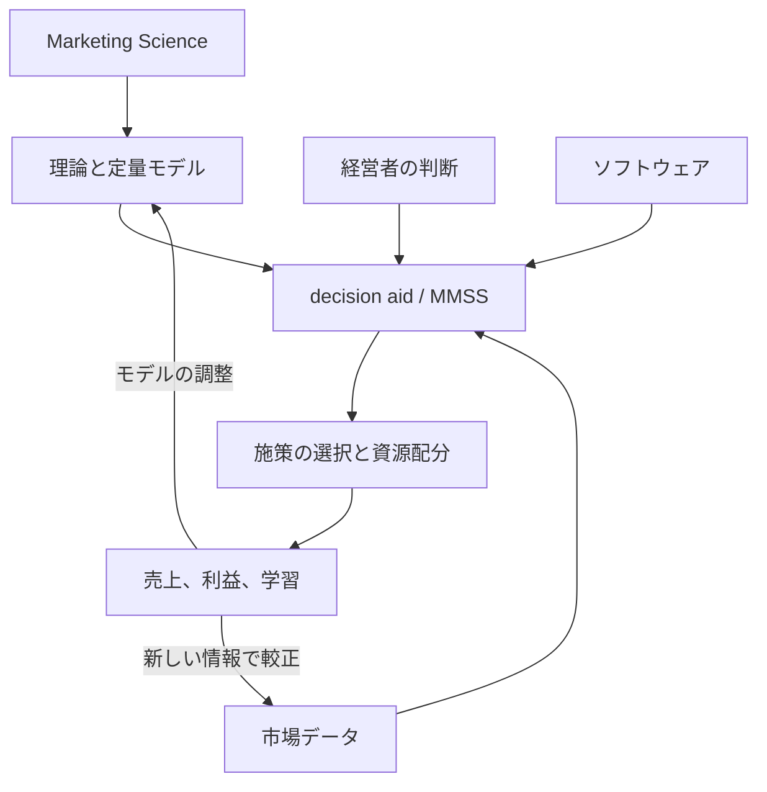
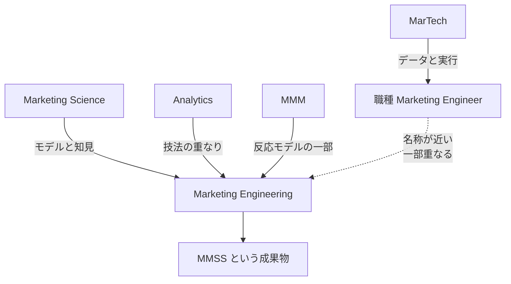

「マーケティングエンジニアリング」という言葉には、少なくとも2つの使われ方があります。1998年に教科書とソフトウェアで定着した応用分野の名前と、求人で見かける職種名「マーケティングエンジニア」です。この2つは、名前が近いわりに重点が違います。

この記事では、前者、つまり学術分野としてのマーケティングエンジニアリングを扱います。定義、代表モデル、日本語圏での用法、そして「成功事例」としてよく引かれる金額がどこまで一次資料で確かめられるかを整理します。データが薄い小さな組織でも使える部分がどこかまで落とします。

*この記事の全体像。以下、順に解説します。*

## マーケティングエンジニアリングとは

マーケティングエンジニアリングは、マーケティングのデータと知識を、意思決定支援の道具へ系統的に翻訳する応用分野です。

Gary L. Lilien と Arvind Rangaswamy が1998年の教科書で用語を定着させました。2002年の査読論文 [Bridging the marketing theory–practice gap with marketing engineering](https://doi.org/10.1016/S0148-2963(00)00146-6) は、この分野を次のように定義しています。

> the systematic process of putting marketing data and knowledge to practical use through the planning, design, and construction of decision aids and marketing management support systems (MMSSs)

つまり「意思決定支援（decision aid）とマーケティング管理支援システム（MMSS）を計画し、設計し、構築することを通じて、マーケティングのデータと知識を実用に供する系統的なプロセス」です。同じ論文は、エンジニアリングという語を「特定の問題を解くためにアートとサイエンスを組み合わせること」と括弧書きしています。

### 3つの意思決定の置き方

この分野の特徴は、意思決定の置き方を3つに切り分けたことです。

| 置き方 | 何に依拠するか | 代表例 |
|---|---|---|
| 概念的マーケティング | 個人のメンタルモデル | 経験と直感だけの予算決め |
| マーケティングエンジニアリング | データと判断をモデルへ翻訳した支援 | Syntex の営業規模モデル、Marriott のコンジョイント |
| 自動化マーケティング | システムの推奨をそのまま実行 | スキャナ分析の自動レポート |

真ん中が本分野の立ち位置です。モデルは予測や、制約下での条件付き最適解までを出します。その解を採用するか、修正するか、例外を入れるかは人が決めます。この結合を残す点が、推奨をそのまま実行する自動化との違いです。

### 意思決定支援までの基本的な流れ

理論がモデルになり、モデルが支援システムになり、支援システムが判断と結合して施策になります。ただし一方通行ではありません。Little が挙げた「適応的であること」は、新しい情報を得たらモデルを調整できることを指します。施策の結果と学習は、データとモデルへ戻ります。

思想的な祖先は、John D. C. Little が1970年に出した [decision calculus](https://doi.org/10.1287/mnsc.16.8.B466) です。Little は、マネージャーが実際に使うモデルの条件を6つ挙げました。単純であること、頑健であること、制御しやすいこと、適応的であること、可能な限り完全であること、対話しやすいことです。この6要件は、いま自分でモデルや自動化を組むときの点検表としてそのまま使えます。

### 教科書は最初からソフトウェアと組だった

1998年の教科書 *Marketing Engineering: Computer-Assisted Marketing Analysis and Planning*（ISBN 0-321-00194-X）は、ソフトウェアモデル26個と組で出ました。配布形態は教科書付属のディスクから Excel アドインへ、さらにブラウザで動く [Enginius](https://www.enginius.biz/) へ移っています。

現行版の *Principles of Marketing Engineering and Analytics* 3rd（DecisionPro、2017、ISBN 978-0985764821）が扱う領域は、顧客価値、STP、ポジショニング、予測（Bass、ASSESSOR）、新製品（コンジョイント）、ミックス（価格、配分、販促）、デジタル（検索広告、テキスト、パネル）です。

## 注意点

この分野を紹介する二次情報には、一次資料と食い違う数値がいくつも流通しています。予算や意思決定の根拠に引用する前に、次を押さえてください。

### 「年2,500万ドル」は売上増であって利益ではない

Syntex Laboratories の事例は、この分野の代表的な成功譚です。原論文である [Lodish, Curtis, Ness, Simpson (*Interfaces* 18(1), 1988)](https://doi.org/10.1287/inte.18.1.5) の要旨は、営業規模と配置の変更が **年2,500万ドル、8%の売上増** を継続的にもたらしたと書いています。開発の一時費用は3万ドルです。

一方、同じ論文を引用した Lilien ら（*JBR* 2002, p.112）は、**年2,500万ドル超の利益** と書いています。売上と利益は同じ数字ではありません。引用するなら原論文の語、つまり「売上増」を使ってください。

### ABB Electric の「シェア4%から40%超」は原論文の要旨にない

[Gensch, Aversa, Moore (*Interfaces* 20(1), 1990)](https://doi.org/10.1287/inte.20.1.6) の要旨が書いているのは、業界売上が50%落ちるなかで選択モデルの情報システムを使い、業界の支配的企業になった、というところまでです。よく引かれる「シェア4%から40%超」は、要旨には現れません。2002年の論文による要約側の数値です。

### 出典が書籍の孫引きになっている数値

次の数値は、2002年の論文が他の書籍から転記したものです。原書籍を直接確認しないかぎり、孫引きとして扱ってください。

- ドイツ鉄道 BahnCard の保持者350万人、年2億ドル超の利益（出典は Dolan と Simon *Power Pricing*, 1996）
- 効果研究の相関係数19%、25%、54%、複数研究平均の39%対33%（出典は Russo と Shoemaker *Decision Traps*, 1989, p.137）

### 販売文と自己申告

「五大陸150校超で採用」は Amazon の著者ノートによる自己申告です。Enginius 公式が掲げる「ワンクリックで40ページのセグメンテーション報告」は販売文です。ケース数「30+」、スライド数「730+」も公式サイトの現時点の文言で、変動します。

### 「2020年代に MarTech へ進化した」という物語は学術一次ではない

Wikipedia の記述にある「クラウド、CDP、生成AIで統合システムになった」という拡張は、2026年刊行の一般書に依存しています。Lilien の定義を MarTech 実装へそのまま溶かす読み方は、学術一次資料からは支持されません。

### 著者自身が限界を書いている

2002年の論文（p.119）は、この分野が万能薬ではなく、誰にでもどの状況にも向くわけではないと明記しています。ソフトウェアの操作が簡単であることは、偽の安心を生みます。定量に強い人は技術に引きずられ、弱い人は無視するか無批判に受け入れる、とも書かれています。

## どんなモデルを扱うのか

Enginius が2026年9月時点で列挙しているモデルは、セグメンテーション、ポジショニング、コンジョイント、感情分析、予測回帰、社会ネットワーク、資源配分、CLV、価格最適化、Bass 予測、GE/McKinsey マトリクス、パネル分析です。

入力と出力の型は決まっています。

重要なのは、右端が人で終わっていることです。資源配分や価格最適化のモデルは、制約下で利益を最大化する配分や価格といった具体的な推奨解を提示します。それでも、その解を採用するか修正するかの判断は人の側に残ります。

### データが薄いときに動くもの、動かないもの

小さい組織で先に動かせるのは **資源配分** です。Syntex の事例がそうであったように、データが薄くても Delphi 法（専門家の判断を構造化して集約する手法）で反応関数を置けば計算は回ります。

一方、コンジョイントと知覚マップは調査設計とサンプルが要ります。顧客数が少ない状態でのセグメンテーションは、手法の前提を満たしにくくなります。

### ライセンスの条件

Enginius のライセンスは公式の acquire ページが一次です。

| 種別 | 条件 | 価格 |
|---|---|---|
| Instructor | 学位授与機関の教員。Udemy と Coursera は対象外 | 無料、無期限 |
| University | 大学が席を買う。1席は1学生メール。グループ共有は無効化 | 席数、期間（6または12ヶ月）、含むモデルで見積。公開定価なし |
| Student | 学生が8桁コードで購入 | 公開定価なし |
| Business | 法人とコンサル | デモ予約、公開定価なし |

注意点が2つあります。

ひとつは、`https://www.enginius.com` は2014年創業の**別会社**であり、DecisionPro の製品ではないことです。ドメインを取り違えないでください。

もうひとつは、提供範囲と組み込み適性を分けて見る必要があることです。公式サイトは法人、マーケティングコンサルタント、インキュベーター向けの業務利用を明示しており、教育専用の製品ではありません。一方で、レート制限、公開API、SLA、データレジデンシーに関する公式の記載は確認できませんでした。自社システムへ組み込む前提で検討するなら、これらの条件は個別に問い合わせて確かめてください。

## 日本語の「マーケティング・エンジニアリング」は同じものか

日本語圏では、同じ問題意識が別の看板で並んでいます。

日本語の標準的な入門書は、上田雅夫と生田目崇による[『マーケティング・エンジニアリング入門』（有斐閣、2017）](https://www.yuhikaku.co.jp/books/detail/9784641220829)です。副題は Introduction to Marketing Engineering ですが、**Lilien の教科書の翻訳ではありません**。

目次は、定義、データの注意、市場理解、反応分析、最適化、予測、感性、施策の実施と確認、今後、という構成です。第7章の「感性」と第8章の「施策効果を事前に確認する実験」は、Lilien 3rd の章立てと一致しません。日本語圏で独自に組まれた入門書です。

[オペレーションズ・リサーチ学会の書評（高野祐一、2017年6月号）](https://orsj.org/wp-content/corsj/or62-6/or62_6_383.pdf)は、この分野を「科学的知識で意思決定を支援し、効果、効率、生産性を上げる分野」と紹介しています。著者が示す実施上の注意として、小さく始める、貢献を示す、低コストから始める、の3つを挙げています。

看板の揺れも実在します。生田目崇の研究室名は「マーケティング・サイエンス」です。[中央大学「知の回廊」（2014）](https://www.chuo-u.ac.jp/usr/kairou/news/2014/10/23952/)は番組を「マーケティング・エンジニアリングの最前線」と呼び、本人の専門を「経営科学とマーケティング・サイエンス」と書いています。同じ研究者が2つの名前を使っています。

なお、日本マーケティング協会が2024年に行った定義刷新は、マーケティングそのものの定義であって、本分野の定義ではありません。

### 職種名「マーケティングエンジニア」との関係

職種としての「マーケティングエンジニア」という呼び方は、近年に生まれたものではありません。たとえば [Pantheon は2019年の記事](https://pantheon.io/blog/what-does-marketing-engineer-do)でこの職種を紹介しており、職務に実装だけでなく分析、計測、A/Bテストを含めています。

一方、日本語のブログや求人には、SQL、Python、MA、広告API、AIエージェントといった実装スキルを前面に出す用法もあります。こうした用法は、Lilien のモデル一覧（反応関数、STP、コンジョイント、Bass 予測など）とは重点が違います。ただし、分析や意思決定支援の部分では重なり得ます。なお、日本語圏での用法の分布は、本記事では網羅的に調べていません。

言えるのは、**分野を採用するかどうかと、職種を採用するかどうかは別の決定である**ということです。求人票の用法は企業ごとに幅があるので、職種名から職務内容を推測せず、個別に確かめてください。

## 隣接分野との違い

| 概念 | 一次に近い定義 | 本分野との関係 |
|---|---|---|
| Marketing Science | 市場行動とマーケ活動の効果を定量概念で理解する | 理解が主。Engineering は支援システムの設計が主 |
| MMSS | IT、分析、データ、知識を意思決定者に渡す装置 | 成果物。Engineering はその計画と構築のやり方 |
| Marketing Analytics | 3rd が書名に Analytics を足した | 技法の重なり。Engineering は機会費用と判断結合を残す |
| MMM | 市場反応モデルの一種 | 部分集合。STP とコンジョイントは含まない |
| Decision calculus | Little 1970 の6要件 | 思想的祖先 |
| MarTech | 実行とデータの製品群 | モデルは必須でない |
| Marketing Ops、Growth、RevOps | 運用、実験、ファネルの職能 | 組織の仕事。モデル体系ではない |
| 職種 Marketing Engineer | 実装スキル中心の求人。用法は企業差が大きい | 名称が近い。分析と意思決定支援で一部重なる |

区別の勘所は、**モデルが必須かどうか**と、**機会費用を明示的に扱うかどうか**です。MarTech はモデルなしでも成立します。Marketing Engineering はモデルを介して、ある案を選ぶことで諦める最良の代替案の価値を、議論の土俵に載せます。教科書の10の教訓も、行動した場合と行動しなかった場合の両方について機会費用を枠づけよ、と書いています。

## 効果はどこまで確かめられているか

この分野の効果に関する文献は、支持と反証の両方があります。片側だけを引くと判断を誤ります。

### 支持する側

- 2002年の論文が示す、概念的・工学的・自動の三分法そのものが、議論の枠として機能する
- Lodish 1988 の売上増（原論文の要旨が documented と明記）
- Gensch 1990 の、業界縮小下での存続
- Wind らによる Courtyard by Marriott のコンジョイント適用（1989）
- [Blattberg と Hoch (*Management Science* 36(8), 1990)](https://pubsonline.informs.org/doi/10.1287/mnsc.36.8.887): 検証した5つの業務予測場面で、モデルとマネージャーの併用が、それぞれの単独利用を上回りました。50:50の等重みは、そこで検討された実用的なヒューリスティックです。あらゆる比率・条件での最適性が示されたわけではありません
- [McIntyre (*Management Science* 28(1), 1982)](https://pubsonline.informs.org/doi/abs/10.1287/mnsc.28.1.17): 96人の実験で、decision calculus 型のモデルが意思決定品質、とくに利益の達成度を改善しました
- 教科書の「10の教訓」が、判断が必須であることとモデルに欠点があることを先に書いている

### 反証する側

- [Chakravarti, Mitchell, Staelin (*Management Science* 25(3), 1979)](https://doi.org/10.1287/mnsc.25.3.251): ADBUDG 型のモデルで、**未経験領域への外挿は予測を誤り、条件付きで決定を悪化させ得る**
- [Little と Lodish (1981)](https://doi.org/10.1177/002224298104500403) のコメント: 上記の実験課題は現場での較正と違う。したがって実験の否定側も一般化は弱い
- Midgley (*Marketing Theory* 2(4), 2002): 知識のコード化は目的次第で、リターンが低い目的がある

支持側の McIntyre と反証側の Chakravarti らは、どちらも decision calculus を実験で扱いながら結論が逆です。実験条件が異なるため単純比較はできず、今回確認した要旨だけでは、結果が分かれた原因までは特定できません。文献が一枚岩ではない、というところまでが言えることです。

### 別に扱うべきこと

次の2つは、モデルの効果の反証ではなく、資料と製品の側の問題です。効果の議論と混ぜないでください。

- 2002年の論文自身が、Syntex の売上を利益と書き換えている（引用の不整合）
- Enginius は公開価格も SLA も公表しておらず、教育以外の導入件数を公式情報から読み取れない（製品情報の不足）

### 筆者としての整理

以上の文献を踏まえると、「モデルを入れればよい」は支持されません。同時に「判断だけの方がよい」も、Little、Blattberg–Hoch、McIntyre、Syntex が支持しません。

そこで実務上の指針としては、次の狭い運用を勧めます。**領域内の判断でモデルを較正し、Little の6要件（とくに単純さと頑健さ）を満たし、引用する金額は一次資料の語で読む。** これは筆者の実務提案であり、文献が一意に導く結論ではありません。

## 小さい組織で今日から使えること

ソフトウェア一式の導入は、この分野の実務核ではありません。教育用 SaaS の全モデルを入れる必要もありません。持ち込む価値があるのは、次の4つです。

1. **施策の上限を、粗利と回収から逆算する。** 許容CAC（顧客獲得コスト）の算術は、本分野の資源配分の考え方とそのまま接続します。
2. **新しいチャネルや記事テーマを足す前に、機会費用を一文で書く。** 「その予算と時間を投じることで諦める、最良の代替施策は何か」を書きます。あわせて「足さなかった場合に失うもの」も並べると、追加と見送りを同じ土俵で比べられます。片方だけを書くと、追加は常に正しく見えます。
3. **自動化やエージェントに出す仕事が、Little の simple と robust を満たすか点検する。** 満たさない仕事には人の判断ゲートを残します。
4. **成功事例を引用するときは、売上と利益を混ぜない。** 原論文の語をそのまま使います。

逆に、次の条件が満たされたときは踏み込んでよい範囲が広がります。

- 調査予算と十分なサンプル数を確保できるなら、新製品設計にコンジョイントを足す
- 実装の空白がボトルネックなら、職種（または相当スキル）は分野の採用とは独立に検討する

## まとめ

- マーケティングエンジニアリングは、データと知識を意思決定支援へ翻訳する応用分野で、1998年の教科書と2002年の査読論文が定義の一次資料です
- 定義の核は、データ、知識、経営者の判断、ソフトウェアを組み合わせて意思決定を助けることです。モデルは予測や条件付きの最適解を出しますが、採用と修正は人が決めます
- よく引かれる成功事例の金額には、原論文と二次要約のずれがあります。Syntex の年2,500万ドルは売上増であって利益ではありません
- 日本語の入門書は Lilien 教科書の翻訳ではなく、独自に組まれた別の本です。職種名「マーケティングエンジニア」とは重点が違いますが、分析と意思決定支援では重なり得ます
- 文献は支持と反証に分かれます。筆者の実務提案は「領域内の判断で較正し、単純で頑健なモデルを使い、金額は一次資料の語で読む」という狭い運用です
- 小さい組織が今日から使えるのは、許容CACの逆算、機会費用の明文化、自動化する仕事の点検、引用時の語の統一です

この記事が少しでも参考になった、あるいは改善点などがあれば、ぜひリアクションやコメント、SNSでのシェアをいただけると励みになります！

## 参考リンク

一次資料（本文または公式ページを確認したもの）:

- Lilien, G. L., Rangaswamy, A., van Bruggen, G. H., and Wierenga, B. (2002). Bridging the marketing theory–practice gap with marketing engineering. *Journal of Business Research*, 55(2), 111–121. https://doi.org/10.1016/S0148-2963(00)00146-6
- Lilien, G. L., Rangaswamy, A., and De Bruyn, A. (2017). *Principles of Marketing Engineering and Analytics* (3rd ed.). DecisionPro. ISBN 978-0985764821. 目次: https://toc.library.ethz.ch/objects/pdf03/z01_978-0-9857648-2-1_01.pdf
- Lodish, L. M., Curtis, E., Ness, M., and Simpson, M. K. (1988). Sales force sizing and deployment using a decision calculus model at Syntex Laboratories. *Interfaces*, 18(1), 5–20. https://doi.org/10.1287/inte.18.1.5
- Gensch, D. H., Aversa, N., and Moore, S. P. (1990). A choice-modeling market information system that enabled ABB Electric to expand its market share. *Interfaces*, 20(1), 6–25. https://doi.org/10.1287/inte.20.1.6
- Little, J. D. C. (1970). Models and managers: The concept of a decision calculus. *Management Science*, 16(8), B466–B485. https://doi.org/10.1287/mnsc.16.8.B466
- Chakravarti, D., Mitchell, A., and Staelin, R. (1979). Judgment based marketing decision models: An experimental investigation of the decision calculus approach. *Management Science*, 25(3), 251–263. https://doi.org/10.1287/mnsc.25.3.251
- Little, J. D. C., and Lodish, L. M. (1981). Commentary on "Judgment based marketing decision models." *Journal of Marketing*, 45(Fall), 24–29. https://doi.org/10.1177/002224298104500403
- Blattberg, R. C., and Hoch, S. J. (1990). Database models and managerial intuition: 50% model + 50% manager. *Management Science*, 36(8), 887–899. https://pubsonline.informs.org/doi/10.1287/mnsc.36.8.887 （要旨）
- McIntyre, S. H. (1982). An experimental study of the impact of judgment-based marketing models. *Management Science*, 28(1), 17–33. https://pubsonline.informs.org/doi/abs/10.1287/mnsc.28.1.17 （要旨）
- Leeflang, P. S. H., and Wittink, D. R. (2000). Building models for marketing decisions: Past, present and future. *International Journal of Research in Marketing*, 17(2–3), 105–126. https://doi.org/10.1016/S0167-8116(00)00008-2
- 上田雅夫、生田目崇 (2017). 『マーケティング・エンジニアリング入門』. 有斐閣. https://www.yuhikaku.co.jp/books/detail/9784641220829
- 高野祐一 (2017). 書評. 『オペレーションズ・リサーチ』6月号, 383. https://orsj.org/wp-content/corsj/or62-6/or62_6_383.pdf
- DecisionPro / Enginius. https://www.enginius.biz/ および https://www.debruyn.info/enginius/
- 中央大学 (2014). 知の回廊 第98回. https://www.chuo-u.ac.jp/usr/kairou/news/2014/10/23952/
- Pantheon (2019). What does a marketing engineer do? https://pantheon.io/blog/what-does-marketing-engineer-do

二次資料（本文で孫引きと明示したもの）:

- Russo, J. E., and Shoemaker, P. J. H. (1989). *Decision Traps*
- Dolan, R. J., and Simon, H. (1996). *Power Pricing*
- Midgley, D. (2002). What to codify: marketing science or marketing engineering? *Marketing Theory*, 2(4), 363–368
