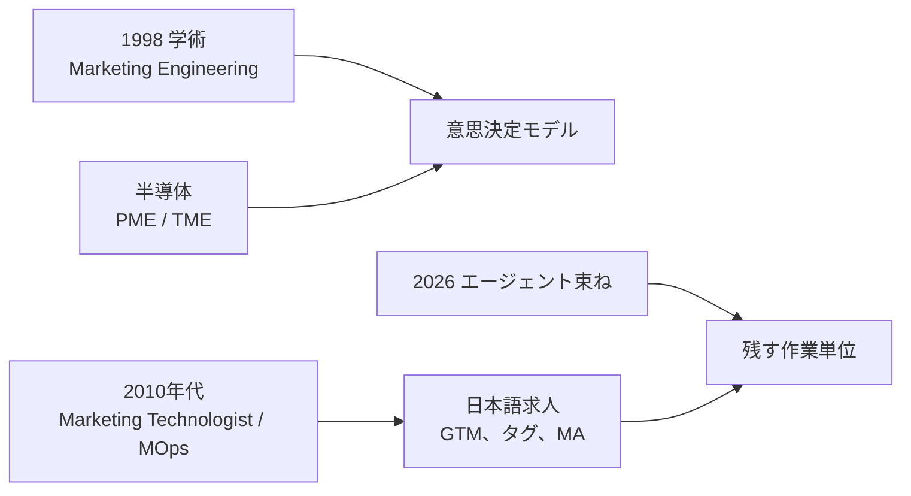
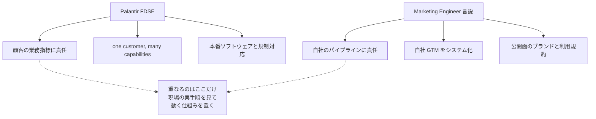
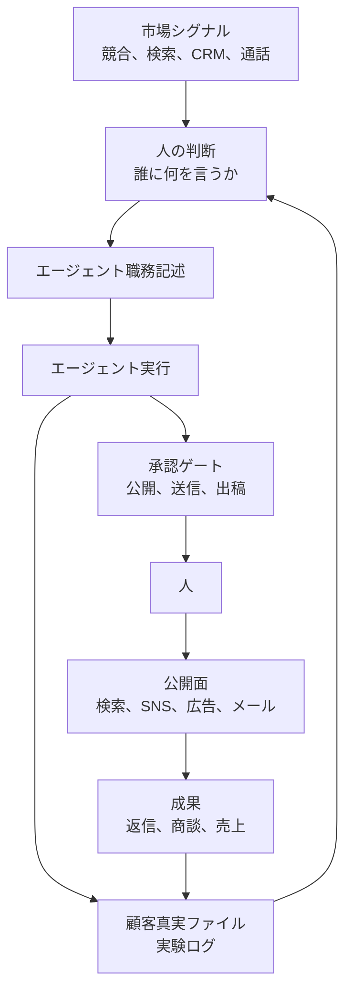

2026年8月末から、**マーケティングエンジニア（Marketing Engineer）** という肩書きが英語圏と日本語圏で同時に広がりました。「2026年に登場した新しい役割」「トップ層は年収100万ドル」「新しいタイプの Forward Deployed Engineer」という強い主張がセットで流通しています。

この記事は、その言説を一次情報（本人の発言、企業の公式ドキュメント、原典レポート、公開求人）と突き合わせて、次の2つを分けます。

- **割引くべき主張**: 職種名の新規性、年収レンジ、製品の成果数値
- **残すべき作業単位**: AI エージェントを実運用に載せるときに効く設計と運用のルール

対象読者は、自分でコンテンツ運用やアウトリーチを自動化していて、「この肩書きに乗るべきか」「乗らないとしても何を取り入れるべきか」を判断したい方です。調査時点は2026年9月7日、数値・仕様はすべてこの時点のものです。

*この記事の全体像。以下、順に解説します。*

## 結論を先に

| 主張 | 一次情報との突き合わせ | 扱い |
|---|---|---|
| 2026年に登場した新職種 | 名称も日本語求人も2026年以前から存在。職務構成が新職種として定着するかは未決着 | 割引く |
| トップ層は年収100万ドル | 発言者本人が「予測」と明示。FDE の実測中央値は約20.5万ドル TC | 割引く |
| 新しいタイプの FDE | Palantir 公式の職務定義とは一致しない | 部分的に採用 |
| エージェントを職務記述として書く | 一次定義の中核。運用上も効く | 採用 |
| 公開・送信・出稿は人間が承認する | 推進側の製品もチャットでは同じ設計。API 経由は自前で用意が必要 | 採用 |
| 活動量ではなく返信・商談で測る | 原典レポートの失敗要因分析と整合 | 採用 |

肩書きを採用するかどうかと、設計原則を採用するかどうかは、別々に決められます。この記事は後者に価値があると考えます。

## 何が言われているのか

言説の起点は、Greg Isenberg 氏の2026年8月31日の投稿です。

> The "marketing engineer" is the NEW forward deployed engineer, and I think the BEST ones will make $1M a year!

同日の Startup Ideas Podcast の公式スレッドが、定義を一段具体にしています。

> A marketing engineer turns market signal into pipeline using AI agents, data, code, and taste.
> Over the next 18 to 24 months this becomes a 250K, 500K, and million dollar job.

つまり一次定義は「市場のシグナルを、AI エージェント・データ・コード・taste でパイプラインに変える人」です。そして年収は `I think` `BEST ones` `will make` `Over the next 18 to 24 months` と、**すべて予測形**で書かれています。観測された給与表ではありません。

同氏が締めくくりで置いている一文が、実務的にはいちばん重要です。

> The agents are going to be a commodity at some point. Your judgment about what to point them to is the moat.

エージェントはいずれコモディティになり、どこに向けるかの判断が堀になる、という主張です。この記事の後半は、この「判断」を具体的な作業単位に落としていきます。

日本語圏には、[Kosuke 氏の2026年9月5日の投稿](https://x.com/kosuke_agos/status/2096200168727327228)を経由して広がりました。この再話では、4種類のエージェント（競合分析・SEO/AI検索・コンテンツ・CRM/アウトリーチ）に整理され、年収予測が「1.5億円以上」と円換算され、実装例として特定の SaaS 製品が挿入されています。元の定義にあった「30日計画」「収益化の4経路」「エージェントは4つに限らない」という但し書きは落ちています。

## 名称と隣接職務の先行例を確かめる

`Marketing Engineer` という文字列には、少なくとも4系統あります。

| 系統 | いつから | 何を指すか | 2026年の言説との距離 |
|---|---|---|---|
| 学術 Marketing Engineering | 1998年、Lilien らの教科書 | 意思決定モデルでマーケ判断を工学化 | 遠い |
| 半導体の Product / Technical Marketing Engineer | 2010年代以前から常設 | 技術製品のプリセールス | 遠い |
| デジタル計測と MarTech | 2018年前後から、日本語求人はそれ以前 | GTM、GA4、MA、広告タグ、データ基盤 | 近いが、エージェント構築ではない |
| エージェント束ね | 2026年春以降 | AI エージェントで GTM を回す | 今回の対象 |

日本語の求人タイトル「マーケティングエンジニア」は、2026年以前から**計測と MA 実装が中心**です。実際の掲載例は、GTM/GA4/BigQuery を扱う職務で年収レンジは400万円台から1,100万円台まで分布しています（[メドレー](https://hrmos.co/pages/medley/jobs/2000093)、[MIXI（掲載終了）](https://www.green-japan.com/company/142/job/107705) ほか、いずれも2026年9月7日取得）。エージェントの職務記述を書いて公開まで回す人をタイトルに明示した日本語求人は、2026年9月時点の公開求人からは確認できませんでした。

「マーケと技術の間に立つ人」という職種そのものも新しくありません。Scott Brinker 氏と Laura McLellan 氏は2014年の HBR で [The Rise of the Chief Marketing Technologist](https://hbr.org/2014/07/the-rise-of-the-chief-marketing-technologist) を書いています。

先行例があるのは名称と隣接職務です。新しさがあるとすれば、**その間に LLM エージェントの職務記述が挟まった**点で、これが独立した職種として定着するかどうかは別の問題です。

### 名前を売っている側がいる

もう1つ注意すべき構造があります。この職種名を2026年春に早期に押し出した AEO モニタリング企業 Profound は、同時に[職種のマニフェスト](https://www.tryprofound.com/marketing-engineer)、認定コース、求人板を自社で運営しています。同社の共同創業者は「Marketing Engineer jobs が検索語としてブレイクしたのは、我々がこの役割を導入したあとだ」と自ら述べています。

業界メディアもこの利益相反を明示しています。職種名の普及速度そのものが、需要の証拠ではなく販促の結果である可能性を織り込む必要があります。

反発側も一枚岩ではありません。「単なるリブランドではない」と反論する [Hanna Huffman 氏の記事](https://mktrintheloop.com/the-marketing-engineer-isnt-a-rebrand/)（2026年4月27日）は、批判を「3分の1は正しく、3分の2は誤り」と評価します。正しい側として認めているのは、マーケターが以前から SQL や CDP を扱っていたことと、技術っぽい肩書きへの付け替えという光学です。一方 [Fast Company の取材](https://www.fastcompany.com/91526554/marketing-jobs-engineer-role-job-listings-curious-phenomenon-sign-of-masculinization)（2026年4月14日）は「同じ古いマーケ職に技術っぽい新しい名前が付いている」という読みを紹介しています。

社会的受容が割れている、というのが2026年時点の正確な状況です。

## FDE アナロジーはどこまで持つか

「新しいタイプの Forward Deployed Engineer」という比喩は、採用広報としては強力です。しかし Palantir 公式の定義と並べると、重なる範囲は限定的です。

Palantir の公式ブログ [Dev versus Delta](https://blog.palantir.com/dev-versus-delta-demystifying-engineering-roles-at-palantir-ad44c2a6e87)（2019年4月8日）は、こう書いています。

> You can think of a Dev's focus as "one capability, many customers," while a Delta's focus is "one customer, many capabilities."

[A Day in the Life of a Palantir FDSE](https://blog.palantir.com/a-day-in-the-life-of-a-palantir-forward-deployed-software-engineer-45ef2de257b1)（2020年11月2日）は、コンサルタントではないと明示します。既存プラットフォームを顧客環境で構成し、本番で動かし、現場の学びを本社プロダクトへ戻す職務です。

**成果の帰属先が違います。** FDE は顧客の機密業務と規制の中で本番ソフトウェアを預かります。マーケティングエンジニア言説は自社の獲得とコンテンツをシステム化します。重なるのは「現場の本当の手順を見て、動く仕組みを置く」という姿勢だけです。職務の同一性も、失敗モードの同一性も、一次情報では支持されません。

### 年収100万ドルの位置づけ

給与の実測値を見ると、100万ドルとの距離がはっきりします。

| 出典 | 対象 | 金額 |
|---|---|---|
| [Levels.fyi](https://www.levels.fyi/t/software-engineer/title/forward-deployed-engineer.md)（2026年9月6日） | Forward Deployed Engineer（US）中央値 TC | 205,000ドル |
| 同上 | 25 / 75 パーセンタイル | 172,000 / 277,000ドル |
| 同上 | 90 パーセンタイル | 349,750ドル |
| [Palantir 公開 JD](https://jobs.lever.co/palantir/289ad049-7b4e-41e3-8a39-146fbeb6fb64)（US Government、2026年9月7日） | FDSE 掲載 base | 135,000〜200,000ドル |
| Marketing Engineer 求人板の開示帯 | 業界メディアが2026年9月1日に集計。掲載12件中、給与を開示した10件 | 85,000〜324,000ドル（多くは13万〜20万ドル） |

100万ドルに届く数字は、frontier lab の Principal 級総報酬の合成として存在しますが、それは「マーケティングエンジニアの給与」ではありません。**円換算の「1.5億円以上」は、予測値を為替で置き換えたものであり、給与の一次データではありません。**

## 「95%が失敗」は職種新設の根拠にならない

この言説とセットで引用されがちなのが、MIT NANDA の *The GenAI Divide: State of AI in Business 2025*（2025年7月）です。原典はこう書いています。

> Despite $30–40 billion in enterprise investment into GenAI, this report uncovers a surprising result in that 95% of organizations are getting zero return.

ここで注意すべき点が3つあります。

1. **免責がある。** 「著者見解であり所属機関の見解ではない」と原典に明記されています。方法は公開イニシアチブ300件超、52組織インタビュー、上級リーダー調査153件です。
2. **5%が複数ある。** カスタム/ベンダー製ツールのファネルは、60%が評価段階、20%がパイロット、5%が本番です。汎用チャットツールは80%が探索またはパイロットで、個人生産性は上がるが P&L には届きにくい、と書かれています。これらの割合は企業の公式報告ではなくインタビューに基づく方向的な数値で、カテゴリごとに標本数も、組織ごとの「成功」の定義も揃っていない、と原典自身が断っています。
3. **失敗原因はモデル品質ではない。** 原典が挙げるのは「フィードバックを保持せず、文脈に適応しない」**学習ギャップ**です。

[Fortune の見出し](https://fortune.com/2025/08/18/mit-report-95-percent-generative-ai-pilots-at-companies-failing-cfo/)（2025年8月18日）が「95%のパイロットが失敗」と圧縮したことで、この数字は独り歩きしました。

そして原典が支持するのは「だから新職種が必要」ではありません。**学習するシステムを作り、業務に埋め込み、P&L で測る**ことです。これはエージェントの職務記述と指標の話を後押ししますが、職種名の新規性や年収予測を裏付けるものではありません。

## 残すべき設計: 4つの実体

ここからが実務パートです。言説から職種名と年収を取り除くと、再現できる設計が残ります。触る実体は4つに分かれます。

- **判断**: 誰に何を言うか、公開してよいかを持つ。人が持つ
- **エージェント**: データ源、実行条件、出力、指標を持つ
- **ゲート**: 公開・送信・出稿・予約を止める
- **記憶**: 顧客の一次言語と実験結果を次のループへ渡す

記憶が判断へ戻る矢印が、NANDA の言う学習ギャップを閉じる部分です。ここが無いと、エージェントは毎回ゼロから同じ推測をやり直します。

### エージェント職務記述に書く7項目

一次定義が挙げているのは次の7つです。人の職務記述と同じ粒度で書きます。

| 項目 | 書く内容 | 例（SEO 改善エージェント） |
|---|---|---|
| データ源 | どこから読むか | Search Console、GA4、既存記事の Markdown |
| 実行周期 | いつ動くか | 週1回、月曜朝 |
| フィルタ | 何を無視するか | 直近28日の表示回数100未満は対象外 |
| 良い出力の定義 | 何が成功か | 既存 URL に一次情報の追記案が付いている |
| 承認ステップ | 誰が何を止めるか | 公開前に人が差分レビュー |
| 指標 | 何で測るか | 対象クエリの平均掲載順位、記事あたり滞在時間 |
| 書き戻し先 | 結果をどこへ残すか | 実験ログ、顧客真実ファイル |

「良い出力の定義」と「書き戻し先」が抜けたまま動かすと、活動量だけが増えて学習が起きません。

## 実装前に読むべき公式制約

エージェントを公開面に接続する前に、プラットフォーム側の上限が先に来ます。技術的にできることと、規約上できることは違います。

| エージェント | やろうとする仕事 | 先に来る上限 |
|---|---|---|
| 競合分析 | サイト、料金、広告、SNS、レビューを監視 | 各サイトおよび SNS の利用規約。スクレイピング可否は個別に確認が必要 |
| SEO・AI検索 | 落ちを見つけてリライト案を出す | [Google spam policies](https://developers.google.com/search/docs/essentials/spam-policies) の scaled content abuse。価値を足さない量産は**作成手段を問わず**違反 |
| コンテンツ・クリエイティブ | 顧客の声と過去の当たりから作る | 公開は人間承認。広告の自動停止は広告主側ルールで実装する |
| CRM・アウトリーチ | シグナルで担当者を取り、文面を作って送る | [Apollo Terms](https://www.apollo.io/terms)（2026年8月10日更新）は、提供機能として明示されたものと書面承認を除き、ボット等によるアクセス・抽出を禁止。[LinkedIn](https://www.linkedin.com/help/linkedin/answer/a1341387) は自動化ソフトを禁止。日本では特定電子メール法 |

### SEO 量産は手段を問わず対象になる

Google の spam policies は2026年8月28日に最終更新され、生成 AI で価値を足さずに多くのページを作る行為を scaled content abuse の例として明示しています。[August 2026 spam update](https://status.search.google.com/incidents/LEubPCm2octf2uMqCFKE) は2026年8月18日に開始し、8月21日に完了しました。

重要なのは、ポリシーの条件が**「主目的が検索順位の操作で、ユーザー価値が薄いこと」**である点です。「人間が承認しているから量産してよい」とは書かれていません。承認ステップは規約違反を消しません。

[Glenn Gabe 氏の事例報告](https://www.gsqi.com/marketing-blog/august-2026-google-spam-update-case-studies/)（2026年8月31日）は、社名を伏せた4件で、YMYL 領域の20万超クエリ消失、薄いアフィリエイトサイトの1.4万超クエリ消失などを挙げています。これはフィールド観察であり Google 公式の標的リストではありませんが、量産の下振れリスクの規模感としては参考になります。

ポリシーが禁じているのは新規 URL の作成や本数目標そのものではありません。禁止条件は目的と内容の側にあります。そのうえで筆者は、SEO エージェントを置くなら初期は**本数目標を持たず、既存 URL への一次情報の追加とその承認に絞る**運用を提案します。判断の余地が小さく、事故時の巻き戻しも容易だからです。ただしこの形にすればポリシー適合が保証されるわけではなく、目的・内容・他のポリシーも含めて個別に評価する必要があります。

### 広告の「CTR 1%で自動停止」は既定値ではない

一次定義には「100本の広告を出し、CTR 1%未満を自動で止める」という例があります。これを「プラットフォームが自動でやってくれる」と読むと誤ります。

Meta の公式仕様として存在するのは、配信が成果の良い広告に寄ること、Learning limited の状態、品質ランキング、そして**広告主が自分で設定する automated rules** です。1%をプラットフォーム既定のキルラインとして固定した一次情報は確認できませんでした。閾値を使うなら、自分の automated rules として明示的に設定する必要があります。

## 承認ゲートは必要だが十分ではない

この言説を推進する側の製品ドキュメントですら、チャット経由の公開操作は自動承認しません。日本語圏の再話で実装例として挙げられた NoimosAI の[チャット設定ドキュメント](https://docs.noimosai.com/help-center/chat/customize-chat-settings)は、次のように書いています。

> Even when `Run without asking` is selected, actions that explicitly require approval—such as publishing, sending, or scheduling—are not approved automatically.

ただしこれはチャット UI に限った話です。同じ製品の [MCP ドキュメント](https://docs.noimosai.com/developers/mcp/overview)は `dryRun` を付けない投稿が実アカウントへ公開されると明記し、その既定値は `false` です。**UI に承認ゲートがあることと、API 経由の実行にゲートがあることは別問題**で、CLI や MCP で呼ぶなら呼び出し側で承認ゲートを作る必要があります。

「24時間自律で動くチーム」というコピーと、「公開・送信・予約は自動承認しない」という設計ドキュメントは、同じサイトの別の場所に並んでいます。**採用すべきは後者の設計思想です。**

そして、ゲートを置いても消えないリスクがあります。

| 事例 | 何が起きたか |
|---|---|
| [Air Canada](https://www.cbc.ca/news/canada/british-columbia/air-canada-chatbot-lawsuit-1.7116416) | チャットボットが、実在する遺族運賃について「旅行後でも遡って申請できる」と誤案内。BC州の民事紛争解決審判所（Civil Resolution Tribunal）が「ボットは別法人」という抗弁を退けた |
| [CNET](https://www.theverge.com/2023/1/25/23571082/cnet-ai-written-stories-errors-corrections-red-ventures) | AI 生成記事77本のうち41本に訂正が入った |
| [Sports Illustrated](https://www.theverge.com/24195879/advon-commerce-ai-sports-illustrated-gannett-product-reviews-spam-seo) | AI 生成レビューの発覚から契約解除に発展 |
| [Klarna](https://www.entrepreneur.com/business-news/klarna-ceo-reverses-course-by-hiring-more-humans-not-ai/491396) | カスタマーサポートの AI 代替を宣伝後、品質低下を認めて人の採用を再開 |

これらはいずれも、肩書きの問題ではなく**自律実行の範囲設計**の問題です。Air Canada 型の失敗は、承認ゲートの外側で顧客が出力を信じたときに起きます。ゲートは必要条件であって、十分条件ではありません。

## 「仕組みはプロダクトになる」の評価

「同じ基盤を毎回ゼロから作る時代は終わり、仕組みは SaaS になる」という主張は、それ自体は正しい観察です。ただし2026年固有の発見ではありません。Brinker 氏の MarTech ランドスケープが2010年代に実証した動きの再演です。ツール数が膨張し、選定・接続・運用を担う職（Marketing Technologist / MOps）が生まれる、という対の構造も同じです。

したがって、特定製品の必然性を示す論拠としては弱いと考えます。作業の外部化としては十分あり得る選択です。

製品を検討する場合に確認すべきなのは、次の点です。

- 公開されている**料金体系と使用量の枠**（月次枠、日次枠、追加購入の関係）
- **SLA、セキュリティ認証、データ処理契約**が公開されているか
- データがどのリージョンで処理され、学習に使われるか（オプトアウトの有無）
- 事例の数値の**対象・期間・指標が明示され、同一条件で比較できるか**
- 第三者レビューと独立検証が存在するか

実例として、日本語圏の再話で挙げられた NoimosAI を公式情報と照らすと、次のようになります。[公式サイト](https://noimosai.com/ja)と[PR TIMES リリース](https://prtimes.jp/main/html/rd/p/000000005.000183470.html)（2026年6月11日）が挙げるのは自社運用の事例で、「月間1万PV超、ROI 10倍、SNS リーチ2,000万」です。一方、紹介投稿が挙げるのはユーザー事例で「2ヶ月でオーガニック3倍、SNS 1ヶ月3,000万閲覧」です。**対象も期間も指標も揃っておらず、互いに検証できません。** ARR 100万ドルの出典も創業者本人の X 投稿（2026年6月30日と7月27日。本記事では投稿本文の直接照合まではしていません）で、監査や第三者検証は公開情報の範囲では確認できませんでした。[料金ページ](https://noimosai.com/ja/pricing)は最安プランについて月間30,000クレジット、デイリー100クレジット、追加1,000クレジット3ドルを併記していますが、日次枠を超えて消費できないかどうかは公式には明示されていません。

これは「悪い製品だ」という結論ではありません。**これらの数値だけでは、自社に導入したときの効果を予測できない**という意味です。試すなら、公式事例の再現を自分のプロパティで測るのが正しい検証手順になります。

## 判断: 3つの選択肢

自分の状況に応じて、3つの取り方があります。

| 基準 | 職種名を採用する | 作業単位だけ採用する | 既存 MarTech に寄せる |
|---|---|---|---|
| 向く状況 | 採用市場で名前が必要 | すでにコンテンツ運用を自走している | 計測と MA の欠落がボトルネック |
| 実装の難所 | 肩書きの定義に合意がない | 職務記述、承認、記憶ファイルの保守 | GTM / GA4 / MA の既存技能 |
| 監査可能性 | 低い（名前を売る側がいる） | 高い（成果とソースがファイルに残る） | 高い（計測仕様で監査できる） |
| 主なリスク | 期待値の不一致、年収期待 | 量産 SEO、自動送信の規約違反 | エージェント化が遅れる |

判断のポイントは、**今のボトルネックがどこにあるか**です。データが信頼できない状態でエージェントを足しても、学習ギャップは閉じません。計測が壊れているなら、先に MarTech 側を直すのが順番として正しくなります。

## 明日からできる5ステップ

作業単位だけを採用する場合の、具体的な進め方です。

1. **既存の自動処理を職務記述に落とす。** 調査、記事化、SNS 予約、インサイト収集などを、前掲の7項目で1枚ずつ書き直します。「良い出力の定義」と「書き戻し先」が空欄なら、そのジョブはまだ学習していません。
2. **顧客の一次言語をファイルにする。** 通話ログ、レビュー、問い合わせから、顧客が実際に使った表現を引用・リンク・出典付きで週次に貯めます。これが記憶の実体です。
3. **公開ゲートを手順の必須ステップにする。** 下書き、予約、本番の3段階を、スキルやフローの外せないステップとして固定します。「急ぐときは飛ばす」を許すと、事故時に飛ばした状態が既定になります。
4. **公開面ごとに公式ポリシーをチェックリスト化する。** Google spam policies、各 SNS の自動化規約、特定電子メール法を、エージェントごとに紐づけます。実装より先です。
5. **評価指標を活動量から差し替える。** 投稿数と記事数ではなく、適格な返信、商談、検索クエリの質で測ります。5つの半製品より、1つの動くループを先に置きます。

逆に、計画の入力にしないと決めるものも明示しておきます。

- 「2026年に登場した新役割」という前提
- 「FDE だから年収100万ドル」という給与期待
- 公式ポリシーを読まずに回す SEO 量産、自動メール、自動出稿
- 未監査の ARR や、定義・測定方法・再現性を確認できていない成果数値

## この結論が変わる条件

反証可能な形で書いておきます。次のいずれかが観測されたら、判断を見直す価値があります。

- 独立監査付きで、エージェント製品の ARR と顧客 KPI が開示される
- 自社プロパティで量産型 SEO が spam update を抜け、かつ読者価値も測定できる
- 求人票が役割の型（チーム埋め込み型か、一人で成長機能を持つ型か）を書き分け、掲載給与帯で合意が成立する

現時点では、日本語圏でこの型の求人がタイトルとして定着した証拠は確認できていません。

## まとめ

- マーケティングエンジニアという**名称にも、隣接する職務にも先行例がある**。今回の職務構成が独立した新職種として定着するかは、まだ決着していない
- **年収100万ドルは予測であり観測値ではない**。FDE の実測中央値は約20.5万ドル TC、求人板の開示帯は多くが13万〜20万ドル
- FDE アナロジーが重なるのは「現場の手順を見て動く仕組みを置く」姿勢だけ。成果の帰属先も失敗モードも異なる
- 「95%が失敗」の原典が支持するのは新職種ではなく、**学習するシステム・業務への埋め込み・P&L での測定**
- 残すべきは、エージェントを7項目の職務記述で書き、顧客の一次言語をファイルにし、公開と送信に人のゲートを置き、活動量ではなく返信と商談で測ること
- 公開面の上限は、Google の scaled content abuse と各プラットフォームの自動化規約が先に来る。承認ステップは規約違反を消さない

肩書きに乗るかどうかは、組織の事情で決めれば十分です。設計原則のほうは、肩書きと無関係に今日から使えます。

この記事が少しでも参考になった、あるいは改善点などがあれば、ぜひリアクションやコメント、SNSでのシェアをいただけると励みになります！

## 参考リンク

一次情報:

- [Greg Isenberg, 2026-08-31](https://x.com/gregisenberg/status/2094518013068484826)
- [Kosuke, 2026-09-05（日本語圏の再話）](https://x.com/kosuke_agos/status/2096200168727327228)
- [Startup Ideas Podcast companion thread, 2026-08-31](https://x.com/startupideaspod/status/2094505890980540534)
- [Apple Podcasts: Making $$$ as a Marketing Engineer](https://podcasts.apple.com/us/podcast/making-%24%24%24-as-a-marketing-engineer/id1593424985?i=1000787039785)
- [YouTube: Marketing Engineer, The $1M Job with AI Agents](https://www.youtube.com/watch?v=8ZC1G1ezN5o)
- [Palantir, Dev versus Delta](https://blog.palantir.com/dev-versus-delta-demystifying-engineering-roles-at-palantir-ad44c2a6e87)（2019-04-08）
- [Palantir, A Day in the Life of a Palantir FDSE](https://blog.palantir.com/a-day-in-the-life-of-a-palantir-forward-deployed-software-engineer-45ef2de257b1)（2020-11-02）
- [Palantir FDSE 求人（US Government）](https://jobs.lever.co/palantir/289ad049-7b4e-41e3-8a39-146fbeb6fb64)
- [Levels.fyi: Forward Deployed Engineer](https://www.levels.fyi/t/software-engineer/title/forward-deployed-engineer.md)
- [Scott Brinker and Laura McLellan, The Rise of the Chief Marketing Technologist](https://hbr.org/2014/07/the-rise-of-the-chief-marketing-technologist)（HBR, 2014年7-8月号）
- Aditya Challapally ほか, *The GenAI Divide: State of AI in Business 2025*, MIT NANDA（2025年7月）
- [Google 検索スパムポリシー](https://developers.google.com/search/docs/essentials/spam-policies)
- [Google August 2026 spam update](https://status.search.google.com/incidents/LEubPCm2octf2uMqCFKE)
- [Apollo Terms of Service](https://www.apollo.io/terms)
- [LinkedIn: 禁止されているソフトウェアと拡張機能](https://www.linkedin.com/help/linkedin/answer/a1341387)
- [X Developer Policy](https://docs.x.com/developer-terms/policy)
- [メドレー デジタルマーケティングエンジニア求人](https://hrmos.co/pages/medley/jobs/2000093)
- [NoimosAI 公式サイト](https://noimosai.com/ja) / [料金](https://noimosai.com/ja/pricing) / [ドキュメント](https://docs.noimosai.com/)
- [PR TIMES: NoimosAI 自社事例](https://prtimes.jp/main/html/rd/p/000000005.000183470.html)（2026-06-11）
- [Profound, Marketing Engineer マニフェスト](https://www.tryprofound.com/marketing-engineer)

論評・二次情報:

- [Hanna Huffman, The Marketing Engineer Isn't a Rebrand](https://mktrintheloop.com/the-marketing-engineer-isnt-a-rebrand/)（2026-04-27）
- [State of AI Marketing, Marketing engineer job board salaries](https://www.stateofaimarketing.co/news/marketing-engineer-job-board-salaries/)（2026-09-01）
- [Fast Company, marketing jobs and the engineer role](https://www.fastcompany.com/91526554/marketing-jobs-engineer-role-job-listings-curious-phenomenon-sign-of-masculinization)（2026-04-14）
- [Glenn Gabe, August 2026 Google spam update case studies](https://www.gsqi.com/marketing-blog/august-2026-google-spam-update-case-studies/)（2026-08-31）
- [Fortune, MIT report on GenAI pilots](https://fortune.com/2025/08/18/mit-report-95-percent-generative-ai-pilots-at-companies-failing-cfo/)（2025-08-18、見出しは原典を圧縮）
- [CBC, Air Canada chatbot ruling](https://www.cbc.ca/news/canada/british-columbia/air-canada-chatbot-lawsuit-1.7116416)
- [The Verge, CNET AI-written stories](https://www.theverge.com/2023/1/19/23562966/cnet-ai-written-stories-red-ventures-seo-marketing) / [訂正の報道](https://www.theverge.com/2023/1/25/23571082/cnet-ai-written-stories-errors-corrections-red-ventures)
- [The Verge, Sports Illustrated and AdVon](https://www.theverge.com/24195879/advon-commerce-ai-sports-illustrated-gannett-product-reviews-spam-seo)
- [Entrepreneur, Klarna CEO reverses course](https://www.entrepreneur.com/business-news/klarna-ceo-reverses-course-by-hiring-more-humans-not-ai/491396)
- [MarTech.org, Bad AI customer agent bots are a growing brand risk](https://martech.org/bad-ai-customer-agent-bots-are-a-growing-brand-risk/)（2026-05-21）
