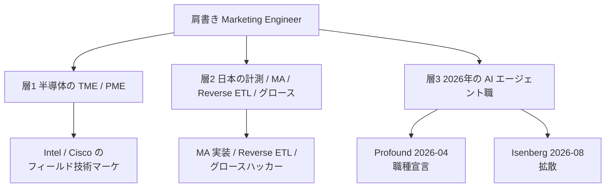
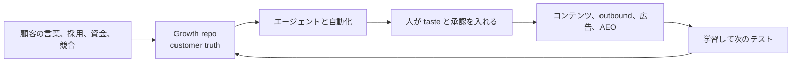

2026年に入って「マーケティングエンジニア（Marketing Engineer）」という肩書きが急に目立つようになりました。「2026年に登場した新職種」「トップ層は年収100万ドル」「新しいタイプの Forward Deployed Engineer」といった強い主張がセットで流通しています。

この記事は、その肩書きを採用する側・目指す側・記事にする側が判断できるように、一次情報（本人の発言、企業の公式ページ、公開求人、公開ボードの掲示）と突き合わせて整理します。扱うのは**求人とキャリアとしての職種**であり、Lilien らが1998年に定着させた学術分野 Marketing Engineering ではありません。名前は似ていますが別物です。

*この記事の全体像。以下、順に解説します。*

## マーケティングエンジニアとは

2026年時点で、Marketing Engineer という同じ文字列は、少なくとも3つの違う仕事を指しています。まずこの三層を分けないと、求人も年収も混ざります。

- **層1**: Intel の Product Marketing Engineer、Cisco の Technical Marketing Engineer。1990年代からある古典職で、製品の技術ナラティブ、PoC、フィールド支援を担います
- **層2**: 日本語圏で同名の求人に多い型。GA4 / GTM の計測、MA・CRM 実装、Reverse ETL、グロースハック
- **層3**: 2026年に新しく職種として宣言された型。AIエージェントで自社の成長システムを組む仕事

以下、断りなく「2026年型」と書くときは層3を指します。

### 2026年型の一次定義

定義の一次は2つあります。

[Nick Lafferty](https://nicklafferty.com/blog/marketing-engineer/) による定義:

> A Marketing Engineer doesn't do the marketing. They build the machine that does.

Greg Isenberg の番組公式記事（2026-08-31）による定義:

> A marketing engineer turns market signal into pipeline using AI agents, data, code, and taste.

2つは言い方が違うだけで、**作る対象がシステムである**という点で一致しています。マーケティングを自分でやるのではなく、マーケティングをする機械を作る。市場のシグナルをパイプラインに変える経路を組む。これが層3の中身です。

[Profound のマニフェスト](https://www.tryprofound.com/marketing-engineer)は、Marketing Ops との切り分けも明示しています。Ops はインフラを動かす役割、Engineering はその上で新しいマーケティングを発明する役割、という分け方です。

### 仕事の置き方

2026年型の仕事は、次のようなループとして描けます。

要点は2つあります。ひとつは、シグナルの蓄積場所（Growth repo、顧客の一次言語）がループの起点かつ戻り先になっていること。もうひとつは、エージェントの出力と実行のあいだに人の承認が挟まっていることです。

### 2つの Flavor

Hanna Huffman は、この職種を2つに分けています。

- **Flavor 1**: 組織に埋め込まれ、マーケチームのシステムを作る係
- **Flavor 2**: 一人で成長 OS を回す係

この2つは求められるものが違います。JD（職務記述書）を書くときに、どちらなのかを先に決めないと採用が破綻します。

## 注意点

流通している主張のうち、一次情報と衝突するものが4つあります。

### 「2026年に生まれた世界初の職種」は成り立たない

ラベルの先行例が複数あります。

- Intel は1990年代末から Product Marketing Engineer を求人に出しています
- Scott Brinker は2008年にブログを開始し、marketing technologist という役割の普及と体系化を進めています（本人は[この語が自分のブログより前から存在した](https://chiefmartec.com/2011/02/got-marketing-technologists/)と明記しています）
- MediaMath の Peter Phelan は [2014-05-17 の投稿](https://www.linkedin.com/pulse/20140517035113-48456821-what-s-a-marketing-engineer)で「we originated the position Marketing Engineer」と書いています（中身はアドテクの client success 回転研修です）
- Adobe の地域トップは2022年にこの語を使っています

新しいのは**ラベル**ではなく、2026年に定義し直されたエージェント中心の仕事の中身です。この2つを分けてください。

### 「年収100万ドル」にオファーの一次はない

Isenberg の一次の表現は「BEST ones」「top 1%」「18から24ヶ月後」です。つまりトップ層についての予測であって、観測値ではありません。番組公式アカウントは翌日に上限を150万ドルへ伸ばしていますが、根拠の追加はありません。

公開ボード [marketingengineer.jobs](https://www.marketingengineer.jobs/) を2026-09-08 に確認したところ、100万ドルの掲示はありませんでした。給与を開示している掲示は次のとおりです。

| 企業 | 求人タイトル | 給与帯（base） |
|---|---|---|
| Profound | Marketing Engineer | $135,000–200,000 |
| Harvey | Marketing Engineer | $136,000–204,000 |
| Figma | Marketing Engineer | $127,000–296,000 |
| Shepherd | Marketing Engineer, Brokerage Growth | $145,000–190,000 |

集計条件は「タイトルが Marketing Engineer に完全一致し、給与を開示しているもの」で、これに当たるのが上の3件（Profound、Harvey、Figma）です。Shepherd は修飾語付きなので参考として並べています。完全一致3件だけでも帯は $127k–296k、中央付近は $135k–200k で変わりません。いずれにせよ100万ドルとは1桁違います。

同じボードには修飾語付きの掲示も他にあります。たとえば Legora の「AI Marketing Engineer」は $188k–231k で、職務は自社マーケティング向けのAIワークフロー構築です。この帯に含めても結論は動きません。一方、Expedia の「Principal Software Development Engineer - Business to Agent」（$231k–324k）は職種名も職務も違うので、この集計には含めていません。

なお、これらはすべて**基本給**の掲示です。株式や追加報酬は別に積まれます。

なお、独立系の給与調査で見かける数字も注意が要ります。PayScale の平均 $74,614（n=14、更新2026-09-01）は層1の半導体型を拾ったもので、AI職の中央値ではありません。

### 「Google はもう雇った」は独立確認できない

Profound のマニフェスト（2026-09-08 時点）は Google について「already hired」と書いています。一方、Google マーケティング幹部 Marvin Chow 本人の投稿（2026年4月）の表現は「hiring our first」、つまりこれから雇う、です。

2つは書かれた時点が違うので、その間に採用が完了した可能性は排除できません。ただし、実際に雇ったことを示す公開 JD や人事発表は確認できませんでした。「Google が採用済み」は、独立に確認できていない主張として扱ってください。

### 熱狂の発信者と製品の売り手が同じ

Profound は、職種名、コース、認定、ジョブボード、そして自社製品を同時に出しています。職種の普及がそのまま自社の商売になる立場です。この構図を踏まえたうえで、掲示件数や需要の主張を読んでください。2026-09-08 時点の公式ボードの掲載は十数件で、「数百件の求人がある」という規模は確認できませんでした。

## 職種名はいつからあるのか

時系列で並べると、「誰が発明したか」が層ごとに違うことが見えます。

| 時期 | 何が起きたか | 中身 |
|---|---|---|
| 1990年代〜 | Intel / Cisco の Product / Technical Marketing Engineer | 製品の技術ナラティブ、PoC、フィールド支援 |
| 2008 | Brinker が chiefmartec を開始し marketing technologist を体系化 | マーケ部門への技術者のネイティブ配置 |
| 2014-05 | MediaMath が originated と主張、Marketing Engineer Program 開始 | アドテク client success の回転研修 |
| 2010年代（日本） | ラルズネットが職種ページを公開 | 広告、SEO、UI。本人はグロースハッカーと言い換え |
| 2021-07 | Scale AI が GTM Engineer 求人を掲載 | Clay の2023年 coined 主張より前 |
| 2023 | Clay が GTM Engineer を社内職として広める | 営業パイプラインの自動化 |
| 2026-04-14 | **Profound が Marketing Engineer を新職として発表** | エージェント、自動化、データ基盤 |
| 2026-08-31 | **Isenberg が FDE の比喩と $1M で拡散** | 成長システムと Growth repo |

2026年型のラベルを職種として立てたのは Profound（4月）、それを広く流通させたのが Isenberg（8月、4ヶ月後）です。**Isenberg は coiner ではなく拡散者**です。

補足すると、Isenberg が2024-07-25 に書いたブログ *Marketers are the New Engineers* は「コンテンツマーケターが新しいエンジニアだ」という別の主張で、職種名は使っていません。二次情報でこのブログが「Isenberg の初出」として引かれていることがありますが、誤リンクです。

## 隣接職種との違い

「同じ仕事の別ラベル」として一括りにはできません。誰の問題を解くかで分かれます。

| 職種 | 対面 | 成果指標 | 所属 | 2026年型との関係 |
|---|---|---|---|---|
| Marketing Engineer（2026年型） | 自社マーケ | パイプライン、CV、トラフィック | Marketing | 基準 |
| FDE（Palantir） | 顧客現場 | 顧客の運用KPI | BD / Applied AI | 型の借用。職務は別 |
| Growth Engineer | 自社ユーザー | 獲得、活性化、定着 | Engineering | 指標は近い。所有物がプロダクト |
| GTM Engineer（Clay） | 自社GTM | シグナル、outbound | RevOps / Growth | **最も近い** |
| Marketing Ops | 内部イネーブル | データ品質、実行速度 | CMO配下 | Profound が明示分離 |
| MarTech / Technologist | 内部 | スタック、計測、独自開発 | マーケ / Business Systems | 運用から独自開発まで含む広い職域。重なる部分がある |
| Content Engineer | 内部 | コンテンツの量と品質 | Marketing | 部分集合 |
| GitLab Fullstack Marketing | 内部 | マーケサイト | Digital Experience | 名前の衝突。サイトSWE |
| Intel / Cisco TME | 顧客とセールス | 採用とPoC | Product Marketing | 名前の衝突。古典職 |

### FDE との関係

Isenberg の「新しいタイプの FDE」という言い方は、採用広報としては効きますが、[Palantir 公式の FDE の定義](https://blog.palantir.com/a-day-in-the-life-of-a-palantir-forward-deployed-software-engineer-45ef2de257b1)とは職務が違います。

- **FDE**: 顧客に埋め込まれ、顧客の運用成果を測る。one customer, many capabilities
- **Marketing Engineer（2026年型）**: 自社のマーケティングに座り、パイプラインとコンバージョンを測る

重なるのは「現場の手順を見てから仕組みを置く」という姿勢です。成果の帰属先も失敗モードも違います。

なお、この二項対立は完全ではありません。Stripe の [Forward Deployed AI Accelerator, Marketing](https://stripe.com/careers/listing/forward-deployed-ai-accelerator-marketing/8055930) は、FDE の手法を25〜45人の自社マーケチームへ適用する形をとっています。社内に FDE 型を置く事例です。

## 年収はいくらか

層を分けて読む必要があります。混ぜると1桁ずれます。

| 層 | 数字 | 時点 | 性質 |
|---|---|---|---|
| Isenberg の言説 | $250k / $500k / $1M（翌日$1.5M） | 2026-08-31 | トップ1%の予測。オファーの一次なし |
| Huffman の言説 | Flavor 2 に $400k | 2026-04-27 | 「創業者なら払う」という意思表明 |
| 公開ボードの掲示 | 完全一致3件で $127k–296k、中央付近 $135k–200k | 2026-09-08 | base。equity は別 |
| Levels.fyi の GTM Engineer | median TC 約 $156k、p90 約 $397k | 2026-09-08取得 | 近接職。n は非開示 |
| [Glassdoor の Marketing Engineer](https://www.glassdoor.com/Salaries/marketing-engineer-salary-SRCH_KO0,18.htm) | median total 約 $164k | 2026-09-08取得 | 同名の複数業界・職務が混在した集計。2026年型だけの中央値ではない |
| PayScale | 平均 $74,614（n=14） | 2026-09-01更新 | 層1 |

Isenberg 自身は、収益化の経路として社内採用、コンサル（月$5k–$30k）、プロダクト化したサービス、ソフトウェアの4つを挙げています。これらを合算せよという明示はありませんが、参考までに、コンサルだけを月$30kで12ヶ月回した場合の年間収入は$360kです。

言えるのは、**確認できた基本給の掲示に100万ドルは存在しない**ということです。雇用の基本給、株式を含む総報酬、事業としての売上は別々に見る必要があります。

### 求人が求めるスキル

必須と歓迎は求人ごとに違います。まとめて「必須」と読むと、採用基準も学習の優先順位も誤ります。

公開JDと定義者の発言で、**求人の中核**に置かれているもの:

- **マーケティングの判断と taste**（Isenberg、Lafferty がともに第一に置く）
- **本番に出したエージェントまたは LLM ワークフロー**（[Figma](https://job-boards.greenhouse.io/figma/jobs/6013495004)、[Stripe](https://stripe.com/careers/listing/forward-deployed-ai-accelerator-marketing/8055930)、Profound の JD）
- n8n / Gumloop / Claude Code / API
- 失敗モードの理解とメンテナンス（Lafferty）

**歓迎要件**に置かれていることが多いもの:

- SQL、CRM / MA（Figma は「While it's not required」の項目、Stripe も Marketo・Salesforce の知識を歓迎要件として掲載）

Lafferty は「技術は判断の倍率である」と書いています。判断が先で、技術がそれを増幅する順序です。Huffman は「ChatGPT で広告コピーを書くことではない」と、コピー作成だけの解釈を明確に否定しています。

## 日本語圏の求人はどうなっているか

まず、求人サイトの生カウント（Indeed 5,000+、Green 999+ など）はAND検索のノイズなので使えません。個別のJDを確認すると、次のように類型が分かれます（すべて2026-09-08 時点、掲載媒体に出ている年収帯）。

| 類型 | 企業 | 求人タイトル | 年収帯 | 媒体 | 2026年型との距離 |
|---|---|---|---|---|---|
| 計測とタグ | メドレー | デジタルマーケティングエンジニア | 700–1,100万 | HRMOS | 基盤の一部 |
| 計測とタグ | [アユダンテ](https://ayudante.jp/recruiting-jp_dm-engineer.htm) | デジタルマーケティングエンジニア | 400–1,000万 | 自社採用ページ | 基盤の一部 |
| データ基盤 | エス・エム・エス（社名非公開、公開情報と照合） | マーケティングエンジニア/データエンジニア | 690–810万 | コトラ | 隣接 |
| データ基盤 | [ニンテンドーシステムズ](https://herp.careers/v1/nscareer/2VYZl9ksKJl5) | マーケティングシステムエンジニア | 520–1,500万 | HERP | 隣接 |
| データ基盤 | MonotaRO | マーケティングプラットフォームエンジニア | 550–1,000万 | Green / ビズリーチ | 隣接 |
| MA / CRM / LINE | 電通デジタル、Ansatz、タイミー | 各社の MA・CRM 実装職 | 各社の採用ページで個別に確認 | 各社採用ページ | MarTech。別物 |
| グロースハッカー | ラルズネット | マーケティング職（本人はグロースハッカーと言い換え） | 非開示 | 自社採用ページ | 部分一致。エージェントはJDにない |
| DevRel | サイボウズ | エンジニアマーケティング | 560–800万 | 自社採用ページ | 別職。語順が違う |
| 半導体 TME | ルネサス、Keysight | Technical Marketing Engineer 等 | 混入する | 各社採用ページ | 層1 |
| 近い仕事、別名 | [SalesNow](https://herp.careers/v1/salesnow0801/cxOP3Qg2Fafv) | GTMエンジニア | 900–2,000万 | HERP | **2026年型に最も近い** |
| 近い仕事、別名 | ラクスル | 【テクノロジー本部】GTMエンジニア | 740–1,000万 | 自社採用ページ | **2026年型に最も近い** |

年収帯はすべて個社の掲示をそのまま載せています。複数社をまとめた数字は使っていません。MA / CRM 類型については、個社ごとの帯を今回は確認していないため、金額を空欄にしています。

「日本にこの求人はない」という言い方は正確ではありません。無いのは**標準化された肩書き**です。仕事自体は複数の名前に分散して存在します。

英語圏の2026年型に近い仕事を日本語で探すなら、「マーケティングエンジニア」より **GTMエンジニア、グロースエンジニア、AIエージェント（マーケティング）** の方が求人と一致します。同名だけを追うと、MA実装と半導体TMEに吸い込まれます。

## 採用する側・目指す側が残すべきもの

### 採用する側

1. **肩書きより Flavor と成果指標を先に書く。** 組織のシステム係（Flavor 1）と一人成長OS（Flavor 2）は別のJDにする
2. **米国の予算の本丸は base $130k–$230k。** 上限は Figma の $296k まで開きます。$1M はJDに書かない
3. **中核要件は、本番に出した自動化とメンテナンス。** SQL や CRM/MA を必須にするか歓迎にするかは、既存チームの穴で決める。コピー作成だけでは採らない
4. **日本では類型をJDの冒頭で宣言する。** 2026年型を採りたいなら、GTM / グロース / AIエージェント（マーケ）と併記する
5. **報告線をどこに置くか先に決める。** Josh Grant（StackedGTM）は、自身が見た匿名の失敗2例から、報告線の設計が重要だと指摘しています。あわせて「曖昧な状況で90日以内に成果物を出せるか」も、本人の資質として別途論じています（いずれも匿名の観察に基づく指摘です）

### 目指す側

1. **残すのは Growth repo。** 顧客の一次言語（customer truth）には引用かリンクを付ける
2. **残すのは他人が火曜日に回せるシステム。** 自分だけが使える個人GPTではありません
3. **ポートフォリオは、動くエージェント1本、計測、CRM連携。** 公開ボードの必須要件に合わせる
4. **仕事の類型で検索する。** 日本で同名だけを追うと別職に吸い込まれます
5. **判断と taste を先に残す。** エージェント構築のスキルは、Isenberg 自身がコモディティ化すると言っています

### この職種のプレミアムが消える条件

Isenberg 自身が消滅条件を挙げています。エージェント構築が全員の基礎スキルになれば、専用職としてのプレミアムは消えます。他に、公開ボードのタイトル完全一致が消えてSEO職とSWE職だけになる、という兆候も指標になります。

## まとめ

- Marketing Engineer という肩書きは、2026年時点で3つの違う仕事を指します。半導体の古典職、日本のMarTech実装、そして2026年型のAIエージェント職です
- 2026年型の定義は「マーケティングをする機械を作る」「市場のシグナルをパイプラインに変える」で、2人の定義者が一致しています
- 職種として立てたのは Profound（2026-04）、拡散したのが Isenberg（2026-08）です。ラベル自体は Intel、Brinker、MediaMath に先行例があります
- 年収100万ドルはトップ層についての予測で、オファーの一次情報はありません。公開ボードの開示4件の基本給は $127k–296k、中央付近は $135k–200k です
- 隣接職では GTM Engineer（Clay型）が最も近く、FDE とは対面も成果の帰属先も違います
- 日本には標準化された肩書きがないだけで、仕事は GTM / グロース / Reverse ETL などに分散して存在します
- 確信度を下げるべき主張は「標準化された新職種」「$1M」「Googleは雇った」「日本でも同じ名前」の4つです
- なお、この記事の求人・年収は2026-09-08 時点の掲示です。掲示は入れ替わるので、判断の前に取得し直してください

この記事が少しでも参考になった、あるいは改善点などがあれば、ぜひリアクションやコメント、SNSでのシェアをいただけると励みになります！

## 参考リンク

一次資料:

- Greg Isenberg, X, 2026-08-31. https://x.com/gregisenberg/status/2094518013068484826
- Greg Isenberg, *Marketing Engineer: The $1M Job with AI Agents*, YouTube, 2026-08-31. https://www.youtube.com/watch?v=8ZC1G1ezN5o
- Startup Ideas Podcast, X Article, 2026-08-31. https://x.com/startupideaspod/status/2094505890980540534
- Greg Isenberg, *Marketers are the New Engineers*, 2024-07-25. https://www.gregisenberg.com/blog/marketers-new-engineers
- Nick Lafferty, *What Is A Marketing Engineer?*, 更新2026-07-30. https://nicklafferty.com/blog/marketing-engineer/
- Profound, *The Marketing Engineer* manifesto. https://www.tryprofound.com/marketing-engineer
- marketingengineer.jobs（2026-09-08取得）. https://www.marketingengineer.jobs/
- Peter Phelan, *What's a Marketing Engineer?*, LinkedIn Pulse, 2014-05-17. https://www.linkedin.com/pulse/20140517035113-48456821-what-s-a-marketing-engineer
- Palantir, *A Day in the Life of a Palantir Forward Deployed Software Engineer*, 2020-11-02. https://blog.palantir.com/a-day-in-the-life-of-a-palantir-forward-deployed-software-engineer-45ef2de257b1
- Hanna Huffman, *The Marketing Engineer isn't a rebrand*, 2026-04-27. https://mktrintheloop.com/the-marketing-engineer-isnt-a-rebrand/
- Figma, Marketing Engineer（求人、2026-09-08取得）. https://job-boards.greenhouse.io/figma/jobs/6013495004
- Stripe, Forward Deployed AI Accelerator, Marketing（求人、2026-09-08取得）. https://stripe.com/careers/listing/forward-deployed-ai-accelerator-marketing/8055930
- Shepherd, Marketing Engineer, Brokerage Growth（求人、2026-09-08取得）. https://jobs.ashbyhq.com/shepherd/8b413a20-4309-4992-8e1d-648a018cfe30
- SalesNow, GTMエンジニア（求人、2026-09-08取得）. https://herp.careers/v1/salesnow0801/cxOP3Qg2Fafv
- PayScale, Marketing Engineer Salary（2026-09-01更新）. https://www.payscale.com/research/US/Job=Marketing_Engineer/Salary
- ラルズネット 職種紹介. https://www.rals.co.jp/recruit/job-category/marketing.php
- サイボウズ エンジニアマーケティング. https://cybozu.co.jp/recruit/entry/career/engineer-marketing.html
- GitLab, Fullstack Engineer - Marketing. https://handbook.gitlab.com/job-description-library/marketing/fullstack-engineer-marketing/
- Scott Brinker, *Got marketing technologists?*, chiefmartec, 2011-02. https://chiefmartec.com/2011/02/got-marketing-technologists/
- Scott Brinker, *Marketing technologist roles and archetypes*, chiefmartec, 2020-01. https://chiefmartec.com/2020/01/marketing-technologists-martech-roles-archetypes/
- アユダンテ デジタルマーケティングエンジニア（求人、2026-09-08取得）. https://ayudante.jp/recruiting-jp_dm-engineer.htm
- ニンテンドーシステムズ マーケティングシステムエンジニア（求人、2026-09-08取得）. https://herp.careers/v1/nscareer/2VYZl9ksKJl5
- Glassdoor, Marketing Engineer Salaries（2026-09-08取得）. https://www.glassdoor.com/Salaries/marketing-engineer-salary-SRCH_KO0,18.htm

二次資料（利益相反や要約を含むもの）:

- Jude Cramer, Fast Company, 2026-04-14. https://www.fastcompany.com/91526554/marketing-jobs-engineer-role-job-listings-curious-phenomenon-sign-of-masculinization
- State of AI Marketing, 2026-09-01. https://www.stateofaimarketing.co/news/marketing-engineer-job-board-salaries/
- George Chasiotis, GrowthWaves, 2026-04-28. https://www.growthwaves.com/p/marketing-engineer
- Josh Grant, *How to hire your first marketing engineer*, StackedGTM. https://newsletter.stackedgtm.ai/p/how-to-hire-your-first-marketing
