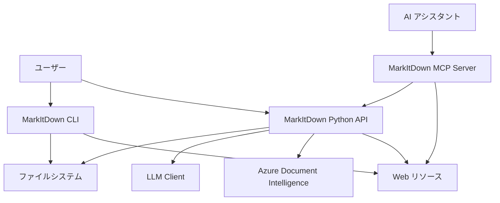
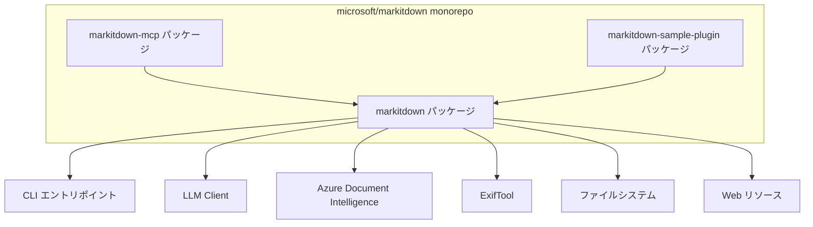
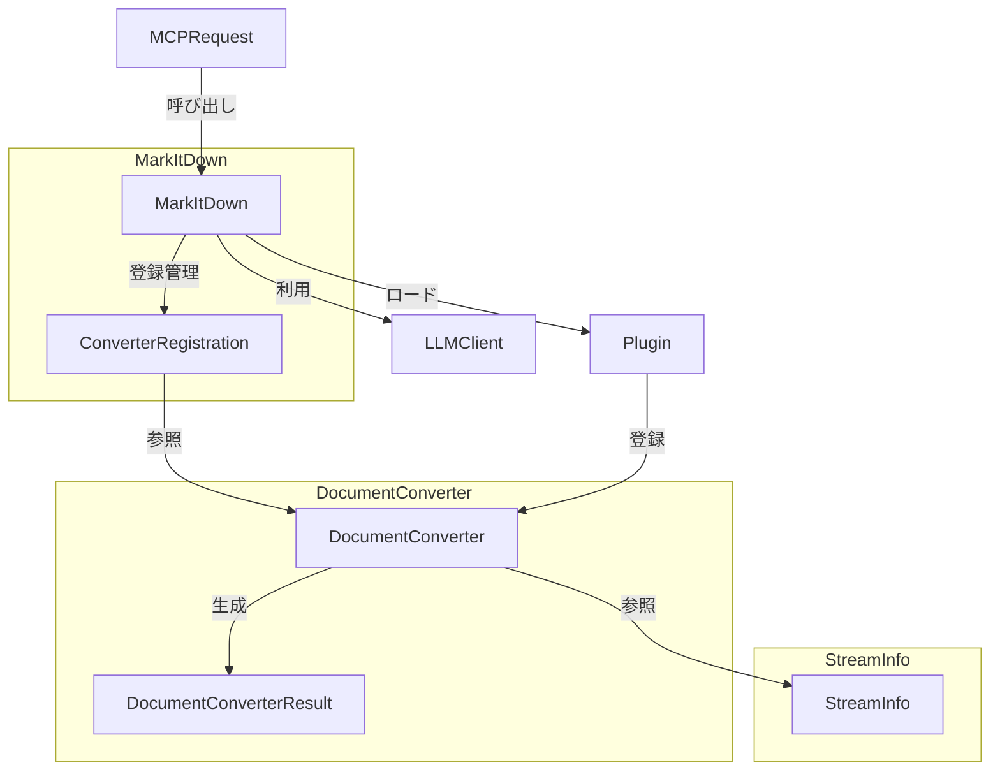
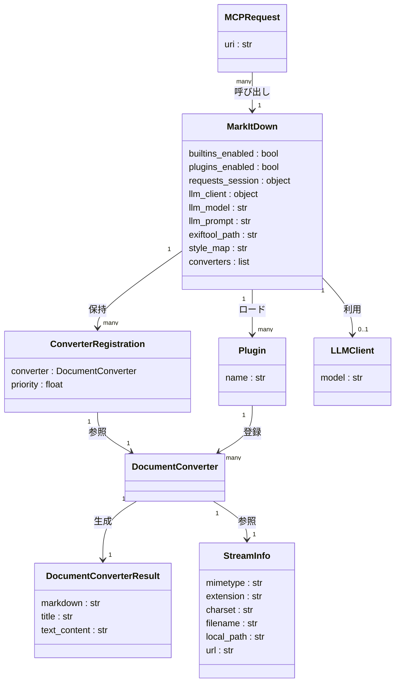

## 概要

MarkItDown は、Microsoft の AutoGen チームが開発したオープンソースの Python ユーティリティです。さまざまなファイル形式を Markdown に変換します。設計の中心には「LLM とテキスト分析パイプラインへの入力最適化」という思想があります。2024 年末に公開され、2026 年 4 月時点で GitHub スター数は 91,000 を超えます。

### 位置づけ

MarkItDown は LLM 前処理ツールとして位置づきます。人間向けの美しい出力ではなく、機械が効率よく読み取れる構造化テキストの生成を優先します。RAG パイプラインや AI エージェントのデータ前処理層として活用します。

### 開発背景

AutoGen の開発過程で、多様な形式のドキュメントを AI エージェントに入力する信頼性の高いパイプラインが必要になりました。その要件から MarkItDown が生まれました。

### 対応フォーマット

| カテゴリ | 形式 |
|---|---|
| Office 文書 | DOCX, XLSX, XLS, PPTX |
| PDF | PDF（pdfminer.six + pdfplumber） |
| 画像 | JPG, PNG（EXIF + OCR + LLM キャプション） |
| 音声 | WAV, MP3（メタデータ + 文字起こし） |
| Web | HTML, RSS, YouTube URL, Wikipedia |
| データ | CSV, JSON, XML |
| その他 | ZIP, EPUB, Outlook .msg, Jupyter Notebook |

### 関連・類似ツールとの比較

| ツール | 実行方式 | 対応フォーマット | LLM 最適化 | 依存の重さ | ライセンス |
|---|---|---|---|---|---|
| MarkItDown | Python ライブラリ / CLI / MCP サーバー | 15 種以上（入力特化） | 高 | 軽量 | MIT |
| Pandoc | CLI / ライブラリ | 60 種以上（双方向） | 低 | 中（Haskell ランタイム） | GPL-2.0 |
| Docling (IBM) | Python ライブラリ | 10 種以上（PDF 高精度） | 中 | 重（HF モデル 1GB 超） | MIT |
| Unstructured | Python / クラウド API | 64 種以上 | 中 | 中〜重 | Apache-2.0 |
| pdfminer.six | Python ライブラリ | PDF のみ | 低 | 軽量 | MIT |
| Apache Tika | Java サーバー / CLI | 1,000 種以上 | 低 | 重（Java ランタイム） | Apache-2.0 |

スキャン PDF や複雑レイアウトの PDF では、Docling や Azure Document Intelligence の併用が適切です。

### ユースケース別推奨ツール

| ユースケース | 推奨ツール | 理由 |
|---|---|---|
| RAG パイプラインの前処理（多形式） | MarkItDown | 軽量、高速、LLM 最適化、多形式対応 |
| 複雑レイアウトの PDF 変換 | Docling | AI レイアウト解析、表構造、読み順判定 |
| 双方向フォーマット変換（人間向け） | Pandoc | 60 種以上の双方向変換、出版品質 |
| 大規模エンタープライズ文書 ETL | Unstructured | 64 種以上、クラウドスケール対応 |
| PDF テキスト抽出のみ | pdfminer.six | 軽量、PDF 特化 |
| 多様形式のメタデータ抽出 | Apache Tika | 1,000 種超対応、エンタープライズ実績 |
| AI アシスタントとの直接統合 | MarkItDown + MCP | Claude Desktop 等と統合可能 |
| Office 形式のみの変換 | MarkItDown | python-docx/openpyxl を内部利用し完結 |

## 特徴

- LLM ネイティブ出力
- トークン効率の高い記法
- 文書階層構造の保持
- 15 種以上の広範なフォーマット対応
- OpenAI クライアントによる画像キャプション生成
- Azure Document Intelligence の高精度 OCR 連携
- markitdown-mcp による Claude Desktop 等との統合
- エントリポイント機構によるプラグイン拡張
- magika による機械学習ベースのファイル判定
- 軽量な Python 実装と少ない依存
- MIT ライセンス
- Docker 対応

## 構造

### システムコンテキスト図



| 要素名 | 説明 |
|---|---|
| ユーザー | CLI または Python API を直接利用する開発者・エンドユーザー |
| MarkItDown CLI | コマンドラインインターフェース |
| MarkItDown Python API | プログラム統合向けの主要クラスを提供するライブラリ |
| MarkItDown MCP Server | MCP 経由で AI アシスタントに変換機能を公開するサーバー |
| LLM Client | 画像キャプション生成に使う OpenAI 互換 API クライアント |
| Azure Document Intelligence | 高精度な PDF・Office 解析の外部サービス |
| ファイルシステム | 変換対象ファイルの読み込み元と出力先 |
| Web リソース | HTTP/HTTPS URI で取得するオンラインリソース |
| AI アシスタント | Claude Desktop 等の MCP 対応 AI アシスタント |

### コンテナ図



| 要素名 | 説明 |
|---|---|
| markitdown パッケージ | コアライブラリ。MarkItDown クラス、Converter、StreamInfo、Plugin 機構 |
| markitdown-mcp パッケージ | MCP サーバー実装。STDIO / Streamable HTTP / SSE トランスポート |
| markitdown-sample-plugin パッケージ | プラグイン開発のリファレンス実装 |
| CLI エントリポイント | __main__.py によるコマンドライン実行 |
| LLM Client | 画像キャプション生成用の外部 LLM API |
| Azure Document Intelligence | ドキュメント OCR・解析の外部サービス |
| ExifTool | 画像・音声のメタデータ抽出ツール |
| ファイルシステム | 変換対象の読み込み元 |
| Web リソース | HTTP/HTTPS/YouTube 等のオンラインコンテンツ |

### コンポーネント図

```mermaid
graph TD
    subgraph markitdown_core["markitdown パッケージ"]
        MarkItDown["MarkItDown"]
        ConverterRegistry["Converter Registry"]
        ConverterRegistration["ConverterRegistration"]
        StreamInfo["StreamInfo"]
        DocumentConverter["DocumentConverter"]
        DocumentConverterResult["DocumentConverterResult"]
        PluginLoader["Plugin Loader"]

        subgraph builtin_converters["組み込み Converter 群"]
            PdfConverter["PdfConverter"]
            DocxConverter["DocxConverter"]
            XlsxConverter["XlsxConverter"]
            PptxConverter["PptxConverter"]
            HtmlConverter["HtmlConverter"]
            ImageConverter["ImageConverter"]
            AudioConverter["AudioConverter"]
            ZipConverter["ZipConverter"]
            YouTubeConverter["YouTubeConverter"]
            EpubConverter["EpubConverter"]
            CsvConverter["CsvConverter"]
            PlainTextConverter["PlainTextConverter"]
            OtherConverters["その他の Converter 群"]
        end

        subgraph optional_converters["オプション Converter"]
            DocIntelConverter["DocumentIntelligenceConverter"]
        end

        subgraph converter_utils["converter_utils"]
            LLMCaption["LLM Caption"]
            TranscribeAudio["Transcribe Audio"]
            ExifToolUtil["ExifTool Util"]
        end
    end

    subgraph markitdown_mcp_pkg["markitdown-mcp パッケージ"]
        MCPServerCore["MCP Server Core"]
        ConvertTool["convert_to_markdown ツール"]
        StdioTransport["STDIO Transport"]
        HttpTransport["Streamable HTTP Transport"]
        SSETransport["SSE Transport"]
    end

    subgraph sample_plugin_pkg["markitdown-sample-plugin パッケージ"]
        SamplePluginModule["Sample Plugin Module"]
        RegisterConverters["register_converters 関数"]
    end

    MarkItDown --> ConverterRegistry
    ConverterRegistry --> ConverterRegistration
    ConverterRegistration --> DocumentConverter
    MarkItDown --> StreamInfo
    MarkItDown --> PluginLoader
    DocumentConverter --> DocumentConverterResult

    PdfConverter --> DocumentConverter
    DocxConverter --> DocumentConverter
    XlsxConverter --> DocumentConverter
    PptxConverter --> DocumentConverter
    HtmlConverter --> DocumentConverter
    ImageConverter --> DocumentConverter
    AudioConverter --> DocumentConverter
    ZipConverter --> DocumentConverter
    YouTubeConverter --> DocumentConverter
    EpubConverter --> DocumentConverter
    CsvConverter --> DocumentConverter
    PlainTextConverter --> DocumentConverter
    OtherConverters --> DocumentConverter
    DocIntelConverter --> DocumentConverter

    ImageConverter --> LLMCaption
    ImageConverter --> ExifToolUtil
    AudioConverter --> TranscribeAudio
    AudioConverter --> ExifToolUtil

    MCPServerCore --> ConvertTool
    MCPServerCore --> StdioTransport
    MCPServerCore --> HttpTransport
    MCPServerCore --> SSETransport
    ConvertTool --> MarkItDown

    PluginLoader --> RegisterConverters
    RegisterConverters --> MarkItDown
    SamplePluginModule --> RegisterConverters
```



#### markitdown パッケージ

| 要素名 | 説明 |
|---|---|
| MarkItDown | 変換パイプライン全体を統括するオーケストレーター |
| Converter Registry | 優先度順にソートされた ConverterRegistration のリスト |
| ConverterRegistration | Converter インスタンスと優先度値を保持するデータクラス |
| StreamInfo | MIME タイプ、文字コード、拡張子、ファイル名、パス、URL を保持するフローズンデータクラス |
| DocumentConverter | 全 Converter の抽象基底クラス |
| DocumentConverterResult | 変換結果を保持するデータクラス |
| Plugin Loader | markitdown.plugin エントリポイントを検出・読み込む機構 |
| PdfConverter | PDF ファイル変換 Converter |
| DocxConverter | DOCX ファイル変換 Converter |
| XlsxConverter | XLSX/XLS ファイル変換 Converter |
| PptxConverter | PPTX ファイル変換 Converter |
| HtmlConverter | HTML 変換 Converter |
| ImageConverter | 画像ファイル変換 Converter |
| AudioConverter | 音声ファイル変換 Converter |
| ZipConverter | ZIP アーカイブ内のファイルを再帰変換する Converter |
| YouTubeConverter | YouTube URL から字幕・メタ情報を取得する Converter |
| EpubConverter | EPub 形式変換 Converter |
| CsvConverter | CSV ファイル変換 Converter |
| PlainTextConverter | プレーンテキスト変換 Converter |
| その他の Converter 群 | RSS、Wikipedia、BingSerp、Outlook MSG、Ipynb、Markdownify 等 |
| DocumentIntelligenceConverter | Azure Document Intelligence を用いるオプション Converter |
| LLM Caption | LLM による画像キャプション生成ユーティリティ |
| Transcribe Audio | 音声書き起こしユーティリティ |
| ExifTool Util | ExifTool を呼び出すメタデータ抽出ユーティリティ |

#### markitdown-mcp パッケージ

| 要素名 | 説明 |
|---|---|
| MCP Server Core | MCP プロトコル処理とトランスポート管理のコアモジュール |
| convert_to_markdown ツール | URI を受け取り MarkItDown に変換を委譲する MCP ツール |
| STDIO Transport | 標準入出力を使う MCP トランスポート |
| Streamable HTTP Transport | HTTP エンドポイントを使う MCP トランスポート |
| SSE Transport | Server-Sent Events を使う MCP トランスポート |

#### markitdown-sample-plugin パッケージ

| 要素名 | 説明 |
|---|---|
| Sample Plugin Module | プラグインのリファレンス実装モジュール |
| register_converters 関数 | プラグインが実装すべきエントリポイント関数 |

#### Converter 優先度・登録機構

- 優先度定数の `PRIORITY_SPECIFIC_FILE_FORMAT = 0.0` が最高優先度です。
- 汎用は `PRIORITY_GENERIC_FILE_FORMAT = 10.0` を使います。
- `register_converter(converter, priority)` は `ConverterRegistration` を生成しリスト先頭に挿入します。
- 変換実行前に優先度の昇順でソートし、同優先度内は後登録が先に評価されます。
- 各 Converter の `accepts()` が True を返した最初の Converter が変換を担当します。

## データ

### 概念モデル



| 要素名 | 説明 |
|---|---|
| MarkItDown | 変換パイプラインのオーケストレーター |
| ConverterRegistration | Converter と優先度を束ねる登録エントリ |
| DocumentConverter | 変換ロジックの抽象基底 |
| DocumentConverterResult | 変換結果の値オブジェクト |
| StreamInfo | 入力ストリームのメタ情報 |
| Plugin | 外部プラグインモジュール |
| LLMClient | 画像キャプション用の LLM クライアント |
| MCPRequest | MCP サーバー経由の変換リクエスト |

### 情報モデル



| 要素名 | 説明 |
|---|---|
| MarkItDown | 設定と Converter レジストリを保持するメインクラス |
| ConverterRegistration | converter インスタンスと priority を保持する登録レコード |
| DocumentConverter | accepts と convert を実装する基底クラス |
| DocumentConverterResult | markdown、title、text_content を返す結果オブジェクト |
| StreamInfo | 入力ストリームのメタ情報を保持するフローズンデータクラス |
| Plugin | register_converters 関数を公開するプラグインモジュール |
| LLMClient | 画像キャプション生成用の外部クライアント |
| MCPRequest | MCP サーバーが受け取る convert_to_markdown の URI リクエスト |

## 構築方法

### pip install（全部入り）

```bash
pip install 'markitdown[all]'
```

### pip install（extras 個別指定）

用途に合わせて必要な extras のみインストールできます。

```bash
pip install 'markitdown[pdf]'
pip install 'markitdown[docx]'
pip install 'markitdown[xlsx]'
pip install 'markitdown[pptx]'
pip install 'markitdown[audio-transcription]'
pip install 'markitdown[youtube-transcription]'
pip install 'markitdown[outlook]'
pip install 'markitdown[az-doc-intel]'
pip install 'markitdown[pdf,docx,pptx]'
```

利用可能な extras は次のとおりです。

- `[pptx]` `[docx]` `[xlsx]` `[xls]`
- `[pdf]`
- `[outlook]`
- `[az-doc-intel]`
- `[audio-transcription]`
- `[youtube-transcription]`
- `[all]`

### uv を使ったインストール

```bash
uv venv --python=3.12 .venv
source .venv/bin/activate
uv pip install 'markitdown[all]'
```

### pipx を使ったインストール

```bash
pipx install 'markitdown[all]'
```

### ソースからインストール

```bash
git clone git@github.com:microsoft/markitdown.git
cd markitdown
pip install -e 'packages/markitdown[all]'
```

### Docker ビルドと実行

```bash
docker build -t markitdown:latest .
docker run --rm -i markitdown:latest < ~/your-file.pdf > output.md
```

### 前提条件

| 項目 | 要件 |
|---|---|
| Python | 3.10 以上 |
| ffmpeg | `[audio-transcription]` 使用時 |
| Azure アカウント | `[az-doc-intel]` 使用時 |
| OpenAI API キー | LLM ビジョン連携時 |

### バージョン確認

```bash
markitdown --version
python -c "import markitdown; print(markitdown.__version__)"
```

## 利用方法

### CLI 基本操作

```bash
markitdown path-to-file.pdf > document.md
markitdown path-to-file.pdf -o document.md
cat path-to-file.pdf | markitdown
```

### CLI プラグイン有効化

```bash
markitdown --list-plugins
markitdown --use-plugins path-to-file.pdf
```

### CLI Azure Document Intelligence 連携

```bash
markitdown path-to-file.pdf -o document.md -d -e "<document_intelligence_endpoint>"
```

- `-d` は Azure Document Intelligence を使うフラグです。
- `-e` はエンドポイント URL を指定します。

### Python API 基本

```python
from markitdown import MarkItDown

md = MarkItDown(enable_plugins=False)
result = md.convert("test.xlsx")
print(result.markdown)
print(result.text_content)
if result.title:
    print(result.title)
```

`DocumentConverterResult` の主要属性は次のとおりです。

| 属性 | 説明 |
|---|---|
| `markdown` | 変換後の Markdown テキスト（推奨） |
| `text_content` | `markdown` の非推奨エイリアス |
| `title` | ドキュメントタイトル |

### Python API convert_stream

```python
from markitdown import MarkItDown

md = MarkItDown()
with open("test.pdf", "rb") as f:
    result = md.convert_stream(f)
    print(result.markdown)
```

### Python API LLM ビジョン連携

```python
from markitdown import MarkItDown
from openai import OpenAI

md = MarkItDown(
    llm_client=OpenAI(),
    llm_model="gpt-4o",
    llm_prompt="optional custom prompt",
)
result = md.convert("example.jpg")
print(result.markdown)
```

### Python API Azure Document Intelligence

```python
from markitdown import MarkItDown

md = MarkItDown(docintel_endpoint="<document_intelligence_endpoint>")
result = md.convert("test.pdf")
print(result.markdown)
```

### Python API プラグイン有効化

```python
from markitdown import MarkItDown
from openai import OpenAI

md = MarkItDown(
    enable_plugins=True,
    llm_client=OpenAI(),
    llm_model="gpt-4o",
)
result = md.convert("document_with_images.pdf")
```

### MCP サーバー（markitdown-mcp）

インストールは次のとおりです。

```bash
pip install markitdown-mcp
```

STDIO モード（デフォルト）の起動コマンドは次のとおりです。

```bash
markitdown-mcp
```

HTTP / SSE モードの起動コマンドは次のとおりです。

```bash
markitdown-mcp --http --host 127.0.0.1 --port 3001
```

Docker での起動例は次のとおりです。

```bash
docker build -t markitdown-mcp:latest .
docker run -it --rm markitdown-mcp:latest
docker run -it --rm -v /home/user/data:/workdir markitdown-mcp:latest
```

Claude Desktop 設定例（`claude_desktop_config.json`）は次のとおりです。

```json
{
  "mcpServers": {
    "markitdown": {
      "command": "markitdown-mcp"
    }
  }
}
```

Docker を使う場合は次のとおりです。

```json
{
  "mcpServers": {
    "markitdown": {
      "command": "docker",
      "args": ["run", "--rm", "-i", "-v", "/home/user/data:/workdir", "markitdown-mcp:latest"]
    }
  }
}
```

MCP サーバーが提供するツールは `convert_to_markdown(uri)` です。対応 URI スキームは `http:` `https:` `file:` `data:` です。

## 運用

### バージョン更新

- `pip install --upgrade 'markitdown[all]'` で最新版に更新します。
- 仮想環境ごとに管理し、他プロジェクトへの影響を遮断します。
- 確認は `pip show markitdown` で行います。
- 0.1.0 以降は `convert_stream()` が binary オブジェクト必須です。旧コードの `io.StringIO` は `io.BytesIO` へ修正します。
- `result.text_content` は deprecated のため、`result.markdown` を使います。

### Docker 運用

公式 Dockerfile は Python 3.13 slim ベースで FFmpeg と ExifTool を事前インストール済みです。

```bash
docker build -t markitdown:latest .
docker run --rm -i markitdown:latest < file.pdf > output.md
docker run --rm -v /path/to/files:/workdir markitdown:latest markitdown /workdir/file.pdf -o /workdir/output.md
```

### ログとデバッグ

markitdown 本体には verbose フラグの公開 API がありません。デバッグには次の方法を使います。

- `FileConversionException` と `UnsupportedFormatException` の例外メッセージには `FailedConversionAttempt` リストが含まれます。
- `logging.basicConfig(level=logging.DEBUG)` で内部ログが出力されます。
- MCP サーバーのデバッグは `npx @modelcontextprotocol/inspector` を使います。

```python
import logging
logging.basicConfig(level=logging.DEBUG)

from markitdown import MarkItDown
md = MarkItDown()
result = md.convert("file.pdf")
```

### ストリーミング変換

```python
from markitdown import MarkItDown, StreamInfo
import io

md = MarkItDown()
with open("file.pdf", "rb") as f:
    byte_stream = io.BytesIO(f.read())

stream_info = StreamInfo(
    mimetype="application/pdf",
    extension=".pdf",
    charset="utf-8",
)
result = md.convert_stream(byte_stream, stream_info=stream_info)
print(result.markdown)
```

ストリームは必要に応じてシーク可能化され、変換試行後にポジションをリセットします。Magika による MIME 検出はストリーム先頭のサンプルのみを読みます。

### 大量ファイル処理と並列化

```python
from concurrent.futures import ThreadPoolExecutor
from markitdown import MarkItDown

md = MarkItDown(enable_plugins=False)

def convert_file(path):
    try:
        return path, md.convert(path).markdown
    except Exception as e:
        return path, f"ERROR: {e}"

files = ["a.pdf", "b.docx", "c.xlsx"]
with ThreadPoolExecutor(max_workers=4) as executor:
    results = list(executor.map(convert_file, files))
```

`MarkItDown` インスタンスはスレッドセーフのため、複数スレッドから共有できます。大容量 ZIP の展開サイズには注意します。

### セキュリティ考慮

- MCP サーバーは `http:` `https:` `file:` `data:` URI を受け付けます。
- MCP サーバーには認証機能がありません。ネットワーク公開環境では `--host 127.0.0.1` で localhost のみにバインドします。
- ユーザー入力 URL を渡す場合は `http://` と `https://` のみ許可し、`file://` は禁止します。
- ZIP コンバーターは再帰的に処理します。ZIP ボム対策は本体に組み込まれていないため、外部で展開サイズ上限をチェックします。

```python
import zipfile

MAX_EXTRACTED_SIZE = 500 * 1024 * 1024

def safe_zip_check(zip_path):
    with zipfile.ZipFile(zip_path) as zf:
        total = sum(info.file_size for info in zf.infolist())
        if total > MAX_EXTRACTED_SIZE:
            raise ValueError(f"ZIP bomb suspected: {total} bytes")
        for info in zf.infolist():
            if ".." in info.filename or info.filename.startswith("/"):
                raise ValueError(f"Path traversal detected: {info.filename}")
```

## ベストプラクティス

### RAG パイプラインへの組み込み

markitdown は RAG パイプラインの前処理に最適です。Markdown の構造がセマンティック境界ベースのチャンキングを容易にします。

推奨フローは次のとおりです。

1. `markitdown[all]` で変換し `.md` を生成
2. LangChain の `MarkdownHeaderTextSplitter` などでヘッダーに沿って分割
3. チャンクサイズは 400〜512 トークン、オーバーラップ 50〜100 トークン
4. メタデータを `result.title` から取得しチャンクに付与

```python
from markitdown import MarkItDown
from langchain.text_splitter import MarkdownHeaderTextSplitter

md = MarkItDown()
result = md.convert("document.pdf")

headers_to_split_on = [
    ("#", "H1"),
    ("##", "H2"),
    ("###", "H3"),
]
splitter = MarkdownHeaderTextSplitter(headers_to_split_on=headers_to_split_on)
chunks = splitter.split_text(result.markdown)
```

### プラグインによるフォーマット追加

カスタムフォーマット追加は公式 sample plugin を参考にします。

```python
__plugin_interface_version__ = 1

class MyConverter(DocumentConverter):
    def accepts(self, file_stream, stream_info, **kwargs) -> bool:
        return (stream_info.extension == ".myext" or
                stream_info.mimetype == "application/x-myformat")

    def convert(self, file_stream, stream_info, **kwargs) -> DocumentConverterResult:
        content = file_stream.read()
        return DocumentConverterResult(markdown=converted, title=None)

def register_converters(markitdown, **kwargs):
    markitdown.register_converter(MyConverter(), priority=0.0)
```

優先度の使い分けは次のとおりです。

| priority 値 | 用途 |
|---|---|
| `-1.0` 以下 | 組み込み converter の上書き（OCR プラグインが使用） |
| `0.0` | 特定フォーマット専用 converter |
| `10.0` | フォールバック的な汎用 converter |

`pyproject.toml` への登録は次のとおりです。

```toml
[project.entry-points."markitdown.plugin"]
my_plugin = "my_package.plugin_module"
```

- 依存ライブラリが未インストールの場合は `convert()` 内で `MissingDependencyException` を raise します。
- プラグインはデフォルト無効です。ユーザーが `enable_plugins=True` または `--use-plugins` で明示的に有効化します。
- `accepts()` では stream position を変更しないようにします。

### Azure Document Intelligence との使い分け

| 項目 | ローカル変換 | Azure Document Intelligence |
|---|---|---|
| コスト | 無料 | 有料（ページ単位） |
| スキャン PDF | 不可 | 対応（高解像度 OCR） |
| テキスト PDF | 良好 | 良好 |
| 複雑なレイアウト | 限定的 | 高精度（表、数式、段組み） |
| 数式 | 未対応 | LaTeX 出力 |
| プライバシー | ローカル処理 | クラウド送信あり |
| オフライン | 可 | 不可 |

- ローカル変換はデジタル生成 PDF、Office 文書、Web コンテンツ、プライバシー重視、コスト重視に向きます。
- Azure Document Intelligence はスキャン PDF、手書き文書、複雑な表、数式、高精度が必要な業務文書に向きます。
- 機密文書はクラウドに送信せず、ローカル OCR プラグイン（markitdown-ocr）を代替に検討します。

### トークン削減のための後処理

```python
import re

def clean_markdown_for_llm(md_text: str) -> str:
    md_text = re.sub(r'\n{3,}', '\n\n', md_text)
    md_text = re.sub(r'\n.*?Page \d+ of \d+.*?\n', '\n', md_text)
    md_text = re.sub(r'(\n---\n)+', '\n---\n', md_text)
    md_text = re.sub(r'<!--.*?-->', '', md_text, flags=re.DOTALL)
    return md_text.strip()
```

- Excel/CSV は行数が多い場合に代表行のみサンプリングします。
- 画像の ALT テキストが長い場合は短縮します。
- 不要な脚注や参考文献セクションは正規表現で除去します。
- 複数ページにまたがるテーブルの重複ヘッダー行を除去します。

## トラブルシューティング

### 典型エラー一覧

| 症状 | 原因 | 対処 |
|---|---|---|
| `MissingDependencyException: Install markitdown[pdf]` | PDF extras 未インストール | `pip install 'markitdown[pdf]'` |
| `MissingDependencyException: Install markitdown[docx]` | docx extras 未インストール | `pip install 'markitdown[docx]'` |
| `MissingDependencyException: Install markitdown[xlsx]` | xlsx extras 未インストール | `pip install 'markitdown[xlsx]'` |
| `MissingDependencyException: Install markitdown[audio-transcription]` | 音声 extras 未インストール | `pip install 'markitdown[audio-transcription]'` |
| `UnsupportedFormatException` | 対応外フォーマットまたは extras 不足 | extras 確認、プラグイン追加 |
| `FileConversionException` | 全 converter が失敗 | ファイル破損確認、extras 確認 |
| `'charmap' codec can't encode characters` | Windows の出力エンコーディングが cp1252 | `-o` でファイル出力、`PYTHONIOENCODING=utf-8` |
| `(cid:xxx)` 出力混入 | pdfminer の文字マッピング失敗 | Azure Document Intelligence、markitdown-ocr |
| 音声書き起こしが空またはエラー | ffmpeg 未インストール、PATH 未設定 | ffmpeg インストール、`FFMPEG_PATH` 設定 |
| スキャン PDF が空テキスト | 画像のみ PDF | markitdown-ocr、Azure Document Intelligence |
| MCP サーバー接続失敗 | 設定 JSON 不正、パス誤り | MCP Inspector で検証 |
| Claude Desktop で MCP が読み込まれない | 設定後の再起動なし | 完全終了して再起動 |

### スキャン PDF からの OCR フォールバック

```bash
pip install markitdown-ocr
markitdown --use-plugins scan.pdf

pip install 'markitdown[az-doc-intel]'
markitdown scan.pdf -d -e "https://<your-endpoint>.cognitiveservices.azure.com/"
```

```python
from markitdown import MarkItDown

def convert_with_ocr_fallback(path, docintel_endpoint=None):
    md = MarkItDown()
    result = md.convert(path)
    if result.markdown.strip():
        return result.markdown
    if docintel_endpoint:
        md_ocr = MarkItDown(docintel_endpoint=docintel_endpoint)
        return md_ocr.convert(path).markdown
    return ""
```

### 文字化け対処（StreamInfo の charset 指定）

```python
from markitdown import MarkItDown, StreamInfo

md = MarkItDown()
with open("sjis_file.txt", "rb") as f:
    stream_info = StreamInfo(
        extension=".txt",
        charset="shift_jis",
    )
    result = md.convert_stream(f, stream_info=stream_info)
    print(result.markdown)
```

Windows での出力エンコーディング対処は次のとおりです。

```bash
markitdown file.pdf -o output.md
```

### 音声書き起こし失敗（ffmpeg 不足）

```bash
pip install 'markitdown[audio-transcription]'
brew install ffmpeg
sudo apt-get install ffmpeg
export FFMPEG_PATH=/usr/local/bin/ffmpeg
```

Docker の公式イメージには ffmpeg が含まれているため、音声処理にもそのまま対応できます。

### MCP サーバー接続失敗

| 原因 | 対処 |
|---|---|
| JSON 構文エラー | jsonlint.com 等で JSON を検証 |
| `markitdown-mcp` コマンドが PATH にない | `which markitdown-mcp` で確認、`~/.local/bin` を PATH に追加 |
| Claude Desktop の再起動なし | 完全終了して再起動 |
| Windows の設定ファイルパス誤り | `%APPDATA%\Claude\claude_desktop_config.json` |
| Docker イメージ不在 | `docker images` で確認、`docker build` を再実行 |

設定ファイルの場所は次のとおりです。

- macOS: `~/Library/Application Support/Claude/claude_desktop_config.json`
- Windows: `%APPDATA%\Claude\claude_desktop_config.json`

MCP Inspector による検証は次のとおりです。

```bash
npx @modelcontextprotocol/inspector
markitdown-mcp --http --host 127.0.0.1 --port 3001
```

## まとめ

MarkItDown は多様なファイル形式を LLM 最適化された Markdown に変換する Microsoft 製の Python ユーティリティです。CLI、Python API、MCP サーバー、プラグイン機構、Azure Document Intelligence 連携を備え、RAG パイプラインの前処理層として軽量かつ実用的に組み込めます。

この記事が少しでも参考になった、あるいは改善点などがあれば、ぜひリアクションやコメント、SNSでのシェアをいただけると励みになります！

## 参考リンク

- 公式ドキュメント
  - [packages/markitdown README](https://github.com/microsoft/markitdown/blob/main/packages/markitdown/README.md)
  - [packages/markitdown-mcp README](https://github.com/microsoft/markitdown/blob/main/packages/markitdown-mcp/README.md)
  - [Plugin Development Guide - Mintlify](https://www.mintlify.com/microsoft/markitdown/advanced/plugin-development)
  - [Azure Document Intelligence Guide - Mintlify](https://www.mintlify.com/microsoft/markitdown/guides/azure-document-intelligence)
  - [Choose the right Azure AI tool for document processing - Microsoft Learn](https://learn.microsoft.com/en-us/azure/ai-services/content-understanding/choosing-right-ai-tool)
- GitHub
  - [microsoft/markitdown](https://github.com/microsoft/markitdown)
  - [README.md](https://raw.githubusercontent.com/microsoft/markitdown/main/README.md)
  - [markitdown src](https://github.com/microsoft/markitdown/tree/main/packages/markitdown/src/markitdown)
  - [converters ディレクトリ](https://github.com/microsoft/markitdown/tree/main/packages/markitdown/src/markitdown/converters)
  - [_markitdown.py](https://raw.githubusercontent.com/microsoft/markitdown/main/packages/markitdown/src/markitdown/_markitdown.py)
  - [_base_converter.py](https://raw.githubusercontent.com/microsoft/markitdown/main/packages/markitdown/src/markitdown/_base_converter.py)
  - [_stream_info.py](https://raw.githubusercontent.com/microsoft/markitdown/main/packages/markitdown/src/markitdown/_stream_info.py)
  - [markitdown-sample-plugin](https://github.com/microsoft/markitdown/tree/main/packages/markitdown-sample-plugin)
  - [markitdown-ocr](https://github.com/microsoft/markitdown/tree/main/packages/markitdown-ocr)
  - [Issue #1290](https://github.com/microsoft/markitdown/issues/1290)
  - [Issue #313](https://github.com/microsoft/markitdown/issues/313)
  - [Issue #21](https://github.com/microsoft/markitdown/issues/21)
  - [Issue #74](https://github.com/microsoft/markitdown/issues/74)
  - [Issue #1152](https://github.com/microsoft/markitdown/issues/1152)
  - [PyPI - markitdown](https://pypi.org/project/markitdown/)
  - [PyPI - markitdown-mcp](https://pypi.org/project/markitdown-mcp/)
  - [#markitdown-plugin topic](https://github.com/topics/markitdown-plugin)
- 記事
  - [DeepWiki: microsoft/markitdown](https://deepwiki.com/microsoft/markitdown)
  - [Installation and Setup - DeepWiki](https://deepwiki.com/microsoft/markitdown/1.2-installation-and-setup)
  - [Conversion System - DeepWiki](https://deepwiki.com/microsoft/markitdown/3-conversion-system)
  - [Plugin System - DeepWiki](https://deepwiki.com/microsoft/markitdown/4-plugin-system)
  - [MarkItDown - InfoWorld](https://www.infoworld.com/article/3963991/markitdown-microsofts-open-source-tool-for-markdown-conversion.html)
  - [Microsoft's MarkItDown uses - Analytics Vidhya](https://analyticsvidhya.com/blog/2025/12/microsofts-markitdown-uses/)
  - [PDF to Markdown open source deep dive - Jimmy Song](https://jimmysong.io/blog/pdf-to-markdown-open-source-deep-dive/)
  - [Azure DI vs MarkItDown vs Tika](https://github.com/kimtth/azure-document-intelligence-vs-markitdown-vs-tika)
  - [How to Use MarkItDown MCP with Claude Desktop - BSWEN](https://docs.bswen.com/blog/2026-03-22-markitdown-mcp-server/)
  - [MarkItDown for RAG Pipelines - Emelia](https://emelia.io/hub/markitdown-microsoft-guide)
  - [Best PDF & Document Processing MCP Servers - ChatForest](https://chatforest.com/guides/best-pdf-document-processing-mcp-servers/)
  - [Chunking Strategies for RAG - Weaviate](https://weaviate.io/blog/chunking-strategies-for-rag)
  - [LLM Token Optimization - Redis](https://redis.io/blog/llm-token-optimization-speed-up-apps/)
