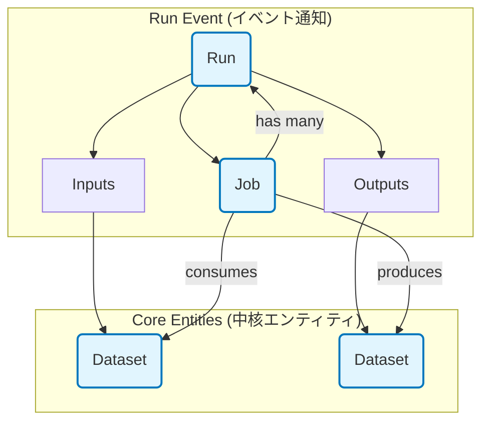
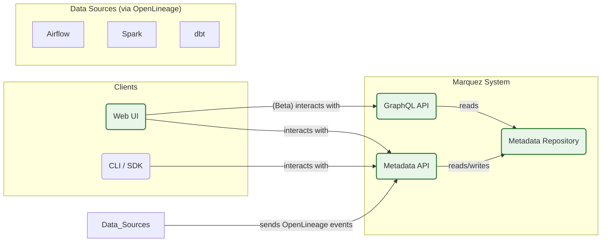

## ■はじめに

この記事では、データリネージの世界における **「標準仕様」であるOpenLineage** と、その **「リファレンス実装」であるMarquez** の全貌を体系的に整理します。

## ■第1章：課題と解決策

**【この章でわかること】**

  * なぜ今、データリネージが重要なのか
  * OpenLineageが解決した「メタデータのサイロ化」問題
  * OpenLineageとMarquezの基本的な関係性

### ●1.1. 現代データ環境の課題

現代のデータパイプラインは、多様なデータソースやアーキテクチャが絡み合い、極めて複雑化しています。この環境では、データのライフサイクル（生成、変換、利用）を完全に追跡することは困難です。

この課題を解決する技術が**データリネージ**です。データリネージは、データの流れと変換の全行程を追跡・記録し、データエコシステム全体の可視性を確保します。

#### ▷データリネージの重要性

  * **データガバナンスとコンプライアンス**: 機密情報の流れを示す監査証跡を提供し、GDPRなどの規制要件への準拠を証明します。
  * **データ品質と信頼性**: データの異常値を検知した際、流れを遡って品質問題の発生源を迅速に特定します。
  * **運用の効率化と原因分析**: パイプラインの障害発生時に影響範囲を特定し、根本原因を突き止め、修正を効率化します。

### ●1.2. OpenLineage：メタデータ収集の標準化

データリネージ実現の大きな障壁は、メタデータ収集がツールごとに独立し「サイロ化」してしまう問題でした。

#### ▷OpenLineage登場前の問題点

  * **開発労力の重複**: 各リネージツールが、データ処理フレームワークごとに個別の連携機能を開発する必要がありました。
  * **互換性の欠如**: 連携機能は、フレームワークのバージョンアップにより容易に破損するリスクがありました。

#### ▷OpenLineageによる解決策

OpenLineageは、データリネージメタデータを収集するための**オープンスタンダード（公開仕様）**を定義します。

  * **開発労力の共有**: 各フレームワークがOpenLineage仕様のメタデータを出力すれば、受け手側は一度の実装であらゆるツールに対応できます。
  * **互換性の確保**: 連携機能をフレームワーク本体に組み込むことで、バージョンアップ時の互換性が担保されます。

### ●1.3. Marquez：OpenLineageの参照実装

OpenLineageがデータリネージの「設計図」を定義するのに対し、その仕様を現実に価値あるものとして具現化するのが**Marquez**です。

Marquezは、OpenLineage仕様の**参照実装**として開発されたオープンソースのメタデータサービスです。OpenLineageイベントを収集する標準的なバックエンドとして機能します。

さらに、収集したメタデータを集約・保存し、Web UIを通じて強力なデータリネージグラフとして可視化する**完全なソリューション**も提供します。

MarquezとOpenLineageは、共にLinux Foundation傘下のLF AI & Data Foundationの卒業プロジェクトとして認定されており、その中立性と将来性が保証されています。


## ■第2章：OpenLineage：データリネージのオープンスタンダード

**【この章でわかること】**

  * OpenLineageの設計思想とコアデータモデル
  * メタデータを無限に拡張できる「Facet」の仕組み
  * 仕様がどのように定義され、相互運用性を担保しているか

### ●2.1. 設計思想とエコシステム

OpenLineageは、実行中のジョブからメタデータをリアルタイムで記録することに主眼を置いたオープンなフレームワークです。これにより、データパイプラインの動的な振る舞いを捉え、 **データオブザーバビリティ（可観測性）** を実現します。

エコシステムにおいては、Marquez（参照実装）やEgeria（エンタープライズガバナンスツール）といった他のオープンソースプロジェクトと連携し、広範な価値を提供します。

### ●2.2. コアデータモデル

OpenLineageのデータモデルは、4つの基本要素で構成されます。これらの要素は、システム間で一意性を保つための厳格な命名規則に従います。



| 要素名 | 説明 |
| :--- | :--- |
| **Run Event** | ジョブ実行（Run）の状態遷移（START, COMPLETE等）を示す通知。リネージ情報の基本単位。 |
| **Job** | データセットを処理するプロセスの静的な定義（例：Airflowのタスク、Sparkのコード）。 |
| **Run** | Jobの動的な実行インスタンス。Jobが実行されるたびに生成され、一意の`runId`で識別。 |
| **Dataset** | データの抽象的な表現（例：DBのテーブル、ストレージ上のファイル群）。 |

このモデルの核心は、異なるシステム間で同一のデータ資産を一意に識別するための、一貫した**命名戦略**にあります。例えば、あるAirflowジョブとSparkジョブが同じPostgreSQLテーブルを扱う場合、両者がそのテーブルに対して同一の`namespace`と`name`を生成することで、リネージグラフが正しく連結されます。

### ●2.3. Facetによるメタデータの拡張

**Facet**は、コアエンティティ（Run, Job, Dataset）に付加する、構造化された原子的なメタデータです。まるでレゴブロックのように基本要素に情報を付け足していくことで、仕様は無限の拡張性を持ちます。

#### ▷標準ファセット

一般的なユースケースに対応するため、多数の標準ファセットが定義されています。

| 対象エンティティ | ファセット例 | 説明 |
| :--- | :--- | :--- |
| **Run** | `errorMessage` | 実行が失敗した際のエラーメッセージやスタックトレース。 |
| | `parent` | 親ジョブの実行情報（例：AirflowのDAG RunとTask Run）。 |
| **Job** | `sourceCodeLocation` | ソースコードのGitリポジトリURLとコミットSHA。 |
| | `sql` | ジョブが実行するSQLクエリ。 |
| **Dataset** | `schema` | データセットのスキーマ情報（列名、データ型など）。 |
| | `columnLineage` | どの入力列がどの出力列に影響したかを示すカラムレベルリネージ。 |
| | `dataQualityMetrics` | データ品質テストの結果（行数、null数など）。 |

#### ▷カスタムファセット

組織固有のメタデータを追加したい場合、カスタムファセットを定義できます。カスタムファセットは、その構造を定義したJSON SchemaへのURL（`_schemaURL`）を持つ必要があります。これにより、Marquezのような受け手側は、未知のファセットでもその内容を解釈できます。

### ●2.4. 仕様定義

OpenLineageの仕様は、OpenAPIとJsonSchemaを用いて機械可読な形で厳密に定義されています。これにより、ツール間の高い相互運用性を保証します。


## ■第3章：Marquez：アーキテクチャと機能

**【この章でわかること】**

  * Marquezのシンプルなアーキテクチャとその利点
  * リネージ情報を永続化するデータモデル（不変性とバージョン管理）
  * Marquezが提供するリネージ可視化などの主要機能

### ●3.1. アーキテクチャ

Marquezは、迅速な導入と容易な管理を可能にするため、意図的にシンプルに設計されたモジュラーシステムです。



| 要素名 | 説明 |
| :--- | :--- |
| **Metadata API** | Javaで実装されたRESTful APIサーバー。OpenLineageイベントを受け取る中心的な窓口。 |
| **Metadata Repository** | 収集した全てのメタデータを永続化するリポジトリ。バックエンドはPostgreSQLに限定。 |
| **Web UI** | Reactで構築されたフロントエンド。リネージグラフの可視化やメタデータの探索を提供。 |
| **GraphQL API** | (ベータ版) 柔軟なメタデータクエリを可能にするAPI。 |

この意図的にシンプルな構成は、Kafkaのような大規模分散システムの導入・運用オーバーヘッドを避け、迅速な立ち上げと容易な管理を実現します。

### ●3.2. データモデル：不変性とバージョン管理

Marquezは、OpenLineageから送られる一時的な「イベント」を、バージョン管理された永続的な「状態」へ変換します。このモデルは**不変性 (Immutability)** を基本思想としています。つまり、一度記録されたメタデータは変更されず、新しいバージョンとして追記されます。

| OpenLineageエンティティ | Marquezエンティティ | マッピングの概要 |
| :--- | :--- | :--- |
| Job (イベント内) | **Job** (永続) | OpenLineageイベント内の`job`オブジェクトは、Marquezの`jobs`テーブルのレコードに対応。 |
| Run (イベント内) | **Run** (永続) | `runId`で識別される実行インスタンス。`runs`テーブルに格納され、ライフサイクルが更新される。 |
| Dataset (イベント内) | **Dataset** (永続) | イベント内の`inputs`/`outputs`は、`datasets`テーブルのレコードに対応。 |
| Job Facet | **JobVersion** | `sourceCodeLocation`や`sql`などのファセットは、特定のRunに紐づく不変の`job_versions`レコードとして永続化。 |
| Dataset Facet | **DatasetVersion** | `schema`などのファセットは、特定のRunによって生成された不変の`dataset_versions`レコードとして永続化。 |

このバージョン管理により、「どの実行が、どのコードとスキーマに基づいていたか」を正確に追跡でき、時間軸を伴う動的な分析が可能になります。過去の任意の状態にいつでも正確に立ち返ることができるため、トラブルシューティングや監査において絶大な力を発揮します。

### ●3.3. 主要機能

  * **データリネージの可視化**: ジョブとデータセットの依存関係を、操作可能な有向非巡回グラフ（DAG）としてWeb UIに描画します。
  * **データディスカバリ**: UIの検索バーからメタデータを横断的に検索し、各要素の詳細情報（スキーマ、所有者、説明など）を閲覧できます。
  * **実行履歴とパフォーマンス分析**: 各ジョブの実行履歴（開始・終了時刻、所要時間、ステータス）をリスト表示し、パフォーマンス傾向を分析できます。
  * **カラムレベルリネージ**: どの入力列がどの出力列に影響を与えたかという、より詳細なリネージ情報を提供します。


## ■第4章：構築方法

**【この章でわかること】**

  * 開発・評価用のローカル環境をDocker Composeで手軽に立ち上げる方法
  * 本番環境を想定したKubernetesとHelmによるデプロイ手順

### ●4.1. ローカル環境構築 (Docker Compose)

開発や評価目的では、公式のDocker Composeを利用する方法が最も手軽です。

#### ▷前提条件

  * Docker
  * Docker Compose
  * Git

#### ▷手順

1.  **Marquezリポジトリのクローン**
    ```bash
    git clone https://github.com/MarquezProject/marquez.git
    cd marquez
    ```
2.  **Dockerコンテナの起動**
      * 初めて試す場合は、`--seed`フラグ付きでの起動を強く推奨します。サンプルデータが投入され、すぐに機能を試せます。

    ```bash
    # サンプルデータなしで起動
    # ./docker/up.sh

    # サンプルデータ付きで起動
    ./docker/up.sh --seed
    ```
3.  **アクセス**
      * **Web UI:** `http://localhost:3000`
      * **HTTP API:** `http://localhost:5000`

### ●4.2. 本番環境構築 (Kubernetes + Helm)

本番環境では、スケーラビリティと可用性を考慮し、アプリケーションをKubernetes、データベースをマネージドサービス（AWS RDSなど）に分離する構成を推奨します。

#### ▷前提条件

  * 稼働中のKubernetesクラスタ
  * kubectl
  * Helm

#### ▷手順

1.  **PostgreSQLデータベースの準備**: AWS RDS for PostgreSQLなどのマネージドサービスで、`marquez`という名前のデータベースと接続用ユーザーを作成します。
2.  **Helm Chartによるデプロイ**: Marquezは公式Helm Chartを提供しており、Kubernetesへのデプロイを簡素化します。
    ```bash
    # (任意) Marquez用のnamespaceを作成
    kubectl create namespace marquez

    # Helm Chartを使ってMarquezをデプロイ
    # 外部DBを利用するため、チャート内のPostgreSQLは無効化 (postgresql.enabled=false)
    helm upgrade --install marquez ./chart \
      --namespace marquez \
      --set postgresql.enabled=false \
      --set marquez.db.host=<YOUR_RDS_HOST> \
      --set marquez.db.user=<YOUR_RDS_USERNAME> \
      --set marquez.db.password=<YOUR_RDS_PASSWORD>
    ```

### ●4.3. 設定ファイル (marquez.yml)

`marquez.yml`はMarquez APIサーバーの挙動を制御する中心的な設定ファイルです。主要なパラメータを解説します。

| パラメータ名 | 説明 | デフォルト値 |
| :--- | :--- | :--- |
| `database.url` | 接続先のPostgreSQLのJDBC URL。 | `jdbc:postgresql://localhost:5432/marquez` |
| `migrateOnStartup` | 起動時にFlywayによるDBスキーマのマイグレーションを自動実行するか。本番環境では`true`を推奨。 | `true` |
| `dbRetention.retentionDays` | 実行履歴データを保持する最大日数。これを超えたデータは削除対象となるため、データベースの肥大化を防ぐために設定が不可欠。 | 7 |

:::message alert
 `dbRetention.retentionDays`のデフォルト値は **7日** です。この設定を見落とすと、**古いリネージ情報が気づかないうちに失われる**可能性があります。本番運用前には、組織のポリシーに合わせて必ず適切な値（例: `365`など）に見直してください。
:::

## ■第5章：利用方法

**【この章でわかること】**

  * Airflow, Spark, dbtといった主要ツールと連携させる具体的な方法
  * 収集したメタデータをどのように活用できるか

### ●5.1. 主要ツールとの連携

MarquezとOpenLineageの価値は、既存のデータツールと連携し、自動でメタデータを収集することで発揮されます。

| ツール | セットアップ方法 | テーブルレベルリネージ | カラムレベルリネージ | 特徴的な収集メタデータ |
| :--- | :--- | :--- | :--- | :--- |
| **Apache Airflow** | `apache-airflow-providers-openlineage` パッケージをインストールし、`airflow.cfg`で設定。 | ✅ | ✅ (対応Operatorのみ) | `sourceCode` (PythonOperator), タスク固有メタデータ |
| **Apache Spark** | `spark-submit`の`--packages`オプションでライブラリを指定し、SparkSessionで設定。 | ✅ | ✅ (強力にサポート) | `spark.logicalPlan` (論理実行計画), データ品質メトリクス |
| **dbt** | `openlineage-dbt` パッケージをインストールし、`dbt-ol run` を実行。 | ✅ | ✅ | dbtモデル定義, マテリアライゼーション戦略, テスト結果 |

### ●5.2. Airflowとの連携例

1.  **セットアップ**: Airflow環境にプロバイダーパッケージをインストールします。
    ```bash
    pip install apache-airflow-providers-openlineage
    ```
2.  **設定**: 環境変数でMarquez APIのエンドポイントと、リネージの送信元を識別する`namespace`を指定します。
    ```bash
    # Marquez APIのエンドポイント
    export AIRFLOW__OPENLINEAGE__TRANSPORT='{"type": "http", "url": "http://marquez-api:5000"}'
    # 複数のAirflow環境がある場合に備え、識別子を設定
    export AIRFLOW__OPENLINEAGE__NAMESPACE='my-airflow-instance'
    ```
3.  **使い方**: 上記設定後、サポート対象のOperator（`PostgresOperator`, `SnowflakeOperator`など）を含むDAGを実行すると、リネージイベントが自動でMarquezに送信されます。

### ●5.3. Sparkとの連携例

1.  **セットアップと設定**: SparkSessionを構築する際に、OpenLineageリスナーと接続情報を設定します。
    ```python
    from pyspark.sql import SparkSession

    spark = (SparkSession.builder
       .appName("openlineage_spark_job")
       .config("spark.extraListeners", "io.openlineage.spark.agent.OpenLineageSparkListener")
       .config("spark.openlineage.transport.type", "http")
       .config("spark.openlineage.transport.url", "http://marquez-api:5000")
       .config("spark.openlineage.namespace", "my-spark-app")
       .getOrCreate()
    )
    ```
2.  **収集される情報**: テーブルレベル、カラムレベルのリネージに加え、Sparkの論理実行計画など詳細な情報が収集されます。

### ●5.4. メタデータの活用

  * **UIでの探索**: UIの検索バーやリネージグラフを使い、データの依存関係をインタラクティブに追跡し、障害発生時の原因調査や影響範囲の特定に活用します。
  * **APIの活用**: APIを介してメタデータをプログラムで取得し、高度な自動化を実現します。
      * **例**: 「上流データセットのスキーマ変更を検知し、影響を受ける下流ジョブの関係者に自動でSlack通知する」といったワークフローを構築できます。


## ■第6章：運用と保守

**【この章でわかること】**

  * Marquezシステムを安定稼働させるための監視、バックアップ、スケーリング手法
  * オープンソースプロジェクトとの関わり方

### ●6.1. 監視とヘルスチェック

  * **ヘルスチェック**: `/healthcheck`エンドポイントを定期的にポーリングし、APIサーバーの死活監視を行います。
  * **メトリクス収集**: `/metrics`エンドポイントから公開される内部メトリクスをPrometheusで収集し、Grafanaで可視化することを推奨します。
  * **主要な監視対象**:
      * **Marquez API:** JVMヒープ使用量, GC統計, APIレイテンシ, エラーレート
      * **PostgreSQL:** CPU使用率, メモリ使用量, ディスクI/O, 低速クエリ

### ●6.2. バックアップとリストア

Marquezの全ての状態はPostgreSQLに格納されるため、データベースのバックアップが最も重要です。

  * **バックアップ方法**: 本番環境では、AWS RDSのスナップショット機能など、マネージドサービスが提供する**物理バックアップ**と**Point-in-Time Recovery (PITR)**の利用を強く推奨します。
  * **リストア手順のテスト**: リストア手順を定期的にテストし、障害時に確実に復旧できることを確認します。

### ●6.3. パフォーマンスチューニングとスケーリング

  * **APIサーバーのスケーリング**: APIサーバーはステートレスなため、負荷に応じてPod数を増減させる**水平スケール**が容易です。KubernetesのHorizontal Pod Autoscaler (HPA)を利用できます。
  * **データベースのスケーリングとチューニング**: システム全体の性能は、最終的にPostgreSQLのパフォーマンスに律速されます。
      * **垂直スケール**: より高性能なインスタンスタイプに変更します。
      * **クエリの最適化**: `EXPLAIN ANALYZE`を用いて低速クエリを特定し、インデックスを追加します。
      * **データ量の管理**: `marquez.yml`の`dbRetention`でデータ保持ポリシーを適切に設定し、古いメタデータを定期的に削除することが、長期的なパフォーマンス維持に不可欠です。

### ●6.4. プロジェクトガバナンスとコミュニティ

MarquezとOpenLineageは、LF AI & Data Foundationにホストされた卒業プロジェクトです。特定の企業に依存しない、オープンで中立的なガバナンスモデルの下で開発が進められています。

バグ報告、ドキュメント改善、Slackチャンネルでの議論などを通じて、誰でもプロジェクトに貢献できます。


## ■第7章：まとめ

### ●7.1. 導入の利点

OpenLineageとMarquezは、現代のデータエコシステムにおけるリネージと可観測性の課題に対し、強力かつオープンなソリューションを提供します。

* **標準化による効率化**
* **エコシステムの可視化**
* **インシデント対応の迅速化**
* **データガバナンスの強化**

### ●7.2. ロードマップのポイント

プロジェクトは活発に開発されており、ロードマップには以下の項目が含まれます。

  * **ストリーミングへの対応強化**: 長期間実行されるストリーミングジョブ（Flink, Spark Streamingなど）のリネージ追跡を強化します。
  * **カラムレベルリネージの拡充**: より多くのインテグレーションで、詳細なカラムレベルリネージをサポートします。
  * **静的リネージ（Code-based Lineage）**: ジョブの実行時情報だけでなく、SQLファイルやdbtプロジェクトなどの静的なコードを直接解析してリネージを抽出するアプローチ（[例: OpenLineage/sql-parser](https://github.com/OpenLineage/sql-parser))が進行中です。

### ●7.3. モダンデータアーキテクチャでの位置づけ

  * **データメッシュ**: ドメインをまたがるデータの依存関係を可視化し、共有データプロダクトの信頼性を担保するメタデータプレーンとして機能します。
  * **データコントラクト**: スキーマや品質基準といった「契約」が、パイプライン全体で遵守されているかを継続的に監視するための基盤データを提供します。

これらの進化により、MarquezとOpenLineageは事後的な分析ツールから、プロアクティブなデータガバナンスを実現するプラットフォームへと発展する可能性を秘めています。


この記事が少しでも参考になった、あるいは改善点などがあれば、ぜひリアクションやコメント、SNSでのシェアをいただけると励みになります！


### ■参考リンク

- **公式サイト・ドキュメント**
  - **OpenLineage**
      - [OpenLineage: Home](https://openlineage.io/)
      - [公式ドキュメント](https://openlineage.io/docs/)
      - [GitHubリポジトリ](https://github.com/OpenLineage/OpenLineage)
  - **Marquez**
      - [Marquez Project: Home](https://marquezproject.ai/)
      - [公式ドキュメント](https://marquezproject.ai/docs/quickstart)
      - [GitHubリポジトリ](https://github.com/MarquezProject/marquez)
- **クイックスタート**
  - [Getting Started with Apache Airflow® and OpenLineage+Marquez](https://openlineage.io/docs/guides/airflow-quickstart/)
  - [Using OpenLineage with Spark | OpenLineage](https://openlineage.io/docs/guides/spark/)
  - [Running Marquez on AWS | Marquez Project](https://marquezproject.ai/docs/deployment/running-on-aws/)
- **記事**
  - [How OpenLineage Is Becoming an Industry Standard - Astronomer](https://www.astronomer.io/blog/openlineage-where-it-came-from-and-what-comes-next/)
  - [LF AI & Data Foundation Announces Graduation of Marquez Project](https://lfaidata.foundation/blog/2024/02/07/lf-ai-data-foundation-announces-graduation-of-marquez-project/)
  - [Trying Out the New Column Lineage Feature - Marquez Project](https://marquezproject.ai/blog/column-lineage-demo)
