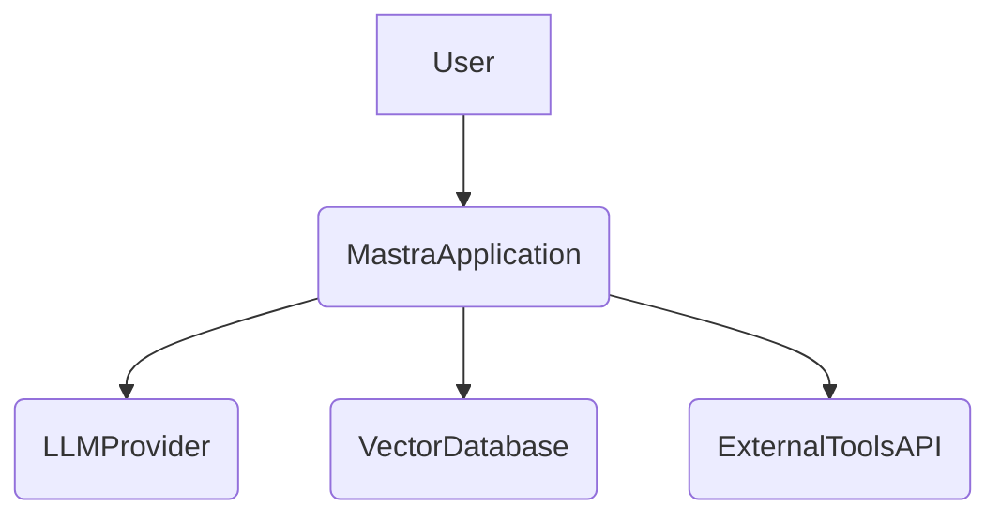
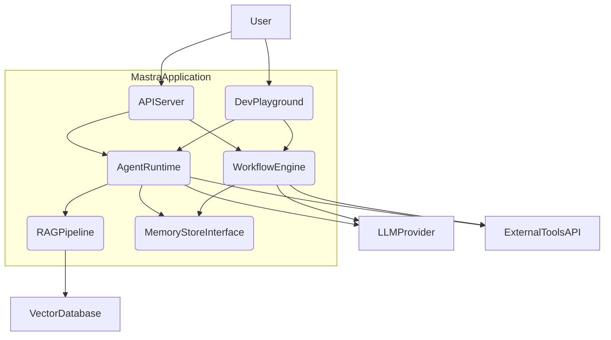
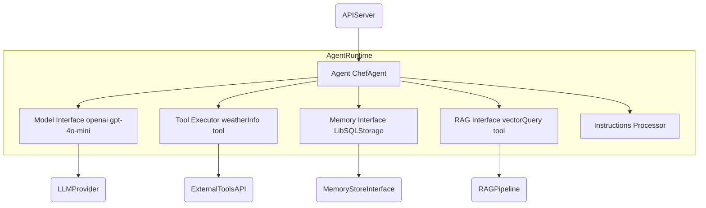
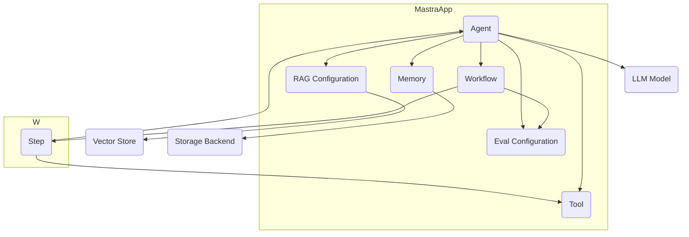
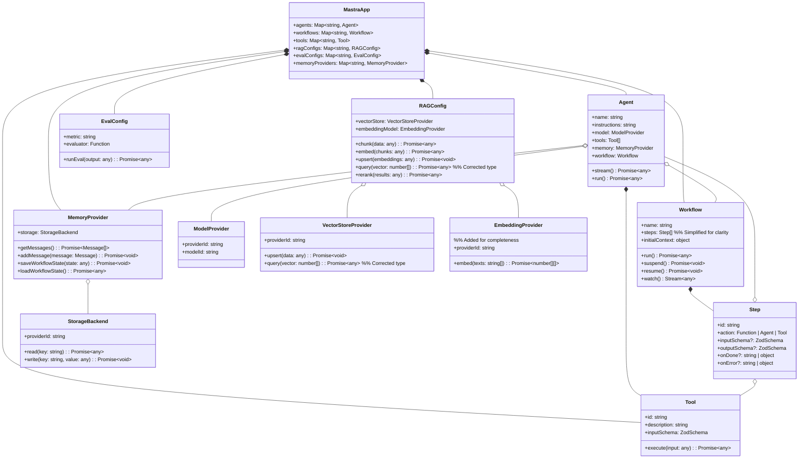

## ■概要

Mastraは、AIエージェントおよび関連するワークフローを構築するために設計された、オープンソースのTypeScript/JavaScriptフレームワークです。Gatsbyの開発チームによって開発され、特にJavaScript/TypeScript開発者がAIアプリケーション（特にエージェントベースのシステム）を効率的に構築、テスト、デプロイすることを目指しています。Python中心のツールが多いAI開発分野において、JS/TS開発者の参入障壁を下げることを目的としています。

Mastraは、エージェント (`Agent`)、ワークフロー (`Workflow`)、ツール (`Tool`)、メモリ/ストレージ (`Memory`/`Storage`)、RAG (`Retrieval-Augmented Generation`)、評価 (`Evals`) といった主要な構成要素を提供します。これらは中央のオーケストレーター (`Mastra` クラス) によって調整されます。Vercel AI SDK上に構築されており、複数のLLMプロバイダー (OpenAI, Anthropic, Google Gemini等) との連携や、主要なクラウドプラットフォーム (Vercel, Cloudflare, Netlify等) へのデプロイをサポートします。開発者体験 (DX) と本番運用 (Production Readiness) を重視し、ローカル開発プレイグラウンドやオブザーバビリティ機能も提供されます。

## ■構造

### ●システムコンテキスト図



| 要素名 | 説明 |
| :---- | :---- |
| User | Mastraアプリケーションと対話する人間または外部システムです。 |
| MastraApplication | Mastraフレームワークを使用して構築されたAIエージェントやワークフローを実行するシステム全体です。 |
| LLMProvider | 大規模言語モデルを提供する外部サービスです。 |
| VectorDatabase | RAG機能のためにベクトル埋め込みを格納・検索する外部データベースです。 |
| ExternalToolsAPI | AgentがTool機能を通じて利用する外部のAPIやサービスです。 |

### ●コンテナ図



| 要素名 | 説明 |
| :---- | :---- |
| APIServer | ユーザーからのリクエストを受け付け、適切な内部コンテナに処理を委譲するインターフェースです (例: Next.js APIルート)。 |
| AgentRuntime | Agentの実行、LLMとの対話、Toolの呼び出し、Memoryへのアクセス、RAGの利用などを担当するコンテナです。 |
| WorkflowEngine | Workflowの定義に従ってステップを実行し、状態遷移、永続化、LLMやToolの呼び出しを管理するコンテナです。 |
| RAGPipeline | ドキュメント処理、Vector Databaseへの問い合わせ、検索結果の取得・ランキングを行うコンテナです。 |
| MemoryStoreInterface | Agentの会話履歴やWorkflowの状態など、永続化が必要なデータを管理するストレージ (DB、KVストア等) への抽象化されたインターフェースです。 |
| DevPlayground | 開発者がローカル環境でAgentやWorkflowをテスト・デバッグするためのUIとバックエンドコンポーネントです。 |

### ●コンポーネント図



| 要素名 | 説明 |
| :---- | :---- |
| Agent ChefAgent | Agentの定義 (名前、指示、モデル、ツール、メモリ等) を保持し、実行ロジックをカプセル化するクラスです (例: chefAgent)。 |
| Model Interface openai gpt-4o-mini | 特定のLLMプロバイダー (例: OpenAI) およびモデル (例: gpt-4o-mini) との通信を抽象化するインターフェースです。 |
| Tool Executor weatherInfo tool | Agentに定義されたTool (関数) の実行を管理するコンポーネントです (例: 天気情報取得 weatherInfo ツール)。 |
| Memory Interface LibSQLStorage | Agentの会話履歴などを永続化ストアから読み書きするためのインターフェースです (例: ローカル開発用 LibSQLStorage)。 |
| RAG Interface vectorQuery tool | RAGパイプラインを利用して知識ベースを検索するためのインターフェースです (例: ベクトル検索 vectorQuery ツール)。 Agentが利用できるToolとして提供される場合があります。 |
| Instructions Processor | Agentに与えられた指示 (プロンプト) を解釈し、LLMへの入力形式 (例: システムプロンプト) に整形するコンポーネントです。 |

## ■情報

### ●概念モデル



| 要素名 | 説明 |
| :---- | :---- |
| MastraApp | Mastraフレームワークを使用して構築されたアプリケーション全体を表す概念です。 |
| Agent | 自律的にタスクを実行するAIエンティティの概念です。 |
| Workflow | 順序付けられたステップの実行を定義するプロセスの概念です。 |
| Step | Workflow内の個々の処理単位の概念です。 |
| Tool | AgentやStepが外部機能を利用するための関数の概念です。 |
| Memory | Agentの会話履歴や状態を保持するデータの概念です。 |
| RAG Configuration | RAGパイプラインの設定 (ドキュメントソース、埋め込みモデル等) の概念です。 |
| Eval Configuration | 評価 (Evals) の設定 (メトリクス、評価方法等) の概念です。 |
| LLM Model | AgentやWorkflowが利用する大規模言語モデルの概念です。 |
| Vector Store | RAGで使用されるベクトルデータベースの概念です。 |
| Storage Backend | MemoryやWorkflowの状態を永続化するストレージ (DB, KVストア等) の概念です。 |

### ●情報モデル



| クラス名::属性名/メソッド名 | 説明 |
| :---- | :---- |
| Agent::instructions | エージェントの役割や行動指針を定義するテキスト (プロンプトの一部) です。 |
| Agent::model | 利用するLLMプロバイダーとモデルを指定するオブジェクトです。 |
| Agent::tools | エージェントが利用可能なToolオブジェクトのリストです。 |
| Agent::memory | 会話履歴や状態を管理するMemoryProviderインスタンスです。 |
| Agent::workflow | エージェントが主として実行するWorkflowオブジェクト (オプション) です。 |
| Agent::stream() | ユーザーからの入力に基づき、ストリーミング形式で応答を生成・返却するメソッドです。 |
| Workflow::steps | ワークフローを構成するStepオブジェクトのリストまたはグラフ定義です。 |
| Workflow::run() | ワークフローを開始または再開するメソッドです。 |
| Workflow::suspend()/resume() | ワークフローの実行を一時停止/再開するメソッドです (Human-in-the-Loop等に利用)。 |
| Workflow::watch() | ワークフローの実行状態 (各ステップの完了など) をリアルタイムで監視するメソッドです。 |
| Step::id | ワークフロー内でのステップの一意なIDです。 |
| Step::action | ステップで実行される具体的な処理 (関数、別Agent呼び出し、Tool実行等) です。 |
| Tool::id | ツールの一意な識別名です。 |
| Tool::description | LLMがツールの機能や使い方を理解するための自然言語による説明です。 |
| Tool::inputSchema | ツールの入力パラメータの構造と型を定義するZodスキーマです (型安全な入力を保証)。 |
| Tool::execute() | ツールの実際の処理ロジックを実装した非同期関数です。 |
| MemoryProvider::storage | 状態を永続化するための具体的なストレージバックエンド (例: LibSQL, PostgreSQL) への参照です。 |
| MemoryProvider::getMessages() | 保存されているメッセージ履歴を取得するメソッドです。 |
| RAGConfig::vectorStore | 利用するベクトルストアプロバイダー (例: Qdrant, Pinecone) を指定するオブジェクトです。 |
| RAGConfig::embeddingModel | 利用する埋め込みモデルプロバイダー (例: OpenAI, Cohere) を指定するオブジェクトです。 |
| RAGConfig::query() | ベクトルストアに対して類似ベクトル検索を実行するメソッドです。 |
| EvalConfig::metric | 評価指標の名前 (例: "completeness", "relevance", "toxicity") です。 |
| EvalConfig::runEval() | 指定されたメトリクスに基づき、与えられた出力に対して評価を実行するメソッドです。 |
| ModelProvider::modelId | 利用する具体的なLLMのモデル名 (例: 'gpt-4o-mini') です。 |
| VectorStoreProvider::providerId | 利用するベクトルストアの識別子 (例: 'qdrant', 'pinecone') です。 |
| StorageBackend::providerId | 利用するストレージバックエンドの識別子 (例: 'libsql', 'cloudflare-kv') です。 |

## ■構築方法

### ●前提条件

* **Node.js:** バージョン 20.0 以降が推奨されます。  
* **LLM APIキー:** OpenAI, Anthropic, Google Gemini等のプロバイダーのAPIキーが必要です。  
* **外部サービスアカウント（任意）:** Vector Database (Qdrant, Pinecone等) や特定のToolで利用する外部APIのアカウント情報が必要になる場合があります。

### ●インストール

* **新規プロジェクト:** 公式CLIツール create-mastra を利用します。  
  npm create mastra@latest

  基本的なディレクトリ構造、依存関係、設定ファイルが生成されます。GitHubにはスターターテンプレートも存在します。  
* **既存プロジェクトへの追加:** npm等で必要なパッケージをインストールします。  
  npm install @mastra/core@latest @mastra/memory@latest @ai-sdk/openai

  (@ai-sdk/openai は利用するLLMに応じて変更します)

### ●環境設定

* **環境変数:** プロジェクトルートに .env ファイルを作成し、APIキーやDB接続情報等を記述します。  

  ```.env
  # 例: OpenAI APIキー  
  OPENAI_API_KEY=your_openai_api_key

  # 例: PostgreSQL接続情報  
  PGHOST=your_database_host  
  PGPORT=5432  
  PGUSER=your_database_user  
  PGPASSWORD=your_database_password  
  PGDATABASE=your_database_name
  ```

  通常、リポジトリには .env.example ファイルが含まれます。

### ●Next.js連携時の追加設定

* **サーバー外部パッケージ:** Next.jsのAPIルート内でMastraを実行する場合 (フルスタック統合)、next.config.mjs (または .js) に設定を追加します。  
  ```ts
  // next.config.mjs  
  /** @type {import('next').NextConfig} */  
  const nextConfig = {  
    serverExternalPackages: ["@mastra/*"],  
    // 他の設定...  
  };  
  export default nextConfig;
  ```

## ■利用方法

### ●Agentの定義と利用

1. **インポート:** @mastra/core から Agent クラス、LLMプロバイダーモジュール (例: @ai-sdk/openai から openai) をインポートします。  
2. **インスタンス化:** new Agent({...}) でインスタンスを作成します。主要オプション:  
   * name: 一意な名前 (文字列)。  
   * instructions: Agentの役割や指示 (文字列、システムプロンプトの基礎)。  
   * model: 使用するLLM (例: openai('gpt-4o-mini'))。  
   * tools: 利用可能な Tool オブジェクトの配列。  
   * memory: MemoryProvider インスタンス。  
   * workflow: 実行する Workflow オブジェクト (オプション)。  
3. **登録:** 作成したAgentインスタンスを Mastra インスタンスに登録します (通常 mastra/index.ts 等で一元管理)。  
  ```ts
   // mastra/index.ts (例)  
   import { Mastra } from "@mastra/core";  
   import { chefAgent } from "./agents/chefAgent"; // Agent定義

   export const mastra = new Mastra({  
     agents: {  
       chefAgent: chefAgent // "chefAgent" という名前で登録  
     },  
     // workflows, toolsなども同様に登録  
   });
  ```

4. **利用:** APIルート等から登録したAgentを取得し、.stream() (ストリーミング応答) または .run() (一括応答) メソッドを呼び出します。  
  ```ts
   // app/api/chat/route.ts (例)  
   import { mastra } from "@/mastra"; // Mastraインスタンス

   // ... リクエスト処理内 ...  
   const agent = mastra.getAgent("chefAgent"); // 名前で取得  
   const { messages } = await req.json(); // リクエストからメッセージ取得  
   const result = await agent.stream(messages); // Agentに対話を依頼  
   // ... レスポンス処理 ...
  ```

### ●Workflowの作成と実行

1. **インポート:** @mastra/core から Workflow クラスをインポートします。  
2. **インスタンス化:** new Workflow({...}) でインスタンスを作成し、name (一意な名前) と steps (処理ステップ定義) を指定します。  
3. **ステップ定義:** steps はグラフ構造で定義します。XStateを内部利用し、.step(), .then(), .after() 等で制御フローを記述します。各ステップでLLM呼び出し、Tool実行、条件分岐等が可能です。  
4. **Human-in-the-Loop:** .suspend() で一時停止、.resume() で再開が可能です。  
5. **登録:** 作成したWorkflowインスタンスを Mastra インスタンスに登録します。  
6. **実行と監視:** API等でWorkflowをトリガーします。.watch() で実行状態をリアルタイム監視できます。

### ●RAGパイプラインの構築

1. **API利用:** MastraはRAG処理 (ロード, チャンキング .chunk(), 埋め込み .embed(), DB登録 .upsert(), 検索 .query(), 再ランキング .rerank()) のAPIを提供します (関連パッケージ例: @mastra/rag)。  
2. **Vector Store連携:** Pinecone, Qdrant, pgvector等、複数のVector Databaseに対応したインターフェースを提供します。  
3. **Agentic RAG:** RAGパイプラインをTool (例: vectorQuery Tool) として定義し、Agentの tools に追加することで、Agentが能動的に知識ベースを検索できます。

### ●Memoryの実装

1. **パッケージ利用:** 記憶機能は @mastra/memory 等で提供されます。  
2. **設定:** Agent定義時に memory オプションに MemoryProvider インスタンスを指定します。  
3. **ストレージ選択:** LibSQL (ローカル用), PostgreSQL, Cloudflare KV/D1, Upstash Redis等が利用可能です。  
4. **取得戦略:** 最新メッセージ (lastMessages), Top-K検索 (topK), メッセージ範囲 (messageRange) 等の取得戦略を設定できます。

### ●Toolの作成と利用

1. **インポートと定義:** @mastra/core/tools から createTool 等をインポートし、Toolを定義します。id, description, inputSchema (Zodスキーマ), execute (非同期関数) を指定します。  
  ```ts
   import { createTool } from '@mastra/core/tools';  
   import { z } from 'zod';

   const weatherInfo = createTool({  
     id: 'getWeatherInfo',  
     description: '指定された都市の現在の天気情報を取得します。',  
     inputSchema: z.object({  
       city: z.string().describe('天気情報を取得したい都市名'),  
     }),  
     execute: async ({ input }) => {  
       const { city } = input;  
       // ... 天気API呼び出し等の処理 ...  
       const weather = await fetchWeatherFromAPI(city);  
       return weather;  
     },  
   });  
   ```
   description` と `inputSchema` の `describe()` はLLMの理解に重要です。

2. **登録:** 作成したToolオブジェクトをAgent定義の tools 配列に追加します。  
3. **実行:** Agentが必要と判断した場合、LLMを通じてToolが呼び出されます。Mastraフレームワークがリクエストを解釈し、execute 関数を実行、結果をLLMに返します。  
4. **MCP連携:** Model Context Protocol (MCP) を利用し、Apify ActorやCursor Code Editor等の外部ツールも利用可能です。

### ●ローカル開発環境

* **起動:** mastra dev または npm run dev でローカル開発サーバーとプレイグラウンドUIが起動します。  
* **機能:** プレイグラウンドでは、Agentとの対話、Workflowのトリガー、Toolの単体テスト、Evals結果確認、実行トレースの視覚的確認（デバッグ用）が可能です。  
* **ストレージ:** デフォルトではlibsql (SQLite) を使用してファイルシステム上に状態が保存されます。

## ■運用

### ●デプロイ

* **デプロイ形態:**  
  * **組み込み:** 既存Node.jsアプリ (Next.js, Express等) の一部として組み込みます。  
  * **スタンドアロン:** 独立したREST APIサービスとしてデプロイします。  
* **デプロイ支援:** @mastra/deployer パッケージがデプロイプロセスを簡略化します。Honoベースの単一サーバーへのバンドルや、サーバーレスプラットフォーム (Vercel Functions, Cloudflare Workers等) 形式への変換を支援します。  
* **統合パターン (Next.js):**  
  * **フルスタック統合:** Next.js APIルート内で直接実行します。  
  * **分離サーバー統合:** Mastraアプリを別サーバーで実行し、Next.jsからAPIを呼び出します。  
* **環境変数:** デプロイ先プラットフォームで .env に設定した環境変数を正しく設定します。

### ●監視とオブザーバビリティ

* **OpenTelemetry (Otel) 統合:** ネイティブでOtelをサポートします。初期化時にエクスポーターを設定し、トレース情報やメトリクスをDatadog, Honeycomb等のプラットフォームに送信できます。  
* **トレーシング:** リクエスト/Workflow実行ごとにトレースIDが付与され、内部処理 (LLM呼び出し, Tool実行等) を追跡できます。ボトルネック特定やエラー調査に役立ちます。  
* **メトリクス:** レイテンシ、成功/失敗率、トークン消費量等を収集・可視化し、健全性を監視します。  
* **ロギング:** 構造化ロギング機能を提供します。

### ●評価

* **重要性:** LLM出力の品質 (正確性、関連性、安全性等) を継続的に評価することが不可欠です。  
* **Mastra Evals:** LLM出力やAgent/Workflowのパフォーマンスを評価するフレームワークを提供します。  
* **評価手法:** モデル自身による評価 (Model-graded Evals)、ルールベース評価、統計的手法等を組み合わせます。  
* **組み込みメトリクス:** 毒性 (Toxicity), バイアス (Bias), 関連性 (Relevance), 事実整合性 (Factual Accuracy), 完全性 (Completeness), コンテキスト適切性 (Context Relevancy) 等を提供します。  
* **カスタム評価:** 独自の評価指標やロジックを定義可能です。  
* **活用:** ローカルプレイグラウンドでの確認、CIパイプラインへの組み込み、本番での定期チェック等に活用します。

## ■参考リンク

- **概要 / 全般**
  - [Mastra: The Javascript framework for building AI agents, from the Gatsby devs | Y Combinator](https://www.ycombinator.com/companies/mastra)  
  - [The Typescript AI framework - Mastra (About)](https://mastra.ai/about)  
  - [Mastra: The Typescript AI framework (Homepage)](https://mastra.ai/)  
  - [HN: Mastra – Open-source JS agent framework, by the developers of Gatsby | Hacker News](https://news.ycombinator.com/item?id=43103073)  
  - [GitHub - mastra-ai/mastra: the TypeScript AI agent framework - BestofAI](https://bestofai.com/article/github-mastra-aimastra-the-typescript-ai-agent-framework)  
  - [Mastra Launches: The Open-Source JavaScript Framework for Building Agents - Fondo](https://www.tryfondo.com/blog/mastra-launches)  
  - [Mastra: An open source Typescript AI Framework for building AI Agents : r/javascript - Reddit](https://www.reddit.com/r/javascript/comments/1ichw03/mastra_an_open_source_typescript_ai_framework_for/)  
  - [Mastra AI Framework Overview - DeepWiki](https://deepwiki.com/mastra-ai/mastra)
- **構造 / アーキテクチャ**
  - [Introduction | Mastra Docs](https://mastra.ai/docs) (Docs全般にアーキテクチャ情報含む)  
  - [I reimplemented Mastra workflows and I regret it - Stack - Convex](https://stack.convex.dev/reimplementing-mastra-regrets) (Workflowアーキテクチャに関する議論)  
  - [dylibso/github-insights](https://github.com/dylibso/github-insights) (Mastra利用例)  
  - [mastra-ai/mastra - GitHub](https://github.com/mastra-ai/mastra) (ソースコードリポジトリ)
- **情報 / データモデル**
  - [API Reference - Mastra](https://mastra.ai/reference)  
  - [@mastra/core - npm](https://www.npmjs.com/package/@mastra/core)  
  - [Introduction | Mastra Docs](https://mastra.ai/docs) (Docs全般にデータモデル情報含む)
- **構築方法**
  - [zinyando/mastra-text-to-sql: A text to sql demo application using nextjs and mastra - GitHub](https://github.com/zinyando/mastra-text-to-sql) (Next.js + Mastra デモ)  
  - [Full-Stack Integration | assistant-ui](https://www.assistant-ui.com/docs/runtimes/mastra/full-stack-integration) (Next.js連携設定)  
  - [IKatsuba/deno-mastra - GitHub](https://github.com/IKatsuba/deno-mastra) (Deno利用例)  
  - [mastra · GitHub Topics](https://github.com/topics/mastra) (関連プロジェクト/テンプレート)
- **利用方法**
  - [Docs | Mastra](https://mastra.ai/docs) (公式ドキュメント)  
  - [API Reference - Mastra](https://mastra.ai/reference) (APIリファレンス)  
  - [@mastra/core - npm](https://www.npmjs.com/package/@mastra/core) (コアパッケージ)  
  - [Full-Stack Integration | assistant-ui](https://www.assistant-ui.com/docs/runtimes/mastra/full-stack-integration) (Agent利用例)  
  - [Getting Started With Mastra - YouTube](https://www.youtube.com/watch?v=spGlcTEjuXY) (入門動画)  
  - [Using Composio With Mastra](https://docs.composio.dev/frameworks/mastra) (Composio連携)  
  - [Mastra - Qdrant Documentation](https://qdrant.tech/documentation/frameworks/mastra/) (Qdrant連携)  
  - [apify/actor-mastra-mcp-agent - GitHub](https://github.com/apify/actor-mastra-mcp-agent) (Apify Actor連携/MCP利用例)  
  - [Mastra MCP documentation server - YouTube](https://www.youtube.com/watch?v=vciV57lF0og) (MCP関連動画)  
  - [DeDevsClub/mastra-courses - GitHub](https://github.com/DeDevsClub/mastra-courses) (学習コース資料)  
  - [GitHub - mastra-ai/mastra: the TypeScript AI agent framework - YouTube](https://www.youtube.com/watch?v=7L1YDjCIq1g) (関連動画)
- **運用**
  - [Deployment Overview | Mastra Docs](https://mastra.ai/docs/deployment/overview)  
  - [Observability Overview | Mastra Docs](https://mastra.ai/ja/docs/mastra-cloud/observability)  
  - [Evals Overview | Mastra Docs](https://mastra.ai/docs/evals/overview)  
  - [Overview | assistant-ui (Mastra Integration)](https://www.assistant-ui.com/docs/runtimes/mastra/overview) (運用関連情報含む)(  
  - [@mastra/core - npm](https://www.npmjs.com/package/@mastra/core)

この記事でなにか得られることがあったら、SNSでシェアしていただけると励みになります。
