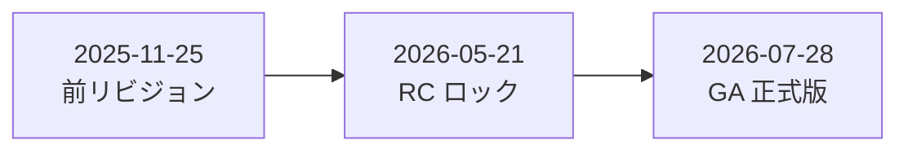
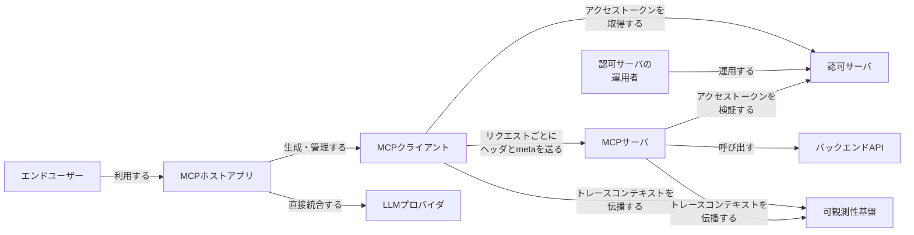
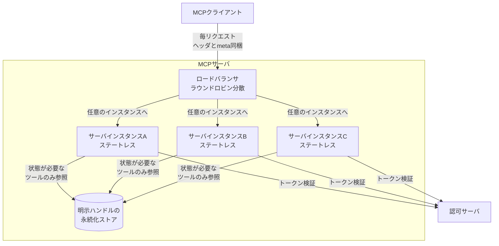
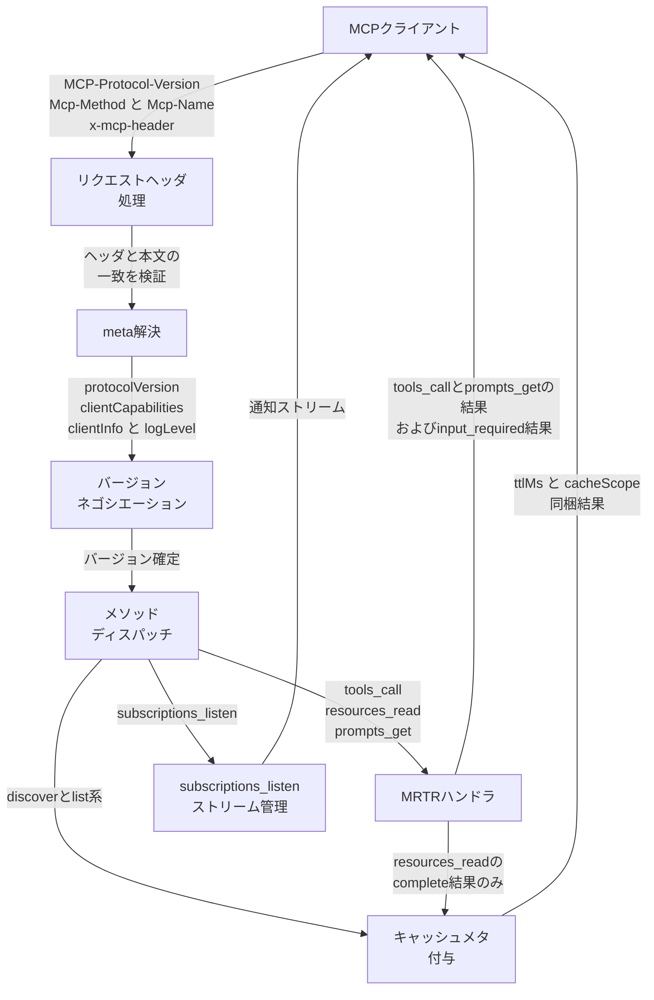
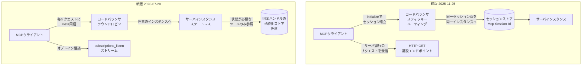
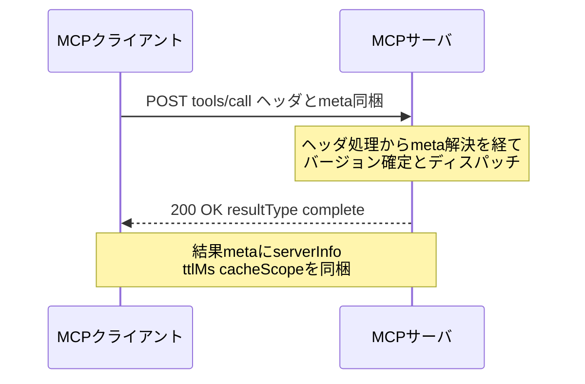
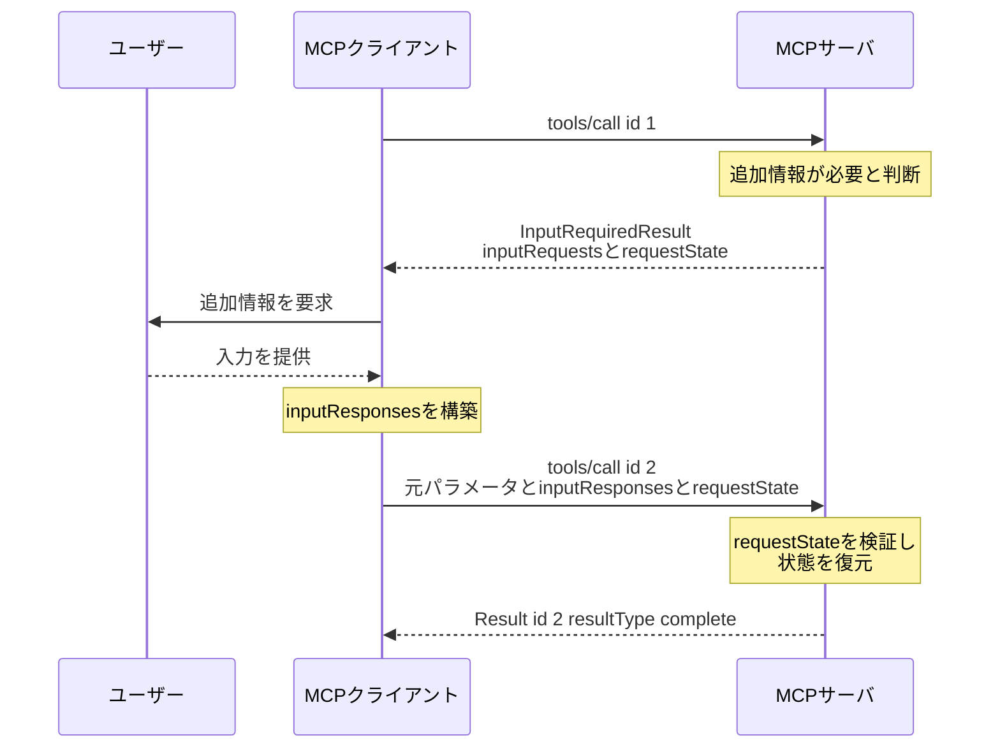
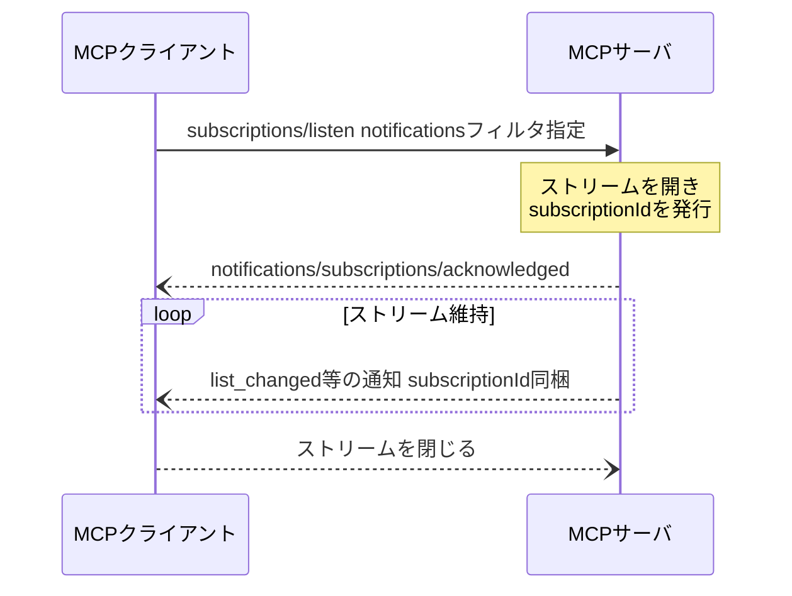
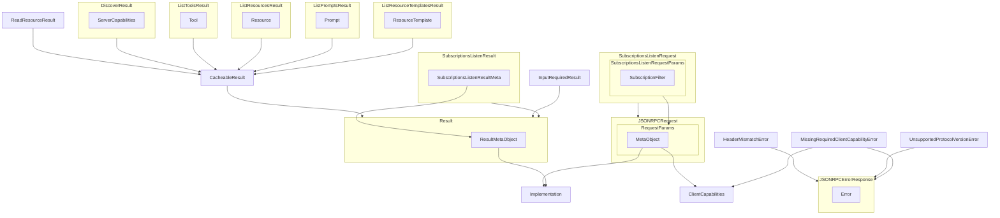
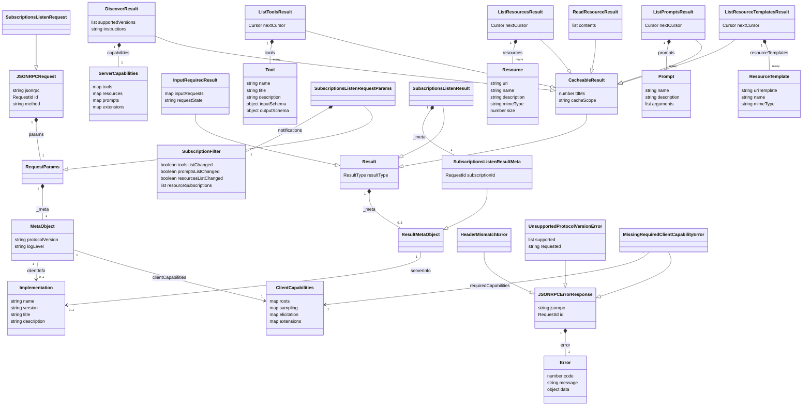

Model Context Protocol (MCP) の仕様改訂 `2026-07-28` は、プロトコルレベルのセッションと初期化ハンドシェイクを廃止しました。リモート MCP サーバはスティッキールーティングと共有セッションストアから解放されます。

一方で、セッションが暗黙に引き受けていた責務（呼び出しをまたぐ状態、サーバ起点の対話、変更通知、一覧結果の鮮度管理）は、そのまま消えるわけではありません。すべてアプリケーション側の明示的な設計判断として表面化します。

本記事は前版 `2025-11-25` からの差分を構造・データ・運用の順に整理し、「何が消えたか」ではなく「消えた責務をどこで引き受けるか」を軸に読み解きます。

> 調査日は 2026-07-27 です。この時点で仕様本文は `docs/specification/draft/` 配下にあり、日付ディレクトリ `2026-07-28/` は未作成です。本文中の仕様リンクは `draft` を指します。

## 概要

### この改訂の位置づけ

MCP の仕様は日付ベースのリビジョン番号で管理されています。リビジョン名は仕様が確定した日付そのものです。`2026-07-28` は `2025-11-25` の次のメジャーリビジョンにあたります。



| 要素名 | 説明 |
|---|---|
| 2025-11-25 前リビジョン | セッションベースの前仕様。本改訂の比較対象 |
| 2026-05-21 RC ロック | Release Candidate の内容を固定した日付 |
| 2026-07-28 GA 正式版 | 本調査対象。ロックから約 10 週間後に確定 |

仕様は、リビジョンを 2 つの era（時代）に分類しています。

| era | 該当リビジョン | 接続の性質 |
|---|---|---|
| Modern（現代的） | `2026-07-28` 以降 | プロトコルバージョン・アイデンティティ・能力をリクエスト単位のメタデータで運ぶ |
| Legacy（旧来） | `2025-11-25` 以前 | `initialize` ハンドシェイクでセッションを確立する |

両方に対応する実装は Dual-era（両 era 対応）と呼ばれます。`2026-07-28` は Modern era の最初のリビジョンです。

### なぜステートレス化したのか

`2025-11-25` までの Streamable HTTP は、`initialize` でセッションを確立し、以降のリクエストに `Mcp-Session-Id` ヘッダを付与する方式でした。このヘッダは、セッションを発行したサーバインスタンスにクライアントを固定します。

この固定（スティッキールーティング）には、運用上の制約がありました。

| 制約 | 内容 |
|---|---|
| スティッキールーティング必須 | ロードバランサが同一セッションのリクエストを同一サーバインスタンスへ振り分ける必要がある |
| 共有セッションストアが必要 | 複数インスタンスでセッション状態を共有する仕組みが要る |
| 水平分散の妨げ | インスタンスの追加・削除がセッションの生存に影響する |

`2026-07-28` はプロトコルレベルのセッションと `Mcp-Session-Id` ヘッダを廃止しました（SEP-2567）。あわせて `initialize` / `notifications/initialized` ハンドシェイクも廃止しました（SEP-2575）。

結果として、リクエストはそれぞれ自己完結します。各リクエストは `_meta` にプロトコルバージョンとクライアント能力を含みます。任意のサーバインスタンスが任意のリクエストを処理できます。従来スティッキーセッションと共有セッションストアを必要としたリモート MCP サーバが、通常のラウンドロビン型ロードバランサの背後で稼働できます。

サーバをまたぐ状態の保持自体は禁止されていません。状態が必要なサーバは、`create_basket` のようなツールで `basket_id` を発行し、以降のツール呼び出しにモデルが引数として渡す「明示ハンドル (explicit, server-minted handle)」パターンを使います。プロトコルが状態管理を肩代わりしなくなっただけであり、アプリケーションの状態管理自体は引き続き可能です。


### リビジョン間の比較

`2025-11-25` と `2026-07-28` の主要な違いを 7 つの観点で比較します。

| 観点 | 2025-11-25 | 2026-07-28 |
|---|---|---|
| 接続確立方式 | `initialize` / `notifications/initialized` ハンドシェイクで接続を確立する | ハンドシェイクを行わない。各リクエストの `_meta` にプロトコルバージョンとクライアント能力を含める |
| セッション識別 | `Mcp-Session-Id` ヘッダでセッションを識別し、特定のサーバインスタンスにクライアントを固定する | セッション識別子が存在しない。任意のサーバインスタンスがリクエストを処理できる |
| 能力交換 | `initialize` の応答でサーバ能力を一度だけ交換する | `server/discover`（サーバは MUST 実装、クライアントは MAY 呼び出し）で能力を取得する。クライアント能力は毎リクエストの `_meta` で送る |
| server→client 要求 | `roots/list` / `sampling/createMessage` / `elicitation/create` などのサーバ起点リクエストを、持続する接続上で送る | MRTR パターンを使う。サーバは `InputRequiredResult` を返し、クライアントは元のリクエストに `inputResponses` を添えて再送する |
| 変更通知 | HTTP GET エンドポイントと `resources/subscribe` / `resources/unsubscribe` を使う | `subscriptions/listen` の単一の長寿命 POST ストリームにオプトイン種別ごと統合する |
| ストリーム再開 | `Last-Event-ID` ヘッダと SSE イベント ID でストリームの再開とメッセージ再送に対応する | 再開の仕組みを持たない。ストリームが切れた in-flight リクエストは、クライアントが新しいリクエスト ID で再送する |
| キャッシュ制御 | 明示的なキャッシュ制御フィールドを持たない。更新検知は `listChanged` 通知のみ | `CacheableResult` インタフェースの `ttlMs` と `cacheScope` を必須化する。`listChanged` 通知を補完する |

### 削除 / 非推奨 / 拡張へ移動

用語を 3 分類で整理します。**削除**は仕様から取り除かれた項目です。**非推奨**は機能が引き続き動作する項目です。**拡張へ移動**はコア仕様から公式拡張へ移った項目です。

#### 削除 (Removed)

| 項目 | SEP / PR |
|---|---|
| `initialize` メソッド | SEP-2575 |
| `notifications/initialized` 通知 | SEP-2575 |
| `Mcp-Session-Id` ヘッダ | SEP-2567 |
| `ping` メソッド | SEP-2575 |
| `logging/setLevel` メソッド | SEP-2575（RPC の削除。Logging 機能自体の非推奨化 SEP-2577 とは別の変更） |
| `notifications/roots/list_changed` 通知 | SEP-2575 |
| `resources/subscribe` メソッド | SEP-2575 |
| `resources/unsubscribe` メソッド | SEP-2575 |
| HTTP GET エンドポイント | SEP-2575 |
| `Last-Event-ID` ヘッダおよび SSE event ID | SEP-2575 |
| `tasks/list` メソッド | SEP-2663 |
| `notifications/elicitation/complete` 通知 | MRTR 導入に伴う削除（changelog に個別 SEP 番号の記載なし） |
| URL モード elicitation の `elicitationId` フィールド | MRTR 導入に伴う削除（changelog に個別 SEP 番号の記載なし） |

#### 非推奨 (Deprecated、機能は残る)

| 項目 | SEP / PR | 移行先 |
|---|---|---|
| Roots | SEP-2577 | ツールパラメータ・リソース URI・サーバ設定 |
| Sampling | SEP-2577 | LLM プロバイダ API との直接統合 |
| Logging | SEP-2577 | `stderr`（stdio）または OpenTelemetry |
| `includeContext` の `"thisServer"` / `"allServers"` | SEP-2596 | 省略するか `"none"` を使う |
| OAuth 2.0 動的クライアント登録 (RFC 7591) | PR #2858 | Client ID Metadata Documents (CIMD) |
| HTTP+SSE トランスポート | SEP-2596（`2025-03-26` から非推奨、本改訂で正式に Deprecated 状態へ再分類） | Streamable HTTP |

非推奨の各項目には、最低 12 ヶ月の猶予期間が設けられます。Roots・Sampling・Logging・DCR の最短削除時期は「`2027-07-28` 以降に公開される最初のリビジョン」です。

#### 拡張へ移動 (Moved to extension)

| 項目 | SEP / PR | 移動先 |
|---|---|---|
| Tasks（experimental なコア機能） | SEP-2663 | 公式拡張 `io.modelcontextprotocol/tasks` |

Tasks の再設計では、ブロッキング方式の `tasks/result` を `tasks/get` によるポーリングへ置き換えました。クライアントから入力を送る `tasks/update` を新設しました。`tasks/list` は削除しました。サーバはリクエスト単位のオプトインなしにタスクハンドルを返せます。

### RC 期間と GA

`2026-07-28` の RC (Release Candidate) は **2026-05-21** にロックされました。最終仕様の GA (正式版) は **2026-07-28** です。ロックから GA まで約 10 週間の RC 期間が設けられています。

RC 期間の目的は、SDK メンテナとクライアント実装者による実運用ワークロードでの検証です。SDK tier system における Tier 1 SDK は、この RC 期間内にサポートを提供することが期待されています。

本改訂には破壊的変更が含まれます。RC 告知ブログは、これを標準的な進め方にはしない方針を明言しています。今回導入した機能ライフサイクルポリシー・拡張フレームワーク・適合性連動の SEP 承認プロセスの 3 つのガバナンス SEP により、今後のリビジョンではトランスポートやライフサイクルの実装を書き直さずに追随できることを見込んでいます。

## 特徴

`2026-07-28` の主要な特徴を 7 点にまとめます。

- **ステートレス化**: プロトコルレベルのセッションと初期化ハンドシェイクを廃止しました（SEP-2567 / SEP-2575）。各リクエストが `_meta` でバージョンと能力を運ぶ自己完結型になりました。
- **MRTR (Multi Round-Trip Requests)**: サーバ起点リクエストの代わりに、サーバが `InputRequiredResult`（`resultType: "input_required"`）を返し、クライアントが元のリクエストを再送する方式を導入しました（SEP-2322）。すべての結果に `resultType` フィールドが必須になりました。
- **subscriptions/listen**: HTTP GET エンドポイントと `resources/subscribe` / `resources/unsubscribe` を、単一の長寿命 POST ストリーム `subscriptions/listen` に統合しました（SEP-2575）。リクエストスコープの通知（`notifications/progress` など）は、このストリームではなく該当リクエストのレスポンスストリームに流れ続けます。
- **キャッシュ制御**: 結果に `ttlMs` と `cacheScope` を必須化する `CacheableResult` インタフェースを新設しました（SEP-2549）。`tools/list` の決定的な順序返却も SHOULD 化し、クライアント側キャッシュと LLM プロンプトキャッシュのヒット率向上を図りました。
- **拡張フレームワーク**: `ClientCapabilities` / `ServerCapabilities` に `extensions` フィールドを追加しました。拡張はリバース DNS 形式の ID で識別され、独立したリポジトリで管理され、仕様本体とは別にバージョニングされます（SEP-2133）。MCP Apps と Tasks が、この枠組みでの最初の公式拡張です。
- **機能ライフサイクルポリシー**: Active / Deprecated / Removed の 3 状態と、最低 12 ヶ月の非推奨期間を定めるガバナンスを採用しました（SEP-2596）。非推奨機能はレジストリで一覧管理されます。
- **認可強化**: 認可サーバ側は RFC 9207 の `iss` パラメータを含めるべきとし、クライアント側は認可コード引換前に issuer 照合を MUST としました（SEP-2468）。動的クライアント登録時の `application_type` 指定を要求しました（SEP-837）。クライアント資格情報を発行元の認可サーバに束縛し、issuer 識別子でキーイングして永続化することを MUST としました（SEP-2352）。このほかリフレッシュトークン要求手順（SEP-2207）、ステップアップ時のスコープ蓄積の明確化（SEP-2350）、`.well-known` ディスカバリのサフィックス（SEP-2351）を含む、あわせて 6 件の認可関連 SEP が今回の改訂に含まれます。

## 構造

C4 model の 3 段階（システムコンテキスト / コンテナ / コンポーネント）で整理します。あわせて前版との構造差分と、代表的な 3 つのリクエストライフサイクルをシーケンス図で示します。

### システムコンテキスト図

MCP クライアントと MCP サーバを対象システムとし、周囲のアクターと外部システムとの関係を示します。



| 要素名 | 説明 |
|---|---|
| エンドユーザー | MCP ホストアプリを操作する人 |
| MCPホストアプリ | MCP クライアントを生成・管理するアプリケーション。AI 統合とサンプリング調整を担う |
| 認可サーバの運用者 | 認可サーバの設定・運用を担う人 |
| MCPクライアント | ホストアプリが生成する、1 サーバと 1 対 1 で通信するコンポーネント |
| MCPサーバ | ツール・リソース・プロンプトを公開する対象システム |
| 認可サーバ | アクセストークンを発行する外部システム |
| バックエンドAPI | MCP サーバが呼び出す業務システム |
| LLMプロバイダ | ホストアプリが直接統合する LLM API。Sampling 機能の非推奨化に伴う推奨移行先 |
| 可観測性基盤 | OpenTelemetry のトレースコンテキストを受け取る外部システム |

### コンテナ図

MCP サーバ側を分解します。ステートレス化により、ロードバランサはスティッキールーティングを不要とし、セッションストアは存在しません。



| 要素名 | 説明 |
|---|---|
| ロードバランサ | リクエストごとに任意のサーバインスタンスへ振り分ける。プロトコルレベルのセッションが無いため、特定インスタンスへの追従は不要 |
| サーバインスタンスA / B / C | いずれも同一の実装を持つステートレスなインスタンス。インスタンス間で会話状態を共有しない |
| 明示ハンドルの永続化ストア | ツールが呼び出しをまたぐ状態を必要とする場合にのみ、サーバが発行した明示ハンドルを保持する任意のストア。プロトコルのセッションストアではなく、通常のツール引数として扱われる値の保存先 |
| 認可サーバ | 各インスタンスが独立にアクセストークンを検証する外部システム |

プロトコルレベルのセッションストアが存在しないため、どのインスタンスがリクエストを処理しても結果は変わりません。ロードバランサは接続状態を意識せずに分散できます。

### コンポーネント図

サーバインスタンス内部を分解します。`tools/call` を例に、ヘッダ処理から結果返却までの内部コンポーネントを示します。



| 要素名 | 説明 |
|---|---|
| リクエストヘッダ処理 | `MCP-Protocol-Version` / `Mcp-Method` / `Mcp-Name` / `x-mcp-header` を読み取り、本文の対応する値と一致するか検証する。不一致時は `HeaderMismatch`（コード `-32020`）を返す |
| meta解決 | リクエスト本文の `_meta` から `io.modelcontextprotocol/protocolVersion` / `clientCapabilities` / `clientInfo` / `logLevel` を取り出す。`logLevel` を含まないリクエストには `notifications/message` を送出しない |
| バージョンネゴシエーション | `server/discover` への応答、またはリクエストごとのバージョン確定を行う。非対応バージョンには `UnsupportedProtocolVersionError` を返す |
| メソッドディスパッチ | `tools/call` / `resources/read` / `prompts/get` などのコアメソッドへ処理を振り分ける |
| MRTRハンドラ | 追加入力が必要な場合に `InputRequiredResult` と `requestState` を発行する。再送されたリクエストの `requestState` を検証し、状態を復元する。`resources/read` は MRTR 対象であると同時にキャッシュ対象でもあるため、`resultType: "complete"` の結果はキャッシュメタ付与を経由する |
| subscriptions_listenストリーム管理 | オプトインされた通知種別に応じて長寿命ストリームを開き、`subscriptionId` を付与して通知を配信する |
| キャッシュメタ付与 | `server/discover` / `tools/list` / `prompts/list` / `resources/list` / `resources/templates/list` / `resources/read` の結果に `ttlMs` と `cacheScope` を必須で付与する |

### 前版との構造差分図

セッションを前提とした旧構成と、ステートレスな新構成を並べます。



#### 前版 2025-11-25

| 要素名 | 説明 |
|---|---|
| ロードバランサ スティッキールーティング | `Mcp-Session-Id` を見て同一クライアントのリクエストを同一インスタンスへ固定して転送する |
| セッションストア | `initialize` で確立したセッション ID とハンドシェイク結果を保持する |
| サーバインスタンス | セッションに紐づいた状態（プロトコルバージョン・能力）を保持しながら処理する |
| HTTP GET 常設エンドポイント | クライアントが開き続け、サーバ発行のリクエストや通知を受信する |

#### 新版 2026-07-28

| 要素名 | 説明 |
|---|---|
| ロードバランサ ラウンドロビン | セッションを意識せず、任意のインスタンスへリクエストを振り分ける |
| サーバインスタンス ステートレス | リクエストごとに `_meta` からバージョンと能力を読み取り、インスタンス間で状態を共有しない |
| 明示ハンドルの永続化ストア 任意 | 呼び出しをまたぐ状態が必要なツールだけが参照する。プロトコルのセッションストアではない |
| subscriptions_listen ストリーム | HTTP GET 常設エンドポイントに代わり、クライアントがオプトインした通知だけを配信する |

消えた要素は、セッションストア、スティッキールーティング、`Mcp-Session-Id` ヘッダ、HTTP GET 常設エンドポイント、`Last-Event-ID` によるストリーム再開の 5 つです。

### リクエストライフサイクル

#### 通常の tools/call

ヘッダと `_meta` を毎回運ぶ、最も基本的なリクエストです。



| 要素名 | 説明 |
|---|---|
| ヘッダとmeta同梱 | `MCP-Protocol-Version` / `Mcp-Method` / `Mcp-Name` ヘッダと、本文 `_meta` の `protocolVersion` / `clientCapabilities` / `clientInfo` を同一リクエストに含める |
| resultType complete | 通常結果を示す必須フィールド。前版のサーバがこのフィールドを省略した場合、クライアントは complete として扱う |
| serverInfo ttlMs cacheScope | サーバが結果の `_meta` に自己識別情報を、対応メソッドの結果にキャッシュヒントを載せる |

#### MRTR

サーバが追加入力を要求し、クライアントが元のリクエストを再送して応答します。



| 要素名 | 説明 |
|---|---|
| InputRequiredResult | `resultType: "input_required"` を持つ結果。`inputRequests` と `requestState` の少なくとも一方を含む |
| inputRequests | サーバが割り当てた識別子をキーとする、`elicitation/create` などのリクエストのマップ |
| requestState | サーバのみが意味を解釈する不透明な文字列。クライアントは中身を検査・改変せず、再送時にそのまま返す |
| id 1 と id 2 | 初回リクエストと再送リクエストは独立した JSON-RPC リクエストであり、異なる `id` を持つ |

#### subscriptions/listen

クライアントがオプトインし、サーバが確認応答したうえで通知を配信し続けます。



| 要素名 | 説明 |
|---|---|
| notificationsフィルタ | `toolsListChanged` / `promptsListChanged` / `resourcesListChanged` / `resourceSubscriptions` のうち、受け取りたい種別を指定する |
| notifications/subscriptions/acknowledged | サーバがストリームで最初に送る確認応答。サーバが実際に対応した通知種別の部分集合を返す |
| subscriptionId | `subscriptions/listen` リクエストの JSON-RPC `id` と同じ値。以後の全通知に付与され、複数購読を区別する |
| ストリーム維持 | クライアントまたはサーバが閉じるまで、あるいはトランスポートが切断されるまで継続する |

## データ

データ構造を、概念モデルと情報モデルの 2 段階で示します。両モデルは同じエンティティ集合を対象とします。

### 概念モデル

エンティティ間の所有関係と参照関係を示します。subgraph の入れ子は所有関係、矢印は参照または継承関係を表します。



#### リクエスト

| 要素名 | 説明 |
|---|---|
| JSONRPCRequest | クライアントがサーバへ送る JSON-RPC リクエストです |
| RequestParams | リクエスト共通パラメータです。`_meta` を所有します |
| MetaObject | リクエストの `_meta` が運ぶメタデータです。実体は `RequestMetaObject`（`MetaObject` の拡張）です |

#### 結果

| 要素名 | 説明 |
|---|---|
| Result | サーバが返す結果の共通型です。`_meta` を所有します |
| ResultMetaObject | 結果の `_meta` が運ぶメタデータです |
| CacheableResult | `Result` を継承し、キャッシュ制御情報を追加した型です |
| InputRequiredResult | `Result` を継承し、追加入力の要求を運ぶ型です。MRTR パターンで使用します |

#### 発見

| 要素名 | 説明 |
|---|---|
| DiscoverResult | `server/discover` の結果です。`CacheableResult` を継承します。`ServerCapabilities` を所有します |
| ServerCapabilities | サーバの機能一覧です |
| ClientCapabilities | クライアントの機能一覧です。リクエストの `MetaObject` とエラーの `data` から参照されます |
| Implementation | クライアントまたはサーバの実装識別情報です。`MetaObject` と `ResultMetaObject` の双方から参照されます |

#### 購読

| 要素名 | 説明 |
|---|---|
| SubscriptionsListenRequest | 長寿命の通知ストリームを開くリクエストです。`JSONRPCRequest` を継承します |
| SubscriptionsListenRequestParams | 購読リクエストのパラメータです。`RequestParams` を継承し、`SubscriptionFilter` を所有します |
| SubscriptionFilter | オプトインする通知種別の指定です |
| SubscriptionsListenResult | 購読ストリームの終了を示す結果です。`Result` を継承します |
| SubscriptionsListenResultMeta | 購読結果の `_meta` です。`ResultMetaObject` を継承します |

#### ツール・リソース・プロンプト

| 要素名 | 説明 |
|---|---|
| Tool | サーバが公開するツールの定義です |
| Resource | サーバが公開するリソースの定義です |
| Prompt | サーバが公開するプロンプトテンプレートの定義です |
| ListToolsResult | `tools/list` の結果です。`CacheableResult` を継承し、`Tool` を所有します |
| ListResourcesResult | `resources/list` の結果です。`CacheableResult` を継承し、`Resource` を所有します |
| ListPromptsResult | `prompts/list` の結果です。`CacheableResult` を継承し、`Prompt` を所有します |
| ListResourceTemplatesResult | `resources/templates/list` の結果です。`CacheableResult` を継承し、`ResourceTemplate` を所有します |
| ResourceTemplate | URI テンプレートで表現されるリソースの定義です |
| ReadResourceResult | `resources/read` の結果です。`CacheableResult` を継承します |

#### エラー

| 要素名 | 説明 |
|---|---|
| JSONRPCErrorResponse | エラー応答の共通型です。`Error` を所有します |
| Error | エラーコード・メッセージ・付随データを保持する型です |
| HeaderMismatchError | `JSONRPCErrorResponse` を継承する型です。コード `-32020` を持ちます |
| UnsupportedProtocolVersionError | `JSONRPCErrorResponse` を継承する型です。コード `-32022` を持ちます |
| MissingRequiredClientCapabilityError | `JSONRPCErrorResponse` を継承する型です。コード `-32021` を持ち、`ClientCapabilities` を参照します |

### 情報モデル

主要な属性を示します。継承は `--|>`、所有は多重度付きの `*--`、参照は多重度付きの `-->` で表します。



#### リクエスト

| 要素名 | 説明 |
|---|---|
| JSONRPCRequest.jsonrpc | 固定値 `"2.0"` です。必須です |
| JSONRPCRequest.id | リクエスト ID です。型は `RequestId`（文字列または数値）で必須です |
| JSONRPCRequest.method | 呼び出すメソッド名です。必須です |
| RequestParams._meta | 型は `MetaObject`（実体は `RequestMetaObject`）です。必須です |
| MetaObject.protocolVersion | キー `io.modelcontextprotocol/protocolVersion` です。文字列で必須です。HTTP では `MCP-Protocol-Version` ヘッダと一致させます |
| MetaObject.logLevel | キー `io.modelcontextprotocol/logLevel` です。任意で、`2026-07-28` で Deprecated です。値は `LoggingLevel`（`debug` から `emergency`）です。未指定時、サーバは `notifications/message` を送出できません（MUST NOT） |
| MetaObject.clientInfo | キー `io.modelcontextprotocol/clientInfo` です。任意です。クライアントは毎リクエストでの付与が推奨（SHOULD）されます。型は `Implementation` です |
| MetaObject.clientCapabilities | キー `io.modelcontextprotocol/clientCapabilities` です。必須です。型は `ClientCapabilities` です |

#### 結果

| 要素名 | 説明 |
|---|---|
| Result.resultType | 型は `ResultType`（`"complete"` または `"input_required"` を含む文字列型。拡張は追加値を定義可能）です。必須です。省略された前バージョンの応答は `"complete"` として扱います（クライアント側の互換動作、MUST） |
| Result._meta | 型は `ResultMetaObject` です。任意です |
| ResultMetaObject.serverInfo | キー `io.modelcontextprotocol/serverInfo` です。任意で、サーバは付与が推奨（SHOULD）されます。型は `Implementation` です |
| CacheableResult.ttlMs | ミリ秒単位の鮮度ヒントです。型は `number` で必須です。`0` は即時失効を意味します |
| CacheableResult.cacheScope | 値は `"public"` または `"private"` です。型は `string` で必須です。`"public"` は共有中間装置での再利用が可能、`"private"` は同一認可コンテキスト内限定です |
| InputRequiredResult.inputRequests | サーバ発行の追加入力要求群です。型は `map`（キーはサーバ割当 ID、値は `InputRequest`）で任意です。`inputRequests` と `requestState` の少なくとも一方が必須です |
| InputRequiredResult.requestState | クライアントが元リクエストの再送時に返送する不透明な文字列です。型は `string` で任意です。クライアントは内容を解釈してはいけません（MUST NOT） |

#### 発見

| 要素名 | 説明 |
|---|---|
| DiscoverResult.supportedVersions | サーバが対応するプロトコルバージョンの一覧です。型は `list` で必須です |
| DiscoverResult.capabilities | 型は `ServerCapabilities` で必須です |
| DiscoverResult.instructions | サーバと機能を説明する自然言語ガイダンスです。任意です |
| ServerCapabilities | サーバの機能フラグです。`tools.listChanged` / `resources.subscribe` / `resources.listChanged` / `prompts.listChanged` / `extensions` 等を持ち、すべて任意です。`resources.subscribe` は「リソース更新の購読に対応するか」を示すフラグとして残ります。削除された `resources/subscribe` メソッドではなく、`subscriptions/listen` の `resourceSubscriptions` フィルタへの対応可否を意味します |
| ClientCapabilities | クライアントの機能フラグです。`roots` と `sampling` は `2026-07-28` で Deprecated です。`elicitation` と `extensions` を持ちます |
| Implementation.name | 実装の識別名です。必須です |
| Implementation.version | 実装のバージョンです。必須です |
| Implementation.title | 表示名です。任意です |
| Implementation.description | 説明文です。任意です |

#### 購読

| 要素名 | 説明 |
|---|---|
| SubscriptionsListenRequestParams.notifications | 型は `SubscriptionFilter` で必須です |
| SubscriptionFilter.toolsListChanged | 型は `boolean` で任意です。真の場合 `notifications/tools/list_changed` を受信します |
| SubscriptionFilter.promptsListChanged | 型は `boolean` で任意です。真の場合 `notifications/prompts/list_changed` を受信します |
| SubscriptionFilter.resourcesListChanged | 型は `boolean` で任意です。真の場合 `notifications/resources/list_changed` を受信します |
| SubscriptionFilter.resourceSubscriptions | 個別リソース更新を購読する URI 一覧です。型は `list` で任意です。前版の `resources/subscribe` を置き換えます |
| SubscriptionsListenResult._meta | 型は `SubscriptionsListenResultMeta` で必須です。`Result._meta` と異なり省略できません |
| SubscriptionsListenResultMeta.subscriptionId | キー `io.modelcontextprotocol/subscriptionId` です。型は `RequestId` で必須です。値は該当 `subscriptions/listen` リクエストの ID と一致します |

#### ツール・リソース・プロンプト

| 要素名 | 説明 |
|---|---|
| Tool.name | ツール名です。必須です |
| Tool.title | 表示用のツール名です。任意です |
| Tool.description | ツールの説明です。任意です |
| Tool.inputSchema | JSON Schema 2020-12 形式の入力定義です。ルートの `type: "object"` は必須です |
| Tool.outputSchema | `structuredContent` の構造を定義する JSON Schema です。任意です |
| Resource.uri | リソースの URI です。必須です |
| Resource.name | リソース名です。必須です |
| Resource.description | リソースの説明です。任意です |
| Resource.mimeType | MIME タイプです。任意です |
| Resource.size | バイト単位のサイズです。任意です |
| Prompt.name | プロンプト名です。必須です |
| Prompt.description | プロンプトの説明です。任意です |
| Prompt.arguments | テンプレート引数の一覧です。型は `list` で任意です |
| ListToolsResult.tools | `Tool` の一覧です。必須です |
| ListToolsResult.nextCursor | ページネーションカーソルです。型は `Cursor` で任意です |
| ListResourcesResult.resources | `Resource` の一覧です。必須です |
| ListPromptsResult.prompts | `Prompt` の一覧です。必須です |
| ListResourceTemplatesResult.resourceTemplates | `ResourceTemplate` の一覧です。必須です |
| ResourceTemplate.uriTemplate | RFC 6570 形式の URI テンプレートです。必須です |
| ReadResourceResult.contents | リソース本体の一覧です。テキストまたはバイナリの内容を持ちます。必須です |

#### エラー

| 要素名 | 説明 |
|---|---|
| JSONRPCErrorResponse.id | 型は `RequestId` で任意です。不正なリクエストで ID を読み取れない場合は省略します |
| Error.code | エラーコードの整数値です。必須です |
| Error.message | 簡潔な一文のエラー説明です。必須です |
| Error.data | 付随情報です。任意です |
| UnsupportedProtocolVersionError.data.supported | サーバが対応するバージョン一覧です。型は `list` です |
| UnsupportedProtocolVersionError.data.requested | クライアントが要求したバージョンです。型は `string` です |
| MissingRequiredClientCapabilityError.data.requiredCapabilities | サーバが要求する `ClientCapabilities` です |

### エラーコード体系

MCP は JSON-RPC 2.0 の実装定義サーバエラー範囲（`-32000` から `-32099`）を分割して運用します。

| 範囲 | 区分 | 説明 |
|---|---|---|
| `-32000` から `-32019` | 実装定義（grandfathered） | 既存の SDK・実装が独自目的で使用する範囲です。仕様は今後もこの範囲にコードを定義しません |
| `-32020` から `-32099` | MCP 仕様予約 | 本仕様が定義するコードのみを割り当てます。`-32020` から順に割り当てます |

本改訂で導入・再採番したコードです。

| コード | 名称 | 旧コード（2025-11-25 以前） | 用途 |
|---|---|---|---|
| `-32020` | HeaderMismatch | `-32001` | HTTP ヘッダとリクエストボディの不一致、または必須ヘッダの欠落・不正を示します |
| `-32021` | MissingRequiredClientCapability | `-32003` | サーバが要求するクライアント能力が `clientCapabilities` に含まれないことを示します |
| `-32022` | UnsupportedProtocolVersion | `-32004` | サーバが要求されたプロトコルバージョンを非サポートであることを示します |
| `-32602`（Invalid Params） | resource not found の新コード | `-32002` | リソース未検出を示します。標準 JSON-RPC の Invalid Params に統合されました（SEP-2164） |

`-32002`（`2025-11-25` 以前の resource not found）と `-32042` は、将来のバージョンでも再利用しません。`-32042`（URL elicitation required）は、`2025-11-25` で導入された URL モード elicitation 専用のコードです。URL モード elicitation は、サーバがブラウザで開く URL をクライアントに提示し、その完了を `notifications/elicitation/complete` で通知する方式でした。本改訂では完了通知と相関用の `elicitationId` がいずれも削除され、MRTR の再送で結果を知る方式に置き換わったため、このコードも役目を終えました。

### `_meta` キー一覧

| キー | 方向 | 規範レベル | 用途 |
|---|---|---|---|
| `io.modelcontextprotocol/protocolVersion` | client から server | MUST | リクエストが使用するプロトコルバージョンを示します |
| `io.modelcontextprotocol/clientCapabilities` | client から server | MUST | そのリクエストで有効なクライアント能力を示します |
| `io.modelcontextprotocol/clientInfo` | client から server | SHOULD | クライアントの実装名・バージョンを自己申告します |
| `io.modelcontextprotocol/serverInfo` | server から client | SHOULD | サーバの実装名・バージョンを自己申告します |
| `io.modelcontextprotocol/logLevel` | client から server | MAY（`2026-07-28` で Deprecated） | リクエスト単位のログ送出レベルを指定します。未指定時、サーバは `notifications/message` を送出できません（MUST NOT） |
| `io.modelcontextprotocol/subscriptionId` | server から client | MUST | `subscriptions/listen` ストリーム上の通知・終了応答を、開始リクエストの ID と対応付けます |
| `traceparent` | 双方向 | MAY（付与時は書式に MUST 準拠） | W3C Trace Context 形式のトレース伝播情報です |
| `tracestate` | 双方向 | MAY（付与時は書式に MUST 準拠） | W3C Trace Context 形式の追加トレース状態です |
| `baggage` | 双方向 | MAY（付与時は書式に MUST 準拠） | W3C Baggage 形式のコンテキスト情報です |

`traceparent` / `tracestate` / `baggage` は、`_meta` のリバース DNS プレフィックス規則の例外として、プレフィックス無しでそのまま使えます。

## 構築方法

### 対応の前提条件

既存実装を `2026-07-28` に対応させる前に、次の前提を確認します。

| 前提条件 | 内容 | 対象 |
|---|---|---|
| `server/discover` の実装 | サーバは MUST で実装する | サーバ |
| 毎リクエストの `_meta` 送信 | `protocolVersion` と `clientCapabilities` を毎リクエストに含める | クライアント |
| HTTP ヘッダの付与 | `MCP-Protocol-Version` / `Mcp-Method` / 該当時は `Mcp-Name` を毎 POST に含める | クライアント（HTTP） |
| 跨ぎ状態の設計変更 | セッション依存の状態管理を、明示ハンドル方式に置き換える | サーバ |
| ロードバランサ設定 | `Mcp-Session-Id` によるスティッキーセッションが不要になる。単純なラウンドロビンに変更できる | インフラ |
| 後方互換方針の決定 | 前版クライアント（`initialize` 必須）も受けるか、`2026-07-28` 専用にするかを決める | サーバ |

前版クライアント対応を捨てる場合は `server/discover` のみで十分です。対応する場合は `initialize` ハンドシェイクの並行実装が必要です。

### SDK の対応状況

公式ブログ「SDK ベータ告知」（2026-06-29）によると、Tier 1 SDK 4 種（Python / TypeScript / Go / C#）すべてがベータで `2026-07-28` に対応しています。個別バージョンは各リポジトリのリリースとレジストリで確認しました（確認日 2026-07-27）。


| SDK | 対応方式 | 確認できたベータバージョン |
|---|---|---|
| Python (`mcp`) | v2 系列がベータ。`pip install` / `uv add` の明示バージョン指定でのみ入る（無指定だと安定版 v1 系のまま） | PyPI 公開 `2.0.0b2`（安定版最新は `1.28.1`） |
| TypeScript | パッケージ分割（`@modelcontextprotocol/server` / `@modelcontextprotocol/client` 等）。`npm install ...@beta` でのみ入る。安定版 v2 は未公開 | npm 公開 `@modelcontextprotocol/server@2.0.0-beta.5` |
| Go (`go-sdk`) | 既存モジュールパスのまま。`go get` でプレリリースタグを明示指定 | GitHub Release `v1.7.0-pre.1`（2026-06-24 公開） |
| C# (`ModelContextProtocol`) | 既存パッケージのプレビュー版。`dotnet add package ... --prerelease` | GitHub Release `v2.0.0-preview.1`（2026-06-26 公開） |

導入判断のポイントです。

- どの SDK もベータ導入は明示的なオプトインです。無指定インストールでは安定版に留まります。
- ベータのバージョン番号は頻繁に更新されます。導入前に各レジストリで最新ベータを再確認してください。
- `2026-07-28` を実際にワイヤ上で話すかどうかは、SDK バージョンとは別の設定です。

### SDK ごとのステートレス有効化

「SDK を上げること」と「ステートレスな `2026-07-28` を話すこと」は別の操作です。SDK ごとに有効化の入口が異なります。

| SDK | ステートレス経路の入口 | 既定の挙動 |
|---|---|---|
| Python | v2 の HTTP アプリが 1 つのエンドポイントで両リビジョンに応答する | v2 サーバは `server/discover` と legacy の `initialize` の双方に応答する。クライアントの既定モードは `server/discover` を試し、前版サーバには `initialize` へフォールバックする |
| TypeScript | `@modelcontextprotocol/server` の `createMcpHandler` | 同一エンドポイントでリクエストごとに `2026-07-28` を提供しつつ、`2025-11-25` のトラフィックも処理する |
| Go | `StreamableHTTPOptions.Stateless = true` | 未設定のままだとクライアントは `2025-11-25` へネゴシエートダウンする |
| C# | `2.0.0-preview.1` の `ModelContextProtocol` パッケージ | 安定版 v1.x の API はそのまま動作する。破壊的変更は非推奨機能（Roots / Sampling / Logging）と実験的 API に限定され、前者は `[Obsolete]` 属性で移行先が示される |

Python は `FastMCP` が `MCPServer` に改称されました。デコレータ API は引き継がれます。

```python
from mcp.server import MCPServer

mcp = MCPServer("Demo")


@mcp.tool()
def add(a: int, b: int) -> int:
    """Add two numbers."""
    return a + b
```

TypeScript は単一パッケージ `@modelcontextprotocol/sdk` を廃し、`@modelcontextprotocol/server` と `@modelcontextprotocol/client` に分割しました。ESM 専用で、Node.js 20 以降・Bun・Deno で動作します。ツールスキーマは Standard Schema に対応し、Zod v4・Valibot・ArkType などを選べます。

```typescript
import { McpServer } from "@modelcontextprotocol/server";
import { StdioServerTransport } from "@modelcontextprotocol/server/stdio";
import * as z from "zod/v4";

const server = new McpServer({ name: "greeting-server", version: "1.0.0" });

server.registerTool(
  "greet",
  {
    description: "Greet someone by name",
    inputSchema: z.object({ name: z.string() }),
  },
  async ({ name }) => ({
    content: [{ type: "text", text: `Hello, ${name}!` }],
  }),
);
```

TypeScript は v1 からの機械的な改名を codemod で処理できます。`.tool()` から `registerTool` への改称やエラー型の改称が対象です。

```bash
npx @modelcontextprotocol/codemod@beta v1-to-v2 .
```

TypeScript SDK は「v2 への移行」と「`2026-07-28` の採用」を独立した 2 手順として扱います。v2 に上げてから、準備が整った時点で新リビジョンを有効化できます。

Go はモジュールパスを変えずにプレリリースタグを指定します。

```bash
go get github.com/modelcontextprotocol/go-sdk@v1.7.0-pre.1
```

各 SDK とも、ベータと安定版で公開 API が変わる可能性があるため、バージョンは正確に固定してください。

### プロトコルバージョンの宣言方法

`2026-07-28` にはネゴシエーションハンドシェイクがありません。バージョンは毎リクエストで宣言します。

| 宣言経路 | 役割 | 必須性 |
|---|---|---|
| HTTP ヘッダ `MCP-Protocol-Version` | 中間装置（ロードバランサ・ゲートウェイ・観測ツール）がボディを解析せずルーティング・検査できるようにする | Streamable HTTP の全 POST で MUST |
| `_meta` の `io.modelcontextprotocol/protocolVersion` | JSON-RPC ボディ内の正本の値。実際のバージョン判定はこちらで行う | 全リクエストで MUST（トランスポート非依存） |

役割分担は次のとおりです。

- HTTP では両方を送ります。ヘッダとボディの値は一致が必須です。不一致はサーバが `400 Bad Request` と `HeaderMismatch`（`-32020`）で拒否します。
- STDIO にはヘッダ層がありません。`_meta` のみで宣言します。
- サーバが要求バージョンに対応しない場合、`UnsupportedProtocolVersionError`（`-32022`）を返します。

```json
{
  "jsonrpc": "2.0",
  "id": 1,
  "error": {
    "code": -32022,
    "message": "Unsupported protocol version",
    "data": {
      "supported": ["2026-07-28", "2025-11-25"],
      "requested": "1900-01-01"
    }
  }
}
```

### STDIO と Streamable HTTP のセットアップ差分

| 観点 | STDIO | Streamable HTTP |
|---|---|---|
| 通信路 | サブプロセスの `stdin` / `stdout`。改行区切りの JSON-RPC 1 行 1 メッセージ | 単一 HTTP エンドポイント（例 `/mcp`）への POST |
| バージョン宣言 | `_meta` のみ | `MCP-Protocol-Version` ヘッダと `_meta`（一致必須） |
| 標準ヘッダ | なし | `Mcp-Method` と該当時の `Mcp-Name` が MUST |
| レスポンス形態 | 単一チャネル。レスポンス・通知・購読通知がすべて同じ `stdout` に流れる。`subscriptionId` で判別 | リクエストごとに `application/json` 単発か `text/event-stream` を選択。サーバ判断 |
| server から client の要求 | `InputRequiredResult` に埋め込む（MRTR）。独立した JSON-RPC リクエストは `stdout` に書いてはいけない | 同左。SSE ストリーム上でも独立リクエストは送らない |
| キャンセル | `notifications/cancelled` をクライアントから送信 | SSE レスポンスストリームを閉じることがキャンセル通知そのもの。`notifications/cancelled` は使わない |
| 再接続 | サーバプロセスの予期しない終了時、クライアントは再起動し `subscriptions/listen` を再送する | ストリーム切断時、in-flight リクエストは失われる。新しいリクエスト ID で再送する（`Last-Event-ID` 再開は廃止） |
| 後方互換プローブ | `server/discover` を最初に送り、応答内容で新旧サーバを判別 | まず modern リクエストを送り、`400` ボディの中身で新旧を判別 |

STDIO のセキュリティ制約として、サーバは `stdout` に MCP メッセージ以外を書き込んではいけません（MUST NOT）。ログは `stderr` に出します。

Streamable HTTP のセキュリティ制約として、サーバは `Origin` ヘッダを検証し、不正なら `403 Forbidden` を返します（MUST）。

## 利用方法

### 必須パラメータ・ヘッダ一覧

個別の利用例に先立ち、リクエストが運ぶべきフィールドをまとめます。

| 名前 | 種別 | 必須性 | 説明 |
|---|---|---|---|
| `MCP-Protocol-Version` | HTTP ヘッダ | MUST（Streamable HTTP の全 POST） | 使用プロトコルバージョン。`_meta` の値と一致必須 |
| `Mcp-Method` | HTTP ヘッダ | MUST（Streamable HTTP の全リクエスト） | JSON-RPC `method` のミラー |
| `Mcp-Name` | HTTP ヘッダ | MUST（`tools/call` / `resources/read` / `prompts/get`） | `params.name` または `params.uri` のミラー |
| `Mcp-Param-{Name}` | HTTP ヘッダ | サーバがツール定義で `x-mcp-header` を指定した場合 MUST | 指定ツール引数値のミラー（カスタムヘッダ） |
| `io.modelcontextprotocol/protocolVersion` | `_meta` キー | MUST（全リクエスト・両トランスポート） | プロトコルバージョン |
| `io.modelcontextprotocol/clientCapabilities` | `_meta` キー | MUST（全リクエスト） | クライアントの能力宣言。空オブジェクト可 |
| `io.modelcontextprotocol/clientInfo` | `_meta` キー | SHOULD（リクエスト） | クライアントの自己識別情報 |
| `io.modelcontextprotocol/serverInfo` | `_meta` キー | SHOULD（結果） | サーバの自己識別情報 |
| `io.modelcontextprotocol/logLevel` | `_meta` キー | MAY | ログ通知の最低レベル。省略時サーバは `notifications/message` を MUST NOT 送出。Logging 機能自体は Deprecated（SEP-2577） |
| `io.modelcontextprotocol/subscriptionId` | `_meta` キー | MUST（`subscriptions/listen` ストリーム上の全メッセージ） | 通知が属する購読の ID（`subscriptions/listen` リクエストの JSON-RPC `id`） |
| `inputRequests` | 結果フィールド（`InputRequiredResult`） | `inputRequests` か `requestState` の少なくとも一方が MUST | サーバが要求する追加入力のマップ |
| `inputResponses` | リクエストパラメータ | MRTR 再送時、`inputRequests` を受け取っていれば MUST | サーバの `inputRequests` への応答マップ |
| `requestState` | リクエストと結果の双方のフィールド | 結果に含まれていた場合、再送リクエストで MUST でそのまま echo | サーバのみが解釈する不透明文字列 |

### server/discover の呼び出し

- サーバは MUST で実装します。
- クライアントは MAY で呼び出します。呼ばずに個別 RPC を直接呼び、`UnsupportedProtocolVersionError` をハンドリングする運用も可能です。
- レスポンスはキャッシュ対応（`ttlMs` / `cacheScope`）です。

リクエストです。

```json
{
  "jsonrpc": "2.0",
  "id": "discover-1",
  "method": "server/discover",
  "params": {
    "_meta": {
      "io.modelcontextprotocol/protocolVersion": "2026-07-28",
      "io.modelcontextprotocol/clientInfo": {
        "name": "ExampleClient",
        "version": "1.0.0"
      },
      "io.modelcontextprotocol/clientCapabilities": {}
    }
  }
}
```

レスポンスです。

```json
{
  "jsonrpc": "2.0",
  "id": "discover-1",
  "result": {
    "resultType": "complete",
    "supportedVersions": ["2026-07-28"],
    "capabilities": {
      "tools": {},
      "resources": {}
    },
    "_meta": {
      "io.modelcontextprotocol/serverInfo": {
        "name": "ExampleServer",
        "version": "1.0.0"
      }
    },
    "ttlMs": 3600000,
    "cacheScope": "public"
  }
}
```

`DiscoverResult` の主要フィールドです。

| フィールド | 説明 |
|---|---|
| `supportedVersions` | サーバが対応するプロトコルバージョンの一覧 |
| `capabilities` | サーバが対応する能力（`tools` / `resources` 等） |
| `_meta["io.modelcontextprotocol/serverInfo"]` | サーバソフトウェアの名前・バージョン。表示・ログ用でありセキュリティ判断に使ってはいけない |
| `instructions` | LLM 向けの利用ガイダンス（任意） |

### 通常のツール呼び出し

`tools/call` は毎リクエストでヘッダと `_meta` の両方を運びます。

JSON-RPC リクエストです。

```json
{
  "jsonrpc": "2.0",
  "id": "call-tool-example",
  "method": "tools/call",
  "params": {
    "_meta": {
      "io.modelcontextprotocol/protocolVersion": "2026-07-28",
      "io.modelcontextprotocol/clientInfo": {
        "name": "ExampleClient",
        "version": "1.0.0"
      },
      "io.modelcontextprotocol/clientCapabilities": {}
    },
    "name": "get_weather",
    "arguments": {
      "location": "New York"
    }
  }
}
```

JSON-RPC レスポンスです。

```json
{
  "jsonrpc": "2.0",
  "id": "call-tool-example",
  "result": {
    "resultType": "complete",
    "content": [
      {
        "type": "text",
        "text": "Current weather in New York:\nTemperature: 72°F\nConditions: Partly cloudy"
      }
    ],
    "isError": false
  }
}
```

HTTP の生リクエストです。ヘッダと `_meta` の対応関係が分かります。

```http
POST /mcp HTTP/1.1
Content-Type: application/json
MCP-Protocol-Version: 2026-07-28
Mcp-Method: tools/call
Mcp-Name: get_weather

{
  "jsonrpc": "2.0",
  "id": 1,
  "method": "tools/call",
  "params": {
    "name": "get_weather",
    "arguments": {
      "location": "Seattle, WA"
    },
    "_meta": {
      "io.modelcontextprotocol/protocolVersion": "2026-07-28",
      "io.modelcontextprotocol/clientInfo": {
        "name": "ExampleClient",
        "version": "1.0.0"
      },
      "io.modelcontextprotocol/clientCapabilities": {}
    }
  }
}
```

`Mcp-Name` の値は `params.name`（`resources/read` では `params.uri`）のミラーです。両者は一致必須で、不一致はサーバが `-32020`（`HeaderMismatch`）で拒否します。

### MRTR（Multi Round-Trip Requests）

前版の `elicitation/create` / `sampling/createMessage` / `roots/list` のような server-initiated request を置き換えるパターンです。サーバは独立した JSON-RPC リクエストを送らず、結果として `InputRequiredResult` を返します。

`InputRequiredResult` を返せるクライアントリクエストは次の 3 つに限られます。これ以外で返してはいけません（MUST NOT）。

| クライアントリクエスト | InputRequiredResult 対応 |
|---|---|
| `prompts/get` | 対応 |
| `resources/read` | 対応 |
| `tools/call` | 対応 |

サーバからの `InputRequiredResult` です。`resultType` の値は必ず `"input_required"`（スネークケース）です。

```json
{
  "resultType": "input_required",
  "inputRequests": {
    "github_login": {
      "method": "elicitation/create",
      "params": {
        "message": "Please provide your GitHub username",
        "requestedSchema": {
          "type": "object",
          "properties": {
            "name": {
              "type": "string"
            }
          },
          "required": ["name"]
        }
      }
    },
    "capital_of_france": {
      "method": "sampling/createMessage",
      "params": {
        "messages": [
          {
            "role": "user",
            "content": {
              "type": "text",
              "text": "What is the capital of France?"
            }
          }
        ],
        "maxTokens": 100
      }
    }
  },
  "requestState": "eyJsb2NhdGlvbiI6Ik5ldyBZb3JrIn0"
}
```

クライアントが再送するリクエストの `inputResponses` です。この内容と、上記結果に含まれていた `requestState` の値をそのまま元のリクエストの `params` に追加して再送します。

```json
{
  "github_login": {
    "action": "accept",
    "content": {
      "name": "octocat"
    }
  },
  "capital_of_france": {
    "role": "assistant",
    "content": {
      "type": "text",
      "text": "The capital of France is Paris."
    },
    "model": "claude-3-sonnet-20240307",
    "stopReason": "endTurn"
  }
}
```

サーバとクライアント双方の主要ルールです。

- サーバは `inputRequests` か `requestState` の少なくとも一方を MUST で含めます。
- サーバは、クライアントが能力宣言していない `inputRequests`（例: `elicitation` 未宣言なのに `elicitation/create` を要求）を MUST NOT で含めません。
- クライアントは `requestState` を MUST NOT で解釈・改変せず、そのまま echo します。
- 再送リクエストの JSON-RPC `id` は初回と MUST で異なる値にします（独立したリクエストのため）。
- `requestState` が認可・リソースアクセス・業務ロジックに影響する場合、サーバは MUST で完全性保護（HMAC・AEAD 等）を行います。改竄されても失敗するだけの場合のみ省略できます。

### subscriptions/listen

前版の HTTP GET エンドポイントと `resources/subscribe` / `resources/unsubscribe` を置き換える、単一の長寿命ストリームです。

オプトインのフィールド（`SubscriptionsListenRequestParams.notifications`）です。

| フィールド | 型 | 通知 |
|---|---|---|
| `toolsListChanged` | `boolean` | `notifications/tools/list_changed` |
| `promptsListChanged` | `boolean` | `notifications/prompts/list_changed` |
| `resourcesListChanged` | `boolean` | `notifications/resources/list_changed` |
| `resourceSubscriptions` | `list` | 指定 URI に対する `notifications/resources/updated` |

すべて任意です。指定しない種別はオプトインしなかったものとして扱われます。

リクエストです。

```json
{
  "jsonrpc": "2.0",
  "id": "listen-1",
  "method": "subscriptions/listen",
  "params": {
    "_meta": {
      "io.modelcontextprotocol/protocolVersion": "2026-07-28",
      "io.modelcontextprotocol/clientInfo": {
        "name": "ExampleClient",
        "version": "1.0.0"
      },
      "io.modelcontextprotocol/clientCapabilities": {}
    },
    "notifications": {
      "toolsListChanged": true,
      "resourceSubscriptions": ["file:///project/config.json"]
    }
  }
}
```

確認応答の通知です。サーバは MUST でこれを最初に送り、これより前に他の通知を MUST NOT で送りません。

```json
{
  "jsonrpc": "2.0",
  "method": "notifications/subscriptions/acknowledged",
  "params": {
    "_meta": {
      "io.modelcontextprotocol/subscriptionId": "listen-1"
    },
    "notifications": {
      "toolsListChanged": true,
      "resourceSubscriptions": ["file:///project/config.json"]
    }
  }
}
```

サーバがシャットダウン等で自発的に閉じる場合のレスポンスです。

```json
{
  "resultType": "complete",
  "_meta": {
    "io.modelcontextprotocol/subscriptionId": "listen-1"
  }
}
```

`io.modelcontextprotocol/subscriptionId` の付き方です。

- 値は、その `subscriptions/listen` リクエストの JSON-RPC `id` そのものです。
- 確認応答・以降のすべての変更通知・終了時のレスポンスに、同じ `subscriptionId` が付きます。
- STDIO では全メッセージが単一チャネルを共有するため、クライアントは MUST でこのフィールドを使い、どの購読の通知かを判別します。
- `notifications/progress` と `notifications/message` はリクエストスコープの通知であり、`subscriptions/listen` のストリームには流れません。関連するリクエストのレスポンスストリーム側に流れ続けます。

### 明示ハンドル（explicit handle）パターン

セッション廃止後に、ショッピングカートやデータベーストランザクションのような跨ぎ状態を持つための設計パターンです。仕様本文はこれを非正規（non-normative）ガイダンスと明記しています。プロトコル自体にハンドルという概念はなく、ワイヤ上はただの文字列です。

以下は仕様本文に掲載された実装例です。

```jsonc
// tools/call リクエスト
{ "name": "create_basket", "arguments": {} }

// 結果
{
  "content": [{ "type": "text", "text": "Created basket bsk_a1b2c3" }],
  "structuredContent": { "basket_id": "bsk_a1b2c3" }
}

// 後続の tools/call リクエスト。ハンドルを引数として渡す
{
  "name": "add_item",
  "arguments": { "basket_id": "bsk_a1b2c3", "sku": "..." }
}
```

設計上の考慮点は「ベストプラクティス」の状態設計で扱います。

### ログレベル指定

- ログレベルは `_meta` の `io.modelcontextprotocol/logLevel` でリクエスト単位に指定します。
- このフィールドを含まないリクエストに対して、サーバは `notifications/message` を MUST NOT で送出します。
- 前版の `logging/setLevel` RPC は削除されました。
- `logLevel` フィールド自体は Logging 機能の一部として Deprecated（SEP-2577）です。少なくとも 12 ヶ月は仕様に残り、機能します。新規実装では移行先（`stderr` または OpenTelemetry）の採用が推奨されます。

`notifications/message` の例です。

```json
{
  "jsonrpc": "2.0",
  "method": "notifications/message",
  "params": {
    "level": "error",
    "logger": "database",
    "data": {
      "error": "Connection failed",
      "details": {
        "host": "localhost",
        "port": 5432
      }
    }
  }
}
```

### 後方互換の書き方

`resultType` の欠落時の扱いが後方互換の要です。

- サーバが `2026-07-28` を実装している場合、結果には MUST で `resultType` を含めます。
- クライアントが `resultType` を含まない結果を受け取った場合（前版のサーバから）、クライアントは MUST でそれを `"complete"` として扱います。

トランスポート別の後方互換プローブです。

| トランスポート | プローブ方法 | 判定 |
|---|---|---|
| STDIO | 他のどのリクエストよりも先に `server/discover` を送る | `DiscoverResult` が返れば modern。`UnsupportedProtocolVersionError` 等の modern エラーが返れば modern（バージョン不一致）。それ以外のエラーまたは無応答なら legacy と判定し `initialize` にフォールバック |
| Streamable HTTP | まず modern リクエストを送る | `400 Bad Request` のボディが modern な JSON-RPC エラー（`UnsupportedProtocolVersionError` / `MissingRequiredClientCapabilityError` / `HeaderMismatch` 等）なら modern サーバ。ボディが空か非認識なら legacy と判定し `initialize` にフォールバック |

フォールバック判定は特定のエラーコード 1 つに固定してはいけません（MUST NOT）。legacy サーバは未知の pre-`initialize` リクエストに対し実装依存のエラー（多くは `-32601` か `-32602`）を返すか、無応答のことがあります。

クライアントとサーバの era 別互換性マトリクスです。

| クライアント | サーバ | 結果 |
|---|---|---|
| Modern | Modern | 動作する。`server/discover` は省略可能。バージョン不一致は `UnsupportedProtocolVersionError` で相互合意バージョンへ再送 |
| Modern | Legacy | 失敗する。STDIO では `server/discover` で決定的に失敗させ、ユーザーに提示する |
| Dual-era | Modern | 動作する。クライアントは modern のまま |
| Dual-era | Legacy | 動作する。`initialize` にフォールバックする |
| Legacy | Modern | 失敗する。Legacy クライアントにフォールフォワード手段はない |
| Legacy | Dual-era | 動作する。サーバが `initialize` に応答する |
| Legacy | Legacy | 動作する（legacy 仕様の範囲） |

## 運用

### 水平分散とルーティング

`2026-07-28` はプロトコルレベルのセッションを廃止しました（SEP-2567）。`Mcp-Session-Id` ヘッダは削除され、`tools/list` / `resources/list` / `prompts/list` は接続ごとに内容が変わりません。

- ロードバランサ・ゲートウェイは、スティッキールーティングが不要になります。
- Streamable HTTP の POST リクエストは、JSON-RPC ボディの一部を HTTP ヘッダにミラーリングする標準リクエストヘッダ（SEP-2243）を必須で運びます。

| ヘッダ名 | 由来フィールド | 必須になる対象 |
|---|---|---|
| `MCP-Protocol-Version` | `_meta` の `io.modelcontextprotocol/protocolVersion` | すべてのリクエスト |
| `Mcp-Method` | `method` | すべてのリクエスト |
| `Mcp-Name` | `params.name` または `params.uri` | `tools/call` / `resources/read` / `prompts/get` |

- 中間装置は JSON ボディをパースせずに、これらのヘッダだけで経路制御・レート制限ができます。
- サーバはヘッダ値とボディ値の不一致を MUST で検出し、`400 Bad Request` と `-32020 HeaderMismatch` を返します。ヘッダとボディで異なる情報源（LB はヘッダ、MCP サーバはボディ）を信頼する構成に対するセキュリティ対策でもあります。
- ツール引数由来のカスタムヘッダ拡張 `x-mcp-header` を使うと、`Mcp-Param-{Name}` という追加ヘッダを経路制御に使えます。

以下は仕様外の補完による実装例です。

```text
# 実装例: Mcp-Method によるプール振り分け
map $http_mcp_method $backend_pool {
    "tools/call"     pool_tools;
    "resources/read" pool_resources;
    default          pool_default;
}

location /mcp {
    proxy_pass http://$backend_pool;
}
```

### キャッシュ運用

`CacheableResult` インタフェース（SEP-2549）により、以下の 6 操作の結果には `ttlMs` と `cacheScope` が必須になります。

- `server/discover`
- `tools/list`
- `prompts/list`
- `resources/list`
- `resources/templates/list`
- `resources/read`

changelog の要約文は 5 操作を列挙し `server/discover` を省いていますが、キャッシュ専用ページと `server/discover` のページはいずれも `server/discover` を対象に含めています。本稿は専用ページの記述を採ります。

`resultType: "input_required"` の中間結果はキャッシュ対象外です。

`ttlMs`（鮮度ヒント）の扱いです。

| 値 | クライアントの扱い |
|---|---|
| `0` | 即座に stale。必要になるたびに再取得してよい |
| 正の整数 | 受信から N ミリ秒は fresh とみなしてよい |
| 省略 | 前版サーバのみ発生。デフォルト `0` として扱う |
| 負の値 | `0` として扱う |

鮮度判定は `now < t_received + ttlMs` です。クライアントは TTL をポーリング間隔として使うべきではなく、必要になったタイミングで鮮度チェックし、stale なら再取得します。ポーリングを実装する場合はジッタとバックオフを MUST で付与します。

`cacheScope`（共有可否）の扱いです。

| 値 | 意味 |
|---|---|
| `"public"` | ユーザー固有データを含まない。任意のクライアント・共有ゲートウェイ・キャッシュプロキシが保存・再配布してよい |
| `"private"` | 同一の認可コンテキスト（同一アクセストークン）内でのみ再利用可。異なるトークンにまたがる共有は MUST NOT |

- 全ユーザーで同一のツール一覧・プロンプト一覧には `"public"` が適切です。
- 認証ユーザー依存の `resources/read` や、ユーザーごとにフィルタされた一覧結果には `"private"` が適切です。
- `"public"` は「認証済みエンドポイントの結果でも、異なるアクセストークンの呼び出し元同士で共有されうる」ことを意味します。サーバ実装者は `cacheScope` を認可制御の代わりに使ってはならず（MUST NOT）、primitive 単位のアクセス制御を別途適用する必要があります。

`listChanged` 通知との補完関係です。

- `ttlMs` のみを提供し `listChanged: true` を広告しない構成も可能です（TTL だけに依存）。
- 両方提供する構成では、TTL が不要な再取得を減らし、通知が即時無効化のシグナルとして働きます。fresh な期間中に関連通知を受信した場合、キャッシュは直ちに stale 扱いになります。

ページネーションとの関係です。

- ページごとに独立してキャッシュ可能で、`ttlMs` もページごとに異なってよいです。
- 同一リクエストの全ページで `cacheScope` は統一します（MUST）。
- カーソルが無効化された場合、クライアントは全キャッシュページを破棄し先頭から再取得すべきです（SHOULD）。

`tools/list` の決定的順序について、サーバは決定的な順序で返すことが SHOULD です。これはクライアント側キャッシュのヒット率だけでなく、ツール一覧がシステムプロンプトへ埋め込まれる用途で効きます。順序が安定するとプロンプトの先頭部分が変化せず、LLM 推論基盤側のプレフィックスキャッシュのヒット率向上にも寄与します。

### 可観測性

- OpenTelemetry トレースコンテキストの伝播規約（SEP-414）が `_meta` の予約キーとして文書化されました。`traceparent` / `tracestate` / `baggage` の 3 つです。
- これらのキーは `_meta` のリバース DNS プレフィックス規則の例外として、プレフィックス無しでそのまま使えます。値は W3C Trace Context / W3C Baggage の形式に従う必要があります。

```json
{
  "jsonrpc": "2.0",
  "id": 2,
  "method": "tools/call",
  "params": {
    "name": "get_weather",
    "arguments": { "location": "New York" },
    "_meta": {
      "traceparent": "00-0af7651916cd43dd8448eb211c80319c-00f067aa0ba902b7-01"
    }
  }
}
```

- OpenTelemetry の gen-ai/mcp セマンティック規約との互換維持が目的として明記されています。
- セッションが廃止されたことで、複数ホップ（クライアントからゲートウェイを経てサーバ）にまたがるリクエストの相関手段は、接続やセッション ID ではなく `traceparent` によるトレースコンテキスト伝播に一本化されます。
- Logging 機能自体が非推奨化（SEP-2577）されたため、ログの運用は移行が必要です。

| トランスポート | 移行先 |
|---|---|
| stdio | `stderr` へのログ出力 |
| HTTP など | OpenTelemetry による構造化可観測性 |

### ログレベル運用

- `logging/setLevel` RPC は削除されました。ログレベルは `_meta` の `io.modelcontextprotocol/logLevel` によりリクエスト単位で指定します。
- このフィールドを含まないリクエストに対して、サーバは `notifications/message` を送信してはなりません（MUST NOT）。

運用上の影響は次のとおりです。

- 以前のようにセッション全体へ一度だけ verbosity を設定する運用はできません。デバッグしたい呼び出しごとに `logLevel` を明示します。
- `notifications/message` は当該リクエストのレスポンスストリーム上でのみ配信され、`subscriptions/listen` の長寿命ストリームには流れません。ログビューアはリクエスト単位でアタッチする設計が必要です。
- サーバが `notifications/message` を送出する場合、`logging` capability の宣言は引き続き必要です。
- `io.modelcontextprotocol/logLevel` が認識できない値の場合、サーバは `-32602`（Invalid params）で拒否します（SHOULD）。

### ストリームの扱い

- SEP-2575 により、SSE ストリームの再開可能性とメッセージ再送（`Last-Event-ID` ヘッダおよび SSE イベント ID）が Streamable HTTP から削除されました。
- レスポンスストリームが切れると、その in-flight リクエストは失われます。クライアントは MUST で新しいリクエスト ID を付けて同一操作を再送します。
- Streamable HTTP の仕様上、SSE レスポンスストリームを閉じることはサーバにとって当該リクエストのキャンセルとして扱われます（MUST）。プロキシやロードバランサのタイムアウトで長時間ストリームが切断されると、サーバ側の処理はキャンセル扱いになり、再送は独立した新規リクエストとして処理されます。冪等でない操作は再送時の重複実行リスクを設計側で吸収する必要があります。
- 長時間処理は、単一ストリームの生死に結果を依存させない Tasks 拡張（`io.modelcontextprotocol/tasks`）へ寄せる判断が妥当です。
- 長寿命の `subscriptions/listen` ストリームでは、アイドル時間中の接続断を避けるため、サーバが定期的に SSE コメント行（`:` で始まる keep-alive）を送ることが推奨されます。また `X-Accel-Buffering: no` ヘッダの付与が SHOULD で推奨されており、nginx 等のリバースプロキシでのバッファリングによる遅延を避けられます。

### バージョン移行運用

`2025-11-25` 以前（legacy）と `2026-07-28` 以降（modern）が混在する期間の運用です。

- サーバは `server/discover` の実装が MUST です。クライアントはこれを事前呼び出しして対応バージョンを確認できます（MAY）。
- HTTP 上でのフォールバック判定では、クライアントはまず modern なリクエストを送り、`400 Bad Request` を受けたらボディを確認します。
  - ボディが `UnsupportedProtocolVersionError` など認識可能な modern な JSON-RPC エラーであれば、相手は modern サーバです。`supported` 一覧から相互サポート可能なバージョンを選んで再送します（フォールバックしません）。
  - ボディが空、または認識できない内容であれば、legacy の `initialize` にフォールバックします。
- stdio 上ではリクエストごとの HTTP ステータスコードが存在しないため、`server/discover` を先に送るプローブ運用が推奨されます（SHOULD）。
- era 判定はサーバプロセス（stdio）またはオリジン（HTTP）単位の性質です。クライアントはその結果をプロセス・オリジンの生存期間中キャッシュしてよく（SHOULD）、キャッシュした前提が後で失敗すれば再プローブします。
- modern のみをサポートするサーバは、`initialize` に対して返すエラーに対応バージョン一覧を含めることが推奨されます（SHOULD）。legacy クライアントには他に診断手段がないためです。

組み合わせごとの結果は「利用方法」の互換性マトリクスを参照してください。

段階的なロールアウトでは、次の順序が安全です。

1. **サーバを dual-era 化する**。前版クライアントを切らずに `2026-07-28` を受けられる状態を先に作ります。Python の v2 サーバと TypeScript の `createMcpHandler` は、同一エンドポイントで両リビジョンを処理します。Go は `StreamableHTTPOptions.Stateless = true` を設定した時点で `2026-07-28` を受け付けます。
2. **ロードバランサのスティッキー設定を残したまま dual-era サーバを展開する**。この段階ではまだ前版クライアントがセッションを使うため、スティッキー設定を先に外すと前版クライアントが壊れます。
3. **クライアントを modern へ更新する**。
4. **前版トラフィックが消えたことを確認してからスティッキー設定を外す**。`MCP-Protocol-Version` ヘッダはボディを解析せずに観測できるため、リビジョン別のトラフィック比率をロードバランサのアクセスログで集計できます。

スティッキー設定の解除を最後に置くのが要点です。ステートレス化はサーバ側の対応だけでは完結せず、前版クライアントが残っている限りセッションの固定が必要になります。

## ベストプラクティス

### 状態設計

セッション廃止に伴い、呼び出しをまたぐ状態は、サーバが発行する明示ハンドル（server-minted handle）をツールの通常引数として受け渡す設計に置き換えます。


以下は仕様が定める型名ではなく設計パターンの実装例です。

```json
{
  "resultType": "complete",
  "content": [{ "type": "text", "text": "started" }],
  "structuredContent": {
    "transactionHandle": "eyJhbGciOiJIUzI1NiJ9.opaque-token"
  }
}
```

```json
{
  "name": "commit_transaction",
  "arguments": {
    "transactionHandle": "eyJhbGciOiJIUzI1NiJ9.opaque-token"
  }
}
```

ハンドル設計時の考慮点です。

| 観点 | 内容 |
|---|---|
| 認可 | ハンドルは能力（capability）ではなく名前として扱う。呼び出しごとに認可を検証する。未認証サーバではベアラトークン相当として十分なエントロピー（例 UUIDv4）を持たせる |
| 不透明性 | 内部構造を符号化したハンドルは解析・推測を誘発する。opaque な識別子にする |
| 有効期限 | ハンドルは単一接続をまたいで生存する。保持ポリシーを作成ツールの description に明記し、モデルが判断できるようにする |
| 期限切れエラー | 期限切れ・未知のハンドルへの呼び出しは、その旨を伝えるツール実行エラーを返す。モデルが新規作成で回復できるようにする |
| 完全性保護 | 認可・リソースアクセス・業務ロジックに影響する場合は HMAC・AEAD 等で完全性を保護し、検証に失敗した状態は拒否する |

状態がツール引数として LLM に可視化されるため、モデル自身が「このハンドルをいつ使い、いつ手放すか」を推論できます。セッションという不可視の裏状態に依存しません。

設計原則は MRTR の `requestState` に対する規範と同一です。クライアントを経由するハンドルは、攻撃者が改ざん可能な入力として扱う必要があります。リプレイ対策として、認証済みプリンシパル・短い有効期限・元リクエストの識別子を完全性保護の対象に含めて検証することが推奨されます（SHOULD）。

### 認可設計

セッション単位で一度だけ確立していた認可判断は、リクエスト単位・ハンドル単位で毎回検証する設計に置き換わります。永続セッションが存在しないため、認可コンテキストをリクエストごとに独立して評価する前提が必要です。

#### 発行者（issuer）検証（SEP-2468）

認可サーバは認可レスポンス（エラーレスポンスを含む）に RFC 9207 の `iss` パラメータを含めることが SHOULD です。`authorization_response_iss_parameter_supported: true` を広告する認可サーバは `iss` を含めることが実質必須になります。

| `authorization_response_iss_parameter_supported` | レスポンス中の `iss` | クライアントの動作 |
|---|---|---|
| `true` | あり | 記録済み issuer と単純文字列比較（RFC 3986 §6.2.1） |
| `true` | なし | レスポンスを拒否 |
| `false` または未指定 | あり | 記録済み issuer と単純文字列比較 |
| `false` または未指定 | なし | 処理を続行 |

クライアントは認可コードをトークンエンドポイントに渡す前に、この検証を MUST で適用します。これはミックスアップ攻撃を、リダイレクト前に記録した issuer とレスポンスを突き合わせることで緩和します。PKCE 単体では防げません。`code_verifier` 自体が攻撃者のトークンエンドポイントに渡ってしまうためです。

#### 資格情報の発行者束縛（SEP-2352）

- クライアント資格情報（事前登録済み、または DCR で取得したもの）は、発行した認可サーバの `issuer` 識別子でキーイングして永続化します（MUST）。
- 異なる認可サーバでの再利用は MUST NOT です。
- Protected Resource Metadata の更新により認可サーバの変更を検知した場合、MUST で再登録します。
- CIMD ベースの `client_id`（自己ホストする HTTPS URL）は認可サーバをまたいで可搬なため、この再登録は不要です。

#### DCR の `application_type`（SEP-837）

OIDC 対応の認可サーバで動的クライアント登録を行う場合、`application_type` を明示することが MUST です。省略すると OIDC 上のデフォルトである `"web"` になり、native スタイルのリダイレクト URI と衝突する可能性があります。

| クライアント種別 | `application_type` |
|---|---|
| デスクトップ・モバイル・CLI・`localhost` で動くローカル Web アプリ | `"native"` |
| リモートホストから配信されるブラウザアプリ | `"web"` |

#### DCR（RFC 7591）の非推奨化と CIMD 移行（PR #2858）

- RFC 7591 に基づく動的クライアント登録は非推奨化され、Client ID Metadata Documents（CIMD）が推奨経路になりました。
- CIMD は HTTPS URL をそのまま `client_id` として使い、その URL がホストする JSON メタデータ文書（`client_id` / `client_name` / `redirect_uris` を最低限含む）を認可サーバが取得・検証する方式です。事前関係のないクライアントとサーバの間の登録を実現します。
- クライアントの登録手段の優先順位（SHOULD）は次のとおりです。
  1. 既存の事前登録済みクライアント情報があればそれを使う
  2. 認可サーバが `client_id_metadata_document_supported: true` を広告していれば CIMD を使う
  3. 認可サーバが `registration_endpoint` を持てば DCR にフォールバック
  4. どちらも無ければユーザーにクライアント情報の入力を求める
- RFC 7591 は CIMD 非対応の認可サーバとの後方互換のために引き続き利用可能です。削除ではなく非推奨であり、最短削除時期は `2027-07-28` 以降の最初のリビジョンです。

#### リフレッシュトークン運用（SEP-2207）

セッションが無くなったことで、認可コンテキストの継続はトークンの寿命管理だけに依存します。仕様はリフレッシュトークンの扱いを次のように定めます。

- クライアントは、リフレッシュトークンを転送時・保存時ともに秘匿します（MUST）。
- クライアントは `grant_types` クライアントメタデータに `refresh_token` を含めるべきです（SHOULD）。
- 認可サーバのメタデータの `scopes_supported` に `offline_access` が含まれる場合、クライアントは認可リクエストとトークンリクエストの `scope` に `offline_access` を追加できます（MAY）。
- クライアントは、リフレッシュトークンが必ず発行されると仮定してはいけません（MUST NOT）。発行の可否は認可サーバの裁量です。
- MCP サーバ（保護リソース）は、`WWW-Authenticate` のスコープや Protected Resource Metadata の `scopes_supported` に `offline_access` を含めるべきではありません（SHOULD NOT）。リフレッシュトークンはリソース側の要件ではないためです。

#### スコープ蓄積と discovery（SEP-2350 / SEP-2351）

- SEP-2350 は、ステップアップ認可においてクライアント側でスコープが蓄積される挙動を明確化しました。
- SEP-2351 は、MCP における RFC 8414 の `.well-known` URI サフィックスを明示的に規定しました。

これら 3 件は個別の OAuth 改善に見えますが、いずれもセッション廃止と同じ方向を向いています。認可の状態をサーバ側の接続に預けられなくなったため、トークンの寿命・スコープ・発行元といった認可コンテキストの構成要素を、クライアントが自分で正確に保持し、リクエストごとに提示する必要が生じました。

#### ハンドル受け取り側の認可チェック

明示ハンドルを受け取る側は、そのハンドルが呼び出し元自身の認可コンテキストで発行されたものであることを毎回検証する必要があります。これは、MCP サーバがアクセストークンについて「自分宛てに発行されたものだけを受理し、他のリソース向けトークンは拒否・転送しない」という既存の必須要件と同じ構造を、ハンドルという別種の秘匿トークンにも適用する考え方です。テナント A の認可コンテキストで発行したハンドルをテナント B のトークンで使用しようとした場合、サーバは拒否する必要があります。

### 非推奨機能の移行計画

`2026-07-28` で新たに非推奨化された機能は、機能ライフサイクルと非推奨ポリシー（SEP-2596）に従い、最低 12 ヶ月の非推奨期間を経てから削除対象になります。削除そのものはコアメンテナの別途判断です。

| 機能 | 非推奨化 SEP | 非推奨化時点 | 移行先 | 最短削除時期 |
|---|---|---|---|---|
| Roots | SEP-2577 | `2026-07-28` | ツール引数・リソース URI・サーバ設定でディレクトリやファイルを渡す | `2027-07-28` 以降の最初のリビジョン |
| Sampling | SEP-2577 | `2026-07-28` | LLM プロバイダ API に直接統合 | 同上 |
| Logging | SEP-2577 | `2026-07-28` | stdio は `stderr`、それ以外は OpenTelemetry | 同上 |
| Dynamic Client Registration（RFC 7591） | PR #2858 | `2026-07-28` | Client ID Metadata Documents | 同上 |
| `includeContext` の `"thisServer"` と `"allServers"` | SEP-2596 | `2025-11-25`（再分類） | フィールド省略または `"none"` | Sampling 本体の削除に追随（それより先には削除されない） |
| HTTP+SSE トランスポート（`2024-11-05`） | SEP-2596 | `2025-03-26`（再分類） | Streamable HTTP | SEP-2596 が Final になってから 3 ヶ月後 |

非推奨機能は猶予期間中も完全に機能します。新規実装はこれらを採用すべきではなく（SHOULD NOT）、既存実装は猶予期間中に移行することが推奨されます（SHOULD）。最新の対象一覧は非推奨機能レジストリが正本です。

### 拡張の使い分け

- `ClientCapabilities` / `ServerCapabilities` に追加された `extensions` フィールドは、拡張識別子（`io.modelcontextprotocol/tasks` のような、必須プレフィックス付きの `_meta` キー命名規則に従う文字列）から設定オブジェクトへのマップです。空オブジェクトは「追加設定なしでサポート」を意味します。
- 一方が拡張をサポートし、他方がサポートしない場合、サポートする側はコアプロトコルの挙動へ戻るか、適切なエラーで拒否する MUST があります。拡張はフォールバック挙動を文書化することが推奨されます（SHOULD）。
- Tasks 拡張（`io.modelcontextprotocol/tasks`、SEP-2663）は、experimental だったタスク機能がコアから公式拡張へ移動したものです。
  - ブロッキングの `tasks/result` を廃止し、`tasks/get` によるポーリングに置換しました。
  - クライアントからサーバへの入力用に `tasks/update` を新設しました。
  - `tasks/list` は削除しました。
  - サーバはリクエスト単位のオプトインなしにタスクハンドルを返せます。
  - 使いどころは、単一の HTTP ストリームの生死に結果を依存させたくない長時間処理です。

### 契約テスト

適合性テストは公式リポジトリ [modelcontextprotocol/conformance](https://github.com/modelcontextprotocol/conformance)（"Conformance Tests for MCP"）で公開されています。SEP-2484 は、Standards Track の SEP が Final 状態に到達する条件として、対応するシナリオが適合性スイートに追加されていることを要求します。SDK Tiering System も、Tier 判定の根拠としてこのスイートを参照します。

自社実装の受け入れテストには、このスイートに加えて、以下の仕様が定義する規範的な合図を土台として使えます。

- 互換性マトリクス（前掲の 7 通りの組み合わせ）を、クライアント・サーバ実装が満たすべき受け入れテストの母集合として使う。
- `UnsupportedProtocolVersionError`（`-32022`）・`MissingRequiredClientCapabilityError`（`-32021`）・`HeaderMismatchError`（`-32020`）のボディ形状（`data.supported` / `data.requested` / `data.requiredCapabilities` など）を、プロトコルバージョン別テストのアサーション対象にする。
- `server/discover` が返す `supportedVersions` と実際に処理可能なバージョンの整合性を検証する。

以下は仕様外の補完による実装例です。

```text
# 実装例: プロトコルバージョン別契約テストの観点
- 未知バージョンで UnsupportedProtocolVersionError が正しい data 形状で返るか
- ヘッダとボディを意図的に不一致にして HeaderMismatch (-32020) になるか
- legacy スタブサーバ相手に initialize フォールバックが正しく発火するか
- server/discover の supportedVersions が実装と一致しているか
```

## トラブルシューティング

### エラーコード起因の症状

| 症状 | 原因 | 対処 |
|---|---|---|
| `400 Bad Request` と `-32020 HeaderMismatch` | `Mcp-Method` / `Mcp-Name` ヘッダの値がボディの `method` / `params.name`（`uri`）と不一致、または必須ヘッダが欠落（LB・プロキシによる書き換えや除去を含む） | クライアントはボディから抽出した値をそのままヘッダに複製する実装に修正する。非 ASCII 値は Base64 センチネル形式 `=?base64?...?=` でのエンコードが必須 |
| `-32021 MissingRequiredClientCapability` | サーバが要求する capability を、そのリクエストの `_meta.io.modelcontextprotocol/clientCapabilities` に含めていない。capability は毎リクエスト宣言が必要で、サーバは以前のリクエストから推測してはならない | エラーの `data.requiredCapabilities` を確認し、該当 capability を宣言して再送する。`initialize` 時の一度きり宣言という前提を実装から取り除く |
| `-32022 UnsupportedProtocolVersion` | クライアントが要求したプロトコルバージョンをサーバがサポートしない、または未知のバージョン | `error.data.supported` から相互サポート可能なバージョンを選び再送する。事前に `server/discover` を呼び対応バージョンを確認する運用に切り替える |
| resource not found の分岐が壊れる | エラーコードが `-32002` から `-32602`（Invalid Params）へ変更された | クライアントの分岐に `-32602` を追加する。前バージョンのサーバからは引き続き `-32002` を受理する必要がある（SHOULD）ため、両対応にする |

### 廃止された機能に起因する症状

| 症状 | 原因 | 対処 |
|---|---|---|
| 前版クライアントが `initialize` を送って失敗する | `initialize` / `notifications/initialized` ハンドシェイクは削除済み。modern のみ対応のサーバは `initialize` を未知メソッド、または `_meta` 必須フィールド欠如として拒否する | 互換性マトリクス上、legacy クライアントと modern サーバの組み合わせにフォールフォワード手段はない。サーバはエラーに対応バージョン一覧を含めてクライアント更新を促す（SHOULD）。移行期は dual-era サーバ運用で緩衝する |
| `Mcp-Session-Id` に依存した実装が動かない | ヘッダ自体が仕様から削除された。modern サーバはこのヘッダを無視し、セッション ID を発行もエコーもしない | セッション ID に紐づけていた状態管理を明示ハンドル方式に置換する。ヘッダ有無で分岐していたコードを削除する |
| `resources/subscribe` が使えない（`-32601 Method not found`） | `resources/subscribe` / `resources/unsubscribe` および HTTP GET エンドポイントは削除され、`subscriptions/listen` に置換された | クライアントを `subscriptions/listen` リクエスト（`notifications` フィルタで `resourceSubscriptions` 等を指定）に置換する。応答ストリームの先頭が `notifications/subscriptions/acknowledged` で始まることを前提に実装する |
| `notifications/message` が届かない | リクエストの `_meta` に `io.modelcontextprotocol/logLevel` を含めていない。この場合サーバは `notifications/message` を送信してはならない（MUST NOT） | ログを受け取りたいリクエストごとに `logLevel` を明示的に指定する。`logging/setLevel` のようなセッション一括設定は廃止されたため、呼び出し側で都度設定する |

### ステートレス化に起因する症状

| 症状 | 原因 | 対処 |
|---|---|---|
| `resultType` 未対応のクライアントが `input_required` を最終結果として誤処理する | `resultType` は本改訂で必須化された。仕様上、クライアントにとって未知の `resultType` 値は無効として扱う MUST だが、この分岐を実装していないクライアントは `inputRequests` を処理せず、レスポンスの残余フィールドだけで処理を完了させることがある | クライアント SDK を `resultType` 分岐対応版に更新する。少なくとも `"complete"` と `"input_required"` を明示的に区別し、未知の値はエラーとして扱う |
| ストリーム断で応答が失われ、再開できない | SEP-2575 により SSE の再開可能性とメッセージ再送（`Last-Event-ID` ヘッダ・SSE イベント ID）が削除された。SSE レスポンスストリームが切れると in-flight リクエストは失われる | クライアントは新しいリクエスト ID を付けて同一操作を再送する（MUST）。冪等でない操作は再送時の重複実行を業務ロジック側で吸収する。長時間処理は Tasks 拡張（`tasks/get` ポーリング）へ移行し、単一ストリーム依存を避ける |
| 同一クライアントの連続リクエストで結果が変わる | ステートレス化により任意のインスタンスが処理する。インスタンス間で構成やバージョンが揃っていないと結果が揺れる | 全インスタンスの実装バージョンと `server/discover` の `supportedVersions` を揃える。デプロイ中の混在期間を短くする |
| ハンドルが「見つからない」エラーになる | 明示ハンドルを発行したインスタンスのローカルメモリに状態を保持しており、別インスタンスから参照できない | ハンドルに紐づく状態を全インスタンスから参照可能な共有ストアに置く。インスタンスローカルのメモリに保持しない |

## まとめ

MCP `2026-07-28` は、プロトコルレベルのセッションと `initialize` ハンドシェイクを廃止し、各リクエストが `_meta` でバージョンと能力を自己申告する構造へ移行しました。これによりリモート MCP サーバはスティッキールーティングと共有セッションストアから解放される一方、呼び出しをまたぐ状態は明示ハンドル、サーバ起点の対話は MRTR、変更通知は `subscriptions/listen`、鮮度管理は `CacheableResult` と、これまでプロトコルが暗黙に肩代わりしていた責務がアプリケーション側の設計判断として顕在化します。移行では、サーバの dual-era 化を先に済ませ、ロードバランサのスティッキー設定の解除を最後に置く順序が要点です。

この記事が少しでも参考になった、あるいは改善点などがあれば、ぜひリアクションやコメント、SNS でのシェアをいただけると励みになります！

## 参考リンク

仕様本文へのリンクは `main` ブランチを指します。`main` は更新され続けるため、本稿の記述は **コミット `7634684`（2026-07-27 時点）** の内容に基づきます。当時の内容を再現する場合は、URL の `main` をこのコミット SHA に置き換えてください。

### 仕様本体

- [Key Changes（changelog）](https://modelcontextprotocol.io/specification/draft/changelog)
- [changelog.mdx（raw）](https://raw.githubusercontent.com/modelcontextprotocol/modelcontextprotocol/main/docs/specification/draft/changelog.mdx)
- [Architecture](https://raw.githubusercontent.com/modelcontextprotocol/modelcontextprotocol/main/docs/specification/draft/architecture/index.mdx)
- [Base Protocol（エラーコード割当ポリシーと `_meta` 一般規定）](https://raw.githubusercontent.com/modelcontextprotocol/modelcontextprotocol/main/docs/specification/draft/basic/index.mdx)
- [Versioning and Compatibility](https://raw.githubusercontent.com/modelcontextprotocol/modelcontextprotocol/main/docs/specification/draft/basic/versioning.mdx)
- [Deprecated Features（非推奨機能レジストリ）](https://raw.githubusercontent.com/modelcontextprotocol/modelcontextprotocol/main/docs/specification/draft/deprecated.mdx)

### 構造・トランスポート

- [Streamable HTTP transport](https://raw.githubusercontent.com/modelcontextprotocol/modelcontextprotocol/main/docs/specification/draft/basic/transports/streamable-http.mdx)
- [stdio transport](https://raw.githubusercontent.com/modelcontextprotocol/modelcontextprotocol/main/docs/specification/draft/basic/transports/stdio.mdx)
- [Transports 概要](https://raw.githubusercontent.com/modelcontextprotocol/modelcontextprotocol/main/docs/specification/draft/basic/transports/index.mdx)
- [Multi Round-Trip Requests (MRTR)](https://raw.githubusercontent.com/modelcontextprotocol/modelcontextprotocol/main/docs/specification/draft/basic/patterns/mrtr.mdx)
- [Subscriptions](https://raw.githubusercontent.com/modelcontextprotocol/modelcontextprotocol/main/docs/specification/draft/basic/patterns/subscriptions.mdx)
- [server/discover](https://raw.githubusercontent.com/modelcontextprotocol/modelcontextprotocol/main/docs/specification/draft/server/discover.mdx)

### データ・スキーマ

- [schema.ts（draft）](https://raw.githubusercontent.com/modelcontextprotocol/modelcontextprotocol/main/schema/draft/schema.ts)
- [schema.json（draft）](https://raw.githubusercontent.com/modelcontextprotocol/modelcontextprotocol/main/schema/draft/schema.json)
- [スキーマ JSON 実例集（schema/draft/examples/）](https://github.com/modelcontextprotocol/modelcontextprotocol/tree/main/schema/draft/examples)
- [Tools（Stateful Tools セクション）](https://raw.githubusercontent.com/modelcontextprotocol/modelcontextprotocol/main/docs/specification/draft/server/tools.mdx)

### 運用・キャッシュ・可観測性

- [Caching（`ttlMs` / `cacheScope`）](https://raw.githubusercontent.com/modelcontextprotocol/modelcontextprotocol/main/docs/specification/draft/server/utilities/caching.mdx)
- [Logging](https://raw.githubusercontent.com/modelcontextprotocol/modelcontextprotocol/main/docs/specification/draft/server/utilities/logging.mdx)
- [OpenTelemetry gen-ai/mcp セマンティック規約](https://opentelemetry.io/docs/specs/semconv/gen-ai/mcp/)

### 認可

- [Authorization](https://raw.githubusercontent.com/modelcontextprotocol/modelcontextprotocol/main/docs/specification/draft/basic/authorization/index.mdx)
- [Client Registration（CIMD / DCR 非推奨）](https://raw.githubusercontent.com/modelcontextprotocol/modelcontextprotocol/main/docs/specification/draft/basic/authorization/client-registration.mdx)
- [Authorization Server Discovery](https://raw.githubusercontent.com/modelcontextprotocol/modelcontextprotocol/main/docs/specification/draft/basic/authorization/authorization-server-discovery.mdx)
- [Security Considerations](https://raw.githubusercontent.com/modelcontextprotocol/modelcontextprotocol/main/docs/specification/draft/basic/authorization/security-considerations.mdx)
- [RFC 9207: OAuth 2.0 Authorization Server Issuer Identification](https://datatracker.ietf.org/doc/html/rfc9207)
- [RFC 7591: OAuth 2.0 Dynamic Client Registration Protocol](https://datatracker.ietf.org/doc/html/rfc7591)

### SEP（変更提案）

- [SEP-2567: セッションと `Mcp-Session-Id` の削除](https://github.com/modelcontextprotocol/modelcontextprotocol/pull/2567)
- [SEP-2575: ステートレス化・`server/discover`・`subscriptions/listen`](https://github.com/modelcontextprotocol/modelcontextprotocol/pull/2575)
- [SEP-2322: Multi Round-Trip Requests と `resultType`](https://github.com/modelcontextprotocol/modelcontextprotocol/pull/2322)
- [SEP-2243: 標準リクエストヘッダ](https://github.com/modelcontextprotocol/modelcontextprotocol/pull/2243)
- [SEP-2549: `CacheableResult`（`ttlMs` / `cacheScope`）](https://github.com/modelcontextprotocol/modelcontextprotocol/pull/2549)
- [SEP-2663: Tasks の公式拡張への移動](https://github.com/modelcontextprotocol/modelcontextprotocol/pull/2663)
- [SEP-2577: Roots / Sampling / Logging の非推奨化](https://github.com/modelcontextprotocol/modelcontextprotocol/pull/2577)
- [SEP-2596: 機能ライフサイクルと非推奨ポリシー](https://github.com/modelcontextprotocol/modelcontextprotocol/pull/2596)
- [SEP-2468: `iss` パラメータ検証](https://github.com/modelcontextprotocol/modelcontextprotocol/pull/2468)
- [SEP-2352: 資格情報の発行者束縛](https://github.com/modelcontextprotocol/modelcontextprotocol/pull/2352)
- [SEP-837: DCR の `application_type`](https://github.com/modelcontextprotocol/modelcontextprotocol/pull/837)
- [SEP-2106: JSON Schema 2020-12 対応](https://github.com/modelcontextprotocol/modelcontextprotocol/pull/2106)
- [SEP-414: OpenTelemetry トレースコンテキスト伝播](https://github.com/modelcontextprotocol/modelcontextprotocol/pull/414)
- [SEP-2164: resource not found エラーコードの標準化（-32602）](https://github.com/modelcontextprotocol/modelcontextprotocol/pull/2164)
- [SEP-2207: OpenID Connect 向けリフレッシュトークンガイダンス](https://github.com/modelcontextprotocol/modelcontextprotocol/pull/2207)
- [SEP-2350: ステップアップ認可でのクライアント側スコープ蓄積の明確化](https://github.com/modelcontextprotocol/modelcontextprotocol/pull/2350)
- [SEP-2351: MCP における RFC 8414 well-known URI サフィックスの明示](https://github.com/modelcontextprotocol/modelcontextprotocol/pull/2351)
- [SEP-2484: Standards Track SEP の Final 到達に適合性テストを要求](https://github.com/modelcontextprotocol/modelcontextprotocol/pull/2484)
- [PR #2858: Client ID Metadata Documents への移行](https://github.com/modelcontextprotocol/modelcontextprotocol/pull/2858)

### 告知・SDK

- [The 2026-07-28 MCP Specification Release Candidate（RC 告知ブログ）](https://blog.modelcontextprotocol.io/posts/2026-07-28-release-candidate/)
- [SDK ベータ告知（2026-06-29）](https://raw.githubusercontent.com/modelcontextprotocol/modelcontextprotocol/main/blog/content/posts/2026-06-29-sdk-betas-for-2026-07-28.md)
- [SDK Tiering System](https://raw.githubusercontent.com/modelcontextprotocol/modelcontextprotocol/main/docs/community/sdk-tiers.mdx)
- [modelcontextprotocol/conformance（適合性テスト）](https://github.com/modelcontextprotocol/conformance)
- [Python SDK v1 から v2 への移行ガイド](https://py.sdk.modelcontextprotocol.io/v2/migration/)
- [TypeScript SDK: Upgrading from v1 to v2](https://github.com/modelcontextprotocol/typescript-sdk/blob/main/docs/migration/upgrade-to-v2.md)
- [TypeScript SDK: Adopting the 2026-07-28 revision](https://github.com/modelcontextprotocol/typescript-sdk/blob/main/docs/migration/support-2026-07-28.md)
- [Go SDK v1.7.0-pre.1](https://github.com/modelcontextprotocol/go-sdk/releases/tag/v1.7.0-pre.1)
- [C# SDK v2.0.0-preview.1](https://github.com/modelcontextprotocol/csharp-sdk/releases/tag/v2.0.0-preview.1)
- [Python `mcp` パッケージ（PyPI）](https://pypi.org/pypi/mcp/json)

### 起点記事（二次情報）

- [MCPが7月28日にステートレス化。初期化のハンドシェイク廃止でシンプルに（Publickey）](https://www.publickey1.jp/blog/26/mcp728mcpgithub_mcp.html)
