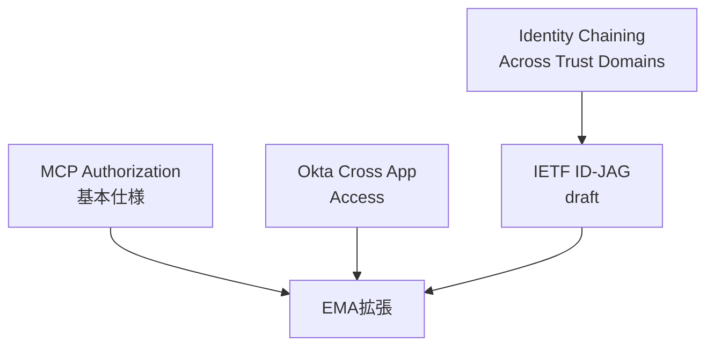
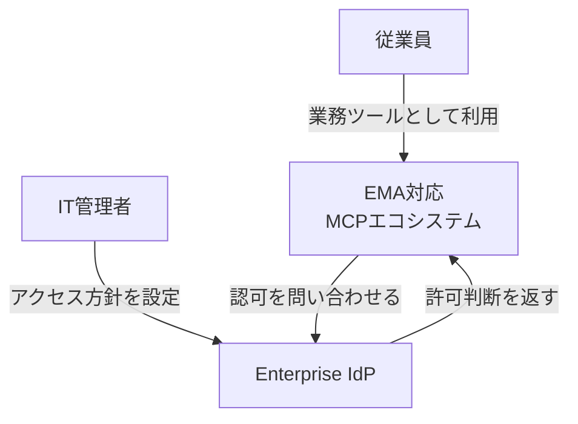
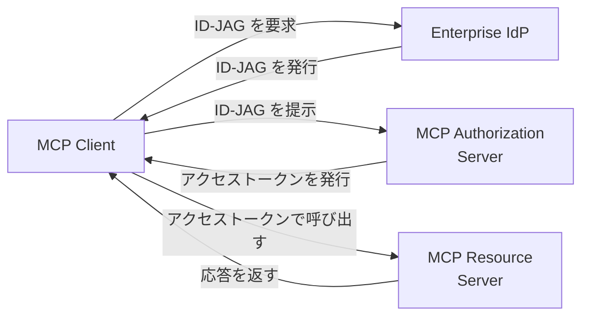
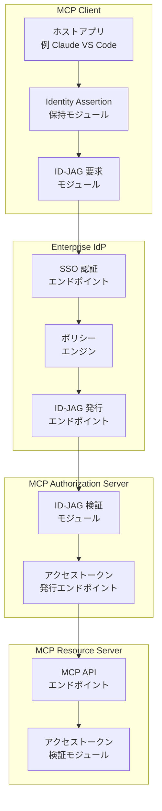
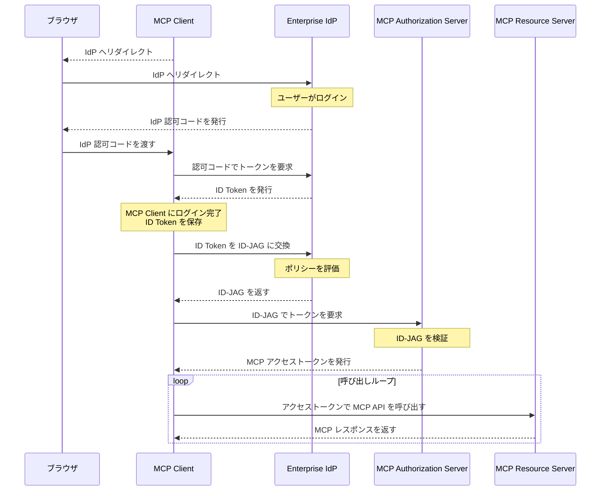
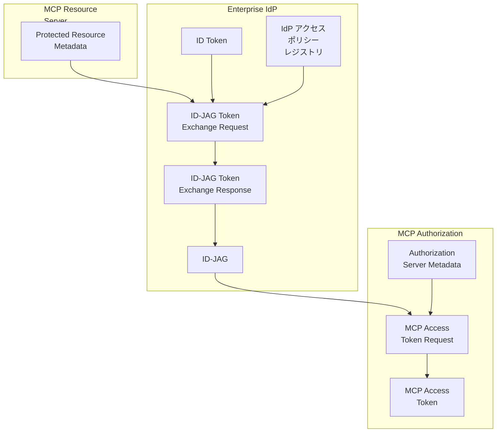
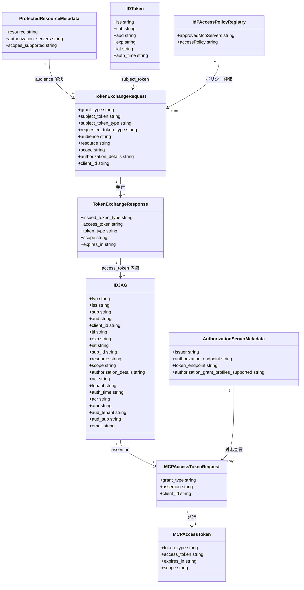

MCP (Model Context Protocol) を企業に広げるとき、最大のボトルネックは「ユーザーが MCP サーバーごとに個別 OAuth 認可する」方式でした。Enterprise-Managed Authorization (EMA) は、企業の IdP (Identity Provider) を認可の決定主体に据え、従業員が 1 回 SSO ログインするだけで承認済みの全 MCP サーバーへ自動接続できるようにする MCP 拡張です。2026-06-18 に stable 版が公開されました。

本記事では、EMA の位置づけ・アーキテクチャ (C4 モデル)・ID-JAG (Identity Assertion JWT Authorization Grant) のデータ構造・IdP / サーバー / クライアント各層の構築手順・運用・セキュリティ考慮事項までを、公式仕様と Okta / Atlassian の実装事例をもとに整理します。

> 調査日: 2026-07-07 / 対象: MCP 拡張 `io.modelcontextprotocol/enterprise-managed-authorization` (2026-06-18 stable 公開)

## 概要

Enterprise-Managed Authorization (EMA) は、MCP の拡張仕様です。拡張 ID は `io.modelcontextprotocol/enterprise-managed-authorization` です。2026-06-18 に stable 版として公開されました。

MCP の標準的な認可モデルでは、ユーザーが MCP サーバーごとに個別に認可します。この方式は個人利用には適しています。一方、企業環境では次の課題を生みます。

- 従業員が、利用する MCP サーバーごとの認可手順を理解する必要があります
- セキュリティチームが、ユーザー個別の認可では一貫したアクセスポリシーを強制できません
- 入社時に、従業員が数十個のサービスを手動で個別認可する必要があります
- 退職時に、サービスごとに個別のアクセス取り消しが必要になります

EMA は、企業の IdP (Identity Provider) を認可の決定主体に据えることで、この課題を解決します。IdP (Okta・Entra ID・Auth0 など) が、従業員がどの MCP サーバーにアクセスできるかを、組織ポリシーに基づいて決定します。従業員は、メールや Slack など他の業務ツールと同じ企業クレデンシャルで認証します。

### 位置づけ

EMA は、単独の新規プロトコルではありません。既存仕様の組み合わせとして設計されています。

| 関連仕様 | EMA との関係 |
|---|---|
| MCP Authorization 基本仕様 (2025-11-25) | EMA の土台。通常フローは Protected Resource Metadata 発見 → DCR → PKCE 認可コードフロー。EMA はこのフローに対する代替ルートを追加する拡張 |
| IETF ID-JAG draft (`draft-ietf-oauth-identity-assertion-authz-grant`) | EMA が採用する ID-JAG (Identity Assertion JWT Authorization Grant) トークンの定義元。RFC 8693 (Token Exchange) と RFC 7523 (JWT Bearer Grant) を組み合わせる。旧 `draft-parecki-oauth-identity-assertion-authz-grant` の後継 |
| Identity Chaining Across Trust Domains (IETF draft) | ID-JAG draft がプロファイルする、より広い枠組み。信頼ドメインをまたいだ委任アクセスの一般モデルを定義する |
| Okta Cross App Access (XAA) | ID-JAG を使った Identity Chaining の先行実装。EMA が公開時点で唯一動作確認済みの IdP 実装 |
| SEP-990 (Aaron Parecki 提案、Status: Final) | EMA の元になった MCP 側の提案。2025-06-04 起票。「企業 IdP のポリシー制御を MCP OAuth フロー中に有効化する」ことが目的 |

EMA は、これらの既存要素を「MCP という具体的なユースケース」に当てはめたプロファイルです。新しいトークン形式や新しい信頼モデルを発明したものではありません。



| 要素名 | 説明 |
|---|---|
| MCP Authorization 基本仕様 | 通常の per-user per-server OAuth フローを定義する土台仕様 |
| EMA拡張 | IdP を認可の決定主体に据える MCP 拡張本体 |
| Okta Cross App Access | ID-JAG を用いた Identity Chaining の先行実装 IdP |
| IETF ID-JAG draft | EMA が採用するトークン形式 (Identity Assertion JWT Authorization Grant) の定義元 |
| Identity Chaining Across Trust Domains | ID-JAG draft がプロファイルする、信頼ドメインをまたいだ委任アクセスの一般枠組み |

### 従来方式との比較


| 比較項目 | 個別 OAuth + DCR (現行 MCP 標準) | API キー配布 | EMA (IdP 中央管理) |
|---|---|---|---|
| ユーザー体験 | サーバーごとに同意画面を通過する | 管理者からキーを受け取り手動設定する | 初回ログイン時に全サーバーへ自動接続する |
| 管理者統制 | 個別ユーザーの認可に依存し統制不可 | キー発行時のみ統制、発行後は把握困難 | IdP の管理コンソールで一元的にポリシー設定する |
| 監査 | サーバーごとに個別のログを集約する必要がある | キー利用の追跡が困難 | IdP 側に認可判断のログが集約される |
| 失効 | サーバーごとに個別に取り消す | キーのローテーション・失効を手動管理する | IdP 側の失効で新規トークン発行が全クライアントへ即時停止 (発行済みトークンは期限まで残り得る) |
| 実装コスト | サーバー側は標準 OAuth のみで対応可能 | サーバー側の実装は最小限 | サーバー側に ID-JAG 検証・claim マッピングの追加実装が必要 |

補足が 2 点あります。

- 実行時コスト: EMA はサーバー接続ごとに「ID-JAG 取得」「トークン交換」の 2 リクエストを IdP と Authorization Server に対して行います。ユーザー操作は減る一方、ID-JAG が短命 (仕様の例で 300 秒) のため、トークン再取得時にも同じ 2 リクエストが発生します
- 移行時の共存: 既存の個別 OAuth 認可済みユーザーがいる状態から EMA へ切り替える際の再認可要否・共存ルールは公式未明示です。サーバー側のアカウント連携 (`sub` 主キー + `email` フォールバック) が既存アカウントとの橋渡しを担います

### ユースケース別の推奨

| ユースケース | 推奨方式 |
|---|---|
| 個人利用・小規模チームでの MCP サーバー接続 | 個別 OAuth + DCR |
| プロトタイプ・検証目的の一時的な連携 | API キー配布 |
| 企業の IT/セキュリティチームが MCP サーバー利用を統制したい | EMA |
| コンプライアンス要件で監査証跡が必須 | EMA |
| 新入社員のオンボーディングを自動化したい | EMA |
| サーバー間のマシン間通信 (ユーザー不在) | OAuth Client Credentials 拡張 (EMA とは別拡張、対象外) |

### 対応エコシステム (2026-06-18 時点)

| 分類 | 対応状況 |
|---|---|
| IdP | Okta (Cross App Access) が先行実装。VS Code 経由では Entra ID・Auth0 も例示されている |
| クライアント | Claude (web / Desktop)、Claude Code、Cowork (いずれも 2026-06-18 発表時点で beta 参加組織向け)、VS Code (v1.123 / 2026-06-03 リリース以降、プレビュー) |
| サーバー | Asana、Atlassian、Canva、Figma、Granola、Linear、Supabase (提供開始済み)、Slack (対応準備中) |

MCP 公式の client-matrix ページでは、コミュニティ管理の対応表として Archestra.AI の対応のみが明記されています。上記の Claude/Claude Code/Cowork/VS Code の対応状況は、Anthropic および Model Context Protocol 公式ブログ (2026-06-18) の発表内容に基づきます。

## 特徴

- IdP が MCP サーバーへのアクセス可否をポリシーとして一元管理します
- 従業員は企業クレデンシャルで 1 回 SSO するだけで、承認済みの全 MCP サーバーに接続されます
- IdP がトークン発行前にグループ・ロール・条件付きアクセスルールを評価します
- アクセス権を取り消すと、新規の ID-JAG / アクセストークン発行が IdP レベルで即座に止まります (発行済みトークンの扱いは「アクセス失効」で後述)
- 拡張はオプトインです。クライアントは `initialize` リクエストで、サーバーは Authorization Server メタデータで対応を宣言し、双方が対応した場合のみ有効になります
- 個人アカウントと業務アカウントの混在を防ぎ、業務アカウントのみの利用を強制できます
- ID-JAG トークンは `sub` (安定識別子) と任意の `email` claim を持ち、サーバー側の既存アカウントとの紐付けに使えます

## 構造

MCP Enterprise-Managed Authorization (EMA) のアーキテクチャを、C4 model の 3 段階 (システムコンテキスト図・コンテナ図・コンポーネント図) で図解します。あわせて認可フロー全体のシーケンス図と、通常の MCP Authorization フローとの構造差を示します。

### システムコンテキスト図

EMA を取り巻く関係者と外部システムの関係です。



| 要素名 | 説明 |
|---|---|
| 従業員 | MCP Client を通じて業務で MCP エコシステムを利用する人 |
| IT管理者 | Enterprise IdP 上で MCP サーバーへのアクセス方針を設定する人 |
| EMA対応MCPエコシステム | MCP Client と MCP Server 群から構成される対象システム |
| Enterprise IdP | 認可方針を判定し許可を発行する外部システム |

### コンテナ図

EMA を構成する 4 つのコンテナと、ID-JAG・アクセストークンの流れです。



| 要素名 | 説明 |
|---|---|
| MCP Client | 従業員が使う MCP ホストアプリケーション。ID-JAG をアクセストークンと交換する |
| Enterprise IdP | 従業員を認証し、組織の方針に基づき ID-JAG を発行する |
| MCP Authorization Server | ID-JAG を検証し、MCP 用のアクセストークンを発行する |
| MCP Resource Server | アクセストークンを検証し、MCP API を提供する |

### コンポーネント図

各コンテナをドリルダウンした構成です。実装例として Okta Cross App Access (XAA) を Enterprise IdP、Atlassian Rovo MCP Server を MCP Resource Server、Claude や VS Code を MCP Client に当てはめています。



#### MCP Client (例: Claude Desktop、VS Code GitHub Copilot)

| 要素名 | 説明 |
|---|---|
| ホストアプリ | 従業員が操作する MCP クライアントアプリ本体 |
| Identity Assertion 保持モジュール | ログイン時に取得した ID Token を保持する |
| ID-JAG 要求モジュール | Identity Assertion を使い Enterprise IdP に ID-JAG を要求する |

#### Enterprise IdP (例: Okta Cross App Access)

| 要素名 | 説明 |
|---|---|
| SSO 認証エンドポイント | 従業員の企業クレデンシャルを検証する |
| ポリシーエンジン | グループやロールの割り当てに基づき許可を判定する |
| ID-JAG 発行エンドポイント | 許可判定後に ID-JAG を発行する |

#### MCP Authorization Server (例: Atlassian の OAuth 基盤)

| 要素名 | 説明 |
|---|---|
| ID-JAG 検証モジュール | 署名・audience・issuer・有効期限を検証する |
| アクセストークン発行エンドポイント | 検証済み ID-JAG からアクセストークンを発行する |

#### MCP Resource Server (例: Atlassian Rovo MCP Server)

| 要素名 | 説明 |
|---|---|
| MCP API エンドポイント | MCP のツール・リソースを提供する |
| アクセストークン検証モジュール | 受信したアクセストークンの有効性を検証する |

補足として、MCP Authorization Server と MCP Resource Server は同一ベンダーが一体で提供する構成もあります。Atlassian の実装では、両者は Atlassian 側の OAuth 基盤としてまとめて提供されています。

### EMA 認可フロー シーケンス図

公式ページに掲載されたシーケンス図を正として図解します。



| 要素名 | 説明 |
|---|---|
| ブラウザ | ユーザーの IdP ログインを仲介する |
| MCP Client | ID Token を ID-JAG に交換し、アクセストークンを取得する |
| Enterprise IdP | ユーザー認証とポリシー評価を行い、ID-JAG を発行する |
| MCP Authorization Server | ID-JAG を検証し、アクセストークンを発行する |
| MCP Resource Server | アクセストークンを検証し、MCP API を提供する |

シーケンス図は成功パスを示します。失敗時の分岐は以下です。

| 失敗ポイント | 挙動 |
|---|---|
| IdP のポリシー評価で拒否 | ID-JAG は発行されず、IdP が OAuth 2.0 Token Error (RFC 6749 Section 5.2 準拠) を返す。未承認サーバーのトークンはクライアントに渡らない |
| MCP Authorization Server の ID-JAG 検証で失敗 (署名・`aud` 不一致・期限切れ等) | Authorization Server が Token Error を返す。個別のエラーコード分類は公式未明示 |

### 通常フローとの構造差

通常の MCP Authorization フロー (2025-11-25 仕様) は、MCP サーバーごとに 401 応答を起点としたブラウザ同意を要求します。EMA はこの起点を Enterprise IdP でのポリシー評価に置き換えます。

| 観点 | 通常の MCP Authorization | EMA |
|---|---|---|
| 認可の起点 | MCP Server からの HTTP 401 応答 | MCP Client での SSO ログイン |
| サーバー発見 | Protected Resource Metadata (PRM) 取得 | 不要 (IdP が仲介先を管理) |
| クライアント登録 | Dynamic Client Registration / Client ID Metadata Documents / 事前登録のいずれかが必須 | 不要 |
| ユーザー操作 | サーバーごとにブラウザで同意 (PKCE + resource パラメータ) | 初回 SSO ログインのみ。以降は無操作 |
| 認可判断者 | ユーザー本人がその場で同意 | Enterprise IdP がポリシー (グループ・ロール・条件付きアクセス) で判定 |
| 失効の単位 | サーバーごとに個別失効 | IdP 側の一括操作で全 MCP クライアントに即時反映 |
| 主なプロトコル要素 | 401 / WWW-Authenticate / PRM / DCR / PKCE / 認可コード | ID Token / ID-JAG / トークン交換 |

## データ

### 概念モデル

EMA に登場するエンティティは、発行元となる 3 つのシステムに所属します。Enterprise IdP は ID Token / ID-JAG / アクセスポリシーレジストリを所有します。MCP Authorization Server は MCP Access Token とその発行条件を宣言するメタデータを所有します。MCP Resource Server は Protected Resource Metadata を所有します。



#### Enterprise IdP

| 要素名 | 説明 |
|---|---|
| ID Token | SSO ログイン時に IdP が発行する Identity Assertion。ID-JAG 取得の元になるトークン |
| IdP アクセスポリシーレジストリ | 承認済み MCP サーバーの一覧と、サーバーごとのアクセスポリシーを管理するレジストリ |
| ID-JAG Token Exchange Request | MCP Client が ID Token を ID-JAG に交換するために IdP に送るリクエスト |
| ID-JAG Token Exchange Response | IdP がポリシー評価後に返す、ID-JAG を含むレスポンス |
| ID-JAG | Identity Assertion JWT Authorization Grant。IdP がユーザー本人性とポリシー評価結果を表明する JWT |

#### MCP Authorization Server

| 要素名 | 説明 |
|---|---|
| Authorization Server Metadata | EMA (ID-JAG プロファイル) への対応を宣言するメタデータ |
| MCP Access Token Request | MCP Client が ID-JAG を MCP Access Token に交換するために送るリクエスト |
| MCP Access Token | MCP Resource Server の API 呼び出しに使う Bearer アクセストークン |

#### MCP Resource Server

| 要素名 | 説明 |
|---|---|
| Protected Resource Metadata | MCP Client が Resource Authorization Server (audience) を発見するためのメタデータ |

### 情報モデル



| 要素名 | 説明 |
|---|---|
| IDToken | IdP が OpenID Connect ログイン時に発行するトークン。属性は OpenID Connect Core の標準クレームであり、EMA / ID-JAG 仕様自体は再定義しない (仕様未規定) |
| TokenExchangeRequest | ID-JAG を要求するトークン交換リクエスト。IETF draft Section 3 で定義 |
| TokenExchangeResponse | ID-JAG を含むトークン交換レスポンス。IETF draft Section 4.3.4 で定義 |
| IDJAG | Identity Assertion JWT Authorization Grant 本体。IETF draft Section 3.1 で定義 |
| IdPAccessPolicyRegistry | 承認済み MCP サーバーとアクセスポリシーの管理台帳。具体的なデータ構造は仕様未規定 (IdP 管理コンソールの実装依存) |
| MCPAccessTokenRequest | ID-JAG を MCP Access Token に交換するリクエスト。RFC 7523 (JWT Bearer Grant) を用いる |
| MCPAccessToken | MCP Resource Server 呼び出しに使う Bearer アクセストークン |
| ProtectedResourceMetadata | MCP Resource Server が公開する、認可サーバー発見用メタデータ (2025-11-25 版 MCP Authorization 仕様由来) |
| AuthorizationServerMetadata | MCP Authorization Server が公開する、EMA / ID-JAG プロファイル対応の宣言用メタデータ |

### ID-JAG (Identity Assertion JWT Authorization Grant)

ID-JAG の header/claims は IETF draft **draft-ietf-oauth-identity-assertion-authz-grant-04** で定義されています。MCP の EMA 仕様は、この draft を MCP のコンテキストに適用したものです。

#### header

| 要素名 | 必須/任意 | 説明 |
|---|---|---|
| typ | 必須 | 値は固定で `oauth-id-jag+jwt` |

#### payload claims

| Claim | 必須/任意 | 多重度 | 説明 |
|---|---|---|---|
| iss | 必須 | 1 | IdP Authorization Server の issuer identifier (RFC 8414) |
| sub | 必須 | 1 | End-User を表す Subject Identifier |
| aud | 必須 | 1 | Resource Authorization Server (MCP Authorization Server) の issuer identifier |
| client_id | 必須 | 1 | Resource Authorization Server 上で本人に代わって動作する OAuth 2.0 client の識別子 |
| jti | 必須 | 1 | この JWT の一意な ID (RFC 7519 Section 4.1.7) |
| exp | 必須 | 1 | 有効期限 (RFC 7519 Section 4.1.4) |
| iat | 必須 | 1 | 発行時刻 (RFC 7519 Section 4.1.6) |
| resource | 任意 | 1 または many | MCP Resource Server の Resource Identifier (RFC 8707)。MCP の EMA 仕様では「存在する場合は MCP Server の識別子でなければならない」と定義を狭めています |
| scope | 任意 | 1 | 許可されたスコープの空白区切りリスト (RFC 6749 の書式) |
| email | 任意 | 1 | End-User のメールアドレス。MCP 仕様は、アカウント連携時に sub を第一キー、email を既存アカウント突合のフォールバックとして使うよう規定しています |
| sub_id | 任意 | 1 | RFC 9493 形式の Subject Identifier |
| authorization_details | 任意 | many | RFC 9396 形式の認可詳細オブジェクトの配列 |
| act | 任意 | 1 | Actor claim (RFC 8693) |
| tenant | 任意 | 1 | マルチテナント issuer におけるテナント識別子 |
| auth_time | 任意 | 1 | End-User が認証した時刻 (OpenID Connect Core) |
| acr | 任意 | 1 | Authentication Context Class Reference (OpenID Connect Core) |
| amr | 任意 | many | 認証方式の識別子群 (OpenID Connect Core) |
| aud_tenant | 任意 | 1 | Resource Authorization Server 側のテナント識別子 |
| aud_sub | 任意 | 1 | Resource Authorization Server 側での End-User 識別子 |

MCP 仕様の例で実際に使われているのは `jti` / `iss` / `sub` / `email` / `aud` / `resource` / `client_id` / `exp` / `iat` / `scope` です。それ以外の任意クレーム (`sub_id` / `authorization_details` / `act` / `tenant` / `acr` / `amr` / `aud_tenant` / `aud_sub`) は IETF draft では定義されていますが、MCP 仕様の例には登場しません。

### Token Exchange Request (ID-JAG 取得)

`grant_type` は `urn:ietf:params:oauth:grant-type:token-exchange` (RFC 8693) 固定です。

| パラメータ | 必須/任意 | 説明 |
|---|---|---|
| grant_type | 必須 | 固定値 `urn:ietf:params:oauth:grant-type:token-exchange` |
| subject_token | 必須 | ID Token (または SAML assertion) の値 |
| subject_token_type | 必須 | `urn:ietf:params:oauth:token-type:id_token` / `urn:ietf:params:oauth:token-type:saml2` / `urn:ietf:params:oauth:token-type:refresh_token` のいずれか |
| requested_token_type | 必須 | 固定値 `urn:ietf:params:oauth:token-type:id-jag` |
| audience | 必須 | Resource Authorization Server (MCP Authorization Server) の issuer identifier |
| resource | 任意 | MCP Resource Server の Resource Identifier (RFC 8707) |
| scope | 任意 | Resource Server 側で要求するスコープの空白区切りリスト |
| authorization_details | 任意 | RFC 9396 形式の認可詳細 |
| client_id / client_secret | クライアント認証として使用 | IdP に登録済みの MCP Client を認証する標準 OAuth パラメータ。本フロー固有ではありません |

### ID-JAG Token Exchange Response

IETF draft Section 4.3.4 で定義されています。

| フィールド | 必須/任意 | 説明 |
|---|---|---|
| issued_token_type | 必須 | 固定値 `urn:ietf:params:oauth:token-type:id-jag` |
| access_token | 必須 | ID-JAG そのもの (JWT 文字列) |
| token_type | 必須 | 固定値 `N_A` (OAuth のアクセストークンではないため) |
| scope | 条件付き必須 | 発行トークンのスコープが要求スコープと同一なら任意、異なる場合は必須 |
| expires_in | 推奨 | 認可グラントの有効秒数 |

### MCP Access Token Request (ID-JAG から Access Token への交換)

`grant_type` は `urn:ietf:params:oauth:grant-type:jwt-bearer` (RFC 7523) です。**`urn:ietf:params:oauth:grant-type:token-exchange` ではありません。** ID-JAG を IdP から取得する際と、ID-JAG を MCP Access Token に交換する際とでは grant_type が異なります。

| パラメータ | 必須/任意 | 説明 |
|---|---|---|
| grant_type | 必須 | 固定値 `urn:ietf:params:oauth:grant-type:jwt-bearer` |
| assertion | 必須 | 直前のステップで取得した ID-JAG (JWT 文字列) |
| client_id | 仕様例に記載 | MCP Authorization Server 上のクライアント識別子 |

### MCP Access Token (レスポンス)

| フィールド | 説明 |
|---|---|
| token_type | `Bearer` |
| access_token | MCP Resource Server 呼び出しに使うアクセストークン |
| expires_in | 有効秒数 |
| scope | 付与されたスコープ (空白区切り) |

発行された Access Token は、ID-JAG の `resource` クレームで示された MCP Server にオーディエンス制限されなければなりません (MUST)。これは MCP EMA 仕様が明記する制約です。

### IdP アクセスポリシーレジストリ

IdP は「承認済み MCP サーバーの一覧」と「サーバーごとのアクセスポリシー (グループ / ロール / 条件付きアクセス)」を管理し、Token Exchange Request のポリシー評価に用います。管理者は既存の ID 管理コンソールでこれらを設定します。具体的なスキーマは MCP 仕様・IETF draft のいずれにも定義がなく、仕様未規定です (IdP 実装依存)。

### Protected Resource Metadata / Authorization Server Metadata

EMA / ID-JAG 固有の対応宣言は、Authorization Server Metadata の `authorization_grant_profiles_supported` フィールドで行われます。Protected Resource Metadata 自体には EMA 固有のフィールドはなく、基本 MCP Authorization 仕様 (2025-11-25 版) のフィールドがそのまま使われます。

| メタデータ | フィールド | 必須/任意 | 説明 |
|---|---|---|---|
| Protected Resource Metadata | resource | 必須 (基本仕様) | MCP Resource Server 自身の識別子 |
| Protected Resource Metadata | authorization_servers | 必須 (基本仕様) | 利用可能な Authorization Server の issuer 一覧 |
| Protected Resource Metadata | scopes_supported | 任意 (基本仕様) | サポートするスコープ一覧 |
| Authorization Server Metadata | authorization_grant_profiles_supported | EMA 対応宣言に使用 (IETF draft は SHOULD) | サポートする authorization grant profile の文字列配列。値に `urn:ietf:params:oauth:grant-profile:id-jag` を含めば ID-JAG (EMA) 対応を意味する (IETF draft Section 7.2) |

MCP Client は、この `authorization_grant_profiles_supported` フィールドを確認することで、接続先の MCP Authorization Server が ID-JAG プロファイルに対応しているかを判定します。

### MCP Client 側の宣言

MCP Client は `initialize` リクエストの `capabilities.extensions` に、拡張 ID をキーとした空オブジェクトを含めて EMA サポートを宣言します。

```json
{
  "capabilities": {
    "extensions": {
      "io.modelcontextprotocol/enterprise-managed-authorization": {}
    }
  }
}
```

## 構築方法

MCP Enterprise-Managed Authorization (EMA) の導入には 3 者の作業が必要です。

| 導入主体 | 主な作業 |
|---|---|
| IdP 管理者 (Okta 等) | MCP サーバーの resource app 登録、AI Agent 登録、アクセスポリシー設定 |
| MCP サーバー実装者 | ID-JAG を受理する Authorization Server の実装、EMA サポートの宣言 |
| MCP クライアント側組織 | Claude / VS Code 等での enterprise IdP 設定 |

### IdP 側 (Okta Cross App Access) のセットアップ

Okta では EMA を Cross App Access (XAA) として提供します。Claude Enterprise 向け beta ガイド (Okta 公式サポート記事) の前提条件は以下です。

- Anthropic 承認済みの Claude Enterprise-managed auth (EMA) beta 参加組織であること
- Okta Identity Engine (OIE) で XAA 対応が有効化されていること
- Okta テナントのスーパー管理者アカウント
- Claude および対象 MCP (Figma、Asana 等) 用の SAML アプリが Okta に構成済みであること

セットアップ手順は 3 段階です。

**手順 1: MCP resource app の XAA 有効化**

- Admin Console で Applications > Applications から対象 MCP アプリを選択します
- Resource Server タブで「Enable XAA」をチェックします
- Anthropic から提供される Issuer URL を入力して保存します

汎用の resource app 登録 (Okta developer blog の手順) では、Applications > Applications から App Catalog (Browse App Catalog) で「XAA Resource App」を探して追加し、自組織の Authorization Server の issuer URL を入力します。

**手順 2: SAML アプリの設定確認 (カスタムアプリの場合)**

- Sign On タブで Application username format を確認します
- SAML Settings で Name ID Format を `EmailAddress` に設定します

**手順 3: AI Agent の登録と接続許可 (ポリシー設定)**

Directory > AI Agents > Register Manually で AI エージェント (Claude) を登録します。

| 設定項目 | 内容 |
|---|---|
| Credentials | Anthropic から提供される公開鍵を追加 |
| Delegations | Claude アプリを「Requester」として追加 |
| Resource Connections | 各 MCP アプリを接続 (Client ID を入力) |

この Resource Connections が「どのクライアントがどの MCP サーバーにアクセスできるか」の中央ポリシーになります。IdP はグループメンバーシップ・ロール・条件付きアクセスルールを評価し、ポリシーを満たさないユーザーには ID-JAG を発行しません。

補足: 本番 Okta テナントなしで挙動を試す場合は、Okta が提供する playground `xaa.dev` を利用できます。アカウント登録は不要です。Developer > Register Client でクライアントを登録すると、Client ID / Client Secret などの認証情報が発行されます。

### MCP サーバー側 (Authorization Server) の実装

MCP サーバー側では、既存の Authorization Server に「ID-JAG を受理する grant type」を追加します。公式 Implementation guide が求める実装ポイントは以下です。

**1. token endpoint での ID-JAG 検証**

`grant_type=urn:ietf:params:oauth:grant-type:jwt-bearer` で送られてくる ID-JAG (JWT) を検証します。Okta developer blog と Atlassian 実装事例 (Rovo MCP) が挙げる検証項目は以下です。

- JWT 署名を enterprise IdP の JWKS エンドポイントの公開鍵で検証する
- `typ` ヘッダーが `oauth-id-jag+jwt` であることを確認する
- `iss` claim が信頼済み IdP の issuer と一致することを確認する
- `aud` claim が自 Authorization Server の issuer 識別子と一致することを確認する (仕様上 MUST)
- ID-JAG 内の `client_id` が、交換を試みているクライアントと一致することを確認する (クライアント連続性)
- 有効期限 (`exp`) とトークンの一意性 (`jti`) を確認する

検証後に発行するアクセストークンは、`resource` claim が示す MCP サーバーに audience 制限しなければなりません (仕様上 MUST)。

上記の検証項目を反映した実装案です (公式サンプルではありません。jose ライブラリの標準 API で構成しています)。

```javascript
// 実装案: Node.js (jose) での ID-JAG 検証例
import { createRemoteJWKSet, jwtVerify } from 'jose';

const idpJwks = createRemoteJWKSet(
  new URL('https://acme.idp.example/.well-known/jwks.json'),
);

async function verifyIdJag(assertion, expectedClientId) {
  const { payload } = await jwtVerify(assertion, idpJwks, {
    typ: 'oauth-id-jag+jwt',                 // typ ヘッダーの検証
    issuer: 'https://acme.idp.example',      // 信頼済み IdP の issuer
    audience: 'https://auth.chat.example/',  // 自 Authorization Server の issuer 識別子
  });
  if (payload.client_id !== expectedClientId) {
    throw new Error('client_id mismatch');   // クライアント連続性の確認
  }
  // jti の一意性検証: 使用済み jti を exp まで保持し、重複した提示を拒否する
  // (仕様は一意性の確認を求めるが、保存方式は未規定)
  return payload;
}
```

**2. IdP claim から権限へのマッピングとアカウントリンク**

- ID-JAG の `scope` / `resource` claim を自サーバーの認可ロジックに対応付けます
- `sub` claim を主たる安定識別子としてユーザーを解決します
- EMA 導入前から存在するアカウントとの照合には `email` claim にフォールバックします

Atlassian の事例では「Resource Authorization Server が外部ベアラートークンを直接信頼することはできない」として、外部アサーション (ID-JAG) を検証した後に Atlassian ネイティブのアクセストークンを発行する二段階モデルを採用しています。外部の `sub` は IdP ローカル ID・メールアドレス・テナントスコープ識別子など複数形式があり得るため、確実なユーザーマッピングの設計が実装上の要点です。

**3. メタデータでの EMA サポート宣言**

- Authorization Server metadata の `authorization_grant_profiles_supported` に `urn:ietf:params:oauth:grant-profile:id-jag` を含めて宣言します (IETF draft Section 7.2)

```json
{
  "issuer": "https://auth.chat.example",
  "authorization_endpoint": "https://auth.chat.example/authorize",
  "token_endpoint": "https://auth.chat.example/token",
  "authorization_grant_profiles_supported": [
    "urn:ietf:params:oauth:grant-profile:id-jag"
  ]
}
```
- MCP 公式ガイドは「サーバーの authorization metadata で拡張を宣言し、クライアントに enterprise-managed フローの利用を示す」ことを求めています。PRM (Protected Resource Metadata) 側の専用フィールド名は公式未明示です
- 任意で、enterprise 管理者が IdP 管理コンソールでポリシー設定できるよう、サーバーの resource descriptor を IdP admin API に公開します

### MCP クライアント側組織のセットアップ

**Claude (Enterprise / Team)**

- Anthropic の EMA beta 承認を受けた組織が対象です (2026-07 時点)
- Claude は shared MCP layer で EMA を実装しており、Claude / Claude Code / Cowork で利用できます
- 組織側の作業は前述の Okta beta ガイドの手順 (SAML アプリ + AI Agent 登録 + Resource Connections) です
- Claude 管理画面側の設定項目名は公式未明示です (beta ガイドは Okta 側手順のみ記載)

**VS Code (v1.123 以降)**

VS Code 1.123 (2026-06-03 リリース) で enterprise-managed MCP 認証がプレビュー提供されました。release notes は対応 IdP の例として Entra ID / Okta / Auth0 を挙げています。

- 管理者: ポリシー管理設定 `mcp.enterpriseManagedAuth.idp` で IdP を構成します。配信経路は Windows Group Policy / macOS managed preferences / Linux `/etc/vscode/policy.json` です
- ユーザー (またはサーバー定義): `mcp.json` の対象サーバーの `oauth` ブロックに `"enterpriseManaged": true` を指定します。このフラグがあると VS Code は per-server 登録の標準フローではなく XAA プロバイダー経由でルーティングします

```json
{
  "servers": {
    "my-mcp-server": {
      "url": "https://mcp.example.com/mcp",
      "oauth": {
        "enterpriseManaged": true
      }
    }
  }
}
```

**MCP クライアント実装の共通要件 (公式 Implementation guide)**

自作クライアントを EMA 対応させる場合の要件は以下です。

1. `initialize` リクエストでサポートを宣言します (「■データ > MCP Client 側の宣言」参照)
2. SSO をサポートし、ログイン時に発行される Identity Assertion (OpenID ID Token または SAML assertion) を保存します
3. サーバーが enterprise-managed auth を要求したら、保存済み Identity Assertion で IdP から ID-JAG を取得し、MCP Authorization Server のアクセストークンと交換します。ユーザーを MCP Authorization Server の authorization endpoint にリダイレクトしません
4. enterprise IdP のエンドポイントを組織レベル設定として構成できるようにします
5. IdP 発行トークンの scope 制約を尊重し、scope エラーを適切に処理します

## 利用方法

### 必須パラメータ一覧

EMA の実行時 HTTP フローは 2 つのリクエストで構成されます。

**リクエスト 1: IdP token endpoint への ID-JAG 取得 (Token Exchange, RFC 8693)**

| パラメータ | 値 / 説明 | 必須 |
|---|---|---|
| `grant_type` | `urn:ietf:params:oauth:grant-type:token-exchange` | 必須 |
| `requested_token_type` | `urn:ietf:params:oauth:token-type:id-jag` | 必須 |
| `audience` | Resource Authorization Server の issuer 識別子 | 必須 (MUST) |
| `resource` | MCP サーバーの Resource Identifier | 任意 (指定時は MCP サーバーの識別子で MUST) |
| `scope` | 要求する scope (スペース区切り) | 任意 |
| `subject_token` | ログイン時に取得した ID Token | 必須 |
| `subject_token_type` | `urn:ietf:params:oauth:token-type:id_token` | 必須 |
| `client_id` / `client_secret` | クライアント認証情報 | クライアント認証方式に依存 |

クライアント認証は、IdP 登録時に設定した標準の OAuth クライアント認証方式 (client_secret / private_key_jwt 等) に従います。仕様の例は client_secret を示していますが、方式自体は EMA 固有の規定ではありません。

**リクエスト 2: MCP Authorization Server token endpoint での交換 (JWT Bearer, RFC 7523)**

| パラメータ | 値 / 説明 | 必須 |
|---|---|---|
| `grant_type` | `urn:ietf:params:oauth:grant-type:jwt-bearer` | 必須 |
| `assertion` | リクエスト 1 で取得した ID-JAG | 必須 |
| `client_id` | クライアント識別子 (例: Client ID Metadata Document の URL) | クライアント認証方式に依存 |

### ID-JAG 取得の HTTP 例 (仕様原文より)

リクエスト:

```http
POST /oauth2/token HTTP/1.1
Host: acme.idp.example
Content-Type: application/x-www-form-urlencoded

grant_type=urn:ietf:params:oauth:grant-type:token-exchange
&requested_token_type=urn:ietf:params:oauth:token-type:id-jag
&audience=https://auth.chat.example/
&resource=https://mcp.chat.example/
&scope=chat.read+chat.history
&subject_token=eyJraWQiOiJzMTZ0cVNtODhwREo4VGZCXzdrSEtQ...
&subject_token_type=urn:ietf:params:oauth:token-type:id_token
&client_id=2ec954a1d60620116d36d9ceb7
&client_secret=a26d84873504215a34a86d52ef5cd64f4b76
```

レスポンス:

```http
HTTP/1.1 200 OK
Content-Type: application/json
Cache-Control: no-store
Pragma: no-cache

{
  "issued_token_type": "urn:ietf:params:oauth:token-type:id-jag",
  "access_token": "eyJhbGciOiJIUzI1NiIsI...",
  "token_type": "N_A",
  "scope": "chat.read chat.history",
  "expires_in": 300
}
```

発行される ID-JAG の中身 (デコード後) は以下です。`sub` がユーザー、`client_id` が要求クライアント、`aud` が交換先 Authorization Server、`resource` が最終アクセス先 MCP サーバーを表します。

```json
{
  "typ": "oauth-id-jag+jwt"
}
.
{
  "jti": "9e43f81b64a33f20116179",
  "iss": "https://acme.idp.example",
  "sub": "U019488227",
  "email": "user@example.com",
  "aud": "https://auth.chat.example/",
  "resource": "https://mcp.chat.example/",
  "client_id": "f53f191f9311af35",
  "exp": 1311281970,
  "iat": 1311280970,
  "scope": "chat.read chat.history"
}
```

### Token Exchange の HTTP 例 (仕様原文より)

ID-JAG を MCP Authorization Server のアクセストークンに交換します。

リクエスト:

```http
POST /oauth2/token HTTP/1.1
Host: auth.chat.example

grant_type=urn:ietf:params:oauth:grant-type:jwt-bearer
&assertion=eyJhbGciOiJIUzI1NiIsI...
&client_id=https://client.example.com/client.json
```

レスポンス:

```http
HTTP/1.1 200 OK
Content-Type: application/json
Cache-Control: no-store

{
  "token_type": "Bearer",
  "access_token": "2YotnFZFEjr1zCsicMWpAA",
  "expires_in": 86400,
  "scope": "chat.read chat.history"
}
```

以降、クライアントはこのアクセストークンを `Authorization: Bearer` ヘッダーに載せて MCP サーバーを呼び出します。

### クライアント実装コード例 (Okta 公式 blog より)

TypeScript (openid-client ライブラリ) での ID-JAG 取得実装です。

```typescript
private async exchangeIdTokenForIdJag(
  config: openidClient.Configuration,
  idToken: string,
  authServerUrl: string,
  resourceUrl: string,
  scope: string[],
): Promise<string> {
  const tokenExchangeParams = {
    requested_token_type: 'urn:ietf:params:oauth:token-type:id-jag',
    audience: authServerUrl,
    resource: resourceUrl,
    subject_token: idToken,
    subject_token_type: 'urn:ietf:params:oauth:token-type:id_token',
    scope: scope.join(' '),
  };

  const tokenExchangeResponse = await openidClient.genericGrantRequest(
    config,
    'urn:ietf:params:oauth:grant-type:token-exchange',
    tokenExchangeParams,
  );

  return tokenExchangeResponse.access_token;
}
```

Okta のサンプルリポジトリ (okta-xaa-dev-mcp-client-example) では、この 2 段階交換を `withCrossAppAccess()` ミドルウェアが自動処理します。`.env` に `IDP_URL` / `CLIENT_ID` / `CLIENT_SECRET` を設定して起動すると、IdP ログイン後に MCP サーバーへ自動接続されます。

### エンドユーザーから見た利用体験

| 観点 | 従来の MCP 認可 | EMA 導入後 |
|---|---|---|
| 初回接続 | MCP サーバーごとに OAuth 同意画面を通過 | 企業 SSO に 1 回ログインするだけ |
| 追加の同意画面 | サーバーごとに発生 | 発生しない (管理者が事前承認済み) |
| 新サーバーの追加 | 各ユーザーが個別に認可 | 管理者が IdP で接続を許可すると全ユーザーに自動反映 |
| アクセス拒否時 | サーバーごとの認可失敗 | IdP がポリシー評価時にエラーを返し、未承認サーバーのトークンはクライアントに渡らない |

MCP 公式ブログはこの体験を「ログインすると全 MCP コネクタが自動セットアップされる」ゼロタッチセットアップと表現しています。Atlassian の事例でも、管理者が接続を事前承認していれば、ユーザーは Claude にログインするだけで Rovo MCP を追加同意なしに利用できます。

## 運用

EMA 導入後の運用は、IdP 管理コンソールでの設定変更と、失効・監査・トークン寿命の管理に分かれます。

### IdP レジストリの運用

- IdP は「承認済み MCP サーバーのレジストリ」と「サーバーごとのアクセスポリシー」を保持します。
- 管理者は既存の ID 管理ツール上でこのレジストリを設定します。
- MCP サーバーを追加するときは、次の情報を IdP に登録します。

| 設定項目 | 内容 |
|---|---|
| MCP サーバーの Resource Identifier | ID-JAG の `resource` クレームに対応する識別子 |
| MCP Authorization Server の Issuer 識別子 | ID-JAG の `aud` クレームに対応する識別子 |
| アクセスポリシー | グループ所属・ロール・条件付きアクセスルール |
| 許可スコープ | MCP サーバーが定義する OAuth スコープのうち、ユーザー/グループに許可する範囲 |

- MCP クライアントも IdP に事前登録が必要です。IdP ポリシーは「事前登録済みクライアントへのサインインのみ許可する」ため、未登録クライアントはサインインの入口で弾かれます。
- ポリシー変更 (グループ追加・スコープ変更など) は IdP 側で完結します。MCP クライアント・サーバー側の再設定は不要です。
- MCP サーバーを廃止・削除する場合は、IdP レジストリから該当エントリを削除します。以降、新規の ID-JAG 発行リクエストは当該サーバーに対して拒否されます。
- 接続先 MCP Authorization Server の EMA 対応は、Authorization Server metadata で確認できます。

```bash
curl -s https://auth.chat.example/.well-known/oauth-authorization-server \
  | jq '.authorization_grant_profiles_supported'
# ["urn:ietf:params:oauth:grant-profile:id-jag"] が含まれれば EMA (ID-JAG) 対応
```

### アクセス失効

- 失効は IdP 側の一箇所で行います。従業員のアクセスを取り消すと、すべての MCP クライアントに対して即時に反映されます。クライアントごと・サーバーごとの個別失効操作は不要です。
- ただし失効が及ぶ範囲には限界があります。

| 段階 | 失効の効き方 |
|---|---|
| ID-JAG 発行前 (IdP でのポリシー評価) | IdP がポリシー拒否を判定できるため、即時に新規発行がブロックされる |
| ID-JAG 自体 | 有効期限が短い (仕様の例では 300 秒) ため、失効後は速やかに無効化される |
| 発行済みの MCP アクセストークン | IdP のポリシー変更を遡って無効化する仕組みは仕様上明記されていない。トークン自身の有効期限 (仕様の例では 86400 秒) まで有効であり続ける可能性がある |

- したがって「IdP での失効=全システムからの即時遮断」ではなく、「新規のアクセストークン発行の即時停止」と理解するのが正確です。
- 発行済みトークンまで含めた即時失効を実現したい場合、MCP サーバー (Resource Server) 側でトークンイントロスペクションや短い有効期限運用を組み合わせる必要がありますが、この点の具体的な実装手順は公式ドキュメントに記載がありません。

### 監査ログ

- IdP は「MCP サーバーへのすべてのアクセスに対する監査可能な認可証跡」を提供します。組織のコンプライアンス要件はこの証跡で満たすことを想定しています。
- IdP が監査できる範囲は、ID-JAG 発行とアクセストークン発行という「認可の意思決定プロセス」に限られます。
- IdP の可視性は「アクセストークン発行のプロセスに限定され、実際の MCP トラフィックには及ばない」と仕様に明記されています。

| ログの種類 | 記録主体 | 内容 |
|---|---|---|
| 認可判断ログ (誰が・いつ・どのサーバーへのアクセスを許可/拒否されたか) | IdP | ID-JAG 発行リクエストとポリシー評価結果 |
| 実際のツール呼び出し・リソースアクセスの内容 | MCP サーバー (Resource Server) | サーバー実装依存。IdP には記録されない |

- 「誰が MCP サーバーにアクセスできる状態か」は IdP 側で監査できますが、「実際に何のツールを呼び出したか」はサーバー側の監査ログ実装に委ねられます。両方が必要な場合は、サーバー側の監査ログ整備を別途行う必要があります。

### トークンライフタイム管理

- ID-JAG とアクセストークンは別々のライフタイムを持ちます。

| トークン | 発行元 | 仕様上の例 | 用途 |
|---|---|---|---|
| ID-JAG | Enterprise IdP | `expires_in: 300` (5分) | MCP Authorization Server との交換専用の短命グラント。有効期限内はアクセストークン再取得のため再提示することも許容される (IETF draft Section 4.4.3) |
| MCP アクセストークン | MCP Authorization Server | `expires_in: 86400` (24時間) | MCP Resource Server への API 呼び出し用 |

- 両方とも仕様本文が定める必須値ではなく例示ですが、ID-JAG は極めて短命、アクセストークンはそれより長寿命という設計思想が読み取れます。
- アクセストークンの更新について、仕様は MCP Authorization Server 向けの通常の OAuth `refresh_token` グラントを規定していません。クライアントは保存しておいた Identity Assertion (ID Token / SAML assertion、IdP が対応すれば `refresh_token` を `subject_token` にする経路も可) から IdP に再度 ID-JAG を要求するか、有効な ID-JAG が残っていればそれを再提示して、MCP Authorization Server のアクセストークンと再交換します。
- クライアントは IdP が発行するトークンのスコープ制約を尊重し、スコープエラーを適切にハンドリングする実装が求められます。

### 運用モニタリング (実装案)

継続的に監視すべき指標は仕様・公式ドキュメントに定義がありません (公式未明示)。EMA のフロー構造から導ける監視候補は以下です。

| 監視候補 | 見える異常 |
|---|---|
| ID-JAG 発行失敗率 (IdP 側) | ポリシー設定ミス、Identity Assertion の期限切れの多発 |
| ポリシー拒否数 (IdP 側) | 未承認サーバーへのアクセス試行、権限設定の過不足 |
| トークン交換エラー率 (Authorization Server 側) | IdP との信頼設定 (issuer / JWKS) の破損、audience 不一致 |
| 未登録クライアントのサインイン試行 (IdP 側) | ポリシーを迂回しようとする個人アカウント経由のアクセス |
| token endpoint のレート制限到達 | 一括移行・バッチ処理によるスパイク (Auth0 XAA beta は 5 RPS 制限を明示) |

## ベストプラクティス

### 権限設計 (最小権限スコープ・サーバー単位のポリシー粒度)

- IdP が制御できる粒度は、MCP サーバー側が定義した OAuth スコープの粒度に依存します。サーバーが粗いスコープしか公開しない場合、IdP 側でも粗いポリシーしか組めません。
- 導入前に、MCP サーバー側で「読み取り/書き込み」「リソース種別ごと」などの細粒度スコープを設計しておくことを推奨します。
- IdP のポリシーは MCP サーバーごとに個別設定するため、サーバー単位でポリシーの責任範囲を明確にします。

### 個人アカウント混線の防止

- EMA が前提とする配布方式は、企業 IdP 経由の SSO 一本化です。個々のユーザーが個人アカウントで MCP サーバーを直接認可するフローと共存すると、IdP のポリシーを迂回するアクセス経路が残ります。
- MCP サーバー (Resource Server) 側でのアカウント連携は、ID-JAG の `sub` クレームを主キーとして扱い、既存アカウントとの突合には補助的に `email` クレームを使う設計が仕様で推奨されています。
- `sub` を安定識別子として優先するのは、`email` が変更され得る一方、`sub` は IdP 内で不変であることを踏まえた設計です。

### EMA が解決しない範囲

| 範囲外の項目 | 説明 |
|---|---|
| サーバー内の fine-grained authorization | EMA が扱うのは「クライアントがアクセストークンを取得できるか」まで。取得後のツール単位・リソース単位の権限判定はサーバー実装に委ねられる |
| ツール単位の権限 | MCP サーバーが独自にツールごとの認可ロジックを実装する必要がある |
| 監査ログの内容 | IdP の監査対象は認可判断まで。実際の MCP トラフィックの記録内容はサーバー実装依存 |
| クライアント対応状況 | 拡張は opt-in であり既定で無効。クライアントごとの対応状況を個別に確認する必要がある |
| リソースサーバーの認可実装そのもの | EMA はクライアントがトークンを取得する経路を変えるだけで、MCP サーバー側の 401 チャレンジ・Protected Resource Metadata・トークン検証といった標準的な Resource Server 実装は従来どおり必要 |

### セキュリティ考慮事項

IETF draft (`draft-ietf-oauth-identity-assertion-authz-grant`) の Security Considerations 章、および MCP 仕様の Security Considerations 章を正としてまとめます。

| 観点 | 内容 |
|---|---|
| クライアント種別 | ID-JAG フローのサポートは confidential client に限るべき (SHOULD only、IETF draft Section 9.1)。public client (SPA・ネイティブアプリ) は通常の認可コードフローを使う |
| audience 制約 | `aud` クレームは Resource Authorization Server の Issuer 識別子と一致する MUST。不一致の場合、Resource Authorization Server はリクエストを拒否する MUST |
| ID-JAG の再利用防止 | 同一の ID-JAG を別の downstream Resource Authorization Server 向けの認可グラントとして使い回してはならない MUST NOT |
| 信頼チェーンの検証 | `sub_id` を使う場合、`sub_id.issuer` の値だけで ID-JAG 発行者の信頼性を確立してはならない MUST NOT |
| プライバシー最小化 | `sub_id` は downstream の Resource Authorization Server が必要とする場合のみ含める SHOULD |
| メタデータの開示範囲 | 発行者ごとの信頼関係を公開メタデータで広く告知すると、フェデレーションのトポロジーが露出するリスクがある。Resource Authorization Server は `authorization_grant_profiles_supported` を issuer の許可リスト開示に使ってはならない (MUST NOT、IETF draft Section 9.4) |
| クライアント登録 | MCP クライアントは Enterprise IdP に事前登録が必要になる可能性が高い |
| `jti` リプレイ検出 | 仕様は ID-JAG の一意性確認を求めるが、`jti` の保存・照合方式は未規定。実装案として、使用済み `jti` を `exp` までストアに保持し重複提示を拒否する (ID-JAG は短命のため保持期間は短くて済む) |
| token endpoint の保護 | ID-JAG 交換エンドポイントへのレート制限・バックオフを設計する。Auth0 (Customer Identity Cloud) の XAA beta は 5 RPS の制限を明示しており、他実装でも同種の制限がある可能性を前提にクライアント側のリトライを設計する |

## トラブルシューティング

XAA はベータ段階のため、既知の制約が明示されています。以下の表で「(Auth0 XAA beta)」と付記した制約の出典は Auth0 (Customer Identity Cloud) の XAA beta ドキュメントです。Okta Workforce Identity Cloud (Claude beta ガイドの対象) 側のドキュメントには同じ制約の記載がなく、Workforce 側への適用有無は公式未確認です。それ以外の項目は仕様上「公式未明示」です。

| 症状 | 原因 | 対処 |
|---|---|---|
| ID-JAG 交換や後続のトークン交換で `invalid_grant` 等のエラーが返る | 仕様は「RFC 6749 Section 5.2 に準拠した OAuth 2.0 Token Error レスポンスを返す」とのみ定義しており、個別のエラーコード分類は公式未明示 | IdP 管理コンソールでポリシー評価結果を確認する。Identity Assertion (ID Token) の有効期限切れ、audience 不一致、ポリシー拒否のいずれかを疑う |
| MCP クライアントが IdP 経由の SSO にリダイレクトされず、通常の個別認可フローに落ちる | クライアントが `initialize` リクエストで `io.modelcontextprotocol/enterprise-managed-authorization` 拡張を宣言していない。拡張は opt-in で既定は無効 | クライアントの対応状況を client matrix で確認する。未対応クライアントでの fallback 挙動の詳細手順は公式未明示 |
| Requesting App 側で `User not found` エラーが返る (Auth0 XAA beta) | XAA beta は動的ユーザー作成に対応しておらず、ユーザーが Resource App に対して connection 経由で一度もログインしていない | 先に Resource App への SSO ログインを完了させてから XAA フローを試す |
| ID-JAG 交換のリクエストが 429 等で失敗する (Auth0 XAA beta) | `/token` エンドポイントは 5 RPS にレート制限されている | 一括移行やバッチ処理を避け、リクエストをスロットリング・分散させる |
| Requesting App を XAA に登録できない (Auth0 XAA beta) | Requesting App は confidential client かつ first-party app である必要がある。SPA・ネイティブアプリなど public client は非対応 | クライアントを server-side の confidential client として実装・登録する |
| 同一テナントで複数の XAA 接続を設定できない (Auth0 XAA beta) | 1 つの upstream IdP issuer につき XAA 対応接続は 1 つまで | 複数の Resource App を 1 つの接続にまとめるか、別テナントで分離する |
| 委任管理者が SSO 接続を設定できない (Auth0 XAA beta) | 委任管理 (delegated administration) は未対応。企業顧客はベンダーのテナント上で SSO 接続を直接構成できない | テナントのフル管理権限を持つ管理者が設定を行う |
| 組織の IdP が EMA に未対応で MCP サーバーへアクセスできない | EMA 拡張 (ID-JAG 発行) への対応 IdP は現状限定的 (Okta が先行) | IdP ベンダーの対応状況を確認する。対応するまでは通常の個別 OAuth 認可フローを使う |

## まとめ

EMA は、MCP の認可を「ユーザーがサーバーごとに個別 OAuth する」方式から「企業 IdP が ID-JAG を発行して一括制御する」方式へ切り替える拡張です。新しいトークンや信頼モデルを発明せず、ID-JAG (RFC 8693 の Token Exchange と RFC 7523 の JWT Bearer Grant) と Identity Chaining という既存要素を MCP に当てはめたプロファイルであり、統制・監査・失効を IdP に集約できる一方、発行済みアクセストークンの即時失効やサーバー内の fine-grained 認可は依然としてサーバー側の責務として残ります。

この記事が少しでも参考になった、あるいは改善点などがあれば、ぜひリアクションやコメント、SNSでのシェアをいただけると励みになります！

## 参考リンク

### 概要・仕様

- [Enterprise-Managed Authorization (modelcontextprotocol.io)](https://modelcontextprotocol.io/extensions/auth/enterprise-managed-authorization)
- [Enterprise-Managed Authorization: Zero-touch OAuth for MCP (公式ブログ, 2026-06-18)](https://blog.modelcontextprotocol.io/posts/enterprise-managed-auth/)
- [enterprise-managed-authorization.mdx (仕様原文, GitHub)](https://github.com/modelcontextprotocol/ext-auth/blob/main/specification/stable/enterprise-managed-authorization.mdx)
- [SEP-990: Enable enterprise IdP policy controls during MCP OAuth flows](https://modelcontextprotocol.io/seps/990-enable-enterprise-idp-policy-controls-during-mcp-o)
- [ext-auth リポジトリ解説 (deepwiki)](https://deepwiki.com/modelcontextprotocol/ext-auth)
- [Extension Support Matrix (modelcontextprotocol.io)](https://modelcontextprotocol.io/extensions/client-matrix)
- [Centrally manage authorization for MCP connectors (Claude by Anthropic)](https://claude.com/blog/enterprise-managed-auth)

### 構造・基本認可仕様

- [Authorization | Model Context Protocol Specification (2025-11-25)](https://modelcontextprotocol.io/specification/2025-11-25/basic/authorization)
- [Cross App Access: Build Secure Agent-to-App Connections (Okta Developer Blog)](https://developer.okta.com/blog/2025/09/03/cross-app-access)
- [How We Brought Enterprise-Managed Authorization to Rovo MCP with XAA and ID-JAG (Atlassian)](https://www.atlassian.com/blog/development/enterprise-managed-authorization-rovo-mcp-xaa-id-jag)

### データ (IETF draft)

- [draft-ietf-oauth-identity-assertion-authz-grant (IETF Datatracker)](https://datatracker.ietf.org/doc/draft-ietf-oauth-identity-assertion-authz-grant/)
- [draft-ietf-oauth-identity-assertion-authz-grant-04 (HTML)](https://www.ietf.org/archive/id/draft-ietf-oauth-identity-assertion-authz-grant-04.html)

### 構築方法・利用方法

- [Make Secure App-to-App Connections Using Cross App Access (Okta Developer)](https://developer.okta.com/blog/2026/02/10/xaa-client)
- [Develop a XAA-Enabled Resource Application and Test with Okta (Okta Developer)](https://developer.okta.com/blog/2026/02/17/xaa-resource-app)
- [Introducing xaa.dev: A Playground for Cross App Access (Okta Developer)](https://developer.okta.com/blog/2026/01/20/xaa-dev-playground)
- [Claude Enterprise-managed auth with Okta Cross App Access (XAA) Beta Participation Guide (Okta Support)](https://support.okta.com/help/s/article/claude-enterprise-managed-auth-with-okta-cross-app-access-xaa-beta-participation-guide)
- [Set up AI agent token exchange (Okta Developer Docs)](https://developer.okta.com/docs/guides/ai-agent-token-exchange/authserver/main/)
- [okta-samples/okta-xaa-dev-mcp-client-example (GitHub)](https://github.com/okta-samples/okta-xaa-dev-mcp-client-example)
- [Visual Studio Code 1.123 Release Notes](https://code.visualstudio.com/updates/v1_123)

### 運用・ベストプラクティス

- [Cross App Access: Securing AI agent and app-to-app connections (Okta Identity 101)](https://www.okta.com/identity-101/cross-app-access-securing-ai-agent-and-app-to-app-connections/)
- [Cross App Access (XAA): The enterprise way to govern AI app integrations (WorkOS)](https://workos.com/blog/id-jag-cross-app-access)
- [Cross App Access (XAA) beta (Auth0 Docs、beta 制約の出典)](https://auth0.com/docs/secure/call-apis-on-users-behalf/xaa)
