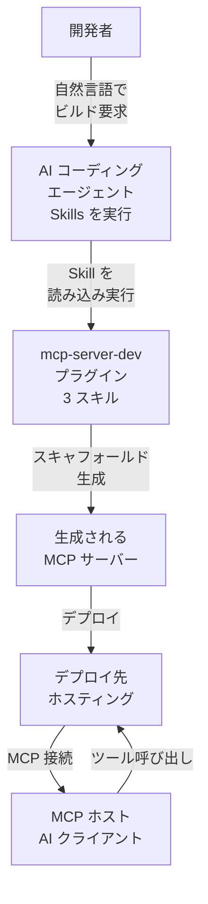
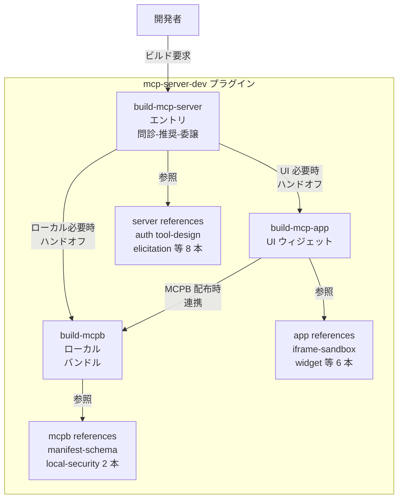
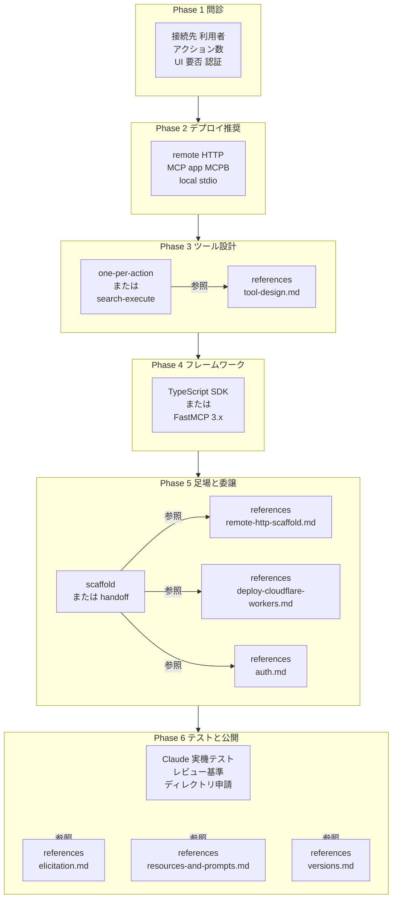
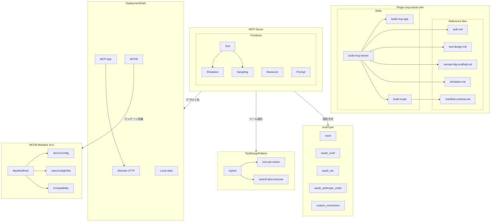
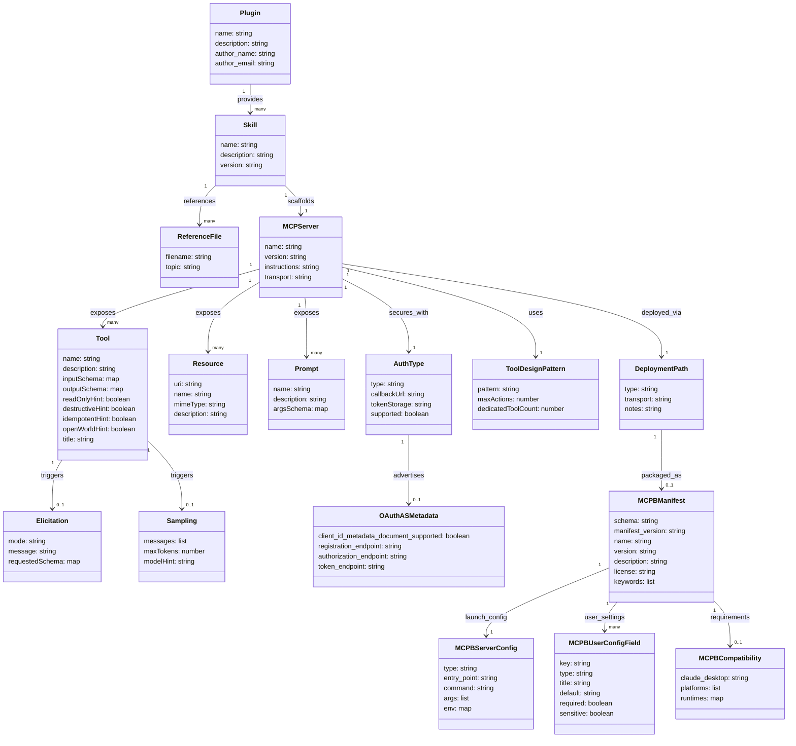

MCP（Model Context Protocol）公式が「Build with Agent Skills」ドキュメントで、MCP サーバー開発を足場化する `mcp-server-dev` プラグインを提示しました。`build-mcp-server` / `build-mcp-app` / `build-mcpb` の 3 つの Agent Skill が、エージェントにユースケースを問診させ、デプロイモデル・認証・配布形態・ツール設計まで決めてからサーバーを scaffold します。

この記事では、MCP サーバー開発が「API を LLM に開くだけ」の作業から、設計対象として扱う開発へと変わる仕組みを、構造とデータの両面から整理します。

> 検証日: 2026-06-21 / 対象: `anthropics/claude-plugins-official` の `mcp-server-dev` プラグイン（3 スキルとも version 0.1.0）・MCPB manifest schema v0.4・MCP spec 2025-11-25

## 概要

### Agent Skills とは

Agent Skills は、AI コーディングエージェントに専門知識とワークフローを与える軽量なオープンフォーマットです。スキルの実体は `SKILL.md` を含むフォルダで、`SKILL.md` は最低限 `name` と `description` のメタデータとエージェントへの手順を持ちます。スクリプト・リファレンス・テンプレートなどの補助ファイルをフォルダに同梱できます。

```
my-skill/
├── SKILL.md          # 必須: メタデータ + 手順
├── scripts/          # 省略可: 実行スクリプト
├── references/       # 省略可: 参照ドキュメント
└── assets/           # 省略可: テンプレート・リソース
```

エージェントはスキルを段階的に読み込みます。Discovery では `name` と `description` だけを読み、タスクと一致したときに `SKILL.md` 全体を読み込み、実行時に `references/` 内のファイルを必要なだけ参照します。この段階的読み込みにより、コンテキストウィンドウの消費を最小化します。

### mcp-server-dev プラグインの位置づけ

`mcp-server-dev` は Anthropic が公開した公式プラグインで、MCP サーバー開発に特化した 3 つのスキルを composing 構造で提供します。

| スキル | 役割 |
|---|---|
| `build-mcp-server` | エントリポイント。ユースケースを問診し、デプロイモデルとツール設計パターンを決定し、専用スキルへルーティングする |
| `build-mcp-app` | チャット内にインラインレンダリングするインタラクティブ UI ウィジェット（フォーム・ピッカー・ダッシュボード）を追加する |
| `build-mcpb` | ローカル stdio サーバーをランタイムごとパッケージし、Node/Python なしでインストールできるようにする |

各スキルは `SKILL.md` と、認証フロー・ツール設計パターン・ウィジェットテンプレート・マニフェストスキーマなどの補助資料を収めた `references/` フォルダを持ちます。スキルファイルはオープンフォーマットに従い、標準を実装する任意のエージェントで動作します。

MCP サーバー開発では、transport の選定・認証フローの設計・配布形態の決定・ツールパターンの選択といった設計判断を早い段階で誤ると、後から大規模な書き直しが必要になります。`mcp-server-dev` はこれらの設計判断をスキルに符号化し、エージェントがユースケースを問診してから最適なサーバーを足場化します。

### 従来手法との対比

| 比較項目 | 従来の手法（手書き / ボイラープレート） | Agent Skills 足場化 |
|---|---|---|
| 設計判断のされ方 | 開発者が個人の経験と勘で決定する | エージェントが問診（接続先・利用者・操作数・認証）に基づいて決定する |
| transport 選定 | ドキュメントを読み、試行錯誤で決める | 問診結果に応じて Remote HTTP / MCP app / MCPB / local stdio の 4 経路から 1 つを推奨する |
| 認証設計 | OAuth / DCR / CIMD の実装方法を都度調べる | `references/auth.md` に符号化された認証フローをエージェントがオンデマンドで参照する |
| 配布形態の決定 | 要件ヒアリングが不十分なまま実装が進む | 「誰が使うか」の問診結果でリモート推奨か MCPB 推奨かを自動決定する |
| 学習コスト | MCP 仕様・Claude 固有制約・各フレームワークを個別に学習する | 問診への回答だけで足場が生成される。仕様知識はスキルに内包されている |

## 特徴

- **3 スキルの composing 構造**: `build-mcp-server` がエントリポイントとして問診と経路決定を担い、必要に応じて `build-mcp-app` または `build-mcpb` へハンドオフします。各スキルは独立して動作しつつ、組み合わせて完全なビルドパスを構成します。
- **Discovery-first（コード生成より問診を優先）**: 接続先・利用者・操作数・UI 要件・認証の 5 点を確認してから足場を生成します。開発序盤の誤った transport 選定による書き直しを防ぎます。
- **4 つのデプロイ経路へのルーティング**: Remote Streamable HTTP（クラウド API ラッパーの既定）・MCP app（リッチ UI が必要な場合）・MCPB（ローカルマシン操作が必要な場合）・Local stdio（プロトタイプ用）を体系化し、問診結果に基づいて 1 つを推奨します。
- **オープンフォーマットでエージェント非依存**: Agent Skills の仕様は公開されており、Claude Code 以外のエージェントでも同一スキルを利用できます。ベンダーロックインなしにスキルを共有・再利用できます。
- **references/ のオンデマンド読み込み**: 認証フロー・ツール設計パターン・ウィジェットテンプレート・マニフェストスキーマなどはメインの `SKILL.md` に含めず `references/` に分割します。エージェントは必要なときだけ参照ファイルを読み込み、コンテキストウィンドウを無駄に消費しません。
- **ツール設計パターンの符号化**: 操作数が少ない場合は 1 操作 1 ツール、操作数が多い大規模 API では search + execute パターンを推奨する知識を組み込んでいます。ツール記述の品質がモデルのコンテキスト使用効率に直結するという観点を初期設計から織り込んでいます。
- **Claude 固有制約への対応**: MCP 仕様は汎用ですが、Claude には追加の認証タイプ・レビュー基準・制限があります。エントリスキルはビルド開始前に Claude のコネクタドキュメント（`https://claude.com/docs/llms-full.txt`）をフェッチし、Claude 固有の制約をガイダンスに反映します。

## 構造

C4 model の 3 段階で、プラグインとエージェントと生成される MCP サーバーの関係を図解します。

### システムコンテキスト図



| 要素名 | 説明 |
|---|---|
| 開発者 | MCP サーバーを構築したい人。自然言語でエージェントに依頼する |
| AI コーディングエージェント | Agent Skills を読み込んで実行する AI ツール |
| mcp-server-dev プラグイン | 3 つのスキルを束ねた公式プラグイン。設計判断からスキャフォールドまでをガイドする |
| 生成される MCP サーバー | プラグインの出力。Remote HTTP サーバーまたは MCPB バンドル |
| デプロイ先ホスティング | MCP サーバーが稼働する実行環境 |
| MCP ホスト | AI アシスタントのクライアントアプリ。MCP サーバーに接続してツールを呼び出す |

### コンテナ図



#### Plugin サブグラフ内の要素

| 要素名 | 説明 |
|---|---|
| build-mcp-server | エントリスキル。開発者を問診してデプロイモデルを決定し、必要に応じて他スキルにハンドオフする |
| build-mcp-app | UI ウィジェット追加に特化したスキル。iframe ベースのインタラクティブコンポーネントを構築する |
| build-mcpb | ローカル stdio サーバーをランタイムごとバンドルするスキル |
| server references | 認証・ツール設計・デプロイ等 8 本の参照ファイル群 |
| app references | CSP・ウィジェットテンプレート・メッセージング等 6 本の参照ファイル群 |
| mcpb references | マニフェストスキーマとセキュリティの 2 本の参照ファイル群 |

#### スキル間のハンドオフ関係

| 要素名 | 説明 |
|---|---|
| build-mcp-server から build-mcp-app | UI ウィジェットが必要と判断した場合にハンドオフ。設計ブリーフを渡して再問診を省く |
| build-mcp-server から build-mcpb | ローカル実行が必要と判断した場合にハンドオフ。設計ブリーフを渡す |
| build-mcp-app から build-mcpb | MCPB 形式でのウィジェット配布が必要な場合に連携。UI 開発とパッケージングを分担する |

### コンポーネント図



#### Phase 別の要素

| 要素名 | 説明 |
|---|---|
| Phase 1 問診 | 接続先・利用者・アクション数・UI 要否・認証方式の 5 点を一括で確認する |
| Phase 2 デプロイ推奨 | 問診結果をもとに 4 つのデプロイモデルから 1 つを推奨する |
| Phase 3 ツール設計 | アクション数に応じて one-per-action か search-execute かを決定する。`tool-design.md` を参照する |
| Phase 4 フレームワーク | TypeScript SDK か FastMCP 3.x かを言語要件をもとに決定する |
| Phase 5 足場と委譲 | remote HTTP / local stdio はインライン scaffold、MCP app / MCPB は専用スキルへ委譲する。`remote-http-scaffold.md`・`deploy-cloudflare-workers.md`・`auth.md` を参照する |
| Phase 6 テストと公開 | Claude 実機テスト・レビュー基準確認・ディレクトリ申請を行う。`elicitation.md`・`resources-and-prompts.md`・`versions.md` を参照する |

## データ

### 概念モデル



#### Plugin と Skills

| 要素名 | 説明 |
|---|---|
| Plugin mcp-server-dev | Anthropic 提供の MCP サーバー開発支援プラグイン全体 |
| build-mcp-server | MCP サーバー開発の入口スキル。デプロイモデルの決定と手順調整を担う |
| build-mcp-app | インタラクティブ UI ウィジェットを追加するスキル |
| build-mcpb | ローカルサーバーをバンドルパッケージ化するスキル |
| Reference files | 各スキルが参照する技術詳細ドキュメント群 |

#### MCP Server と Primitives

| 要素名 | 説明 |
|---|---|
| MCP Server | 生成物である MCP サーバー本体 |
| Tool | Claude が呼び出す関数型プリミティブ |
| Resource | ホストアプリが読み取るドキュメントやファイル型プリミティブ |
| Prompt | ユーザーがスラッシュコマンドで起動するプリミティブ |
| Elicitation | ツール実行中にユーザー入力を要求するプリミティブ |
| Sampling | ツール実行中にホストの LLM 推論を借用するプリミティブ |

#### デプロイ・設計・認証の種別

| 要素名 | 説明 |
|---|---|
| Remote HTTP | クラウドホストで稼働する Streamable HTTP サーバー |
| MCP App | Remote HTTP にインタラクティブ UI ウィジェットを追加した形態 |
| MCPB | ランタイムをバンドルしたローカルサーバーパッケージ |
| Local stdio | npx/uvx で起動するローカル stdio サーバー（プロトタイプ用） |
| one-per-action | アクション 1 つに対しツール 1 つを割り当てるパターン |
| search-plus-execute | 検索ツールと実行ツールの 2 本でカタログ全体を包むパターン |
| hybrid | 頻用アクションを専用ツールに昇格させ、残りを search-plus-execute で包むパターン |
| oauth_cimd | Client ID Metadata Document を用いた OAuth（推奨） |
| oauth_dcr | Dynamic Client Registration を用いた OAuth（後方互換） |
| oauth_anthropic_creds | Anthropic が client_id/secret を保有するパートナー向け OAuth |
| custom_connection | ユーザーが URL/資格情報を接続時に提供するカスタム認証 |
| MCPB Manifest v0.4 | MCPB パッケージの定義ファイル（manifest.json） |

### 情報モデル



| 要素名 | 説明 |
|---|---|
| Plugin | プラグイン本体。name/description/author を持つ |
| Skill | スキルファイル（SKILL.md）。frontmatter に name/description/version を持つ。3 スキルとも version は 0.1.0 |
| ReferenceFile | スキルが参照する技術詳細ドキュメント。topic でテーマを識別する |
| MCPServer | 生成される MCP サーバー。name/version と transport 種別を持つ |
| Tool | サーバーが公開するツールプリミティブ。入出力スキーマと 4 種のアノテーション（readOnlyHint / destructiveHint / idempotentHint / openWorldHint）と title を持つ |
| Resource | サーバーが公開するリソースプリミティブ。URI と MIME タイプで識別する |
| Prompt | スラッシュコマンドで起動するプロンプトプリミティブ。引数スキーマを持つ |
| Elicitation | ツール実行中にユーザー入力を要求するプリミティブ。mode は form または url |
| Sampling | ツール実行中にホスト LLM への推論要求を行うプリミティブ。messages と maxTokens を持つ |
| DeploymentPath | サーバーの稼働形態。type が remote_http / mcp_app / mcpb / local_stdio のいずれか |
| ToolDesignPattern | ツール設計パターン。one-per-action は maxActions が約 15 未満を目安とする |
| AuthType | Claude が対応する認証方式。type が none / oauth_cimd / oauth_dcr / oauth_anthropic_creds / custom_connection のいずれか |
| OAuthASMetadata | OAuth 認可サーバーが公開するメタデータ（RFC 8414）。`client_id_metadata_document_supported: true` で CIMD を広告する |
| MCPBManifest | MCPB パッケージの manifest.json（schema v0.4）。未知フィールドを拒否する |
| MCPBServerConfig | server フィールド。type は node / python / binary のいずれか。args と env で変数置換（`${__dirname}` / `${user_config.KEY}` / `${HOME}`）を使用できる |
| MCPBUserConfigField | user_config の各項目。type は string / number / boolean / directory / file のいずれか。`sensitive: true` で OS キーチェーン保存する |
| MCPBCompatibility | compatibility フィールド。claude_desktop はセマンティックバージョン範囲、platforms は OS 名リスト、runtimes はランタイム名とバージョン範囲のマップ |

## 構築方法

### 前提条件

| 項目 | 要件 |
|---|---|
| Claude Code | 最新版推奨。Elicitation を使う場合は v2.1.76 以上が必須 |
| Node.js | TypeScript SDK を使う場合 |
| Python | FastMCP 3.x を使う場合 |
| Cloudflare アカウント | Cloudflare Workers へデプロイする場合 |

### インストール: Claude Code プラグイン経由

```
/plugin marketplace add anthropics/claude-plugins-official
/plugin install mcp-server-dev
```

インストール後、`build-mcp-server`・`build-mcp-app`・`build-mcpb` の 3 スキルが使えるようになります。

### インストール: 他エージェント向け（clone）

Claude Code 以外のエージェントを使う場合は、スキルディレクトリを直接 clone して配置します。

```bash
git clone https://github.com/anthropics/claude-plugins-official.git
```

`plugins/mcp-server-dev/skills/` 配下の各スキルディレクトリ（`SKILL.md` + `references/`）を、対象エージェントのスキル配置場所にコピーします。スキルファイルは特定のエージェントに依存しないオープンフォーマットです。

## 利用方法

### 必須パラメータ一覧（Discovery フェーズで確定する設計判断）

| パラメータ | 選択肢 | 補足 |
|---|---|---|
| 接続先の種別 | クラウド API / ローカルプロセス / ファイルシステム / ハードウェア | デプロイモデル選択の主因 |
| 利用者の範囲 | 自分のみ / チーム / 不特定多数 | 配布形態に影響 |
| アクション数 | 15 未満 / 数十〜数百 | ツール設計パターンを決定 |
| UI 要否 | 不要 / Elicitation / Widget | Elicitation は Claude Code v2.1.76 以上が必須 |
| 上流サービスの認証方式 | なし / API キー / OAuth 2.0 | OAuth の場合は CIMD または DCR が必要 |

### エージェントへの依頼

スキルインストール後、自然文で依頼します。エントリスキル `build-mcp-server` が自動的に起動します。

```
「MCP サーバーを作って。GitHub Issues API をラップしたい」
```

### Discovery フェーズ: 5 つの設問

エージェントは以下の 5 問を 1 メッセージにまとめて問いかけます。すでに情報が揃っている場合はスキップして推奨に進みます。

1. **接続先** — クラウド API か、ローカルプロセス・ファイルシステム・ハードウェアか
2. **利用者** — 自分・チームのみか、配布するか
3. **アクション数** — 15 未満なら one-per-action、数十〜数百なら search + execute
4. **UI 要否** — Elicitation の平坦なフォームで足りるか、リッチな Widget が要るか
5. **認証** — なし、API キー、OAuth 2.0 の別

### 4 経路への振り分けと Scaffold

#### 経路 1: Remote Streamable-HTTP（デフォルト推奨）

クラウド API をラップする場合の標準経路です。ホストしたサーバーの URL を登録するだけでユーザーが使えます。

**TypeScript SDK（`@modelcontextprotocol/sdk`）の最小サーバー**

```bash
npm install @modelcontextprotocol/sdk zod express
```

```typescript
// src/server.ts
import { McpServer } from "@modelcontextprotocol/sdk/server/mcp.js";
import { StreamableHTTPServerTransport } from "@modelcontextprotocol/sdk/server/streamableHttp.js";
import express from "express";
import { z } from "zod";

const server = new McpServer(
  { name: "my-service", version: "0.1.0" },
  { instructions: "Prefer search_items before calling get_item directly — IDs aren't guessable." },
);

server.registerTool(
  "search_items",
  {
    description: "Search items by keyword. Returns up to `limit` matches ranked by relevance.",
    inputSchema: {
      query: z.string().describe("Search keywords"),
      limit: z.number().int().min(1).max(50).default(10),
    },
    annotations: { readOnlyHint: true },
  },
  async ({ query, limit }) => {
    const results = await upstreamApi.search(query, limit);
    return { content: [{ type: "text", text: JSON.stringify(results, null, 2) }] };
  },
);

const app = express();
app.use(express.json());
app.post("/mcp", async (req, res) => {
  const transport = new StreamableHTTPServerTransport({ sessionIdGenerator: undefined });
  res.on("close", () => transport.close());
  await server.connect(transport);
  await transport.handleRequest(req, res, req.body);
});
app.listen(process.env.PORT ?? 3000);
```

**Python FastMCP 3.x（`fastmcp` on PyPI）の最小サーバー**

FastMCP 3.x は jlowin が開発するパッケージです。公式 `mcp` SDK に同梱の FastMCP 1.0 とは別物です。

```python
# server.py
from fastmcp import FastMCP

mcp = FastMCP(
    name="my-service",
    instructions="Prefer search_items before calling get_item directly — IDs aren't guessable.",
)

@mcp.tool(annotations={"readOnlyHint": True})
def search_items(query: str, limit: int = 10) -> list[dict]:
    """Search items by keyword. Returns up to `limit` matches ranked by relevance."""
    return upstream_api.search(query, limit)

if __name__ == "__main__":
    mcp.run(transport="http", host="0.0.0.0", port=3000)
```

FastMCP は型ヒントから JSON スキーマを自動生成します。docstring がそのまま Claude のコンテキストに入るため、端的な動詞句で書きます。

**Cloudflare Workers への 2 コマンドデプロイ**

`SKILL.md` では Cloudflare Workers が「最速デプロイ経路」と位置づけられています。Workers ネイティブの scaffold を使い、2 コマンドで無料枠の `https://` URL が得られます。これは Express scaffold とは別のランタイムです。

```bash
# Workers ネイティブ scaffold を生成
npm create cloudflare@latest -- my-mcp-server \
  --template=cloudflare/ai/demos/remote-mcp-authless

# テンプレートのツールを差し替えてデプロイ
cd my-mcp-server && npx wrangler deploy
```

上流 API キーは `npx wrangler secret put UPSTREAM_API_KEY` で登録し、`env.UPSTREAM_API_KEY` から読みます。OAuth が必要な場合は `@cloudflare/workers-oauth-provider`（CIMD/DCR エンドポイント・トークン発行・同意 UI を扱う drop-in）を使います。

#### 経路 2: Elicitation（ツール実行中の構造化入力）

ユーザーへの確認・選択・短いフォーム入力が必要な場合に使います。HTML/iframe を一切書かずに済む、スペックネイティブな手法です。サーバーが平坦な JSON スキーマを送り、ホストがネイティブフォームをレンダリングします。

**capability check + fallback の canonical パターン**

```typescript
server.registerTool("delete_all", {
  description: "Delete all items after confirmation",
  inputSchema: {},
}, async ({}, extra) => {
  const caps = server.getClientCapabilities();
  if (caps?.elicitation) {
    const r = await server.elicitInput({
      mode: "form",
      message: "Delete all items? This cannot be undone.",
      requestedSchema: {
        type: "object",
        properties: { confirm: { type: "boolean", title: "Confirm deletion" } },
        required: ["confirm"],
      },
    });
    if (r.action === "accept" && r.content?.confirm) {
      await deleteAll();
      return { content: [{ type: "text", text: "Deleted." }] };
    }
    return { content: [{ type: "text", text: "Cancelled." }] };
  }
  // Fallback: Claude 経由でユーザーに確認を中継させる
  return { content: [{ type: "text", text: "Confirmation required. Please ask the user to confirm, then call this tool again with their answer." }] };
});
```

Elicitation はホストサポートが新しい機能です。必ず `clientCapabilities.elicitation` を確認してから呼び出し、非対応ホスト向けの fallback を用意します。SDK はクライアントが capability を広告していない場合に例外を throw します。パスワード・API キー・トークンの取得には使えません（spec 要件）。

#### 経路 3: MCP App（リッチ UI Widget）

Elicitation の平坦なフォームでは表現できない場合（大量の選択肢スクロール、チャート、ライブ更新など）に使います。エージェントは `build-mcp-app` スキルへ委譲します。Widget は Remote HTTP サーバーと MCPB の両方に対応します。

#### 経路 4: MCPB（バンドル型ローカルサーバー）

サーバーがユーザーのマシン上で動作しなければならない場合（ローカルファイル読み書き、デスクトップアプリ操作、localhost サービスへのアクセス）に使います。エージェントは `build-mcpb` スキルへ委譲します。ユーザーが Node/Python をインストールせずに使えるよう、ランタイムごとバンドルした `.mcpb` アーカイブを生成します。

```bash
# Node の場合のビルドとパック
npx esbuild src/index.ts --bundle --platform=node --outfile=server/index.js
npx @anthropic-ai/mcpb pack
```

`mcpb pack` はディレクトリを zip 化し、`manifest.json` をスキーマに対して検証します。

### フレームワーク選択（TS SDK と FastMCP 3.x）

| フレームワーク | パッケージ | 推奨シナリオ |
|---|---|---|
| Official TypeScript SDK | `@modelcontextprotocol/sdk` | デフォルト。スペックへの追従が最速。新機能が最初に入る |
| FastMCP 3.x | `fastmcp`（PyPI、jlowin 版） | Python を選択したい場合、または Python ライブラリをラップする場合 |

どちらも同一の wire プロトコルを生成します。既存のスタックに合わせて選びます。

### ツール設計の書き方（one-per-action パターン）

ツール説明はそのまま Claude のコンテキストに入ります。プロンプトエンジニアリングとして書きます。

```typescript
server.registerTool(
  "search_issues",
  {
    description:
      "Search issues by keyword across title and body. Returns up to `limit` results ranked by recency. " +
      "Does NOT search comments or PRs — use search_comments / search_prs for those.",
    inputSchema: {
      query: z.string().describe("Keywords to search for. Supports quoted phrases."),
      status: z.enum(["open", "closed", "all"]).default("open")
        .describe("Filter by status. Use 'all' to include closed items."),
      limit: z.number().int().min(1).max(50).default(10)
        .describe("Max results. Hard cap at 50."),
    },
    annotations: { readOnlyHint: true },
  },
  async ({ query, status, limit }) => {
    const results = await api.searchIssues({ query, status, limit });
    return { content: [{ type: "text", text: JSON.stringify(results, null, 2) }] };
  },
);
```

ツール定義の要点は次のとおりです。

- description は「何をするか」「何を返すか」「何をしないか」の 3 点を含めます
- 類似ツールが並ぶ場合、各 description に「こちらではなく X を使う状況」を明記します
- パラメータは `.describe()` で説明文を必ず付けます

ツールアノテーションはホストの権限 UI の挙動を制御します。

| アノテーション | 意味 | ホストの挙動 |
|---|---|---|
| `readOnlyHint: true` | 副作用なし | 自動承認の可能性あり |
| `destructiveHint: true` | 削除・上書きあり | 確認ダイアログを表示 |
| `idempotentHint: true` | 再実行が安全 | 一時エラー時に再試行する可能性あり |
| `openWorldHint: true` | 外部ネットワーク通信あり | ネットワーク使用インジケーターを表示 |

## 運用

### テスト — MCP Inspector

MCP Inspector は npx で即時起動できるインタラクティブなデバッグツールです。

```bash
# ローカル開発中サーバーを検査 (TypeScript)
npx @modelcontextprotocol/inspector node path/to/server/index.js

# ローカル開発中サーバーを検査 (Python)
npx @modelcontextprotocol/inspector uv --directory path/to/server run <package-name>
```

| タブ | 確認内容 |
|---|---|
| Server connection | トランスポート選択・CLI 引数・環境変数 |
| Resources | リソース一覧・MIME タイプ・サブスクリプション動作 |
| Prompts | プロンプトテンプレート・引数・生成メッセージプレビュー |
| Tools | ツール一覧・スキーマ・入力テスト・実行結果 |
| Notifications | サーバーログ・通知履歴 |

### テスト — Claude へのカスタムコネクタ登録

MCP Inspector でプロトコル準拠を確認した後、実際の Claude でエンドツーエンドテストを行います。

- 登録場所: **Settings → Connectors → Add custom connector**
- ローカルサーバーは Cloudflare Tunnel または ngrok で公開 URL を作成してから登録する
- カスタムコネクタはディレクトリ公開コネクタと同一インフラで動作する

```bash
# Cloudflare Tunnel でローカルサーバーを公開 (例: ポート 3000)
cloudflared tunnel --url http://localhost:3000
```

Claude がサーバーを識別する際に送る `clientInfo.name` は、サーフェスによって `"claude-ai"` などに変わります。認可処理にこの値を使ってはなりません。分析や機能検出の補助情報として使います。

### 公開 — Anthropic Directory への Submit

事前準備としてドキュメント URL・プライバシーポリシー URL（ローカルコネクタは必須）・サーバーアイコン・テスト用アカウント資格情報を揃えます。MCP App 提出時はカルーセルスクリーンショット（3〜5 枚、幅 1000px 以上）が必要です。

提出経路はサーバー種別で分かれます。

- リモート MCP サーバー / MCP App: 提出ポータル（Team / Enterprise 組織が必要）
- 個人プラン: MCP directory submission form
- Desktop extension（MCPB）: desktop extension submission form

提出ポータルでは接続情報・ツール同期・リスティング・ユースケース・認証・データ取り扱い・コンプライアンス確認を経て、最終レビューで品質警告が表示されます。問い合わせ先は `mcp-review@anthropic.com` です。

### 公開後の更新

| デプロイモデル | 更新方法 | ユーザーへの反映 |
|---|---|---|
| Remote HTTP | サーバーを再デプロイ（1 箇所） | 次回接続から即時全員反映 |
| MCPB（ローカル） | 新バージョンを配布・ユーザーが再インストール | ユーザーが更新するまで反映されない |
| Local stdio | 新バージョンを配布 | ユーザーが手動で更新する必要あり |

### Plugin + Skills の同梱（推奨）

MCP サーバーと Plugin は補完関係にあり、多くのパートナーが両方を ship しています。MCP サーバーは全サーフェスで動作するツールサーフェスを提供し、Plugin は Skills とコネクタ参照をバンドルした配布パッケージです。Claude Code の marketplace 配布では Plugin が実質的な配布単位になります。一方、他エージェント向けには `SKILL.md` + `references/` のスキルディレクトリを直接配置する経路もあります。

## ベストプラクティス

### デプロイモデル選択指針

```
クラウド API をラップする、または複数ユーザーに配布する
  → Remote HTTP (デフォルト推奨)

ユーザーのローカルファイル・デスクトップアプリ・OS API が必要
  → MCPB

個人用プロトタイプ・チーム内ツール
  → Local stdio (MCPB へのアップグレードパスを保持)
```

Remote HTTP は、ゼロインストールフリクション・1 回デプロイで全ユーザーへ反映・OAuth フローが正常に機能・全サーフェスで動作、という理由でデフォルト推奨です。

### ツール設計

`tool-design.md` はツール数で 3 段階に切り分けます。

| ツール数 | パターン |
|---|---|
| 1〜15 | one-per-action（スイートスポット） |
| 15〜30 | one-per-action のまま運用可。統合できる near-duplicate を監査する |
| 30 以上 | search + execute パターン（2 ツールのみ公開）。上位 3〜5 操作は専用ツールに昇格してもよい |

読み取りと書き込みはツールを分割し、読み取りには `readOnlyHint: true`、破壊的操作には `destructiveHint: true` を設定します。Claude が繰り返しツールを誤用する場合は、サーバーの `instructions` に修正指示を書くのが最も効果的です。

### 認証セキュリティ

- **トークンオーディエンス検証（spec MUST / RFC 8707）**: 署名が有効でも、当該サーバー向けに発行されたトークンでなければ拒否します。`api.other-service.com` 向けのトークンは受け入れてはなりません。
- **トークンパススルーは明示的に禁止**: 受け取ったトークンをそのままアップストリームに転送してはなりません。トークン交換かサーバー自身のクレデンシャルを使います。
- **コールバック URL**（全サーフェス共通）: `https://claude.ai/api/mcp/auth_callback`

| フロー | 推奨度 | 採用基準 |
|---|---|---|
| CIMD（Client ID Metadata Document） | 推奨（spec 2025-11-25 で SHOULD） | ディレクトリ公開・高トラフィック |
| DCR（Dynamic Client Registration） | 後方互換フォールバック（MAY） | CIMD 未対応ホストをサポートする場合 |
| oauth_anthropic_creds | パートナー向け | Anthropic にクライアントシークレットを預ける場合 |

DCR は接続ごとにクライアント登録が走るため、高トラフィックなディレクトリ掲載には CIMD を優先します。

| デプロイ形態 | トークンストレージ |
|---|---|
| Remote、ステートレス | 保存しない（ホストが毎リクエスト bearer を送信） |
| Remote、ステートフル | セッションストア（Redis 等）を MCP セッション ID でキー |
| MCPB / Local | OS キーチェーン（`keytar` on Node、`keyring` on Python）。平文ファイルへの保存は禁止 |

### MCPB ローカルセキュリティ

MCPB はサンドボックスを持ちません。マニフェストに `permissions` ブロックは存在せず、サーバープロセスはユーザー権限でフルアクセスできます。ツールハンドラーが唯一の防壁です。

**パストラバーサル対策（必須）:**

```typescript
import { resolve, relative, isAbsolute } from "node:path";

function safeJoin(root: string, userPath: string): string {
  const full = resolve(root, userPath);
  const rel = relative(root, full);
  if (rel.startsWith("..") || isAbsolute(rel)) {
    throw new Error(`Path escapes root: ${userPath}`);
  }
  return full;
}
```

`String.includes("..")` では不十分です。エンコードやシンボリックリンクを使った迂回に対応するため、必ず `resolve` + `relative` で確認します。

**コマンドインジェクション対策:** シェルを経由した引数渡しを避け、`execFile("git", ["log", branch])` のように argv を配列で構築します。`exec()` / `shell=True` は使いません。

**リソース上限:** ファイル読み取り・ディレクトリ列挙・検索結果など、すべての unbounded 処理に上限を設けます。

### MCP App の Abuse Protection

- エンドポイントにレートリミットと IP ティアリングを実装する
- iframe の CSP を維持する（CDN からのスクリプトインポートはブロックされる）
- 外部リンクは `app.openLink` 経由で開く（`window.open` はサンドボックスでブロックされる）
- 画像は iframe CSP がリモート `img-src` をブロックするため、サーバー側でフェッチして `data:` URL として埋め込む

### バージョン固定の管理

バージョン固定値は時間経過で陳腐化します。`versions.md` の台帳を定期レビューし、コマンドで現在値を確認してから更新します。

```bash
npm view @modelcontextprotocol/ext-apps version
gh api repos/cloudflare/ai/contents/demos/remote-mcp-authless/src/index.ts --jq '.sha'
curl -sI https://raw.githubusercontent.com/anthropics/mcpb/main/schemas/mcpb-manifest-v0.4.schema.json | head -1
```

| 固定値 | 最終確認 |
|---|---|
| `@modelcontextprotocol/ext-apps@1.2.2`（`versions.md` の履歴値。npm 最新は 2026-06-21 時点で `1.7.4`） | 2026-03 |
| Claude Code v2.1.76 以上 for elicitation | 2026-03 |
| MCP spec 2025-11-25 CIMD/DCR status | 2026-03 |
| MCPB manifest schema v0.4 | 2026-03 |

固定値は履歴台帳の値です。scaffold で利用する際は上記コマンドで現在の npm / GitHub 値を確認してから採用します。

## トラブルシューティング

| 症状 | 原因 | 対処 |
|---|---|---|
| Elicitation が例外を throw する | ホストが elicitation capability を広告していない | `getClientCapabilities()` でチェックしてから呼ぶ。非対応時はテキストフォールバックを返す |
| OAuth フローがローカル環境で壊れる | localhost へのリダイレクトがヘッドレス環境やネットワーク制約で失敗する | Remote HTTP サーバーに移行する。必須ならば MCPB + SDK の localhost-redirect ヘルパーを使う |
| 大規模 API を全 tool 化してコンテキストが肥大 | 30 以上のエンドポイントを 1 tool ずつ登録するとモデル性能が低下する | search + execute パターンに切り替える。よく使う 3〜5 操作のみ専用 tool を残す |
| DCR が接続ごとにクライアントを再登録する | DCR は毎回 registration endpoint に POST してクライアントレコードを作成する | CIMD（`client_id_metadata_document_supported: true`）を優先する。DCR は後方互換として残す |
| バージョン固定値が現実と乖離する | scaffold に書いたバージョン文字列が npm / GitHub の実態から離れる | `versions.md` の台帳を定期レビューし、コマンドで現在値を確認してから更新する |
| `clientInfo.name` で動作を分岐している | `clientInfo.name` はサーフェス・経路・リリースで変わる | `clientInfo` は分析・機能検出の参考にとどめ、認可や動作分岐に使わない |
| ディレクトリ審査で tool アノテーション不備を指摘される | Anthropic Directory の必須要件として全 tool に `readOnlyHint`・`destructiveHint`・`title` の 3 つを明示する必要がある | 提出前に MCP Inspector で全 tool のアノテーションを確認する |
| パブリックエンドポイントが悪用される | authless 公開後にスパム・レート超過が発生 | IP ティアリング・レートリミット・リクエスト検証を実装する |
| MCPB でパストラバーサル攻撃が成功する | `String.includes("..")` のみで判定している | `resolve` + `relative` の containment チェックに切り替える |
| `write_file` が意図せず実行される | read/write が同一ツールにまとまりプロンプトインジェクションで呼ばれる | read と write を別ツールに分割し、destructive ツールには elicitation で確認を挟む |
| シークレットがチャット履歴に露出する | ツール結果にトークン・パスワードが含まれている | ツール結果を返す前に redact する。ログにも出力しない |

## まとめ

MCP 公式の `mcp-server-dev` プラグインは、デプロイモデル・ツール設計・認証・配布形態という設計判断を 3 つの Agent Skill に符号化し、エージェントがユースケースを問診してから MCP サーバーを足場化します。MCP サーバー開発は「API を LLM に開く」作業から、4 経路の選択と認証・配布の設計を含む対象へと位置づけが変わりました。

この記事が少しでも参考になった、あるいは改善点などがあれば、ぜひリアクションやコメント、SNSでのシェアをいただけると励みになります！

## 参考リンク

### 一次情報（MCP / Agent Skills 公式）

- [Build with Agent Skills（MCP 公式）](https://modelcontextprotocol.io/docs/develop/build-with-agent-skills)
- [mcp-server-dev プラグイン（GitHub）](https://github.com/anthropics/claude-plugins-official/tree/main/plugins/mcp-server-dev)
- [mcp-server-dev skills ディレクトリ](https://github.com/anthropics/claude-plugins-official/tree/main/plugins/mcp-server-dev/skills)
- [Agent Skills](https://agentskills.io/home)
- [MCPB（GitHub）](https://github.com/modelcontextprotocol/mcpb)

### ツール・テスト

- [MCP Inspector ドキュメント](https://modelcontextprotocol.io/docs/tools/inspector)
- [MCP Inspector（GitHub）](https://github.com/modelcontextprotocol/inspector)

### Claude コネクタ構築

- [Authentication](https://claude.com/docs/connectors/building/authentication)
- [Testing](https://claude.com/docs/connectors/building/testing)
- [Review criteria](https://claude.com/docs/connectors/building/review-criteria)
- [Submission](https://claude.com/docs/connectors/building/submission)
- [What to build](https://claude.com/docs/connectors/building/what-to-build)
