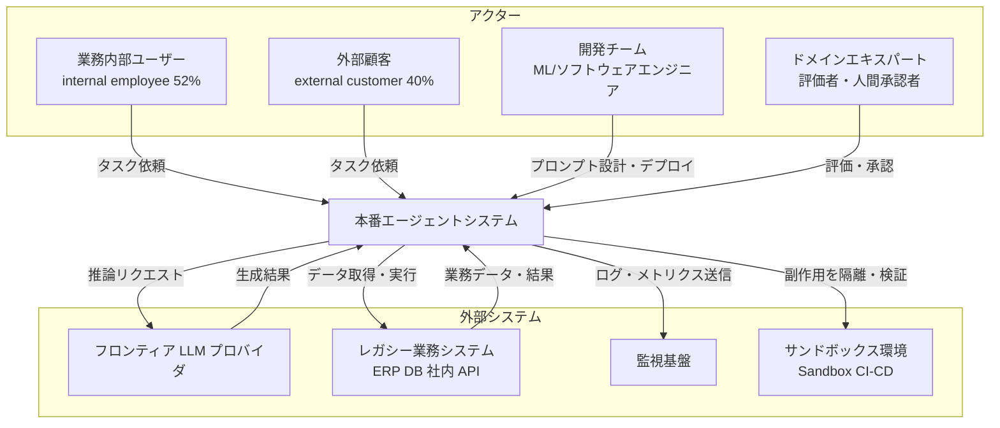
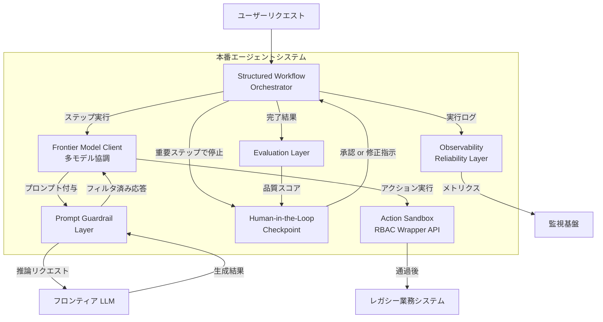
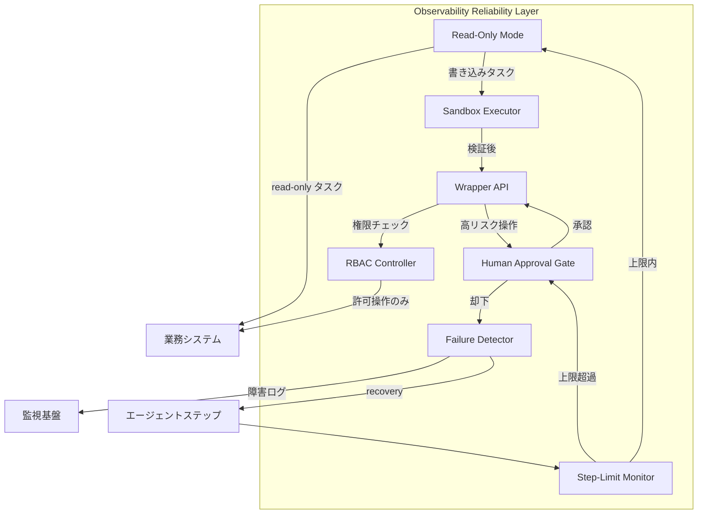
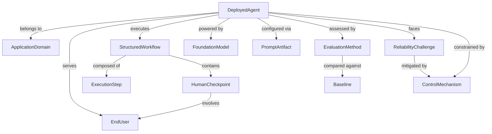
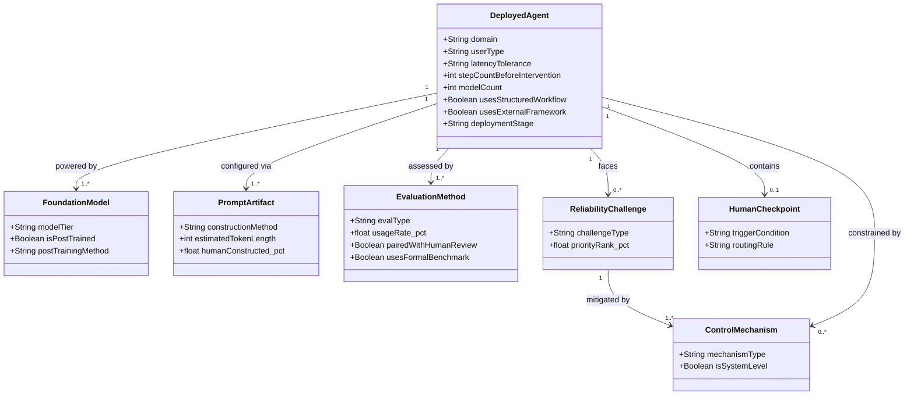

> 対象論文: Melissa Z. Pan, Negar Arabzadeh ほか計25名「Measuring Agents in Production」(arXiv:2512.04123 v4, 2026-06-04)。ICML 2026 Oral 採録。本文 PDF を直接読み、数値を確認したうえでまとめています。検証日: 2026-06-09。

## 概要

「LLM エージェントを本番に出した」という話は増えました。しかし「どんな技術的選択が本番デプロイを成功させているのか」をまとめた知見は、これまで存在しませんでした。

MAP(Measuring Agents in Production)は、本番稼働中の LLM エージェントについて、開発者から一次データを直接集めた初の大規模実証研究です。著者は UC Berkeley の Melissa Z. Pan・Negar Arabzadeh を筆頭とする計 25 名(Intesa Sanpaolo / UIUC / Stanford / IBM Research との共著)。ICML 2026 の Oral Presentation に採録されています。

研究設計は一次データの二刀流です。2025 年 4 月〜11 月にかけて、**20 件の詳細インタビュー**(C01〜C20、production 14 件 / pilot 6 件)と、**306 名の実務者サーベイ**を実施しました。サーベイのうち production / pilot 段階の **86 システム・26 ドメイン**に絞って分析しています。対象システムが扱うユーザは、数百〜100 万超 / 日に及びます。

なお 306 はフィルタ前の総回答数で、主分析対象は 86 deployed systems です。本文に出てくる割合値は各図の回答者数(N=53〜86)に基づくため、設問ごとに母数が異なる点に注意してください。

研究の問いは 4 つです。

| 問い | 内容 |
|---|---|
| RQ1 | 何に使われているか(用途・ドメイン) |
| RQ2 | どう作られているか(モデル選択・アーキ・手法) |
| RQ3 | どう評価しているか |
| RQ4 | 何が難しいか(課題・ボトルネック) |

導かれた結論は、ひとつの一点に収束します。**本番エージェントは「自律性」より「制御可能性」を優先して設計されている**、というものです。

- 68% が人間介入前に 10 ステップ以内しか実行しない(47% は 5 ステップ未満)
- 80%(16/20)が事前定義の structured workflow を採用
- 70%(14/20)が weight tuning(SFT/RL)をせず、既製の frontier モデルへのプロンプトに依存
- 74% が human-in-the-loop 評価に依存し、75% は formal benchmark を持たない

そして **信頼性(reliability)が最大の開発ボトルネック**です。実務者はそれを「モデルを賢くする」ことではなく、read-only モード・sandbox・wrapper API・RBAC・人間承認といった **systems-level design** で解決しています。

著者の中核メッセージは 2 つです。第一に「デプロイ技術は流行の研究手法から乖離している」こと。第二に「human-in-the-loop は克服すべき一時的制約ではなく、意図的な設計原則として扱うべき」ことです。

ただし本記事では、この像が「設計の必然」なのか「2025 年中盤時点の成功サンプルに限った便宜」なのかも検証します(後半の「ベストプラクティス」で反証を統合)。

## 特徴

- **一次データ × 二刀流の収集設計**: 公開記事の二次分析や単一事例報告ではなく、開発チームへの直接インタビュー(深さ)とサーベイ(広さ)を組み合わせます。ドメイン分類には LOTUS による意味集約を用い、人手アノテーションの一致度は Cohen's κ=0.636 と定量的に担保しています。
- **17 設計次元 × 13 Finding × 3 テーマの階層構造**: モデル選択・重み調整・プロンプト構築・アーキテクチャ・評価など 17 次元を横断し、13 の Finding に集約、さらに 3 テーマへ構造化します。数値の羅列でなく、実務者が設計判断に使える形です。
- **「制御可能性のために能力をあえてトレードする」逆説の明示**: 研究では RL がベンチマークを伸ばすのに、本番実務者は frontier モデルへのプロンプトをデフォルトとします。論文は「洗練が足りないからシンプルなのではなく、信頼できる性能と速い開発サイクルのためにシンプルな手法を選んでいる」と明記します。
- **著者自身が限界を強く明示**: §3.3 で、地理的偏り(Americas 中心)・participation bias・time-bounded snapshot(2025-04〜11)を自認し、「fixed prevalence estimate ではなく leading edge の qualitative evidence」と位置づけます。68% / 70% / 74% はすべて開発者の自己申告です。

## 構造

C4 モデル 3 段階を「本番エージェント運用の論理構造」として読み替えて示します。具体企業名でなく役割名・カテゴリ名で表現します。

### システムコンテキスト図

本番エージェントシステムが、どのアクター・外部システムと関係するかを示す最上位ビューです。



| 要素 | 説明 |
|---|---|
| 業務内部ユーザー | エージェントに業務タスクを依頼する社内従業員。internal employees 52.2% |
| 外部顧客 | 外部向けサービス経由で利用する顧客。external customers 40.3% |
| 開発チーム | プロンプト設計・アーキ実装・デプロイ・モデル更新を担うエンジニア |
| ドメインエキスパート | 重要ステップの承認・LLM-as-judge 低信頼出力のレビューを行う専門家 |
| フロンティア LLM プロバイダ | Claude / GPT 等のプロプライエタリ推論 API。17/20 が採用 |
| レガシー業務システム | データ取得・アクション実行の対象。ERP・DB・社内 API |
| 監視基盤 | 実行ログ・失敗検出を受け取る観測プラットフォーム |
| サンドボックス環境 | 副作用を本番から隔離して検証する環境 |

### コンテナ図

本番エージェントシステムの内部を主要コンポーネント単位で分解します。



| コンポーネント | 説明 |
|---|---|
| Structured Workflow Orchestrator | 事前定義タスク列を管理・実行。80%(16/20)が採用 |
| Frontier Model Client | 複数フロンティアモデルへの推論管理。59% が複数モデルを併用 |
| Prompt Guardrail Layer | 人手構築プロンプト(79%)とリスクフィルタを適用 |
| Human-in-the-Loop Checkpoint | 重要ステップで人間の承認・修正を受け取るゲート |
| Evaluation Layer | A/B・LLM-as-judge・人手レビューを組合せた品質評価 |
| Observability Reliability Layer | 実行ログ・失敗検出・runtime monitoring。最大のボトルネック |
| Action Sandbox RBAC Wrapper API | 副作用の隔離・権限 mirror・本番詳細の隠蔽 |

### コンポーネント図

信頼性・制御レイヤーをドリルダウンします。本研究の中核知見が集約される箇所です。



| サブコンポーネント | 説明 |
|---|---|
| Read-Only Mode | 本番への書き込みを構造的に排除。C16 は bug report のみ生成 |
| Sandbox Executor | sandbox 内で実行・テスト後に本番反映。C09 / C11-C12 |
| Wrapper API | production の詳細を隠蔽し公開操作面を限定。C16 |
| RBAC Controller | エージェントがユーザーの既存権限を mirror。C15 |
| Human Approval Gate | 重要ステップでの人間承認。低信頼出力を専門家へルーティング |
| Step-Limit Monitor | 68% が 10 ステップ以内、47% が 5 ステップ未満で介入 |
| Failure Detector | runtime monitoring と障害分類。監視基盤へ転送 |

## データ

### 概念モデル

本番エージェント運用で MAP が明らかにした主要概念の関係マップです。



| エンティティ | 説明 |
|---|---|
| DeployedAgent | 本番/パイロット稼働中の AI エージェント。20 インタビュー + 86 サーベイ |
| ApplicationDomain | 稼働する業務ドメイン。Technology 47.8% / Finance 43.5% / Corporate 42.0% |
| EndUser | serve 対象。92.5% が人間(internal 52% / external 40% / non-human 8%) |
| StructuredWorkflow | 事前定義タスク列と action space。80% 採用 |
| ExecutionStep | ワークフロー内の単一実行単位。68% が <10 steps |
| HumanCheckpoint | 人間の確認・承認を求める介入点 |
| FoundationModel | 駆動する基盤モデル。17/20 が proprietary frontier |
| PromptArtifact | 動作を規定するプロンプト群。79% が人手構築 |
| EvaluationMethod | 性能測定手法。4 種(human-in-loop / LLM-judge / A-B / rule) |
| Baseline | 比較される非エージェント手段。26% はベースライン無し |
| ReliabilityChallenge | 本番稼働を阻む信頼性課題。3 パターン |
| ControlMechanism | リスク低減のシステムレベル設計 |

### 情報モデル

MAP の定量的観察値を属性・多重度として組み込んだクラス図です。論文未記載の属性は推測と注記します。



| エンティティ | 属性 | 論文由来の代表値 |
|---|---|---|
| DeployedAgent | userType | human 92.5% / non-human 7.5%(Fig3, N=67) |
| DeployedAgent | latencyTolerance | minutes 41.5% / no-limit 17.0% / subsecond 7.5%(Fig4, N=53) |
| DeployedAgent | stepCountBeforeIntervention | <5 steps 47% / <10 steps 68%(Fig7a, N=60) |
| DeployedAgent | modelCount | single 41% / multiple 59%(Fig7b) |
| DeployedAgent | usesStructuredWorkflow | true 80%(16/20) |
| DeployedAgent | usesExternalFramework | false(自前実装)85%(17/20) |
| FoundationModel | modelTier | proprietary frontier 17/20 / OSS 3/20 |
| FoundationModel | isPostTrained | false(off-the-shelf)70%(14/20) |
| FoundationModel | postTrainingMethod | SFT 5/20 / RL 1/20(C06) |
| PromptArtifact | constructionMethod | Manual+AI 44.6% / Fully Manual 33.9% / Optimizer 8.9%(Fig6) |
| EvaluationMethod | usageRate_pct | HITL 74.2% / LLM-judge 51.6% / Cross-Ref 41.9% / Rule 38.7%(Fig8) |
| EvaluationMethod | usesFormalBenchmark | false 75% |
| ReliabilityChallenge | priorityRank_pct | Core Technical Performance 38% / compliance 17% / governance 3% |
| HumanCheckpoint | routingRule | 低信頼は expert routing / 高信頼は random sampling 検証 |

## 構築方法

### モデル選定はクローズドソース frontier を起点にする

MAP では 17/20 がクローズドソース frontier モデルを採用します。10 チームが Claude Sonnet 4 / Opus 4.1 か GPT-o3 を明示します。オープンソースは 3/20 に留まり、いずれもコスト制約か規制対応が動機です。

- 選定基準はモデル性能よりも「モデル更新時の堅牢性」と「開発サイクルの速さ」
- 複数モデル協調は 59%。機能要件(タスク種別による分業)と運用制約(コスト・レイテンシ・failover)の両面で設計
- fine-tuning は留保。SFT/RL は 6/20 のみで、再訓練コストと sample efficiency の悪さが忌避理由

```python
# 実装案: タスク種別とコスト/レイテンシ制約で呼び出しモデルを切り替える簡易 router
# 参考: Anthropic "Building Effective Agents" / MAP Finding 6
# 注: 以下のモデル ID は例示です。実際の利用時は最新の提供 ID を確認してください。

MODEL_ROUTING = {
    "high_accuracy": "claude-opus-4-8",    # 精度最優先タスク
    "balanced":      "claude-sonnet-4-6",  # 通常ワークフロー
    "low_cost":      "claude-haiku-4-5",   # 高頻度・軽量サブタスク
}

def route_model(task_type: str, budget_tokens: int) -> str:
    """functional needs + operational constraints で選択"""
    if budget_tokens > 100_000 or task_type == "complex_reasoning":
        return MODEL_ROUTING["high_accuracy"]
    if task_type in ("summarize", "classify", "extract"):
        return MODEL_ROUTING["low_cost"]
    return MODEL_ROUTING["balanced"]
```

### Structured Workflow を事前定義する

MAP の核心知見です。80%(16/20)が事前定義の structured workflow を採用します。open-ended autonomous planning は 1 件のみ(sandbox + CI/CD 検証つき)です。

- scoped action space を最初から絞る
- ステップ数を制限する(68% が 10 ステップ以内、47% が 5 ステップ未満)
- 人間介入点を設計時に確定する(後付けでなく設計の一部)
- 85% が自前実装を選ぶ背景は flexibility・simplicity・security の 3 理由。2 チームが CrewAI から自前へ移行

```python
# 実装案: LangGraph による structured workflow (<10 steps + 人間介入点)
# 参考: LangGraph ドキュメント

from langgraph.graph import StateGraph, END
from typing import TypedDict

class AgentState(TypedDict):
    task: str
    step_count: int
    result: str
    needs_human_review: bool

MAX_AUTO_STEPS = 5  # 47% が <5 steps で人間介入

def execute_step(state: AgentState) -> AgentState:
    state["step_count"] += 1
    # ... LLM 呼び出し + ツール実行(scoped action space 内のみ) ...
    return state

def check_human_needed(state: AgentState) -> str:
    if state["step_count"] >= MAX_AUTO_STEPS or state.get("needs_human_review"):
        return "human_review"
    return "continue"

def human_review_node(state: AgentState) -> AgentState:
    # 実際は Slack 通知 / Web UI / Kestra Pause 等で人間を待つ
    approved = input(f"Step {state['step_count']}: approve? (y/n): ")
    if approved.lower() != "y":
        raise ValueError("Human rejected; halting workflow")
    return state

builder = StateGraph(AgentState)
builder.add_node("execute", execute_step)
builder.add_node("human_review", human_review_node)
builder.set_entry_point("execute")
builder.add_conditional_edges("execute", check_human_needed, {
    "continue": "execute",
    "human_review": "human_review",
})
builder.add_edge("human_review", END)
graph = builder.compile()
```

### プロンプトを人手で構築し guardrail を組み込む

79% が「Manual + AI」か「Fully Manual」です。DSPy 等の自動最適化は 9% に留まります。多くは 500 tokens 未満ですが、外部顧客向けでは 10,000 tokens 超の extensive guardrail を付加します。

```python
# 実装案: read-only 設計 + 信頼性ガードを組み込んだシステムプロンプト

SYSTEM_PROMPT = """
あなたは [タスク説明] を行うアシスタントです。

【制約 — 必ず守ること】
- データベースへの書き込み・削除は一切行わない (read-only モード)
- 個人情報(氏名・メールアドレス・電話番号)を出力しない
- 不確かな情報を断言しない。確証がない場合は「確認が必要です」と返す

【出力フォーマット】
必ず以下の JSON で返すこと:
{
  "result": "<回答>",
  "confidence": 0.0-1.0,
  "sources": ["<根拠URL or DB行>"]
}

【エスカレーション】
confidence < 0.8 または不確かさが残る場合は result に
"[HUMAN_REVIEW_NEEDED] <理由>" を先頭に付けること。
"""
```

### Systems-level の制御機構を組み込む

MAP の最大の実務知見です。**信頼性は「モデルを賢くする」ではなく systems-level design で作る**(Finding 13)。

```python
# 実装案: read-only / sandbox ガードの組み込み (C16 / C09 を一般化)

class ProductionGuard:
    def __init__(self, mode: str = "readonly"):
        self.mode = mode  # "readonly" | "sandbox" | "production"

    def execute_action(self, action_type: str, payload: dict) -> dict:
        WRITE_ACTIONS = {"update", "delete", "create", "deploy"}
        if self.mode == "readonly" and action_type in WRITE_ACTIONS:
            return self._queue_for_human_approval(action_type, payload)
        if self.mode == "sandbox":
            return self._execute_in_sandbox(action_type, payload)
        return self._execute_production(action_type, payload)

    def _queue_for_human_approval(self, action_type, payload):
        notify_human(f"Pending approval: {action_type}", payload)
        return {"status": "pending_approval", "action": action_type}
```

```python
# 実装案: wrapper API + RBAC mirror (C16 / C15 を一般化)

class AgentAPIWrapper:
    def __init__(self, user_role: str, audit_logger):
        self.role = user_role
        self.logger = audit_logger
        self.allowed_actions = RBAC_POLICY.get(user_role, [])  # ロール別許可操作

    def call(self, action: str, params: dict) -> dict:
        if action not in self.allowed_actions:
            self.logger.warn(f"Blocked: {action} for role={self.role}")
            return {"error": "Permission denied"}
        self.logger.info(f"Execute: action={action} role={self.role}")
        return _internal_api_call(action, params)  # 内部 API は外部に非公開

def create_agent_session(user_id: str) -> AgentAPIWrapper:
    return AgentAPIWrapper(user_role=auth_service.get_role(user_id),
                           audit_logger=AuditLogger(user_id=user_id))
```

重要ステップでの人間承認は、アクション結果が遅れて判明するドメインで特に重要です(C01 の保険エージェントは遅延した実害でしか feedback を得られません)。承認不要・承認必要・人間主導の 3 層設計が有効です。

## 利用方法

### 非同期バッチで運用する

66% が分単位以上のレイテンシを許容し、15/20 が非同期動作可能です。本番エージェントの大半は「バックグラウンドで動いて結果を返す」非同期バッチとして運用されます。インタビューでは、分単位で動くエージェントでも人間ベースラインを 10 倍上回ると報告されており、そのため分単位でも価値が出ます。

```python
# 実装案: 非同期バッチ実行パターン (Finding 4)
import asyncio
import anthropic

async def run_agent_batch(tasks: list[str]) -> list[dict]:
    client = anthropic.AsyncAnthropic()
    async def run_single(task: str) -> dict:
        response = await client.messages.create(
            model="claude-sonnet-4-6", max_tokens=4096,
            messages=[{"role": "user", "content": task}],
        )
        return {"task": task, "result": response.content[0].text, "status": "done"}
    results = await asyncio.gather(*[run_single(t) for t in tasks], return_exceptions=True)
    return [r if not isinstance(r, Exception) else {"task": tasks[i], "error": str(r)}
            for i, r in enumerate(results)]
```

### 人間承認フローを設計原則として組み込む

HITL は克服すべき一時的制約ではなく、意図的な設計原則です。74% が human-in-the-loop 評価に依存します。Tier 1(全自動・監査ログのみ)/ Tier 2(エージェント分析→人間検証)/ Tier 3(人間主導)の 3 層を実運用します。承認が来ない場合の挙動も事前に決めます。

```python
# 実装案: Slack を使った人間承認フロー
import uuid
from slack_sdk import WebClient

slack = WebClient(token=SLACK_BOT_TOKEN)

def request_human_approval(action: str, payload: dict, approver_channel: str,
                           timeout_seconds: int = 3600) -> bool:
    """重要ステップで人間承認を要求。タイムアウト 1 時間(分単位レイテンシ許容前提)"""
    request_id = str(uuid.uuid4())
    slack.chat_postMessage(
        channel=approver_channel,
        blocks=[
            {"type": "section", "text": {"type": "mrkdwn",
             "text": f"*承認リクエスト*\nアクション: `{action}`"}},
            {"type": "actions", "elements": [
                {"type": "button", "text": {"type": "plain_text", "text": "承認"},
                 "action_id": "approve", "value": request_id, "style": "primary"},
                {"type": "button", "text": {"type": "plain_text", "text": "拒否"},
                 "action_id": "reject", "value": request_id, "style": "danger"},
            ]},
        ],
    )
    return wait_for_approval(request_id, timeout_seconds)
```

### 評価は LLM-as-judge と human review をペアで回す

サーベイで LLM-as-judge は 51.6% が採用し、インタビュー事例では採用チームが human review と併用していたと報告されています。judge が confidence を score し、低信頼を expert に routing、高信頼の一部を random sampling で検証します。judge と本番エージェントで別のモデルを使うと、自己評価バイアスを避けられます。

```python
# 実装案: LLM-as-judge + human review ペアの評価ループ (C01, C15 を一般化)
import random

def evaluation_loop(results: list[dict], human_review_threshold: float = 0.8,
                    random_sample_rate: float = 0.1) -> list[dict]:
    reviewed = []
    for item in results:
        judge = evaluate_with_judge(item["task"], item["result"])  # {"score","reason","issues"}
        item["judge_score"] = judge["score"]
        if judge["score"] < human_review_threshold:
            item["review_status"] = "expert_required"
            queue_for_expert_review(item)
        elif random.random() < random_sample_rate:
            item["review_status"] = "random_sample"
            queue_for_spot_check(item)
        else:
            item["review_status"] = "auto_approved"
        reviewed.append(item)
    return reviewed
```

### A/B テストと production monitoring で測る

75% が formal benchmark を持たず、A/B テスト・ユーザーフィードバック・production monitoring で評価します。評価が甘いのではなく、実世界タスクでは検証可能なベンチマークを事前に用意できないことが多いためです(保険審査のように結果判明に時間差があります)。

### 自律性を段階的に拡張する

自律性は最初から高く設定せず、観測→改善→自律範囲拡大のサイクルで段階的に広げます。

| Phase | 内容 |
|---|---|
| Phase 1 Supervised | 全アクションに人間承認。エージェントは提案のみ |
| Phase 2 Collaborative | 信頼度スコア閾値超で自動承認、それ以外は人間 |
| Phase 3 Autonomous bounded | scoped action space 内の定型タスクは完全自動。未定義は Phase 2 へ fallback |
| Phase 4 Expanding scope | 安定確認後に action space を漸進拡張。各拡張はコードレビュー同様に承認 |

## 運用

### 信頼性運用は3つの失敗パターンで点検する

MAP が RQ4 で識別した信頼性失敗の 3 パターンは、設計レビューのチェックリストとして使えます。

| パターン | 症状 | 対処 |
|---|---|---|
| 1. 不完全カバレッジ | task-specific test set がゼロ。26% が意味あるベースライン無し | expert-labeled ゴールドセット構築 / monitoring + A/B を評価代替に / 遅延フィードバック領域は中間チェックポイントを独立指標化 |
| 2. 複雑性で増す correctness failure | heterogeneous/multimodal で誤りが非線形に増加 | 複雑性を「ステップ数 × モダリティ数」で定量し HITL を密に / 長尺も短い単位に分割 / judge confidence を閾値フィルタに |
| 3. legacy 統合の制約 | 書き込み権限で規制審査が長期化 | read-only / wrapper API / RBAC ミラー / sandbox で構造的にリスクを切る |

```yaml
# systems-level design チェックリスト (本番投入前)
agent_security_checklist:
  - read_only_default: true          # write は明示許可制
  - wrapper_api_coverage: full       # legacy 詳細を隠蔽
  - rbac_mirror: enabled             # ユーザー権限を動的に反映
  - sandbox_env: pre_prod            # 破壊的操作は sandbox で先行検証
  - confidential_data_scope:
      retrieve: allowed              # 69% が confidential data を取得
      store_external: prohibited     # 外部送信は禁止
      log_retention: audit_only      # 監査証跡のみ保持
```

### 観測可能性は最小セットから始める

75% が formal benchmark なしで評価し、A/B・フィードバック・monitoring が代替です。runtime monitoring の最小セットは次の通りです。

| 指標 | 用途 |
|---|---|
| ステップ数 | 設計値(68% が 10 ステップ以内)から外れた実行を異常検知 |
| latency | 設計上限(分単位)超過をアラート |
| correctness プロキシ | 構造検証・参照整合性・下流エラー率で間接計測 |
| human routing 率 | 急上昇は input 分布変化かモデル drift のシグナル |

```python
# 実装案: production monitoring の基本構造 (Finding 13)
from dataclasses import dataclass

@dataclass
class AgentRunMetrics:
    step_count: int          # 設計上限(例 10)と比較
    wall_time_seconds: float # 分単位許容か秒単位許容か業務要件次第
    judge_score: float       # LLM-as-judge の信頼度
    human_routed: bool       # judge_score < threshold で True
    correctness_proxy: float # 業務固有のプロキシ指標(0-1)

def should_alert(m: AgentRunMetrics) -> bool:
    return (m.step_count > STEP_LIMIT
            or m.wall_time_seconds > LATENCY_LIMIT_SEC
            or m.correctness_proxy < CORRECTNESS_FLOOR)
```

### レイテンシ・セキュリティ運用

レイテンシは 66% が分単位以上を許容し、real-time 必須は 5/20 のみです。ユーザーに即時「受付完了」を返し、非同期 queue へ投入、完了を webhook / push で通知します。latency に余裕がある構成では多段推論やサブエージェント協調(inference-time scaling)が許容されます。

セキュリティは 69% が confidential data を retrieve しますが、論文では security/privacy が主要ボトルネックとして前面化しておらず、systems-level design(read-only 等)で間接的に対応されています。最低限、input/output フィルタ・immutable audit log・scope 制限・prompt injection 対策(instruction と data の構造的分離)を実装します。

## ベストプラクティス

各項目を「誤解 → 反証 → 推奨」で整理します。反証は本記事のために行った追加調査(長尺自律トレンド・著者自身の limitations・fine-tuning の反例)に基づきます。

### 自律性への過信

- **誤解**: エージェントは自律性が高いほど価値が出る。Devin や Claude Code のような長尺タスク実行こそ本番の姿だ。
- **反証**: MAP の本番サンプルでは 68% が人間介入前に最大 10 ステップ、80% が structured workflow です。一方で Devin(Cognition 公式は「PR マージ率が倍増」と公表。34→67% や 50+ ステップという具体値は二次情報で一次未照合)、Claude Sonnet 4.5(30 時間以上の自律実行)、OpenAI Operator(多ステップで test-time scaling)という反証事例も存在します。ただし MAP 著者自身が survivorship bias を明記します(失敗・放棄プロジェクトの分析が欠落)。METR は P50 doubling time を初版(2025-03)で約 7 ヶ月、Time Horizon 1.1(2026-01)で post-2023 約 131 日・post-2024 約 89 日へと加速したと定量化します。
- **推奨**: 今すぐ本番化するなら structured workflow + 明示的 HITL checkpoint で始めます。同時に METR のタスク長指標や実使用ターン長トレンドを追い、「制御志向が合理的でなくなる反転点」を能動的に探します。

### モデル選択

- **誤解**: 一番賢い frontier モデルを 1 つ使えば十分。
- **反証**: 59% が複数モデル協調です。機能要件と運用制約で最適モデルが異なります。ナロータスクでは fine-tuned 小型モデルが精度・コスト・レイテンシで大型プロンプトモデルに勝つ二次報告もあります。
- **推奨**: フロンティアプロンプトをデフォルトにしつつ、ナロータスクは fine-tune を検討します(再訓練コストを予算に織り込む)。routing layer でタスク複雑度に応じて frontier と小型を動的に振り分けます。

### fine-tuning 判断

- **誤解**: fine-tuning は研究者がやるもので、本番プロダクトには不要。
- **反証**: ナロータスクで fine-tuned 小型が大型プロンプトモデルを上回る二次事例があります。2026 の上位システムは DSPy 最適化 + SFT + RL を併用するという報告もあります。FireAct(Chen et al., arXiv:2310.05915)は QA エージェント設定でエージェント fine-tuning が性能・堅牢性を向上させると示します。
- **推奨**: フロンティアプロンプトで始めます(API 変更に再訓練コストゼロで追従)。ナロータスクの fine-tune 検討基準は、タスク定義が固まっている・SLA がプロンプトで達成不可・prompt への感度が高すぎる、のいずれか。RL は verifiable reward があるとき(コーディング・数学)に限ります。

### 評価設計

- **誤解**: 公式 benchmark がなければエージェント品質を評価できない。
- **反証**: 75% が benchmark なしで A/B・フィードバック・monitoring で評価します。74% が human evaluation、52% が LLM-as-judge を補完として使います。
- **推奨**: A/B + monitoring + LLM-judge × human review で十分に回せます。benchmark 構築を本番投入の前提条件にしません。benchmark を作るなら expert-labeled ゴールドセットを少量(100〜500 件)高品質に揃えます。

### framework 選択

- **誤解**: LangChain / LangGraph 等を使えば本番エージェントを速く作れる。
- **反証**: 85% の production 深度のあるインタビュー事例が自前実装で、2 チームが CrewAI から移行しました。サーベイでは 61% が framework 利用ですが、production が深いほど framework を捨てる傾向です。
- **推奨**: PoC・初期開発は framework で速く試作します。本番深化時は abstraction layer がボトルネックや security audit 対象になる前に、core loop の直接実装への移行を計画します。

### 日本固有の論点

日本語圏の記事を見ると、MAP の「HITL = 信頼性確保の技法」を「稟議・承認フローへの接続点」として捉える実装仮説が目立ちます(MAP を引用せず、独立に近い結論へ至っている記事が多い印象です)。

- 稟議・承認フローへの HITL 接続: 金融取引・重要契約・個人情報処理は「エージェントが推薦し人間が承認する」モデルを ERP/ワークフローシステムの既存フローに組み込む
- 監査証跡の設計: 「AI 事業者ガイドライン」第 1.2 版(2026-03 改訂)、JIPDEC「AIエージェントの実用化に向けた論点の整理」(2026-04)に対応し、操作ログを immutable audit log として残す
- コンプライアンス評価軸の統合: LLM-judge の評価項目に「規制条文参照の正確性」「個人情報マスキング確認」を加える
- SIer 受託モデルの責任分界点: 品質保証範囲・人間承認後の責任主体を契約前に明文化する

```yaml
# 日本語圏向け audit log スキーマ例
audit_log_entry:
  timestamp: "ISO8601"
  agent_id: str
  user_id: str               # 操作ユーザー(RBAC ミラーの主体)
  input_sources:
    - source_id: str
      data_classification: "confidential | internal | public"
  output_summary: str
  judge_score: float
  human_review:
    reviewer_id: str
    decision: "approved | rejected | modified"
  compliance_checks:
    - check_name: str
      result: "pass | fail | na"
```

## トラブルシューティング

### モデル更新でワークフローが破損する

- **症状**: プロバイダーのモデル更新後、既存プロンプトや structured workflow が想定外の挙動を示す。
- **原因**: frontier 依存 + SFT/RL 回避(70%)はモデル更新に強い反面、プロンプト仕様の暗黙依存があります。
- **対処**: production ではスナップショットバージョンを明示固定し staging で検証してから切り替えます。最重要出力パターンを 20〜50 件の golden test として保持し regression を検知します。multi-model 構成で primary の挙動が閾値を外れたら secondary にフォールバックします。

### correctness failure が増大し続ける

- **症状**: タスク量増加で failure が増え、judge スコアが低下し、human routing 率が上昇する。
- **原因**: パターン 2 の典型。input 分布ドリフトまたはスコープクリープです。
- **対処**: input 分布をモニタリングし変化を検知します。structured workflow 入口にスコープ判定 classifier を置き、スコープ外を early escalation します。既知ゴールドセットのスコアを定期計測し production と比較してドリフトを切り分けます。

### benchmark がない状態で評価判断が定まらない

- **症状**: 出力品質を何で測るか合意が取れず、リリース判断ができない。
- **原因**: 75% が benchmark なしで運用しており、これは一般的です。ただし「評価の仕組みがない」と「benchmark がない」は別物です。
- **対処**: 段階的評価スタックを組みます。L0(即時 rule-based)/ L1(分単位 LLM-judge confidence)/ L2(日次 random sampling human review)/ L3(週次 A/B・業務 KPI)。human review 結果をラベル化し 50〜100 件で一次 benchmark に育てます。

### 長ステップで劣化する

- **症状**: ステップ数増加で品質が低下し、途中で方向を見失う。
- **原因**: 長尺タスクはエラー蓄積とコンテキスト拡散を起こします。ただし METR が示すように、このボトルネックはモデル能力の向上で緩和されつつあります。
- **対処**: 10 ステップ以内の sub-task に分割し各完了を人間 checkpoint で確認します。sub-task ごとに要約を挟みコンテキストをリセットします。ステップ数と品質の相関を計測し、低下点の手前に HITL を設置します。四半期ごとに設計仮定(短ステップ + HITL)を再評価し反転点を監視します。

### 長時間エージェントの制御を失う

- **症状**: 自前実装でサブエージェントが orphan 化し、停止シグナルが届かず、完了か失敗か判別できない。
- **原因**: 85% が自前実装で、framework の scaffold がない分、観測可能性とエラーハンドリングを自前で実装する必要があります。
- **対処**: heartbeat + timeout で、途絶えたら failed 扱いにして human escalation に回します。3-state exit code(成功 / 失敗 / resume 可能)で冪等再実行を可能にします。audit log の完全性で orphan 復旧時に進捗を確認します。破壊的操作は sandbox で先行実行します。

## まとめ

MAP は、本番 LLM エージェントの設計が「長尺自律・強化学習」という研究の流行から乖離し、短い実行ステップ・人間介入・systems-level design という制御可能性へ寄っていることを、86 システムの一次データで定量化した研究です。一方で長尺自律の本番成功や自律能力の構造的な伸長という反証もあり、この像は「今この時点で合理的な選択」であって、能力向上とともに反転しうる時点固有の像として読むのが妥当です。

この記事が少しでも参考になった、あるいは改善点などがあれば、ぜひリアクションやコメント、SNSでのシェアをいただけると励みになります！

## 参考リンク

- 論文・一次ソース
  - [Measuring Agents in Production (arXiv:2512.04123)](https://arxiv.org/abs/2512.04123)
  - [METR: Measuring AI Ability to Complete Long Tasks](https://metr.org/blog/2025-03-19-measuring-ai-ability-to-complete-long-tasks/)
  - [METR: Time Horizon 1.1](https://metr.org/blog/2026-1-29-time-horizon-1-1/)
  - [Devin Annual Performance Review 2025 (Cognition)](https://cognition.ai/blog/devin-annual-performance-review-2025)
  - [Claude Sonnet 4.5 (Anthropic)](https://www.anthropic.com/news/claude-sonnet-4-5)
  - [Effective harnesses for long-running agents (Anthropic)](https://www.anthropic.com/engineering/effective-harnesses-for-long-running-agents)
  - [Introducing Operator (OpenAI)](https://openai.com/index/introducing-operator/)
  - [Computer-Using Agent (OpenAI)](https://openai.com/index/computer-using-agent/)
  - [FireAct: Toward Language Agent Fine-tuning (arXiv:2310.05915)](https://arxiv.org/abs/2310.05915)
- 公式ドキュメント・設計言説
  - [Building Effective Agents (Anthropic)](https://www.anthropic.com/research/building-effective-agents)
  - [Multi-Agent Research System (Anthropic)](https://www.anthropic.com/engineering/multi-agent-research-system)
  - [LangGraph ドキュメント](https://langchain-ai.github.io/langgraph/)
  - [Slack Bolt for Python](https://slack.dev/bolt-python/)
- 記事・業界調査
  - [LangChain: State of Agent Engineering](https://www.langchain.com/state-of-agent-engineering)
  - [PagerDuty: Agentic AI Survey 2025](https://www.pagerduty.com/resources/ai/reports/agentic-ai-survey-2025/)
  - [Prosus: State of AI Agents 2026 Autonomy is Here](https://www.prosus.com/news-insights/2026/state-of-ai-agents-2026-autonomy-is-here)
  - [Fine-tuned Small Models Beat RAG: The 2026 Economics](https://dev.to/dr_hernani_costa/fine-tuned-small-models-beat-rag-the-2026-economics-171h)
  - [Measuring Agents in Production の日本語紹介 (devneko.jp)](https://devneko.jp/wordpress/?p=7874)
  - [Human-in-the-Loop な AI エージェントを作るためのソフトウェア設計 (Wantedly)](https://sg.wantedly.com/companies/wantedly/post_articles/1026657)
