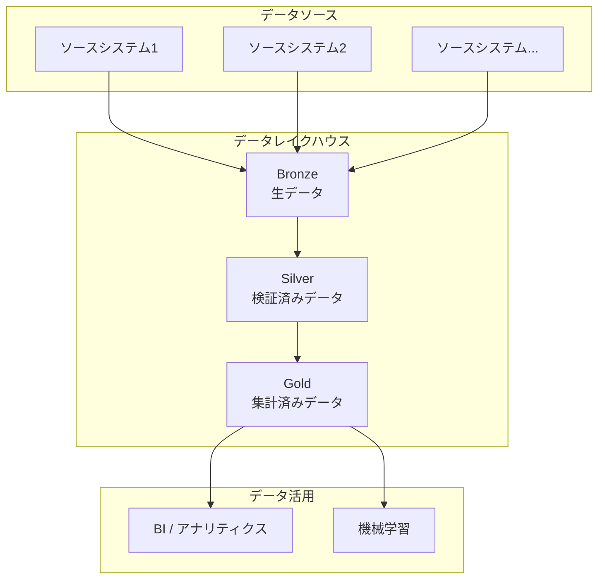
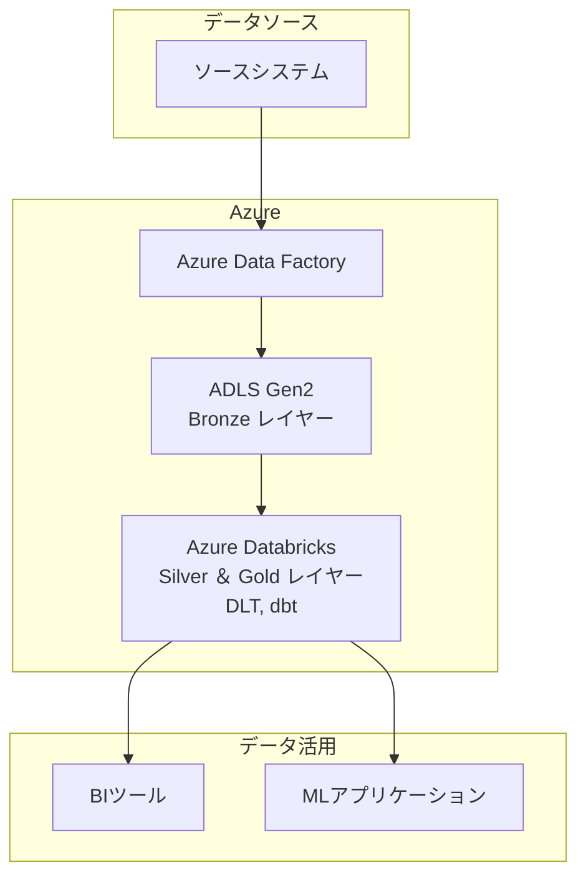
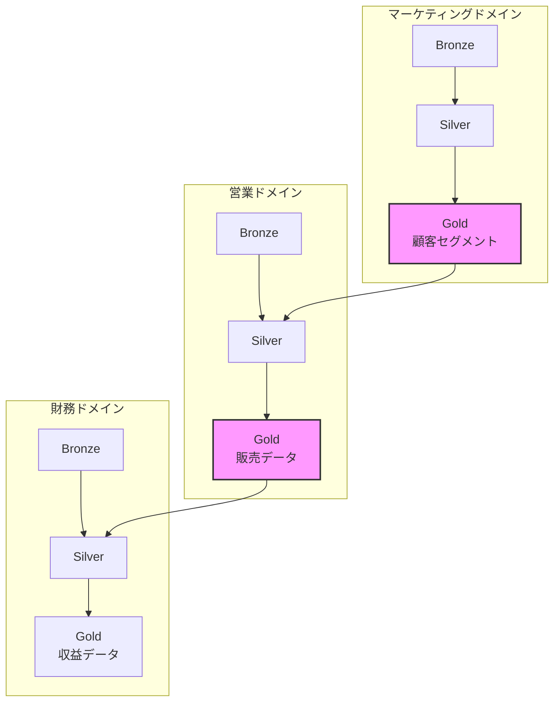
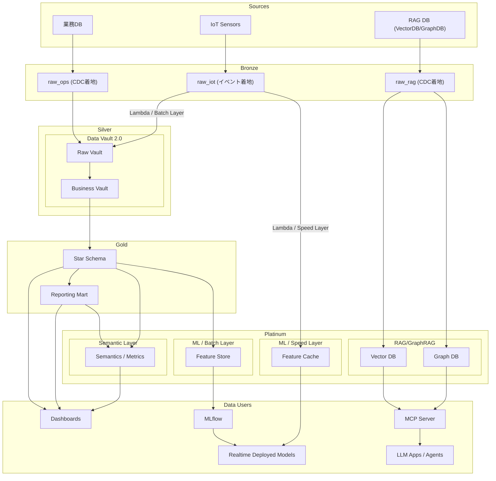

データが企業の新たな資産と呼ばれる現代、その資産の価値を最大限に引き出すためには、データの「信頼性」と「品質」が生命線となります。しかし多くの組織では、データレイクが単なるデータの沼（データスワンプ）と化し、信頼できるインサイトを得るどころか、データを探すことすら困難になっているのが現実ではないでしょうか。

この課題を解決する強力な設計パターンが「メダリオンアーキテクチャ」です。これはデータレイクハウス内のデータを論理的に整理し、**生データ（Bronze）から検証済みデータ（Silver）**、そして **ビジネスに即したデータ（Gold）** へと、品質を段階的に向上させるアプローチです。

この記事では、メダリオンアーキテクチャの基本原則から、その実装を支える最新技術スタック、さらにはAIや分散型組織の要求に応える次世代の姿「メダリオンアーキテクチャ2.0」までを深く掘り下げて解説します。

### 1. メダリオンアーキテクチャの基本原則

メダリオンアーキテクチャは、データを3つの層に分けて管理する「マルチホップ」アーキテクチャです。この多段階の構造が、データの品質を徐々に高め、組織全体で信頼できる単一の情報源（Single Source of Truth）を構築する基盤となります。

| 要素名 | 説明 |
| :--- | :--- |
| **データソース** | 外部の多様なソースシステム |
| **Bronze** | ソースシステムの生データをそのままの状態で取り込む層 |
| **Silver** | Bronze層のデータをクレンジング・統合し、信頼性を高めた層 |
| **Gold** | Silver層のデータを特定のビジネス要件に合わせて集計・加工した層 |
| **データ活用** | Gold層のデータをビジネスインテリジェンス（BI）や機械学習（ML）に利用 |

#### 1.1. 各レイヤーの役割

##### 1.1.1. Bronzeレイヤー（生データ：原石）

Bronzeレイヤーは、すべてのデータジャーニーの出発点です。ここでの主な目的は、**ソースシステムから取得したデータを一切加工せず、そのままの形で保存する**ことです。これにより、後続の処理で問題が発生した際にいつでもオリジナルのデータに立ち返ることができ、完全な監査証跡と思いがけないデータ損失のリスクヘッジを実現します。

  * **目的**:
      * 全ソースデータの履歴アーカイブとして機能
      * 監査可能性の確保と、パイプラインの再処理を容易にする
  * **データ特性**:
      * JSON、CSV、Parquetなど多様な形式が混在
      * データは追記専用で、変更・削除は行わない
      * テーブル構造はソースシステムを忠実に反映
  * **主な操作**:
      * 変換処理は最小限。ロード日時などの来歴管理メタデータを付与する程度
  * **主な利用者**:
      * データパイプライン自身が主な利用者であり、人間が直接クエリすることは稀

##### 1.1.2. Silverレイヤー（検証済みデータ：整形）

Silverレイヤーでは、Bronzeの「原石」を磨き上げ、信頼できるデータへと変換します。複数のソースからのデータを統合し、欠損値の処理や重複排除、データ型の統一といったクレンジングを行うことで、**企業全体の視点で信頼できるクリーンなデータビュー**を構築します。

  * **目的**:
      * 主要なビジネスエンティティ（顧客、製品など）に関する信頼性の高いデータを提供
      * 複数のソースからのデータを照合・統合・クレンジング
  * **データ特性**:
      * Delta LakeやParquetなど、分析に適した表形式
      * 検証済みの非集計データであり、分析の基礎となる
      * 第3正規形やデータヴォルトなどのデータモデリングが開始される
  * **主な操作**:
      * スキーマの強制、NULL値や無効なレコードの処理、データの重複排除と正規化、テーブルの結合など
  * **主な利用者**:
      * データエンジニアやデータサイエンティストが、アドホックな分析や機械学習の特徴量エンジニアリングに利用

##### 1.1.3. Goldレイヤー（集計済みデータ：価値）

Goldレイヤーは、ビジネス価値が最も現れる最終段階です。Silverのクリーンなデータを基に、特定のビジネスニーズに合わせて高度に集計・加工し、**すぐに活用できる「データ製品」**を提供します。BIダッシュボードのデータソースや、レポーティング、MLアプリケーションの入力として最適化されています。

  * **目的**:
      * 特定のビジネス機能や分析要件に特化したデータを提供
      * データから抽出された「知識」や「インサイト」を表現
  * **データ特性**:
      * 読み取り性能を重視した非正規化データ（スタースキーマなど）
      * ビジネスKPIなどが集計済みの状態で格納
  * **主な操作**:
      * プロジェクト固有のビジネスロジック適用、KPIの計算、高度な集計
  * **主な利用者**:
      * ビジネスユーザー、アナリスト、BIツール、MLアプリケーション

#### 1.2. 各レイヤーの特性比較

| 属性 | Bronze (原石層) | Silver (整形層) | Gold (価値層) |
| :--- | :--- | :--- | :--- |
| **目的** | 生データをそのままの状態で取り込み、履歴アーカイブとして保存 | データをクレンジング、統合、検証し、信頼性の高い「企業ビュー」を作成 | 特定のビジネスニーズに合わせて集計・最適化されたデータ製品を提供 |
| **データ形式** | JSON, CSV, Parquet, XML | Delta Lake, Parquet | Delta Lake, Parquet |
| **主要な操作** | メタデータ付与のみ | クレンジング、重複排除、正規化、スキーマ強制、結合、品質チェック | 集計、ビジネスロジック適用、KPI計算、ディメンショナルモデリング |
| **主な利用者** | データパイプライン | データエンジニア、データサイエンティスト、部門アナリスト | ビジネスユーザー、BIツール、MLアプリケーション |
| **モデリング** | ソースシステムを反映 | 第3正規形、Data Vault、Hub Starモデル | スタースキーマ、スノーフレークスキーマ |

#### 1.3. 基本理念

このアーキテクチャは、いくつかの重要な理念に基づいています。

  * **データ完全性の保証**: Delta Lakeのような技術を基盤にすることで、ACID特性（原子性、一貫性、分離性、耐久性）が保証され、処理失敗によるデータ破損を防ぎます。
  * **関心事の分離**: 各レイヤーが明確な役割を持つため、パイプラインの管理と保守が容易になります。これは、データをまずロードし、後から変換するELT（Extract, Load, Transform）パラダイムと親和性が高い考え方です。
  * **スケーラビリティと柔軟性**: 大規模データを効率的に処理できるよう設計されており、バッチ処理とストリーミング処理の両方をサポートします。
  * **ガバナンスと監査可能性**: Bronzeレイヤーに生データを保持することで、完全な履歴監査証跡を提供し、データリネージの追跡やエラー発生時のパイプライン再処理を可能にします。

本質的に、このアーキテクチャは、従来のデータウェアハウス（DWH）が培ってきた階層化の知恵を、現代のデータレイクハウスに合わせて再構築したものと言えるでしょう。

### 2. 実装を支える技術スタック

この強力なアーキテクチャは、それを支えるモダンな技術スタックがあってこそ真価を発揮します。ここでは、Databricksエコシステムを例に、中核となるテクノロジーを紹介します。

#### 2.1. Delta Lake：信頼性の基盤

Delta Lakeは、データレイクにDWHのような信頼性とパフォーマンスをもたらすオープンソースのストレージフォーマットです。メダリオンアーキテクチャの根幹を支えます。

  * **ACIDトランザクション**: データの完全性を維持し、ジョブ失敗による中途半端なデータ書き込みを防ぎます。
  * **スキーマの強制と進化**: Silverレイヤーで意図しないデータがテーブルを破損させるのを防ぎつつ、ソースの変更にも柔軟に対応できます。
  * **タイムトラベル（データバージョニング）**: 過去のデータバージョンを簡単にクエリでき、監査やデバッグを強力に支援します。
  * **パフォーマンス最適化**: ファイル圧縮（`OPTIMIZE`）やZ-Orderingといった機能で、Silver/Goldレイヤーでのクエリを高速化します。

#### 2.2. Delta Live Tables (DLT)：パイプラインの自動化

Delta Live Tables (DLT) は、信頼性の高いデータパイプライン構築を劇的に簡素化する宣言的なフレームワークです。

  * **宣言的フレームワーク**: エンジニアは「どのように処理するか」という手順ではなく、「データの最終形がどうあるべきか」を定義します。DLTがタスクの依存関係解決、オーケストレーション、エラーハンドリングを自動で管理してくれます。
  * **データ品質の強制**: 「期待値（expectations）」という品質ルールをSQLやPythonで簡単に定義できます。例えば、「`user_id`はNULLであってはならない」といったルールを定義し、違反したレコードを破棄または隔離することで、高品質なデータのみを後続レイヤーに渡せます。
  * **バッチとストリーミングの統合**: 同じAPIで両方をシームレスに扱え、パイプラインの実装を大幅に簡素化します。

#### 2.3. Unity Catalog：統合ガバナンス

Unity Catalog (UC) は、すべてのデータとAI資産に対する統合ガバナンスソリューションです。これにより、メダリオンアーキテクチャが単なる処理パターンから、統治された「データ製品」を作成するフレームワークへと昇華します。

  * **一元化されたガバナンス**: メタデータ、アクセス制御、監査、リネージをプラットフォーム全体で一元管理します。
  * **詳細なアクセス制御**: カタログ、スキーマ、テーブルからカラム、行レベルまで、きめ細かな権限設定が可能です。
  * **自動化されたデータリネージ**: カラムレベルのリネージを自動でキャプチャし、データがどのように変換されてきたかを可視化します。
  * **データディスカバリと共有**: データ資産を発見しやすくし、Delta Sharingを介して組織内外との安全なデータ共有を可能にします。

#### 2.4. クラウドでの実装パターン（Azureの例）

Azureのようなクラウドプラットフォームでは、これらのサービスを組み合わせてアーキテクチャを構築します。

| 要素名 | 説明 |
| :--- | :--- |
| **Azure Data Factory** | ソースシステムからBronzeレイヤーへの初期データ移動をオーケストレーション |
| **ADLS Gen2** | Bronzeレイヤーの物理ストレージ |
| **Azure Databricks** | BronzeからSilver、SilverからGoldへの変換を実行（DLTやdbtを利用） |
| **BIツール / MLアプリケーション**| Goldレイヤーのデータを活用 |

これらの技術スタックは、従来のデータレイクが抱えていた信頼性、ガバナンス、管理の複雑さといった課題を正面から解決します。

### 3. メダリオンアーキテクチャ2.0への進化

市場の変化や技術の進歩に伴い、メダリオンアーキテクチャも進化を続けています。ここでは、AI活用や組織の分散化といった新たな要件に対応する、3つの進化形を紹介します。

#### 3.1. Platinumレイヤー：AIのためのデータ準備

Goldレイヤーは人間による分析には最適ですが、AIや機械学習モデルは、より文脈が豊富で実用的なデータを必要とします。そこで登場するのが**Platinumレイヤー**です。

  * **定義**: Goldの先に位置し、データを「AI対応」にするために特化した層です。
  * **目的**: AIが文脈を理解し、因果推論を行い、行動を提案できるような、より高度なデータセットを作成します。
  * **構成要素の例**:
      * **フィーチャーストア**: MLモデル用にキュレーションされた特徴量
      * **ナレッジグラフ**: データエンティティ間の関係性を表現
      * **ベクトル埋め込み**: セマンティック検索や生成AI向け
      * **インサイトリッチなデータセット**: 原因や洞察、潜在的な行動を分析したデータ

#### 3.2. メダリオンメッシュ：分散型データメッシュへの統合

大規模な組織では、中央のデータチームが全パイプラインを管理する中央集権型モデルがボトルネックになりがちです。この課題に応えるのが、データメッシュの思想を取り入れた**メダリオンメッシュ**です。

  * **コンセプト**: 各事業ドメイン（マーケティング、財務など）が、自身のデータに対する所有権を持ち、独立したメダリオンパイプライン（Bronze-Silver-Gold）を構築・管理します。
  * **データ共有**: あるドメインは、他のドメインが公開したGold（またはSilver）の「データ製品」を、自身のパイプラインの新たなソースとして利用できます。これにより、相互に連携するパイプラインの「メッシュ」が形成されます。

このアプローチは、Unity CatalogやDelta Sharingといった技術によって、分散しつつも統治されたデータ共有を実現します。

| 属性 | 中央集権型メダリオン | メダリオンメッシュ |
| :--- | :--- | :--- |
| **データ所有権** | 中央のデータエンジニアリングチーム | 分散型。各ドメインチーム |
| **ガバナンス** | 中央集権的なガバナンスと標準化 | 連合型ガバナンス（中央の標準＋ドメイン固有ポリシー） |
| **パイプライン** | 単一のモノリシックなパイプライン | 相互接続された独立パイプラインのネットワーク |
| **スケーラビリティ**| 垂直スケーリング（チーム拡大がボトルネックに） | 水平スケーリング（ドメイン追加でスケール） |

#### 3.3. ハイブリッドモデリング：Data Vault 2.0との連携

Silverレイヤーのモデリングは第3正規形だけではありません。特に監査性と拡張性が厳しく求められる金融や医療などの業界では、**Data Vault 2.0**を組み合わせるハイブリッドパターンが有効です。

  * **パターン**: Silverレイヤー内にData Vaultモデル（ハブ、リンク、サテライト）を構築します。
      * **Bronze → Silver (Raw Vault)**: ビジネスルールを適用せず、生データをData Vault構造にロード。これにより、完全に監査可能な統合ビューが作成されます。
      * **Silver (Business Vault) → Gold**: Raw Vaultの上にビジネスルールを適用し、分析用のGoldレイヤー（データマート）を構築します。
  * **利点**: メダリオンのシンプルなデータフローと、Data Vaultの高い監査性・拡張性を両立できます。

| アプローチ | 基本原則 | 主な強み | 主な弱み |
| :--- | :--- | :--- | :--- |
| **第3正規形 (3NF)** | データ冗長性を最小化し、整合性を確保 | シンプルで理解しやすい。ストレージ効率が高い | 多数の結合が必要でクエリが複雑化。履歴管理が不得意 |
| **Data Vault 2.0** | ビジネスキー(Hub)、関係(Link)、文脈(Satellite)を分離 | 高い監査性、追跡性、拡張性。ソースシステムの変更に強い | 複雑性が高い。クエリにはBusiness Vaultの構築が必要 |
| **Hub Star Modeling**| HubとStarの概念を一般化し、データを統一的に扱う | Data Vaultよりシンプル。柔軟で増分開発をサポート | 比較的新しいアプローチで、ベストプラクティスが確立途上 |

このように「メダリオン2.0」とは、単一の固定的なアーキテクチャではなく、基本パターンがAI、分散化、高度な監査要件といった多様なニーズに合わせて「専門化」および「ハイブリッド化」した姿なのです。

以前に紹介したSilverレイヤーにData Vault 2.0を利用するパターンに、Platinumレイヤーを追加すると下図になります。

https://zenn.dev/suwash/articles/data_pf_arch_20250902

### 4. 戦略的分析と今後の方向性

#### 4.1. パフォーマンス最適化とコスト管理

多層構造は、パフォーマンスとコストの最適化を常に意識する必要があります。

  * **ストレージ最適化**: Delta Lakeの`OPTIMIZE`によるファイル圧縮と`VACUUM`による古いファイルの削除、適切なパーティショニング戦略が重要です。
  * **コンピュート最適化**: 要件に応じた処理モード（トリガー実行 vs 連続実行）の選択や、拡張オートスケーリング、サーバーレスDLTの活用がコスト効率を高めます。
  * **クエリパフォーマンス**: Goldテーブルへのクエリは、Z-Orderingやマテリアライズドビューを利用して高速化を図ります。

#### 4.2. 課題と代替パターン

メダリオンアーキテクチャは万能ではありません。層を重ねる構造上、どうしても**レイテンシー（遅延）**が発生するため、不正検知のようなリアルタイム性が最優先されるユースケースには不向きです。また、データのコピーを複数保持するため、**ストレージコストと運用オーバーヘッド**が増加する側面もあります。

このような課題に対応するため、イベント駆動型アーキテクチャ（例：Kafka）を組み合わせ、リアルタイム処理用のパスと、バッチ・分析処理用のメダリオンパスを併用するハイブリッドな構成も有効な選択肢となります。

#### 4.3. まとめ

メダリオンアーキテクチャは、厳格な仕様ではなく、組織の成熟度に合わせて進化させることができる柔軟なフレームワークです。成功のためには、段階的なアプローチを推奨します。

1.  **初期段階**: まずはシンプルな中央集権型メダリオンから始めましょう。価値の高いユースケースに集中し、基本的なスキルと成功体験をチームで構築します。
2.  **成長段階**: データが増え、利用者が拡大したら、Unity Catalogによる堅牢なガバナンスを導入します。必要に応じてData Vaultのような高度なモデリングも検討課題となります。
3.  **成熟段階**: 中央集権モデルが組織の成長の足かせになり始めたら、メダリオンメッシュへの移行を評価します。さらに戦略的なAI活用を目指すなら、Platinumレイヤーの導入を検討する時期です。

このアーキテクチャの真の価値は、「**段階的なデータ精錬**」というシンプルで強力な中核原則にあります。実装の詳細は技術と共に進化し続けますが、体系的にデータの品質と信頼性を向上させるというこの考え方は、これからも変わらないデータエンジニアリングの骨格です。

この記事が少しでも参考になった、あるいは改善点などがあれば、ぜひリアクションやコメント、SNSでのシェアをいただけると励みになります！

-----

### 参考リンク

- **概要と基本原則**
  - [What is a Medallion Architecture? - Databricks](https://www.databricks.com/glossary/medallion-architecture)
  - [What is the medallion lakehouse architecture? | Databricks on AWS](https://docs.databricks.com/aws/en/lakehouse/medallion)
  - [メダリオンレイクハウスアーキテクチャとは | Databricks on AWS](https://docs.databricks.com/aws/ja/lakehouse/medallion)
  - [Medallion Architecture 101: How the Three Layers Work (2025) - Chaos Genius](https://www.chaosgenius.io/blog/medallion-architecture/)
  - [What is Databricks Medallion Architecture and Its Working? - Hevo Data](https://hevodata.com/learn/databricks-medallion-architecture/)
  - [[翻訳] Striking Gold: ブロンズ、シルバー、ゴールドの各層のメダリオンアーキテクチャをマスターする - Qiita](https://qiita.com/whata/items/a206798e26081a1aa566)
  - [メダリオンアーキテクチャを1分で解説｜しがないエンジニア - note](https://note.com/koukana/n/n23a1a6bade5e)
  - [A Deep Dive into Medallion Architecture: Key Principles and Practical Implementation](https://medium.com/@devendra631995/a-deep-dive-into-medallion-architecture-key-principles-and-practical-implementation-fd9f85be02f5)
  - [What goes into bronze, silver, and gold layers of a medallion data architecture?](https://lakshmanok.medium.com/what-goes-into-bronze-silver-and-gold-layers-of-a-medallion-data-architecture-4b6fdfb405fc)
  - [Data Design Pattern: Medallion Architecture — is it really a new way of doing things? | by GetInData now Xebia TechTeam - Medium](https://medium.com/getindata-blog/data-design-pattern-medallion-architecture-is-it-really-a-new-way-of-doing-things-6e4af59219ea)

- **実装技術とツール (Delta Lake, DLT, Unity Catalog)**
  - [Building the Medallion Architecture with Delta Lake](https://delta.io/blog/delta-lake-medallion-architecture/)
  - [Databricks DLT: Getting Started Guide](https://www.databricks.com/discover/pages/getting-started-with-delta-live-tables)
  - [Unity Catalog | Databricks](https://www.databricks.com/product/unity-catalog)
  - [Unity Catalog + Medallion Architecture - Databricks Community - 58379](https://community.databricks.com/t5/data-engineering/unity-catalog-medallion-architecture/td-p/58379)
  - [Unity Catalog vs Medallion Architecture! | by R. Ganesh - Medium](https://medium.com/@rganesh0203/unity-catalog-vs-medallion-architecture-fe8017f2765b)
  - [Databricks Unity Catalog: Guide to Streamline Your Data Assets - lakeFS](https://lakefs.io/blog/unity-catalog-guide-streamline-data-assets/)
  - [Databricks Unity Catalog vs. Traditional Data Governance Solutions | Credencys](https://www.credencys.com/wp-content/uploads/2025/02/Databricks-Unity-Catalog-Vs.-Traditional-Data-Governance-Solutions.pdf)
  - [vinodtkn/MedallionArchitecture: Data Engineering: Data Transformation - Medallion Architecture (Bronze, Silver & Gold layer transformations of Data) - GitHub](https://github.com/vinodtkn/MedallionArchitecture)

- **進化形アーキテクチャ (メッシュ, Data Vault, Platinum)**
  - [AIエージェントが真価を発揮するデータ基盤へ -メダリオン ... - Zenn](https://zenn.dev/google_cloud_jp/articles/ff74bf18e44f97)
  - [Creating a Mesh with Medallion - Medium](https://medium.com/@nicoladeseta/creating-a-mesh-with-medallion-3600c65beaa7)
  - [Rise of the Medallion Mesh - YouTube](https://www.youtube.com/watch?v=K7OFKdjwPxE)
  - [Unifying Strengths: How Data Vault and the Medallion Architecture Accelerate Enterprise Data Success - 7Rivers](https://7riversinc.com/insights/unifying-strengths-how-data-vault-and-the-medallion-architecture-accelerate-enterprise-data-success/)
  - [Medallion Architecture vs Data Vault 2.0: Which Should You Choose and When? - Medium](https://medium.com/@valentin.loghin/medallion-architecture-vs-data-vault-2-0-which-should-you-choose-and-when-0c47765a148c)
  - [Hub Star Modeling2.0 for Medallion Architecture - arXiv](https://arxiv.org/pdf/2504.08788)
  - [メダリオンアーキテクチャの新潮流： データ価値を最大化するレイヤー戦略と実践ノウハウ](https://blog.since2020.jp/glossary/medallionarchitecture_glossary/)
  - [Medallion Approach to Data Products: Beyond the Promised “Gold” - Medium](https://medium.com/@community_md101/medallion-approach-to-data-products-beyond-the-promised-gold-113b6dc3e83d)

- **クラウドでの実践 (Azure, AWS, Microsoft Fabric)**
  - [What is the medallion lakehouse architecture? - Azure Databricks - Microsoft Learn](https://learn.microsoft.com/en-us/azure/databricks/lakehouse/medallion)
  - [Implementing a Medallion Architecture Data Pipeline on Azure with ...](https://medium.com/@jushijun/implementing-a-medallion-architecture-data-pipeline-on-azure-with-data-factory-databricks-and-dbt-4b348b89e02a)
  - [Medallion Architecture with Unity Catalog in Azure Databricks | by ...](https://medium.com/@data.ai.oliver/medallion-architecture-with-unity-catalog-in-azure-databricks-ecd2f2de940a)
  - [Data Vault 2.0 using Databricks Lakehouse Architecture on Azure](https://techcommunity.microsoft.com/blog/analyticsonazure/data-vault-2-0-using-databricks-lakehouse-architecture-on-azure/3797493)
  - [Simplifying Data Mesh with Microsoft Fabric's Medallion Architecture - Exult Global](https://www.exultglobal.com/post/simplifying-data-mesh-with-microsoft-fabric-s-medallion-architecture)
  - [Medallion Architecture in Microsoft Fabric : r/MicrosoftFabric - Reddit](https://www.reddit.com/r/MicrosoftFabric/comments/1ikt2wa/medallion_architecture_in_microsoft_fabric/)
  - [Delta Lake & Medallion Architecture for Scalable Data Solutions | AWS in Plain English](https://aws.plainenglish.io/delta-lake-medallion-architecture-for-scalable-data-solutions-3bd84fda9f3c)

- **ベストプラクティスと議論**
  - [Best practices: Delta Lake | Databricks on AWS](https://docs.databricks.com/aws/en/delta/best-practices)
  - [Top 5 Tips to Build Delta Live Tables (DLT) Pipelines Optimally - Databricks Community](https://community.databricks.com/t5/technical-blog/top-5-tips-to-build-delta-live-tables-dlt-pipelines-optimally/ba-p/83871)
  - [Databricks ETL Framework: Best Practices for DLT Pipelines - Royal Cyber](https://www.royalcyber.com/blogs/databricks/databricks-etl-framework-best-practices/)
  - [Databricks Gold Layer Design — Best Practices Explained - DevOps.dev](https://blog.devops.dev/databricks-gold-layer-design-best-practices-explained-cd0f7852a806)
  - [Databricks Cost Optimization: 11 Things You Should Know - overcast blog](https://overcast.blog/11-databricks-cost-optimizations-you-should-know-dccd3138bb1c)
  - [The Case Against Centralized Medallion Architecture | Towards Data Science](https://towardsdatascience.com/the-case-against-centralized-medallion-architecture-297a1e21bc0f)
  - [Medallion Architecture Falls Short in Modern Data Ecosystems? | by Karunakar Kotha](https://medium.com/@KarunaDataArchitect/medallion-architecture-falls-short-in-modern-data-ecosystems-1a30d317f5db)