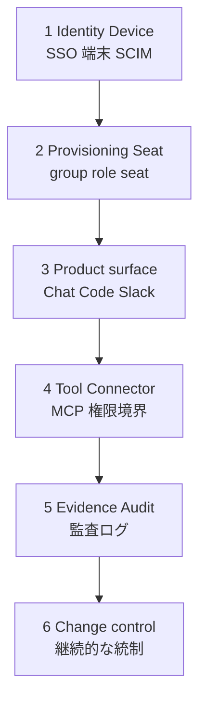

## この記事のねらい

2026年6月、メドピアは Claude Enterprise を全社導入し、正社員・契約社員あわせて約130名へアカウントを配布しました。注目したいのは「全社員に配る」という結果ではなく、Chat、Claude Code、Cowork、Chrome、Slack、MCP、各種コネクタを同じリスクの機能として扱わなかった点です。

この記事では、メドピアの公開事例と Claude / Claude Code の公式ドキュメントをもとに、実装エンジニア、SRE、情シス、セキュリティ担当が全社展開前に決めるべきガバナンス設計を整理します。

想定読者は次のような方です。

- Claude Enterprise を全社導入する前に、認証・端末・権限・監査の順序を整理したい方
- Claude Code をエンジニア以外へ広げるか判断したい方
- MCP や Slack 連携を「便利そうだから」で開けることに不安がある方
- AI エージェントの導入を、セキュリティと利用促進の両方から設計したい方

## 先に結論

Claude Enterprise の全社導入では、最初に「誰にアカウントを配るか」ではなく「AI がどの権限を行使できるか」を分けて考える必要があります。

重要な判断は次の3つです。

| 判断 | 要点 |
|---|---|
| 全社員配布と全機能開放を分ける | Chat は広く配りやすい一方、Claude Code、Chrome、Slack、write connector は別の承認面 |
| Identity / Device を先に閉じる | SSO、Require SSO、端末条件、SCIM、break-glass owner が先行条件 |
| MCP / connector を初日から default-deny に寄せる | 任意 MCP、書込コネクタ、shell 実行を「あとで統制する」設計は危険 |

この順序にすると、低リスクな利用面を早く広げつつ、高自律な利用面だけを段階的に開けられます。

## ガバナンスの全体像

Claude Enterprise / Claude Code の統制は、単一の管理画面設定だけでは完結しません。認証、座席、プロダクト面、外部ツール境界、監査、変更管理を層で分けると、議論が整理しやすくなります。

| レイヤ | 主要な問い | 主な統制機構 | 次へ進む条件 |
|---|---|---|---|
| 1. Identity / Device | 誰が、どの端末から入れるか | SSO、domain capture、Require SSO、Context-Aware Access、break-glass owner | 非SSO経路、BYOD、mobile例外の把握 |
| 2. Provisioning / Seat | 誰にどの製品権限を渡すか | SCIM、group mappings、seat type、custom roles、spend limits | group、role、seat、spend の対応検証 |
| 3. Product surface | Chat、Cowork、Code、Chrome、Slack を誰に開けるか | 職種、訓練、承認フロー、Chrome拡張管理、Slack Members | 自律操作の範囲と代替手段の説明 |
| 4. Tool / Connector boundary | どの外部API、MCP、shell操作を許すか | managed settings、permissions、sandbox、managed-mcp.json、EMA、read/write分離 | default-deny から例外追加できる状態 |
| 5. Evidence / Audit | 後から何が起きたと言えるか | Compliance API、Analytics API、Claude Code OTel、Slack / SaaS logs | セキュリティ調査とFinOpsの問いの分離 |
| 6. Change control | 新機能や仕様変更をどう追うか | admin console review、release review、owner approval | 設計が陳腐化する前提での更新体制 |

この表のポイントは、Claude Code や MCP の議論をいきなり始めないことです。高自律な面を安全に扱うには、Identity / Device と Provisioning / Seat が先に固まっている必要があります。

下位レイヤが固まってから上位レイヤへ進む依存関係は、次のように表せます。

## メドピア事例から見る設計判断

### 1. 「全社員配布」と「全機能開放」を分ける

メドピアは、2026年3月からビジネスサイドを含む5〜10名で PoC を始め、6月に全社配布へ進みました。その過程で、非エンジニアが package install、Git 操作、Node.js 設定を AI に促されるまま進めうることや、Claude ID の有無で業務格差が生じることを確認しています。

ここから得られる教訓は明確です。Chat と Claude Code は、同じ Claude でもリスクの種類が違います。

| 利用面 | 主な特徴 | 初期判断 |
|---|---|---|
| Chat / Projects / Skills | ユーザーが明示的に情報を渡す低自律面 | 全社員配布の候補 |
| Cowork / read connector | SaaS上の情報を読み、業務作業を支援する面 | 非エンジニアも許可制で検討 |
| Claude Code | shell、Git、package manager、file write、MCP tool を扱う面 | エンジニアまたは訓練済み operator に限定 |
| Chrome / Slack / write connector | 認証済みSaaSやチャンネル上で横断操作する面 | 個別 rollout 面として承認 |

この分離は、職種でAI利用を制限するためのものではありません。ユーザー権限で shell、Git、package manager、MCP、コネクタが動く場合、利用者には「どの操作が危険か」を判断する運用知識が必要です。

初期配布は次のように分けると扱いやすくなります。

| 利用者 | 初期配布 | 追加許可の条件 |
|---|---|---|
| 全社員 | Chat / Projects / Skills | SSO、端末、データ取扱い研修の完了 |
| 業務自動化を行う非エンジニア | Cowork / connector read | 対象SaaS、データ分類、書込有無、承認者の明記 |
| エンジニア / SRE | Claude Code | managed policy、MCP default-deny、OTel、危険コマンド方針の検証 |
| 高権限運用者 | Claude Code + write connector / cloud ops | sandbox、hooks、break-glass、監査ログ、ペアレビューの追加 |

### 2. Identity / Device を先に閉じる

メドピアは Google Workspace を IdP とした SAML SSO に加え、Context-Aware Access で会社管理端末のみを許可しました。検証中には、email + OTP login が端末条件を迂回する問題を見つけ、Require SSO を有効化して SSO 以外の経路を封鎖しています。

Claude Enterprise の公式管理者ガイドも、SSO を小規模 pilot で試し、domain capture を有効化し、検証後に SSO を強制する順序を示しています。プロビジョニングも SCIM を推奨し、50〜100人程度の pilot group から2〜4週間 monitor して部門拡大する流れを例示しています。

Claude Code や Slack の議論に入る前に、次の項目を確認します。

- SSO の login、logout、account switch、mobile、desktop app を pilot user で確認したか
- domain capture と Require SSO で email OTP などの迂回経路を閉じたか
- unmanaged device、BYOD、mobile WebView の例外を洗い出したか
- break-glass owner を SCIM group mapping から独立して保全したか
- SCIM group 未所属ユーザー、owner group 不在、email rename、default seat assignment の挙動を staging で試したか

### 3. SCIM / group mappings は加算式の権限付与として設計する

メドピアは `claude-owner`、`claude-admin`、`claude-base`、`claude-cowork`、`claude-code`、seat 用 group など複数の Google group で権限を管理しました。公開事例では、Group Mappings 有効化前に全ユーザーを role group に入れないと削除されうること、owner group が無いと lockout しうること、seat type 未割当が cost trap になること、custom role が加算式であることが落とし穴として挙げられています。

一般化すると、group は「deny のための group」ではなく「capability grant の group」として設計する方が安全です。

| groupの考え方 | 例 | 効果 |
|---|---|---|
| base | 全社員が使う Chat / Projects | 全社配布の土台 |
| code | Claude Code access | shell / Git / file write の許可面を分離 |
| cowork | Cowork / read connector | 非エンジニアの業務自動化を許可制にする単位 |
| admin / owner | 管理者権限 | break-glass と通常運用を分離 |
| seat | seat type / spend | cost trap と意図しない Code access の防止 |

`base` に `code` を足す、`base` に `cowork` を足す、という和集合の mental model に統一すると、棚卸しと監査がしやすくなります。

## 公式統制機構の地図

Claude Enterprise / Claude Code には、認証、権限、MCP、監査のための機構が複数あります。ただし、どれか1つを入れれば安全になるわけではありません。

| 領域 | 公式に使える機構 | 注意点 | 実務判断 |
|---|---|---|---|
| SSO / SCIM | SAML / OIDC SSO、domain capture、SCIM、JIT、manual provisioning | JIT は簡単だが制御が弱い | pilot 後は SCIM + Require SSO を基本線にする |
| Seat / Code access | seat type、usage-based plan の spend limit | Chat-only と Code-enabled を混ぜない | 非Code user は license で止める |
| Server-managed settings | admin console から organization-wide settings 配信 | per-group config 未対応、endpoint-managed settings と merge しない | 広い baseline policy に向く |
| Endpoint-managed settings | MDM、plist、registry、system file | managed source の priority と改ざん耐性を理解する必要 | 管理端末や高リスク repo で検討 |
| First-launch fail-closed | `forceRemoteSettingsRefresh: true` | 未設定だと初回 fetch failure 時に短い無統制窓 | privileged terminal では検討 |
| Permissions | deny、ask、allow、`disableBypassPermissionsMode`、`allowManagedPermissionRulesOnly` | shell の全リスクを pattern だけで表現できない | secrets、git push、cloud ops、package ops から deny |
| Sandboxing | OS-level filesystem / network isolation、`sandbox.failIfUnavailable` | platform、dependency、escape hatch の検証が必要 | auto mode を開く前に検証 |
| MCP | `managed-mcp.json`、`allowedMcpServers`、`deniedMcpServers`、`allowManagedMcpServersOnly` | default では任意 MCP を接続できる | disabled、fixed deployment、approved catalog のどれかにする |
| Connector auth | Enterprise Managed Auth、JWT bearer、IdP policy | beta や IdP capability への依存 | 可能なら user OAuth consent ではなく IdP group / role で制御 |
| Connector tool design | read/write tool separation、destructive hint | Directory review は security audit ではない | write connector は role、service account、audit とセットで許可 |
| Telemetry | Claude Code OTel metrics / logs / traces | raw API bodies や prompt logging は sensitive collection | adoption / cost と security telemetry を分ける |
| Compliance / Analytics | Compliance API、Analytics API | key type、freshness、scope が異なる | security / legal と FinOps の evidence を混同しない |
| Slack / Claude Tag | Members restrictions、service accounts、Agent Proxy、spend limits、Audit page | per-action requester log など不足が残る | connector ではなく独立 rollout として承認 |
| Chrome | browser login state を共有する beta integration | 認証済みSaaSを横断操作できる | sensitive SaaS と irreversible action は approval-based |

この表は、導入前の設計レビューでそのまま使えます。特に Claude Code、MCP、Slack、Chrome は、Chat と同じ承認で開けない方がよい領域です。

## MedPeer の「やらない判断」をどう解釈するか

### 非エンジニアに Claude Code を配らない

メドピアは、初期導入では非エンジニアに Claude Code を配らない判断をしました。これは強い初期デフォルトとして妥当です。

理由は、Claude Code のリスクが「コード生成品質」だけではないためです。Claude Code は、ユーザー権限で shell、Git、package manager、file write、MCP tool を実行できます。利用者が操作境界を理解しないまま進めると、意図しないファイル変更、権限昇格に近い操作、機密情報の露出、外部サービスへの書込が起きます。

ただし、この判断は永久に固定する必要はありません。非エンジニアでも、対象 repository、対象 SaaS、data class、allowed commands、approval flow が限定され、managed settings、sandbox、MCP allowlist、training が整えば、業務自動化 operator として限定利用できます。

重要なのは、「Code を使う人」ではなく「どの権限をどの範囲で行使する人」と定義することです。

### Slack を OFF にする

メドピアは、初期導入で Slack 連携を OFF にしました。理由として、Slack が BYOD から使えること、Slack governance と Claude governance が二重化すること、Claude Code in Slack が非エンジニア Code 不可方針と衝突すること、監査範囲への懸念が挙げられています。

一方で、Claude Tag の公式ドキュメントには、Members restrictions、guest-channel default restrictions、Slack Connect exclusion、service accounts、Agent Proxy の default-deny egress、organization / channel spend limits、Audit page、接続先 SaaS の service-account logs が説明されています。

そのため、「Slack には監査が存在しない」と断定するのは正確ではありません。正確には、Slack / Claude Tag には部分的な統制と監査がありますが、pre-invite channel blocklist、per-user channel spend cap、per-channel responder allowlist、public-channel search disable、Slack session-length enforcement、per-action task requester log などの不足が残ります。

Slack は、次の条件を満たすまで company-wide ON にしない方が安全です。

- Members を organization member または role-based に絞れる
- guest、external、Slack Connect channel の扱いを説明できる
- channel で使う service account の権限と接続先 SaaS logs を監査できる
- organization / channel spend limits を設定できる
- 「誰が依頼したか」を調査するときに、Slack thread、Claude Tag Audit、接続先 logs のどれを見るかを runbook 化している

### Managed settings を見送る

メドピアは、`managed-settings.json` による hooks、MCP 制限、dangerous-command deny を検討しつつ、初期導入では見送りました。理由は、Claude Code 利用者が全社員の一部であること、エンジニアが Mac admin 権限を持ち file tamper できること、検知導入にも費用がかかることです。

この判断は、そのまま一般化しない方がよいです。公式ドキュメントの server-managed settings は、MDM なしで admin console から配信でき、permissions、hooks、OTel env、MCP allow / deny policy などを centrally configure できます。

一方で、per-group configs は未対応で organization-wide uniform policy になります。また、server-managed と endpoint-managed は merge しません。role 差分は seat / group gate で切り、baseline policy は managed settings で配る、という分担が現実的です。

| 条件 | managed settings の扱い |
|---|---|
| Code user が少数で、license / role gate が強く、repo risk が低い | deferral 可能。ただし risk acceptance と再検討 trigger を記録 |
| Code user が増える、SRE / cloud / git write が多い、regulated repo がある | 初日から最低限の server-managed policy |
| 管理端末と MDM がある | endpoint-managed policy + server-managed cloud / web coverage を設計 |
| unmanaged device / cloud sessions がある | server-managed settings を優先し、`forceRemoteSettingsRefresh` を検討 |

### MCP / connector は追加権限として扱う

MCP や connector は、便利な拡張ではなく追加権限です。read-only でも、個人情報、営業秘密、顧客契約、障害情報に触れる場合があります。write tool なら、SaaS上のデータ変更や外部送信も起こりえます。

初期状態は次のいずれかに寄せます。

| 初期状態 | 内容 | 向いている場面 |
|---|---|---|
| MCP disabled | `managed-mcp.json` を空にして全部止める | 初期統制を優先する全社展開 |
| Approved catalog | `allowedMcpServers` + `allowManagedMcpServersOnly: true` で allowlist 運用 | 標準 connector を段階追加したい場合 |
| Fixed deployment | 高リスクチームに `managed-mcp.json` で固定配布し、user-added MCP を禁止 | SRE、cloud ops、regulated repo |
| Write connector exception | owner、role、service account、接続先 audit log、rollback を確認してから許可 | Notion、GitHub、Datadog、Sentry などの書込連携 |

「あとでMCPを統制する」ではなく、「最初から default-deny にして、必要な例外を足す」と考える方が、監査と説明責任を保ちやすくなります。

## 推奨 rollout 順序

### Phase 0: 設計 freeze 前の inventory

最初に、Claude の利用面を機能名ではなく権限で棚卸しします。

| 棚卸し対象 | 見る観点 |
|---|---|
| Product surfaces | Chat、Code、Cowork、Chrome、Slack、Office、connectors、MCP、Skills、plugins |
| 操作種別 | read、write、execute、external-send、human-visible-post |
| データ条件 | データ分類、customer contract、foreign storage、ZDR、data residency |
| 契約・運用条件 | SLA、support escalation、法務・購買確認 |

公開ドキュメントだけでは、個別契約の SLA、ZDR、data residency、業界別条項は確定できません。法務、購買、Anthropic account team の evidence を別に確認します。

### Phase 1: Identity / Device / Provisioning

- SSO を small pilot で検証し、domain capture と Require SSO を有効化する
- CAA / device posture は desktop app、mobile app、browser、OTP、incognito、account switch まで test する
- SCIM group mappings は staging で owner lockout、unassigned member deletion、seat default、email rename を試す
- group は `base` + `code` + `cowork` + `admin` + `seat` のような additive capability model にする

### Phase 2: Seat / Product segmentation

- Chat は全社員、Code は engineer / trained operator、Cowork は approval-based、Chrome / Slack / Office は separate approval とする
- usage-based plan では Code-enabled users の spend limit を低く開始し、Analytics で増枠判断する
- 「Code を使える人」ではなく「shell / Git / package / MCP / write connector を使える人」として training と role を定義する

### Phase 3: Claude Code baseline policy

Claude Code を一人でも配る前に、少なくとも次を決めます。

| 項目 | 初期推奨 |
|---|---|
| permission mode | `default` / `plan` 中心。`bypassPermissions` と unrestricted auto は禁止または管理者承認 |
| deny rules | `.env`、secrets、key paths、broad `git push`、destructive cloud ops、unreviewed package install |
| managed-only | `allowManagedPermissionRulesOnly`、`allowManagedHooksOnly`、`allowManagedMcpServersOnly` を検討 |
| MCP | disabled、approved catalog、fixed deployment のいずれか。no restrictions は避ける |
| sandbox | 高リスク workflow では filesystem / network allowlist と `failIfUnavailable` を検証 |
| telemetry | OTel は aggregate adoption / cost と security tool details を分離。raw body logging は原則 OFF |
| validation | `/status`、`/permissions`、`claude mcp add` negative test、blocked command test を pilot で実施 |

### Phase 4: MCP / Connector rollout

- Connector は read / write と identity を分ける
- read-only でも、個人情報、営業秘密、顧客契約に触れる前提で審査する
- Directory review は connector の security audit ではないため、内部 approval を別に設ける
- Official review criteria と同じく、社内 connector でも catch-all API tool を避ける
- EMA が使える connector は、IdP group / role を source of truth にする

### Phase 5: Observability / Audit

監査は「単一ログを見ればよい」ではなく、答えたい問いごとに evidence を分けます。

| 問い | 主な evidence | 注意点 |
|---|---|---|
| 誰が利用したか | Analytics API、Claude Enterprise admin data | adoption / cost 向けの粒度 |
| 何が変更されたか | Compliance API、接続先 SaaS audit log | content / settings / org events の範囲確認 |
| Claude Code が何を実行したか | Claude Code OTel metrics / logs / traces | tool names と raw bodies の収集範囲を分ける |
| Slack から誰が依頼したか | Slack thread、Claude Tag Audit、service-account logs | per-action requester log の不足を runbook で補う |
| 費用がどこで増えたか | Analytics API、spend limits、channel / org spend | security evidence と FinOps evidence を混同しない |

### Phase 6: Slack / Chrome / Office の個別 rollout

- Slack は Members、guest / external channel、spend、service accounts、Agent Proxy allowed hosts、Audit page、接続先 logs を確認してから selected channel で始める
- Chrome は beta で browser login state を共有するため、authenticated SaaS と irreversible action を approval-based にする
- Office / M365 系は SharePoint / OneDrive の data inventory、sensitive data、foreign storage clauses と一体で判断する

### Phase 7: Continuous governance

- 月次で admin console の新機能、default state、connector list、role capabilities、spend limits を棚卸しする
- 新機能は default ON になりうる前提で検知し、owner、security、corporate IT の triage を設ける
- Policy は完璧版を固定せず、trigger-based に更新する

trigger の例は次のとおりです。

| trigger | 見直す内容 |
|---|---|
| Code users が一定数を超えた | managed settings、OTel、MCP allowlist の必須化 |
| Slack selected-channel pilot が incident-free で一定期間運用できた | 対象 channel や member role の拡大 |
| write connector の要望が増えた | service account、rollback、接続先 audit log の標準化 |
| 新しい Claude 機能が admin console に出た | default state、対象ユーザー、監査可能性の確認 |

## 導入前チェックリスト

### 全社員 Chat 配布前

- [ ] SSO pilot、domain capture、Require SSO が完了している
- [ ] unmanaged device、mobile、OTP、app WebView の例外を試した
- [ ] SCIM group mappings の lockout、deletion、default seat pitfalls を staging で検証した
- [ ] base group、admin / owner group、seat group、product group の責任者が明確である
- [ ] Data retention、no-training、contract、support escalation を法務 / 購買が確認した

### Claude Code 配布前

- [ ] Code-enabled group が Chat-only group と分かれている
- [ ] 非エンジニア例外の training、approver、allowed repo、allowed commands が定義済みである
- [ ] managed settings の採用 / 保留を risk acceptance として記録した
- [ ] MCP の初期状態が disabled、approved catalog、fixed deployment のどれかである
- [ ] dangerous commands、secret paths、Git push、cloud ops、package install の扱いが決まっている
- [ ] OTel、Analytics、Compliance API のどれで何を見るかが runbook 化されている

### Slack / Chrome / write connector 配布前

- [ ] BYOD と device posture 迂回を許容するか、別の条件で補うかを決めた
- [ ] Slack Members、guest、Slack Connect、public-channel search、DM、spend、service account を確認した
- [ ] write connector は dedicated service account、least privilege、接続先 audit log、rollback を確認した
- [ ] Chrome は対象 SaaS と禁止操作を明文化し、extension install を管理している

## 残る不確実性

公開情報だけで確定できない点も残ります。ここを曖昧にしたまま全社展開へ進むと、導入後に法務・監査・セキュリティの論点が戻ってきます。

| 不確実性 | 確認先 |
|---|---|
| 個別契約の SLA、ZDR、data residency、業界別条項 | 法務、購買、Anthropic account team |
| IdP-specific SCIM attribute mapping と role-level connector control | staging org、IdP 管理画面、公式 support |
| Claude Tag / Slack の audit coverage | 実 tenant の Audit page、account team、接続先 SaaS logs |
| メドピア内部の risk appetite、契約条件、admin-console 設定 | 公開情報では断定不可。自社条件で再設計 |

## まとめ

Claude Enterprise の全社導入では、Chat を広く配ることと、Claude Code や MCP、Slack、Chrome などの高自律な面を開けることを分けて設計する必要があります。メドピア事例から学べる実務上の要点は、Identity / Device / Provisioning を先に固め、権限を加算式に分け、MCP と connector を初日から default-deny で扱うことです。

この記事が少しでも参考になった、あるいは改善点などがあれば、ぜひリアクションやコメント、SNSでのシェアをいただけると励みになります！

## 参考リンク

- 公式ドキュメント
  - [Claude Enterprise Administrator Guide](https://claude.com/resources/tutorials/claude-enterprise-administrator-guide)
  - [Configure server-managed settings](https://code.claude.com/docs/en/server-managed-settings)
  - [Claude Code settings](https://code.claude.com/docs/en/settings)
  - [Configure permissions](https://code.claude.com/docs/en/permissions)
  - [Configure the sandboxed Bash tool](https://code.claude.com/docs/en/sandboxing)
  - [Control MCP server access for your organization](https://code.claude.com/docs/en/managed-mcp)
  - [Enterprise Managed Auth for connectors](https://claude.com/docs/connectors/building/enterprise-managed-auth)
  - [Enterprise-Managed Authorization](https://modelcontextprotocol.io/extensions/auth/enterprise-managed-authorization)
  - [Pre-submission checklist](https://claude.com/docs/connectors/building/review-criteria)
  - [Monitoring Claude Code](https://code.claude.com/docs/en/monitoring-usage)
  - [Compliance API](https://platform.claude.com/docs/en/manage-claude/compliance-api)
  - [Analytics APIs](https://platform.claude.com/docs/en/manage-claude/analytics-api)
  - [Restrict where Claude Tag operates](https://claude.com/docs/claude-tag/admins/restrict-access.md)
  - [Security and data handling](https://claude.com/docs/claude-tag/concepts/security-and-data.md)
  - [Review what Claude Tag has done](https://claude.com/docs/claude-tag/admins/audit)
  - [Use Claude Code with Chrome](https://code.claude.com/docs/en/chrome)
- 記事
  - [メドピア、Claude Enterprise全社導入で権限・端末・MCPを段階統制](https://tech.medpeer.co.jp/entry/2026/06/26/122446)
