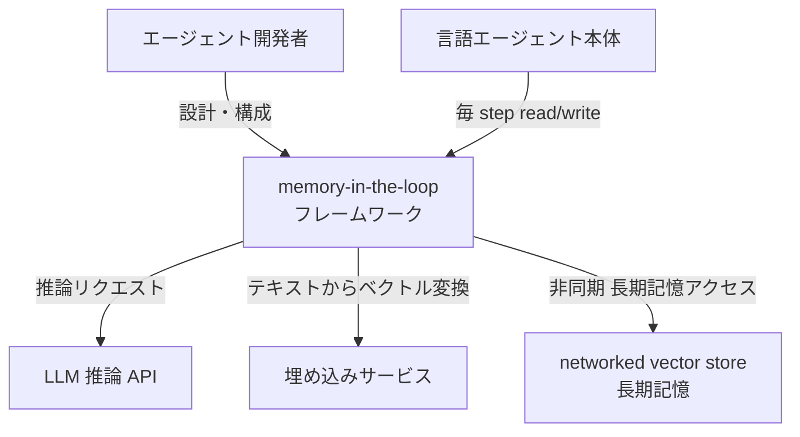
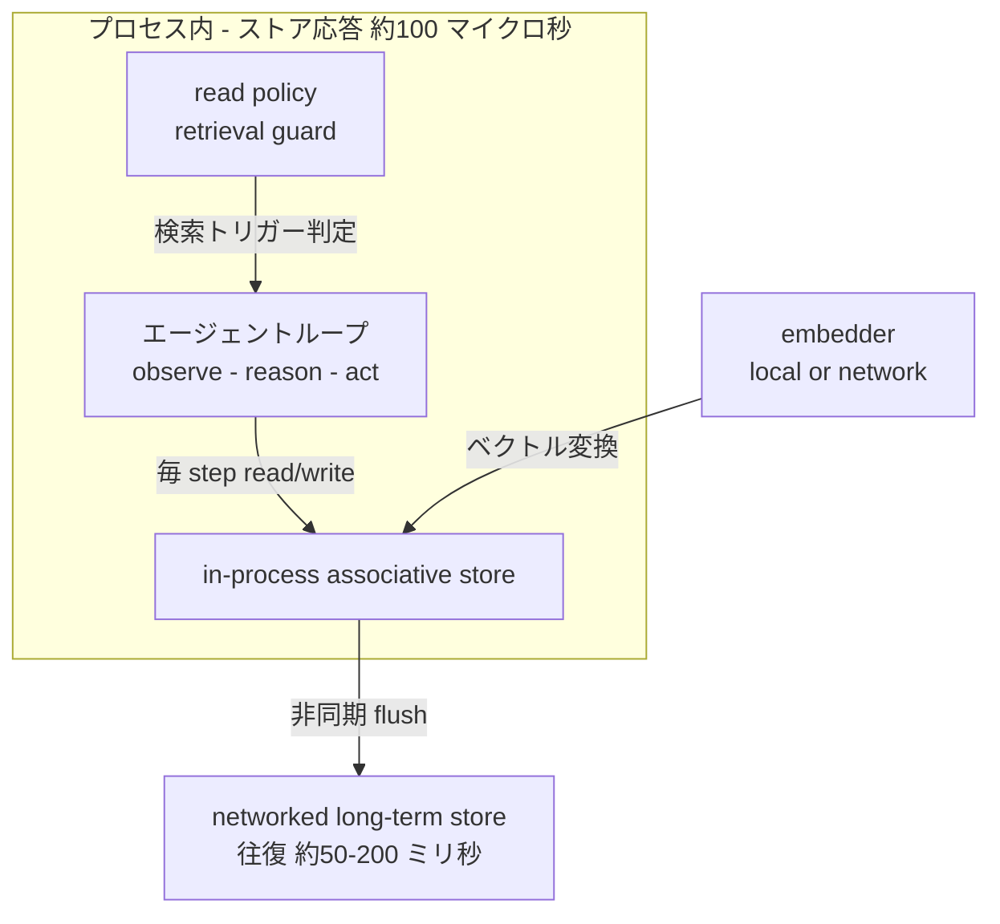
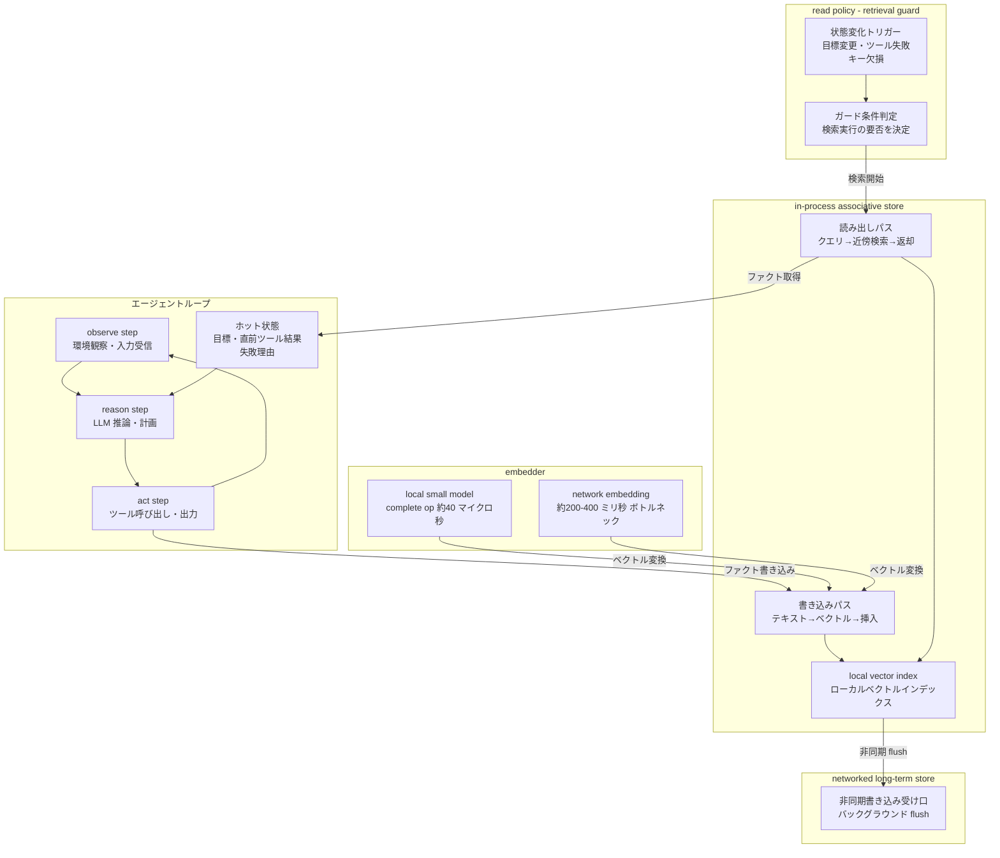
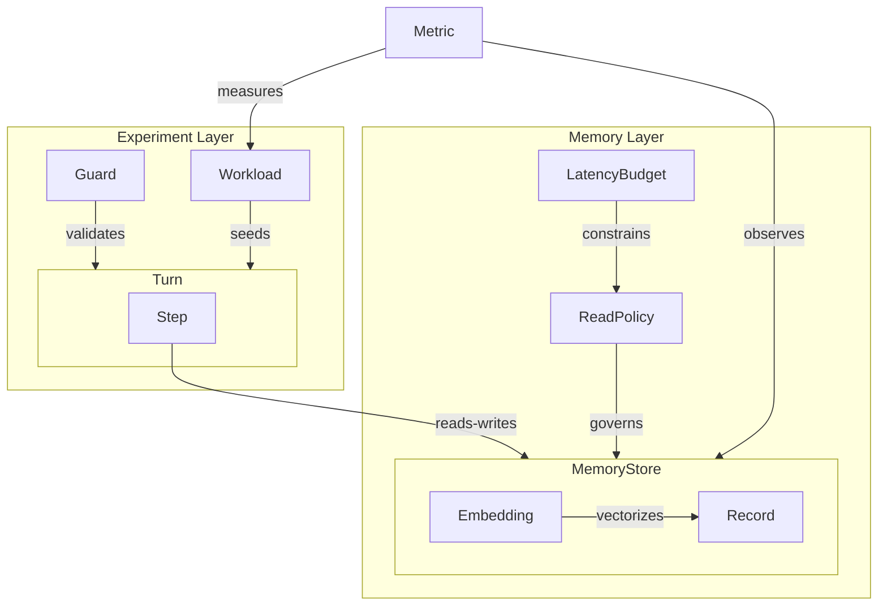
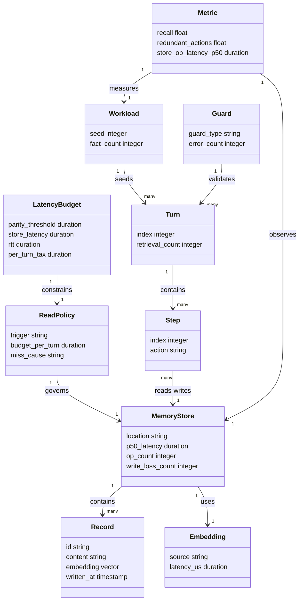

> 対象論文: Memory in the Loop: In-Process Retrieval as Extended Working Memory for Language Agents (arXiv:2607.05690v1, 2026-07-07)
> 分類: エージェントメモリ・コンテキスト設計 / 検証日: 2026-07-12

言語エージェントの memory を「ループの外の DB」から「ループの内側の作業メモリ」へ移す設計論です。C4 は提案フレームワークの論理構造として読み替え、実装は既存 ANN ライブラリと local embedder から補完します。補完箇所は「実装案」と明示します。

## 概要

### 何を主張する論文か

言語エージェントは observe → reason → act のループで動きます。しかし従来の memory は「ループの外」にある外部 DB として扱われ、1 ターンに最大 1 回しか参照されませんでした。本論文はその前提を覆します。

> 中核主張: memory をループの内側に置き、全 step で連想ストア (associative store) を read/write します。context window に触れるのと同じくらい安価にします。

### 障害はレイテンシ

ネットワーク越しの vector store は 50–200 ms で応答します。エージェントが毎 step 参照するとこのコストを繰り返し払います。論文は Yang et al. (2025, SearchAgent-X) を引用し、in-loop retrieval が end-to-end レイテンシを最大 83× 膨張させうると示します。83× は高コストな retrieval 条件で観測された最大値で、store レイテンシと reasoning レイテンシの比に依存します。50–200 ms の一般的な store で常に 83× になるわけではありません。

### 本論文の解法

| 問い | 答え |
|---|---|
| 83× の増幅はなぜ起きるか | store がネットワーク越しにあるから。in-loop パターン自体の問題ではない |
| 解決策は何か | store をプロセス内 (in-process) に置く。応答 ~100 μs = ネットワーク比 3 桁 (約 1,000×) 速い |
| 効果は何か | per-turn の retrieval blocking time = ~1.7 ms (Table 2, S=20・store op ~85 μs 条件)。増幅は消える |

per-turn network tax は `S × RTT` です。S は memory に触れる回数、RTT はラウンドトリップ時間を表します。networked store は retrieval を配給 (rationing) させます。in-process store はこの税を ~0 にし、rationing を不要にします。

論文はこの substrate-level (基盤層) の答えを、serving-layer (提供層) の答えと対立でなく補完と位置づけます (§3)。

### 理論的根拠: 拡張された心と parity principle

論文は Clark and Chalmers (1998) の extended-mind thesis (拡張された心) に接地します。外部リソースが認知の構成要素 (constitutive) になる条件は次の 3 点です。

- 常時利用できる
- 困難なく直接アクセスできる
- retrieval 時に自動的に受容される

本論文は parity principle を工学的基準 = レイテンシ予算 (latency budget) として再解釈します。

- 100 ms の network call はエージェントが consult するツールになる
- 100 μs の in-process store は「常にそこに在る」= parity の基準を満たし、真の extended working memory (拡張された作業メモリ) になる

> レイテンシが store の「心への参加資格 (eligibility)」を決め、ループの配線が実際にそうなるかを決めます。

### 研究の位置づけ

本論文は「memory を cognitive resource として扱う研究系列の第一歩」と自己定義します。確立するのは「memory がいつ推論に参加できるか」です。retrieval が安価になれば毎 step で参加できます。「何を保持すべきか / どう整理すべきか」は次の問いとして残します。

## 特徴

論文が挙げる貢献は 4 点です。

1. retrieval frequency を agent-level design axis へ
   RAG 系の先行研究 (Fan et al., 2024; Hu et al., 2025b) では retrieval frequency は serving-layer のチューニング変数でした。本論文はこれを「per-turn か per-step か」というエージェント設計の軸に昇格させ、store latency がその軸の可動域を決めると示します。

2. parity principle を engineering criterion (latency budget) へ
   哲学的テーゼである Clark & Chalmers の parity principle を「in-process latency が外部 memory を構成的 working memory として eligible にする」という工学的基準に変換します。

3. store latency が task outcome に causal
   per-turn memory budget を固定し store latency だけを変えると、wall-clock だけでなく task outcome 自体が反転 (flip) します。
   - scripted loop guard: redundant actions が 0 → 10/10 に flip
   - real-LLM guard: 単調な用量反応 (monotone dose-response)。in-process 速度で 0.0、+15 ms で 1.4–1.6、+110 ms で 12 中 7.2 redundant
   - 条件: 2 モデル / rung ごとに 5 seeded workloads / exact permutation p = 0.0079 / guard errors ゼロ

4. GPT-5 ladder で end-to-end 実証
   4 モデル構成 (GPT-5 ladder) / bounded window 下で、recall が memory 無し baseline と window-aware run で 0/5 → in-loop memory で 3.6–4.8/5 に改善します。store ops は p50 80–165 μs で稼働します。別途 instructed の restate-every-reply baseline はこの 5-fact タスクで 5/5 に到達しますが、working set とともに per-turn コストが増えスケールしません。観測された miss はすべて agent の read policy が原因で、store が原因のものはゼロでした。

### 先行研究との比較

| 比較項目 | 本論文 (substrate-level, in-process) | SearchAgent-X (serving-layer, systems) | Mem0 (memory-first, out-of-loop) |
|---|---|---|---|
| retrieval をループ内に残すか | 残す — 全 step で read/write | 残す — non-stalling で隠す | 残さない — ターン開始に 1 回だけ |
| レイテンシへの対処 | store を in-process 化 (~100 μs) しコスト自体を消す | 優先度スケジューリングで serving 層で隠す | ループ外に出すことで問題を回避する |
| memory の所在 | プロセス内 (in-process) | 外部 store のまま (latency は serving 層が吸収) | 外部 store (ターン境界でのみアクセス) |
| 想定読者 | エージェント基盤の設計者 / 研究者 | 大規模検索システムの実装者 | アプリ層の開発者 / プロダクトエンジニア |
| 技術的根拠 | per-turn tax = S × RTT → in-process で ~0 | stall-free scheduling で tail latency を削減 | retrieval 回数を 1 に固定してコストを制御 |
| 位置づけ | 対立でなく補完 (§3) | substrate-level 解と補完関係 | retrieval rationing を前提として受容 |

本論文は SearchAgent-X を「対立」でなく「補完」と明示します。serving-layer 解 (Yang et al.) と substrate-level 解は同じ in-loop retrieval を異なる層で支えます。

## 構造

本論文はプロダクト実装を提案しません。C4 の各レベルを「論文が定義するフレームワークの論理構造」として読み替えて図示します。図には論文の論理構造に加えて、記事独自の参照実装案 (ホット状態 / 作業メモリ / 長期記憶の 3 層永続化・非同期 flush・状態変化トリガー) を含みます。論文由来でない要素は各図・各節の注記で区別します。

### システムコンテキスト図



| 要素名 | 説明 |
|---|---|
| エージェント開発者 | フレームワークを設計・構成する人。ストアの配置先・read policy・embedder 方式を選択する |
| 言語エージェント本体 | observe-reason-act ループを実行する主体。毎 step でフレームワークを read/write する |
| memory-in-the-loop フレームワーク | 本論文が定義する対象。in-process store・embedder・read policy を内包する |
| LLM 推論 API | エージェントが reasoning に利用する外部サービス |
| 埋め込みサービス | テキストをベクトルに変換する外部サービス。§7 が指摘するネットワークボトルネックの要因 |
| networked vector store 長期記憶 | ネットワーク越しの長期記憶ストア。往復遅延 50–200 ms。非同期アクセスを想定する |

### コンテナ図

> 下図のレイテンシ層区分 (プロセス内 / ネットワーク境界) は論文の主張に沿います。「ホット状態 / 作業メモリ / 長期記憶」という 3 層の名称は Zenn 解説者による運用翻訳であり、論文本体の直接定義ではありません。



#### プロセス内境界の要素

| 要素名 | 説明 |
|---|---|
| エージェントループ | エージェントの主ループ。observe・reason・act を繰り返す。毎 step で in-process store を read/write できる |
| in-process associative store | プロセス内に置く連想ストア。ストア応答は約 100 μs。ネットワーク regime より 3 桁速い |
| read policy - retrieval guard | 検索を走らせる条件を判定するポリシー。§6 の観測では全ミスの原因はストアでなくここにある |

#### 外部要素

| 要素名 | 説明 |
|---|---|
| embedder - local or network | テキストをベクトルに変換するコンポーネント。ローカルモデルなら約 40 μs、ネットワークサービスなら約 200–400 ms (§7 ボトルネック) |
| networked long-term store | ネットワーク越しの長期記憶ストア。往復 約 50–200 ms。in-process store からの非同期 flush を受ける |

### コンポーネント図



#### エージェントループ

| 要素名 | 説明 |
|---|---|
| observe step | 環境や外部入力を観察し、次のステップへ渡す |
| reason step | LLM を呼び出して推論・計画を実行する |
| act step | ツール呼び出しや出力を行い、ファクトを store へ書き込む |
| ホット状態 | 現在の目標・直前のツール結果・失敗理由をプロセス内で保持する。毎 step 参照できる |

#### in-process associative store

| 要素名 | 説明 |
|---|---|
| 書き込みパス | テキストをベクトルに変換し、近傍インデックスに挿入する経路。§6 では 244 件書き込みでロスゼロ |
| 読み出しパス | クエリを近傍検索にかけ、ファクトを返却する経路。ストア ops は p50 80–165 μs (§6 実測値) |
| local vector index | プロセス内に置く実際のベクトルインデックス。ストア応答 約 100 μs を実現する実体 |

#### read policy - retrieval guard

| 要素名 | 説明 |
|---|---|
| 状態変化トリガー | 目標変更・ツール失敗・ホット状態のキー欠損のいずれかで検索を起動する条件 |
| ガード条件判定 | トリガー条件を評価し、検索実行の要否を決定する。§6 では scripted guard と real-LLM guard の 2 種を検証 |

#### embedder

| 要素名 | 説明 |
|---|---|
| local small model | プロセス内またはローカルに置く小型モデル。complete operation の実測値は 約 40 μs (§7 埋め込みボトルネック解消策) |
| network embedding service | ネットワーク越しの埋め込みサービス。応答 約 200–400 ms。§7 が指摘する残存ボトルネック |

#### networked long-term store

| 要素名 | 説明 |
|---|---|
| 非同期書き込み受け口 | in-process store からバックグラウンドで flush を受け取る接続点。エージェントループのレイテンシに直接影響しない |

## データ

論文に登場する概念をエンティティ化します。構造・配置・設定の詳細は含めません。論文に明示のない属性は「論文記述から推測 / 既存実装から補完」と注記します。

### 概念モデル



| エンティティ | 論文での役割 | 根拠箇所 |
|---|---|---|
| MemoryStore | エージェントが step ごとに read/write する連想ストア。in-process と networked の 2 種が存在する | §1, §3 |
| Record | ストアに書き込まれる事実 (Fact)。244 件の write で損失ゼロ | §1 Contribution (4), §6 |
| Embedding | Record を検索可能にするベクトル表現。local または network の embedder が生成する | §7 |
| LatencyBudget | parity principle を工学基準として再解釈したレイテンシ予算。store が「心の構成要素になれるか」を決める閾値を持つ | §3, §4 |
| ReadPolicy | 何をトリガーに・いくつ read するかの方針。観測された miss はすべてここに起因し、ストアには起因しない | §1 Contribution (4), §6 |
| Turn | 1 回のユーザーまたは環境とのインタラクション。per-turn retrieval frequency の粒度 | §1, §3 |
| Step | Turn 内の 1 回の推論反復 (LLM call)。per-step retrieval frequency の粒度 | §1, §3 |
| Guard | ループの出力を評価する番人。scripted 版と real-LLM 版の 2 種が実験に用いられる | §5, §6 |
| Workload | 実験で使われる seed 付きタスクセット。ラングごとに 5 件のシード済み workload を使用 | §6 |
| Metric | タスク成果・ストア性能の測定値。recall / redundant actions / store op latency が主指標 | §6 |

### 情報モデル



#### MemoryStore

| 属性 | 型 | 論文裏付け値 | 備考 |
|---|---|---|---|
| location | string | `in_process` / `networked` | §1, §3。2 つのレジームを論文が明示 |
| p50_latency | duration | in-process: 80–165 μs (§6 live ops) / networked: 50–200 ms | §1, §6 |
| op_count | integer | 244 writes (実験全体) | §1 Contribution (4) |
| write_loss_count | integer | 0 | §1「store は 244 writes で 1 件も fact を失わなかった」 |

#### Record

| 属性 | 型 | 論文裏付け / 補完 | 備考 |
|---|---|---|---|
| id | string | 論文記述から推測 / 既存実装から補完 | ストア実装の標準的な識別子。§7 の id 衝突対策で重要 |
| content | string | 論文に明示。エージェントが書き込む fact 本文 | §1, §6 |
| embedding | vector | §7 に明示。Embedding エンティティが生成 | Embedding.source に依存 |
| written_at | timestamp | 論文記述から推測 / 既存実装から補完 | write のタイミング記録 |

#### Embedding

| 属性 | 型 | 論文裏付け値 | 備考 |
|---|---|---|---|
| source | string | `local` / `network` | §7「local embedder」vs ネットワーク embedding |
| latency_us | duration | local: ~40 μs (論文の特定 embedder・環境での complete operation 実測) / network: ~200–400 ms | §7。BGE/MiniLM 等は別環境でのベンチマークが必要 |

#### ReadPolicy

| 属性 | 型 | 論文裏付け値 | 備考 |
|---|---|---|---|
| trigger | string | `per_turn` / `per_step` | §1, §3。retrieval frequency を論文が設計軸として定義 |
| budget_per_turn | duration | Table 2 は S=20・store op ~85 μs で ~1.7 ms (普遍値ではない) | §6 (Table 2) |
| miss_cause | string | "agent read policy" (store ではない) | §1「Every observed miss traces to the agent's read policy」 |

#### LatencyBudget

| 属性 | 型 | 論文裏付け値 | 備考 |
|---|---|---|---|
| parity_threshold | duration | reasoning step に対する相対予算 (本実験の in-process 実現値 ~100 μs) | §4。遅い cognizer なら閾値も緩む |
| store_latency | duration | in-process: ~100 μs / networked: 50–200 ms | §1, §2 |
| rtt | duration | networked RTT (S×RTT 式の構成要素) | §1「per-turn network tax は S × RTT」 |
| per_turn_tax | duration | ~1.7 ms (Table 2, S=20・store op ~85 μs) | §6 (Table 2) |

#### Turn / Step

| 属性 | 型 | 論文裏付け / 補完 | 備考 |
|---|---|---|---|
| Turn.index | integer | 論文記述から推測 / 既存実装から補完 | ターン順序識別子 |
| Turn.retrieval_count | integer | 論文記述から推測 / 既存実装から補完 | per-turn retrieval 回数 (S に対応) |
| Step.index | integer | 論文記述から推測 / 既存実装から補完 | Turn 内ステップ順序 |
| Step.action | string | 論文記述から推測 / 既存実装から補完 | observe / reason / act の種別 |

#### Guard / Workload / Metric

| 属性 | 型 | 論文裏付け値 | 備考 |
|---|---|---|---|
| Guard.guard_type | string | `scripted` / `real_llm` | §5, §6。2 種の guard を用いた因果実験 |
| Guard.error_count | integer | 0 | §1「zero guard errors」 |
| Workload.seed | integer | 5 seeded workloads per rung | §1 Contribution (3) |
| Workload.fact_count | integer | 5 (five-fact task) | §1 Contribution (4) |
| Metric.recall | float | memory 無し/window-aware baseline 0/5 → in-loop 3.6–4.8/5 (restate baseline は 5/5) | §1 Contribution (4)、GPT-5 ladder 4 モデル |
| Metric.redundant_actions | float | scripted 0→10/10 flip / real-LLM 0.0→7.2/12 | §1 Contribution (3)、p=0.0079 |
| Metric.store_op_latency_p50 | duration | 80–165 μs | §1 Contribution (4) / §6 live store ops (abstract 記載) |

## 構築方法

### 前提: エージェントループの構成

Memory in the Loop を適用する前提は、observe → reason → act を繰り返す言語エージェントのループが既に存在することです。論文の主張は「store をプロセス内 (in-process) に置くことでレイテンシが ~100 μs に収まり、毎 step の read/write が成立する」です。既存ループがネットワーク越しの vector store を利用している場合は、それを下記の in-process store に差し替えます。

### in-process associative store の初期化 (実装案)

> 補完注記: 論文は「in-process store を使う」方針を示しますが、特定ライブラリを指定しません。以下は実装案です。FAISS / hnswlib などの in-process ANN ライブラリが補完元です。

論文が示す要件は次の 2 点です。

- store がエージェントと同一プロセスに存在すること (co-located)
- 1 回の read/write が ~100 μs 以内で完了すること (parity principle の工学的基準)

```python
# 実装案 — 補完元: hnswlib (https://github.com/nmslib/hnswlib)
import hnswlib
import numpy as np

DIM = 384             # 小型埋め込みモデルの次元数 (例: BAAI/bge-small-en-v1.5)
MAX_ELEMENTS = 5000   # タスク中に蓄積する最大 fact 数

# プロセス内に ANN インデックスを確保する
index = hnswlib.Index(space="cosine", dim=DIM)
index.init_index(max_elements=MAX_ELEMENTS, ef_construction=200, M=16)
index.set_ef(50)      # クエリ時の探索幅 (top_k より大きく設定)

# fact テキストとその ID を保持するメタストア (インデックスと同居)
id_to_fact: dict[int, str] = {}
next_id: int = 0
```

- `init_index` は一度だけ呼びます。エージェント起動時に実行します。
- `MAX_ELEMENTS` はタスク規模に応じて調整します。論文実験では 244 writes で 1 件も fact を失いませんでした。

```python
# 実装案 (代替) — 補完元: FAISS (https://github.com/facebookresearch/faiss)
import faiss

DIM = 384
index = faiss.IndexFlatIP(DIM)   # 内積 (cosine 正規化済みベクトルを前提)
id_to_fact: dict[int, str] = {}
next_id: int = 0
```

- `IndexFlatIP` は exact search です。小規模 (数万 fact 未満) ならこれで十分です。
- スケールが必要な場合は `IndexIVFFlat` 等の近似インデックスを検討しますが、本セクションの対象外です。

### local embedder の同居 (実装案)

> 補完注記: 論文 §7 は「ネットワーク埋め込みが ~200–400 ms のボトルネックになるが、小型 local embedder で complete operation が実測 ~40 μs に縮む」と報告します。どのライブラリを使うかは論文で指定されていません。以下は fastembed / sentence-transformers を使った実装案です。

```python
# 実装案 — 補完元: fastembed (https://github.com/qdrant/fastembed)
from fastembed import TextEmbedding
import numpy as np

# エージェント起動時に 1 回だけロードする (プロセスに常駐させる)
_embedder = TextEmbedding(model_name="BAAI/bge-small-en-v1.5")

def embed_single(text: str) -> np.ndarray:
    """1 件のテキストを埋め込む。ONNX 推論のため CPU で高速に動作する。"""
    vec = next(_embedder.embed([text]))
    return (vec / np.linalg.norm(vec)).astype(np.float32)  # L2 正規化
```

- `TextEmbedding` の初期化は起動時に一度だけ行います。毎 step で再ロードしません。
- `BAAI/bge-small-en-v1.5` (384 次元) は小型・高速モデルの代表例です。論文が示す ~40 μs は別の embedder・環境での実測値で、このモデルでの同等性能は保証されません。対象環境でベンチマークします。

```python
# 実装案 (代替) — 補完元: sentence-transformers (https://www.sbert.net/)
from sentence_transformers import SentenceTransformer
import numpy as np

_model = SentenceTransformer("all-MiniLM-L6-v2")  # 384 次元

def embed_single(text: str) -> np.ndarray:
    vec = _model.encode([text], normalize_embeddings=True, show_progress_bar=False)[0]
    return vec.astype(np.float32)
```

### write / query のラッパー実装 (実装案)

```python
# 実装案 — in-process store の write/query インターフェース

def store_write(fact: str) -> int:
    """fact を埋め込んでインデックスに追加する。fact の ID を返す。"""
    global next_id
    vec = embed_single(fact)
    index.add_items(vec.reshape(1, -1), [next_id])  # hnswlib の場合
    id_to_fact[next_id] = fact
    fid = next_id
    next_id += 1
    return fid

def store_query(query: str, k: int = 5) -> list[str]:
    """クエリに最も近い k 件の fact を返す。"""
    if next_id == 0:
        return []
    vec = embed_single(query)
    labels, _ = index.knn_query(vec.reshape(1, -1), k=min(k, next_id))
    return [id_to_fact[lbl] for lbl in labels[0]]
```

> 論文の実験では store ops の p50 が 80–165 μs に収まります。id は衝突しない一意採番にします。§7 は「correct ids, not speed」を教訓に挙げ、id 衝突が起きた pre-fix 構成では書き込みの 47% が失われたと報告します。

## 利用方法

### 必須パラメータ・前提のまとめ

| パラメータ / 前提 | 説明 | 論文の根拠 |
|---|---|---|
| parity threshold (レイテンシ基準) | store アクセスが reasoning step に対して十分安価であること (本実験では in-process ~100 μs) | §1, §4 — parity principle は step に対する相対予算 |
| per-turn budget | 1 ターン内で memory に触れる総回数 S × RTT が許容範囲に収まること | §3 — per-turn network tax = S × RTT |
| in-loop 配線 | エージェントループが毎 step で store を参照するよう配線されていること | §1 — "a loop wired to consult it" |
| store の同一プロセス配置 | store とエージェントが同一プロセスで動くこと | §1, §7 — in-process store |
| read policy の設計 | 観測されたミスはすべて agent の read policy が原因 (store 起因はゼロ) | §6 — "every observed miss traces to the agent's read policy" |

### 毎 step の read/write

論文の主張は「各 step で store を利用可能にすること」で、read の頻度は read policy が決めます。以下は実装案のフック配置例です。write は毎 step、read は条件付きにできます。

```python
def agent_step(state: dict, observation: str) -> str:
    """1 ステップのエージェントループ。毎 step で store を read/write する。"""

    # --- observe 直後: 観測した事実を store に書き込む ---
    store_write(f"observation: {observation}")

    # --- reason の前: 現在のゴールに関連する fact を取得する ---
    relevant_facts = store_query(state["goal"], k=5)

    # --- context を組み立てて LLM に渡す ---
    context = {
        "goal":           state["goal"],
        "last_result":    state.get("last_result"),
        "relevant_facts": relevant_facts,
    }
    action = planner_llm(context)   # LLM による行動決定

    # --- act の結果を store に書き込む ---
    store_write(f"action: {action}, result: pending")

    return action
```

- `store_query` の k は per-turn budget (context window の残量) に応じて調整します。
- `store_write` は失敗理由・ゴール変更・ツール結果など、次 step の reasoning に必要な小さな事実に絞ります。

### 状態変化時だけ retrieval を走らせる read policy (実装案)

> 補完注記: 以下の `next_step` パターンは Zenn 解説記事が提示した実装案です。論文本体の主張ではありません。「goal_changed または tool_failed のときだけ retrieve_and_compact する」条件付き retrieval の具体化です。

```python
# 実装案 — 補完元: Zenn 解説記事 (cec344d2e09371)

def retrieve_and_compact(goal: str, k: int = 5) -> list[str]:
    """長期記憶または作業メモリから関連 fact を取得して圧縮する。"""
    return store_query(goal, k=k)

def next_step(state: dict, event: dict) -> str:
    """状態変化 (goal_changed / tool_failed) があったときだけ working memory を補充する。"""
    if event.get("goal_changed") or event.get("tool_failed"):
        state["working"] = retrieve_and_compact(state["goal"])

    context = {
        "goal":        state["goal"],
        "last_result": state.get("last_result"),
        "working":     state.get("working", []),
    }
    return planner_llm(context)
```

- 毎 step で retrieval しない分、レイテンシを節約できます。ただし見落とし (miss) が増えるリスクがあります。論文は「観測されたミスはすべて read policy が原因」と報告しており、read policy の設計が精度を左右します。

### 3 層メモリの read/write の使い分け

> 補完注記: 以下の 3 層分類は Zenn 解説記事の運用翻訳 (実装案) です。論文本体の直接の主張ではありません。

| 層 | 置くもの | write タイミング | read タイミング | 実装 |
|---|---|---|---|---|
| ホット状態 (hot state) | 現在のゴール・直前ツール結果・失敗理由 | 毎 step (act 直後) | 毎 step (reason 直前) | in-process dict / `state` 変数 (retrieval 不要) |
| 作業メモリ (working memory) | 今回タスクの要約・候補 | goal_changed / tool_failed 時 | 必要な step だけ | in-process store (`store_query`) |
| 長期記憶 (long-term) | 過去案件・文書・ユーザー設定 | タスク完了時・非同期 | 周回の境目か非同期 | ネットワーク越しの外部 vector store |

```python
# 実装案 — 3 層を使い分けるエージェントループの骨格

class AgentState:
    def __init__(self):
        # 層 1: ホット状態 (in-process dict、retrieval 不要)
        self.goal: str = ""
        self.last_result: str | None = None
        self.last_error: str | None = None
        # 層 2: 作業メモリ (in-process store から取得したキャッシュ)
        self.working: list[str] = []

def run_agent(initial_goal: str):
    state = AgentState()
    state.goal = initial_goal

    for step in range(MAX_STEPS):
        event = {}

        # --- observe ---
        observation = environment.observe()
        store_write(f"obs[{step}]: {observation}")   # 層 2 store への書き込み

        # --- reason ---
        hot = {"goal": state.goal, "last_result": state.last_result}  # ホット状態は dict アクセス
        if event.get("goal_changed") or event.get("tool_failed"):
            state.working = store_query(state.goal, k=5)              # 状態変化時のみ補充

        context = {**hot, "working": state.working}
        action = planner_llm(context)

        # --- act ---
        result, error = environment.act(action)
        state.last_result = result
        state.last_error = error
        if error:
            event["tool_failed"] = True
            store_write(f"error[{step}]: {error}")  # 失敗理由を in-process store に書く

        # 長期記憶への書き込みはタスク完了時か非同期で行う (ネットワーク越し・ループ外)
        # long_term_store.async_write(session_summary)
```

- ホット状態は通常の変数として持ちます。retrieval は不要です。
- 作業メモリは in-process store を使います。~100 μs で読み書きできます。
- 長期記憶はループの外に置きます。ネットワーク越しの往復 (50–200 ms) は毎 step では払わないようにします。

### per-turn budget の管理

論文の理論値ではありません。Table 2 の per-turn retrieval blocking time は S=20・store op ~85 μs 条件で ~1.7 ms です。

| store ops | per-turn tax の目安 | 推奨 |
|---|---|---|
| in-process store (~100 μs) | ~1.7 ms | 毎 step read/write 可 |
| +15 ms 付加 | redundant actions 1.4–1.6 件 | 設計上避ける |
| +110 ms 付加 (network store 相当) | redundant actions 7.2/12 件 | in-loop 不可 |

- `k` (取得件数) を増やすほど context window を消費し、LLM の推論コストが上がります。
- context window に余裕がない場合は `retrieve_and_compact` 内で要約・圧縮して渡します。

## 運用

### 計測項目のログ設計

論文が設計レビューで並べることを推奨する指標を、最初のステージから収集します。

| 指標 | 意味 | 収集方法 (実装案) |
|---|---|---|
| retrievals_per_task | 1 タスクあたりの検索実行回数 | ループの read hook でインクリメント |
| total_retrieval_latency_ms | 1 タスク内の検索待ち時間の合計 | 各 read の前後で `time.perf_counter()` を差し引く |
| failures_recovered_without_retrieval | 検索なしで復旧できた失敗の割合 | failure イベント + 次 step の retrieval フラグを突き合わせる |
| recall@task | タスク内で必要な fact を何件取れたか | 評価 harness でゴールド事実と照合 |
| S (memory_touches) | 1 タスクで memory に触れた回数 | per-turn に +1 カウント |

> recall と S を同じ表で並べてレビューする運用が重要です。recall だけを追うと「検索を増やせば良い」という結論になりがちですが、S が増えると per-turn tax (≈ S × RTT) が増大します。両者のトレードオフを同時に可視化することで、「store をプロセスに寄せるべきか」「read policy を絞るべきか」の判断材料が揃います。

```python
# 収集ログの構造例 (実装案: Zenn 解説の運用翻訳に基づく)
{
  "task_id": "...",
  "retrievals_per_task": 3,
  "total_retrieval_latency_ms": 0.9,           # in-process なら ~0.3 ms x 3 ops 程度
  "failures_recovered_without_retrieval": 0.0,
  "recall_at_task": 3.6,                        # /5 スコアで
  "S_memory_touches": 8,
  "cache_hits": 2,                             # 検索が走らなかった回数
  "time_from_failure_to_retrieval_ms": 12.5,   # 失敗から次の検索までの時間
  "decision_state": "hot"                      # どの状態層で判断したか: hot/working/long-term
}
```

### キャッシュ有効期限と「検索が走らなかった回数」の管理

条件付き retrieval (状態変化時だけ検索を走らせる設計) を採用した場合、検索が走らなかった step の割合はチューニングの重要指標です。

- `cache_hits` が高すぎる場合は、read policy のトリガー条件が過剰に絞られており、miss recall の原因になっている可能性があります。
- `cache_hits` が低すぎる場合は、不要な検索でレイテンシを積み上げています。
- `time_from_failure_to_retrieval_ms` が大きい場合は、失敗の発生から read policy の反応まで複数 step かかっています。トリガー条件を見直します。
- `decision_state` で「どの記憶層の状態で判断が下されたか」を追うと、hot state と working memory の境界設定が適切かを事後に検証できます。

### recall と S の並列レビュー運用

週次・スプリント単位で以下の形式のレビュー表を維持することを推奨します。

| 変更内容 | recall@task (前→後) | S / task (前→後) | 総 retrieval latency ms | 判定 |
|---|---|---|---|---|
| read policy: failure 時のみ → step 数超過でも発火 | 3.6→4.2 | 5→8 | 0.8→2.1 | S 増加が許容範囲内なら OK |
| network store → in-process 化 | 4.2→4.2 | 8→8 | 1200→2.1 | レイテンシ削減で採用 |
| local embedder 導入 | 4.2→4.2 | 8→8 | 2.1→0.3 | §7 の embedding bottleneck 解消 |

## ベストプラクティス

### 1. 3 層メモリにレイテンシ予算を割り当てる

> 以下の 3 層分割は Zenn 解説者による運用翻訳 (実装案) です。論文本体の直接的な定義ではありません。

| 層 | 置くもの | 読み出しタイミング | 許容レイテンシ |
|---|---|---|---|
| ホット状態 | 現在の目標・直前ツール結果・失敗理由 | 毎 step | プロセス内で即時 (in-process store ≒ ~100 μs) |
| 作業メモリ | 今回タスクの要約・候補 | 必要な step だけ | 上限を設けて小さく |
| 長期記憶 | 過去案件・文書・ユーザー設定 | 周回の境目か非同期 | ネットワーク往復を許容 |

論文の実験では in-process store の p50 オペレーション時間は 80–165 μs です (§6 live ops)。この速度を「ホット状態」に割り当て、長期記憶への往復は周回の境目に限定することで、per-turn retrieval blocking time を Table 2 の ~1.7 ms 水準 (S=20) に抑えられます。

### 2. retrieval を必須処理でなく条件付き処理にする

すべての step で検索を走らせると、networked store では per-turn tax が `S × RTT` として線形に増大します。

- 状態変化時だけ (目標変更・ツール失敗・ホット状態のキー不足) working memory を補充します。
- in-process store でも「毎 step 全 fact を引く」構成は不要な I/O を増やします。条件付きにすることで S を最小化します。

### 3. store をプロセスに寄せる / local embedder を使う

- networked vector store (50–200 ms) をループ内で叩くと最大 83× のレイテンシ増大が起きます (論文が Yang et al., 2025 を引用して示す数値)。ただし 83× はネットワーク往復が高コストな構成での最大値であり、すべての構成で起きるわけではありません。
- in-process store (~100 μs) に移行するとこの増幅は消えます (論文の中核主張)。
- network embedding (~200–400 ms) は残るボトルネックです。小型の local embedder を導入すると complete operation が縮みます。論文は特定の小型 embedder・実行環境で ~40 μs を実測しました (§7)。同等値はモデルと環境に依存するため、対象環境でのベンチマークが必要です。
- 一意 ID 設計は速度より先に効きます。論文 §7 は「the fix is correct ids, not speed」と強調します。fix 後は 244 writes すべてを保持 (損失ゼロ) しましたが、fix 前は id 衝突で 47% の書き込みが失われました (network embed が競合 window を広げた。直接原因は ID 衝突)。移行時は衝突しない決定的な ID 採番を先に保証します。

```text
ネットワーク往復の支配順 (大 → 小):
  network store + network embedder   : 200-400 ms/op
  network store + local embedder     : 50-200 ms/op (store RTT 支配)
  in-process store + network embedder: ~200-400 ms/op (embedder 支配)
  in-process store + local embedder  : ~40 マイクロ秒/op   ← 論文 §7 の目標点
```

### 4. 評価に必ずレイテンシを含める

「必要な文書を取れたか (recall)」だけを見るテストは危険です。

- 待ち時間を無視した正答率は、実運用の並列数が上がった瞬間に別のシステムを測っていることになります (Zenn 解説の指摘)。
- 評価セットに `total_retrieval_latency_ms` と `S` を必ず含め、recall 改善とのトレードオフを可視化します。

### 5. 反証・限界の明示

以下は本論文の結果を適用する際に注意すべき限界と反証です。

| 主張 | 限界・反証 | 適用条件 |
|---|---|---|
| 83× のレイテンシ増大 | 検索が高コストな構成での最大値。全構成で起きるわけではない | networked store を per-step で叩いた場合の上限値として設計レビューに使う |
| miss の原因は store でなく read policy | 244 writes でストアが 1 件も fact を失わなかった実験に基づく。チューニング依存であり、read policy の設計が甘ければ miss は増える | read policy のトリガー条件と budget を定期的に見直す |
| restate-every-reply が 5-fact タスクで 5/5 | 小規模タスク (5 facts) に限定。working set が増えると per-turn コストがスケールせず、長期・多 fact タスクでは memory tools が優位 | 小タスク・短期会話では restate が最も単純で有効な選択肢になる場合がある |
| in-process 化でレイテンシ問題が解消 | メモリ常駐・可搬性・マルチプロセス共有のトレードオフがある | シングルプロセスの agent loop で有効。分散スケールアウトでは再検討が必要 |
| in-process vs Mem0 (out-of-loop) | 論文は Mem0 的な once-per-turn の memory-first 処方を対比対象として扱う。Mem0 を長期記憶層・in-process を working memory 層として組み合わせる補完構成は記事独自の実装案 (Mem0 は step 開始時 retrieval も構成可能) | long-term store を周回境目に使い、hot state に in-process を使う 2 層構成が現実的 |
| in-process vs SearchAgent-X (serving-layer) | substrate-level と serving-layer は対立でなく補完 (§3)。どちらを選ぶかは要件次第 | 分散システムで latency hiding が必要なら SearchAgent-X、単一プロセスの closed-loop retrieval なら in-process |

## トラブルシューティング

| 症状 | 原因 | 対処 |
|---|---|---|
| 毎 step 検索が走り全体が遅い | networked store をループ内で per-step に叩いている (S × RTT が積み上がる) | in-process store への移行、または条件付き retrieval (goal_changed / tool_failed 時のみ) に切り替える |
| retrieval latency は小さいのに全体が遅い | network embedding (~200–400 ms) が支配的になっている | 小型 local embedder を導入する。complete operation が ~40 μs まで縮む (§7) |
| recall が上がらない | read policy が retrieval を十分に発火していない。観測では miss はすべて read policy 由来で store が fact を落としたケースはゼロ (244 writes) | トリガー条件 (goal_changed / tool_failed / key_missing) を見直す。budget (S の上限) を緩める |
| recall は高いが S が大きくレイテンシが増大 | read policy のトリガーが過剰に広い、または毎 step 全件を引いている | 条件付き retrieval に絞る。working memory のキャッシュ有効期限を延ばす |
| マルチワーカーで in-process store が共有できない | in-process store はプロセス内に閉じている | 共有が必要なら IPC (shared memory / socket) か軽量 networked store に再設計する。hot state 層だけを in-process にし長期記憶は networked のまま残す設計も有効 |
| 小タスクで memory tools が restate-every-reply に負ける | 5-fact 程度の小タスクでは restate が最も直接的。read policy が適切に機能していないケースも含む | タスク規模を確認する。5 fact 以下の短期タスクなら restate が適切。working set が増えた時点で memory tools に切り替える基準を設ける |
| 失敗から次の検索まで time_from_failure_to_retrieval_ms が大きい | read policy が failure イベントを直後に検知していない | `event.tool_failed` フラグを failure の next-step で直接読む設計に修正する |
| cache_hits が 0 に近く不要な検索が多発 | read policy のトリガー条件が「常に true」になっている (例: 毎 step goal_changed 扱い) | トリガー条件を見直す。goal のハッシュ比較などで「本当に変化したか」を判定する |
| store を in-process にしたらメモリ使用量が増大 | 長期記憶を全件 in-process に乗せている | 3 層設計に戻す。hot state と working memory だけを in-process にし、長期記憶は networked store のまま遅延ロードする |
| 書き込みが一部消える (recall 以前の欠損) | network embed 構成で id 衝突が起き write が上書きされている (§7 の pre-fix で 47% 損失) | 決定的で一意な ID 採番に修正する。論文 §7 の教訓は「correct ids, not speed」。id を直してから速度を評価する |

## まとめ

Memory in the Loop は、エージェントの memory を「ループ外の DB」から「ループ内の作業メモリ」へ移す設計論です。鍵はレイテンシで、store をプロセス内 (~100 μs) に置けば毎 step の read/write が成立し、ネットワーク越しで最大 83× に膨らむ増幅が消えます。検索精度を上げる前に、まず 1 周回の待ち時間と検索回数 S を測ることが、モデル選定より先に効く設計判断の起点になります。

この記事が少しでも参考になった、あるいは改善点などがあれば、ぜひリアクションやコメント、SNSでのシェアをいただけると励みになります！

## 参考リンク

- 一次論文
  - [Memory in the Loop (arXiv:2607.05690) — Abstract](https://arxiv.org/abs/2607.05690)
  - [Memory in the Loop (arXiv:2607.05690) — HTML 全文](https://arxiv.org/html/2607.05690v1)
  - [Memory in the Loop (arXiv:2607.05690) — PDF](https://arxiv.org/pdf/2607.05690v1)
- 関連研究・系譜
  - [SearchAgent-X / Yang et al., 2025 (arXiv:2505.12065)](https://arxiv.org/abs/2505.12065)
  - [SearchAgent-X — GitHub](https://github.com/tiannuo-yang/SearchAgent-X)
  - [Mem0 — Universal memory layer for AI Agents (GitHub)](https://github.com/mem0ai/mem0)
  - [The Extended Mind (Stanford Encyclopedia of Philosophy)](https://plato.stanford.edu/entries/extended-mind/)
- 関連ツール
  - [hnswlib — GitHub](https://github.com/nmslib/hnswlib)
  - [FAISS — GitHub](https://github.com/facebookresearch/faiss)
  - [fastembed — GitHub](https://github.com/qdrant/fastembed)
  - [sentence-transformers](https://www.sbert.net/)
  - [ONNX Runtime — Performance](https://onnxruntime.ai/docs/performance/)
- 二次解説
  - [「メモリを毎ステップ読み書きする」論文 Memory in the Loop を読む (Zenn / hironakamura_ai)](https://zenn.dev/hironakamura_ai/articles/cec344d2e09371)
