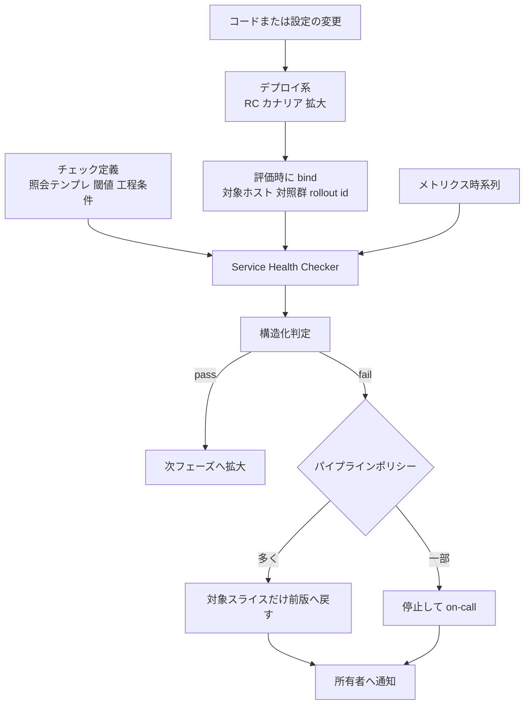
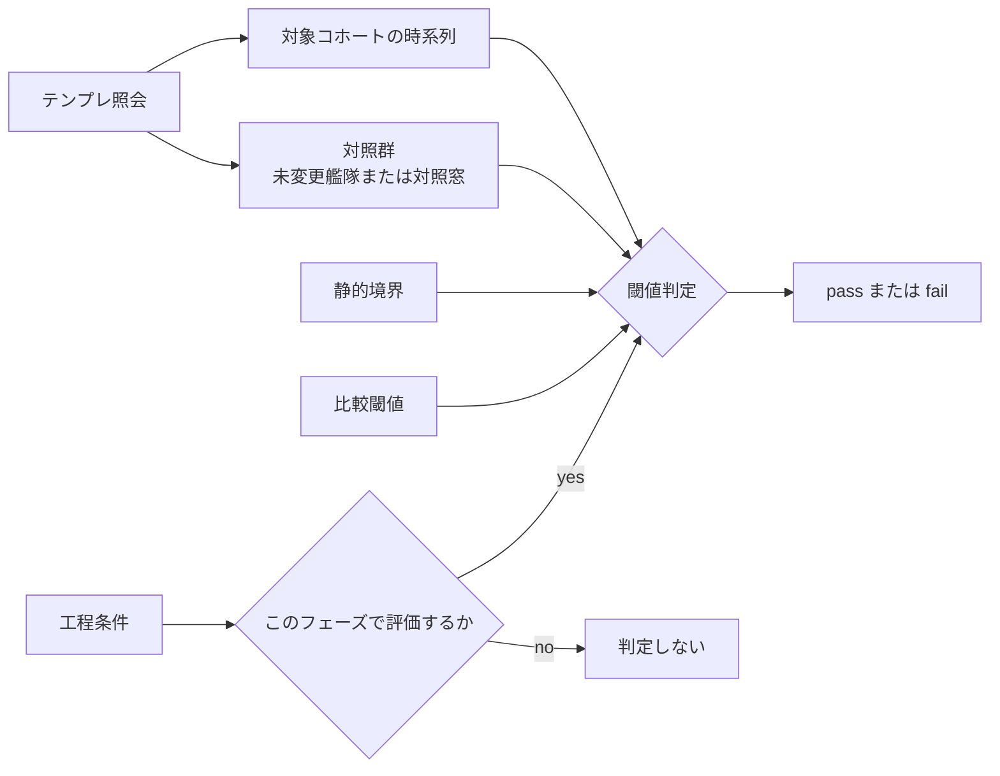

コードレビューを通った変更が、本番で壊れることがあります。AI が生成する差分が増えるほど、レビューだけを最後の砦にしておく設計は苦しくなります。

この記事では、Meta が公開した経験報告 [Making Deployments Safe at Meta: Health Checks for Continuous Change-Safety](https://arxiv.org/abs/2608.20513)（arXiv:2608.20513v1、2026-08-20）を題材に、**レビューの後ろに置く外部ゲート**をどう設計するかを整理します。

読者が持ち帰れるものは次の3つです。

- 段階展開のどの境界で、何を判定すればよいかの型
- そのゲートが**原理的に守れない変更クラス**の見分け方
- Kubernetes 環境（Flagger / Argo Rollouts）へ転用するときの条件と限界

なお本論文は ISSRE 2026 Industry Track 採録と著者が申告していますが、2026-08-25 時点で公式の採録リストと IEEE Xplore 収録は確認できません。本記事では **arXiv の経験報告**として扱います。

*この記事の全体像。以下、順に解説します。*

## 何が問題なのか

変更そのものが障害の主要トリガである、という観測は Google 側に一次資料があります。[SRE Workbook 付録 C](https://sre.google/workbook/postmortem-analysis/) は 2010〜2017 年の社内ポストモーテムを集計し、Binary push が 37%、Configuration push が 31% を占めたと記しています（Google の内訳であり、Meta の艦隊の数字ではありません）。

つまり「良いコードを書く」だけでは足りず、**変更を本番へ流し込む経路そのものに判定を挟む**必要があります。ここで多くの組織が最初に置くのが、エラー率のグローバル閾値です。しかしこれは、次の2点でうまく機能しません。

- **段階によって意味が変わる**。カナリア 10 台で「未変更群と比べて劣化しているか」を見るのと、全量展開後に「絶対値が閾値を超えたか」を見るのは別の問いです。
- **季節性とワークロード変動に弱い**。静的上限は粗い回帰しか捕まえられません。

Meta の Service Health Checker（以下 SHC）は、この2点を設計に織り込んだ中央サービスとして説明されています。

## SHCは何をする装置か

SHC は「変更を進める装置」ではありません。**変更を進める装置（デプロイパイプライン）が呼ぶ、判定専用の基板**です。判定結果を受けて本番を書き換えるかどうかは、呼び出し側のポリシーが決めます。

この分離自体は新しくありません。Google の [Canary Analysis Service（CAS、2018）](https://storage.googleapis.com/gweb-research2023-media/pubtools/4394.pdf) も、判定サービスは本番を変えず PASS / FAIL / NONE を返すだけ、という同じ形を取っています。SHC の特徴は、その判定を Meta 側のパイプラインポリシー（ロールバック / 一時停止）へ必須ゲートとして接続した点にあります。

論文が「本番へ入るすべてのコード・設定変更が SHC を通る」と書いている点は重要です。対象面は web、messaging、100ms 未満の API、ML 推論、ストレージ、内部ツールに及びます。ゲートを通らない経路を残さない、という運用上の意思決定が前提にあります。

## チェックを3つ組で定義する

SHC のチェック定義は、次の3部品でできています。この分解が、記事全体で最も転用価値の高い部分です。

| 部品 | 中身 | なぜ分けるか |
|---|---|---|
| メトリクス照会テンプレ | 評価時に対象ホスト集合・対照群・rollout id を bind する | チェック定義をデプロイトポロジから切り離せる |
| 閾値 | 静的境界と、未変更群との比較閾値の2種 | 粗回帰と slow-burn で必要な形が違う |
| 工程条件（workflow predicate） | どの段階で走らせるか | 同じチェックが段階によって有効にも無意味にもなる |

3つ目の工程条件が、他の仕組みと比べたときの一次の差別化点です。たとえば「未変更艦隊との比較」は、対照群が存在する小カナリア以降でしか成立しません。RC 段階では標本が疎で成立しないので、そのフェーズでは評価をスキップします。

サービス所有者はデプロイトポロジを知らなくてよい、と論文は書きます。トポロジの知識は SHC とデプロイ系の結合側に閉じます。この分離があるからこそ、バイナリ・設定・モバイルという異種の配信系統へ、同じチェック定義を載せられます。

## 段階ごとに何を問うか

段階展開の各境界で、チェックが答えるべき問いは変わります。

| 段階 | 状況 | チェックが答える問い | 失敗時の行動 |
|---|---|---|---|
| RC / 本番前 | 本番に近いが同一ではない | 粗い欠陥があるか。標本不足のメトリクスは工程条件でスキップ | 本番へ進めない |
| 小カナリア | 少数ホストや小リージョン。影響範囲を限定 | 未変更群と比べて劣化シグナルがあるか。最小スライスは検出力不足でスキップしうる | そのスライスだけ戻す、または停止 |
| 拡大フェーズ | 信頼が乗るたびに母集団を広げる | 同じ定義を、bind し直した次元で再評価 | 同上 |
| 全量近く | bake time 後 | ゆっくり進む劣化はなお残る | パイプラインは無限に待てないため、キューと時間予算のトレードオフ |

論文は本番の段階展開を “blue-green testing” とも呼んでいますが、[Martin Fowler の BlueGreenDeployment](https://martinfowler.com/bliki/BlueGreenDeployment.html) は待機環境の一括切替であり、部分的に母集団を広げる [CanaryRelease](https://martinfowler.com/bliki/CanaryRelease.html) とは別技法です。記述されている実装は canary 側です。自組織へ転用して説明するときは、blue-green と呼ばないほうが混乱がありません。

なお論文には仮想例として「CPU / メモリ 0〜90%、API 例外 0〜1%（two-nines SLA の場合）、全フェーズで実行」という値が出てきます。これは説明用の hypothetical であり艦隊の実測値ではないので、自組織の SLA としてコピーしないでください。

## 運用して支配的だった4つの病理

数年運用したうえで支配的だった問題として、論文は次を挙げます。設計より運用の話であり、導入を検討する側にとってはこちらが本題です。

| 病理 | 原因 | 帰結 |
|---|---|---|
| ノイズ | 閾値が過密、コホートが小さすぎる、上下流の flakiness | アラート疲れ。偽陽性による停止で速度低下。最終的にチェックが削除される |
| ドリフト | ワークロード・依存・エラー分類は毎日変わるのに、チェック定義は据え置き | 測っている対象が当初の意図からずれる |
| 未検出回帰 | ノイズ対策で閾値を緩める、最小スライスをスキップする、依存先の局所パス | recall が落ちる |
| 依存横断の死角 | 所有者は自サービスの指標しか書かない | 上流のロールアウトが、特定パスの劣化を隠す |

**偽陽性が保護そのものを殺す**、という点は独立に裏が取れます。Google CAS の報告には、ユーザーが FAIL を無視して壊れたリリースを通した事例が出てきますし、[SRE Workbook の Canarying Releases](https://sre.google/workbook/canarying-releases/) も「厳しすぎれば偽陽性、緩すぎれば見逃し」という緊張を明示しています。

## 品質は計測しないと会話にならない

論文の改善プログラムで一次的なのは、判定そのものを測る仕組みです。

1. **人を介したラベリング**: 日次で「判定 × デプロイ結果 × 手動 disposition / 再試行」を結合し、真陽性と偽陽性をラベルする。チェック単位で precision / recall をカタログ化し、偽陽性率を主指標に置く。新しいチェック定義は 30 日分の履歴（1 分粒度）でバックテストしてから投入する。
2. **自動化**: トポロジ次元の共通化（検出遅延を縮める最大のレバーだと著者は書く）、深刻度を織り込んだ判定（拡張中）、依存サービスのチェックを相関から自動追加、SLI ゲート。
3. **社会的投資**: ドキュメント、チャット、オフィスアワー。四半期分のダッシュボードより効いた、と著者は書く。

もうひとつ実務的に効くのが、**デフォルトが艦隊を決める**という観測です。大半のサービス所有者は起動時のデフォルト設定を触りません。個別チューニングの支援より、デフォルトセットの改善のほうが集計効果で勝ったと報告されています。

定量として論文（§VI）が示すのは、艦隊全体の偽陽性率が 1 年で **12.1% から 2.7% へ**下がったことです。独立検証として社内シニア 2 名が失敗 500 件を分類し、自己申告に対する過少報告は 0.5% だったとしています。

ただしこの数字の解釈には注意が要ります。

- ラベルは社内パイプライン由来です。
- 検証対象は **failures**（止めた側）であり、**通してしまった回帰**の独立検証ではありません。
- 艦隊全体の recall 値は示されていません。防いだインシデントの件数も書かれていません。

つまり「ゲートの誤警報を減らした」ことの一次証拠はありますが、「事故をどれだけ防いだか」の一次証拠はありません。

## このゲートが原理的に守れないもの

導入判断で最も重要なのは、ここです。SHC 型のゲートは万能ではなく、**論文が導入例に挙げている障害そのものを防げないクラス**が存在します。

### 制御面の一括破壊

2021-10-04 の Meta の障害は、バックボーン容量を確認するコマンドが全接続を落とし、それを止めるはずの監査ツールにバグがあり、DNS が「データセンターと通信できない＝不健全」と判断して BGP 広告を引き下げたことで到達不能が完成しました（[Engineering at Meta, 2021-10-05](https://engineering.fb.com/2021/10/05/networking-traffic/outage-details/)）。

「対象ホスト集合を未変更の対照群と比べる」という SHC の基本形は、**制御面が全域で同時に落ちる場合に成立しません**。比較すべき健全な対照が残らないからです。

なお公式ブログは障害の持続時間を明記していません。外部観測では Reuters が「nearly six-hour」、ThousandEyes が 15:40〜22:45 UTC（7 時間超）としています（いずれも二次情報）。

### 観測窓を持たずに即死するコンテンツ

CrowdStrike の Channel File 291 の事象では、Template Type 21 の入力に対して Interpreter が 20 個、Validator が 21 個の入力を前提としており、境界外読み取りで BSOD に至りました（[CrowdStrike RCA, 2024-08-06](https://www.crowdstrike.com/wp-content/uploads/2024/08/Channel-File-291-Incident-Root-Cause-Analysis-08.06.2024.pdf)）。影響規模の 850 万台という推定は [Microsoft の公式ブログ（2024-07-20）](https://blogs.microsoft.com/blog/2024/07/20/helping-our-customers-through-the-crowdstrike-outage/)によります。

受信したホストは**観測窓を持たずに落ちます**。bake time 中にメトリクスを比較する、という前提が崩れます。

同時にこの事例は、逆向きの教訓も持っています。センサーバイナリ自体は段階展開されていた一方、Rapid Response Content の経路には段階展開がなく、事後の是正としてカナリアとロールバックが新設されました。**ゲートのない経路が1本でも残れば、成熟した組織でも全域障害になります**。

### ゆっくり進む劣化

slow-burn な回帰は、パイプラインの時間予算と衝突します。無限に bake time を伸ばせない以上、全量展開後に顕在化する劣化はゲートの外に残ります。

## Kubernetesへ転用するときの現実

自組織で同じ形を作ろうとすると、選択肢は実質的に [Flagger](https://docs.flagger.app/) か [Argo Rollouts](https://argo-rollouts.readthedocs.io/en/stable/) です。SHC には公開実装がなく、設定スキーマもデータセットも公開されていません。

| 観点 | Meta SHC | Google CAS | Kayenta | Flagger | Argo Rollouts |
|---|---|---|---|---|---|
| 判定対象 | コードと設定。必須ゲート | binary / config / dataset ほか | code または config | K8s Deployment / DaemonSet、ConfigMap / Secret | K8s Rollout（canary / blueGreen） |
| 対照 | 未変更艦隊、または同一ホストの対照時間窓 | 同時 A/B。絶対的な健康度ではない | 同時作成の baseline を推奨 | primary と canary | stable と canary |
| 失敗時 | 多くはロールバック、一部は停止 | PASS / FAIL / NONE を返すのみ | Spinnaker が続行 / ロールバック / 手動 | 失敗回数到達で primary へ戻す | Failed は中止、Inconclusive は一時停止 |
| 工程条件 | workflow predicate が一次の差別化点 | 最低約5分の時系列 | 典型は数時間・複数 run | interval × weight のループ | step / background / promotion 前後 |
| 品質の P/R 計測 | カタログ化を一次で述べる | なし | なし | なし | なし |
| 公開実装 | なし | なし | OSS だが **archived** | あり、活発 | あり、活発 |

2026-08-25 時点の `gh repo view` によると、`spinnaker/kayenta` は archived（最終 push 2025-12-20、約 1.3k stars）です。新規採用時は一次リスクとして記録してください。`fluxcd/flagger`（約 5.4k）と `argoproj/argo-rollouts`（約 3.6k）はいずれも当日更新があり、archived ではありません。

転用時に効く公式の制約は次のとおりです。

- Argo Rollouts の best practices は、**単一クラスタ・単一アプリ**を前提とし、共有リソース / worker / インフラ系アプリへの適用を推奨していません。
- **5〜15 分でユーザー影響を表すメトリクスがない**と、この種のゲートの価値は落ちます。
- 設計図があるだけでは自動ロールバックは担保されません。`argoproj/argo-rollouts#1411`（[Failed Canary Analysis run did not stop rollout](https://github.com/argoproj/argo-rollouts/issues/1411)、2021-08-11 起票、CLOSED、milestone v1.2）は、判定とパイプライン行動の接続に実装欠陥がありえた一次記録です。現行版で未修正だという主張には使えませんが、「接続部分は自分で検証すべき」ことの例示にはなります。

そして CAS も Kayenta も Flagger も Argo Rollouts も、**precision / recall の計測機構は持っていません**。SHC の記事から持ち帰るべき一番の差分は、ここかもしれません。

## 発注側・経営側としてどう判断するか

### 採るもの

1. **健康条件を3つ組で管理する**。メトリクス照会、閾値の種別（静的か対照比較か）、適用段階。単一のエラー率グローバル閾値にしない。
2. **段階と対照を先に設計する**。チェックを書くより先に、dogfood / 小割合本番 / 拡大の段階と、可能なら同時対照を決める。before / after の比較だけに頼らない。
3. **失敗時の行動をポリシーとして明文化する**。自動ロールバックか一時停止か。全経路を自動ロールバックにしない選択肢も残す。
4. **偽陽性を測る**。判定ログと「本当に悪かったか」を、週次でよいので結合する。測らずに閾値を締め続けると、ゲートは無視されるようになる。
5. **デフォルトセットに投資する**。クラッシュ、飽和、ユーザーに近い SLI。所有者はチェックを書かない前提で組む。
6. **Kubernetes なら Flagger か Argo Rollouts**。Kayenta の新規採用は archived をリスクとして記録する。

### 採らないもの

- Meta SHC の再実装を「安全性の完了条件」にすること。
- AI による閾値学習を、現時点でのゲート品質の根拠にすること。論文の GBDT パイロットは約 5% のサービス規模で、推奨閾値の締め付けを 30% 減らしつつ recall を維持したという内容ですが、所有者向けには未投入です。しかも「緩める方向」の改善は未検出を増やすリスクを伴います。
- レビュー＋外部ゲートで、制御面の一括変更・カーネル即死・時間のかかる回帰までカバーできると書くこと。
- 論文の仮想例（0〜90%、0〜1%）を自組織の SLA としてコピーすること。

### 導入の前提が崩れる条件

- 変更が制御面（BGP、DNS、クラスタ制御プレーン、カーネルドライバ）に触れ、部分集団の比較が成立しない。別系統の監査と段階展開が必要になる。
- メトリクスが 5〜15 分でユーザー影響を表さない。
- 偽陽性が高止まりし、人が override するのが常態になっている。

### 直近で着手できること

1. 本番への経路を列挙し、**バイナリ以外**（設定、フィーチャーフラグ、モデル、コンテンツ更新）で段階展開と判定がない経路に印をつける。CrowdStrike 型の抜けを先に潰す。
2. 既存のカナリア / 解析（Flagger、Argo、自前のいずれでも）について、工程条件（どの step で何を見るか）と欠測時の挙動を 1 枚にまとめる。
3. 直近 30 日の自動ロールバックと解析失敗を、真の不良とノイズに手で分類する。分母と偽陽性率を先に出す。
4. AI 生成差分が増えるリポジトリでは、マージ後ゲートの入力を「サービス SLI + 依存呼び出しのエラー」に絞る。メトリクスを増やさない。

## まとめ

- SHC は「変更を進める装置」ではなく、**デプロイパイプラインが呼ぶ判定基板**です。判定と実行を分離する設計自体は Google CAS と共通です。
- 転用価値が高いのは、チェックを**メトリクス照会テンプレ × 閾値種別 × 工程条件**の3つ組に分解し、段階ごとに評価する型です。とくに工程条件が一次の差別化点です。
- 運用の本体は偽陽性との戦いです。**判定の precision / recall を測らないと、ゲートは静かに無視されます**。艦隊偽陽性率 12.1% → 2.7% は、その計測に投資した結果として報告されています。
- ただし示されているのは「誤警報を減らした」ことであり、「事故をどれだけ防いだか」ではありません。recall の艦隊値も、防いだインシデント件数もありません。
- 制御面の一括破壊、観測窓なしの即死、slow-burn は、このクラスのゲートでは原理的に守れません。**ゲートのない経路を1本も残さない**ことのほうが、ゲートの精度より先に効きます。
- 最初の投資単位は、段階ごとの健康条件と偽陽性の計測です。学習閾値や Meta 規模の中央サービスではありません。

この記事が少しでも参考になった、あるいは改善点などがあれば、ぜひリアクションやコメント、SNSでのシェアをいただけると励みになります！

## 参考リンク

- [Making Deployments Safe at Meta: Health Checks for Continuous Change-Safety（arXiv:2608.20513v1）](https://arxiv.org/abs/2608.20513)
- [More details about the October 4 outage（Engineering at Meta, 2021-10-05）](https://engineering.fb.com/2021/10/05/networking-traffic/outage-details/)
- [Rapid release at massive scale（Engineering at Meta, 2017-08-31）](https://engineering.fb.com/2017/08/31/web/rapid-release-at-massive-scale/)
- [Channel File 291 Incident Root Cause Analysis（CrowdStrike, 2024-08-06）](https://www.crowdstrike.com/wp-content/uploads/2024/08/Channel-File-291-Incident-Root-Cause-Analysis-08.06.2024.pdf)
- [Helping our customers through the CrowdStrike outage（Microsoft, 2024-07-20）](https://blogs.microsoft.com/blog/2024/07/20/helping-our-customers-through-the-crowdstrike-outage/)
- [Canary Analysis Service（ACM Queue, 2018）](https://storage.googleapis.com/gweb-research2023-media/pubtools/4394.pdf)
- [Canarying Releases（Site Reliability Workbook ch.16）](https://sre.google/workbook/canarying-releases/)
- [Postmortem Analysis（Site Reliability Workbook Appendix C）](https://sre.google/workbook/postmortem-analysis/)
- [Automated Canary Analysis at Netflix with Kayenta（2018-04-10）](https://netflixtechblog.com/automated-canary-analysis-at-netflix-with-kayenta-3260bc7acc69)
- [Best practices for configuring canary（Spinnaker docs）](https://spinnaker.io/docs/guides/user/canary/best-practices/)
- [Flagger documentation](https://docs.flagger.app/)
- [Argo Rollouts documentation](https://argo-rollouts.readthedocs.io/en/stable/)
- [BlueGreenDeployment / CanaryRelease（Martin Fowler）](https://martinfowler.com/bliki/BlueGreenDeployment.html)
- [ISSRE 2026 公式サイト](https://cyprusconferences.org/issre2026/)
