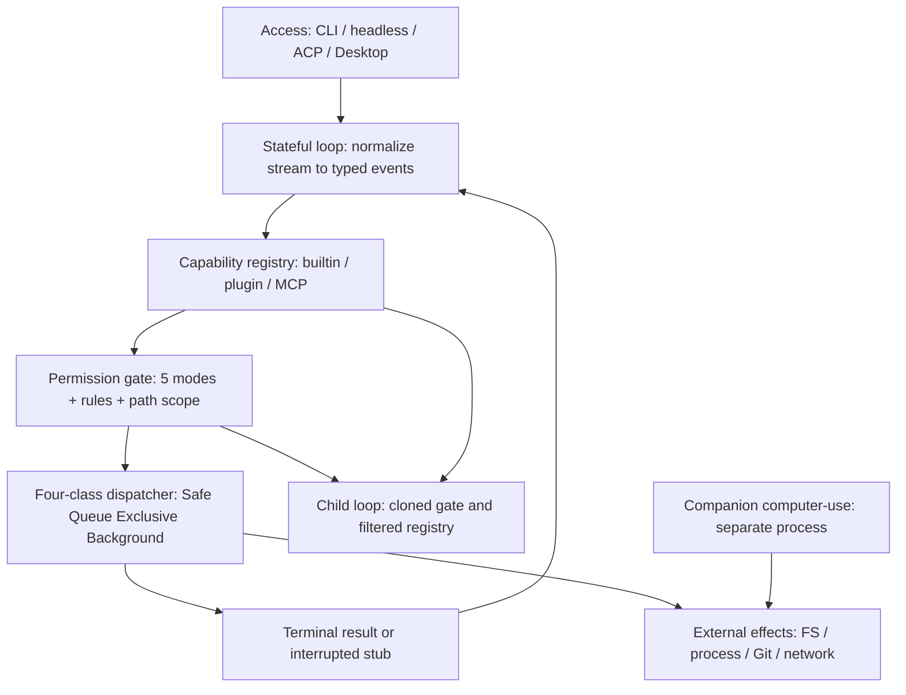
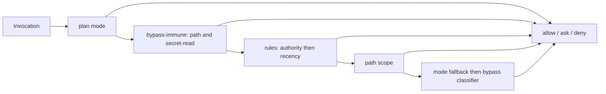

ツール使用エージェントの安全性は、たいてい「モデルに何を言わせないか」で語られます。しかしモデルの出力は無視できます。無視できないのは、ホストが認めてしまったコマンドのほうです。認めた瞬間、ファイルは書き換わり、プロセスは起動し、Git の履歴は動いています。

arXiv に投稿された論文 [Metis: Typed Runtime Mediation for Tool-Using Software Agents](https://arxiv.org/abs/2608.25322)（arXiv:2608.25322、Jun Yu、2026-08-26 提出）は、この「提案のあと・副作用の手前」に注目します。モデルが提案したツール呼び出しを、外部副作用に達する前に型付きイベントへ変換し、許可決定・干渉クラス・終了結果・ライフサイクル遷移を検査可能な辺として残す、ホスト側ランタイムの設計です。

この記事で扱うのは次の3点です。

- Metis が置く仲介層が、プロンプト政策やリポジトリハーネスと何が違うのか
- 許可・並行・子エージェント・継続の4つを、どんな型で表現しているのか
- 論文が保証していないことは何で、それでも自分のエージェント基盤に写せる設計判断は何か

先に結論を書きます。**製品として Metis を採用する判断材料はまだありません。持ち帰る価値があるのは「すべての効果経路が同じゲートを通る」という設計パターンのほう**です。


*この記事の全体像。以下、順に解説します。*

## なぜ「提案のあと」に層が必要なのか

エージェント研究の多くは、2つの場所に力をかけてきました。

| 力点 | 代表例 | 決めていること |
|---|---|---|
| 何を提案するか | ReAct / Toolformer | モデルの推論と呼び出し生成 |
| どんな環境を見せるか | SWE-agent / OpenHands | 観測面とハーネスの構成 |

このどちらも、提案が出たあとの扱いを決めません。残っているのは、次の4つを同時に満たすコンポーネントです。論文はこれを設計目標として明示し、同時に「保証しないこと」も並べています。

| 性質 | 意味 | 非保証 |
|---|---|---|
| Authorization-before-effect | 実行前に最終許可がある | 意味的な意図解釈 |
| Ordered interference | 干渉する呼び出しがクラスを守る | 誤宣言ツールの隠れ副作用 |
| Terminal-result closure | 受理した tool-use id に必ず結果が付く | ホスト喪失後の回復、トランザクション |
| Bounded continuation | 圧縮・修復後も次リクエストが構造的に妥当 | 要約の事実保持 |

脅威モデルは、不正な提案、誤ったツール出力、誤設定ポリシー、誤った並行メタデータ、panic や cancel、子エージェントへの伝播を含みます。逆に、侵害されたホスト、嘘をつくツール、意図の意味解釈、ロールバック、任意のプロセス喪失は対象外です。

この線引きは重要です。**「認可の穴を塞ぐ」話であって、「危険な行為を意味で判定する」話ではありません。**

## 仲介層はどこに置かれるか

全体像は次の形です。アクセス経路が何であっても、プロバイダのストリームをいったん共有ブロックへ正規化し、そのあとで許可と dispatch に渡します。



読み取るべき点は3つです。

- 効果境界の手前で、**観測（正規化）と仲介（許可・スケジュール・結果）が分かれている**
- built-in / plugin / MCP が **1つのレジストリを通ってから** dispatch される
- スキル文書は指示とツール可視性を変えるが、**第二の権限経路にはならない**（論文 §1）

computer-use の companion は別プロセスであり、このゲートの置き換えではなく追加のゲートです。プロセス境界を跨ぐ操作は、ここでは仲介の外側に置かれています。

## 許可はツール単位ではなく経路単位で決まる

許可の戻り値は `{allow, ask, deny}` の3値です。公開されている許可モードは5つあります。

- `default`
- `acceptEdits`
- `plan`
- `dontAsk`
- `bypassPermissions`

バッチ内に ASK があるとき、**最初の admitted 効果より前にすべての ASK を解決します**。「一部だけ実行してから聞く」ことをしない、という順序の約束です。

決定の優先順位は論文 Eq.6 として定式化されています。



この順序が意味することを、実務の言葉に置き換えます。

- `plan` は通常ルールより先に評価されます。**古い allow が新しい mutation を正当化できません**
- bypass-immune は path と secret-read です。bypass を選んでも、この2つは残ります
- dangerous command patterns は、bypass 選択時に optional classifier の**前**で残ります
- ただし **classifier の失敗は bypass 選択時に fail-open** です（論文 §4.3 / Fig.4）。一般の fail-closed ではありません

規則自体は authority と recency で解決します。interactive / protocol / headless のどの承認も同じゲートに終わる、というのが論文 §1 の主張です。公開実装 [Ricardo-M-L/metis](https://github.com/Ricardo-M-L/metis) の ARCHITECTURE / README には、5層の順序 `managed policy > CLI > interactive/session > config > persistent approval` が記載されています。ただしこの実装が論文の凍結成果物と同一である証明はありません。

### 検証されたのはどこまでか

論文の permission oracle は、この5経路について手作り10ケース（認可1 + 非認可1）を `CanUse` だけで照合し、10/10 一致しました。**副作用は走っていません。実行付きの状態差分は未実施です**（Table 3、Table 6）。つまり「決定関数が一貫している」ことの局所的な証拠であって、「実行経路が実際に塞がっている」証拠ではありません。

### Claude Code も同じ層にいる

この層の話は Metis 固有ではありません。Claude Code の公式ドキュメント [permission-modes](https://code.claude.com/docs/en/permission-modes) でも、permission mode が実行可否を決め、Auto では分類器が残りの行動を審査し、**読み取りと作業ディレクトリ内のファイル編集は分類器を飛ばす**（保護パスを除く）と説明されています。

論文 §6.4 も同じ限界を認めています。スコープ内の有害な edit は通り得ます。共通ゲートは**経路被覆の必要条件**であって、**意味的禁止の十分条件ではありません**。

MCP はさらに一段手前です。仕様上の human-in-the-loop は SHOULD であり、ホストが実装しなければ `tools/call` はサーバ側の副作用に到達します。Metis は MCP ツールをレジストリへ載せてからゲートすると主張しますが、プロトコル仕様そのものが完全仲介を強制するわけではありません。

**自分の環境に写すなら、allow リストにツール名を足す前に、built-in 書き込み・Bash・alias・MCP・plugin が同じ決定手続きを通るかを列挙するほうが先です。**

## 並行性を4クラスに分ける

Metis は呼び出しを4クラスに分類して dispatch します。

| クラス | 動き |
|---|---|
| Safe | ファンアウトして並列実行 |
| Queue | 1本の FIFO。Safe とは重なる |
| Exclusive | 先行波のあと直列 |
| Background | handshake だけ同期し、本体はデタッチ |

重要なのは、**クラスがツール単位ではなく入力依存**であることです。同じツールでも引数によってクラスが変わります。同じ `write` でも対象パスが違えば干渉しません。

結果ブロックは入力順に戻ります。Safe の完了順とは独立です（論文 Eq.10）。呼び出し順と結果順が一致するので、モデル側から見た会話の構造は並列化しても壊れません。

### 測定値と、その読み方

論文 Table 4（PDF p.12）の測定です。

| 量 | 値 |
|---|---|
| 条件 | 同一5呼び出し × 30組。filesystem read+hash、Git status、loopback HTTP×2（各6ms 遅延）、filesystem write |
| Four-class 中央値 | 14.146 ms |
| Forced-serial 中央値 | 25.958 ms |
| 平均ペア差 | −12.295 ms |
| 95% bootstrap | [−12.968, −11.694]（20,000 resample、seed 20270813） |
| 方向 | 30/30 で four-class が速い |
| ホスト | Apple M2 Pro、12コア、16GB、macOS 26.5.2、Go 1.26.1 |

方向は安定していますが、**これは Metis 内部の切除実験です**。他ランタイムとの比較ではありません。loopback の 6ms は意図的に入れた遅延であり、1ホスト・1ワークロードの結果です。論文 §5.5 自身が、中央値比 1.835 を一般的な高速化として使ってはいけないと書いています。

### 故障時に見えた限界

故障行列10ケースからは、実装の限界が2つ出ています。

- **duplicate identifier**: 重複 ID では結果ブロックが2つでも unique terminal ID は1つ。ID の一意性は提供されない
- **write 後失敗**: 残差状態が残る。トランザクションではない

「結果が必ず閉じる」という保証は、識別子の被覆についての保証であって、状態の巻き戻しについての保証ではありません。

## 子エージェントの権限縮小は「隔離」ではない

子エージェントに渡すツール面は、論文 Eq.13 で次のように定義されます。

```
T_child = (T_parent ∩ T_profile ∩ T_callsite) \ D_profile
```

欠けている allowlist は恒等（絞らない）として扱われます。子は cloned gate を受け取り、規則と scope hook を継承します。worktree はリポジトリ書き込みを分けます。

一方で、**ネットワーク・プロバイダ状態・ホスト資源・資格情報は共有します**。これはプロセス隔離ではありません。「子は親より少ないツールしか見えない」だけです。

### ablation は何を示したか

論文 §5.6 の child-boundary ablation の結果です。

- フル構成（gate + plan-filtered registry）: 宣言された未認可効果を阻止し、escape tools 5/5 を隠した
- 両方を除去: 効果を認め、5/5 を露出した

ただし**同時切除であり、条件あたり1決定論ケース**です。gate と registry のどちらが効いたかは分かりません。論文 Table 6 は「片側を固定してもう片側を ablate する」実験を、未実施の必要研究として置いています。

さらに、「隠した」は**発見層の指標**です。実行層の `tools/call` が別経路で残るなら無効になります。

この失敗モードには一次事例があります。OpenClaw は bundled MCP/LSP を政策フィルタの**あとで** tool set に足しており、subagent policy を含む制限を迂回できました（ベンダー advisory [GHSA-qrp5-gfw2-gxv4](https://github.com/openclaw/openclaw/security/advisories/GHSA-qrp5-gfw2-gxv4)、影響 `< 2026.4.20`、修正 `2026.4.20`）。これは Metis の脆弱性ではなく、「フィルタ後 merge」というパターンそのものの実例です。

**子の制限をプロンプトで書くのではなく、cloned gate とレジストリ交差で実行時に強制する。そして可視性フィルタのあとにツールを足さない。** ここが持ち帰るべき規律です。

なお論文 §6.6 は、型付きイベントは伝播を見せるが、間接プロンプト注入の防御ではないと明記しています。

## 継続と修復は構造を守るだけ

コンテキスト圧に対しては、6段階で強くなる縮退が定義されています。

1. image prune
2. snip
3. disk spill
4. middle collapse
5. full compact
6. post-compaction cap/retry

狙いは**プロトコル構造の維持**であり、意味の同値性ではありません。orphan repair も同様で、孤児の `tool_use` には interrupted stub を足して識別子被覆を回復します。これは冪等な操作（Eq.11）であって、時系列の1対1復元ではなく、副作用の巻き戻しでもありません。重複 ID や古い結果があると曖昧さを隠せます。

実務的には、**「構造が閉じていること」と「判断材料が残っていること」を別々に測る**必要があります。構造は閉じているのに要約で事実が落ちている、という状態は普通に起こります。

## 他の手段との比較

| 基準 | プロンプト制約 | ツール別 allow | 共通ホストゲート（Metis の主張） | OS 隔離 |
|---|---|---|---|---|
| スキップ耐性 | モデルが無視できる | 未登録経路が残る | 登録経路は効果前に必ず通る | カーネルが残す |
| 監査 | 文章 | 規則ファイル | 型付きイベント | 監査ログは別 |
| 並行 | なし | なし / 場当たり | 4クラス | プロセス単位 |
| 意味的安全 | 期待されがち | 名前一致のみ | 非保証（論文が明記） | 非対象 |
| ロールバック | なし | なし | なし（論文が明記） | スナップショット次第 |
| 運用負荷 | 低い | 規則が散る | ゲート実装と宣言メタデータ | 高い |

どれを選ぶかは、副作用面の形で決まります。

- **共通ゲートが向く**: 複数のエントリ（対話 / headless / プロトコル）と複数のツール起源（builtin / MCP / plugin）が、同じ副作用面に出るとき
- **ツール別 allow だけでは足りない**: alias や MCP が別チェックを通るとき（論文が引用する Ji et al. のカバレッジ問題）
- **OS 隔離が依然として必要**: 子との資格情報共有、companion の GUI 操作、ホスト侵害を想定するとき

## 論文が保証していないこと

支持側と反証側を並べます。

**支持できる部分**

- ランタイムを政策・ハーネスから分離し、トレースを監査オブジェクトとして扱う設計（§6.1、§6.3）
- 5経路の `CanUse` oracle が手作り10ケースで一致した（経路閉鎖の局所証拠）
- 4クラスが forced-serial より、このワークロードでは一貫して速い（Table 4）
- 公開実装候補の README / ARCHITECTURE が5モードと4クラスを記述し、`permission.Gate.Clone()` が multi-agent 節にある（star は約2、2026-08-28 時点）
- Claude Code 公式も、ホスト強制という同じ層を採っている

**確信度を下げるべき部分**

- Abstract 自身が、意味的安全・ロールバック・他ランタイム優越・モデル能力を未確立としている
- Table 4 は1ホスト・意図的な 6ms delay・内部切除
- 子の ablation は n=1 の同時切除。論文自身が成分 ablation を未実施と書いている
- companion はプロセス外の追加ゲート。MCP と誤宣言ツールは信頼境界の外
- bypass 時の classifier は fail-open
- Safe と誤ラベルされた隠れ write はレースし得る（§7）
- 凍結成果物は非公開（「being curated」）。凍結テストは 4,998 pass / 2 fail / 31 skip、カバレッジ 63.5%、6パッケージ欠

探索的メンテナンスの比較（Table 5）も1組だけです。隠れオラクルと対象回帰は baseline Fail / mediated Pass、wall time は 556.622 秒から 303.447 秒、input tokens は 884,363 から 287,742 でした。これは効果推定ではなく、活性化の観察として読むべき数字です。

残る最小の主張はこうなります。**Saltzer の complete mediation を「ツール効果境界」へ再適用した局所実装が、凍結ソース上で動いた。** それ以上でも以下でもありません。

## 自分のエージェント基盤に写すときのチェックリスト

論文の限界を踏まえたうえで、設計パターンとして移植できる項目です。

1. **経路を数える**。ツール名の allow を増やす前に、builtin / shell / alias / MCP / plugin が同じゲートを通るかを列挙する
2. **子エージェントは実行時に絞る**。プロンプトで禁止するのではなく、cloned gate とレジストリ交差で強制する。可視性フィルタのあとにツールを足さない
3. **干渉クラスをツール側に宣言させる**。4クラスを導入するなら、誤った Safe 宣言は認可バグと同じ重さで扱う
4. **圧縮と orphan repair を「記憶の質」と分けて測る**。構造が閉じていても判断材料は落ちる
5. **bypass や Auto 相当を常用するなら、classifier の fail-open とスコープ内 edit を残差として設計書に明記する**
6. **この論文を根拠に「安全なエージェント」と書かない**

逆に、次のどれかが起きたら、上の判断は見直しが必要です。

- 公開成果物で Table 4 / 子 ablation / oracle が独立に再現できない
- 実行付きの経路試験で、alias や MCP がゲートを迂回する
- 子が親に無いツールを実行時に獲得する（フィルタ後 merge の再来）

## まとめ

- Metis は、モデルの提案と外部副作用の**あいだ**に、型付きイベントの仲介層を置くホスト側ランタイムです
- 許可はツール単位ではなく**経路単位**で決まり、5モードと `{allow, ask, deny}`、優先順位付きの決定手続きで表現されます
- 並行性は Safe / Queue / Exclusive / Background の**入力依存4クラス**で、結果は入力順に戻ります
- 子エージェントの縮小は cloned gate とレジストリ交差によるもので、**プロセス隔離ではありません**
- 評価は凍結ソース上のメカニズム検証にとどまり、意味的安全・ロールバック・他ランタイム優越は論文自身が否定しています
- したがって取るべきは製品採用ではなく、**すべての効果経路が1つのゲートを通るという設計パターン**の移植です

エージェントに「何をさせないか」をプロンプトで書き続けるより、「どの経路も同じ場所で止まるか」を数えるほうが、検査可能な設計に近づきます。

この記事が少しでも参考になった、あるいは改善点などがあれば、ぜひリアクションやコメント、SNSでのシェアをいただけると励みになります！

## 参考リンク

一次資料

- Jun Yu. 2026. Metis: Typed Runtime Mediation for Tool-Using Software Agents. arXiv:2608.25322. https://arxiv.org/abs/2608.25322
- Claude Code. Permission modes. https://code.claude.com/docs/en/permission-modes
- Saltzer and Schroeder. 1975. The Protection of Information in Computer Systems. https://web.mit.edu/saltzer/www/publications/protection/Basic.html
- Ricardo-M-L/metis（README / ARCHITECTURE.md。論文成果物との同一性は未証明の公開実装候補）. https://github.com/Ricardo-M-L/metis

隣接事例（設計上の失敗モードの実例。Metis の脆弱性ではありません）

- OpenClaw GHSA-qrp5-gfw2-gxv4. Bundled MCP/LSP tools could bypass configured tool policy. https://github.com/openclaw/openclaw/security/advisories/GHSA-qrp5-gfw2-gxv4
- Cursor GHSA-3v8f-48vw-3mjx. Sandbox escape via symlink and failed path canonicalization. https://github.com/cursor/cursor/security/advisories/GHSA-3v8f-48vw-3mjx

関連研究（Metis が引用する研究。本記事に載せた測定値はこれらの成果ではありません）

- Ji et al. 2026. Measuring the Permission Gate. arXiv:2604.04978
- Dingeto and Leeney. 2026. AgentRedBench. arXiv:2606.02240
