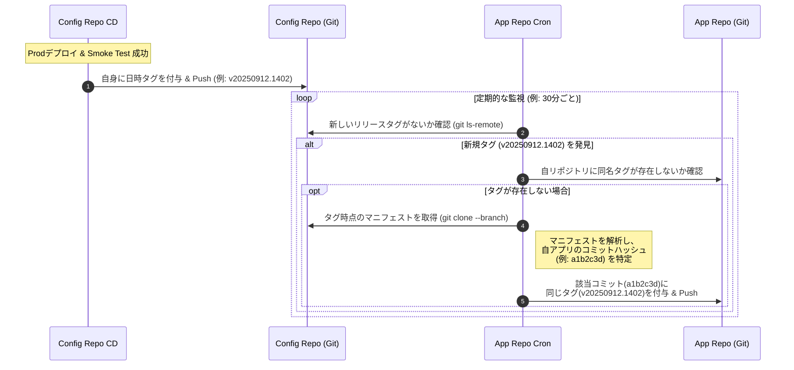
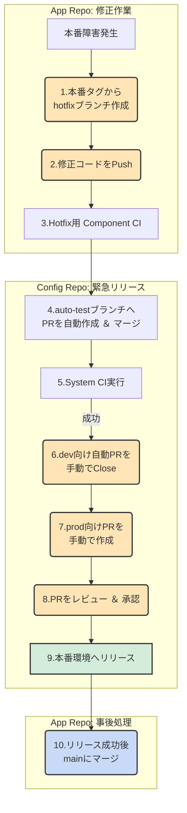

## ■概要

この記事では、複数のマイクロサービスを並行開発するチームが直面しがちな「開発速度」と「リリースの信頼性」という、**トレードオフの関係にある課題**を解決するため、実践的なCI/CDパイプライン戦略を提案します。この戦略は、開発速度を重視する「GitHub Flow」と、環境ごとの変更管理を厳密に行う「GitLab Flow」の長所を組み合わせた、独自のハイブリッドアプローチです。


この戦略の核心は、**CI（継続的インテグレーション）とCD（継続的デリバリー）の責務を、リポジトリレベルで明確に分離する**点にあります。

  * **CIの責務 (アプリケーションリポジトリ)**: 高品質なコンテナイメージという「部品」を迅速に生成することに特化します。
  * **CDの責務 (設定リポジトリ)**: CIが生成した「部品」を組み込み、システム全体を各環境へ安全かつ確実に届けることに特化します。

CIは**マルチステージCI**の考え方を採用し、コードの統合範囲と目的に応じて以下の4階層に分割することで、フィードバックサイクルを最適化します。

  * **Developer CI**: 開発者個人への即時フィードバック
  * **Team CI**: チームのメインブランチの品質保護
  * **Component CI**: リリース可能なコンテナイメージ（成果物）の作成
  * **System CI**: 複数コンポーネントを統合したシステム全体の品質保証

CDは、Gitを信頼できる唯一の情報源（Single Source of Truth）とする**GitOps**の原則に基づき、**設定リポジトリ**で駆動させます。Argo CDのような**プル型**のGitOpsツールが設定リポジトリへの変更を検知し、自動テスト環境から始まり、dev、stg、prodの各環境へ段階的に変更を **プロモーション（昇格）** させていきます。プロモーションとは、ある環境で検証済みの変更を、次の上位環境へ反映させるプロセスを指します。

### ●この戦略が解決する課題

  * **フィードバックの遅延**: `main`ブランチにマージするまでテストが実行されず、手戻りが大きい。
  * **リリースの複雑化**: どのバージョンのどのサービスが、どの環境にデプロイされているかの管理が煩雑になる。
  * **セキュリティテストの形骸化**: リリース直前に脆弱性が見つかり、手戻りが大きい。
  * **手動作業によるミス**: 環境へのデプロイ申請やPR作成といった手作業が多く、時間がかかりミスも発生しやすい。

### ●特徴

この多層的パイプライン戦略には、以下の特徴があります。

  * **迅速なフィードバック**
    開発者が個人の作業ブランチにプッシュすると、変更差分のみを対象とする高速な「Developer CI」が実行されます。これにより、開発者は即座にフィードバックを得られます。
  * **セキュリティのシフトレフト**
    開発の初期段階（Developer/Team CI）にSAST（静的アプリケーションセキュリティテスト）を組み込み、脆弱性を早期に発見・修正します。CDプロセスではDAST（動的アプリケーションセキュリティテスト）を実行し、実行時の脆弱性も検出することで、**セキュアなソフトウェアデリバリー**を実現します。
  * **プロモーションプロセスの完全自動化**
    ある環境でのCDパイプラインが成功すると、次の環境へデプロイするためのプルリクエスト（PR）が自動で作成されます。これにより、手動でのPR作成作業が不要になり、プロセスが高速化します。
  * **信頼性の高い段階的リリース**
    System CIでシステム全体の包括的なテストを実施します。次に、ステージング（stg）環境で最終的な自動検証を行うことで、本番環境へのデプロイに伴うリスクを大幅に低減します。

## ■パイプライン戦略の全体像

この戦略の全体像を以下の図に示します。アプリケーションリポジトリでのCIが完了すると、設定リポジトリでCDがトリガーされ、各環境へ段階的にデプロイされていく流れです。


### ●リポジトリ構成

| リポジトリ種別 | 例 | 目的 |
| :--- | :--- | :--- |
| **アプリケーション** | `front`, `bff`, `auth`など | 各マイクロサービスのソースコード管理。CIパイプラインを実行し、コンテナイメージを生成。 |
| **設定** | `config` | 各環境のKubernetesマニフェスト管理。このリポジトリへの変更が Argo CD などのツールによって検知され、自動でデプロイをトリガー。 |

### ●ブランチ戦略

| リポジトリ種別 | ブランチ戦略 | 説明 |
| :--- | :--- | :--- |
| アプリケーション | **GitHub Flow** | `main`ブランチを常にデプロイ可能な状態に維持。フィーチャーブランチから`main`へのPRを通じて開発を進行。 |
| 設定 | **GitLab Flow** | 環境ごとのブランチ（`auto-test`, `dev`, `stg`, `prod`）を保持し、ブランチ間のマージで変更をプロモーション。 |

### ●基本原則

| 原則 | 説明 |
| :--- | :--- |
| **フィードバック駆動開発** | あらゆるレベルで、できるだけ早く的確なフィードバックを関係者に提供します。 |
| **すべてを自動化** | ビルド、テスト、デプロイのプロセスを完全に自動化し、手動作業を排除します。 |
| **最小限のガバナンス** | チームが自律的に動けるよう、ガードレールとしてのパイプラインを提供します。 |
| **You build it, you run it** | 開発チームが自ら開発したサービスの運用まで責任を持つ文化を醸成します。 |

### ●CIパイプライン階層 (アプリケーションリポジトリ)

| パイプラインステージ | 目的 | トリガー | 主な活動 |
| :--- | :--- | :--- | :--- |
| **Developer CI** | 開発者個人への即時フィードバック | フィーチャーブランチへのプッシュ | - 静的コード解析 (差分のみ)<br>- SAST (差分のみ・フィードバック用)<br>- Small Test (単体テスト) |
| **Team CI** | `main`ブランチの品質保護 | `main`ブランチへの**PR**作成・更新 | - 静的コード解析 (全体)<br>- SAST (全体・フィードバック用)<br>- Small Test (単体テスト) |
| **Component CI** | リリース候補の成果物作成とCDプロセスの開始 | `main`ブランチへのマージ | - 静的コード解析 (全体)<br>- SAST (履歴管理用)<br>- Small & Medium Test (*1)<br>- コンテナのビルド & スキャン<br>- **後続のCDを駆動させるため**、`config`リポジトリの`auto-test`ブランチへの**PR**を自動作成・マージ |

:::message
*1: **Medium Test**: DBや外部APIのモックなど、一部の依存関係をコンテナで起動して行う、単一ホスト内で完結するインテグレーションテストを指します。
:::

**CIとCDの連携**: `Component CI`の完了は、あくまで高品質な **「部品」** （コンテナイメージ）が完成したことを意味します。この部品をシステムに組み込んで初めて価値が生まれます。次の`System CI`は、CDパイプラインの最初のステージとして、設定リポジトリ側でこの新しい部品をシステムに統合し、E2Eテストを通じて **「システムとしての品質」** を保証する、CIとCDの重要な橋渡し役を担います。

### ●CD パイプライン階層 (設定リポジトリ)

| パイプラインステージ | 環境 | 目的 | トリガー | 主な活動 |
| :--- | :--- | :--- | :--- | :--- |
| **System CI** | **自動テスト** | システム全体の統合テストと品質保証 | `auto-test`ブランチへのマージ | - 自動テスト環境へのデプロイ<br>- Smoke Test<br>- Large Test (E2Eテスト)<br>- DAST<br>- 成功後、`dev`ブランチへのPRを自動作成 |
| **CD / Promotion** | **Dev** | 開発者による変更単位での手動テスト | `dev`ブランチへのマージ | - Dev環境へのデプロイ<br>- Smoke Test<br>- 成功後、`stg`ブランチへのPRを自動作成<br>- (開発者による手動テスト) |
| **CD / Promotion** | **Stg** | 本番前最終自動検証とQA/UAT | `stg`ブランチへのマージ | - Stg環境へのデプロイ<br>- Smoke Test<br>- DAST<br>- 自動パフォーマンステスト<br>- 成功後、`prod`ブランチへのPRを自動作成<br>- (手動によるUAT/QA) |
| **CD / Release** | **Prod** | 本番環境へのリリース | `prod`ブランチへのマージ | - Prod環境へのデプロイ<br>- Smoke Test |

:::message
これらのパイプラインに含まれる「Smoke Test」や「Large Test」は、Argo CDやFluxといったGitOpsツールによるデプロイ完了をトリガーとして実行されます。
:::

## ■構築方法

この戦略を実現するための具体的なパイプライン定義を、**GitHub Actions**と**GitLab CI/CD**のそれぞれについて示します。どちらのプラットフォームでも、CIとCDの責務を分離し、PRを介してプロモーションを自動化するという中核的な考え方は共通です。

### ●アプリケーションリポジトリ (`front`) のパイプライン

`main`ブランチへのマージをトリガーにComponent CIを実行します。パイプラインの最終ステップで、コンテナイメージのビルド情報を`config`リポジトリに渡し、`auto-test`ブランチへの**プルリクエスト（Pull Request）**を自動で作成・マージします。

#### GitHub Actions の場合

`.github/workflows/ci.yml` を作成します。`config`リポジトリへの書き込み権限を持つ`Personal Access Token`を、`CONFIG_REPO_ACCESS_TOKEN`という名前でリポジトリのSecretsに保存しておく必要があります。

**注**: 以下のコード内の `your-org/config` や `your-registry/front` といった箇所は、ご自身の環境に合わせて修正してください。

```yaml
# .github/workflows/ci.yml
name: Component CI and Trigger CD

on:
  push:
    branches:
      - main

jobs:
  build-and-trigger-cd:
    runs-on: ubuntu-latest
    permissions:
      contents: read
    steps:
      - name: Checkout application code
        uses: actions/checkout@v4

      # (ここにビルド、テスト、SAST、コンテナビルド＆プッシュのステップが入ります)
      - name: Build, Test, and Scan
        run: |
          echo "Building application..."
          echo "Running tests..."
          echo "Building and pushing container image to registry..."

      - name: Trigger System CI in Config Repo
        env:
          GH_TOKEN: ${{ secrets.CONFIG_REPO_ACCESS_TOKEN }}
          CONFIG_REPO_URL: "https://github.com/your-org/config.git"
          COMMIT_SHA_SHORT: $(echo $GITHUB_SHA | cut -c1-7)
        run: |
          echo "Cloning config repository..."
          git clone $CONFIG_REPO_URL config-repo
          cd config-repo

          # ここでKubernetesマニフェスト（例: Kustomize, Helm）のイメージタグを更新します
          # 例: Kustomizeを使用する場合
          # kustomize edit set image your-registry/front:${COMMIT_SHA_SHORT}
          echo "Updating image tag for front to ${COMMIT_SHA_SHORT}"

          git config user.name "github-actions[bot]"
          git config user.email "github-actions[bot]@users.noreply.github.com"
          
          BRANCH_NAME="release/front-${COMMIT_SHA_SHORT}"
          git checkout -b ${BRANCH_NAME}
          git add .
          git commit -m "Update front service to version ${COMMIT_SHA_SHORT}"
          git push origin ${BRANCH_NAME}

          echo "Creating and merging a pull request to the auto-test branch..."
          gh pr create \
            --repo your-org/config \
            --base auto-test \
            --head ${BRANCH_NAME} \
            --title "🚀 Promote front:${COMMIT_SHA_SHORT} to auto-test" \
            --body "Automated promotion from Component CI"
          
          gh pr merge ${BRANCH_NAME} --squash --delete-branch --repo your-org/config

```

#### GitLab CI/CD の場合

:::message
GitLabでは、GitHubのプルリクエストに相当する機能を**マージリクエスト (Merge Request / MR)** と呼びます。以下の例ではGitLabの作法に合わせ、マージリクエストという用語を使用します。
:::

`.gitlab-ci.yml` を作成します。`config`リポジトリにマージリクエストを作成するための書き込み権限を持つアクセストークンを、`CONFIG_REPO_ACCESS_TOKEN`という名前でCI/CD変数に設定しておく必要があります。

**注**: 以下のコード内の `your-group/config` といった箇所は、ご自身の環境に合わせて修正してください。

```yaml
# .gitlab-ci.yml
# ... (Developer CI, Team CI, Component CIのビルド部分は省略)

trigger-system-ci:
  stage: deploy
  image: registry.gitlab.com/gitlab-org/cli:latest
  script:
    - export GL_HOST="gitlab.com"
    - export GITLAB_TOKEN="${CONFIG_REPO_ACCESS_TOKEN}"
    - |
      # ここにマニフェストのイメージタグを更新する処理を記述します (git clone, sed, git pushなど)
      # この例では、MR作成機能のみを示します
      glab mr create \
        --repo your-group/config \
        --source-branch "release/front-${CI_COMMIT_SHORT_SHA}" \
        --target-branch "auto-test" \
        --title "🚀 Promote front ${CI_COMMIT_SHORT_SHA} to auto-test" \
        --remove-source-branch \
        --merge-when-pipeline-succeeds
  rules:
    - if: '$CI_COMMIT_BRANCH == "main"'

```

### ●設定リポジトリ (`config`) のパイプライン

各環境ブランチへのマージをトリガーにCDパイプラインを実行します。パイプラインの最終ステップで、次の環境へのプロモーション用**PR**を自動で作成します。

#### GitHub Actions の場合

`.github/workflows/cd.yml` を作成します。PR作成には標準で提供される`GITHUB_TOKEN`が利用できます。

```yaml
# .github/workflows/cd.yml
name: CD and Promotion

on:
  push:
    branches:
      - auto-test
      - dev
      - stg

jobs:
  # Automated Test Environment (System CI)
  system-ci:
    if: github.ref == 'refs/heads/auto-test'
    runs-on: ubuntu-latest
    steps:
      # このステップは後述のGitOpsツール連携で実現されるため、ここではPR作成のみに責務を絞る
      # - name: Run Large Tests
      #  run: echo "Running large tests (E2E, DAST) on auto-test environment..."

      - name: Promote to Dev
        env:
          GH_TOKEN: ${{ secrets.GITHUB_TOKEN }}
        run: |
          # 実際の運用では、GitOpsツールからのテスト成功通知（Webhookなど）をトリガーに
          # このワークフローを起動するのが理想的です。
          # この例では、テストが成功したことを前提としてPRを作成します。
          if gh pr list --repo $GITHUB_REPOSITORY --base dev --head auto-test | grep -q "Promote changes from auto-test to dev"; then
            echo "Promotion PR already exists."
            exit 0
          fi
          gh pr create \
            --base dev \
            --head auto-test \
            --title "✅ Promote changes from auto-test to dev" \
            --body "Automated promotion from the System CI pipeline. Please review and merge." \
            --assignee "dev-lead-user"

  # Development Environment & Promotion to Staging
  promote-to-stg:
    if: github.ref == 'refs/heads/dev'
    runs-on: ubuntu-latest
    steps:
      - name: Promote to Staging
        env:
          GH_TOKEN: ${{ secrets.GITHUB_TOKEN }}
        run: |
          if gh pr list --repo $GITHUB_REPOSITORY --base stg --head dev | grep -q "Promote changes from dev to stg"; then
            echo "Promotion PR already exists."
            exit 0
          fi
          gh pr create \
            --base stg \
            --head dev \
            --title "✅ Promote changes from dev to stg" \
            --body "Automated promotion. Please review and merge." \
            --assignee "qa-lead-user"

  # (promote-to-prodも同様に定義)
```

#### GitLab CI/CD の場合

`.gitlab-ci.yml` を作成します。`glab` CLIを利用して**マージリクエスト(MR)**を自動作成します。（前述の注釈参照）

```yaml
# .gitlab-ci.yml
stages:
  - promote

# このファイルではプロモーション（MR作成）に責務を絞ります。
# テストの実行はGitOpsツール側で行います。

promote-to-dev:
  stage: promote
  image: registry.gitlab.com/gitlab-org/cli:latest
  script:
    - |
      # 実際の運用では、テスト成功をトリガーにこのジョブを実行します。
      glab mr create \
        --source-branch "auto-test" \
        --target-branch "dev" \
        --title "✅ Promote changes from auto-test to dev" \
        --assignee "dev-lead-user" \
        --description "Automated promotion from the System CI pipeline. Please review and merge."
  rules:
    - if: '$CI_COMMIT_BRANCH == "auto-test"'

# --- Development Environment & Promotion to Staging ---
promote-to-stg:
  stage: promote
  image: registry.gitlab.com/gitlab-org/cli:latest
  script:
    - |
      glab mr create \
        --source-branch "dev" \
        --target-branch "stg" \
        --title "✅ Promote changes from dev to stg" \
        --assignee "qa-lead-user" \
        --description "Automated promotion. Please review and merge."
  rules:
    - if: '$CI_COMMIT_BRANCH == "dev"'

# (stgからprodへのプロモーションジョブも同様に定義)
```

### ●デプロイ後のテスト実行：GitOpsツール連携

`config repo`にマージされ、Argo CDやFluxによってデプロイが完了した後、Smoke TestやE2Eテストをどう自動実行するかは非常に重要です。ここでは、各GitOpsツールでデプロイ後のテストを連携させる具体的な実装例を示します。

#### Argo CDの場合: Sync Hooksを利用

Argo CDは、同期（デプロイ）プロセスの特定のタイミングでKubernetes Jobなどを実行できる**Sync Hooks**という強力な機能を提供します。デプロイ完了直後にテストを実行するには`PostSync`フックが最適です。

`config repo`内のアプリケーションマニフェストと同じディレクトリに、以下のようなテスト用のJobマニフェストを追加します。

**`smoke-test-job.yaml`**

```yaml
apiVersion: batch/v1
kind: Job
metadata:
  name: smoke-test-job
  # このJobをArgo CDのHookとして認識させるためのアノテーション
  annotations:
    # "PostSync": デプロイが完全に完了し、Healthy状態になった後に実行
    argocd.argoproj.io/hook: PostSync
    # "HookSucceeded": フック（このJob）が成功したら、Jobリソースを自動で削除する
    argocd.argoproj.io/hook-delete-policy: HookSucceeded
    # "Before": もし同名の古いHook Jobが残っていたら、実行前に削除する
    argocd.argoproj.io/hook-delete-policy: BeforeHookCreation
spec:
  template:
    spec:
      containers:
      - name: tester
        # ここにテストコードを実行するコンテナイメージを指定
        image: your-registry/application-tester:latest
        # 実行したいテストコマンド
        command: ["/bin/sh", "-c", "npm test -- --reporter=junit"]
      # Jobが失敗した場合にリトライしない
      restartPolicy: Never
  # 失敗しても1回で終了させる
  backoffLimit: 1
  # Jobが一定時間内に完了しない場合にタイムアウトさせる
  activeDeadlineSeconds: 300
```

このマニフェストをリポジトリに含めるだけで、Argo CDはデプロイを完了するたびにこのテストJobを自動的に起動します。テストが失敗するとJobも失敗し、Argo CDの同期ステータスも失敗としてマークされるため、デプロイ後の品質検証をパイプラインに組み込むことができます。

#### Flux CDの場合: Kustomizationの依存関係とヘルスチェックを利用

Fluxは、複数のコントローラが連携して動作します。デプロイ後のテストは、`Kustomization`リソースの**ヘルスチェック**機能と**依存関係 (`dependsOn`)** を組み合わせることで、宣言的に実現できます。

以下のようなディレクトリ構成を`config repo`内に作成します。

```
.
└── apps/
    ├── my-app/          # アプリケーション本体のマニフェスト
    │   ├── deployment.yaml
    │   ├── service.yaml
    │   └── kustomization.yaml
    └── my-app-tests/    # デプロイ後に実行するテストのマニフェスト
        ├── test-job.yaml
        └── kustomization.yaml
```

**1. アプリケーション本体の`Kustomization`**
まず、アプリケーション本体の`Kustomization`リソースで、デプロイ対象のリソース（Deploymentなど）が正常に起動したことを確認するための`healthChecks`を定義します。

**`apps/my-app/kustomization.yaml`**

```yaml
apiVersion: kustomize.toolkit.fluxcd.io/v1
kind: Kustomization
metadata:
  name: my-app
  namespace: flux-system
spec:
  interval: 5m
  path: "./apps/my-app" # このディレクトリ内のマニフェストを適用
  prune: true
  sourceRef:
    kind: GitRepository
    name: config-repo # 事前に定義したGitリポジトリソース
  # このKustomizationによるデプロイが成功したと見なすためのヘルスチェック
  healthChecks:
    - apiVersion: apps/v1
      kind: Deployment
      name: my-app-deployment # deployment.yamlで定義したDeployment名
      namespace: default
```

**2. テスト用の`Kustomization`**
次に、テストJobを実行するための`Kustomization`を作成します。ここで最も重要なのは`dependsOn`句です。これにより、「`my-app`のデプロイとヘルスチェックが成功したら、このKustomizationを適用する」という依存関係を定義できます。

**`apps/my-app-tests/kustomization.yaml`**

```yaml
apiVersion: kustomize.toolkit.fluxcd.io/v1
kind: Kustomization
metadata:
  name: my-app-tests
  namespace: flux-system
spec:
  interval: 5m
  path: "./apps/my-app-tests" # テストJobのマニフェストのパス
  prune: true
  sourceRef:
    kind: GitRepository
    name: config-repo
  # `my-app` Kustomizationのヘルスチェックが成功するまで待機する
  dependsOn:
    - name: my-app
```

**`apps/my-app-tests/test-job.yaml`** は、Argo CDの例で示したような通常のKubernetes Jobマニフェストです。

この構成により、Fluxはまずアプリケーションをデプロイし、それが完全に利用可能になったことを確認してから、宣言的に定義された依存関係に基づいてテストJobを実行します。

## ■利用方法

開発から本番リリースまでの典型的なワークフローは以下の通りです。

1.  **開発と成果物作成 (CI)**
    開発者はアプリケーションリポジトリで機能開発を行い、`main`ブランチにマージします。Component CIが成功すると、リリース可能なコンテナイメージが作成され、`config`リポジトリの`auto-test`ブランチへの**PR**が自動で作成・マージされます。
2.  **システム統合テスト (System CI)**
    `config`リポジトリの`auto-test`ブランチへのマージをトリガーに、GitOpsツール（Argo CD/Flux）が自動テスト環境へデプロイを開始します。デプロイ完了後、連携して設定されたE2Eテストなどの各種自動テストが実行されます。
3.  **Dev環境へのプロモーション (CD)**
    System CI（テスト）が成功すると、`config`リポジトリのCI/CDパイプラインが`dev`ブランチへの**PR**を自動で作成します。開発チームはこの**PR**をレビューし、承認・マージすることでDev環境へデプロイします。
4.  **Stg/Prod環境へのプロモーション (CD)**
    Dev環境での検証後、同様のプロセスで`stg`ブランチへの**PR**が作成されます。QAチームやプロダクトオーナーが承認・マージするとStg環境へデプロイされます。本番環境へのプロセスも同様に、厳格な承認を経て実行されます。

## ■運用方法

この戦略を継続的に改善し、安定して運用するためのプラクティスを紹介します。

### ●テスト戦略の維持

  * **定義の共有**: 「Small」「Medium」「Large」テストが具体的に何を指すのか、チーム全体で明確な定義を共有し、ドキュメント化します。
  * **実行時間の監視**: 各テストスイートの実行時間を継続的に監視します。実行時間の増加は開発者体験の低下やCI/CDコストの増大に直結するため、定期的にテストの見直しや並列化を検討します。

### ●セキュリティ (DevSecOps)

  * **結果の統合**: SAST、コンテナスキャン、DASTの結果をGitHub/GitLabのセキュリティダッシュボードなどに集約し、脆弱性を一元管理します。
  * **ポリシーの設定**: Component CIのコンテナスキャンで「Critical」な脆弱性が発見された場合など、特定の条件下でパイプラインを失敗させる明確なポリシーを設定します。

### ●ブランチ保護と承認フロー

  * **アプリケーションリポジトリ**: `main`ブランチを保護ブランチに設定し、**PR**には最低1名の承認を必須とします。
  * **設定リポジトリ**: `dev`, `stg`, `prod` といった環境ブランチを保護します。特に`prod`ブランチへのマージは、特定の役割を持つユーザー（例: SRE、チームリード）のみが承認できるように権限を厳格に設定します。

### ●ロールバック戦略

  * **Git Revertによるロールバック**: 本番環境で問題が発生した場合、GitOpsの原則に従います。`config`リポジトリの`prod`ブランチに対して問題のあったマージコミットを`git revert`してプッシュするだけで、Argo CDやFluxがその変更を検知し、自動的に以前の正常な状態にシステムを収束させます。これにより、迅速かつ安全な復旧が可能になります。
  * **手動vs自動**: この`git revert`操作は、意図しない副作用を避けるため、人間が状況を判断した上で手動実行するのが基本原則です。ただし、自動ロールバックの仕組みをパイプラインに組み込むことも技術的には可能ですが、その場合は自動化が新たな障害を引き起こさないよう、極めて慎重な設計が求められます。

### ●パイプラインのモジュール化

  * Lint、SAST、テスト、ビルドといった共通処理を、GitLabの`include`機能やGitHub ActionsのReusable Workflowsとして切り出します。これにより、各リポジトリのCI/CD定義を簡潔に保ち、パイプライン全体の一貫性を維持します。

### ●パイプラインの観測性 (Observability)

  * **メトリクスの計測**: DevOpsの健全性を示す**Four Keys**（デプロイの頻度、変更のリードタイム、変更障害率、サービス復元時間）を計測します。本戦略は、自動化によってデプロイ頻度とリードタイムを改善し、段階的リリースによって変更障害率とサービス復元時間を改善することを目指します。
  * **実行時間の可視化**: パイプラインの各ジョブの実行時間をダッシュボードで可視化し、ボトルネックとなっている箇所を特定・改善します。

### ●Gitタグによるバージョンの同期

本番リリースとソースコードのコミットを正確に紐付けることは、障害調査やロールバックの確実性を高める上で極めて重要です。ここでは、`config repo`のリリースと各`app repo`のコミットを**同一のGitタグで同期させる**、高度な自動化戦略を紹介します。

この戦略のゴールは、「**`config repo`のタグ`v20250912.1400`を見れば、その時点でリリースされたサービス`front`のコードも、同じタグ`v20250912.1400`で正確に特定できる**」状態を実現することです。



#### Step 1: 前提 - Component CIでのコミットハッシュ利用

まず前提として、各`app repo`のComponent CIは、ビルドしたコンテナイメージのタグとして、自身の**コミットハッシュ**を使用します。このコミットハッシュ付きのイメージタグが、後続のCDプロセスのために`config repo`内のKubernetesマニフェスト（例: Kustomization.yamlやHelmのvalues.yaml）に設定されます。

```yaml
# config repo内のkustomization.yamlの例
# ...
images:
  - name: your-registry/front
    newTag: a1b2c3d  # ← app repo "front" のコミットハッシュ
  - name: your-registry/bff
    newTag: e4f5g6h  # ← app repo "bff" のコミットハッシュ
# ...
```

#### Step 2: リリースのマーキング (`config repo`側)

`prod`環境へのCDパイプラインがデプロイとSmoke Testを成功させたら、その時点の`config repo`の`prod`ブランチに対して、**リリースバージョンを示す日時ベースのタグ**を自動で付与します。

これは、`config repo`のCDワークフローに、以下のようなジョブを追加することで実現できます。

**`.github/workflows/cd.yml` (`config repo`側) に追記するジョブの例**

```yaml
# ... (stgからprodへのPRをマージするまでのジョブ)

jobs:
  # ...
  
  release-on-prod:
    if: github.ref == 'refs/heads/prod'
    runs-on: ubuntu-latest
    steps:
      - name: Checkout config repo
        uses: actions/checkout@v4

      - name: Run Smoke Test on Production
        run: |
          echo "Running smoke tests on production environment..."
          # ここに実際のテストスクリプトを記述
          # 成功したら exit 0, 失敗したら exit 1 となるように実装
          exit 0

      - name: Tag Release on Config Repo
        if: success() # Smoke Testが成功した場合のみ実行
        run: |
          git config user.name "github-actions[bot]"
          git config user.email "github-actions[bot]@users.noreply.github.com"
          
          # 日本時間 (JST) でタグを生成 (例: v20250912.1400)
          RELEASE_TAG="v$(TZ=Asia/Tokyo date +'%Y%m%d.%H%M')"
          echo "Creating release tag on config repo: $RELEASE_TAG"
          
          git tag $RELEASE_TAG
          git push origin $RELEASE_TAG
```

#### Step 3: タグの伝播と同期 (`app repo`側)

次に、各`app repo`は`config repo`に新しいリリースタグが作成されたことを検知し、自リポジトリ内の適切なコミットに同じ名前のタグを付けに行きます。この「検知とタグ付け」の処理は、各`app repo`に配置した専用のワークフローによって自律的に実行されます。

検知方法にはWebhookなどもありますが、ここではシンプルで堅牢な **定期実行（ポーリング）** による実装例を示します。

**`.github/workflows/sync-release-tag.yml` (各`app repo`に配置)**

```yaml
name: Sync Release Tag from Config Repo

on:
  schedule:
    # 30分に1回など、プロジェクトに適した頻度で実行
    - cron: '*/30 * * * *'
  workflow_dispatch: # 手動実行も可能にする

jobs:
  sync:
    runs-on: ubuntu-latest
    steps:
      - name: Checkout App Repo code
        uses: actions/checkout@v4
        with:
          fetch-depth: 0 # タグ付けのために全履歴を取得

      - name: Get latest release tag from Config Repo
        id: get_tag
        run: |
          # config repoのリモートタグ一覧から、"v"で始まる最新のタグを取得
          LATEST_TAG=$(git ls-remote --tags --sort="v:refname" https://github.com/your-org/config.git "v*" | tail -n1 | awk '{print $2}' | sed 's|refs/tags/||')
          if [ -z "$LATEST_TAG" ]; then
            echo "No release tags found in config repo."
            exit 1
          fi
          echo "Latest config repo tag: $LATEST_TAG"
          echo "latest_config_tag=$LATEST_TAG" >> $GITHUB_OUTPUT

      - name: Check if tag already exists in this App Repo
        id: check_local_tag
        run: |
          # このリポジトリに同じタグが既に存在するか確認
          if git rev-parse -q --verify "refs/tags/${{ steps.get_tag.outputs.latest_config_tag }}"; then
            echo "Tag ${{ steps.get_tag.outputs.latest_config_tag }} already processed. Skipping."
            echo "exists=true" >> $GITHUB_OUTPUT
          else
            echo "New tag found. Proceeding to sync."
            echo "exists=false" >> $GITHUB_OUTPUT
          fi
      
      - name: Find corresponding commit hash from Config Repo
        if: steps.check_local_tag.outputs.exists == 'false'
        id: find_commit
        env:
          CONFIG_REPO_URL: "https://github.com/your-org/config.git"
          # このリポジトリでビルドされるコンテナイメージ名
          APP_IMAGE_NAME: "your-registry/front" 
        run: |
          # config repoを、取得した最新タグの状態でクローン
          git clone --depth 1 --branch ${{ steps.get_tag.outputs.latest_config_tag }} $CONFIG_REPO_URL config-repo
          
          # マニフェストファイルから、自アプリのイメージに設定されたコミットハッシュを抽出
          # 抽出方法は、Kustomize, Helmなど利用ツールに応じて調整が必要です
          # 以下はgrepを使った簡易的な例
          COMMIT_HASH=$(grep -r "${APP_IMAGE_NAME}" ./config-repo | head -n 1 | sed -n 's/.*:\([0-9a-f]\{7,40\}\).*/\1/p')
          
          if [ -z "$COMMIT_HASH" ]; then
            echo "This app's commit hash not found in config repo at tag ${{ steps.get_tag.outputs.latest_config_tag }}. Skipping."
            # このリリースに自アプリの変更が含まれていない場合は正常終了
            exit 0
          fi
          echo "Found corresponding commit hash: $COMMIT_HASH"
          echo "commit_hash=$COMMIT_HASH" >> $GITHUB_OUTPUT

      - name: Create Git Tag on App Repo
        if: steps.check_local_tag.outputs.exists == 'false' && steps.find_commit.outputs.commit_hash != ''
        run: |
          echo "Tagging commit ${{ steps.find_commit.outputs.commit_hash }} with tag ${{ steps.get_tag.outputs.latest_config_tag }}"
          git config user.name "github-actions[bot]"
          git config user.email "github-actions[bot]@users.noreply.github.com"
          
          git tag ${{ steps.get_tag.outputs.latest_config_tag }} ${{ steps.find_commit.outputs.commit_hash }}
          git push origin ${{ steps.get_tag.outputs.latest_config_tag }}
```

この連携により、リリース管理の自動化と追跡性の担保を極めて高いレベルで両立させることが可能になります。

### ●Hotfix（緊急修正）フロー

本番環境で障害が発生し、通常のリリースサイクルを待てない緊急の修正が必要な場合、以下のHotfixフローを実行します。このフローの目的は、**安全性を最低限確保しつつ、最速で本番環境に修正を届けること**です。



#### 1. 修正対応 (アプリケーションリポジトリ)

1.  **Hotfixブランチの作成**: `main`ブランチからではなく、現在本番環境で稼働しているバージョンに対応する **Gitタグ（またはコミット）** から`hotfix/issue-name`のような名前でブランチを作成します。
2.  **修正とプッシュ**: 修正コードをコミットし、リモートリポジトリにプッシュします。
3.  **Hotfixビルドパイプラインの実行**: `hotfix/*`ブランチへのプッシュをトリガーとする専用のCIパイプラインが実行されます。このパイプラインは、通常のComponent CIと同様にビルド、テスト、コンテナイメージ作成を行いますが、最終的に`config`リポジトリの`auto-test`ブランチに対して直接プルリクエストを作成し、自動マージします。

#### 2. 緊急リリース (設定リポジトリ)

1.  **`auto-test`環境での検証**: Hotfixの変更は、まず自動テスト環境にデプロイされ、システム全体のE2Eテスト（System CI）が実行されます。これにより、緊急修正が新たな重大なバグを引き起こさないことを最低限保証します。
2.  **通常プロモーションの停止**: System CIが成功すると、`dev`ブランチへのPRが自動作成される場合がありますが、今回は緊急事態のため、この**PRは手動でClose**します。
3.  **本番環境への手動プロモーション**: `auto-test`ブランチから`prod`ブランチ（または必要に応じて`stg`ブランチ）に対して、**手動でプルリクエストを作成**します。PRの概要欄には、緊急修正である旨と関連する障害チケットの情報を明記します。
4.  **承認とマージ**: SREやチームリードなど、指定された承認者がレビューを行い、承認・マージすることでHotfixが本番環境へリリースされます。

#### 3. 開発本流への反映 (事後処理)

リリースが完了し、問題が解決したことを確認した後、**必ずHotfixブランチの変更内容を`main`ブランチにマージ**します。この作業を怠ると、次回の通常リリース時に修正内容が失われ、同じ障害が再発する（先祖返りする）原因となります。

## ■この戦略が適しているケース

この戦略は、特に以下のような特徴を持つプロジェクトやチームで効果を発揮します。

  * 複数のマイクロサービスでシステムが構成されている。
  * 複数の開発チームが並行して開発を進めている。
  * 環境ごとのリリース管理を厳密に行いたいが、開発速度も損ないたくない。
  * 高い品質とセキュリティを開発プロセスの早期から確保したい。

一方で、単一のサービス（モノリス）や非常に小規模なチームの場合、リポジトリやブランチの管理がやや煩雑に感じられるかもしれません。その場合は、まずアプリケーションリポジトリ内で環境ブランチを持つシンプルなGitLab Flowから始めるなど、状況に応じたカスタマイズを検討してください。

## ■まとめ

本記事では、GitHub FlowとGitLab Flowを組み合わせ、CIとCDの責務をリポジトリレベルで分離することで、マイクロサービス開発における**速度**と**信頼性**を両立させるCI/CD戦略を提案しました。

この戦略の核心は、**CI（部品の品質保証）とCD（システムの品質保証とデリバリー）の責務をリポジトリレベルで明確に分離し、両者の連携をGitOpsの仕組みを通じて完全に自動化**した点にあります。この多層的なパイプラインアプローチは、単なるツールの組み合わせではなく、アジリティとガバナンスを両立させるための**設計思想**です。この戦略は、**Four Keys**に代表されるDevOpsメトリクスを向上させ、ビジネス価値の迅速な提供に直接貢献します。

  * **開発者体験の向上**: 迅速なフィードバックにより、開発者は手戻りなく開発に集中できます。
  * **品質とセキュリティの担保**: CI/CDの各段階にテストとセキュリティスキャンを組み込むことで、品質を継続的に保証します。
  * **リリースの高速化と安全性**: **PR**の自動作成と段階的なプロモーションにより、手動作業をなくし、安全かつ迅速に本番環境へ変更を届けられます。

この戦略は堅牢な出発点ですが、最も重要なのは、この記事を参考にしつつも、自身のプロジェクトの規模やチームの成熟度に応じてカスタマイズし、進化させていくことです。この記事が、皆さんのチームに合った最適なCI/CDパイプラインを構築するための一助となれば幸いです。

この記事が少しでも参考になった、あるいは改善点などがあれば、ぜひリアクションやコメント、SNSでのシェアをいただけると励みになります！


## ■関連リンク

実行環境がKubernetesではない場合でも、GitOpsライクな運用を取り入れてこの戦略を実現できます。

https://zenn.dev/suwash/articles/gitops_without_kubernetes_20250920


-----

## ■参考リンク

  * **CI/CDの概念・戦略**
      * [12 Business Benefits of CI/CD | A CI/CD Overview - Opsera](https://www.opsera.io/blog/ci-cd-business-benefits)
      * [CI/CD Pipeline - System Design - GeeksforGeeks](https://www.geeksforGeeks.org/system-design/cicd-pipeline-system-design/)
      * [Multi-Cluster CI/CD Pipelines Across Dev, Staging, Prod & DR Environments - Devtron](https://devtron.ai/blog/multi-cluster-ci-cd-pipelines/)
      * [Organising Your GitLab CI/CD Pipeline: From Monolithic to Modular | by David Haylock](https://medium.com/@david_haylock/organising-your-gitlab-ci-cd-pipeline-from-monolithic-to-modular-2847e0b43320)
      * [Our Journey to 100% Agile and a BizDevOps Product Portfolio - Dr. Frank Ramsak and Ralf Waltram | PDF - SlideShare](https://www.slideshare.net/MarilyneHuret/ramsak-frank-waltram-ralf-our-journey-to-100-agile-and-a-biz-devops-product-portfolio)
      * [CloudBees Jenkins Day Japan 2017 イベントレポート](https://cloudbees.techmatrix.jp/jenkins-day-japan2017/)
  * **関連ツール・プラットフォーム**
      * [Get started with GitLab CI/CD](https://docs.gitlab.com/ci/)
      * [GitLab Flow](https://docs.gitlab.com/ee/topics/gitlab_flow.html)
      * [GitLab CI/CD artifacts reports types](https://docs.gitlab.com/ci/yaml/artifacts_reports/)
      * [GitHub Actions documentation](https://docs.github.com/en/actions)
      * [Argo CD - Declarative GitOps CD for Kubernetes](https://argo-cd.readthedocs.io/en/stable/)
      * [DockerとJenkinsをマスターする: 堅牢なCI/CDパイプラインを効率的に構築](https://www.docker.com/ja-jp/blog/docker-and-jenkins-build-robust-ci-cd-pipelines/)
      * [Renovate Docs](https://docs.renovatebot.com/)
  * **テスト・セキュリティ**
      * [Test Sizes - Google Testing Blog](https://testing.googleblog.com/2010/12/test-sizes.html)
      * [Trivy - Aqua Security](https://www.aquasec.com/products/trivy/)
      * [Codecov: Code coverage solution](https://about.codecov.io/)

