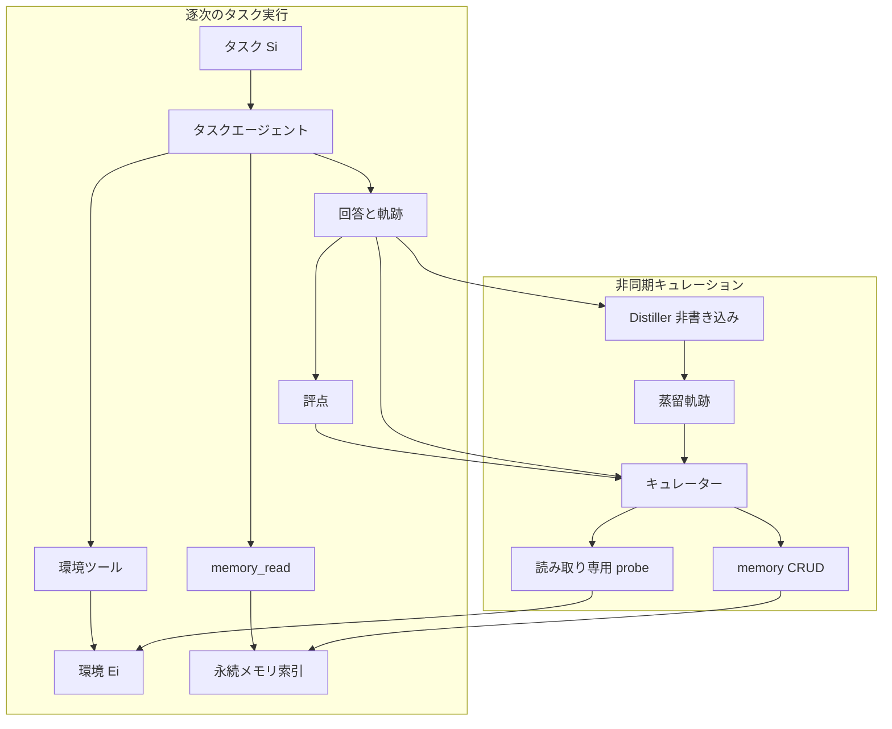

企業向けエージェントに「前回うまくいった手続」を残すと、次のセッションの探索は短くなります。同時に、誤った一般化や陳腐化した知識も残ります。Microsoft Corporation（Redmond）の Susheel Suresh、Hazel Mak、Sahil Bhatnagar、Chhaya Methani、Alejandro Gutierrez Munoz は、この書き込みをタスク実行から切り離し、候補記憶を読み取り専用の世界ツールで確認してから commit する方式を提案します。論文は [arXiv:2609.11060v1](https://arxiv.org/abs/2609.11060)（投稿 2026-09-10）です。本稿は arXiv v1 初稿を正本にします。会議採録は確認していません。

この記事では次を整理します。

- 環境プローブ付き記憶キュレーションが、誰に何を渡し、何を渡さないか
- 公開数値をどこまで読んでよいか
- 記憶 CRUD と業務システムの書き込みを分ける判断を、どの条件で採用するか

対象読者は、エージェント記憶の書込み権限と業務システムの書込み権限を分けるかを判断する発注側です。

*この記事の全体像。以下、順に解説します。*

## 環境プローブ付き記憶キュレーションとは

環境プローブ付き記憶キュレーション（environment-probing curation）は、完了したタスク軌跡だけを見る非同期キュレーターに、least-privilege の読み取り専用世界ツールを渡す方式です。キュレーターは候補記憶を確認し、範囲を限定し、必要なら更新してから commit します。タスクエージェント、検索器、記憶スキーマ、本番システムへの書き込み権限は変えません。

完了したタスク軌跡だけを見る非同期キュレーターは、誤り・過度の一般化・陳腐化した知識を保存しえます。probe は、その書き込み前に世界側の根拠を取りにいく工程です。

実験は GitHub Copilot SDK 上のハーネスで、CLBench のデータベース探索と、APEX から再構成したコンサル 90 問を使います。主実験モデルは gpt-5.4（xhigh）です。交差確認は Sonnet 4.6（high）と Opus 4.7（xhigh）です。

### 役割の分け方

役割は実行レーンとキュレーションレーンに分かれます。記憶への書き込みと、業務環境への書き込みは同じエージェントに載りません。

- タスクエージェントは毎回新しいセッションです。環境ツールと `memory_read` のみを持ち、記憶 CRUD は持ちません。
- キュレーターはタスク終了後の別 LLM です。`memory_create` / `update` / `delete` の唯一の書き手です。
- Distiller は非書き込みです。軌跡を圧縮します。terminal feedback も世界ツールも持ちません。
- キュレーターは propose-probe-commit です。読み取り専用の probe で、関係の再利用性、短い経路、別スライス、前提条件、未訪問状態、ドリフトを調べます。
- 安全な読み面が無いときは、軌跡のみキュレーションへ戻ります。
- 再学習はしません。既存コネクタ / MCP の部分集合を想定します。
- 報告コストはタスクエージェント応答フェーズのみです。distill / curate は別計上で、本文には載っていません。

上段はユーザー待ち時間の中にあります。下段はクリティカルパスの外にあります。世界への書き込みはキュレーターに渡しません。

論文 §1 は、軌跡だけを根拠にするキュレーションの失敗を 5 種に分けます。

1. インスタンス答えの暗記
2. 非効率経路の継承
3. 検証できない適用範囲
4. 未訪問領域の盲点
5. 環境ドリフトによる陳腐化

CLBench の定性例（Appendix E、selected）では、軌跡のみが「AVG(prc_usd) は約 52.96、正解は 96.23」という失敗警告を残し、Probe は join キー・フィルタ・粒度・現行スキーマ名を書きます。著者は selected traces が集計効果の証明ではないと明記します。

### 出荷製品との位置関係

論文の共有スキーマ索引と、出荷中の製品記憶は同じものではありません。

| 対象 | 一次 | 論文との関係 |
|---|---|---|
| Copilot Studio Memory (preview) | [Learn](https://learn.microsoft.com/en-us/microsoft-copilot-studio/agents-experience/memory-overview)（updated 2026-08-03） | 機能はある。**per-user**、maker 不可視、28 日無操作削除、group chat / Teams 無効。同一エージェントが Capture→Store→Apply。別キュレーター公式なし |
| Copilot Studio connectors / MCP | [connectors](https://learn.microsoft.com/en-us/microsoft-copilot-studio/advanced-connectors)、[MCP](https://learn.microsoft.com/en-us/microsoft-copilot-studio/agent-extend-action-mcp) | ツール部分集合の選択はある。curator 専用 read-only 手順は確認できなかった。Memory は GitHub Copilot harness、上記 2 ページは standard harness 注記 |
| Claude Managed Agents Memory | [Docs](https://platform.claude.com/docs/en/managed-agents/memory) | 既定 `read_write`。`read_only` はオプション。untrusted input 時の write は後続セッションへ注入が残ると警告 |
| Claude Dreams | [Docs](https://platform.claude.com/docs/en/managed-agents/dreams) | store + 1から100 transcripts。入力 store は改変しない。世界ツール入力は確認できなかった。論文の「軌跡のみ curator」側 |
| GitHub Copilot SDK | [copilot-sdk](https://github.com/github/copilot-sdk)（2026-09-12） | 実験ハーネスの一次。非 archived。star 約 10.5k（2026-09-12）。`pushedAt` 2026-09-11。default ブランチ最新コミット日とは一致しない場合がある |

## 注意点

Abstract の「pass 39% → 73%、reward 8.60 → 22.60、task-agent cost $3.38 → $1.68」は **No Memory 対 Probe** です。Table 1(a) では Mem 導入だけで pass は 39% → 70%、Probe 追加は 70% → 73% です。Mem の pass は 70 ± 16、Probe は 73 ± 5（n=5、95% Student-t）です。区間は重なります。論文 §5.3 は APEX の世界差についても「uncertainty intervals overlap」と書き、サブグループ効果としては未確定とします。

報告ドルはタスクエージェントのみです。Table 1 / 2 のキャプションと Appendix B.3 は distillation / curation を除外すると書きます。curator の probe 費用は「tracked separately」とありますが、本文・表に数値はありません。総所有コストの削減は一次未確認です。

「production-like / 既存プラットフォームへ足せる」は、GitHub Copilot SDK ハーネスと Copilot Studio / Claude Memory の存在を指します。Copilot Studio Memory（preview）は **ユーザー単位の私的記憶** であり、論文の共有スキーマ索引ではありません。connectors / MCP の Learn ページに「非同期キュレーターへ read-only subset を渡す」公式手順は確認できませんでした。Claude Dreams の入力は memory store と session 転写だけです。世界ツールは公式入力にありません。

権限分離の測り方も取り違えやすいです。論文が固定したのは **記憶 CRUD をキュレーターに閉じること** です。タスクエージェントの環境ツールは残ります。APEX は成果物生成（Archipelago）を含みます。「タスクエージェントから業務 write を全廃する」は実験条件ではありません。

## 実験が示したこと

記憶の有無は、タスク実行の探索を減らします。CLBench drift（40 問、GPT-5.4、n=5）は次です。

| 構成 | Pass (%) | Total reward | Queries/問 | Task-agent cost |
|---|---|---|---|---|
| No Memory | 39 ± 4 | 8.60 ± 0.83 | 8.8 ± 0.3 | $3.38 ± 0.70 |
| Full ICL | 61 ± 11 | 21.39 ± 3.83 | 3.0 ± 0.2 | $2.01 ± 0.23 |
| Mem | 70 ± 16 | 20.00 ± 6.52 | 5.6 ± 1.4 | $1.99 ± 0.65 |
| Mem + Env Probing | 73 ± 5 | 22.60 ± 2.07 | 4.7 ± 0.3 | $1.68 ± 0.14 |

Full ICL はクエリ最少ですが、入力 5.42M tokens です。索引付き記憶は 2.13M、Probe は 1.69M です。ドリフト後の累積 reward は Probe 0.565、Mem 0.500、No Memory 0.215（学習曲線の終点）です。

APEX 再構成（6 世界、90 問）では、memory 系 3 構成 × 6 世界の 18 比較すべてが no-memory より mean reward が高いです。タスクエージェントのツール呼び出しは baseline 平均 30.0〜71.6 が 13.9〜28.4 へ落ちます（Table 3）。最大削減は世界 941eba66 で、71.6 回が 17.7〜19.3 回です。入力 53.92M が 6.56〜7.67M、task-agent cost $54.30 が約 $7〜$9 / run です。

Probe は「あると良い」ですが、必須とは言い切れません。Probe は 5/6 世界で task-agent reward/$ が最良です。世界 075ef4df では Mem が 0.274/$、Probe が 0.271/$ です。世界 941eba66 の絶対 reward は Mem 8.56 ± 0.64、Probe 8.52 ± 2.01（差 −0.04）です。2a87e5cb と d1b705c7 では Full ICL の絶対 reward が Probe を上回ります。

no-drift 30 問では Probe の lift が両モデルで Mem より大きいです（Sonnet +0.421 vs +0.351、Opus +0.263 vs +0.252）。

共有される環境知識（スキーマ、join、ファイル地図）を記憶するなら、**タスクエージェントに記憶 write を渡さず**、書き込み前に根拠と適用範囲を確認する非同期工程を置く価値があります。その確認手段として読み取り専用 probe は有力ですが、CLBench/APEX では「記憶があること」が主効果で、probe 追加は条件付きです。

支持側の材料は次です。

- 役割境界が明確です。記憶 write と本番 write を同一セッションに載せません。
- Full ICL より入力が小さいです。長期運用でコンテキストが線形増加しません。
- ドリフト境界後も Probe が先行する学習曲線です。
- Claude Memory 公式が、untrusted input + `read_write` の注入を警告しています。論文の「タスク側は read-only」と方向が一致します。

反証側の材料は次です。

- Mem vs Probe の CLBench 区間は重なります。39%→73% を probing 単独の効果と読むのは過大です。
- APEX 1 世界で Probe が Mem より悪いです。2 世界で Full ICL の絶対 reward が上です。
- distill/curate 費用は未掲載です。Probe は curator に追加ツールを使います。
- 論文に Limitations 節がありません。n=5（APEX no-memory は n=3）です。
- APEX は原 480 独立タスクではなく、consulting を 6 世界 90 問の継続学習に並べ替えたものです。CLBench は難読 SQLite です。
- [Agents Trust Tools Too Much](https://arxiv.org/abs/2609.05587): P1（もっともらしい改竄）の Adoption は全ツールで 1/3 超、Web search で 68.0% です。読み取り専用は過信を消しません。
- Meta Agents Rule of Two（[2025-10-31](https://ai.meta.com/blog/practical-ai-agent-security/)）: 非信頼入力・機微データ・状態変更を同一セッションに揃えるな、です。キュレーターは軌跡（非信頼）+ 世界読み（機微）+ memory write（状態変更）を同時に持ちます。
- MemGuard の verifier-only 対照は ReasoningBank より 15/16 設定で改善します。MemGuard 本体は 16/16 で最良です。世界再クエリ以外の代替があります。
- Remember / Verify / Ask（[arXiv:2608.19564](https://arxiv.org/abs/2608.19564)）は不確実なら persist せず clarify します。本論文の curator にユーザー確認はありません。

[CVE-2025-32711](https://nvd.nist.gov/vuln/detail/CVE-2025-32711)（M365 Copilot、NVD / MSRC）は AI command injection によるネットワーク経由の情報開示として実在します。記憶への残留は本 CVE の主張範囲外です。本論文実装への直接適用ではありません。

未解決の問いは次です。

- curator / distiller の USD とレイテンシはいくらか。総費用で Probe は得か。
- 安全な read-only MCP を Copilot Studio の GitHub Copilot harness 上で、Memory と同時に curator へ割り当てられるか。公式手順は未確認です。
- probe が plausible だが誤った SELECT / 文書を返したとき、commit を止められるか。本論文は過信実験を持ちません。
- 共有業務記憶と Copilot Studio の per-user Memory をどう同居させるか。
- 記憶 write を持つキュレーターを Rule of Two の 2 権限に収める分割（例: probe 専用エージェントと commit 専用エージェント）は未検討です。

権限分離と非同期キュレーションの採用は、これらの未解決点だけではブロックしません。「probe 必須」「総費用が下がる」「Studio Memory にそのまま載る」は確信度を下げます。

書き込み前の根拠で並べると、次の3方式になります。

| 基準 | 軌跡のみ curator（Mem / Dreams） | Env probing curator（本論文） | Verifier 永続化（MemGuard） |
|---|---|---|---|
| 書き前の根拠 | 軌跡・評点・既存記録 | 上記 + 読み取り専用世界観察 | 軌跡検証スコア。世界再クエリではない |
| タスク時間の面 | コンパクトな memory_read | 同じ | 検索時に verifier メタデータを使う |
| 測った費用 | タスク実行費 | タスク実行費のみ公開 | 検証トークンとレイテンシを付録で報告 |
| 本番製品 | Dreams が出荷（research preview） | Copilot Studio への公式手順は未確認 | 研究実装 |
| 弱点 | 未観測状態とドリフトを回復できない | probe 過信、注入入口増、総費用未公表 | verifier 誤ラベルが残る |

最適条件は次です。

- 軌跡のみ: 環境に安全な読み面が無い。または軌跡がすでに実行可能な手続を含む。
- Env probing: スキーマ・ファイル地図・join のように、短い読み取りで範囲を確定できる共有環境知識。
- Verifier 永続化: 世界再クエリが許されないが、失敗軌跡の混入を抑えたい。

## 導入判断

採用するなら、測った範囲に合わせて次を固定します。

1. **記憶 CRUD と業務システム write を同一セッションに載せない。** これは論文が測った範囲と、Claude Memory の公式警告の両方に合います。
2. **書き込み前の非同期工程を置く。** 最低限は Dreams 型（軌跡 + 既存記憶の再編）です。環境知識（スキーマ、ファイル地図）が再利用の本体なら、読み取り専用 probe を足します。
3. **費用は 2 本で読む。** タスク実行費の削減と、distill / probe / commit の総費用を分けて計上します。論文の $3.38→$1.68 を総コストとしません。
4. **probe 結果も非信頼入力として扱う。** 適用範囲・鮮度・出典ツールを記録します。不確実なら commit せず、ユーザー clarify か provisional にします。
5. Copilot Studio 出荷 Memory を「組織の共有手続記憶」と同一視しません。per-user 私的記憶です。

逆転条件は次です。

- 安全な読み面が無い（論文自身のフォールバック）。
- 軌跡がすでに実行可能な手続を含み、Mem と Probe の差が区間内。
- curator 総費用がタスク実行の節約を上回る（数値は未公表なので、導入時に測る）。
- 共有索引がテナント分離より先に立つ設計（毒入れが記憶へ永続化する）。

直近の次のアクションは次です。

1. 自前ハーネスで、タスクエージェントから記憶 write を外し、run 終了後の curator にだけ CRUD を渡す。
2. curator のコネクタを SELECT / 文書読みに限定し、監査ログを残す。業務 mutation は渡しません。
3. 記憶レコードに lemma、適用範囲、provenance、確認時刻を必須にする。
4. ダッシュボードで task-agent USD と curator USD を分けて出す。論文が公開しなかった列を自前で埋めます。

## まとめ

環境プローブ付き記憶キュレーションは、タスク実行中のエージェントに記憶 write を渡さず、終了後のキュレーターが読み取り専用の世界観察で候補を再検証してから commit する方式です。CLBench と APEX 再構成では、記憶があること自体が探索と task-agent 費用を下げます。probe 追加の上積みは条件付きで、区間が重なる比較もあります。

出荷中の Copilot Studio Memory は per-user の私的記憶であり、論文の共有手続索引ではありません。読み取り専用でもツール過信は残るため、probe 結果を信頼済み根拠にはしません。採用するなら、記憶 CRUD と業務 write の分離、書き込み前の非同期工程、task-agent 費用と curator 費用の分計から始めます。

この記事が少しでも参考になった、あるいは改善点などがあれば、ぜひリアクションやコメント、SNSでのシェアをいただけると励みになります！

## 参考リンク

1. Suresh, S. et al. Grounding Agent Memory: Environment-Probing Curation for Enterprise Agents. arXiv:2609.11060v1, 2026-09-10. https://arxiv.org/abs/2609.11060
2. Asawa, P. et al. Continual Learning Bench. arXiv:2606.05661. https://arxiv.org/abs/2606.05661
3. Vidgen, B. et al. APEX-Agents. arXiv:2601.14242. https://arxiv.org/abs/2601.14242
4. Microsoft. Memory (preview). Copilot Studio. updated 2026-08-03. https://learn.microsoft.com/en-us/microsoft-copilot-studio/agents-experience/memory-overview
5. Anthropic. Using agent memory. https://platform.claude.com/docs/en/managed-agents/memory
6. Anthropic. Dreams. https://platform.claude.com/docs/en/managed-agents/dreams
7. GitHub. copilot-sdk. https://github.com/github/copilot-sdk
8. Yang, H. et al. Agents Trust Tools Too Much. arXiv:2609.05587. https://arxiv.org/abs/2609.05587
9. Wang, H. et al. MemGuard. arXiv:2608.21867. https://arxiv.org/abs/2608.21867
10. Li, B.; Yao, J.; Zheng, Z. Remember, Verify, or Ask? arXiv:2608.19564. https://arxiv.org/abs/2608.19564
11. Meta AI. Practical AI agent security (Rule of Two). 2025-10-31. https://ai.meta.com/blog/practical-ai-agent-security/
12. NVD. CVE-2025-32711. https://nvd.nist.gov/vuln/detail/CVE-2025-32711
