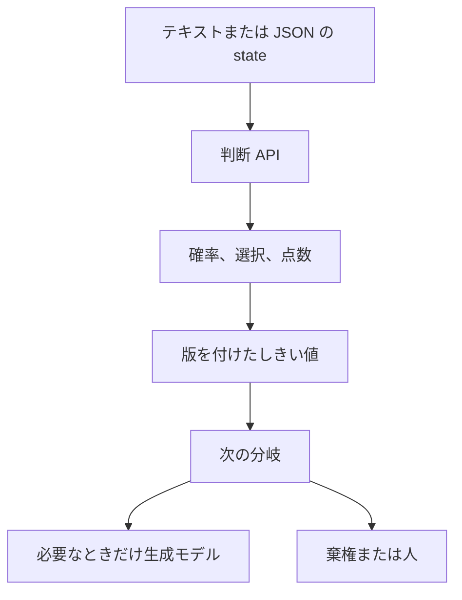
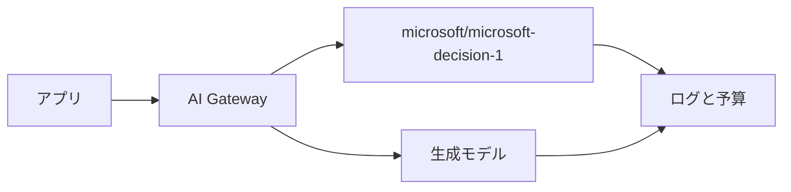
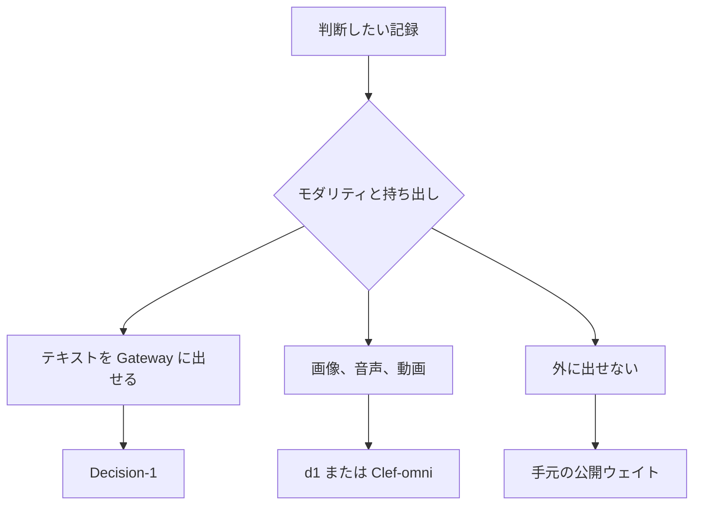

Microsoft Decision-1 は、あらかじめ決めた選択肢に対する確率、選んだ肢、段階の点数だけを返す判断モデルです。Vercel AI Gateway では、生成モデルとは別のエンドポイントから呼べます。必要な鍵は AI Gateway の API キーです。別の Azure アカウントや、モデルのデプロイは要りません。

この記事では、Gateway と Foundry の呼び方、質問の 3 型、しきい値の置き場所、テキスト以外の入力を分ける境界をまとめます。速度と精度の倍率は、Microsoft の自己申告です。

*この記事の全体像。以下、順に解説します。*

## Microsoft Decision-1 とは

Microsoft は、Alibaba のオープンウェイト Qwen3.5-9B を追加学習して Decision-1 を作ったと書いています。カタログの版は 1 です。ライフサイクル表示は Generally available です。

入力はテキスト、または JSON です。コンテキストは、Vercel のモデルページで 32,768 トークン、カタログでは 32K です。応答に載るのは、確率、選んだ肢、段階の点数です。自由文の理由は戻りません。

カタログは、公開データ（Microsoft の Open Data の手続き）と合成データで学習したと書きます。明示的な棄権と、安全フィルタも挙がっています。Command Line は、近く MAI と OpenAI のモデルへ載せ替えると書きます。

カタログは、用途の範囲も書いています。与信、雇用、住宅、保険、教育、医療、法的権利について、人を唯一の自動判断者として置き換えない、という範囲です。監視、プロファイリング、追跡、合法な言論の抑圧も、カタログの禁止に含まれます。

### Gateway で呼ぶ入口

Vercel AI Gateway のモデル ID は `microsoft/microsoft-decision-1` です。種別は evaluation です。最大出力トークンは 0 です。

呼び方は 3 つです。

- AI SDK の `experimental_decide`。パッケージ `ai` の 7.0.128 以降です。それより前の AI SDK 7 は、非推奨の `experimental_evaluate` です。
- OpenAI 互換の `POST https://ai-gateway.vercel.sh/v1/decisions`。
- TypeSafe 互換クライアント。

判断の呼び出しはログに残ります。生成モデルと同じ予算に数えられます。鍵も Gateway のものを使います。Chat Completions、Responses、Anthropic 互換、Cohere 互換のエンドポイントには、このモデルは載りません。

Command Line の記事本文は、入力 100 万トークンあたり 0.042 米ドル、出力の単価は 0 と書きます。同じ日に開いた Vercel のモデルページは、取得の仕方で価格と文脈長の表示が分かれます。内訳は後の節に置きます。Foundry のカタログカードに単価は無く、価格表へのリンクだけがあります。

### 質問型の名前は経路で違う

中身は同じ 3 種です。名前だけが経路で違います。

| 経路 | はい / いいえ | 複数の肢から 1 つ | 順序のある段階 |
| --- | --- | --- | --- |
| Foundry と TypeSafe | noul | choice | score |
| AI SDK | boolean | choice | score |
| OpenAI 互換 | predicate | choice | score |

score は、0 から始まる段階番号を、その段階の確率で加重した平均です。OpenAI 互換の choice は 1 から 255 肢です。score は 2 から 10 段階です。この上限は、互換 API の検証です。

### Foundry では同じモデルをデプロイする

Microsoft Foundry では、同じモデルをデプロイして `.../providers/microsoft/v1/systemone` を呼びます。

デプロイ型は 2 つです。DataZoneStandard は、選ばれたリージョンで推論をデータゾーン内に留めます。GlobalStandard は、対応リージョンのどこで処理してもよい型です。

認証は、Entra（スコープ `https://cognitiveservices.azure.com`）、または API キーです。デプロイには Cognitive Services Contributor が要ります。

Foundry のクォータページは、サブスクリプションの tier ごとに RPM を載せます。2026-10-11 に開いた Microsoft-Decision-1 の表では、Global Standard と Data Zone Standard のどちらも、次の RPM です。

| tier | RPM |
| --- | --- |
| Tier 1 | 60 |
| Tier 2 | 150 |
| Tier 3 | 225 |
| Tier 4 | 360 |
| Tier 5 | 500 |
| Tier 6 | 900 |

デプロイのレートは、設定した capacity と、割り当てた quota に依存する、と本文は書きます。TPM の列は、この表にはありません。同じページの Grok 表にある「capacity 1 単位あたり 1 RPM」は、Decision-1 の表には書いてありません。how-to の 429 は、指数バックオフか、クォータ追加のままです。

### 選択肢としきい値は呼ぶ側が持つ

1 回のリクエストに、同じ state へ複数の閉じた質問を載せられます。Foundry の手順は、質問をまとめてリクエスト数を減らすと案内します。

選択肢、段階、棄権は、呼ぶ側が定義します。棄権の例は `cannot tell` です。モデルは、選択肢の外の文を足しません。

応答は型付きの数値です。アプリは、確率の帯、選ばれた肢、段階の期待値で、次の分岐を書けます。

しきい値は、プロンプト本文ではなく、Gateway の decision fallback の条件か、アプリの設定に置けます。choice と score は `confidenceBelow` です。boolean と noul は `probabilityBetween` で、両端を含みます。choice と score の confidence は、答えの確率分布の集中度です。boolean の確率そのものではありません。

フォールバックはオプトインです。条件オブジェクトは先頭に 1 つです。成功応答への代替段は 1 つです。両段が課金されます。処理は直列です。代替段が失敗すると、一次の答えは返らず、一次の課金は残ります。一次が課金のあとで壊れた答えを返すと、500 になります。

言語モデルへフォールバックしたとき、TypeSafe 互換の面は `confidence: 0` と、空の `probabilities` を返します。これは測定値の 0 ではありません。自信度を持たない印です。有限でない自信度に対する `confidenceBelow` は、保守側で一致します。

### 同じ週に並んだ判断モデル

同じ週に、判断だけを返す隣接モデルが続いています。

Liquid のホスト版 d1（2026-10-05）は、テキストと画像を受けます。生成トークンは出しません。公開ウェイトの d1-3B と、実験的な d1-omni-600M は、2026-10-07 に置かれました。Cloudflare の Clef-omni（2026-10-09）は、音声、動画、画像、テキストを受けます。Cloudflare の AI Gateway から `@cf/cloudflare/clef-omni` として呼びます。

### 判断と生成の分かれ方

生成と呼ぶ面を分け、判断の結果だけを次の分岐に渡します。

Gateway では、判断と生成が別エンドポイントです。台帳は 1 つです。

入力の置き場所で、呼ぶ先が分かれます。

## 注意点

採用の理由に使ってよいのは、応答の形、エンドポイント、台帳、入力単価の表示、テキストのみというモダリティまでです。次の倍率や、「校正済みだから自動で実行してよい」という読みは、そのままでは成立しません。

### 精度と速度は自己申告である

Command Line の本文は、訓練から隠した 36 ベンチマーク、約 15 万問で最高精度だったと書きます。公開の JevBench 上位に加え、追加の 36 本（公開と非公開）でも最良だった、という一般化も本文にあります。

最速は、H2O-Lightning-4B v1.1 の 2.5 倍だと書きます。GPT-6 Sol の 35 倍でもあり、P50 も GPT-6 Sol の約 35 倍だと書きます。摂動 8 種での反転は平均 1.3% だと書きます。選択肢の説明の言い換えと、順序の反転・シャッフルでは 0 回だと書きます。

安全性は、11 ベンチマーク、5,250 リクエストで、有害な振る舞いは拒否し、有用性は保ったと書きます。見逃し率は本文にありません。第三者の再現を確認できる公開資料は、2026-10-11 時点では見つかっていません。

図の中の数値は、記事 HTML の本文にありませんでした。2026-10-11 に確認した Command Line の HTML 本文に、83.5、85 ms、92.2、147,137 はありません。チャートはウィジェットです。二次サイトの間でも、Jev を精度表に入れるかどうかが割れています。これらの数は、判断に使いません。編集注記は、初版のあとで Jev の精度と校正のベンチマークを足したと書きます。公開後に比較表が変わっています。

Decision-1 の本文に、ミリ秒の実測はありません。Microsoft 自身の枠組みでは、100 ms の判断を 20 段直列にすると 2 秒足される、という種類の計算がレイテンシの本体になります。チャートの 85 ms は、この計算に使いません。

### 社内事例の倍率が揃わない

Command Line は、Xbox Research の 1 万件超について、品質は GPT-6 Sol と競り、14 倍より速く、200 倍安いと書きます。Copilot は、本文の綴りのまま「GPT5.6 Luna」と競り、100 倍速いと書きます。付録の比較対象の名前は GPT-6 Luna Decisions で、綴りが揃っていません。

Discovery の適応的再計画は、LLM の点数より 46 倍一貫し、3 倍速く、再計画全体では約 4 倍速いと書きます。一方、Foundry Blog（Community Hub、2026-10-09）の抽出文は public preview です。Xbox は GPT-5 と競り、80 から 100 倍速い、という言い方です。

カタログは Generally available です。提供段階と事例の数字は、同じ週の一次資料の中で割れています。廃止日は見当たらません。MAI と OpenAI への載せ替えは予告です。完了した移行ではありません。

### 校正という言葉の指すものが割れる

Command Line とカタログは、calibrated probability と書きます。Learn は、点数を相対的な順序としきい値に使い、絶対的な校正値として扱うな、と書きます。

ブログが設計目標として書く「90% の予測は代表ケースでおよそ 10 回中 9 回当たる」は、公開された ECE ではありません。Gateway のフォールバック文書にある 0.6 は例です。Decision-1 の校正値ではありません。

校正を直すことと、人手なしで流してよい割合は別です。二次情報として、Accenture Japan 有志の経費精算実験があります。思考なしの Gemini 2.5 Flash の logprobs に温度スケーリング（T=2.8）をかけ、ECE が 0.186 から 0.057 へ、対数損失が 1.069 から 0.673 へ動きました。誤り 2% 以下で自動にできる割合は、3.5% から 4.0% でした。これは Decision-1 の測定ではありません。Learn の「絶対的な校正値にするな」と同じ方向の、別モデルの自己実験です。

同じ系列の事後分析では、言い回しが約 5% 混ざるだけで、厳しい誤り基準の自動化率が崩れた、とあります。本番の申請には、その種の文が混ざります。テスト 1 本の自動化率を、本番の見込みにしません。

### 文言の設計は別のテストである

Learn は、質問の文言と肢の順序で点数が変わり、問いが悪くても点数は返る、と書きます。二次情報として、日本語の公開モデル sokudan では、部署名に 1 行の説明を付けると 300 件の正解率が 0.880、説明を空にすると 0.537 でした。これは説明の有無です。言い換えではありません。

勘定科目のように、名前だけで範囲が伝わる肢では、同じ操作が 0.852 から 0.843 で、ほぼ動きませんでした。Command Line の「説明の言い換えとシャッフルで反転 0」は、説明を消した実験ではありません。両方を残します。どちらか一方で、質問設計を省略しません。

日本語の業務文での Decision-1 の偏りは、未確認です。Learn は English-tuned とは書いていません。その語は使いません。

### 価格と文脈長の表示が割れる

Command Line の本文、OpenRouter の掲載、モデルページの Markdown 取得は、入力 100 万トークンあたり 0.042 米ドルです。2026-10-11 の可視 HTML は `Input $0.04` と `33K` と、表の日付 `10 / 09 / 2026` を示します。33K は 32,768 の概数として読めます。0.04 は 0.042 の丸めとして読めます。請求の正本にはしません。

OpenRouter のページは、2026-10-11 の取得で返りました。URL は https://openrouter.ai/microsoft/microsoft-decision-1 です。画面は入力 0.042 米ドル、出力の単価は 0、FAQ のコンテキストは 32,768、カードの表示は 33K、リリース日は Oct 9, 2026 と書きます。同じページは、重みは継続して更新され、API の形は維持される、とも書きます。稼働率や遅延のダッシュボード数値は変動します。採用理由にしません。

Jev の応答例の出力トークンを、Decision-1 の usage として写しません。docs の TypeSafe 例の一次は `typesafe-ai/jev`、代替は `openai/gpt-6-astra` です。Decision-1 の usage ではありません。合計の `output_tokens` は 57 です。内訳は jev の 38 と、gpt-6-astra の 19 です。`confidence: 0` は、測れなかった印です。測った 0 ではありません。OpenAI 互換の `output_tokens: 0` の例は、gpt-6-luna-decisions のサンプルです。

言語モデルへフォールバックした段は、出力トークンを出します。Decision-1 の段と混ぜて、0 のままにしません。

### フォールバックは費用と遅延を足す

フォールバックは、しきい値をプロンプトの外に出せます。その代わり、予算とレイテンシが足されます。両段が課金され、処理は直列です。代替が失敗すると、一次の答えも捨てられ、一次の料金は残ります。

言語モデル側の `confidence: 0` を、「自信が無いので差し戻せ」と読むと、印を測定値と取り違えます。confidence を、boolean の確率とも読みません。

OpenAI 互換の型名 `predicate` を、`probabilityBetween` の対象だと名指しした文は、確認した fallback 文書にはありません。文書が名指しするのは、Boolean と Noul です。`predicate` へその条件を移せるとは、確認した文書には書いてありません。

### 経路ごとに閉じていない確認

リージョン一覧は、2026-10-11 に取得した可用性ページの本文に、名前がありませんでした。既定タブと、アジアの global タブを見ても、`Decision` はありません。DataZoneStandard の「selected regions」は、how-to の文言のままです。都市名の一覧には落ちていません。GlobalStandard は、処理場所が揺れる、と how-to は書きます。SLA の数値は how-to にありません。

Gateway の Changelog は、Azure アカウントもデプロイも要らないと書きます。呼び出し側が `DataZoneStandard` を選べるとは、確認した Vercel の文書にはありません。

Vercel 経路の RPM、TPM、同時実行は、未確認です。Foundry の表の数が Gateway に適用されるとは、書いてありません。互換 API の肢数と段階数の上限を、Foundry の上限と同一だと突き合わせた文書は、ありません。Foundry の利用明細で、出力トークンが 0 として記録されるかも、未確認です。Gateway の最大出力 0 からの推定に留まります。

ゼロデータ保持は、Decision-1 の Azure 行では未確認です。OpenAI 互換の文書に `zeroDataRetention: true` の例があります。このフラグが Azure 経由の Decision-1 で守られるとは、確認したページには書いてありません。2026-10-11 のモデルページの可視 HTML に、そのフラグの文字列はありませんでした。学習への利用オプトアウトの固有文も、未確認です。

Clef-omni の速さは、ベンダーの 2 ページで数字が違います。ブログは、テキスト中央値約 130 ms、画像約 150 ms、音声は数百 ms、音声付き 21 秒の動画約 1.5 秒と書きます。Changelog は、テキスト約 20 ms、画像または音声は 100 ms 未満、同じ動画約 300 ms と書きます。平均しません。

価格の表示は、Clef-flash が 100 万入力あたり 0.09 米ドルから 0.038 米ドル、Clef は 0.24 米ドルのまま、Clef-omni は 0.15 米ドルで開始、です。Vercel AI Gateway への掲載は、この 2 ページでは確認できません。20 ms と 130 ms のどちらが、どの条件の中央値かも、閉じていません。

Community Hub の public preview と、カタログの Generally available のどちらが、契約上の提供段階かも、閉じていません。独立したベンチマークと、チャート画像の元データも、HTML 本文からは取れません。

### 人に関わる最終判断は範囲の外である

人に関わる最終判断の置き換えは、カタログが範囲外にしています。説明が返らないので、監査に残せるのは、質問文、肢の文、しきい値の版、確率のログ、モデル版です。安全フィルタは、微妙な有害を見逃すことも、無害を止めることもある、と Learn は書きます。

確率が高いことを、実行の許可と読みません。監査証跡は、呼ぶ側が組みます。

## テキストの閉じた質問を前段に置く

テキストの分類、ワークフローの次の手順、ルーブリックの点数を、生成と同じ Gateway の予算で前段に置きたいときは、Decision-1 を使います。生成は、チャットや Responses のモデルに残します。分類、次の手順、ルーブリックは、`decide`、`/v1/evaluate`、`/v1/decisions` に出します。鍵と予算の台帳は、Gateway に残ります。

入力の限界費用は、おおよそ「入力トークン × リクエスト数 × 0.042 米ドル / 100 万」です。0.042 は発表本文の数です。同じ日の可視 HTML は 0.04 です。見積もりの置き方であり、請求の正本ではありません。出力トークンの列は、モデルページ上は 0 です。フォールバックした言語モデルの段は、ここへ混ぜません。

2026-10-11 時点の、呼ぶ面の違いは次のとおりです。速度のセルはベンダーの自己申告で、条件は揃っていません。

| 項目 | Decision-1 on Gateway | ホスト版 d1 | 公開 d1-3B | Clef-omni |
| --- | --- | --- | --- | --- |
| 日付 | Changelog の Markdown は October 9, 2026。モデル表のセルは 10/09/2026。OpenRouter の掲載は Oct 9, 2026。Command Line の見える日付は 2026.10.09 | 2026-10-05 | 2026-10-07 | 2026-10-09 |
| 入力 | テキスト、JSON。カタログは画像、音声、動画を受けないと書く | テキストと画像。Vercel 上のコピーは、記事時点でテキストのみ | テキストと画像 | テキスト、画像、音声、動画 |
| 出力 | 確率、選択、点数。最大出力トークン 0 | 生成トークン無し | 生成トークン無し | 判断の構造化出力 |
| 単価の表示 | 発表本文と OpenRouter は入力 100 万あたり 0.042 米ドル。同じ日の可視 HTML は 0.04。出力の単価は 0 | ベンダー比較表は入力 100 万あたり 0.04 米ドル。質問ごとに画像込みで課金 | 手元。API 単価は無い | 開始時 100 万入力あたり 0.15 米ドル |
| 台帳 | Vercel のログと予算を生成と共有 | Liquid 直、またはテキストなら Vercel / OpenRouter | 手元 | Cloudflare AI Gateway。Vercel 共有は未確認 |
| 速さの自己申告 | 本文にミリ秒は無い。GPT-6 Sol の約 35 倍、という相対表現のみ | テキスト 200 から 300 ms | Jetson Thor 16 ms、Orin 26 ms、Nano 50 ms。RTX 4090 は 8 ms | ブログと Changelog で割れる。前節のとおり |
| ベンチ | 自社の 36 本。図の百分率は本文に無い | 自社の 6 アプリ、各 1 回。方法の留保あり | Decision Index 0.2.1 で 48.57。自分で公式スコアラーを回し、リーダーボード投稿ではない。表では Winnow-12B の 50.02 が上 | 自社の 5 本。数値は別ノート |

d1 のホスト版は、1024×1024 の画像を 1,536 トークン（32×32 パッチあたり 1.5）として数える、と記事は書きます。質問を増やすと、画像を含むプロンプトが、質問の数だけ課金されます。Decision-1 の Foundry 手順は、同じ state に質問をまとめて、リクエスト数を減らす、という読みです。予算の分け方は、「出力が 0 だから安い」だけでは決まりません。リクエストの切り方で変わります。

Gateway のフォールバックを足すと、さらに 1 段の直列と、両方の入力料金が乗ります。

二次情報として、点検記録 48 件の比較（2026-10-03、JodyCraft）があります。Jev 1.13 の Zen の無償の枠と、ホスト版 d1 の有料枠が、即時要否で同じ 41/48、見逃し 0、過剰の同じ 7 件でした。Brier は 0.10 と 0.11 です。系統の一致は 37/48 と 32/48 で分かれました。著者は、モデル名より経路、枠、しきい値が結果を分けた、と書いています。d1 の無償の枠は、成功 11 回の中央値 15.4 秒、17 回中 6 回失敗で、同じ名前でも枠がゲートを壊しました。

## 画像と外に出せない記録は分けて測る

Decision-1 はテキストです。点検写真や音声は、この SKU に送れません。OpenAI 互換の文書は、テキスト専用の判断モデルへ画像を送ると 400 になると書き、例は Jev です。Decision-1 で 400 を確認した公開の記録は、2026-10-11 時点の確認範囲にはありません。

画像、音声、動画は Decision-1 に送りません。ホストで画像まで判断するなら d1 です。音声と動画までなら Clef-omni です。台帳が Vercel から離れることを、コストに入れます。

クラウドに出せない記録は、Gateway に送りません。手元の d1-3B（画像を含むとき）か、日本語テキストなら sokudan のような公開モデルを、同じラベル付き集合で測ってから、一次選別に入れます。公開ウェイトがあるので、配置の候補ではあります。Decision Index 48.57 は、ベンダーが自分で採点したものです。リーダーボード投稿ではありません。

近い公開記事は、2026-10-03 の、合成 48 件をクラウド API に送った比較です。ローカルの d1-3B の精度も、データを外に出さない条件も、未測定です。48 件のその記事を、手元の測定の代わりにしません。非輸出の点検記録を d1-3B で一次選別したときの見逃し、過剰、遅延は、公開記事では未測定です。

## しきい値はプロンプトの外で版を付ける

しきい値と、誤答に付いていた確率の帯は、プロンプトの外に出します。fallback の `when` か、設定ファイルの版です。Learn は、代表データで検証し、見逃しと過剰の費用からしきい値を置け、と書きます。

choice と score の条件は `confidenceBelow` です。boolean と noul の条件は `probabilityBetween` です。ドキュメントの 0.6 は、出発点にしません。

本番の前に、自分の 20 から 50 件で、見逃しと過剰の費用からしきい値を固定します。質問文、肢の説明、肢の順、しきい値の版、確率をログに残します。与信、雇用、住宅、保険、教育、医療、法的権利の最終判断には、このモデルを唯一の決定者にしません。

確認は、次の順です。

1. テキストの 1 本の分岐（部署、次の手順、ルーブリックの 1 問）を、`experimental_decide` と `microsoft/microsoft-decision-1` に載せます。生成の呼び出しとログが、別行で同じ予算に残ることを確認します。
2. 誤って自動で進んだケースの確率の帯を記録し、しきい値を設定ファイルの版にします。
3. 画像か、外に出せないデータが混ざる分岐は、このモデルの呼び出しから外します。手元の公開ウェイトで、同じラベルを測る実験を別に切ります。
4. ベンダーの 35 倍や「最高精度」は、主張にしません。使うなら、自己申告と取得日を残します。

## まとめ

Microsoft Decision-1 は、閉じた質問に対する確率、選択、点数だけを返すモデルです。Vercel AI Gateway では、生成とは別のエンドポイントで、同じ鍵と同じ予算の台帳に残ります。

テキストの分類、次の手順、ルーブリックの点数を前段に置くときは、しきい値とラベル付きの集合をプロンプトの外で版管理します。choice と score は `confidenceBelow`、boolean と noul は `probabilityBetween` です。言語モデルへ落ちた段の `confidence: 0` は、測定値として扱いません。

画像、音声、動画、外に出せない記録は、この SKU に送りません。速さ、精度、校正の絶対値、リージョン、Vercel 経路のレート、データの残留は、ベンダーの自己申告か、未確認のままです。発表の 0.042 米ドルと、画面の 0.04 米ドルは、同じ週の表示として併記します。与信、雇用、住宅、保険、教育、医療、法的権利の最終判断には、唯一の決定者として置きません。

この記事が少しでも参考になった、あるいは改善点などがあれば、ぜひリアクションやコメント、SNSでのシェアをいただけると励みになります！

## 参考リンク

- [Vercel Changelog, Microsoft Decision-1 now available on AI Gateway](https://vercel.com/changelog/microsoft-decision-1-now-available-on-ai-gateway)（Markdown の Published は October 9, 2026。著者は Jerilyn Zheng, Kevin Dawkins, Rohan Taneja, Zachary Chen）
- [Vercel, モデルページ](https://vercel.com/ai-gateway/models/microsoft-decision-1)（2026-10-11。可視 HTML は Input $0.04 と 33K、表の日付 10/09/2026。別取得の Markdown は 0.042 と 32,768、最大出力 0）
- [OpenRouter, Microsoft-Decision-1](https://openrouter.ai/microsoft/microsoft-decision-1)（2026-10-11。入力 0.042、出力の単価は 0、FAQ のコンテキスト 32,768、カードは 33K、Oct 9, 2026）
- [Microsoft Learn, Foundry Models quotas and limits](https://learn.microsoft.com/en-us/azure/foundry/foundry-models/quotas-limits)（2026-10-11。Decision-1 の tier 別 RPM。Vercel 経路の数ではない）
- [Vercel, Decision](https://vercel.com/docs/ai-gateway/modalities/decision)（`ai` 7.0.128、`experimental_decide`）
- [Vercel, OpenAI-compatible Decisions API](https://vercel.com/docs/ai-gateway/sdks-and-apis/openai-decisions)（last_updated 2026-10-08）
- [Vercel, decision fallbacks](https://vercel.com/docs/ai-gateway/models-and-providers/decision-fallbacks)（Last updated October 8, 2026。本文を 2026-10-11 に確認。旧パス `capabilities/decision-fallbacks` は 404）
- [Achint Srivastava, Introducing Microsoft-Decision-1](https://commandline.microsoft.com/microsoft-decision-1-model-foundry/)（見える日付 2026.10.09。schema の datePublished は 2026-10-10T01:35:51+00:00。HTML 本文を 2026-10-11 に確認）
- [Microsoft Foundry catalog, Microsoft-Decision-1](https://ai.azure.com/catalog/models/Microsoft-Decision-1)（2026-10-11）
- [Microsoft Learn, Deploy and use Microsoft-Decision-1](https://learn.microsoft.com/en-us/azure/foundry/foundry-models/how-to/use-foundry-models-microsoft-decision)
- [Microsoft Learn, Region availability for Foundry Models sold by Azure](https://learn.microsoft.com/en-us/azure/foundry/foundry-models/concepts/models-sold-directly-by-azure-region-availability)（2026-10-11 の取得本文にモデル名は無かった）
- [Microsoft Community Hub, Introducing Microsoft-Decision-1](https://techcommunity.microsoft.com/blog/azure-ai-foundry-blog/introducing-microsoft-decision-1-in-microsoft-foundry-for-decision-and-classific/4562742)（2026-10-09。public preview と Xbox の別倍率は抽出文）
- [Liquid AI, d1](https://www.liquid.ai/blog/d1-decision-model)（2026-10-05）
- [Liquid AI, Open d1](https://www.liquid.ai/blog/d1-open)（2026-10-07）
- [Hugging Face, Multimodal open d1](https://huggingface.co/blog/LiquidAI/open-d1)（2026-10-07）
- [Hugging Face, LiquidAI/d1-3B](https://huggingface.co/LiquidAI/d1-3B)
- [Cloudflare Blog, Clef-omni](https://blog.cloudflare.com/clef-faster-cheaper-multimodal/)（可視の日付は October 9, 2026。2026-10-11 に本文の約 130 ms、約 1.5 秒、0.15 米ドルを確認。旧パス `clef-omni-decision-model` は Page Not Found）
- [Cloudflare Changelog, Clef-omni](https://developers.cloudflare.com/changelog/post/2026-10-09-clef-omni-workers-ai/)（2026-10-09）
- [二次情報: JodyCraft, 点検記録 48 件](https://zenn.dev/jodycraft/articles/jev-d1-equipment-inspection-test)（測定日の自己申告 2026-10-03）
- [二次情報: Shinya Koike, Accenture Japan 有志](https://zenn.dev/acntechjp/articles/zenn-jev-on-google-cloud)
- [二次情報: GeneLab, sokudan](https://zenn.dev/genelab_999/articles/702c2f62a3c614)
