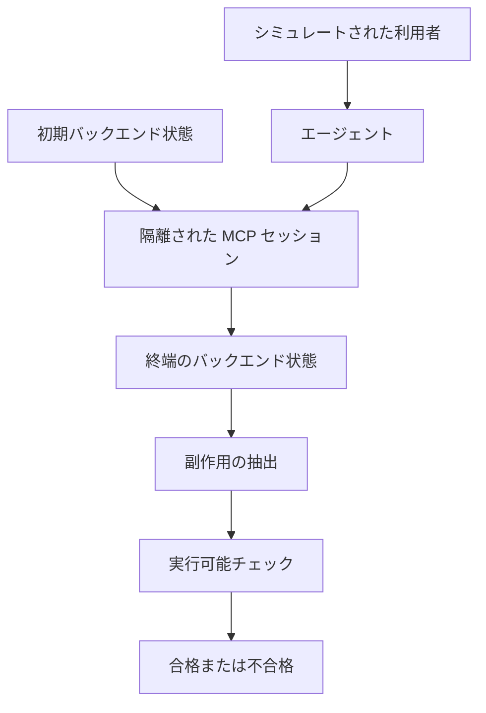

ThinkingBox は、業務エージェントを隔離された業務バックエンドの上で動かし、終了後の永続状態で合否を決めるサンドボックスです。その上の公開ベンチマーク ThinkingBox-Bench は、507 タスクから成ります。この記事では、1 回の試行が何を見て合格にするか、公開スコアに並ぶ指標がどの量を数えているか、自社の完了条件へ写すときの手順を順に説明します。

公開データセットの顧客と業務は、非公開の素材から再構成した合成例です。中心の論文は [arXiv:2608.19741v4](https://arxiv.org/html/2608.19741v4)（初版 2026-08-20、最終改訂 2026-10-01、[DOI](https://doi.org/10.48550/arXiv.2608.19741)、CC BY 4.0）で、会議採録の記載はありません。Microsoft Copilot Studio の著者らが論文を書き、2026-10-03 に [Hugging Face との共同解説](https://huggingface.co/blog/microsoft/thinkingbox)を公開しています。論文または検査コードと一致する数値は論文側の事実とし、ブログにだけある数値はブログ側と区別します。

*この記事の全体像。以下、順に解説します。*

## ThinkingBoxとは

ThinkingBox-Bench の各タスクは、初期状態、利用者の目標、ドメインのツール、シミュレートされた利用者、実行可能な検査、から成ります。1 回の試行はクリーンなバックエンドから始まり、隔離された MCP セッションの中で進み、終端状態の検査がすべて真のときだけ合格になります。

タスク数は 507 です。各タスクを 20 回、毎回クリーンなバックエンドから独立に実行します。ドメインの内訳は、小売 98、旅行・ホスピタリティ 104、自動車保険 100、ネオバンク社内 IT 104、コンサルティングの IT・人事 101 です。

507 件すべてが、終端のバックエンド状態を検査します。30 件（旅行 15、ネオバンク 15）は、最終応答の二値ルーブリックを追加します。残り 477 件は、状態と副作用だけを見ます。合否は二値検査の論理積です。部分点はありません。正しい終端状態に至る経路は問いません。欠けた更新、誤った更新、余分な永続効果は不合格になります。

ルーブリック判定と利用者シミュレータは、評価対象のエージェントによらず GPT-5.4-mini に固定します。報酬は終端かつ疎です。論文は、同じ判定を強化学習の報酬にも使えると書きます。

実行はローカルです。2026-10-06 時点の公式資料には、ホストされた ThinkingBox の API、RPM、SLA、リージョン指定は書かれていません。コードのライセンスは MIT です。ベンチマークデータ側の `dataset/`、`support/`、`releases/` は、LICENSE.txt が CDLA-Permissive-2.0 と書きます。テストケース Python の先頭コメントは MIT と書きます。v1.0 のデータセットカードは、タスク本文、期待結果、ゴールデン状態、ツール軌跡を、プロンプト最適化、ファインチューニング、強化学習、報酬モデルの学習に使うことを禁じています。

### 1回の試行

1 回の試行は、初期状態から隔離セッションを経て、終端状態の検査へ進みます。

検査器は、エージェントのプロセスの外にあります。モデルが見るのは、タスク、対話、ツールスキーマです。ゴールデン状態、アサーション、採点、資格情報は、評価器側に残します。公開タスクの終端状態は事前に保存されていません。評価時に期待ツール列を再生してゴールデン状態を作り、安定ハッシュと比較します。

### 小売タスクの検査

小売の代表例 `ST003_006` では、検査本体は `validate_database` だけです。この関数は、結果 DB のハッシュとゴールデン DB のハッシュを比べ、不一致なら失敗させます。差分テキストが空でも、ハッシュが違えば失敗します。

## 注意点

公開スコアは、合成業務の単一ゴールデン状態に対する点推定です。自社の完了判定へ写す前に、定義、分母、計測条件を分けます。

### 指標は4種類ある

| 名前 | 何を数えるか | 読み方 |
| --- | --- | --- |
| pass@1 | 試行のうち成功した割合 | 1 回の試行が通る割合 |
| pass@20 | 20 回のうち少なくとも 1 回成功する確率の不偏推定 | 能力の上限に近い |
| pass^20 | タスクごとの (成功回数/20)^20 の平均 | プラグイン推定。0 より大きく 20 未満でも 0 にならない |
| observed 20/20 | 20 回すべて成功したタスク数 / 507 | 推定も平滑化もしない実数 |

論文 v4 の信頼性表は点推定です。HTML 表の信頼区間は列がずれ得るため、ここでは区間を引用しません。並びの違いが出る例を、論文の点推定から挙げます。

Claude Opus 5 は、pass@1 が 66.50、pass^20 が 47.53、pass@20 が 79.09、20 回全失敗のタスクが 106、20 回全成功が 241 です。pass^20 の 47.53% と、241/507 の observed 20/20 は、報告桁で一致します。

GPT-5.4 は、pass@1 が 65.36、pass^20 が 30.62、pass@20 が 91.12、全失敗が 45、全成功が 128 です。pass@1 は Opus 5 に近く、pass@20 は高く、毎回成功するタスクは 128 です。

GPT-6 Astra は、pass@1 が 58.31、pass^20 が 46.89、pass@20 が 71.01、全失敗が 147、全成功が 231 です。pass@1 は GPT-5.4 より低く、20 回全成功は 231 です。

Kimi-K3 は、pass@1 が 57.37、pass^20 が 17.60、pass@20 が 93.89、全失敗が 31、全成功が 68 です。observed 20/20 は 68/507 で 13.41% であり、pass^20 の 17.60% とは一致しません。Qwen3.8-27B も、pass^20 の 10.93% と observed 20/20 の 38/507（7.50%）は一致しません。ブログが Kimi-K3 の「毎回」として書く 13.41% は observed 20/20 です。論文アブストラクトの pass^20 17.60% とは別の量です。

ブログの「残存 78% / 71% / 約 8%」は、observed 20/20 の率を pass@1 で割った比です。pass^20 を pass@1 で割った比ではありません。GPT-6 Astra は、231/507 = 45.56% を 58.31% で割ると約 78% になります。

### 論文の表とブログの表はモデル集合が違う

共有モデルの pass@1 は、ブログ表と一致します。ブログ表には Claude Opus 5.5（総合 pass@1 67.16、20/20 は 241）があり、MiniMax-M2.5 がありません。論文 v4 の HTML に `Opus 5.5` の文字列はありません。Opus 5.5 のスコアとコストは、Hugging Face ブログ側の数値です。

### 終端状態と最終応答

12 モデル × 507 × 20 = 121,680 の有効試行のうち、失敗は 79,853 です。この 12 モデルの名前は、論文の公開 HTML からは特定できません。Appendix D.2 の表見出しは HTML 化で落ちています。

論文本文は、失敗のうち 80.88%（64,586/79,853）が、クリーン終了かつ状態変更ツールの呼び出しであり、67.24%（53,697/79,853）はそれに加えて最終ツール応答が明示エラーを含まないと書きます。クリーン終了とは、空でない最終応答が `<DONE>` を含み、疑問文でないことです。この 67.24% は 12 モデルの集合に限ります。18 モデル全体の割合ではありません。

ブログは、同じ失敗集合について、誤ったフィールド値 77.61%、余分な効果 43.30%、必要な効果の欠落 25.36% と割り当てます。件数 61,973、34,575、20,250 を 79,853 で割ると、この 3 つになります。論文 HTML の本文にこの 3 つの百分率はなく、列名の落ちた表の件数とブログの文が対応します。3 つは重なります。この割り当ては Hugging Face ブログ側の記述です。

失敗シグネチャは、失敗試行だけを対象にしたモデル別シェアの非加重平均です。Tool usage 79.9%、Wrong state update 10.3%、Incomplete user resolution 7.0%、No state-changing action 2.9% です。論文は、観測ラベルであり、一意の原因ではないと書きます。Tool usage が高い例は、GPT-6 Astra 97.0%、Claude Opus 5 96.4%、GPT-5.4 89.6% です。状態を変えない失敗が 0.8% のモデルは、GPT-6 Astra、Claude Opus 5、DeepSeek-V4-Pro です。ブログが挙げる緩和策（リトライの分類、ツール面の縮小、不可逆変更の人間承認）は、このベンチマークでは効果を測っていません。緩和策の列挙はブログ側の記述です。

### ハッシュと業務上の意味

タグ `thinkingbox-bench-v1.0`（commit `fcaba4c1a9debec42fda7f15bf29fe6d6b46c431`）の Zendesk `Ticket` では、`subject` と `description` が `UnstableField` です。テスト検証から除外されます。`created_at` と `updated_at` は通常の文字列であり、ハッシュに入ります。利用者と組織のタイムスタンプは `UnstableField` です。

状態の意味が同じでも、チケット時刻が違えばハッシュは落ち得ます。件名と本文が違っても、ハッシュ対象のフィールドが一致すれば通り得ます。このずれが 507×20 の何件を落としたかは、公開ログからは数えていません。

空の差分かつハッシュ不一致で落ちる分岐は、コード上にあります。その組み合わせが公開キャンペーンの採点ログに出た記録は、公開資料の範囲では見つかっていません。

### 小売エピソードの3つの記述

ブログは、配送例外のチケットが `solved` のまま残り、要求は `hold` だった、という話を `ST003_006` から翻案したと書きます。

論文 Appendix D.4 Case 3 の失敗トレースは、既存チケットが見つからず、エージェントが ticket 7 を作り `solved` にし、最終文が `In the meantime? <DONE>` で終わると叙述します。支配的な診断ラベルは Incomplete User Resolution です。チケット状態の誤りは、実行可能チェックが追加で出す失敗です。

タグ `thinkingbox-bench-v1.0` の初期データには、ticket 20 がすでに `solved` で存在します。ゴールデンのツール列は新規作成ではなく、ticket 20 を `open` にしてから `hold` にします。検査は単一フィールドのアサートではなく、データベース全体の安定ハッシュです。小売タスクはバックエンド検査だけなので、状態が正しければ、利用者向けの文が違っても合格し得ます。このトレースは、状態検査で落ちています。

### 単一の終端状態

残した各タスクは、1 つのゴールデン終端状態だけを認めます。方針が衝突する複数の妥当な解決は、構築時に改訂するか落としました。507 は、ある会社の依頼分布の再現ではありません。

477/507 は、状態が合っていれば、利用者への誤報告を不合格にしません。著者は、LLM 判定の分散を主指標に入れないために、ルーブリックを全タスクへ広げなかったと書きます。状態検査は、伝達の忠実さを測りません。

利用者シミュレータは、全軌跡で GPT-5.4-mini です。評価対象の GPT-5.4 と同じモデルファミリーを共有します。追質問は最大 10 ターンです。事実を間違える利用者、目標を変える利用者、非協力な利用者は試していません。バックエンドのリセットは決定的です。シミュレート利用者の返答は、確率的であり得ます。

Appendix C.6.3 の監査は、追発話 19,390 件のうち、Ungrounded 1,227（6.33%）、Grounded 18,106（93.38%）、Disputed 57（0.29%）と自動ラベルしました。人間のレビューは、このラベルを置き換えていません。監査は対話履歴との局所的な整合であり、ベンチマークの合否を付け替えていません。6.33% を、成功率の水増し量としては使えません。

Appendix C.7 では、デコード失敗、テスト実行失敗、API エラー、その他のシステムエラーを、不成功の試行として数えます。observed 20/20 の未達には、モデルの誤りとハーネスの誤りが混ざります。

### 費用の読み方

論文の単価は、2026-09-20 の OpenRouter 上で、プロモーションを戻し、量子化を宣言したエンドポイントを除いた、最安の適格価格です。シミュレータ、ジャッジ、インフラ、下流の失敗コストは含みません。請求書そのものではありません。

成功 1 回あたりは、キャンペーン総額を成功試行数で割ります。dependable は、キャンペーン総額を、20 回全部成功したタスク数で割ります。論文の表で 20/20 が 0 のモデル（Grok-4.3、Qwen3.5-9B、Mistral-Large-3、MiniMax-M2.5）では、dependable は定義されません。

| モデル | キャンペーン総額 | 成功試行 | 成功 1 回 | 20/20 タスク | その 1 タスク |
| --- | --- | --- | --- | --- | --- |
| GPT-5.4 | $869.80 | 6,628 | $0.131 | 128 | $6.80 |
| GPT-5.6-sol | $800 | 6,278 | $0.127 | 82 | $9.76 |

$869.80 は 20 × $43.49 です。$43.49 / (507 × 0.6536) = $0.131 です。論文 D.6 の成功単価フロンティアは、GPT-5.6-sol $0.127、GPT-5.4 $0.131、Claude Opus 5 $0.475 です。ブログのフロンティアは Opus 5 を Opus 5.5 に置き換え、Opus 5.5 の価格だけ Anthropic サイトを使います。この置き換えはブログ側です。GPT-6 Astra の 20 × $86.03 = $1,720.60 を 231 で割った $7.45 も、ブログ側の計算です。

### 訓練コードの公開

論文 Section 5.1 は、507 件と交わらない訓練タスクがあり、訓練コードも公開したと書きます。ブログの文言は "RL training (coming soon)" です。この文言はブログ側です。2026-10-06 に `microsoft/thinkingbox-training` の GitHub API は 404 でした。README は、2026-10-03 のコミットで訓練リポジトリへのリンクを更新しています。

### 予約ツールの分岐

[microsoft/thinkingbox の issue #35](https://github.com/microsoft/thinkingbox/issues/35) は open です。作成は 2026-09-21、著者は alencheung です。タイトルは次のとおりです。

> `__reserved__server_tool` is routable from /call_tool and /mcp, bypassing the scenario tool allowlist

2026-10-06 時点の main の `call_tool` は、`tool_name` が `__reserved__server_tool` のとき、シナリオのツール辞書を見る前にサーバツール処理へ入ります。同じ分岐はコミット ea053ba9 にもあります。HTTP での到達は、公開情報だけでは確認されていません。公開された 507×20 の点数がこの経路で汚れた証拠はありません。CVE 番号は付いていません。2026-10-06 時点で、このハーネスに紐づく CVE は、NVD の `thinkingbox` 検索では見つかっていません。第三者による 507×20 の再実行で、論文の点推定を覆す結果は見つかっていません。

### 先行する終端状態の評価

論文自身が挙げる先行研究に、τ-bench / τ²-bench（終端 DB と pass^k）と、AppWorld（状態ベースの単体テストと副作用）があります。ThinkingBox が組み合わせとして主張するのは、方針に条件付けた利用者対話、リセット可能な業務 MCP、結果と副作用の検査、反復試行の信頼性、同じ判定を強化学習の報酬にすること、です。終端状態評価の最初の例、という読みは、論文の位置づけと合いません。

v1.0 の NOTICE は、τ-bench の航空シナリオ資産を別シナリオとして同梱します。507 タスクのスコアが τ-bench の写しである、という証拠はありません。

### ドメイン平均の母集団

ブログ表の 18 モデルについて、小売 pass@1 の単純平均は 59.52、自動車保険は 33.83 です。これはブログ表からの算出です。論文の 18 モデル（MiniMax-M2.5 を含み、Opus 5.5 を含まない）の平均ではありません。Claude Opus 4.6 の小売 68.62 と自動車保険 8.30 は、ブログ表の値です。

Toloka を共同開発者として書くのは、ブログだけです。論文 HTML の `Toloka` は 0 件でした。

### まだ閉じていない点

- 67.24% を出した 12 モデルの名前。Appendix D.2 の表見出しは HTML 化で落ちています。
- 空差分かつハッシュ不一致が、公開キャンペーンの採点ログに何件あるか。
- issue #35 の予約ツールが、エージェントの通常のツール経路から届くか。ソース上の分岐順は確認できます。HTTP 再現は、公開情報にはありません。
- Claude Opus 5.5 の実験条件。論文 v4 の表にはなく、ブログ表にだけあります。
- チケット時刻だけが違う失敗が、507×20 に何件あるか。
- 訓練リポジトリが非公開のままか、別名で公開済みか。2026-10-06 の `microsoft/thinkingbox-training` は 404 でした。
- `dataset/` 配下の MIT ヘッダと CDLA-Permissive-2.0 のどちらが利用者を縛るか。法的結論は出ていません。

## 完了を置く条件

採用する結論は、次の 2 つです。

1. 完了は、エージェントの外の実データで、必要な更新があること、禁止された余分な更新がないこと、未解決の例外が開いたままであること、を同時に満たすときに置きます。反復して報告するときは、pass@k（少なくとも 1 回）か、毎回か（observed k/k または pass^k）を、名前で書きます。
2. ThinkingBox-Bench v1.0 のゴールデンハッシュ、スコア、タスク本文を、自社の完了オラクルや強化学習の報酬にしません。

公開リーダーボードの順位で本番モデルを選ぶ、という読みは棄却します。同じ 507×20 での相対比較には使えます。合成であること、単一正解であること、システムエラーを不成功に含めること、価格スナップショットが請求書ではないこと、が重なります。

| 主張 | 支持 | 弱める条件 |
| --- | --- | --- |
| ツール成功は業務完了の弱い代理である | 12 モデルの失敗 79,853 件の 67.24% が、クリーン終了、状態変更ツール、最終ツールの明示エラーなし、を同時に満たす | 12 モデルの集合に限る。18 モデル全体の割合ではない |
| 終端状態の反復検査は自社へ移せる型である | 合否がエージェント外の永続状態にあり、欠け・誤り・余分を同時に落とす | 単一ゴールデン、477 件は利用者向けの文を見ない、ハッシュに入るフィールドが業務意味とずれ得る |
| 公開順位で本番モデルを選べる | 同じ 507×20 での相対比較には使える | 合成、単一正解、システムエラーを不成功に含める、価格スナップショットが請求書ではない |

## 報告で分ける3つの読み

自社の完了報告で、次の 3 つを混ぜません。

| 場面 | 読む指標 | 理由 |
| --- | --- | --- |
| そのモデルが一度は到達できるか | pass@1 と pass@20 | 能力の選別 |
| 記録が毎回正しくなければならないか | observed 20/20、または定義を書いた pass^k | 推定の種類を本文に残す |
| 操作ログが成功しているか | 補助 | 67.24% の失敗が、この代理をすり抜ける |

## 検収の手順

ThinkingBox は、完了判定を操作ログから業務状態の検収へ進めるときの測定器の 1 つです。本番の SLA そのものではありません。

1. 完了条件を 3 つに固定します。必要な更新がある。禁止した余分な更新がない。未解決の例外は開いたままである。検査はエージェントのプロセスの外で、実データの状態に対して行います。
2. 反復して報告する指標の名前を本文に書きます。少なくとも 1 回なら pass@k です。毎回なら observed k/k か pass^k です。Opus 5 の 47.53% と Kimi-K3 の 13.41% を、同じ pass^20 として 1 文に並べません。
3. 公開のゴールデンハッシュを自社のオラクルに輸入しません。不変条件は自社の業務で書き、ハッシュに入れるフィールドを列挙します。小売チケットの例では、本文は外れ、時刻は入ります。このずれを自社の検査で再現しません。
4. 状態に書けない要件だけ、狭い応答検査を残します。公開ベンチがそうしたのは 30 タスクです。
5. v1.0 のタスク本文、期待結果、ゴールデン状態、ツール軌跡を、プロンプト最適化、ファインチューニング、強化学習、報酬モデルの学習に使いません。
6. 順位を引用するときは、論文 v4 の 18 モデルとブログの 18 モデルを混ぜません。Opus 5.5 はブログ側に隔離します。

逆転条件は、自社の不変条件が単一の終端状態で書けない業務です。その業務では、この型の合否を主指標にしません。複数の妥当な解決を、公開ベンチは構築時に除外しています。

## まとめ

ThinkingBox は、隔離された業務バックエンドの終端状態で、業務エージェントの合否を二値検査の論理積として決めます。公開スコアを読むときは、pass@1、pass@20、pass^20、observed 20/20 を別の量として名前で残し、論文 v4 のモデル集合と Hugging Face ブログのモデル集合を混ぜません。自社へ移すのは、必要な更新、禁止した余分な更新、開いたままの例外、をエージェントの外の実データで同時に見る型です。公開のゴールデンハッシュとタスク本文は、自社のオラクルにも学習データにも輸入しません。

この記事が少しでも参考になった、あるいは改善点などがあれば、ぜひリアクションやコメント、SNSでのシェアをいただけると励みになります！

## 参考リンク

- Zhuochun Li ほか. ThinkingBox. arXiv:2608.19741v4. 初版 2026-08-20、最終改訂 2026-10-01. [HTML](https://arxiv.org/html/2608.19741v4) / [DOI](https://doi.org/10.48550/arXiv.2608.19741). CC BY 4.0. 会議採録の記載なし。
- Microsoft / Hugging Face. ThinkingBox ブログ. 2026-10-03. [huggingface.co/blog/microsoft/thinkingbox](https://huggingface.co/blog/microsoft/thinkingbox)
- microsoft/thinkingbox. 2026-10-06 時点で約 94 star、未アーカイブ、default branch の最新コミットは 2026-10-03. [github.com/microsoft/thinkingbox](https://github.com/microsoft/thinkingbox)
- microsoft/thinkingbox-data. タグ `thinkingbox-bench-v1.0` は commit `fcaba4c1a9debec42fda7f15bf29fe6d6b46c431`（tagger 日付 2026-08-17）. 2026-10-06 時点で約 18 star. [github.com/microsoft/thinkingbox-data](https://github.com/microsoft/thinkingbox-data)
- microsoft/thinkingbox issue #35. open. 2026-09-21. [github.com/microsoft/thinkingbox/issues/35](https://github.com/microsoft/thinkingbox/issues/35)
- Hugging Face dataset viewer. [huggingface.co/datasets/microsoft/ThinkingBox-Bench](https://huggingface.co/datasets/microsoft/ThinkingBox-Bench)
