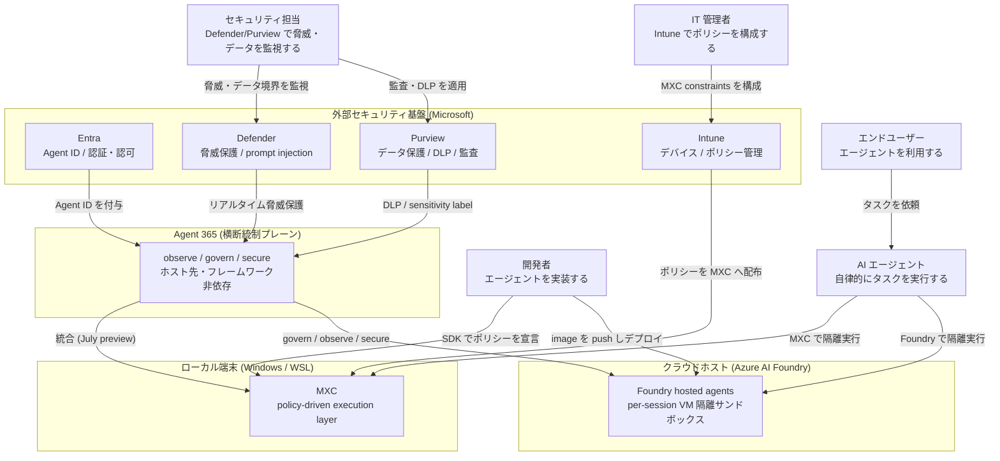
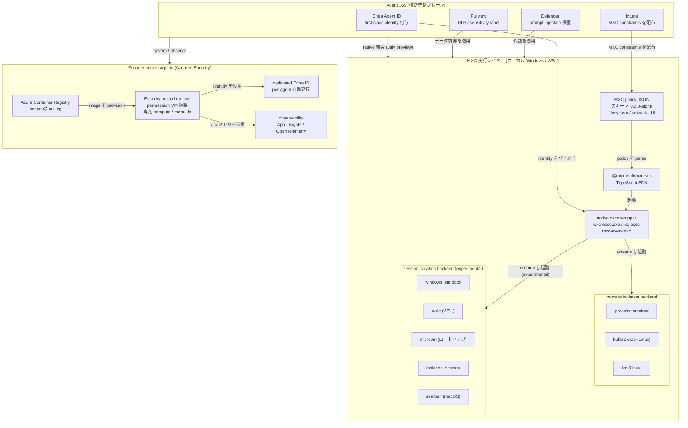
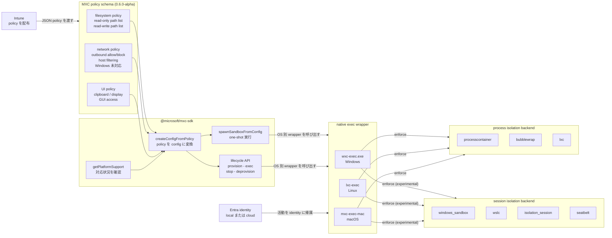
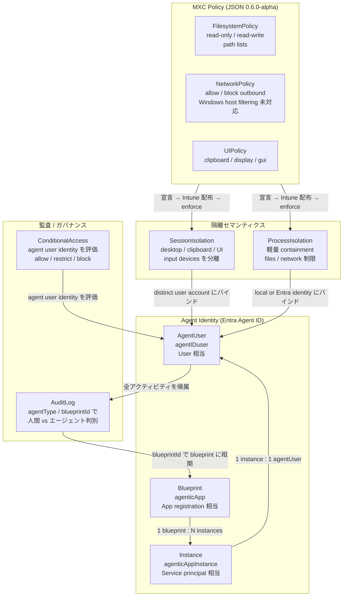
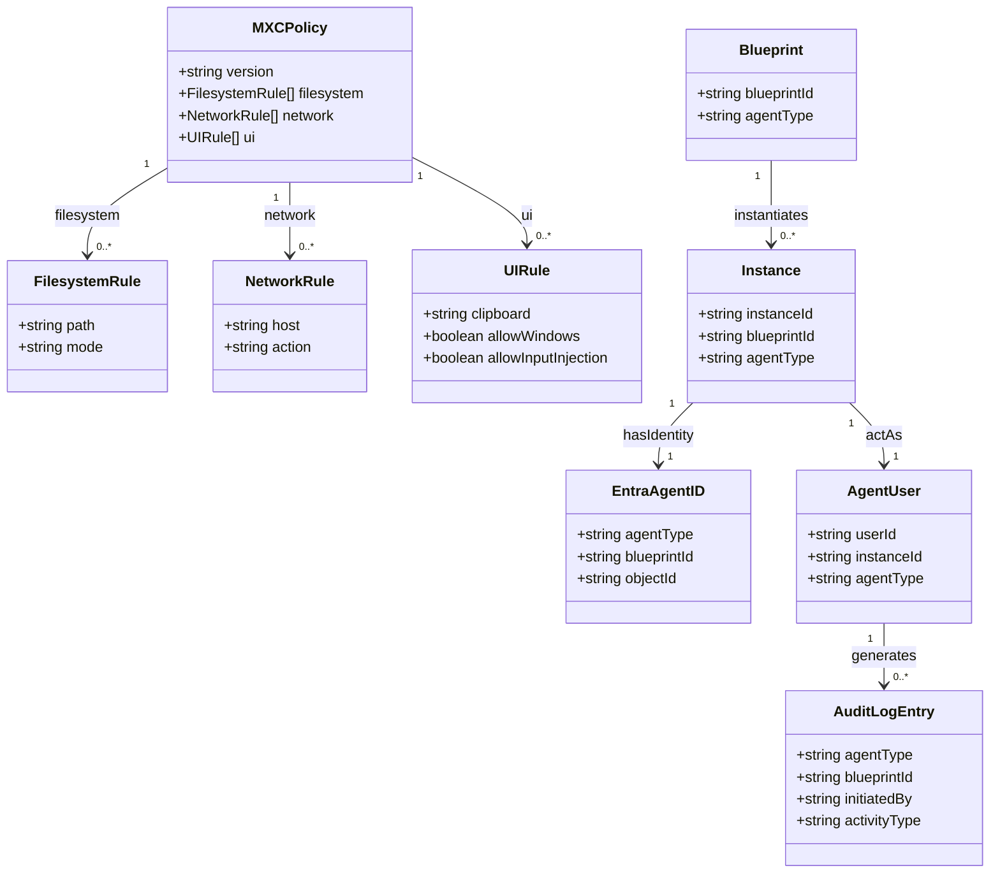

> 調査日: 2026-06-03 / 対象: MXC を中核に Agent 365 / Foundry hosted agents を含む「Windows をエージェント実行基盤にする」実行境界モデル
> 一次ソース: Windows Developer Blog（2026-06-02）、`microsoft/mxc` GitHub、Microsoft Build 2026 メインブログ、Microsoft Learn

## 概要

Microsoft は Build 2026（2026-06-02）で、AI エージェントを Windows / WSL 上で安全に動かす実行レイヤー **MXC（Microsoft Execution Containers）** をプレビュー公開しました。公式の定義は "a cross-platform, policy-driven execution layer for agents on Windows and WSL" です。開発者はエージェントに許すアクセス（ファイル・ネットワークなど）をポリシーとして宣言し、Windows が実行時にその境界を強制します。プラットフォーム全体の設計思想は "start secure and stay secure" と表現されています。

この発表は、AI エージェント導入の設計論点が「モデルが危険な指示を拒否するか（プロンプト）」から「**どの権限で、どの環境に閉じ込め、何を監査するか（実行環境）**」へ移ったことを示します。Microsoft はこれを 3 層で実装します。

- **MXC** … ローカル端末（Windows / WSL）でのエージェント隔離実行層
- **Agent 365** … ホスト先・フレームワークに依存しない横断統制プレーン（Entra / Defender / Intune / Purview を束ねる単一コントロールプレーン）
- **Foundry hosted agents**（Azure AI Foundry）… クラウドホスト型エージェントの per-session VM 隔離サンドボックス

ここで重要な留保があります。公式リポジトリ `microsoft/mxc` は **"no MXC profiles should be treated as security boundaries currently"**（現時点でどの MXC プロファイルもセキュリティ境界として扱うべきではない）と明示します。現状は early preview の実装途上です。network の host filtering / outbound allow-block は Windows 未対応であるなど、機能はプラットフォームごとに途上にあります。本記事は「方向性（OS レベルで実行境界を扱う）は妥当だが、隔離だけでは不十分」という多層防御の前提で整理します。

## 特徴

- **process isolation と session isolation の 2 段階隔離**。process isolation はユーザー環境内の軽量 containment でファイル・ネットワークアクセスを制限します（coding agent など responsive な用途向け）。session isolation は interactive desktop / clipboard / UI / input devices / active sessions をユーザー環境から分離し、UI spoofing / input injection / cross-session data leakage を緩和します（long-running ワークフロー向け）。一次ソースの語は一貫して "mitigates" / "helps reduce"（緩和）で、完全防御を主張しません。
- **JSON policy による宣言的制約**。ポリシーは JSON schema で宣言し、現行スキーマは `0.6.0-alpha`。Filesystem（read-only / read-write パスリスト）、Network（allow / block / host filtering）、UI（clipboard / display / GUI アクセス）の各制約を記述。
- **TypeScript SDK（`@microsoft/mxc-sdk`）**。低レベルの隔離詳細を直接扱わずにポリシーを定義できる抽象 SDK。one-shot 実行と状態管理ライフサイクルの両 API を備える。
- **クロスプラットフォーム実装**。ブログの打ち出しは Windows + WSL ながら、実装リポジトリは Windows / Linux / macOS の native wrapper をサポートし、複数の containment backend を 1 つの JSON schema と SDK の背後に統一。
- **Intune ネイティブ統合**。IT チームが Intune でポリシーを設定し、MXC が実行時に境界を強制。コンテナ内の全アクティビティはエージェントの local ID または Entra-backed identity に紐付き、full lifecycle governance を実現。
- **Entra identity によるエージェント/人間の識別**。session isolation はエージェントを distinct user account にバインドし、local ID または cloud-provisioned Entra identity を割り当て。人間とエージェントを明確に区別し、least-privilege access と auditability を担保。
- **Agent 365 との統合ロードマップ**。MXC 単体（SDK / process・session isolation）は Build 直後に Windows Insiders へ提供。Entra / Defender / Intune / Purview の 4 保護を組み合わせる Agent 365 native integration は July preview（2026 年 7 月）予定。
- **将来ロードマップ（未出荷）**。Micro-VM、Linux containers、Windows 365 for Agents との MXC 統合が公式ロードマップに記載（一次: "currently on our roadmap"）。

## 構造

### システムコンテキスト図



| 要素 | 説明 |
|---|---|
| 開発者 | SDK でポリシーを宣言し、エージェントを実装・デプロイ |
| IT 管理者 | Intune で MXC constraints を構成・配布 |
| セキュリティ担当 | Defender / Purview で脅威保護・DLP・監査を管理 |
| エンドユーザー | エージェントにタスクを依頼し、成果を受け取る主体 |
| AI エージェント | 自律的にタスクを実行する処理主体 |
| MXC（ローカル） | Windows / WSL 上の policy-driven execution layer。OS が runtime で実行境界を強制 |
| Agent 365 | ホスト先・フレームワーク非依存の横断統制プレーン |
| Foundry hosted agents | Azure クラウドの per-session VM 隔離サンドボックス |
| Entra | Agent ID を付与し、認証・認可・ライフサイクル管理を提供 |
| Defender | prompt injection を含むエージェント脅威のリアルタイム保護 |
| Intune | デバイス管理と MXC constraints のポリシー配布 |
| Purview | DLP / sensitivity label の継承、データ保護・監査トレイル |

### コンテナ図



| コンテナ要素 | 説明 |
|---|---|
| MXC policy JSON | filesystem / network / UI のアクセスを宣言する設定ファイル。Intune から配布 |
| @microsoft/mxc-sdk | ポリシーを読み取り native wrapper 経由で backend を起動する SDK |
| native exec wrapper | OS ごとにポリシーを実行時に enforce する実行体 |
| processcontainer / bubblewrap / lxc | process isolation backend。軽量 containment。one-shot 実行向け |
| windows_sandbox / wslc / isolation_session / seatbelt | session isolation backend（experimental）。stateful lifecycle を持つ |
| microvm | session isolation backend。ロードマップ記載・出荷時期は一次未確認 |
| Entra Agent ID | エージェントに first-class identity を付与 |
| Defender | prompt injection / shadow AI / URL フィルタリングのリアルタイム保護 |
| Intune | MXC constraints を構成・配布し lifecycle governance を実施 |
| Purview | DLP / sensitivity label 継承 / data security posture management |
| Foundry hosted runtime | per-session VM 隔離サンドボックス。専用 compute / memory / persistent filesystem |
| dedicated Entra ID | per-agent で自動発行される runtime identity |
| observability | Application Insights + OpenTelemetry traces による可観測性 |
| Azure Container Registry | Foundry がエージェント image を pull する源泉 |

### コンポーネント図



| コンポーネント | 説明 |
|---|---|
| filesystem policy | 読み取り・書き込みできるパスを宣言。Intune から配布 |
| network policy | 外向き通信の許可・拒否とホストフィルタリングを宣言。Windows では現時点未対応 |
| UI policy | clipboard / display / GUI アクセスを宣言 |
| createConfigFromPolicy | policy JSON を SDK 内部の config 形式に変換するヘルパ |
| getPlatformSupport | OS 別の backend 対応状況を確認するヘルパ |
| spawnSandboxFromConfig | one-shot 実行向けのサンドボックス起動 API |
| lifecycle API | stateful な session backend 向けのライフサイクル管理 API |
| wxc-exec.exe / lxc-exec / mxc-exec-mac | OS ごとにポリシーを runtime に enforce する native wrapper |
| processcontainer / bubblewrap / lxc | process isolation backend（default） |
| windows_sandbox / wslc / isolation_session / seatbelt | session isolation backend（experimental） |
| Entra identity | native wrapper が container 内の全活動を帰属させる identity |

## データ

### 概念モデル



| 概念 | 説明 |
|---|---|
| MXC Policy | エージェントへの access を宣言する JSON 設定。スキーマ 0.6.0-alpha。Filesystem / Network / UI の 3 カテゴリ |
| FilesystemPolicy | read-only / read-write のパスリスト。denied paths は Windows 未対応 |
| NetworkPolicy | allow / block outbound、host filtering。Windows では host filtering / outbound allow-block 未対応 |
| UIPolicy | clipboard / display / GUI アクセス制御 |
| ProcessIsolation | 軽量 containment。backend: processcontainer / bubblewrap / lxc。短命タスク向け |
| SessionIsolation | desktop / clipboard / UI / input devices を分離。distinct user account + Entra identity にバインド |
| Blueprint | エージェント設計図。App registration 相当。blueprintId で instance と相関 |
| Instance | 稼働インスタンス。Service principal 相当。1 blueprint : N instances |
| AgentUser | リソースアクセス用アカウント。人間の資格情報を使い回さない設計 |
| AuditLog | agentType / blueprintId を audit/sign-in ログに付与。Entra + Purview + Defender を横断 |
| ConditionalAccess | agent user identity をリアルタイム評価。risk に応じて allow / restrict / block |

### 情報モデル



| エンティティ | 説明 |
|---|---|
| MXCPolicy | `version`（SandboxPolicy のキー名。現行 `0.6.0-alpha`）/ `filesystem` / `network` / `ui` |
| FilesystemRule | `path` / `mode`（`read-only` または `read-write`。`denied` は Windows 未対応） |
| NetworkRule | `host` / `action`（`allow`/`block`。outbound allow/block と host filtering は Windows 未対応） |
| UIRule | `clipboard`（`none`/`read`/`write`/`readwrite`）/ `allowWindows` / `allowInputInjection` |
| EntraAgentID | `agentType`（`notAgentic`/`agenticApp`/`agenticAppInstance`/`agentIdentityBlueprintPrincipal`/`agentIDuser`）/ `blueprintId` |
| Blueprint / Instance / AgentUser | 三層の Entra identity。`blueprintId` で相関、1 blueprint : N instances、1 instance : 1 agentUser |
| AuditLogEntry | `agentType` / `blueprintId` / `initiatedBy` / `activityType` |

UIRule の display / gui の具体値域、Entra identity の objectId / upn / instanceId、ローカル MXC 単体の監査ログ API は一次本文で未確認です。Windows 未対応の network host filtering / denied paths は README に明記があります。

## 構築方法

### 前提（動作環境）

| プラットフォーム | デフォルト backend | その他 backend | 最小ビルド番号 |
|---|---|---|---|
| Windows 11 24H2+（25H2 で検証済み） | `processcontainer` | `windows_sandbox`, `wslc`, `microvm`, `isolation_session`, `hyperlight`（opt-in build / デフォルト非同梱） | processcontainer: build 26100 / isolation_session: build 26300.8553（Insider Preview） |
| Linux x64 / ARM64 | `bubblewrap` | `lxc` | bwrap または lxc ツールセットが別途必要 |
| macOS ARM64（x64 は公式互換表で未明示・`build-mac.sh --all` でビルドは可能） | `seatbelt` | — | schema `0.6.0-alpha` 以降 |

- Process / Session isolation は Build 2026 直後に Windows Insiders へ提供開始。
- `isolation_session` backend は Windows Insider Preview build 26300.8553 以降が必要。
- Experimental backend は `{ experimental: true }` または CLI フラグ `--experimental` が必要。
- Agent 365 × MXC の native integration（Intune/Defender/Entra/Purview 連携）は 2026 年 7 月 preview 予定です。MXC SDK 本体とは別タイムラインで進みます。

### SDK インストール

`@microsoft/mxc-sdk` を利用します（Node.js 18 以上）。

```bash
npm install @microsoft/mxc-sdk
```

### Windows ホスト準備（wxc-host-prep.exe）

Windows で AppContainer ベースの process isolation を使う場合、一度だけ管理者権限で `wxc-host-prep.exe` を実行します。

```bash
# AppContainer SID に C:\ ルートの最小権限 ACE を付与（一回限り、冪等）
wxc-host-prep.exe prepare-system-drive

# \Device\Null への AppContainer アクセスを設定（起動毎にリセットされるため毎回必要）
wxc-host-prep.exe prepare-null-device
```

`wxc-exec.exe` 自体は昇格しません。ホスト準備は必ず `wxc-host-prep.exe` 経由で行います。

### MXC policy JSON の作成

基本原則は次のとおりです。

- **デフォルト拒否（Default-Deny）**。明示しないフィールドは最も制限的な設定になります。許可したいものだけ宣言します。
- ポリシーは **SandboxPolicy**（意図を宣言）→ `createConfigFromPolicy()` → **ContainerConfig**（backend ごとの具体設定）の 2 段構成です。
- 現行 stable schema は `0.6.0-alpha` です。

SandboxPolicy の型定義（一次: docs/sandbox-policy/v1/policy.md）:

```typescript
type SandboxPolicy = {
  version: string;               // 例: "0.6.0-alpha"
  filesystem?: {
    readwritePaths?: string[];   // 読み書き許可パス
    readonlyPaths?:  string[];   // 読み取り専用パス
    deniedPaths?:    string[];   // 明示的拒否パス（Windows では未対応）
    tempDir?: "shared" | "isolated";
  };
  network?: {
    allowOutbound?:     boolean;
    allowLocalNetwork?: boolean;
    allowedHosts?:      string[];  // Windows では未強制
    blockedHosts?:      string[];  // Windows では未強制
    proxy?: { builtinTestServer: true } | { url: string };
  };
  ui?: {
    allowWindows?:        boolean;        // PowerShell 等の起動に必要
    clipboard?:           "none" | "read" | "write" | "readwrite";
    allowInputInjection?: boolean;
  };
  timeoutMs?: number;
};
```

`network.allowedHosts` / `network.blockedHosts` による host フィルタリングは Windows では現時点で未実装です。Windows でネットワークを制限する場合は ContainerConfig 層の `network.defaultPolicy`（`allow` / `block`）または `network.proxy` を使います。

policy JSON の最小例を示します。

**例 1: ファイルシステム read-only + ネットワーク遮断**

```json
{
  "version": "0.6.0-alpha",
  "filesystem": {
    "readonlyPaths": ["C:\\myapp\\src"]
  },
  "network": {
    "allowOutbound": false
  },
  "timeoutMs": 30000
}
```

**例 2: 特定ディレクトリのみ書込許可**

```json
{
  "version": "0.6.0-alpha",
  "filesystem": {
    "readonlyPaths": ["C:\\myapp\\src"],
    "readwritePaths": ["C:\\temp\\agent-output"],
    "tempDir": "isolated"
  },
  "network": {
    "allowOutbound": false
  },
  "timeoutMs": 60000
}
```

`clearPolicyOnExit` は ContainerConfig（低レベル）側のフィールドです。SandboxPolicy では一時領域の扱いに `filesystem.tempDir`（`shared` / `isolated`）を使います。

## 利用方法

### CLI — native binary での実行

```bash
# Windows
wxc-exec.exe config.json                          # ファイルパス指定
wxc-exec.exe --config-base64 <base64-json>        # Base64 エンコード設定
wxc-exec.exe --experimental config.json           # Experimental backend 有効化

# Linux / macOS
./lxc-exec config.json
./mxc-exec-mac --experimental config.json
```

`deniedPaths` および `network.defaultPolicy` は ContainerConfig 由来のフィールドです。`deniedPaths` は Windows では未サポート（Linux/macOS のみ有効）です。

### TypeScript SDK での利用

#### Process Isolation（one-shot / 軽量）— 推奨パス

```typescript
import {
  spawnSandboxFromConfig,
  createConfigFromPolicy,
  getAvailableToolsPolicy,
  getTemporaryFilesPolicy,
  getPlatformSupport,
} from '@microsoft/mxc-sdk';

if (!getPlatformSupport().isSupported) {
  throw new Error('MXC not available on this host');
}

const tools = getAvailableToolsPolicy(process.env);  // PATH / PYTHONPATH / JAVA_HOME 等
const temp  = getTemporaryFilesPolicy();             // %TEMP% / $TMPDIR

const config = createConfigFromPolicy(
  {
    version: '0.6.0-alpha',
    filesystem: {
      readonlyPaths:  tools.readonlyPaths,
      readwritePaths: temp.readwritePaths,
    },
    network: { allowOutbound: false },
    timeoutMs: 30_000,
  },
  'process',  // containment intent
);

config.process!.commandLine = 'python -c "print(\'hello from sandbox\')"';

const child = spawnSandboxFromConfig(config, { usePty: false });  // pipe モード
child.stdout!.on('data', (d) => process.stdout.write(d));
child.on('close', (code) => console.log('exit:', code));
```

#### Session Isolation — state-aware lifecycle（長時間 / agentic ループ向け）

現時点では `isolation_session`（Windows Insider Preview build 26300.8553 以降）のみ実装済みです。experimental backend のため起動時に experimental フラグを伴います。

```typescript
import {
  provisionSandbox, startSandbox, execInSandboxAsync, stopSandbox, deprovisionSandbox,
} from '@microsoft/mxc-sdk';

const { sandboxId } = await provisionSandbox('isolation_session');  // 1. プロビジョン
await startSandbox(sandboxId);                                       // 2. 起動

// 3. 複数コマンドを同一サンドボックスで実行
const r1 = await execInSandboxAsync(sandboxId, { process: { commandLine: 'echo hello' } });
const r2 = await execInSandboxAsync(sandboxId, { process: { commandLine: 'whoami' } });
console.log(r1.stdout, r2.stdout);

await stopSandbox(sandboxId);          // 4. 停止 → 解放
await deprovisionSandbox(sandboxId);
```

### Intune での MXC constraints 配布

Intune × MXC の native integration は 2026 年 7 月 preview 予定です。以下は公式ブログに基づく概念で、具体的な Intune ポリシープロファイルの UI/API 仕様は一次未確認です。

1. 開発者が `@microsoft/mxc-sdk` でエージェントコードに MXC ポリシーを組み込む。
2. IT 管理者が Intune から MXC constraints を組織全体のポリシーとして Windows デバイスに push。
3. Windows が runtime でポリシーを enforce し、エージェント実行時に境界を適用。
4. session isolation ではエージェントに local ID または Entra-backed identity が割り当たり、コンテナ内の全アクティビティがその identity に帰属。

### よくある落とし穴

- **PowerShell / GUI シェルが起動しない**。`ui.allowWindows` がデフォルト `false`。PowerShell を使う場合は `ui: { allowWindows: true }` を明示します。
- **Windows でネットワークの host フィルタが効かない**。`allowedHosts` / `blockedHosts` は Windows 未実装。SandboxPolicy では `network.allowOutbound: false` で遮断、ContainerConfig 層では `network.defaultPolicy: "block"` または proxy 経由で制限します。
- **Experimental backend が動かない**。`{ experimental: true }` または `--experimental` が必要です。
- **agentic ループで毎回 spawn するとオーバーヘッドが大きい**。`isolation_session` の state-aware lifecycle を使います。

## 運用

### 監査・ログ運用

Entra Agent ID の audit/sign-in logs が、現時点で最も詳細な公式スキーマを持ちます。

- **agentType による人間/エージェント判別**。`initiatedBy` / `targetResources` に付与される `agentType` で判定。`notAgentic` 以外はエージェント関与を示す。
- **blueprintId による相関**。どの設計のどのインスタンスが動いたかを後から追える。
- **agentSignIn イベント**。サインインログに `agentSignIn` イベント型が追加。
- **Entra admin center フィルタ**。Sign-in logs で「Agent type」「Is Agent」でフィルタ可能。

```text
GET https://graph.microsoft.com/beta/auditLogs/signIns?$filter=signInEventTypes/any(t: t eq 'servicePrincipal')
```

`/beta` エンドポイントは GA 前に変更が入る可能性があります。sign-in フィルタの `agentType` 値・構文は `/beta` 段階につき一次未確認です。実値は前掲の `agentType` 列挙に合わせて確認してください。

Windows 365 for Agents 環境では、次の 4 系統を相関させた end-to-end 監査トレイルを構成できます。

| ソース | 捕捉内容 |
|---|---|
| Agent 365 | 起点ユーザープロンプトとエージェントのタスク実行 |
| Entra sign-in logs | 人間ユーザーとエージェントユーザー identity の認証イベント |
| Microsoft Defender | セッションに紐付いた脅威シグナルとセキュリティイベント |
| Microsoft Purview | データアクセス・コンプライアンス・ガバナンス活動 |

Purview ドキュメントは「すべてのセキュリティコントロールが Entra Agent ID に依存する」と明言します。identity が監査の主キーになる設計です。ローカル MXC 単体の監査ログ API は公式ブログ本文で詳述が確認できず、詳細監査は Entra Agent ID / Purview / Defender 側に集約されます。MXC SDK は `--debug` フラグで ETW を出します。

### 権限運用

- **最小権限**。MXC はファイル・ネットワーク・UI へのアクセスを JSON ポリシーで宣言し OS がランタイムで強制します。denied paths / network host filtering は Windows 未対応です。
- **Conditional Access for Agents**。Windows 365 for Agents は CA ポリシーをエージェントの user identity に人間と同等に適用します。リスクに応じて allow / restrict / block を動的評価します。
- **Intune 集中管理**。MXC constraints を IT 管理者が集中構成・配布します。強制フローは Identity control（Entra）→ Pool assignment（Intune）→ Session establishment（Conditional Access）→ Resource access の順です。

### ライフサイクル運用

Foundry hosted agents と Windows 365 for Agents はライフサイクルモデルが異なります。

| 対象 | モデル | 特徴 |
|---|---|---|
| Foundry hosted agents | stateful | idle 15 分で deprovision・最大 30 日保持。専用 compute/memory に加え永続 filesystem（`$HOME`, `/files`）を持ち、30 日以内は resume 可能 |
| Windows 365 for Agents（Cloud PC） | stateless | "Reset after every agent session, with no state carried forward"。"every session ends with reset-and-return" で isolation / auditability / reuse を統一 |

Windows 365 for Agents では identity がデバイスではなくセッションにバインドされ、セッション間でリセットされます。セッション中は "human can observe the same session in real time and take over control" という監督 UI があります。Agent 365 GA 前に作成されたエージェントは新しい identity primitive を自動継承しないため、Entra Agent ID 付与には再公開が必要です（二次情報: Ragnar Heil）。

## ベストプラクティス

反証エビデンスを「誤解 → 反証 → 推奨」で整理します。

### 多層防御（隔離 + injection 対策 + identity + 監査）

- **誤解**: MXC でエージェントを隔離すれば、プロンプトインジェクションも防げる。
- **反証**: OS レベルの隔離は damage の封じ込め（blast radius 縮小）には効くものの、injection 自体は防げません。"Sandboxing shrinks the impact radius of a successful prompt injection; it does not prevent the injection itself."（二次情報: SoftwareSeni / digitalapplied）。自然言語入力は正規指示と区別不能で、技術的予防策が存在しません。Microsoft 自身が injection 対策を MXC とは別レイヤ（Defender）に割り当てており、「隔離 ≠ injection 防止」を事実上示します。
- **推奨**: 隔離（MXC / コンテナ）+ Defender（injection 検知）+ Entra identity（帰属）+ Purview/監査（事後追跡）の 4 レイヤを組み合わせます。「隔離で injection を防ごうとしない」を設計判断として明示的に記録します。

### MXC は現時点で本番のセキュリティ境界にしない

- **誤解**: MXC を本番環境のセキュリティ境界として依存できる。
- **反証**: `microsoft/mxc` が「no MXC profiles should be treated as security boundaries currently」「current policies generated by the MXC SDK ... are overly permissive」と明示します。最も強い隔離（microVM / Linux containers / Windows 365 統合）はすべて未出荷のロードマップ段階です。
- **推奨**: preview 段階の MXC は多層防御の一部として位置づけ、単独のセキュリティ境界として依存しません。公式警告文を設計ドキュメントに引用して残します。

### OS 隔離で過剰権限問題は解けない

- **誤解**: OS レベルで隔離すれば過剰権限や confused deputy も解決する。
- **反証**: "This is fundamentally an access control and credential delegation problem, not an operating system isolation issue."（SANS）。エージェントが複数ツールの credential を集約すると、個々は最小権限でも aggregate blast radius が許容外になります。Microsoft 自身の Semantic Kernel 研究も "Your LLM is not a security boundary. The tools you expose define your attacker's affected scope." を実証します。
- **推奨**: credential はシステム単位で個別に scope を切ります。RFC 8693 `act` クレームで委譲パスを明示し、「誰の代理で動いているか」を監査ログに刻みます。tool の露出設計を identity/権限設計と同等の優先度でレビューします。

### 自前基盤では公開標準で同等を組む（ベンダーロックイン回避）

- **誤解**: Agent 365 / Entra / Intune / Purview の垂直統合スタックがエージェント統制の唯一解。
- **反証**: "lock-in disguised as safety"（VentureBeat）。Entra / Intune / Defender / Purview への密結合で非 Microsoft 環境では適用できません。
- **推奨**: 自前基盤では公開標準で同じ 4 論点を組みます。

| MXC/Agent 365 の機能 | 公開標準での等価実装 |
|---|---|
| MXC containment backend | コード実行・書込を許すなら gVisor（user-space kernel, +20-50% overhead [二次情報]）または Firecracker microVM（KVM HW 境界, ~125ms boot [二次情報]）を 1 段重ねる |
| session isolation | 専用ユーザアカウント + Linux namespace + Xvfb / noVNC で再現。UI spoofing / input injection / cross-session leakage の 3 攻撃クラスに対応 |
| ブラウザ自動化の隔離 | 専用 Chrome profile + Playwright BrowserContext 分離 + 専用 Docker network での egress 制限 + DL を使い捨てディレクトリに固定 |
| Entra Agent ID | SPIFFE SVID + OAuth2 client_credentials。静的シークレットでなく workload identity federation で短命トークンに交換 |
| Entra actor / 委譲 | IETF `draft-oauth-ai-agents-on-behalf-of-user-00` + RFC 8693 `act` クレーム。`sub`=ユーザ / `azp`=アプリ / `act.sub`=エージェントをトークン+ログに刻む |
| Purview 監査 | OpenTelemetry GenAI semconv: `gen_ai.agent.id` / `execute_tool` span / `gen_ai.conversation.id`（`gen_ai.tool.name` は MCP semconv 側の属性）+ span 属性に `user.sub` / `act.sub` を付加 |

identity を先に立てると監査が後から効きます。Purview が「全セキュリティコントロールが Entra Agent ID に依存」と明言するとおり、自前でも identity レイヤを監査の主キーに据える設計順序を守ります。

### 責務を混ぜない（隔離 / identity / 委譲 / 監査 を独立レイヤに）

- **誤解**: 隔離さえ固めれば identity や監査は後回しでよい。
- **反証**: Microsoft 自身が MXC（隔離）/ Entra（identity）/ Purview（監査）を別製品として分離して実装します（意図的な責務分割）。MXC リポジトリには監査・identity 統合の記述がありません。
- **推奨**: 4 レイヤを独立して設計・実装し、各々を差し替え可能にします。隔離レイヤ障害が監査レイヤに波及しない設計（監査は隔離の外に置く）にします。identity なき監査（IP/timestamp だけ）は attribution 不能と認識します。

## トラブルシューティング

| 症状 | 原因 | 回避策 |
|---|---|---|
| Windows で network host filtering が効かない | `network` の host filtering / allow-block が Windows 未対応（一次: README） | Windows Firewall の outbound ルール / WSL 経由で Linux backend / 自前は専用 Docker network + egress proxy |
| denied paths が Windows で動かない | "denied paths not yet supported on Windows"（一次: README） | `readonlyPaths` + `readwritePaths` の allowlist 方式 / NTFS 権限 + ユーザーアカウント制御 |
| 非インタラクティブセッション限定で GUI エージェントが動かない | 初期リリースは non-interactive sessions のみ（一次: Blog） | 短期は process isolation か自前 Xvfb + noVNC / 中期は Windows 365 for Agents の interactive 対応を待つ |
| 最強隔離（microVM）が未出荷 | microVM / Linux containers / Windows 365 統合はロードマップ段階。"no MXC profiles should be treated as security boundaries currently"（一次: README verbatim） | 自前は Firecracker microVM / gVisor / 暫定で Windows Sandbox |
| GA 前エージェントが Entra Agent ID を持たず監査が空白 | identity primitive を自動継承しない。再公開が必要（二次情報: Ragnar Heil） | 既存エージェントを再公開 / 過渡期の監査空白を運用チームに周知 / Defender で未 onboard を発見 |
| Flex routing でデータが別リージョンに流れる | Foundry の Flex routing がピーク負荷時にデータを越境させうる（二次情報: Ragnar Heil） | Flex routing を明示的に無効化しリージョン固定 / 設定完了を CI/CD チェックに組み込む |
| Microsoft スタック以外で統制が効かない | MXC は Windows / WSL 中心。Agent 365 は Microsoft 製品に密結合 | 公開標準（Docker+gVisor/Firecracker、SPIFFE/SPIRE+OAuth2、RFC 8693、OpenTelemetry）で同等を組む |

## まとめ

Microsoft MXC は、AI エージェントの安全性を「プロンプトで拒否させるか」から「実行環境で何を許すか」へ移す動きを、Windows / WSL の OS レベル実装として具体化しました。ただし公式自身が「現時点でセキュリティ境界として扱うな」と警告するとおり、隔離だけでは不十分で、隔離・identity・委譲・監査を独立レイヤで組む多層防御が要点になります。自前基盤なら Microsoft 製品に縛られず、gVisor / Firecracker / SPIFFE / OAuth2 / RFC 8693 / OpenTelemetry GenAI semconv という公開標準で同じ 4 論点を実装できます。

この記事が少しでも参考になった、あるいは改善点などがあれば、ぜひリアクションやコメント、SNSでのシェアをいただけると励みになります！

## 参考リンク

- 公式ドキュメント / ブログ
  - [Windows platform security for AI agents（Windows Developer Blog, 2026-06-02）](https://blogs.windows.com/windowsdeveloper/2026/06/02/windows-platform-security-for-ai-agents/)
  - [Build 2026: Furthering Windows as the trusted platform for development（Windows Developer Blog, 2026-06-02）](https://blogs.windows.com/windowsdeveloper/2026/06/02/build-2026-furthering-windows-as-the-trusted-platform-for-development/)
  - [Microsoft Build 2026: Be yourself at work（The Official Microsoft Blog, 2026-06-02）](https://blogs.microsoft.com/blog/2026/06/02/microsoft-build-2026-be-yourself-at-work/)
  - [Hosted agents in Foundry Agent Service (preview)（Microsoft Learn）](https://learn.microsoft.com/en-us/azure/foundry/agents/concepts/hosted-agents)
  - [What is Microsoft Entra Agent ID?（Microsoft Learn）](https://learn.microsoft.com/en-us/entra/agent-id/identity-professional/microsoft-entra-agent-identities-for-ai-agents)
  - [Microsoft Entra Agent ID logs（Microsoft Learn）](https://learn.microsoft.com/en-us/entra/agent-id/sign-in-audit-logs-agents)
  - [Identity and security in Windows 365 for Agents（Microsoft Learn）](https://learn.microsoft.com/en-us/windows-365/agents/identity-security-secure-by-design)
  - [Agent session lifecycle（Microsoft Learn）](https://learn.microsoft.com/en-us/windows-365/agents/agent-session-lifecycle)
  - [Use Microsoft Purview to manage Agent 365（Microsoft Learn）](https://learn.microsoft.com/en-us/purview/ai-agent-365)
  - [When prompts become shells: RCE vulnerabilities in AI agent frameworks（Microsoft Security Blog, 2026-05-07）](https://www.microsoft.com/en-us/security/blog/2026/05/07/prompts-become-shells-rce-vulnerabilities-ai-agent-frameworks/)
- GitHub
  - [microsoft/mxc（policy JSON schema 0.6.0-alpha / @microsoft/mxc-sdk）](https://github.com/microsoft/mxc)
  - [@microsoft/mxc-sdk（npm）](https://www.npmjs.com/package/@microsoft/mxc-sdk)
- 公開標準・周辺技術
  - [draft-oauth-ai-agents-on-behalf-of-user-00（IETF）](https://www.ietf.org/archive/id/draft-oauth-ai-agents-on-behalf-of-user-00.html)
  - [RFC 8693 OAuth 2.0 Token Exchange](https://www.rfc-editor.org/rfc/rfc8693)
  - [OpenTelemetry GenAI semantic conventions](https://opentelemetry.io/docs/specs/semconv/gen-ai/gen-ai-agent-spans/)
  - [SPIFFE/SPIRE concepts](https://spiffe.io/docs/latest/spiffe-about/spiffe-concepts/)
  - [Firecracker vs gVisor（Northflank）](https://northflank.com/blog/firecracker-vs-gvisor)
  - [Comparing Sandboxing Approaches for AI Agents（Docker Blog）](https://www.docker.com/blog/comparing-sandboxing-approaches-ai-agents/)
- 記事（反証・補足）
  - [Microsoft launches MXC, an OS-level sandbox for AI agents（VentureBeat）](https://venturebeat.com/security/microsoft-launches-mxc-an-os-level-sandbox-for-ai-agents-with-openai-and-nvidia-already-on-board)
  - [Your AI Agent Is an Easily Confused Deputy（SANS Institute）](https://www.sans.org/blog/your-ai-agent-easily-confused-deputy-why-cloud-security-needs-a-credential-broker)
  - [Confused Deputy Attacks on Autonomous AI Agents（Cloud Security Alliance）](https://labs.cloudsecurityalliance.org/research/csa-research-note-ai-agent-confused-deputy-prompt-injection/)
  - [Microsoft Agent 365 — What It Can't Do (Yet)（Ragnar Heil）](https://ragnarheil.de/microsoft-agent-365-what-it-cant-do-yet-limitations-you-need-to-know/)
  - [AI Agents in Production — The Sandboxing Problem No One Has Solved（SoftwareSeni）](https://www.softwareseni.com/ai-agents-in-production-the-sandboxing-problem-no-one-has-solved/)
