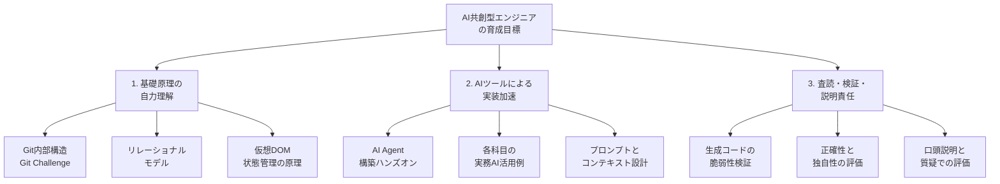

## この記事の対象

MIXI は 2026 年 7 月 27 日、2026 年度の新卒エンジニア向け技術研修資料を全 12 科目分公開しました。

一番の変化は、教材の中身そのものより **AI をどこに置いたか** です。「AI 活用講座」を 1 科目足すのではなく、Git・コンテナ / Kubernetes・セキュリティ・モバイル・Web フロントエンド・データ活用といった既存科目の内側に AI の使い方を織り込んでいます。

この記事は、公開された研修構成を「育成プログラムの設計図」として読み解きます。想定読者は次のような立場の方です。

- 自社の技術研修やオンボーディングを設計・発注する立場
- 「AI 研修をやったのに現場で使われない」という結果に心当たりがある立場
- 生成 AI 前提でエンジニアの評価基準を作り直す必要が出てきた立場

得られるのは、教材リストではなく **判断の型** です。どこを独立科目にし、どこを既存科目へ溶かし、どこで評価を分離するか。その線の引き方を扱います。

## 何が公開されたか

公開物の骨格は次の通りです。

| 区分 | 内容 |
| --- | --- |
| 公開日 | 2026 年 7 月 27 日 |
| 公開元 | 株式会社 MIXI |
| 対象 | 2026 年度入社の新卒エンジニア向け技術研修 |
| 範囲 | 全 12 科目の研修資料 |
| 新設・拡充 | AI / ML 独立科目の Day 2 (LLM・生成 AI・AI エージェント構築ハンズオン)、Writing with AI 研修 |
| 横断施策 | 既存 11 科目へ現場の AI 活用ノウハウを組み込み |

資料は MIXI のニュースリリースと Zenn の MIXI 公式記事から辿れます。スライドは Speaker Deck、講義動画は YouTube のプレイリストで公開されています。

## 転換点は「AI をどこに置いたか」

多くの組織で AI 研修は独立した 1 コマとして設計されます。プロンプトの書き方、ツールの操作、簡単な演習。ここで終わると、配属後の実務にはほとんど残りません。研修で触った道具と、現場で解く課題が別物だからです。

MIXI の構成は、AI を二段階に分けて配置しています。

### 独立科目 (2 日間) は原理を扱う

- **Day 1**: 機械学習の基礎から MLOps まで。推論・学習・デプロイ・評価という共通言語を揃える
- **Day 2**: LLM・生成 AI・AI エージェントの構築ハンズオン。新設・拡充された枠

ここで扱うのは「ツールの使い方」ではなく **仕組みと構築パターン** です。この置き方には副次的な効果があります。教材の寿命が延びます。特定モデルのプロンプト作法に依存した教材は数か月で陳腐化しますが、評価指標や MLOps の枠組み、エージェントの構築パターンはモデルが入れ替わっても残ります。

### 既存 11 科目には実務の使い方を溶かす

Git、コンテナ / Kubernetes、セキュリティ、モバイル (iOS / Android / Flutter)、Web フロントエンド、データ活用、QA・テスト。これらの科目それぞれに、現場エンジニアが実際にどう AI を使っているかが講義・演習として組み込まれています。

「Git のコンフリクト解消で AI をどう使うか」「Kubernetes のマニフェスト作成でどこまで任せるか」「フロントエンドの状態管理で生成結果をどう検証するか」。抽象的な AI 活用論ではなく、科目の文脈に埋め込まれた具体です。

この分離が効く理由は単純です。**原理は科目にできるが、使いどころは科目にできない**。使いどころは常に「何かの作業の中」にしか存在しないため、既存科目の内側に置くしかありません。

## 育成目標を 3 層で読む

公開された研修構成から読み取れる育成思想は、次の 3 層で整理できます。

3 層は並列ではなく順序があります。基礎原理を先に入れ、その上で AI に加速させ、最後に検証と説明責任で締める。この順序が崩れると、後段の検証が機能しません。生成物の良し悪しを判定する基準そのものが、基礎原理の側にあるからです。

### 実装速度から検証能力へ

AI によって「コードを書く速度」の標準値は上がりました。速度が共通化されると、差がつく場所が移動します。

- 移動前: どれだけ速く正しく書けるか
- 移動後: 出てきたものを **どれだけ的確に疑えるか**

Git の内部構造やリレーショナルモデル、セキュリティの攻撃 / 防御視点を教える意義は減っていません。むしろ、AI が出したリファクタリング結果やインフラ定義が安全かを判定する **査読基準** として、以前より必要になっています。

### ブラックボックス化を先回りで防ぐ

MIXI の構成では、Git Challenge (Git 内部構造のハンズオン)、リレーショナルモデル、仮想 DOM の仕組みといった「深部」を先に体感させています。AI に頼り切って基礎概念が欠落するリスクへの、順序による対策です。

## 「使ってよい」と「理解しているか」を分ける

研修設計として最も再現しやすいのが、この分離です。

| フェーズ | ルール | 狙い |
| --- | --- | --- |
| 演習・課題実装 | AI ツールの活用を全面的に推奨 | 試行回数と速度を上げる |
| 評価・質疑 | 本人単独での説明を要求 | 理解の有無を可視化する |

評価で問われるのは「なぜその設計にしたのか」「生成されたコードの計算量やセキュリティ上の弱点を理解しているか」です。生成そのものは制限せず、**説明責任だけを本人に残す**。この二層構造が、コードを理解せずに丸呑みする状態を構造的に防ぎます。

裏返すと、AI 利用を禁止して理解を担保しようとする設計は筋が悪いということでもあります。禁止は試行速度を下げる一方で、理解しているかどうかは結局測れていません。測るべき対象は生成のプロセスではなく、生成物を説明できるかどうかです。

## Writing with AI: 出力の責任まで扱う

新設された「Writing with AI 研修」は、コード以外のアウトプットを対象にしています。

- 設計ドキュメント、技術ブログといったアウトプットの価値を再定義する
- 生成 AI を用いた執筆プロセスを体験する
- ハルシネーションのチェック、ファクトチェックの手順を扱う
- 正確性・独自性・発信責任を教育する

コード生成の検証は「動くか」「安全か」で判定できますが、文章は判定基準が曖昧になりがちです。ここを研修科目として明示的に立てている点は、他社が見落としやすい部分です。技術ブログや障害レポートを外部に出す組織であれば、そのまま輸入する価値があります。

## 自社に移すときの判断ポイント

公開された構成から取り出せる設計判断を、実行順に並べます。

1. **AI 科目を「原理」と「使いどころ」に割る**
   - 原理 (ML / LLM / エージェントの構造) は独立科目で 1 日から 2 日
   - 使いどころは既存の各科目へ 1 セクションずつ埋め込む
   - 独立科目だけで完結させると、配属後に定着しない
2. **評価ルーブリックに「自力説明」を絶対条件として入れる**
   - 課題制作では AI 活用を推奨する
   - レビュー・発表会では生成コードのロジック、脆弱性、計算量を自力で説明できるかを問う
   - 生成の可否ではなく、説明の可否で線を引く
3. **基礎原理を AI 活用より前に置く**
   - 内部構造のハンズオンを先に通す
   - 順序を逆にすると、検証フェーズで使う判断基準が育たない
4. **文章アウトプットもカリキュラムに含める**
   - 仕様書、設計書、障害レポートでの AI 活用とファクトチェック手順
   - コードだけを対象にすると、外部発信の品質管理が抜ける

なお、AI だけでは解けない課題を意図的に残す設計も含まれています。Git Challenge、TRPG 形式のインシデントハンドリング研修、セキュリティの攻撃 / 防御ハンズオン。構造的・対話的な状況判断を伴う課題は、生成で片付かないため、トラブルシューティング能力の訓練枠として機能します。

## 限界と未検証の領域

この研修構成を評価するうえで、現時点で結論が出ていない点も明示しておきます。

- **長期的な成果は未検証**: AI 共創研修を受けた 2026 年卒メンバーが、コードレビュー通過率・障害対応力・自走速度で既存メンバーとどう差がつくかは、1 年から 2 年の追跡が必要です。公開資料の時点では測定されていません
- **ガバナンスとの接続が課題**: 研修のハンズオン環境と、実プロダクト開発で使う AI 環境では、データ学習防止や機密情報の取り扱いルールが異なります。ここの擦り合わせは各社の設計事項として残ります
- **教材の風化リスクはゼロにならない**: 基盤概念に軸を置く設計で緩和されてはいますが、各科目に埋め込んだ「実務での AI 活用例」の部分は、ツール世代の交代に伴う更新が前提になります

自社へ移植するときは、これらを「MIXI で解決済みの問題」と見なさず、自組織で解く前提を置くのが安全です。

## まとめ

- MIXI は 2026 年度新卒技術研修の全 12 科目を公開し、AI 共創を独立科目と既存科目の両方に配置した
- 独立科目 2 日間は ML / MLOps と LLM / エージェント構築の **原理** を扱い、教材の寿命を伸ばしている
- 既存 11 科目には「実務でどう使うか」を埋め込み、ツール知識を開発プロセスへ接続している
- 育成構造は「基礎原理の自力理解」「AI による実装加速」「査読・検証・説明責任」の 3 層で、この順序に意味がある
- 演習では AI 利用を推奨し、評価では本人単独の説明を求める分離が、理解なき丸呑みを構造的に防ぐ
- Writing with AI 研修により、コード以外のアウトプットの正確性と発信責任まで対象化している
- 長期的な成果、社内ガバナンスとの接続、教材更新の運用は各社が自前で解く領域として残る

研修設計を見直す立場であれば、教材そのものより **AI をどの階層に置くか** の判断を先に決めることをおすすめします。科目を足すか、既存科目に溶かすか。この一手で、配属後に残るかどうかが決まります。

## 参考リンク

- [MIXI、AIと共創する次世代エンジニア育成に向けた2026年度新卒技術研修資料を公開 (MIXI ニュースリリース, 2026-07-27)](https://mixi.co.jp/news/2026/0727/55293/)
- [【2026年版】MIXI 新卒向け技術研修を公開しました。 (Zenn, MIXI 公式, 2026-07-27)](https://zenn.dev/mixi/articles/95e0d0477c1ed7)
- [MIXI ENGINEERS (Speaker Deck)](https://speakerdeck.com/mixi_engineers)
- [MIXI TECH&DESIGN 研修動画プレイリスト (YouTube)](https://www.youtube.com/playlist?list=PLA56pNPDYf8Y)
