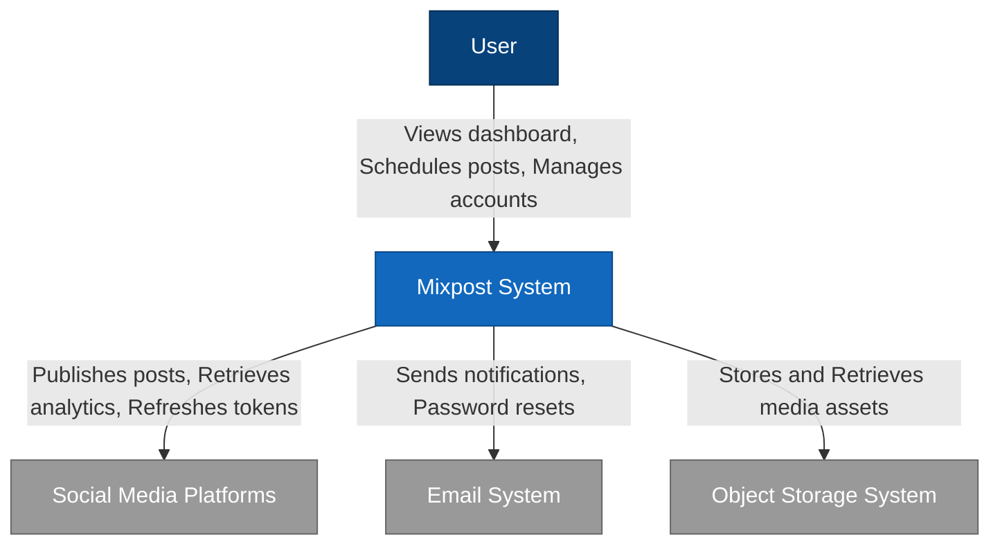
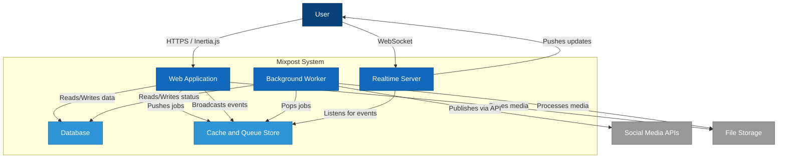
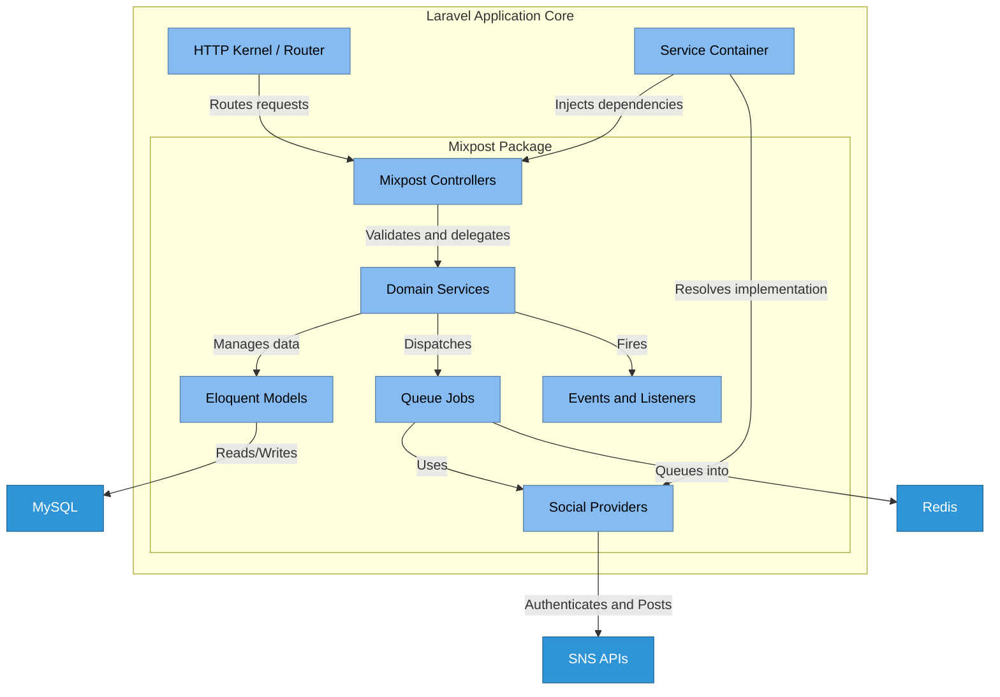
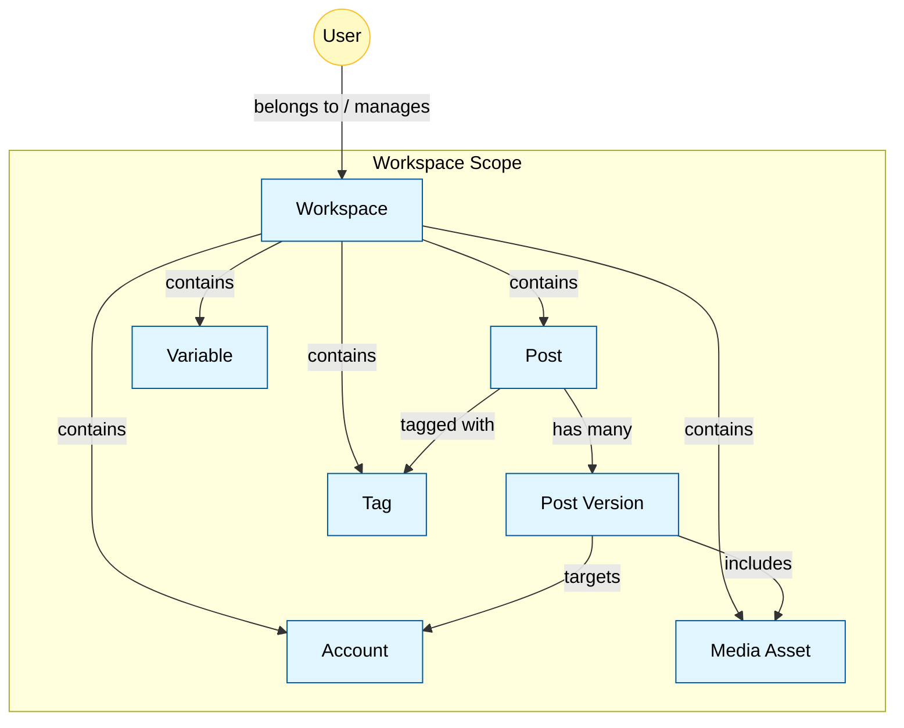
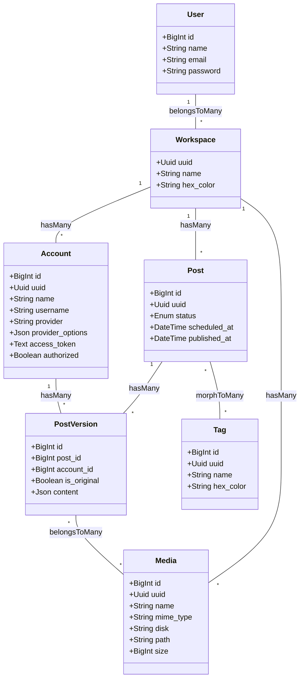

## 概要

Mixpostは、自己ホスト型のソーシャルメディア管理プラットフォームです。X、Facebook、Instagram、LinkedIn、Mastodon、TikTok、YouTubeなどへの投稿を一元管理できます。BufferやHootsuiteなどのSaaS型ツールが抱えるデータ所有権・コスト・機能制限の課題を、自前のインフラで運用することで解決します。

| 比較項目 | Buffer / Hootsuite | Mixpost |
| :--- | :--- | :--- |
| ホスティング | SaaS（ベンダー管理） | セルフホスト（自社管理） |
| データ所有権 | ベンダーに依存 | 完全に自社管理 |
| コスト | 月額サブスクリプション | サーバー費用のみ（OSS版は無料） |
| カスタマイズ | API/Webhook経由のみ | ソースコードレベルで自由 |
| 対応SNS | サービス側の対応に依存 | Social Providerを追加実装可能 |

技術基盤はLaravel（PHP 8.1以上）で、フロントエンドにVue.jsとInertia.jsを採用したモダンなモノリスアーキテクチャです。オープンソース版「Lite」、商用利用向け「Pro」、SaaS事業向け「Enterprise」の3つのライセンス形態があります。コアとなる投稿スケジューリングのロジックやデータ構造は共通です。Dockerコンテナとして独立デプロイするか、既存のLaravelアプリケーション（v10/v11）にComposerパッケージとして組み込めます。

すべての投稿データ、メディアアセット、スケジュール設定、認証トークンは、ユーザー管理下のデータベースとストレージに保存されます。外部ベンダーによるデータロックインがなく、厳格なプライバシーポリシーやコンプライアンス要件を持つ組織でも安全に運用できます。

## 特徴

Mixpostの主要な特徴は、データ主権と拡張性を軸に設計されています。

- **完全なデータオーナーシップ**
  すべてのデータを自社のデータベース（MySQL/PostgreSQL）およびストレージ（ローカルまたはS3互換）に保存します。第三者サーバーへの機密情報・未公開アセットの預託リスクを排除できます。

- **Laravelパッケージとしての柔軟な統合**
  単独アプリケーションとしても、既存LaravelアプリへのComposerパッケージとしても動作します。既存の会員システム、CRM、CMSにSNS管理機能をシームレスに統合できます。

- **Inertia.jsによるモダンなUI**
  バックエンド（Laravel）とフロントエンド（Vue.js）をInertia.jsで密結合しています。API構築の工数を削減しつつ、SPAのような高速な画面遷移とリアクティブな操作性を提供します。

- **堅牢なジョブキューとバックグラウンド処理**
  投稿スケジューリング、動画エンコード、外部API通信はLaravel Horizon（Redisベース）の非同期ジョブとして管理されます。大量の投稿予約でもWebサーバーのレスポンスを維持しつつ、高スループットと耐障害性を確保します。

- **マルチプラットフォーム対応のバージョン管理**
  ひとつの投稿テーマに対し、プラットフォームごとの制約（文字数、画像サイズ、アスペクト比）に合わせた「バージョン」を作成して同時スケジューリングできます。各SNSの特性に最適化したコンテンツ配信が可能です。

- **AIアシスタントによるコンテンツ生成**
  OpenAIなどの生成AIと統合し、投稿文面の作成、リライト、ハッシュタグ提案を提供します。

## 構造

Mixpostの内部構造を理解するために、C4 Model（Context, Container, Component）で段階的に解説します。C4 Modelは、システムのアーキテクチャを4つの抽象度で表現するフレームワークです。ここでは上位3レベルを使い、外部との関係→内部コンテナ→コンポーネントの順に詳細化していきます。

### システムコンテキスト図

Mixpostが置かれる環境と、関与するアクター、連携する外部システムの関係を示します。

| 要素名 | 説明 |
| :--- | :--- |
| **User** | マーケティング担当者、管理者、コンテンツクリエイター。Webブラウザを通じてMixpostを操作 |
| **Mixpost System** | 投稿データの管理、スケジュール実行、外部システムへの配信を統括するシステム |
| **Social Media Platforms** | 投稿の配信先となる外部プラットフォーム群。APIを通じてコンテンツ公開・エンゲージメントデータ取得 |
| **Email System** | ユーザーへの通知、招待メール、パスワードリセットメールを配信するSMTPサーバーまたはメール配信サービス |
| **Object Storage System** | 画像・動画ファイルを永続保存するストレージ。ローカルディスクまたはクラウドストレージ |

### コンテナ図

Mixpostシステム内部の実行単位と技術スタックを示します。

| 要素名 | 説明 |
| :--- | :--- |
| **Web Application** | Laravel/PHPで構築。Inertia.jsを通じてVue.jsフロントエンドを提供し、HTTPリクエストを処理 |
| **Background Worker** | `php artisan horizon` または `queue:work` で動作する常駐プロセス。投稿送信、動画処理、インポートなどの非同期処理を担当 |
| **Database** | ユーザー情報、投稿データ、設定、トークンを永続化するRDB（MySQL/PostgreSQL） |
| **Cache and Queue Store** | キャッシュ、セッション、ジョブキューを管理するRedis。Horizonのステータス管理にも利用 |
| **Realtime Server** | 投稿ステータス変更などをWebSocketでフロントエンドへ即時通知するサーバー（Laravel Reverb / Soketiなど） |

### コンポーネント図

Web ApplicationとBackground Worker内部のLaravelアプリケーション構成要素を示します。

| 要素名 | 説明 |
| :--- | :--- |
| **Mixpost Controllers** | `Inovector\Mixpost\Http\Controllers` 配下のクラス群。Inertiaレスポンス生成、バリデーション、認可制御 |
| **Domain Services** | 投稿処理、メディア管理、アカウント連携などのビジネスロジックを集約したサービスクラス群 |
| **Social Providers** | SocialProviderインターフェースの各SNS実装（TwitterProvider、FacebookPageProviderなど）。OAuth認証フローやAPI差異を吸収するアダプター |
| **Eloquent Models** | データベーステーブルと対応するクラス（Post、Account、Mediaなど）。データ操作とリレーション管理 |
| **Queue Jobs** | ProcessPost、ImportMediaなどのジョブクラス。バックグラウンドワーカーが非同期実行し、SocialProvidersを呼び出して投稿処理 |
| **Events and Listeners** | 投稿完了・エラー発生などのイベント通知。ログ記録やWebフック送信のトリガー |

## 情報モデル

構造セクションではシステムの「動き」を見ました。ここでは、システムが管理する「データ」に焦点を当て、概念レベルとクラス設計レベルで解説します。

### 概念モデル

主要なエンティティの所有関係と参照関係を示します。Workspaceがコンテンツ資産を管理する構造です。

| 要素名 | 説明 |
| :--- | :--- |
| **User** | システム利用者。認証と権限管理の主体 |
| **Workspace** | データの論理的境界。複数ユーザー・アカウント・投稿をグルーピングするコンテナ。Lite版は単一、Pro/Enterprise版は複数作成可能 |
| **Account** | 連携済みSNSアカウント。API接続に必要な認証情報とプロファイル情報を保持 |
| **Post** | 投稿の親エンティティ。スケジュール日時や全体ステータス（下書き、予約済みなど）を管理 |
| **Post Version** | プラットフォームごとの投稿バリエーション。特定媒体向けに調整されたコンテンツ（本文、メディア）を保持 |
| **Media Asset** | アップロード済みの画像・動画ファイル。物理ファイルパスとメタデータを管理 |
| **Tag** | 投稿を分類するラベル。カラーコード付きで視覚的にグルーピング |
| **Variable** | 投稿テンプレートに埋め込む変数。ブランド名やハッシュタグなどの再利用可能な定型文を管理 |

### 情報モデル

LaravelのEloquentモデルに基づくクラス図です。JSONカラムの活用とポリモーフィックな関係性が特徴です。

| クラス名 | 説明 |
| :--- | :--- |
| **User** | システム利用者。mixpost-authパッケージまたはLaravel標準認証で管理 |
| **Account** | `provider`属性（'twitter'、'linkedin'など）で接続先を識別。`access_token`は暗号化保存。`provider_options`にAPI固有設定をJSON格納 |
| **Post** | `status`で投稿ライフサイクル（DRAFT、SCHEDULED、PUBLISHING、PUBLISHED、FAILED）を管理。`scheduled_at`で予約投稿のトリガー時刻を決定 |
| **PostVersion** | `content`カラム（JSON型）に投稿本文やリンク情報を格納。`account_id`が0またはnullの場合は全アカウント共通の「オリジナルバージョン」として機能。contentの構造例: `[{"body": "投稿本文", "url": "https://..."}]` |
| **Media** | `disk`でLaravelのFilesystem構成（'public'、's3'など）を指定。`path`でストレージ上の相対パスを保持 |

## 構築方法

ここからは実践的な構築・運用について解説します。ユーザーの技術レベルや既存インフラに応じて、3つの構築手法があります。

**共通の前提条件:**

| 項目 | 要件 |
| :--- | :--- |
| PHP | 8.1以上 |
| データベース | MySQL 8.0以上 / PostgreSQL 13以上 |
| キャッシュ/キュー | Redis 6以上 |
| Webサーバー | Nginx / Apache（URLリライト対応） |

### 1. Dockerを利用した構築（推奨）

アプリケーション、Webサーバー、データベース、Redis、Workerをコンテナで一括起動する手法です。依存関係の解決が自動化されており、最も安定した動作が期待できます。

- **前提条件の確認**: DockerとDocker Composeプラグインのインストール確認
- **構成ファイルの準備**: プロジェクトディレクトリの作成と`docker-compose.yml`の配置
- **環境変数の設定**: `.env`ファイルに`APP_URL`、`LICENSE_KEY`（Pro/Enterprise版）、DBパスワードなどを設定
- **コンテナの起動**: `docker compose up -d` でバックグラウンド起動
- **初期セットアップ**: コンテナ内でDBマイグレーションと管理者ユーザー作成コマンドを実行

### 2. Standalone Appとしての構築

構成済みスケルトンアプリケーション（inovector/MixpostApp）を利用し、LAMP/LEMP環境にデプロイする手法です。

- **プロジェクトの作成**: `composer create-project inovector/MixpostApp mixpost` で展開
- **Webサーバーの設定**: Nginx/Apacheのドキュメントルートを`/public`に設定し、URLリライトを有効化
- **DB・Redisの接続**: `.env`にMySQL/PostgreSQLおよびRedisの接続情報を記述
- **アプリケーションの初期化**: `php artisan migrate` でテーブル作成、`php artisan mixpost-auth:create` で初期ユーザー作成
- **ワーカーの常駐化**: Supervisorで`php artisan horizon`を常駐プロセスとして設定

### 3. 既存Laravelアプリへのパッケージ組み込み

稼働中のLaravelアプリケーション（v10/v11）にMixpostを機能追加する手法です。既存の認証基盤やドメイン設定を流用できます。

- **パッケージのインストール**: `composer require inovector/mixpost`（またはPro/Enterprise版）を実行
- **アセットと設定の公開**: `php artisan mixpost:install` でフロントエンドアセット・設定ファイル・環境変数を展開
- **ルート保護の設定**: Mixpostダッシュボード（デフォルト: `/mixpost`）へのアクセス制限を設定。Userモデルに権限管理Traitを追加
- **スケジューラーの登録**: `Console/Kernel.php`にMixpostの定期実行コマンドを登録

## 利用方法

構築完了後の基本セットアップと日常的な利用手順を解説します。

### 初期設定

- **システム設定**: 管理画面のSettingsでタイムゾーン、週の開始曜日、表示言語、日時フォーマットを設定
- **サービス連携設定**: 各SNSのDeveloper PortalでアプリケーションのClient IDとSecret Keyを取得し、MixpostのServices設定に入力

### アカウント連携

- **OAuth認証の実行**: ダッシュボードの「Add Account」から対象プラットフォームを選択し、OAuth認証画面で投稿権限を委譲
- **アカウント管理**: 連携アカウントをワークスペース内で一覧管理。キャンペーンやブランドごとにグループ化可能

### 投稿の作成と管理

- **マルチチャネル投稿の作成**: 「Compose」からテキスト・画像・動画を入力し、投稿対象アカウントを選択
- **バージョンごとの最適化**: プラットフォームごとにタブが生成され、ハッシュタグ追加や文字数調整などの個別編集が可能
- **スケジューリング**: 「Add to Queue」（自動スロット割り当て）または「Pick time」（日時指定）で投稿を予約。カレンダービューでドラッグアンドドロップによる日程変更も可能

### メディアライブラリの活用

- **アセットの一元管理**: メディアライブラリへのアップロード、フォルダー分け、タグ付けによる整理
- **外部ツール連携**: Unsplashなどのストックフォトサービスや外部画像編集ツールとの連携

## 運用

システムを長期間安定稼働させるための運用タスクを解説します。

### ログ監視とモニタリング

- **ジョブ監視**: Horizonダッシュボード（`/mixpost/horizon`）でジョブの実行状況、失敗数、スループットを確認。投稿失敗時の再試行状況も管理
- **エラーログ解析**: `storage/logs/laravel.log`でAPI接続エラーやシステム例外を検知。SNS側のAPI仕様変更やトークン失効によるエラーの早期発見が重要

### バックアップ戦略

- **データベースバックアップ**: `mysqldump`/`pg_dump`で日次ダンプ取得。ユーザー情報、投稿アーカイブ、設定値を含む全データが対象
- **アセットバックアップ**: ローカルストレージの場合は`storage/app/public`を定期バックアップ。S3利用時はバージョニングやレプリケーションを活用

### アップデートとメンテナンス

- **コンテナ更新**: `docker compose pull` で最新イメージ取得後、コンテナを再起動
- **パッケージ更新**: `composer update` → `php artisan mixpost:publish-assets --force` → `php artisan migrate` の順に実行
- **破壊的変更への対応**: メジャーバージョンアップ時は公式アップグレードガイドを参照

### プロセス管理

- **Supervisorの構成**: ワーカープロセス（`php artisan horizon`）の自動再起動設定。`max-jobs`/`max-time`リミットでメモリリークを防止し、定期的なプロセスリフレッシュを推奨

## 参考リンク

- 公式ドキュメント
  - [Mixpost: Self-hosted, Open Source Social Media Management](https://mixpost.app/)
  - [Hosting Mixpost Enterprise](https://docs.mixpost.app/enterprise/)
  - [Install Mixpost Enterprise In an existing Laravel app](https://docs.mixpost.app/enterprise/installation/laravel-package/)
  - [Guides | Mixpost Documentation](https://docs.mixpost.app/guides/)
  - [API Reference | Mixpost Documentation](https://docs.mixpost.app/api/)
  - [Upgrading Mixpost Pro to v3 from v2](https://docs.mixpost.app/pro/upgrading/upgrading-v3/)
  - [Updating Mixpost Pro](https://docs.mixpost.app/pro/updating/)
  - [Laravel Horizon](https://laravel.com/docs/horizon)
- GitHub
  - [inovector/mixpost](https://github.com/inovector/mixpost)
- 記事
  - [The C4 Model for Software Architecture - InfoQ](https://www.infoq.com/articles/C4-architecture-model/)
  - [Mixpost - Made with Laravel](https://madewithlaravel.com/mixpost)
