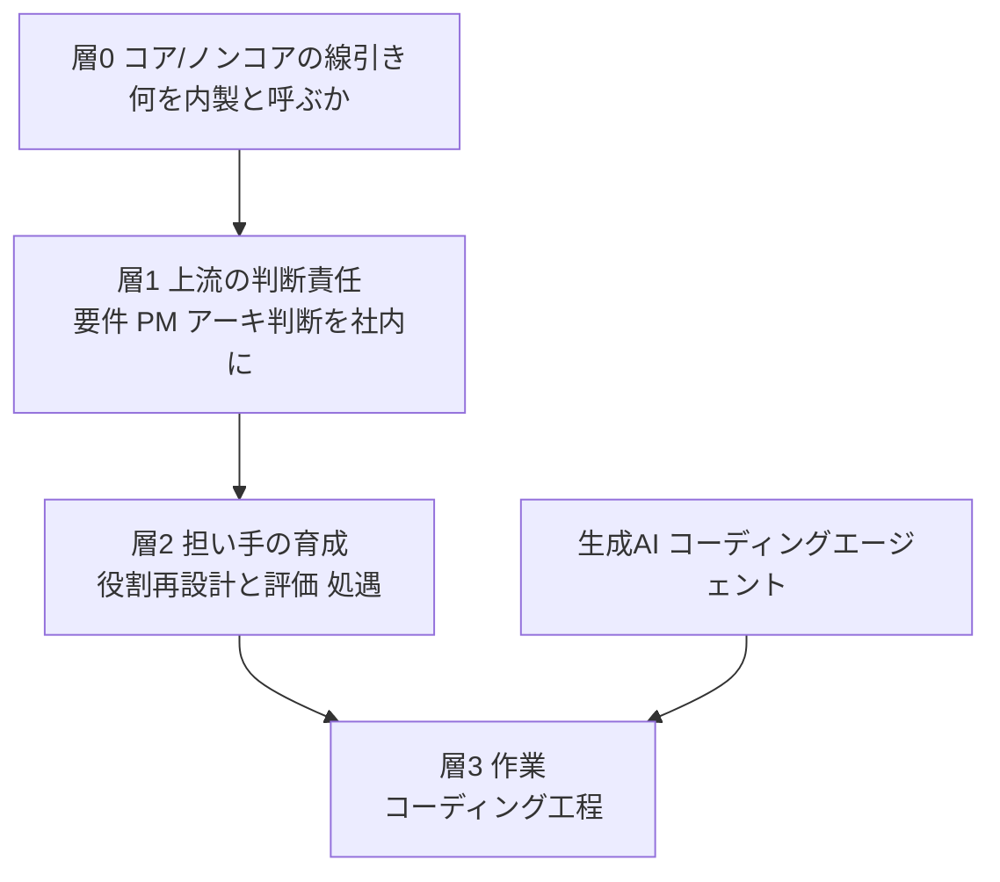

## この記事の主題

「内製化」という言葉は、いつのまにか「外注を減らすこと」とほぼ同義で使われています。しかし発注側・経営側の視点で内製化の失敗事例を並べると、論点はそこにありません。本質は「どの作業を社内に戻すか」ではなく、「**どの領域の判断責任を、自社の誰が持つか**」です。

本記事は、みずほ証券の執行役員CIO・宇都宮研氏が掲げる「システム・業務オペレーション・ビジネス戦略の三位一体経営」を入口に、内製化を4つの層に分解して捉え直します。みずほ証券を「成功した好例」として紹介する記事ではありません。元記事の具体策の多くは有料部分にあり、みずほグループ自体には金融庁から「方針表明と実行の乖離」を指摘された経緯もあります。だからこそ、個社の評価ではなく、規模に依らず効く構造を取り出すことに焦点を当てます。

先に結論を置きます。

- AI時代の内製化の本質は、作業（コーディング工程）の取り戻しではなく、**上流の判断責任を社内に置くこと**です。
- それは「採用」だけでは達成できず、コアとノンコアの線引き、人材育成、役割再設計、評価と処遇を**同時に動かす経営事項**です。
- AIはこの構図で、育成すべき能力の重心を「コードを書く力」から「AIの出力を検証し、業務文脈で判断する力」へ移す**補完財**として働きます。

:::message
本記事の数値・固有名詞には、元記事の有料部分や企業公式記事のスニペット由来で一次確認ができていないものが含まれます。該当箇所には「（二次情報）」と明記します。みずほ証券単体の取り組みとグループ（みずほFG）全体の取り組みも区別して記載します。
:::

## みずほ証券の方針から確認できること

元記事「みずほ証券の重要課題はシステム内製化、人材育成とAI活用が鍵」（Nikkei xTech、有料）の無料公開範囲と、役員異動リリース等から確認できた要素を、推測で補わずに整理します。

### 三位一体経営を人事構造で体現する

方針の核は「システムと業務オペレーション、ビジネス戦略が三位一体になった経営」です。注目すべきは、宇都宮氏自身の役職です。

| 要素 | 内容 |
|---|---|
| 役職 | 執行役員 CIO グローバルITヘッド 兼 CPrO グローバルオペレーションヘッド（2025年4月1日付） |
| 兼務の意味 | CIO（システム）とCPrO（業務プロセス）の兼務そのものが、システムと業務オペレーションの一体化を組織図に埋め込む設計 |
| 体制 | 委員会を立ち上げ体制を固めた（委員会の正式名称・構成・設置時期は有料部分のため未確認） |

「三位一体」は標語にとどまらず、CIOとCPrOの兼務という人事構造で先に形にしている点が特徴です。

### 出発点はコストセンター観からの脱却

宇都宮氏は、フランスの金融機関での経験を背景に、IT部門の位置づけの日仏差を指摘します。

| 観点 | フランスの金融機関 | 日本の従来型 |
|---|---|---|
| IT部門の位置づけ | ビジネスで稼ぐパートナー | 利益を生まないコストセンター |
| 開発体制 | システムの8〜9割を内製 | 開発をITベンダーに依存 |

ここで注意したいのは、「8〜9割内製」はフランスの機関での実績値であって、みずほ証券の内製比率の目標値ではない点です。目標値そのものは有料部分のため未確認であり、数値の独り歩きは避ける必要があります。

### AI活用の実体は内製エンジニアによる業務AIの量産

みずほ証券単体の生成AI詳細も有料部分が多いため、グループ（みずほFG）の公開事例で補強します。いずれもグループ公式記事のスニペットまたは二次情報であり、本文を直接確認できていない点を明記します。

| 取り組み | 内容 | 確度 |
|---|---|---|
| 内製開発ラボ | 2024年4月に体制整備、エンジニア約15人、20以上のアプリを開発 | 公式スニペット・本文未読（二次情報） |
| MOAIサーチ | 社内文書検索を内製、解決率約96% | 公式スニペット（二次情報） |
| デボラ2.0 | 債券販売の顧客探索、2023年9月下旬運用開始 | 二次情報 |
| Wiz Create | 面談記録作成、議事録作成を70%以上削減 | 二次情報 |

ここから読み取れるのは、AIと内製人材が対立しないことです。内製エンジニアが生成AIアプリを自前で量産し、現場へ高速に届ける構図で、AIは内製化を加速する道具として使われています。

## 内製化を「作業」でなく「判断責任」で捉え直す

ここからが本記事の主眼です。みずほの事例を一般化すると、内製化は4つの層に分解できます。通俗的な内製化論は最下層の「作業」だけを見て、上の3層を見落とします。

| 要素 | 説明 |
|---|---|
| 層0 コア/ノンコアの線引き | 何を内製と呼ぶかを決める層。ここを誤ると上の層がすべて崩れる |
| 層1 上流の判断責任 | 要件定義・PM機能・アーキテクチャ判断を社内が持つ層。内製化の本体 |
| 層2 担い手の育成と役割再設計 | 判断責任の担い手を育て、役割と評価・処遇で支える層。採用だけでは埋まらない |
| 層3 作業 | コーディング工程の層。AIで一部が肩代わりされる。通俗的内製化論はここだけを見る |

### 層0 何を内製に戻すかより先に、何が自社のコアか

内製化の検討は、作業の置き場所からではなく、自社のコアの特定から始めます。

- コア（競争力に直結する領域、Strategic）は内製、ノンコア（commodity）はパッケージ・SaaS・外注、というコア/ノンコア分割が定石です。総務省の令和元年版情報通信白書も、IT部門をコストセンターから価値創造の中核へ転換する方向を示しています。
- 全面内製は目的ではありません。ノンコアまで内製化すると、後述するコスト増・属人化・技術的負債を自ら抱え込みます。線引きが先です。

### 層1 内製化の本体は上流の判断責任の社内化

AI時代には、作業（層3）がAIに移るため、「コーディング工程を社内に戻す」という意味での内製化は急速に空洞化します。残る本質は、要件定義・PM機能・アーキテクチャ判断という上流の判断責任を、ベンダーでなく社内が持つことです。

- 成功事例の共通項も、上流とPM機能から段階的に内製化し、内製チームの自走を確認してから外注契約を終える形です（日経クロステックの「成功7カ条」、LASSICの回避策）。
- JUASの企業IT動向調査でも、社内にナレッジを蓄積するため上流工程を中心に内製化したい、という企業意向が報告されています（二次情報）。
- みずほのCIOとCPrOの兼務、委員会方式は、この「判断責任を経営構造に埋め込む」試みとして読めます。

判断責任を社内に置けているかは、次の問いで可視化できます。コードを誰が書いたかではなく、各判断に社内の固有名がつくかで測ります。

| 判断 | 問い |
|---|---|
| 要件の優先順位 | 何を作り何を作らないかを、社内の誰が決裁するか |
| アーキテクチャ | 主要な技術選定の最終判断を、社内の誰が持つか |
| 受け入れ基準 | 成果物の合否ラインを、社内の誰が定義し検収するか |
| 例外と差し戻し | 想定外時にどこで人が介入し、誰が責任を負うか |

### 層2 なぜ採用だけでは内製化が進まないか

内製化が「人を採れば終わり」にならないのは、採用で移転できないものが3つあるからです。

| 非移転性 | 内容 |
|---|---|
| 暗黙知・業務文脈 | システムは業務知識と一体。外部採用エンジニアは技術はあっても自社業務文脈を持たず、戦力化まで半年から1年を要する（二次情報） |
| 既存人材の役割転換 | 既存の情シスは長年ベンダー管理に従事し開発経験が乏しい。人数を増やしてもスキルシフトと意識転換が伴わないと立ち上がらない |
| 継続供給 | 採った人材が定着しなければ内製能力は枯れる。失敗を責める評価制度は挑戦を避けさせ、改善サイクルを止める |

実例として、エディオンはエンジニアを約15人から約70人へ拡大しましたが、以前からいた社員は大半がベンダー管理に従事して開発経験が乏しく、スキルアップと意識転換が必須でした（二次情報、日経クロステック）。

このことは、内製化が「採用を包含する、より大きな制度設計」であることを示します。日経クロステックの「成功7カ条」の第1条は、経営トップのコミットメント、つまり処遇・予算・組織を経営事項として動かす覚悟です。星野リゾートはITチームの約半数を現場出身者で構成し、暗黙知の問題を「役割再設計による現場人材の登用」で解き、開発体制を3年で約7倍に拡大しました（二次情報、IPA DX SQUARE）。

### 層3 AIは代替でなく補完、育成の重心を判断力へ動かす

- 生成AIやコーディングエージェントは、ITの専門家でなくても業務知識があれば開発の一部を手掛けられる段階に入り、少人数でも内製できる範囲を広げます。
- しかし最終判断の責任は人に残ります。出力のハルシネーション、著作権、セキュリティの検証コストは内製側に転嫁され、AIガバナンス負債を内部に抱えます（二次情報）。
- したがってAIは人材育成の代替ではなく補完です。育成すべき能力の重心が、「コードを書く力」から「AIの出力を検証し、業務要件とドメインに照らして判断する力」へ移ります。層2の暗黙知・業務文脈はAIで埋まらない部分であり、AI時代の内製化はこの判断責任の層に人を厚く配置する設計になります。

### この構造を貫く一本の問い

層3（作業）から問うと、議論はAIに溶けて消えます。層0から層1の順で問うと、内製化は「発注方針の変更」から「経営の構造設計」に変わります。立てるべき問いは次の形です。

> この業務を内製化できるか、自動化できるか、ではない。
> この領域の判断責任を、自社の誰が持つのか。その人を育て、役割を与え、報いる仕組みがあるか。

## 反証と限定

本記事の規範、すなわち「内製化は判断責任・育成・役割再設計の同時課題である」という方向性は、反証に概ね耐えます。一方で、3つの限定を明示する必要があります。

### みずほは好例ではなく表明段階の事例

最も脆いのが「みずほ＝好例」という例証です。グループには逆向きの史実があります。

| 事実 | 内容 |
|---|---|
| 金融庁の認定 | 「方針表明と実行の乖離」「容易には改善されない体質ないし企業風土」と指摘（2021年11月26日の行政処分、システム障害特別調査委員会報告書） |
| IT人員の削減 | MINORI全面稼働後にシステム担当者を約6割削減（3年で1143人から491人との報道、二次情報） |
| 統制不全 | IT部門の立場の弱さからユーザー部門のEUC乱立を制御できず統制不全に陥った前例（二次情報） |

よって宇都宮CIOの三位一体は、近年の前向きな「表明」であり、実行が伴うかは未検証です。好例と断定せず、問いの入口・表明段階の事例として扱うのが妥当です。

### 内製化を目指すべきは無条件には成り立たない

- 外部委託は専門業者が担い一定品質が確保される一方、内製化は品質が保証されません。
- 内製化失敗の典型として、採用コストが当初見込みの2倍、キーパーソン離職によるシステム停止、ドキュメントやレビュー不足による技術的負債が挙げられます（二次情報、LASSIC）。
- したがって全面内製ではなく、層0のコア/ノンコアの線引きが先です。ノンコアはSaaSや外注が合理的です。

### 個社の設計だけでは越えられない産業構造の壁

| 制約 | 内容 |
|---|---|
| IT人材の偏在 | 日本はIT人材の約72%がベンダー企業に所属し、米国は逆にユーザー企業が約65%（二次情報、IPA「IT人材白書2017」「DX白書2023」再掲、一次PDFの該当ページ突合は未了） |
| 人材不足 | 2030年に約79万人のIT人材不足との経産省試算（二次情報） |
| 定着の難しさ | IT人材は流動性が高く、給与を上げても定着を保証できない。金融ではレガシー保守に若手が回され流出しやすい（二次情報） |

個社の育成・役割再設計は必要ですが、それだけで完結はしません。構造的制約を織り込んだ期待値設定が要ります。

## 自社への持ち帰り

判断支援者の視点で、規模に依らず効く論点に翻訳します。

1. 内製と外注を「作業の置き場所」で議論しない。まず自社のコア、つまり競争力に直結する判断はどこかを引く（層0）。
2. コア領域は判断責任を社内に残す。コードはAIや外注に出してよいが、要件・優先順位・アーキ判断・受け入れ基準を自社が持てているかを問う（層1）。
3. 採用すれば内製化、と考えない。暗黙知・役割転換・定着の3点を同時に設計する。現場業務を知る人材を開発側に登用する役割再設計は、採用より効くことがある（層2）。
4. AIは育成を不要にしない。育成の指標を「書ける」から「AIの出力を検証・判断できる」へ寄せ、AIガバナンスを運用に埋める（層3）。
5. 評価と処遇をセットで動かす。評価軸を「計画どおり作ったか」から「判断の質と、差し戻し時の責任の引き受け方」へ寄せる。挑戦を罰する評価のままでは内製チームは育たない。経営事項として扱う。

## 未解決の問い

意思決定の前に確認すべき、本調査で詰め切れなかった点を残します。

- みずほ証券固有の内製比率の目標値、委員会の正式名称、IT人材の処遇・評価改定の中身（元記事有料部分のため未確認）。
- 「日本はIT人材の約72%がベンダー所属」等の数値は二次解説で一致するものの、一次PDFの該当ページ突合は未了。数値を強調する場合はIPA白書本体の確認が必要。
- 「内製化を進めたが頓挫しベンダーに戻した」固有名の撤退一次事例は今回確認できず（失敗は匿名・二次で語られる形が大半）。

## まとめ

内製化の本質は「どの作業を社内に戻すか」ではなく「どの領域の判断責任を自社の誰が持つか」であり、それはコア/ノンコアの線引き・育成・役割再設計・評価/処遇を同時に動かす経営事項です。AIは作業を肩代わりしても判断責任を肩代わりしないため、育成の重心はコードを書く力から検証・判断する力へ移ります。

この記事が少しでも参考になった、あるいは改善点などがあれば、ぜひリアクションやコメント、SNSでのシェアをいただけると励みになります！

## 参考リンク

- 公式・一次資料
  - [みずほ証券 役員異動等のお知らせ（2025-02-28）](https://www.mizuho-sc.com/company/newsrelease/2025/pdf/20250228_01jp.pdf)
  - [金融庁 行政処分（2021-11-26）](https://www.fsa.go.jp/news/r3/ginkou/20211126/20211126.html)
  - [みずほFG システム障害特別調査委員会 報告書（2021-06-15）](https://www.mizuho-fg.co.jp/release/pdf/20210615release_3_jp.pdf)
  - [総務省 令和元年版 情報通信白書（プロフィットセンター/フロントオフィスのICTへの転換）](https://www.soumu.go.jp/johotsusintokei/whitepaper/ja/r01/html/nd123110.html)
  - [IPA DX動向2025](https://www.ipa.go.jp/digital/chousa/dx-trend/dx-trend-2025.html)
  - [JUAS 企業IT動向調査2025](https://juas.or.jp/cms/media/2025/04/JUAS_IT2025.pdf)
- 記事
  - [みずほ証券の重要課題はシステム内製化、人材育成とAI活用が鍵（Nikkei xTech、有料）](https://xtech.nikkei.com/atcl/nxt/column/18/01159/061800083/)
  - [カインズや星野リゾート直伝の内製化成功7カ条（日経クロステック）](https://active.nikkeibp.co.jp/atcl/act/19/00339/112600004/)
  - [IPA DX SQUARE 星野リゾート](https://dx.ipa.go.jp/interview-hoshinoresorts1)
  - [生成AIは内製化に役立つか（日経xTECH）](https://xtech.nikkei.com/atcl/nxt/column/18/00138/042501752/)
  - [システム内製化の失敗パターン（LASSIC）](https://lassic.co.jp/media/column/in-house-development-failure-patterns/)
  - [みずほFGがAIツールの内製開発に取り組む理由（Business Insider Japan）](https://www.businessinsider.jp/article/2506-mizuho-financial-group-generative-ai/)
