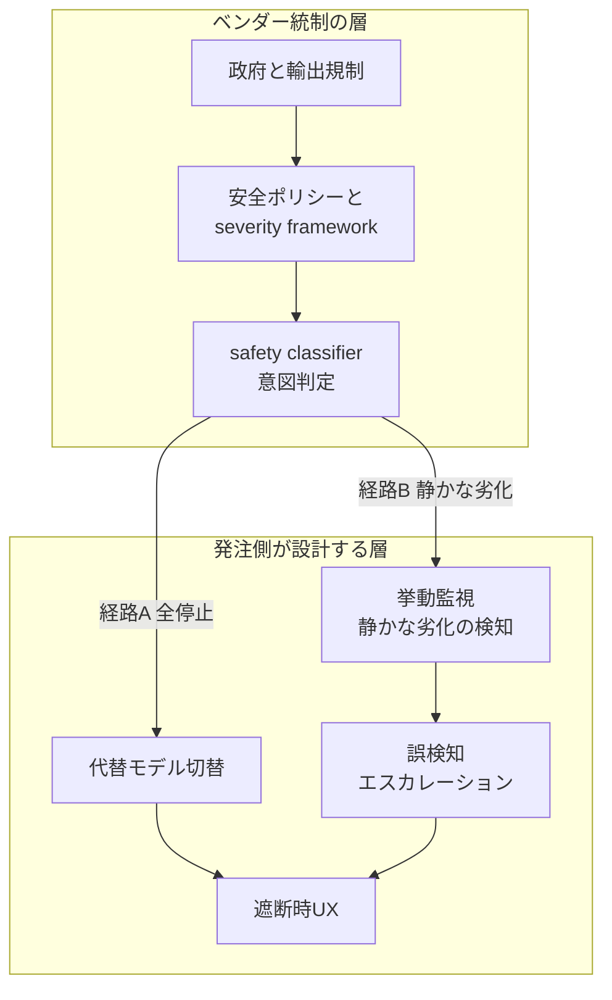

最上位モデルが数週間で「使える → 止まる → また使える（ただし挙動が変わった）」を一巡する。2026 年 6 月から 7 月にかけて、Anthropic の Claude Fable 5 で実際に起きたことです。

この記事は事件の解説を目的としません。AI を使う側、つまり発注者や経営の立場で「モデルの可用性を事業継続の設計対象として扱う」ための切り口を扱います。とくに、可用性が「性能」ではなく「統制可能性」で決まる局面に入ったこと、そして発注側が自分の層で何を設計に織り込むかを整理します。

## 概要

まず時系列で事実を確認します。日付・遮断率・評価枠組みは Anthropic 公式（一次）に基づきます。

| 日付 | 出来事 |
|---|---|
| 2026-06-09 | Anthropic が Claude Fable 5 を公開（同世代に Mythos 5） |
| 2026-06-12 | 米政府が Fable 5 と Mythos 5 に輸出規制を適用 |
| 2026-06-30 | 米商務省が輸出規制を解除 |
| 2026-07-01 | 新しい安全分類器を載せてグローバル再配備 |
| 2026-07-07 | 暫定価格（週次上限の最大 50% を Fable 5 に使用可）の期限 |

停止の契機は、Amazon の研究者が発見したプロンプト手法でした。この手法はモデルに複数のソフトウェア脆弱性を特定させ、1 ケースでは脆弱性を実証するコードまで生成させたと公式は説明しています。

再配備では、当該手法を標的にした改良版の安全分類器を導入しました。この分類器は Amazon が報告した特定の手法を 99% 超のケースで遮断し、遮断したリクエストを Opus 4.8 にフォールバックさせます。同時に公式は「通常の coding や debugging でも誤検知が増える」と明言しました。

発注側が読むべき論点は「Fable 5 が強いか弱いか」ではありません。次の 2 点です。

- 最上位モデルの可用性が、モデルの性能ではなく統制可能性（輸出規制・分類器・政府協調）という外側の制御面で決まる局面に入ったこと。
- 可用性が失われる経路が、「まるごと停止」と「静かな劣化」の 2 つに分かれたこと。

## 特徴

この事件は、従来の「モデルが落ちた・遅い」とは質的に異なります。異なる点を 3 つに整理します。

### 可用性の喪失経路が二重化した

可用性の喪失には、性質の異なる 2 経路があります。

| 経路 | 内容 |
|---|---|
| 経路 A（全停止） | 輸出規制でアクセスがまるごと停止。可視的で、代替モデル切替で対処できる従来型リスク |
| 経路 B（静かな劣化） | モデルは動作するが、分類器が正当なリクエストを遮断しフォールバックする。アカウントや用途で挙動が変わり、ダッシュボードには停止として現れない |

経路 B が新しい要素です。同じ「使えない」でも、監視・契約・エスカレーションの設計が経路 A とは別物になります。

### 安全判定の責務がベンダー側の不透明な層に移った

再配備で導入された分類器は、プロンプトの意図をベンダー側で判定します。正当な防御的セキュリティ作業か、攻撃の準備か、という区別です。

発注側から見ると、自分のワークフローがセキュリティレビュー・クラウド耐障害設計・認可監査であっても、分類器の判断で降格や遮断を受けえます。実際、公開バグトラッカーには正当な作業が誤爆した報告が上がっています（詳細は後述）。判定ロジックは非公開のため、発注側は「なぜ止まったか」を自力で説明しづらい状態に置かれます。

### jailbreak の深刻度を業界共通軸で測る動きが始まった

Anthropic は Amazon・Microsoft・Google ほか（Glasswing partners）と、jailbreak の深刻度を 4 軸でスコアリングする枠組みを提案しました。

| 軸 | 問い |
|---|---|
| Capability gain | 既存ツール比でどれだけ能力を上げるか |
| Breadth of capability gain | 同じ手法が何種類の攻撃タスクに効くか |
| Ease of weaponization | 攻撃化にどれだけ人的労力が要るか |
| Discoverability | その手法をどれだけ簡単に入手できるか |

報道はこれを「AI jailbreak 版の CVSS」と位置づけました。加えて Anthropic は、米政府との協調（pre-release access、jailbreak や misuse の情報共有、共同研究）の拡大を表明しています。安全判定が単一ベンダーの内部事情から、業界と政府の共通言語へ外部化されつつある、というシグナルです。

発注側にとっての含意は、深刻度の共通軸ができるほど「どの jailbreak でモデルが止まりうるか」を事前に見積もりやすくなる点です。4 軸のうち Ease of weaponization と Discoverability が高い領域は、ベンダーが優先的に遮断を強める候補になります。自社の用途がその領域に近いほど、経路 B（静かな劣化）の影響を受けやすいと読めます。

## 概念構造

発注側が設計対象として捉えるべき「層」と「可用性喪失の経路」を分けて図にします。

| 要素 | 説明 |
|---|---|
| vendor | ベンダー統制の層。発注側は変更不可で、可視性のみ要求できる範囲 |
| app | 発注側が設計する層。経路 A と経路 B の両方をここで受け止める |
| gov | 政府と輸出規制。モデル配布そのものを止めうる最上位の制御面 |
| policy | ベンダーの安全ポリシーと深刻度評価枠組み |
| clf | 意図を判定する安全分類器。遮断とフォールバックの起点 |
| route | 代替モデルへの切替。経路 A への備え |
| obs | 拒否率やフォールバック率の挙動監視。経路 B の検知 |
| esc | 誤検知時にヒトへ逃がすエスカレーション経路 |
| ux | 遮断時にエンドユーザーへ理由を提示する UX |

要点は次のとおりです。上段のベンダー統制は発注側が変更できません。一方で、下段の自層で経路 A と経路 B の両方を受け止める設計は打てます。とくに経路 B は、監視からエスカレーションへの導線を自層に持つことで、はじめて可視化できます。

### 発注側が設計に織り込む 4 項目

1. 代替モデルの常設（経路 A 対策）。最上位モデルを常用前提で固定せず、停止時に切り替える代替モデルと、品質差を許容できるタスク境界を先に決めます。
2. 挙動監視（経路 B 対策）。フォールバック発生率・拒否率・応答モデル名（Fable 5 か Opus 4.8 か）を、ワークフロー種別ごとに自分のテレメトリで観測します。セキュリティレビューや認可監査といった誤爆しやすい用途を軸に集計すると、ベンダー起因の静かな劣化を早期に可視化できます。
3. 誤検知エスカレーション経路。正当な作業が遮断されたときの、ヒトへの逃がし先と再開手順を定義します。
4. 遮断時 UX。エンドユーザーへ「何が起きたか」を提示します。無言のフォールバックは信頼を最も削ります。

## 反証と留保

この記事の読み（統制可能性で可用性が決まる、設計で織り込むべき）を弱める材料も並べます。判断材料として重要だからです。

- 過大解釈という見方。輸出規制は 06-12 から 06-30 まで約 19 日で解除された単発の政治イベントであり、恒常的な統制枠組みと読むのは行き過ぎだ、という指摘があります（研究者コメント・報道、二次情報）。この記事も「構造変化の確定」ではなく「その局面を示した一例」として扱います。
- 分類器の実害。公開バグトラッカーに正当作業の誤爆が上がっています。gh CLI で OPEN を確認したものとして、`anthropics/claude-code#65596`（OPEN、正当なセキュリティレビューが cyber コンテンツとして誤爆）と `anthropics/claude-code#60366`（OPEN、"hi" だけで Usage Policy 違反エラー）があります。無害な入力（"hello" や "cancer" など）の遮断も研究者が実名で報告しています（二次情報、事例）。ただし coding や debugging の誤検知の定量規模は公式が非公表で、流通するベンチマーク退行値は一次で確認できませんでした（二次情報、一次未確認）。この記事の結論は定量値に依存させません。
- ベンダーの後退。Anthropic 自身が「wrong tradeoff だった」と表明し、当初の covert（silent）な制限運用を撤回して可視化へ転換したと報じられています（二次情報、報道）。ただし撤回されたのは秘匿運用であって、分類器そのものは再配備でも存置されています。「分類器を緩めた・ロールバックした」という強い反証は成立しません。この後退はむしろ、責務がベンダーの不透明層に移ったという特徴と、監視・エスカレーションという設計項目の必要性を裏づけます。
- 深刻度枠組みは自主規制。4 軸の枠組みは voluntary で強制力を欠き、遵守判定者もベンダー自身、という批判が当てはまります（二次情報）。CVSS 相当の業界標準に育つ保証はありません。
- BCP 設計論の限界。発注側が層で設計しても、ベンダー側の不透明な分類器変更には原理的に対処しきれない、という反論があります。この記事はこれを「可視性要求を設計項目に足す」ことで部分的に吸収しますが、完全な自衛は難しいという留保は残します。

## 未解決の問い

- coding や debugging の誤検知が実務でどの程度かの定量（公式非公表）。
- 4 軸の深刻度枠組みが、強制力や第三者判定を伴う実効的な業界標準に育つか。
- 政府協調（pre-release access など）が恒常的枠組みになるか、単発対応の反復にとどまるか。
- 静かな劣化を発注側が検知するための、ベンダー横断の標準テレメトリ（拒否率やフォールバック率の開示）が普及するか。

## 推奨

発注側の意思決定として、次の 3 点を推奨します。

- 最上位モデルを単一依存から外します。経路 A には代替モデルとタスク境界、経路 B には自層の挙動監視で備え、この 2 経路を分けて設計します。
- 安全判定の責務を「ベンダーに委ねる部分」と「自層で持つ部分」に明示的に線引きします。ベンダー分類器は変更不可のため、自層は監視・エスカレーション・遮断時 UX の 3 点に投資します。
- 契約や SLA のレビュー時に、拒否率やフォールバック率の可視性と、誤検知時の復旧導線をベンダーへ要求します。可用性 SLA は稼働率だけでなく「意図した品質での応答率」で評価します。

## まとめ

最上位モデルの可用性は、性能ではなく統制可能性で決まる局面に入り、可用性の喪失は「全停止」と「静かな劣化」の 2 経路に分かれました。発注側は、代替モデル・挙動監視・エスカレーション・遮断時 UX を自層に設計し、ベンダーへは可視性を要求することで、この二重のリスクに備えられます。

この記事が少しでも参考になった、あるいは改善点などがあれば、ぜひリアクションやコメント、SNS でのシェアをいただけると励みになります！

## 参考リンク

- 公式ドキュメント
  - [Redeploying Claude Fable 5 \ Anthropic](https://www.anthropic.com/news/redeploying-fable-5)
- GitHub
  - [anthropics/claude-code#65596](https://github.com/anthropics/claude-code/issues/65596)
  - [anthropics/claude-code#60366](https://github.com/anthropics/claude-code/issues/60366)
- 記事
  - [Anthropic reactivates Fable, Mythos after securing government approval](https://www.cybersecuritydive.com/news/anthropic-ai-mythos-fable-reenable/824214/)
  - [Anthropic's Fable 5 and Mythos 5 Are Back with New Security Guardrails](https://www.infosecurity-magazine.com/news/anthropic-fable-mythos-back/)
  - [Anthropic Redeploys Claude Fable 5 on July 1](https://www.marktechpost.com/2026/07/01/anthropic-redeploys-claude-fable-5-on-july-1-after-us-export-controls-lift-adds-new-cybersecurity-classifier/)
  - [It blocked us at 'hello!' Anthropic Fable 5 refusing innocuous prompts](https://www.theregister.com/ai-and-ml/2026/06/10/anthropic-claude-fable-5-refuses-innocuous-prompts/)
  - [Fable 5 Restored and the Jailbreak Severity Framework](https://bregg.com/blog/fable5-restored-jailbreak-severity-framework-2026-07-01)
