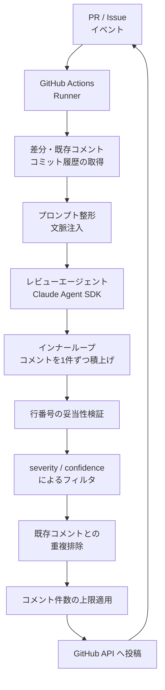

AI コーディングツールの普及で、コードを書く速度は上がりました。一方で、そのコードを読んで可否を判断する側の負荷は減っていません。むしろ、レビュー待ちの列が伸びています。

この記事では、MonotaRO が公開した社内 AI レビューエージェント「Makasetaro」の設計を読み解きます。扱うのはツール紹介ではなく、**熟練者の判断をどう仕組みへ移すか**という組織設計の問題です。読み終えたときに、次の 3 つを持ち帰れる構成にしています。

- AI レビューを「エージェントに任せる」のではなく「ハーネスで挟む」と何が変わるか
- シニアの多ターン判断を再現するために必要なループ構造
- 自組織へ移植するときに、先に決めておくべき判断ポイントと限界

*この記事の全体像。以下、順に解説します。*

## 何が詰まっているのか: 書く速度と読む速度の非対称

AI 支援を受けた開発者は、コメントとテストが揃った PR を半日で提出できます。ここまでは速くなりました。

問題はその先です。提出された PR が妥当かどうかを判断する作業は、依然として経験のあるレビュアに集中します。しかも「一見もっともらしい PR」は、雑な PR よりも検証コストが高くなります。表面が整っているぶん、疑うべき箇所が見つけにくいためです。

つまり、生産性向上の効果は書き手側に偏り、そのしわ寄せが読み手側に溜まります。人を増やしてもシニアは増えないため、この非対称は人員配置では解けません。MonotaRO が取ったのは「AI が書いたコードを AI にレビューさせる」方向です[^1]。

ただし、汎用 LLM に「レビューして」と頼むだけでは、ノイズが増えて読まれなくなります。Makasetaro の設計上の主張は、**エージェントに自由度を与えないこと**にあります。

## 全体像: エージェントをハーネスで挟む

Makasetaro は、エージェント単体ではなく、前後を決定論的なコード(ハーネス)で挟んだパイプラインとして構成されています。

役割分担を整理すると次のようになります。

| 層 | 担当 | 責務 | 与えない権限 |
|---|---|---|---|
| 前工程ハーネス | Python アプリ + GitHub Actions | リポジトリの clone、PR 差分・既存コメント・コミット履歴の収集、プロンプトへの構造化注入 | (規定なし) |
| エージェント | Claude Agent SDK | コード読解と指摘候補の生成 | `git` / `gh` / GitHub API の直接操作 |
| 後工程ハーネス | Python アプリ + GitHub Actions | 行番号の妥当性検証、severity と confidence によるフィルタ、重複排除、件数上限、投稿 | (規定なし) |
| ラウンド記憶 | ハーネス + プロンプト | 過去ラウンドの履歴(commit SHA 付き)と人間との対話経緯を次回へ伝播 | (規定なし) |

ここで重要なのは、**投稿するかどうかをエージェントが決めていない**点です。エージェントは候補を出すだけで、人に届ける判断はコード側にあります。

## 設計の中身: 4 つの選択

### 1. 遮眼革(ブリンカー)としてのハーネス

エージェント本体には `git` も `gh` も GitHub API アクセスも渡さず、外部 MCP サーバーも噛ませません。エージェントができるのは、注入された情報を読み、レビュー用のカスタムツール経由でコメント候補を出すことだけです。

馬の視野を制限する遮眼革になぞらえた設計で、狙いは 3 つあります。

- **ターンの浪費を防ぐ**: 権限や環境を探索する試行がそもそも発生しない
- **副作用を遮断する**: 意図しない書き込みや操作が構造的に起きない
- **プロンプトインジェクションの被害面を削る**: 差分に悪意ある指示が混じっても、実行できる操作が存在しない

「エージェントに何ができるか」を賢さで制御せず、**渡す道具の数で制御している**ということです。判断支援の設計としては、権限を絞ってから精度を詰めるほうが説明可能性が高くなります。

### 2. インナーループとアウターループの二重構造

シニアのレビューは 1 回の読解で完結しません。読み進めながら指摘を足し、再提出のたびに前回の文脈を踏まえて判断します。Makasetaro はこれを 2 つのループに分解しています。

| ループ | スコープ | 仕組み | 解いている問題 |
|---|---|---|---|
| インナーループ | 1 回の実行内 | JSON の構造化出力とカスタムツール呼び出しを併用し、対象行・severity・confidence を持つコメントを 1 件ずつ積み上げる | 全件を一括生成すると、1 箇所のフォーマット崩れで全体がやり直しになる |
| アウターループ | PR の寿命全体 | 過去ラウンドのレビュー履歴(commit SHA 付き)、既存インラインコメント、人間レビュアとの返信経緯を毎回のプロンプトへ織り込む | コミットが追加されるたびに同じ指摘を繰り返す |

アウターループの効果は、指摘の精度そのものより**読まれ方**に出ます。同じ指摘が毎回並ぶレビューは、数回で読み飛ばされるようになります。文脈を継承させることは、精度の問題ではなく信頼の問題として扱われています。

### 3. 実装セッションからコンテキストを切り離す

手元の実装セッションには、試行錯誤の経緯が残っています。「この方針で合意した」「ここは一旦こうした」という前提が文脈に積まれた状態では、同じセッションでレビューさせても前提ごと肯定されがちです。

Makasetaro はリモート環境(GitHub Actions)で動き、入力は Issue / PR / 差分に限定されます。実装時の文脈を引き継がないことで、**「実装プロセスを知らない第三者」の視点**を再現しています。

これは人間のレビュー体制でも同じ構造です。設計会議に出ていた人だけでレビューを回すと、前提そのものは検査されません。切り離しは、モデルの性能ではなく配置で作られています。

### 4. コストと「効いているか」を同時に見る

エージェントの運用でコストが読めなくなる典型は、ターン数が状況次第で伸びることです。Makasetaro は 1 run あたりのターン数上限と予算上限をコードで制限しています。

さらに、次のようなエンゲージメント指標を計測しています。

- **Actioned**: 指摘を引用するコミットが後に続いたか
- **Engaged**: 返信やリアクションがついたか

コストと効果を並べて置くことで、「トークンをいくら使ったか」ではなく「読まれて反映されているか」でトークンコストの妥当性を説明できる状態を作っています。AI 投資の継続可否を組織で議論するときに必要なのは、まさにこの形の指標です。

## 他のアプローチとどう違うのか

主要な AI コードレビュー手段と並べると、Makasetaro の位置づけがはっきりします。

| 比較軸 | Makasetaro(MonotaRO) | Claude Code Review(Anthropic) | CodeRabbit | Qodo(PR-Agent) |
|---|---|---|---|---|
| アーキテクチャ | 自社ハーネス + Agent SDK | 純正の Actions 統合 | SaaS の解析エンジン + LLM | OSS の Python フレームワーク |
| エージェント権限 | レビュー用ツールのみに遮断 | アクション内で限定 | SaaS バックエンドが制御 | 設定により可変 |
| 文脈の継承 | 過去ラウンド履歴をプロンプト注入 | 自動のコンテキスト管理 | リポジトリグラフと履歴検索 | プロンプト埋め込み |
| 品質制御の位置 | ハーネス側のコード判定 | プロンプト定義に依存 | 静的解析と AI の併用 | プロンプト定義に依存 |
| 主な利点 | 自由度制御による安全性、社内文脈への適合 | 導入の簡便さ | UI と統合の完成度 | カスタマイズ性 |

既製品との差は、モデルの良し悪しではありません。**品質制御をプロンプトに置くか、コードに置くか**の違いです。社内固有の判断基準を反映させたい場合、プロンプト側だけで表現すると再現性が落ちます。Makasetaro は再現性が必要な部分をハーネスへ移しています。

導入判断としては、次の切り分けになります。

- 社内固有のレビュー規範が薄く、まず立ち上げたい: 既製品が速い
- 社内固有の判断基準があり、フィルタ条件を自分たちで持ちたい: ハーネス自作が効く

## 反証と限界

この方式にも、運用を始めると効いてくる弱点があります。元記事の設計から論理的に導かれるものを 3 つ挙げます。

### 1. 熟練者の判断が固定化する

プロンプトやルーブリックに現在の判断基準を埋め込むほど、その基準は自動で適用され続けます。言語やフレームワークが更新され、設計パターンが変わっても、古いローカルルールが残ります。

移植した瞬間から、暗黙知は「更新されない知識」に変わります。したがって、規範を維持・更新する担当(Steward)を運用として置かないと、エージェントは数年後にレガシー慣習の番人になります。

### 2. Actioned 指標はハックできる

「指摘の後にコミットが続いたか」を効果指標にすると、マージを通すためだけの本質的でない修正でも数値は上がります。指摘の質ではなく、AI へ迎合する行動が計測されてしまう構造です。

指標を置くこと自体は正しい判断ですが、Actioned 単独を評価軸にすると誤った最適化を誘発します。返信内容の質やレビュー後の欠陥流出率など、別系統の指標と併読する必要があります。

### 3. スコープを絞ったぶん、広域の欠陥は見えない

入力を差分と PR 周辺に限定する設計は、安全性とコストの面では有利です。その裏返しとして、リポジトリ全体をまたぐ暗黙の依存関係の破壊や、性能劣化のような広域の問題は検出範囲外になります。

この方式は人間のレビューを置き換えるものではなく、**局所的な指摘を引き受けて人間を広域の判断に集中させる**ものだと位置づけるのが妥当です。

## 自組織へ移植するときの判断ポイント

暗黙知の移植でよくある失敗は、「シニアっぽいコメントを生成させる」プロンプトを書いて終わることです。出力は増えますが、読まれる指摘は増えません。

Makasetaro の設計から取り出せる原則は、次の 2 点に集約できます。

1. **判断根拠を構造化して出力させる**: severity(重要度)と confidence(確信度)の明示を義務づけ、指摘を単なる文章にしない
2. **人へ戻す条件をコードで決める**: どのレベル以上を投稿し、どのレベル以下を捨てるかはハーネス側の決定論的ロジックに置く

そのうえで、着手前に決めておくべき事項を挙げます。

| 決めること | 判断の観点 |
|---|---|
| どの指摘を人へ届けるか | severity と confidence の閾値。最初は厳しめにして、読まれる状態を先に作る |
| 誰が規範を更新するか | Steward の指名と、見直しの周期。ここが空だと 1 年で陳腐化する |
| 何を効果指標にするか | Actioned 単独にしない。返信の質や欠陥流出と併読する |
| どこまでを対象にするか | 差分中心にするか、静的解析や AST の情報を前工程で補うか |

最後の項目は、限界 3 への対処にあたります。前工程ハーネスは自分たちのコードなので、依存関係の情報を追加注入する余地があります。ここは実験しやすく、効果も測りやすい領域です。

## まとめ

- AI コーディングの普及は、書く速度と読む速度の非対称を生みます。人員配置では解けません。
- Makasetaro は、エージェントに `git` や GitHub API を渡さず、前後をハーネスで挟む構成を取っています。投稿の可否はコード側が決めます。
- インナーループで指摘を積み上げ、アウターループで過去ラウンドと対話経緯を継承することで、シニアの多ターン判断を近似しています。
- 実装セッションから文脈を切り離すことで、第三者視点を配置で作っています。
- ターン数と予算の上限、Actioned / Engaged の計測により、コストの妥当性を組織へ説明できる状態を作っています。
- 一方で、判断基準の固定化、Actioned 指標のハック、広域欠陥の見落としという限界があります。移植の前に、閾値・Steward・指標・スコープの 4 点を決めておくことが要点です。

暗黙知の移植は、模倣ではなくルーブリック化と制御コード化です。何を自動で通し、何を人へ戻すかを決める作業が本体であり、モデル選定はその後に来ます。

この記事が少しでも参考になった、あるいは改善点などがあれば、ぜひリアクションやコメント、SNSでのシェアをいただけると励みになります！

## 参考リンク

1. MonotaRO Tech Blog「シニアエンジニア目線をAIレビューへ 〜 判断を移植した社内エージェント「Makasetaro」の設計」2026-08-05. https://tech-blog.monotaro.com/entry/2026/08/05/090000
2. Yang, J., et al. "SWE-agent: Agent-Computer Interfaces Enable Automated Software Engineering." NeurIPS 2024. https://arxiv.org/abs/2405.15793
3. Leviathan, Y., Kalman, M., Matias, Y. "Prompt Repetition Improves Non-Reasoning LLMs." 2025. https://arxiv.org/abs/2512.14982

[^1]: 本記事の Makasetaro に関する記述は、MonotaRO Tech Blog の公開記事(2026-08-05)を出典としています。数値や内部実装の詳細は公開範囲に限られます。
