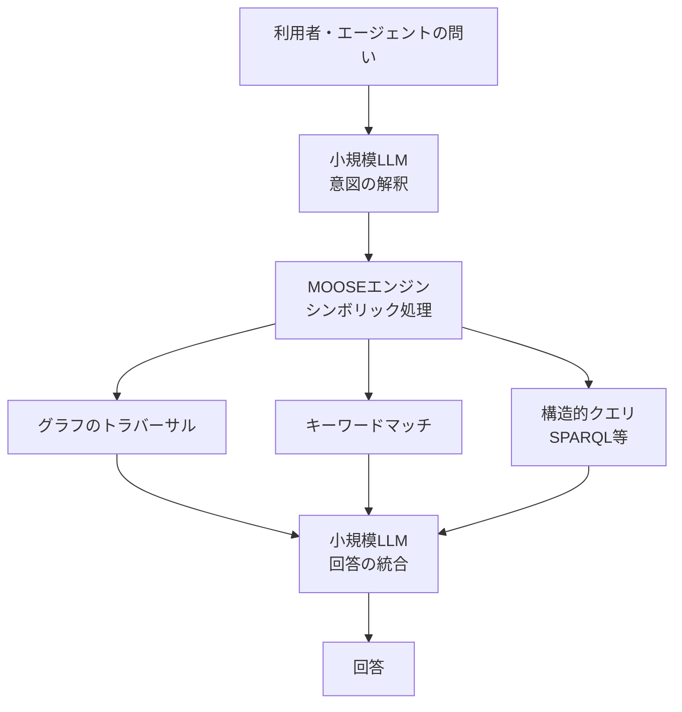

コーディングエージェントに過去の設計判断を憶えさせる方法は、いま多くがベクトル検索です。しかしベクトル検索は「その判断がまだ生きているか」を判定できません。結果として、すでに撤回されたはずの決定がエージェントの回答に混ざります。

MOOSEDevは、この問題をオントロジーに基づく知識グラフで扱う提案です。この記事では、何が課題とされているか、MOOSEDevがどう解いているか、そして自分のプロジェクトにどこまで持ち帰れるかを整理します。

*この記事の全体像。以下、順に解説します。*

## コーディングエージェントの記憶が抱える「理解の負債」

チームのプロジェクト記憶は、単なる文書の集まりではありません。次のような関係を持ちます。

- ある決定が、別の決定を**置き換えている**（後継関係）
- ある制約が、いまは**失効している**
- 「制約は全部でいくつあるか」という**集合の完全性**が問われる
- 「この方式は採用していない」という**否定**の情報がある

ベクトル検索は意味の近さで文書を引き当てる仕組みです。「近い」ことは判定できますが、「新しい方に置き換わった」「もう有効でない」「これで全部だ」は判定できません。この差分がエージェントの誤答として蓄積していく状態を、MOOSEDevの提案では **Comprehension debt（理解の負債）** と呼んでいます。

負債という言い方が示すとおり、問題は一回の誤答ではありません。古い判断が再浮上するたびに、人間がレビューで打ち消す作業が発生します。エージェントを増やすほどこの打ち消しコストが増える構造になります。

## MOOSEDevが採る解法: オントロジー型の知識グラフ

MOOSEDevは、アーキテクチャ上の決定・制約・その理由といった情報を、**オントロジーに基づく知識グラフ**として保持し、Model Context Protocol（MCP）経由でエージェントに提供します。

### 1. すべてのレコードにライフサイクルと後継リンクを持たせる

中核はデータモデル側の設計です。

| 付与するもの | 役割 |
|---|---|
| ライフサイクルステータス | 有効 / 非推奨などの状態を明示 |
| 後継関係リンク（supersession link） | どのレコードがどれを置き換えたかを表現 |

現在有効なガイダンスを取り出すとき、失効したレコードを**決定論的に除外**できます。「たぶん古い方は上位に来ないだろう」という確率的な期待ではなく、状態を見て落とす、という違いです。

### 2. 検索・推論はシンボリックに、LLMは意図解釈と統合に限定する

MOOSEDevは、検索と推論の基盤にneurosymbolicエンジン（MOOSE）を使います。役割分担は次のようになります。

グラフのトラバーサル、キーワードマッチ、SPARQLのような構造的クエリはシンボリックに処理します。LLMは8〜32B程度の小規模モデルが担当し、役割は**ユーザーの意図解釈と回答の統合だけ**です。

判断の中心を推論エンジン側に置くと、失効判定や集合の完全性のように「取りこぼしが許されない」処理をモデルの当たり外れから切り離せます。ここは記憶層を設計するうえでの重要な分岐点です。

### 3. 語彙は小さく保つ

オントロジーはOWLとSHACLシェイプで定義されます。規模は次のとおりで、意図的に小さく抑えられています。

| 語彙 | クラス数 |
|---|---|
| ソフトウェアエンジニアリング | 9 |
| ソフトウェアアーキテクチャ | 11 |

関係性の表現に使うプロパティは合計51です。オントロジーというと大掛かりに聞こえますが、実際に定義されているのは20クラス規模の語彙です。

### 4. MCPで4つのツールグループを露出する

エージェント側から見えるインターフェースは、MCP経由の4グループに整理されています。

| ツールグループ | 用途 |
|---|---|
| 型付きの記録 | 決定・制約・理由をスキーマに沿って書き込む |
| 読み取り | 自然言語およびSPARQLで問い合わせる |
| ライフサイクル管理 | 状態の更新・後継関係の設定 |
| 整合性確認 | グラフの矛盾チェック |

書き込みが「型付き」である点が、後述する運用コストの源にもなります。

## 精度差はどこで出たか

評価はCodeGraphを用い、835件のタイプレコードに対して行われています。焦点は、まさにベクトル検索が苦手とする3種類のタスクです。

| タスク | MOOSEDev | ベクトル検索ベース（mem0等） |
|---|---|---|
| 失効判定 | 0.98〜1.00 | 6%〜27% |
| 集合の完全性 | 同上 | 同上 |
| 否定 | 同上 | 同上 |

この差は「検索器の性能差」ではなく、**そもそも状態を持っているかどうかの差**と読むのが妥当です。ベクトル検索側は失効という概念をデータに持っていないので、当てられる方が偶然に近くなります。

裏を返せば、この結果は「一般的な検索品質でMOOSEDevが優れている」ことを示すものではありません。設計上の得意領域を、その領域を測る問題で計測した結果です。

## 採用を判断する前に見ておく制約

提案側でも示されている制約が4つあります。導入判断ではこちらが主役になります。

### プロプライエタリエンジンへのロックイン

MOOSEエンジンという非公開基盤に依存します。Pineconeやpgvectorのように、OSSベクトルデータベースを前提とした汎用性・ポータビリティは得られません。記憶層は一度乗せると差し替えコストが高い層なので、ここは軽く見ない方が安全です。

### 入力時の摩擦

フラットなテキストを放り込む方式ではなく、情報をオントロジーに沿ってモデル化する負担が生じます。書く側の手間が増えるということです。書き込みが面倒な記憶層は、そもそも書かれなくなります。

### スケール

グラフデータベースは、動的なスケールにおいてベクトルDBほどの水平拡張性を持たない可能性が指摘されています。

### 評価規模と陳腐化リスク

835件は比較的小規模なデータセットです。数万件規模のIssueやPRが交錯するエンタープライズ環境でのノイズ耐性は未知数です。加えて、GraphRAGや超長文コンテキストを持つLLMの進化により、手で定義した厳格なオントロジーがなくても非構造化データから関係性を動的に推論できるようになる可能性があります。その場合、構造化の手間そのものが陳腐化します。

## いま自分の設計に持ち帰れること

MOOSEDevをそのまま導入するかどうかとは別に、**この提案から切り出せる設計上の要点**があります。

### 記憶データモデルにメタデータを2つ足す

エージェントの記憶を保存しているテーブルなりコレクションなりに、次のフィールドを持たせます。

| フィールド | 意味 |
|---|---|
| 失効フラグ | このレコードが現在有効かどうか |
| `superseded_by` | どのレコードに置き換えられたか（後継ID） |

これだけで、検索結果から失効レコードを決定論的に落とせるようになります。ベクトル検索を捨てる必要はありません。検索は従来どおり行い、**取得後のフィルタを状態で行う**という構成です。

### 当面の現実解は「RAG + 軽量メタデータ層」

ロックインを避けつつ課題に対処する段階的なアプローチとしては、既存のRAGアーキテクチャに、状態と依存関係を管理する軽量なメタデータ層（リレーショナルな管理で十分）を追加する形が現実的です。

判断の順序としては次のようになります。

1. まず失効フラグと後継IDを入れて、古い決定の再浮上を止める
2. それでも「制約は全部でいくつか」「これは採用していないはずだ」に答えられない場面が残るかを観測する
3. 残るなら、そこで初めてグラフ・オントロジー側への投資を検討する

いきなり3から始めると、入力時の摩擦とロックインを同時に抱え込むことになります。

## まとめ

- ベクトル検索ベースの記憶は、失効・後継・集合の完全性・否定を扱えない。MOOSEDevはこれをComprehension debtとして問題化している
- 解法は、ライフサイクルと後継リンクを持つオントロジー型知識グラフ + シンボリックな検索推論 + MCPインターフェース。LLMの役割は意図解釈と回答統合に限定される
- 該当タスクでの精度は0.98〜1.00に対し、ベクトル検索ベースは6%〜27%。ただしこれは設計上の得意領域を測った結果として読む
- 制約はロックイン・入力時の摩擦・スケール・評価規模と陳腐化リスクの4つ
- 全面導入を見送る場合でも、記憶データモデルへの「失効フラグ」「`superseded_by`」の付与は即座に採用してよい

エージェントの記憶層をどう持つかは、あとから差し替えにくい設計判断です。フルスタックの採否より先に、いま使っている記憶に状態が入っているかを確認するところから始めるのが確実です。

この記事が少しでも参考になった、あるいは改善点などがあれば、ぜひリアクションやコメント、SNSでのシェアをいただけると励みになります！

## 参考リンク

- [MOOSEDev (arXiv:2608.13662)](https://arxiv.org/abs/2608.13662)
- [Model Context Protocol 公式ドキュメント](https://modelcontextprotocol.io/)
