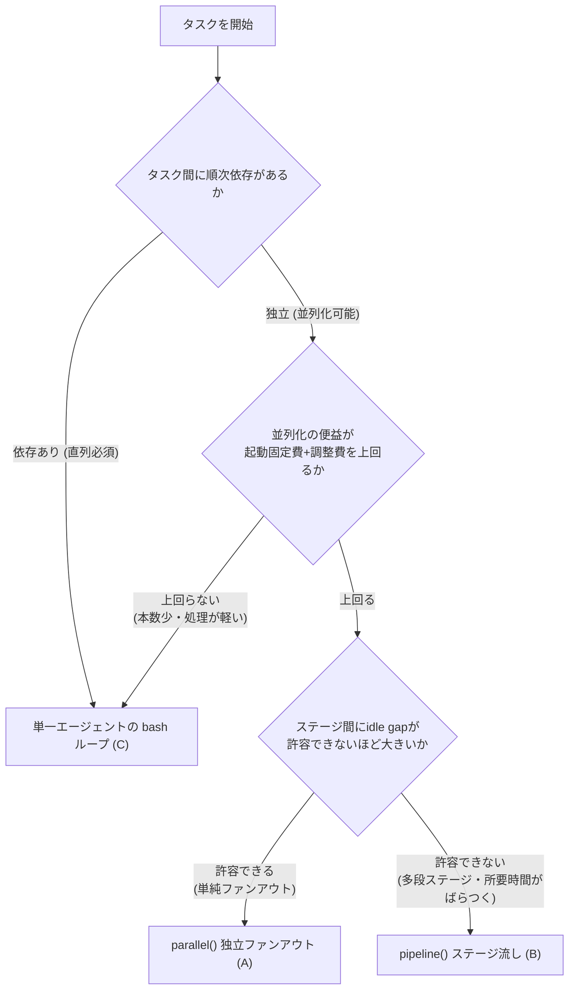
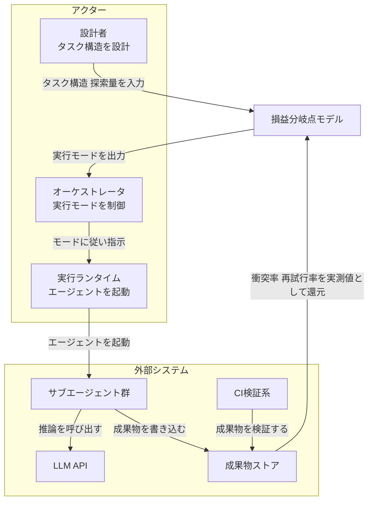
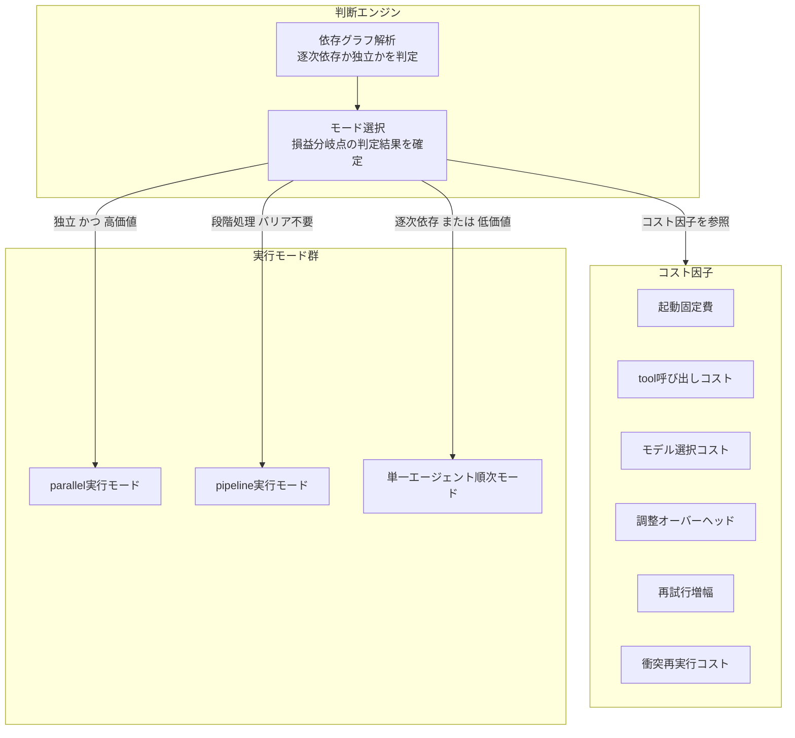
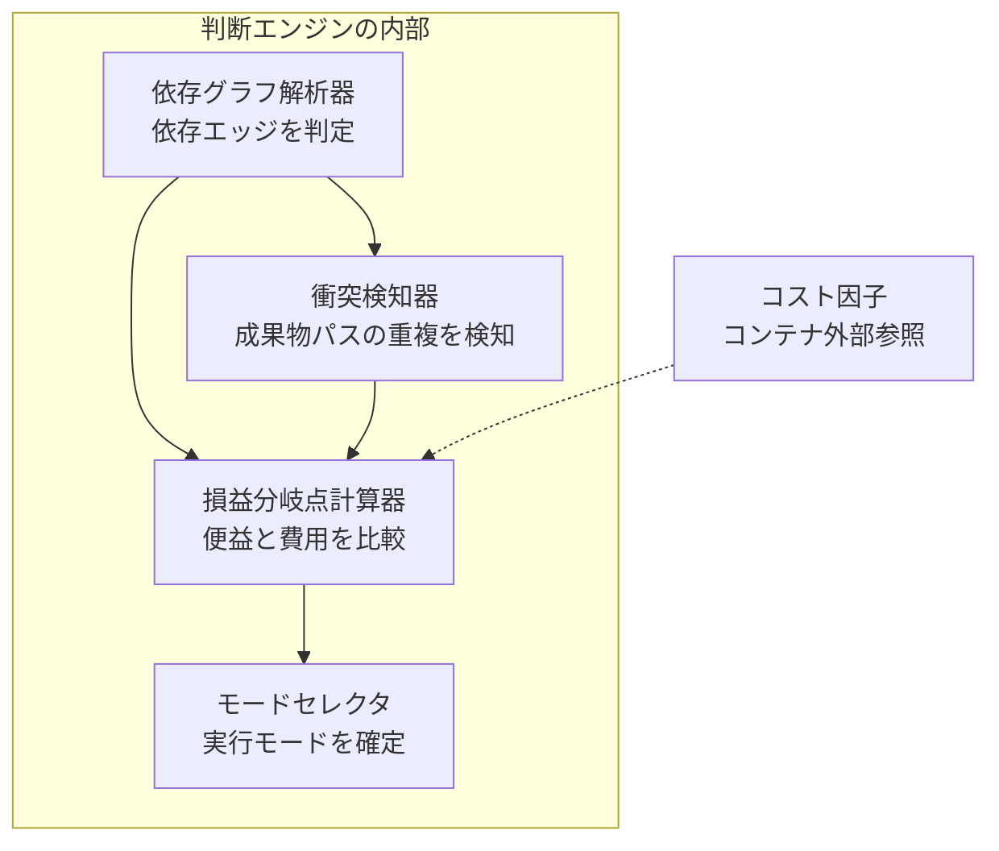
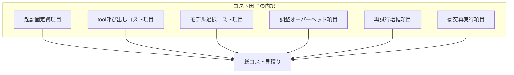
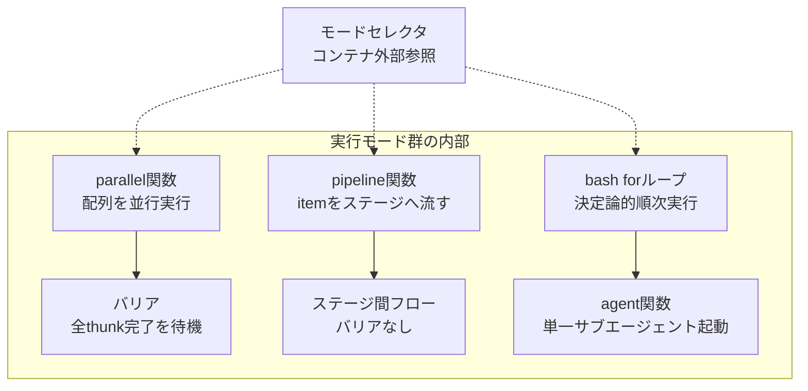
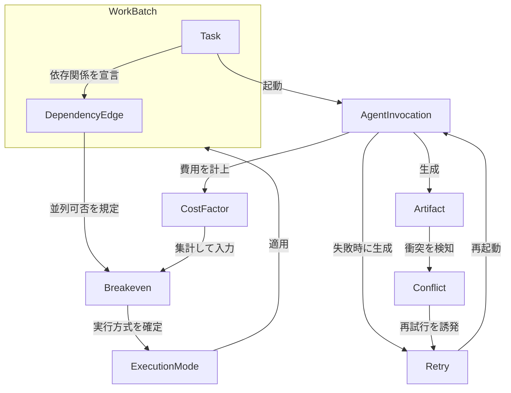
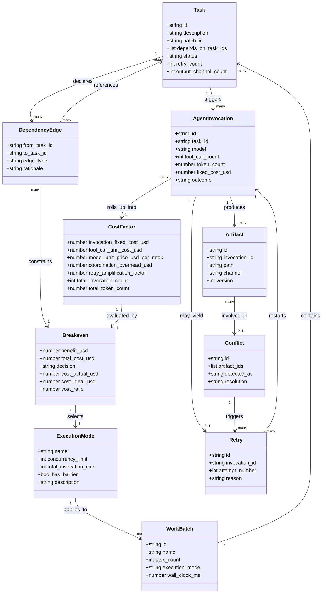
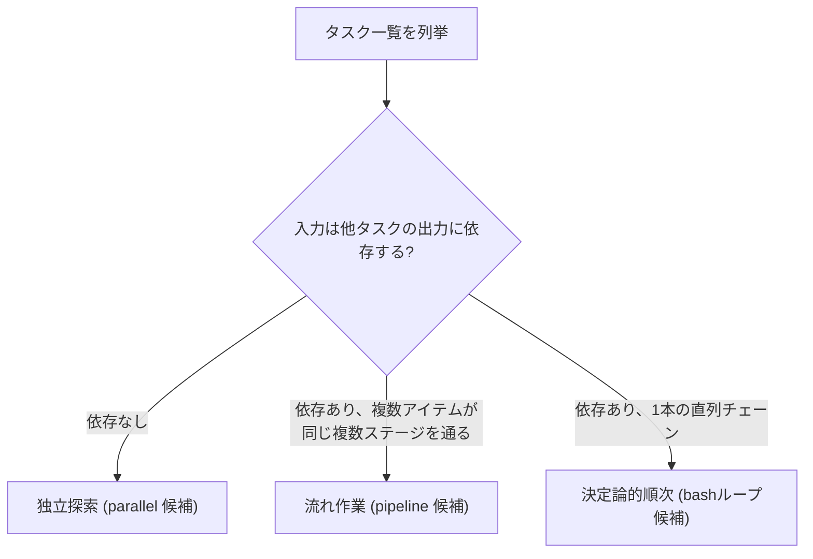

> 調査日: 2026-07-17 / 対象: 決定論的な順次処理を「サブエージェントに分割するか、単一エージェントのスクリプトへ戻すか」を判断するコストモデル
> 視座: プロダクト機能の解説ではなく、「いつ並列化し、いつ順次へ戻すか」をコスト構造で判断する方法論として読む
> 代表ケース: tottoko_hamu 氏の実測（39 本の記事への一括処理を 4 フェーズに分け、エージェント 116 本・428 万トークンを消費。順次フェーズの過剰分割が主因で理想設計比 5.7 倍のコスト）

## 概要

### このモデルが解く問題

複数ステップの作業を自動化するとき、実行方法の選択肢は主に 3 つあります。

- サブエージェントを大量起動して並列実行する
- サブエージェントを流れ作業（パイプライン）で実行する
- 単一エージェントがループ（bash スクリプト）で順番に処理する

このモデルは「どの実行方法を選ぶべきか」を、勘ではなくコスト構造で判断するための枠組みです。判断の主軸は 1 点だけです。

**タスク間に順次依存があるか、独立して並列化できるか。**

順次依存があるタスクでは、前の結果が出て初めて次を始められます。サブエージェントを何本起動しても、処理速度は 1 本の場合と同じです。この場合、サブエージェント分割は起動コストだけを積み増します。

### なぜ「損益分岐点」が生まれるか

サブエージェント分割には固定費があります。エージェント 1 本ごとに、コンテキスト初期化・指示読込・ツール呼び出しが発生します。この固定費は、起動本数に比例して積み上がります。

一方、並列化には便益があります。wall-clock 時間の短縮と、コンテキスト分離（各タスクが独立した文脈を保つこと）です。

損益分岐点は、次の不等式で表せます。

```
並列化の便益 (wall-clock短縮 + context分離の価値)
  >
起動固定費 × 本数 + 調整オーバーヘッド + 再試行増幅コスト
```

左辺が右辺を上回るときだけ、サブエージェント分割に価値があります。順次依存タスクでは左辺（便益）がほぼゼロなので、右辺（コスト）だけが積み上がります。

### 代表ケースが示す実測ギャップ

tottoko_hamu 氏の実測（一次: [zenn.dev/tottoko_hamu](https://zenn.dev/tottoko_hamu/articles/2026-06-23-090000)）は、このギャップを具体的な数値で示しています。

| 指標 | 数値 |
|---|---|
| タスク | 39 本の記事へ CTA 一括追加。ソース / はてな用 / Zenn 用の 3 形式を編集し、はてな・Zenn・Qiita へ公開 |
| 実行時間 | 5 時間 17 分（19,052,752ms） |
| トークン消費 | 4,283,366（4.28M） |
| ツール使用回数 | 510 回 |
| 起動エージェント数 | 116 本（Phase1: CTA 編集 39 本並列 + Phase2: はてな公開 38 本順次 + Phase3: Zenn へ git push 単一エージェント + Phase4: Qiita 公開 37 本順次 + 管理用） |
| 実測コスト（概算） | 約 $25.70 |
| 理想設計コスト（概算） | 約 $4.47（116 本 → 約 43 本に削減） |
| コスト差 | 5.7 倍 |

このタスクの Phase1（CTA 編集 39 本並列）は、記事間に依存がない独立ファンアウトなので、並列化の便益がコストを上回ります。一方 Phase2（はてな公開 38 本）と Phase4（Qiita 公開 37 本）の合計 75 本は、外部プラットフォームへの順次公開を 1 件ずつサブエージェントに割り当てていました。直列にしか実行できない処理です。なお Phase3（Zenn への git push）は単一エージェントで実行されています。著者の結論はこうです。

> 並列処理には Workflow の `parallel()`、順次処理には単一エージェントの bash ループを使う。この使い分けを設計段階で意識できているかどうかで、コストが数倍変わる。

Phase2・Phase4 をそれぞれ単一エージェントに統一すると、この 2 フェーズは合計 75 本から 2 本（各フェーズ 1 本）へ減ります。Phase1 の 39 本（並列）と Phase3 の 1 本、管理用を合わせ、全体は 116 本から約 43 本まで削減できます。これがコスト差 5.7 倍の内訳です。

### 一次データが示すコストの重み

Anthropic の「How we built our multi-agent research system」（[一次](https://www.anthropic.com/engineering/multi-agent-research-system)）は、マルチエージェント化のトークンコストを定量化しています。

- 単一エージェントは chat の約 4 倍のトークンを消費します。
- マルチエージェントは chat の約 15 倍のトークンを消費します。
- パフォーマンスの分散は、トークン使用量・ツール呼び出し回数・モデル選択の 3 要因の合計で約 95% を説明できます。うちトークン使用量単体で約 80% を占めます（残る約 5% は 3 要因では説明されません）。

同記事は、マルチエージェント化が正当化される条件を「重い並列化を伴う価値の高いタスク・単一コンテキストウィンドウを超える情報量・多数の複雑なツールとのやり取り」と述べています。逆に「全エージェントが同じコンテキストを共有する必要がある領域」「エージェント間の依存が多い領域」は不向きだと明示しています。

依存関係が多いタスク（コーディングタスクが例示されています）は、マルチエージェント化に向きません。トークンコストの重さは、独立して並列化できるタスクにだけ支払う価値がある「入場料」です。

### 判断フロー



### 3 つの実行モードの比較

3 つの実行モードは、Claude Code dynamic workflows（[公式](https://code.claude.com/docs/en/workflows)）が提供する `agent()` / `pipeline()` と、それに対置される「単一エージェントの bash ループ」です。なお公式ドキュメントに実行例が載るのは `agent()` と単一ステージの `pipeline()` のみです。`parallel()` の存在・バリア意味論・複数ステージ `pipeline()` の挙動は、非公式の解説（claude-world.com / alexop.dev）で補足された記述に基づきます。

| 項目 | (A) parallel() 独立ファンアウト | (B) pipeline() ステージ流し | (C) 単一エージェント bashループ |
|---|---|---|---|
| 適合タスク | 相互依存のない独立タスクの一括処理（例: N 件のレビュー・監査） | 複数ステージからなる処理を大量アイテムに流す（例: 収集→変換→検証） | 順次依存のある決定論的な機械的変換（例: 全ファイルへの同一文字列追記） |
| トークン効率 | 低い（エージェント本数×固定費が積み上がる） | 中程度（固定費は残るが、idle gap を排除して総稼働効率を上げる） | 高い（エージェント起動を伴わないため固定費が最小） |
| wall-clock | 短い（独立タスクを同時実行、ただしバリアで最も遅い 1 本に律速） | 短い（ステージ間バリアなし、アイテム N+1 は N が stage1 を終えた時点で開始） | 長くなりやすい（1 件ずつ順に処理） |
| context 分離 | あり（各サブエージェントが独立コンテキスト、最終結果のみ呼び出し元に返る） | あり（同上、中間結果はスクリプト変数に保持） | なし（単一コンテキストで処理を継続） |
| 調整コスト | 中（全 thunk 完了を待つバリア同期が必要） | 中（ステージ間の受け渡し管理は必要、バリア待ちはループ制御に置き換わる） | 低い（ループ制御のみで完結する） |
| 失敗時の再試行増幅 | 中（失敗した個別 thunk のみ再試行できるが、各再試行にも固定費がかかる） | 低〜中（完了済みエージェントの結果はキャッシュされ再開時に再利用される） | 低い（失敗箇所のみループ内でリトライし、固定費は 1 回分で済む） |

#### ユースケース別の推奨

| ユースケース | 推奨モード | 理由 |
|---|---|---|
| 独立した N 件の記事に同じ変更を並列で加える | (A) parallel() | 記事間に依存がなく、並列化の便益（wall-clock 短縮）が固定費を上回る |
| 収集→変換→検証のように所要時間が異なる多段処理を大量アイテムに流す | (B) pipeline() | ステージ間バリアを排除し、parallel() の idle gap を避けられる |
| 全ファイルへの同一文字列追記など、決定論的で直列にしか実行できない変換 | (C) 単一エージェント bashループ | 便益（並列化・context 分離）がほぼゼロなので、サブエージェント起動固定費だけが無駄になる |
| 探索や判断を要する調査を複数の独立した観点から行う | (A) parallel() または orchestrator-worker | Anthropic のリサーチシステムは lead agent が 1 ウェーブ 3〜5 本の subagent を並列起動し（複雑な調査では総数がさらに増える）、方向性が独立しているタスクでコストに見合う便益を得ている |

## 特徴

- **コスト因子を分解して判断できる。** 起動固定費（コンテキスト初期化・指示読込）、tool 呼び出し数、モデル選択、調整/統合オーバーヘッド、再試行増幅、成果物衝突による再実行の 6 因子に分けて評価します。
- **役割名でなく依存関係と並列化可能性で設計する。** 「レビュー担当エージェント」のような役割ラベルではなく、「このタスクは前段の結果を必要とするか」「複数タスクは互いに独立か」で実行モードを決めます。
- **順次依存タスクへのサブエージェント分割は便益ゼロ。** tottoko_hamu の実測では、直列必須の Phase2・Phase4（合計 75 本）がコスト超過の主因でした。直列なら 1 本のループに統一するのが正着です。
- **マルチエージェント化のトークンコストは軽くない。** Anthropic の実測で、マルチエージェントは chat の約 15 倍、単一エージェントでも約 4 倍のトークンを消費します。この重さに見合う便益（並列化・大量情報の集約）があるかを先に確認します。
- **性能分散の大半はトークン使用量で説明される。** 分散はトークン使用量・tool 呼び出し回数・モデル選択の 3 要因合計で約 95%、うちトークン使用量単体で約 80% を説明できます。エージェント本数を増やす前に、トークン消費の見積もりが判断材料になります。
- **pipeline() は parallel() の idle gap を解消する。** parallel() は全 thunk 完了を待つバリア同期のため、遅い 1 本に全体が律速されます。pipeline() はステージ間バリアがなく、アイテム N+1 は前アイテムが stage1 を終えた時点で開始できます。
- **実行系にはガードレールがある。** Claude Code dynamic workflows は同時実行エージェント数の上限 16 本、1 run あたり総数上限 1000 本を設けています。25 本超過または見積もりトークン総量が 150 万を超えると「Large workflow」警告が表示されます。
- **損益分岐の判定基準は「タスク価値・方向性の独立性・トークン量に見合う答えか」。** Anthropic は、マルチエージェント化が正当化される条件を「重い並列化・単一コンテキストを超える情報量・多数の複雑なツールとのやり取り」と述べる一方、「全エージェントが同じコンテキストを共有する必要がある領域」「エージェント間の依存が多い領域」は不向きとしています。

## 構造

本セクションは、損益分岐点モデルとオーケストレーション実行系の論理構造を C4 の 3 階層（システムコンテキスト / コンテナ / コンポーネント）で示します。対象はモデルという方法論そのものです。特定プロダクトの機能カタログではありません。なお C4 のコンテナは本来デプロイ可能な実行単位を表しますが、本図の「コスト因子」コンテナは実行プロセスではなく計算対象のデータ分類として、C4 記法を便宜的に流用しています。

### システムコンテキスト図

損益分岐点モデルを中心に、それを使うアクターと外部システムの関係を示します。



#### アクター

| 要素名 | 説明 |
|---|---|
| 設計者 | 損益分岐点モデルに入力するタスク構造・探索量を設計する人間または上位エージェント |
| オーケストレータ | モデルが出力した実行モードに従い、実行ランタイムを制御する主体 |
| 実行ランタイム | オーケストレータの指示を受けてサブエージェント群を起動する実行環境 |

#### 損益分岐点モデル本体

| 要素名 | 説明 |
|---|---|
| 損益分岐点モデル | 探索量・成果物衝突率・再試行率・調整オーバーヘッド・並列度から実行モードを判定する中心モデル |

#### 外部システム

| 要素名 | 説明 |
|---|---|
| サブエージェント群 | 実行ランタイムが起動する個々のエージェントインスタンスの集合 |
| LLM API | サブエージェントが推論のために呼び出す外部モデル呼び出しインタフェース |
| 成果物ストア | サブエージェントが書き込む出力ファイル・レポートの保管先 |
| CI検証系 | 成果物ストアの内容を検証し、再試行率という実測値をモデルへ還元する系 |

### コンテナ図

損益分岐点モデルとオーケストレーション実行系の主要構成要素を示します。



#### 判断エンジン

| 要素名 | 説明 |
|---|---|
| 依存グラフ解析 | タスク間のエッジが逐次依存か独立かを判定する処理 |
| モード選択 | 依存判定とコスト因子の見積りから、実行モードを 1 つに確定する処理 |

#### コスト因子

| 要素名 | 説明 |
|---|---|
| 起動固定費 | エージェントを 1 本起動するたびに発生する、context 初期化と指示読込のコスト |
| tool呼び出しコスト | エージェントが実行する tool 呼び出し回数に比例するコスト |
| モデル選択コスト | 起動するエージェントに割り当てるモデルの単価によるコスト |
| 調整オーバーヘッド | 複数エージェントの結果を統合する pass にかかるコスト |
| 再試行増幅 | 失敗時の再試行がエージェント本数に比例して増幅するコスト |
| 衝突再実行コスト | 成果物の衝突により再実行が発生した場合のコスト |

#### 実行モード群

| 要素名 | 説明 |
|---|---|
| parallel実行モード | 独立したタスクを配列で並行実行するモード |
| pipeline実行モード | タスクをステージへ順に流すモード |
| 単一エージェント順次モード | 単一エージェントが決定論的に順次処理するモード |

### コンポーネント図

各コンテナの内部をドリルダウンします。実行モード群のみ、Claude Code workflow のプリミティブを具体例として使います。

#### 判断エンジンのコンポーネント図



| 要素名 | 説明 |
|---|---|
| 依存グラフ解析器 | タスク間の DependencyEdge を解析し、逐次依存か独立かを判定する |
| 衝突検知器 | 独立候補タスクの成果物 Artifact パスの重複衝突を検知する |
| 損益分岐点計算器 | 並列化の便益と、起動固定費・調整費などのコスト因子を比較する |
| モードセレクタ | 損益分岐点計算器の判定結果から、実行モードを 1 つに確定する |
| コスト因子（コンテナ外部参照） | コンテナ図のコスト因子コンテナを、損益分岐点計算器が参照することを示す外部ノード |

#### コスト因子のコンポーネント図



| 要素名 | 説明 |
|---|---|
| 起動固定費項目 | エージェント 1 本あたりの context 初期化・指示読込コストを表す項目 |
| tool呼び出しコスト項目 | エージェントの tool 呼び出し回数に応じたコストを表す項目 |
| モデル選択コスト項目 | 起動時に選択するモデルの単価を表す項目 |
| 調整オーバーヘッド項目 | 複数エージェントの結果統合にかかるコストを表す項目 |
| 再試行増幅項目 | 失敗時の再試行がエージェント本数分だけ増幅するコストを表す項目 |
| 衝突再実行項目 | 成果物衝突による再実行コストを表す項目 |
| 総コスト見積り | 6 つのコスト因子項目を合算した見積り値。損益分岐点計算器の入力になる |

#### 実行モード群のコンポーネント図

Claude Code workflow の `agent()` `parallel()` `pipeline()` プリミティブと、単一エージェント順次モードの `bash for` ループを具体例とします。図中の `parallel()`・バリア・複数ステージの意味論は公式ページに記載がなく、非公式解説（claude-world.com / alexop.dev）に基づく点に注意してください。



| 要素名 | 説明 |
|---|---|
| parallel関数 | thunk の配列を並行実行するプリミティブ。全 thunk 完了を待つバリアを持つ |
| バリア | parallel 関数が全 thunk の完了を待機する同期点。並列度を上げても最遅 thunk に wall-clock が律速される |
| pipeline関数 | item の列を複数ステージへストリームするプリミティブ。ステージ間にバリアを持たない |
| ステージ間フロー | 前段 item 全体の完了を待たず、item 単位で次ステージへ流れる経路。idle gap を排除する |
| bash forループ | 単一エージェントが決定論的に順次処理するループ。新規エージェント起動を伴わない |
| agent関数 | 単一のサブエージェントを起動し、final text または schema 検証済み JSON を返すプリミティブ。呼び出しごとに AgentInvocation を 1 つ生成する |
| モードセレクタ（コンテナ外部参照） | 判断エンジンが確定した実行モードに応じて、呼び出し先プリミティブを切り替える外部ノード |

## データ

このセクションでは、損益分岐点モデルが扱う概念エンティティを定義します。対象は「損益分岐の判定に必要な最小の概念集合」です。

### 概念モデル

以下の 10 エンティティで構成します。

- Task、DependencyEdge、WorkBatch は「何を、どういう順序でやるか」を表します。
- AgentInvocation、Retry、Artifact、Conflict は「実行の結果として何が起きるか」を表します。
- CostFactor、Breakeven、ExecutionMode は「損益分岐をどう判定し、どの方式を選ぶか」を表します。



図の読み方を補足します。

- `WorkBatch` は `Task` と `DependencyEdge` を所有します（subgraph の入れ子）。
- それ以外の矢印はすべて利用・呼び出し・データ供給の関係です。
- `Breakeven` → `ExecutionMode` → `WorkBatch` →（次サイクルの `Task`/`DependencyEdge`）というループが、判定結果が次の実行方式に反映される構造を表します。

| エンティティ | 定義 | 根拠 |
|---|---|---|
| Task | 作業単位。1 本の成果物（記事 1 本など）を対象にした処理内容 | tottoko_hamu 実測（39 本の記事） |
| DependencyEdge | Task 間の依存関係。「直前の Task の完了を待つ必要があるか」を表す | 著者の結論（順次依存の有無で方式が変わる） |
| WorkBatch | 同じ実行方式で処理する Task の集合（Phase） | tottoko_hamu 実測（Phase1/Phase2/Phase4） |
| AgentInvocation | 1 回のサブエージェント起動。`agent()` 呼び出し 1 回に対応 | Claude Code workflows 公式 |
| ExecutionMode | 実行方式。parallel（独立ファンアウト）/ pipeline（ステージ流し）/ bash_loop（単一エージェント順次）の 3 値 | 3 つの実行モードの定義 |
| CostFactor | コスト因子の集計値。起動固定費・tool 呼び出し数・モデル単価・調整オーバーヘッドを保持 | コスト因子一覧 |
| Retry | AgentInvocation の再試行。失敗または Conflict によって発生する再起動 | モデルとして定義（tottoko_hamu 記事に個別件数の記載なし） |
| Artifact | AgentInvocation が生成する成果物（ファイル 1 つ） | tottoko_hamu 実測（1 Task あたり 3 箇所への出力） |
| Conflict | 複数 Artifact が同じ対象に対して競合した状態 | 成果物衝突による再実行 |
| Breakeven | 並列化の便益とコストを比較し、ExecutionMode を確定する判定 | 損益分岐の定義 |

### 情報モデル

主要属性のみを示します。メソッドは扱いません。



属性の根拠を、実測ケースに基づく値・公式仕様に基づく値・モデルとしての定義に分けて示します。

#### tottoko_hamu 実測から抽出した属性

| エンティティ.属性 | 実測値の例 | 出典 |
|---|---|---|
| WorkBatch.task_count | 39（Phase1 CTA 編集）/ 38（Phase2 はてな公開）/ 1（Phase3 Zenn push）/ 37（Phase4 Qiita 公開） | 一次: zenn.dev/tottoko_hamu/articles/2026-06-23-090000 |
| WorkBatch.wall_clock_ms | 19,052,752（全体 5 時間 17 分） | 同上 |
| CostFactor.total_invocation_count | 116 | 同上 |
| CostFactor.total_token_count | 4,283,366 | 同上 |
| AgentInvocation.tool_call_count（集計） | 510（全 116 本の合計） | 同上 |
| Task.output_channel_count | 3（Phase1 で編集する形式: ソース / はてな用 / Zenn 用） | 同上 |
| Breakeven.cost_actual_usd | 約 25.70 | 同上 |
| Breakeven.cost_ideal_usd | 約 4.47（116 本 → 約 43 本に削減した場合） | 同上 |
| Breakeven.cost_ratio | 5.7 | 同上 |

#### Claude Code workflows 公式仕様から抽出した属性

| エンティティ.属性 | 値 | 出典 |
|---|---|---|
| ExecutionMode.concurrency_limit | 16（同時実行上限。CPU コア数が少ない環境ではさらに低下） | https://code.claude.com/docs/en/workflows |
| ExecutionMode.total_invocation_cap | 1,000（1 run あたりの総 subagent 数上限） | 同上 |
| ExecutionMode.has_barrier | parallel() は true（全 thunk 完了を待つ）、pipeline() は false（ステージ間バリアなし） | 非公式解説（claude-world.com / alexop.dev）。公式ページにバリア・thunk の記載はない |
| AgentInvocation.model | 既定はセッションのモデルを継承。スクリプトでステージ単位に上書き可能 | 同上 |

#### モデルとして定義した属性（実装・記事に個別の記載なし）

| エンティティ.属性 | 定義理由 |
|---|---|
| Retry.reason / Conflict.resolution | 損益分岐の判定には「なぜ再試行が起きたか」の分類が必要だが、tottoko_hamu 記事には個別の再試行理由の内訳が記載されていないため、判断モデル上の分類項目として定義した |
| CostFactor.retry_amplification_factor | 再試行が増えるほどコストが増幅する関係を、判断モデル上の係数として一般化した |
| CostFactor.coordination_overhead_usd | 「調整/統合オーバーヘッド」はコスト因子として存在するが、金額の実測値は tottoko_hamu 記事にないため、モデル上の変数として定義した |
| DependencyEdge.edge_type | 「独立か直列必須か」の二値分類は、著者の結論（順次依存タスクでは並列化の意味がない）をモデル化するために定義した |

## 構築方法

損益分岐点モデルをどう組み立てるかを示します。実行方法を選ぶ前に、3 つの準備が要ります。依存グラフの抽出、コスト因子の見積もり、損益分岐の判定式への当てはめです。

### 依存グラフの抽出手順

- タスクを列挙し、各タスクの入力と出力を書き出します。
- あるタスクの入力が、別タスクの出力に依存するかを確認します。依存があれば有向エッジを引きます。
- エッジがゼロのタスク集合は「独立探索」に分類します。
- エッジが直列に連なるタスク集合（前工程の完了が次工程の開始条件）は「決定論的順次」に分類します。
- 「独立だが各アイテムが複数ステージを通る」パターン（例: 収集→変換→検証）は、ステージ単位で見ると順次ですが、アイテム単位で見ると並列余地があります。このパターンは pipeline() の対象です。



### コスト因子の見積もり

並列化を検討する前に、次の 6 因子を数値化します。単位は円換算（トークン単価 × 消費トークン）またはドル換算に揃えます。

| 因子 | 見積もり方法 |
|---|---|
| 起動固定費 | 1 エージェント起動あたりのコンテキスト初期化・指示読込トークン数 × モデル単価。tottoko_hamu 実測では 116 本起動で実測 $25.70、1 本あたり固定費が支配的でした |
| tool呼び出し数 | 1 エージェントが実行する平均 tool call 数 × 1 呼び出しあたりのトークン往復コスト |
| モデル単価 | ステージごとに使うモデル（例: 収集は haiku、監査は sonnet）の単価差。Workflow はステージごとにモデルを変えられます |
| 調整/統合オーバーヘッド | 複数エージェントの結果を 1 本にマージするための追加エージェント・追加パスのコスト |
| 再試行増幅率 | 1 本あたりの失敗率 × リトライで発生する追加起動固定費。本数が多いほど、増幅も本数倍になります |
| 衝突率 | 複数エージェントが同一ファイル/同一成果物に書き込むことで発生する再実行率。独立ファンアウトでも成果物が競合すると衝突コストが乗ります |

Anthropic の一次データ（https://www.anthropic.com/engineering/multi-agent-research-system）は、単一エージェントが chat の約 4 倍、マルチエージェントが約 15 倍のトークンを消費するとしています。この 4 倍・15 倍という比率が、消費トークン量を見積もる際の参照値になります。なお同記事の「token 使用量が性能分散の約 80% を説明する」は、同社の評価ベンチマークにおける成果の分散の話であり、コスト構成比そのものではありません。混同せずに使います。

粗い単価分解の例を示します。tottoko_hamu 実測は 116 本で約 $25.70 なので、1 本あたり平均コストは約 $0.22 です。理想設計は約 43 本なので、43 × $0.22 ≈ $9.5 に近づくと見込めますが、実測の理想値はさらに低い $4.47 です。この差は、順次フェーズを bash ループへ統合するとエージェント起動そのものが消え、平均単価も下がるためです。実際の見積もりでは、この平均単価をフェーズごとの起動本数へ掛け、順次フェーズの本数をゼロに置き換えて理想値を出します。

### 損益分岐の判定式

```
並列化の便益 (wall-clock短縮の価値 + context分離の価値)
  >
起動固定費 × 本数 + 調整オーバーヘッド + 再試行増幅コスト + 衝突コスト
```

- 左辺が右辺を上回るときだけ、サブエージェント分割に価値があります。
- 決定論的順次タスクは、便益（wall-clock 短縮）がほぼゼロです。前工程の結果が出るまで次工程を始められないため、本数を増やしても時間は縮みません。この場合は右辺だけが積み上がるので、判定式は常に不成立になります。
- tottoko_hamu 実測（Phase2・Phase4、計 75 本を順次実行）はこのケースに該当します。単一エージェントの bash ループに統一すると、起動固定費の項がほぼゼロになり、理想設計コストは実測 $25.70 から $4.47 まで下がります。

## 利用方法

判定式を当てはめたら、3 モードのいずれかを選びます。まず使い分け表で選定基準を確認します。

| モード | 適合条件 | 起動本数の目安 | トークン特性 |
|---|---|---|---|
| `parallel()` 独立ファンアウト | タスク間に依存がなく、全結果が揃ってから次工程に進む必要がある | 数本〜十数本（同時実行上限 16 本、1run 上限 1000 本） | 各エージェントが起動固定費を個別に払う。本数分だけ固定費が積み上がる |
| `pipeline()` ステージ流し | アイテムごとに複数ステージを通るが、ステージ間にバリア（全件完了待ち）が不要 | 数十本〜数百本（idle gap がない分、同じ本数でも `parallel()` より wall-clock が短い） | アイテム N がステージ 1 を終えた時点でアイテム N+1 が始まるため、起動が分散し待機コストが小さい |
| 単一エージェント bashループ | データ依存で直列必須、または外部制約（レート制限など）で直列化するタスク。決定論的で LLM 判断が不要なら `sed` 等のスクリプトで代替 | 実質 0〜1 プロセス（サブエージェントを本数分起動しない） | 起動固定費がプロセス起動回数に比例し 1 回で済む。tottoko_hamu 氏の結論「どうせ直列なら、エージェントを何本も起動する意味がない」に対応 |

### 1. `parallel()` 独立ファンアウト（依存なしの探索）

`parallel(thunks)` は「配列を並行実行し、全 thunk 完了を待つバリア」として動作します。以下は独立ファンアウトの実装例です。ただし公式ドキュメントには `parallel()` の関数名・シグネチャ・バリア動作の記載がありません。この関数の存在・意味論・呼び出し構文は、いずれも Claude Code Workflow 解説ブログ（alexop.dev、claude-world.com）の記述に基づく補完です。

```javascript
export const meta = {
  name: 'audit-independent-articles',
  description: 'Audit N articles for missing CTA independently, no cross-article dependency',
}

const found = await agent('List every article file under content/articles/.', {
  schema: {
    type: 'object',
    required: ['files'],
    properties: { files: { type: 'array', items: { type: 'string' } } },
  },
})

// 記事間に依存がないため parallel() でファンアウトする
const results = await parallel(
  found.files.map((file) => () =>
    agent(`Audit ${file} for missing CTA block.`, {
      label: file,
      phase: 'Audit',
      schema: {
        type: 'object',
        required: ['file', 'hasCta'],
        properties: { file: { type: 'string' }, hasCta: { type: 'boolean' } },
      },
    }),
  ),
)

return results.filter((r) => r && !r.hasCta)
```

- `parallel()` は全 thunk の完了を待つバリアです。次工程（集計・レポート化）を始める前に全件揃える必要がある場合に使います。
- 同時実行数はランタイム上限 16 本です（CPU コアが少ない環境ではさらに減ります）。thunk 数が上限を超えた場合の待機挙動は公式に明記されていません。

### 2. `pipeline()` ステージ流し（段階依存あり、バリア不要）

公式ドキュメントの唯一の完全な実行例は単一ステージの `pipeline()` です。以下がその原文（https://code.claude.com/docs/en/workflows より、`meta` 名も含めそのまま引用）です。

```javascript
export const meta = {
  name: 'audit-routes',
  description: 'Audit every route handler for missing auth checks',
}

const found = await agent('List every .ts file under src/routes/.', {
  schema: {
    type: 'object',
    required: ['files'],
    properties: { files: { type: 'array', items: { type: 'string' } } },
  },
})

const audits = await pipeline(found.files, (file) =>
  agent(`Audit ${file} for missing authentication checks.`, { label: file }),
)

return audits.filter(Boolean)
```

複数ステージ（例: レビュー→検証）を通す場合は、`pipeline(items, ...stages)` に複数のステージ関数を渡します。以下はレビュー→反証の 2 段パイプライン例です。ただし公式ドキュメントの記載は「`pipeline()` はリスト内の item ごとに 1 つ実行する」までで、複数ステージやステージ間バリアなしの説明はありません。「pipeline は item を複数ステージにストリームし、item N+1 は item N が stage1 を終えた時点で開始する」という意味論と具体構文は、いずれも claude-world.com の解説に基づく補完です。

```javascript
const reviews = await pipeline(
  changes.files,
  (file) =>
    agent(`Review ${file} for correctness bugs introduced on this branch.`, {
      label: `review:${file}`,
      phase: 'Review',
      model: 'sonnet',
    }),
  (review) =>
    review &&
    agent('Try to REFUTE each finding by reading the actual code.', {
      label: 'verify',
      phase: 'Review',
    }),
)
```

- item N がステージ 1（レビュー）を終えた時点で、item N+1 のステージ 1 がすぐ始まります。ステージ 2（反証）の開始を待つ必要はありません。
- これが「既定は pipeline() 推奨」の理由です。`parallel()` のバリアが生む idle gap を排除できます。

### 3. 単一エージェント bashループ（決定論的順次）

並列化の余地がないタスクは、Workflow のサブエージェントを本数分起動しません。ここで避けたいのは「アイテムごとに新しいエージェントプロセスを立ち上げ直す」ことです。ループの各回で `claude -p` を呼ぶと、呼び出しごとに非対話セッションが起動し、起動固定費が本数分積み上がります。これでは削減の原理を実装できません。

削減の要点は 2 つに分かれます。

第 1 に、LLM の判断が不要な決定論的変換は、そもそもエージェントを使いません。同一文字列の追記のような機械的処理は `sed` などの通常スクリプトで一括処理します。

```bash
#!/usr/bin/env bash
set -euo pipefail

# 同一の CTA ブロックを全ファイルへ機械的に追記する。LLM 判断は不要なので、
# エージェントを一切起動せず sed だけで一括処理する。起動固定費はゼロ。
CTA='<!-- CTA: 次の問い予告 -->'
while IFS= read -r file; do
  grep -qF "$CTA" "$file" || printf '\n%s\n' "$CTA" >> "$file"
done < files.txt
```

第 2 に、各アイテムに LLM 判断が要るものの外部制約（レート制限など）で直列化するタスクは、1 つのエージェントプロセス内でループさせます。プロセス起動を 1 回に抑え、内部で retry-with-backoff しながら順に処理します。tottoko_hamu 氏の Phase2・Phase4（合計 75 本を順次サブエージェント起動していた箇所）は、この単一プロセス化でコスト差 5.7 倍のほとんどを解消しました。

- 起動固定費は、アイテム数ではなくプロセス起動回数に比例します。単一プロセス化で固定費は 1 回に収まります。
- 著者の結論のとおり「どうせ直列なら、エージェントを何本も起動する意味がない」場合に適用します。
- 判定式に当てはめると、このモードは右辺の「起動固定費 × 本数」の項を最小化する選択です。左辺（並列化の便益）が最初からゼロに近いタスクでは、この項を下げることが最適解になります。

## 運用

マルチエージェント並列化の損益分岐点は、一度設計して終わりではありません。実行のたびに実測し、モデルの前提とズレていないか監視し続ける対象です。

### 監視すべき指標

Anthropic 公式は「3 要因（token usage・ツール呼び出し回数・モデル選択）合計で性能分散の約 95%、うち token usage 単体で約 80% を説明できる」と述べています。これは同社の評価ベンチマークでの成果の分散に関する知見です。加えてトークン量はコストに直結するため、運用で最優先すべき指標を token 使用量に定めます。

| 優先度 | 指標 | 監視理由 | 収集単位 |
|---|---|---|---|
| 1（最優先） | トークン消費（input/output 別） | 性能分散の約 80% を説明する主因 | エージェント単位・フェーズ単位・run 単位 |
| 2 | tool 呼び出し回数 | トークンに次ぐ分散説明因子 | エージェント単位 |
| 3 | 起動エージェント本数 | 固定費（起動時 context 読込）の直接的な乗数 | フェーズ単位・run 単位 |
| 4 | wall-clock 時間 | 並列化の便益（短縮効果）を検証する指標。トークンやコストとは別軸 | フェーズ単位・run 単位 |
| 5 | 再試行率 | 調整不足・依存関係誤認の兆候。再試行はトークンを増幅する | エージェント単位 |
| 6 | 成果物衝突率 | 非隔離な並列書き込みの兆候。衝突は再実行を誘発しコストを増幅する | run 単位 |

wall-clock 時間とコストは別軸として扱う点が重要です。並列化は wall-clock を縮める一方、トークン消費は縮めません。両者を同じダッシュボードで並べて見ないと、「速いが高い」判断を見落とします。

### 収集するログの最小スキーマ

エージェント単位でログを残すと、後から「どのフェーズが委任税を払いすぎたか」を特定できます。以下は監視のために自分で設計する正規化スキーマの例です。CLI や API が返す生 JSON ではありません。

```json
{
  "run_id": "string",
  "phase": "string",
  "agent_id": "string",
  "mode": "agent | parallel | pipeline | bash_loop",
  "tokens_in": 0,
  "tokens_out": 0,
  "tool_calls": 0,
  "wall_clock_ms": 0,
  "retry_count": 0,
  "conflict_flag": false,
  "status": "success | failed_retriable | failed_final"
}
```

このスキーマは agent-loop 系の運用パターン（agent_outcomes → dbt mart → Grafana）と同型です。生ログを landing し、run 単位・フェーズ単位に集計するマートを作ると、後述のコスト回帰レビューがそのままクエリになります。

### ダッシュボード化の実装例

Claude Code の `/workflows` ビューは、この最小スキーマに相当する情報をフェーズ単位で標準表示します。

| 表示項目 | 内容 |
|---|---|
| フェーズごとのエージェント数 | 固定費の乗数を可視化 |
| フェーズごとのトークン合計 | 最優先指標をフェーズ単位で分解 |
| フェーズごとの経過時間 | wall-clock 短縮効果の検証 |

さらに以下のしきい値超過を自動検知します。

- 1 run が 25 エージェントを超えて計画された場合
- 1 run の見積もりトークン総量が 150 万トークンを超えた場合

このしきい値超過は「Large workflow」警告として表示されますが、実行を止めるものではなく参考情報です。自前のダッシュボードを組む場合も、同様の閾値アラートを一次防波堤として設けると、暴走ファンアウト（後述のアンチパターン）を早期発見できます。汎用の LLM Observability 基盤（Datadog、Langfuse、Grafana、OpenObserve 等）を使う場合は、per-agent / per-tool の呼び出し頻度・エラー率・p95 レイテンシをトレースできる構成にすると、Claude Code 外の自作オーケストレーションでも同水準の可視性を確保できます。

### コスト回帰のレビュー運用

損益分岐点モデルの核は次の回帰式です。

```
総トークン ≈ 起動本数(N) × 固定費(C_fixed) + 調整費(C_coord) + 再実行分(rework)
```

- `C_fixed`: エージェント起動ごとの context 初期化・指示読込コスト。tottoko_hamu 氏は、同著者が別記事で提唱した「サブエージェント委任税」という表現でこれを説明しています。
- `C_coord`: 統合パス・citation pass など、複数エージェントの結果を合流させるためのコスト。起動本数に対して非線形に増える傾向があります。
- `rework`: 再試行と成果物衝突による再実行分。

運用レビューでは、run のたびにこの回帰式へ実測値を当てはめ、想定と乖離していないかを確認します。

| レビュー観点 | 確認内容 | 異常のサイン |
|---|---|---|
| 固定費の線形性 | トークン消費が起動本数にほぼ比例しているか | 比例より急激に増える → 順次タスクの誤分割（後述） |
| 調整費の非線形性 | 統合パスのトークンが本数の増加とともに加速していないか | 本数の増加率以上に統合パスが増える → 調整不足 |
| 再実行分の割合 | rework が総トークンに占める比率 | 割合が高い → 成果物衝突または依存関係誤認 |
| 理想設計との比較 | 「1 タスク = 1 エージェント」を機械的に外した理想設計と実測を突き合わせる | 5 倍以上の乖離 → 粒度設計の見直しが必要（tottoko_hamu は 5.7 倍） |

このレビューは、本番実行の前に小規模スライス（1 ディレクトリ、狭い質問など）で試走してからスケールする運用と組み合わせると効果的です。小規模スライスでの実測トークン単価を外挿し、想定コストを事前に見積もってから本実行に進みます。

### 本番運用化に向けた工夫（Anthropic の知見）

Anthropic は研究システムを本番運用する過程で、以下の工夫を積み重ねたと報告しています。

- **フルプロダクショントレーシング**: エージェントの意思決定パターンと相互作用構造を追跡し、失敗原因の診断に使う。ユーザープライバシーは維持したまま構造だけを追跡する。
- **rainbow deployments**: 実行中のエージェントを壊さずに新旧バージョンを段階的に切り替える。
- **チェックポイント運用**: エージェントは stateful でエラーが複合するため、失敗時の再起動コストが高い。「途中から再開する」チェックポイントを実装し、全体の再実行を避ける。
- **評価のスケーリング**: 小サンプルから LLM-as-judge 評価を始め、事実正確性・引用精度・網羅性などの基準で継続評価する。LLM 評価だけでは見落とすエッジケースは、人間評価で補う。

## ベストプラクティス

### 独立探索だけ並列化し、決定論的反復はスクリプトへ戻す

判断はデータ依存を最初のゲートに、外部制約と LLM 判断の要否を重ねて決めます。役割の多さやフェーズの多さでは決めません。3 つの軸を分けて評価します。

- **データ依存**: 前段の出力が次段の入力に直結するか。直結するなら並列化できません。
- **外部制約**: レート制限など、データ依存はなくても直列実行を強いる制約があるか。あるなら 1 プロセス内でループします（エージェントを本数分は起動しません）。
- **LLM 判断の要否**: 各アイテムに推論が要るか。要らない決定論的変換は、エージェントを使わず `sed` などのスクリプトで処理します。

なお「決定論的である」ことは「逐次依存である」ことを意味しません。同一文字列の追記のような決定論的処理は、多くの場合は互いに独立で並列化できます。それでも順次にするのは、外部公開のレート制限など別の制約があるときです。

| 依存関係 | 実行モード | 理由 |
|---|---|---|
| 各タスクが完全独立（探索・比較・監査など） | `parallel()`（独立ファンアウト） | context 分離の便益が固定費を上回る |
| ステージ間にバリア不要な流れ作業 | `pipeline()`（ステージ流し） | parallel() の idle gap を排除しつつ流し込める |
| 1 件ずつ直列必須（同一リソースへの逐次操作、外部 API への順次公開など） | 単一エージェントの bash ループ | エージェント起動は「シェルの for ループで済む処理にプロセスを毎回立ち上げ直す」のと同じ浪費になる |

tottoko_hamu の理想設計は、この表をそのまま適用したものです。Phase 1（CTA 編集、各記事が独立）は `parallel()` のまま 39 エージェントを維持し、Phase 2/4（プラットフォームへの順次公開）を単一エージェント + bash ループに置き換えることで、116 本を約 43 本まで削減しています。

### 役割名でエージェントを増やさない。依存グラフと並列化可能性で設計する

「編集係」「校正係」「公開係」のように役割を切ってエージェント数を決める設計は、依存関係を無視しがちです。設計の入口は常に「このタスクとこのタスクは依存しているか」であるべきです。フェーズを立てるたびに「並列か順次か」を問い、順次なら役割が何個あっても 1 エージェントに畳み込みます。

### multi-agent が正当化される条件を事前判定する

Anthropic は multi-agent が正当化される条件を「タスク価値が高く、方向が独立し、答えが大量トークンに値する」場合と定義しています。実行前チェックリストとして運用できます。

| チェック項目 | 判定基準 | 満たさない場合の代替 |
|---|---|---|
| 高価値 | 得られる成果が並列化のトークンコスト増（agent は chat の約 4 倍、multi-agent は約 15 倍）を正当化するか | 単一エージェントで十分。トークンを 4〜15 倍払う理由がない |
| 独立方向 | 各エージェントが異なる角度・異なる情報源を担当するか（breadth-first な調査など） | 依存があるなら pipeline() か bash ループ |
| 大トークン | 単一 context window に収まらない情報量を扱うか | 収まるなら分離コストが無駄。単一エージェントの拡張 context で完結 |
| 共有 context 不要 | 全エージェントが同じ context を共有すべきタスクでないか（コーディングの多くはこれに該当） | 共有 context が必須なら multi-agent は不適用 |

3 条件（高価値・独立方向・大トークン）を全て満たし、かつ共有 context が不要な場合のみ multi-agent 化を検討します。

### 誤解 → 反証 → 推奨

| 誤解 | 反証（定量） | 推奨 |
|---|---|---|
| マルチエージェント化すればするほど品質・速度が上がる | Anthropic 公式: multi-agent は chat の約 15 倍のトークンを消費し、token usage だけで性能分散の約 80% を説明する。tottoko_hamu 実測: 粒度設計を誤ると同一タスクで 5.7 倍のコスト差（116 本 vs 理想 43 本、$25.70 vs $4.47） | 上記チェックリストの 3 条件をすべて満たすときだけ multi-agent 化する。満たさなければ単一エージェント（bash ループ含む）を既定にする |
| エージェントを増やせば増やすほど並列化の恩恵が線形に増える | 集中型オーケストレーション（lead agent が多数の worker を統合）では、統合パスのトークンが本数に対し非線形に増えると複数の二次情報が報告している。Anthropic 自身も統合・citation pass を独立したコストとして扱っている | 調整オーバーヘッドは非線形に増える前提でエージェント数の上限を設ける（Claude Code の場合は「Large workflow」警告の 25 本を運用上の一次基準に使える） |
| 並列化は常に wall-clock を縮めるので常に得 | wall-clock 短縮とトークンコストは別軸。短縮できても、固定費×本数+調整費がトークンコストを押し上げる | wall-clock 短縮が本当に必要な要件かを先に確認する。バッチ処理でリアルタイム性が不要なら bash ループで十分 |

### 本モデルの適用限界

このモデルは、次の前提の上で使います。

- 代表ケースの tottoko_hamu 実測は単一事例です。コスト概算値（$25.70 / $4.47）は公開情報に基づく著者の推定であり、課金明細レベルの生ログは検証していません。
- 数値の一般化には注意が要ります。起動固定費の絶対額・調整費の増え方は、タスク種別・使用モデル・オーケストレーション基盤で変わります。本モデルは「順次依存タスクへのサブエージェント分割は便益ゼロ」という定性判断が中核で、5.7 倍という倍率そのものは他タスクへ横展開できません。
- 各コスト因子の実測値を自環境で計測し、判定式へ当てはめ直すことを前提とします。

## トラブルシューティング

順次分割・過剰ファンアウト・成果物衝突など、損益分岐点を踏み外したときの典型的な症状と対処を示します。

| 症状 | 原因 | 対処 |
|---|---|---|
| 順次依存タスクをエージェント分割してコストが 5.7 倍に膨張 | 全フェーズを同じ粒度（1 タスク = 1 エージェント）で設計し、直列必須のフェーズにも起動固定費（委任税）が本数に比例して積み上がった（tottoko_hamu 実測） | 直列依存フェーズは単一エージェント + bash ループへ統合する。フェーズを立てるたびに「並列か順次か」を問う |
| エージェント数を増やすほど調整オーバーヘッドが膨張 | 集中型オーケストレーションでは統合パスのコストが本数に対し非線形に増える（二次情報） | 実運用のチーム規模を小さく保つ（Anthropic のリサーチシステムは lead agent + 3〜5 subagent）。Claude Code の size guideline（`small`=5 未満 / `medium`=15 未満 / `large`=50 未満）のような上限指針を設ける |
| 成果物衝突が発生し、再実行がコストを増幅する | 複数エージェントが同一ファイル・同一リソースへ非隔離のまま書き込んだ | 各エージェントを独立コピー（isolated copy）で作業させ、統合ステージで衝突検出後にマージする設計にする |
| context 分離が不要なタスクを multi-agent 化してしまう | 全エージェントが同じ context を共有すべきタスク（多くのコーディングタスクが該当）に orchestrator-worker パターンを適用した | 共有 context が必須なドメインは multi-agent 不適用と判定し、単一エージェントの拡張 context で完結させる |
| 単純な質問に対して大量のサブエージェントが乱立する（over-fanout） | オーケストレータへの「effort をクエリの複雑さに応じてスケールする」指示が欠落している | プロンプトにリソース配分のガイドラインを明示する。小規模クエリを検知したら単一エージェントに委任する分岐を入れる |
| 外部 API への順次公開でレート制限（429）に当たる | フェーズごとに別エージェントを起動し、外部 API 呼び出しがエージェント起動と無関係に連続した | 単一エージェントの retry-with-backoff ループに統合し、レート制御をエージェント起動サイクルから切り離す |
| 小規模テストでは安価だった処理が本番規模で高額に達する | 小規模検証だけでコスト検証を終え、スケール時の調整費の非線形増加を見落とした | 小規模スライス試走 → 実測トークン単価を起動本数で外挿するコスト回帰レビューを本実行前に必ず行う |
| 長時間 run が途中で失敗すると全体をやり直すことになる | エージェントは stateful でエラーが複合しやすく、チェックポイントがない設計だと再開できない | 完了済みエージェントの結果をキャッシュして再開できる fan-out 設計（parallel/pipeline）を優先する。1 本の長時間エージェントに全工程を背負わせない |

## まとめ

マルチエージェント並列化の損益分岐点は、データ依存を最初のゲートに、外部制約と LLM 判断の要否を重ねて決まります。データ依存や外部制約で直列にしかできないタスクにサブエージェントを本数分割り当てても、並列化の便益はゼロのまま起動固定費だけが積み上がり、代表ケースでは同一タスクでコストが 5.7 倍に膨らみました。独立探索だけを並列化し、直列タスクは 1 プロセスへ畳み込み、LLM 判断が不要な決定論的処理はスクリプトへ戻すことが、コスト構造から導ける設計原則です。

この記事が少しでも参考になった、あるいは改善点などがあれば、ぜひリアクションやコメント、SNSでのシェアをいただけると励みになります！

## 参考リンク

- 公式ドキュメント
  - [Orchestrate subagents at scale with dynamic workflows（Claude Code 公式）](https://code.claude.com/docs/en/workflows)
  - [How we built our multi-agent research system（Anthropic Engineering）](https://www.anthropic.com/engineering/multi-agent-research-system)
- 記事
  - [順次タスクを Claude Code Workflow で並列化したら、コストが 5.7 倍に膨れ上がった話（tottoko_hamu, Zenn）](https://zenn.dev/tottoko_hamu/articles/2026-06-23-090000)
  - [Multi-Agent AI Systems: Why They Fail and How to Fix Coordination Issues（Augment Code）](https://www.augmentcode.com/guides/why-multi-agent-llm-systems-fail-and-how-to-fix-them)
  - [Multi-Agent Orchestration Economics: When Single Agents Win（Iterathon）](https://iterathon.tech/blog/multi-agent-orchestration-economics-single-vs-multi-2026)
  - [Claude Code Workflows: Deterministic Multi-Agent Orchestration（alexop.dev）](https://alexop.dev/posts/claude-code-workflows-deterministic-orchestration/)
  - [The Workflow Tool: Scripted Multi-Agent Orchestration（claude-world.com）](https://claude-world.com/tutorials/s27-workflow-orchestration/)
  - [AI agent orchestration for production systems（Redis Blog）](https://redis.io/blog/ai-agent-orchestration/)
  - [15 AI Agent Observability Tools in 2026（aimultiple）](https://aimultiple.com/agentic-monitoring)
