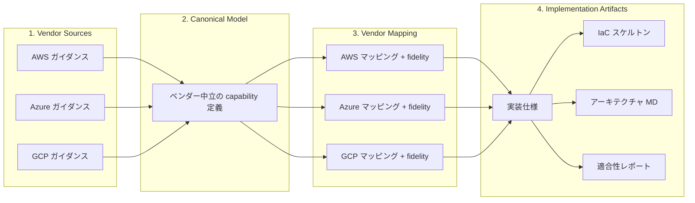
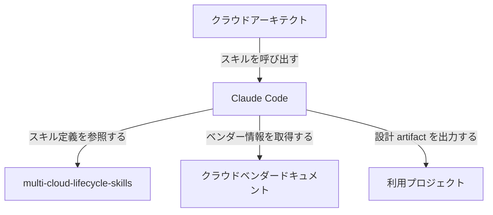
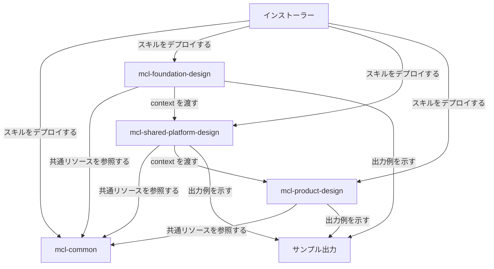
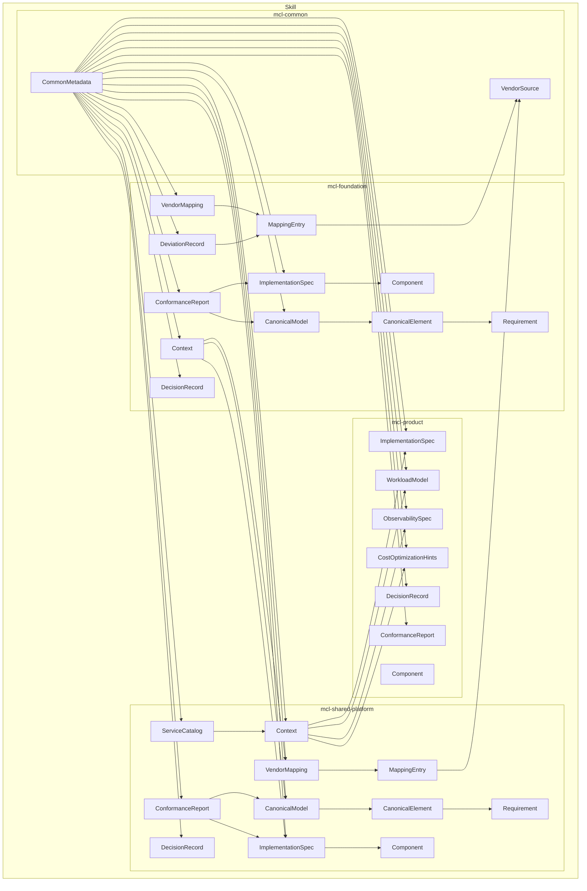
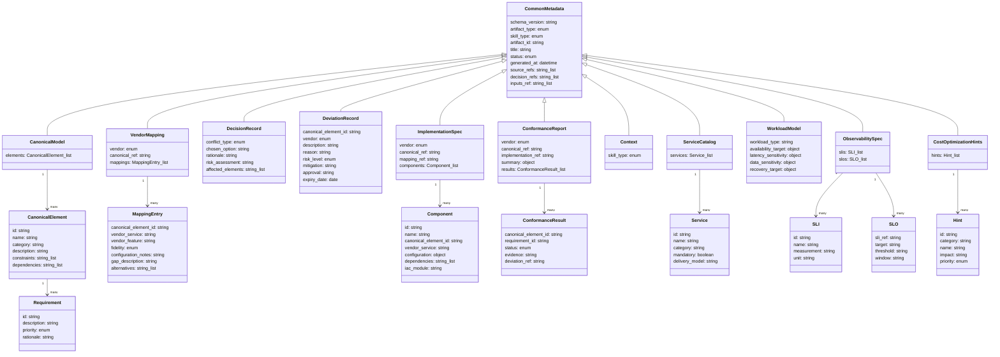

## 概要

クラウドインフラの設計には「特定ベンダーに依存しない設計にしたい」と「各ベンダーが推奨するベストプラクティスに従いたい」という矛盾する 2 つの要求があります。multi-cloud-lifecycle-skills は、この矛盾を 4 層の設計パイプラインで解決する Claude Code スキル群です。

AWS / Azure / GCP を対象に、ベンダー中立の正規モデル（Canonical Model）からベンダー別マッピング、IaC スケルトンまでを AI エージェントとの対話で一貫して生成します。クラウドアーキテクト、プラットフォームエンジニア、インフラ設計者を主な対象としています。

## 特徴

- **4層設計パイプライン**: Vendor Sources → Canonical Model → Vendor Mapping → Implementation Artifacts の 4 層でベンダー中立性とベストプラクティス準拠を両立
- **fidelity 評価によるギャップの可視化**: Vendor Mapping 層で `exact / partial / workaround / gap` の fidelity スコアを付与し、ベンダー間の適合度を定量化
- **3スキル階層による段階的設計**: mcl-foundation-design → mcl-shared-platform-design → mcl-product-design の順に設計を進め、上位スキルの出力が下位スキルの入力
- **YAML 正本ポリシー**: 全 artifact の正本を YAML に統一。Markdown は常に派生生成物
- **対話型ヒアリングで自動生成**: スキルが選択肢付きのヒアリングを実施し、回答に基づいて canonical model、vendor mapping、IaC スケルトン、アーキテクチャドキュメントを一括生成
- **mcl-common によるテンプレート共有**: 3スキル共通のメタスキルとして、YAML テンプレート、スキーマ、正規化ルール、マッピングルールを一元管理
- **ベンダーソースの自動収集**: AWS / Azure / GCP の公式ガイダンスページを自動収集して Markdown として保存。既存ソースがある場合はそれを優先
- **Claude Code プラグインとして配置**: `.claude/skills/` 配下にシンボリックリンクを設置。`install.sh` でグローバルまたはプロジェクト固有に導入可能
- **3クラウド全対応・サブセット指定可能**: AWS / Azure / GCP の 3 クラウドを標準サポートし、呼び出し時に対象クラウドをサブセット指定可能

:::message
**この記事で分かること**
- 4層設計パイプラインの仕組みと各層の役割
- 3つのスキル（foundation / shared-platform / product）の階層構造とデータフロー
- YAML artifact のデータモデル（概念モデル・情報モデル）
- インストールから対話的設計セッションまでの具体的な手順
- fidelity 評価・競合分類・テスト戦略などの運用プラクティス
:::

## 構造

### 4層設計パイプラインの全体像



| 層 | 役割 | 優先順位 |
|---|---|---|
| Vendor Sources | クラウドベンダーの公式ガイダンスを収集・保存 | 最高 |
| Canonical Model | ベンダー中立の capability として要件を表現 | 高 |
| Vendor Mapping | canonical を各ベンダーサービスに再投影し、fidelity を評価 | 中 |
| Implementation Artifacts | IaC スケルトン、実装仕様、適合性レポートを生成 | 低 |

競合時は上位層を優先します（`source > canonical > mapping > implementation`）。クラウドを追加・変更する場合は Vendor Mapping と Implementation Artifacts のみを差し替えます。

### スキル階層と Canonical Model のスコープ

| スキル | 対象レイヤー | Canonical Model のスコープ |
|---|---|---|
| mcl-foundation-design | ランディングゾーン | organization_boundary, billing_boundary, identity_boundary, policy_enforcement, network_segmentation, audit_aggregation, security_guardrails, exception_handling |
| mcl-shared-platform-design | 共有プラットフォーム | shared_runtime, shared_observability, shared_delivery_pipeline, shared_artifact_management, shared_secret_management, platform_ownership_model, onboarding_model |
| mcl-product-design | 個別ワークロード | workload_type, availability_target, latency_sensitivity, data_sensitivity, traffic_pattern, consistency_needs, recovery_target, observability_needs, cost_posture |

### システムコンテキスト図



| 要素名 | 説明 |
|---|---|
| クラウドアーキテクト | スキルを利用してマルチクラウド基盤設計を進めるエンジニア |
| multi-cloud-lifecycle-skills | Claude Code に設計手順・ルール・テンプレートを提供するスキル群 |
| Claude Code | スキル定義に基づいてヒアリング・設計・生成を対話的に実行する AI エージェント |
| クラウドベンダードキュメント | AWS / Azure / GCP の公式ガイダンス。設計根拠の情報源 |
| 利用プロジェクト | 設計 artifact（YAML・IaC・意思決定記録など）の出力先 |

### コンテナ図



| 要素名 | 説明 |
|---|---|
| インストーラー | スキルを .claude/skills/ に配置するシェルスクリプト |
| mcl-common | 全スキルが共有するルール・テンプレート・スキーマを提供するメタスキル |
| mcl-foundation-design | 組織横断の基盤レイヤー設計を担う最上位スキル |
| mcl-shared-platform-design | 複数プロダクトが共用するプラットフォーム設計を担う中間スキル |
| mcl-product-design | 個別プロダクトのクラウドリソース設計を担う最下位スキル |
| サンプル出力 | 各スキルが生成する artifact の具体例。docs / infra / specs を含む |

### コンポーネント図

```mermaid
graph TD
    common["mcl-common"]

    canonicalization["references-canonicalization-rules.md"]
    mapping["references-mapping-rules.md"]
    conflict["references-conflict-classification.md"]
    vendor_policy["references-vendor-source-policy.md"]
    impl_schema["references-implementation-pack-schema.md"]

    tpl_canonical["templates-canonical-model.yaml"]
    tpl_mapping["templates-vendor-mapping.yaml"]
    tpl_decision["templates-decision-record.yaml"]
    tpl_deviation["templates-deviation-record.yaml"]
    tpl_impl["templates-implementation-spec.yaml"]
    tpl_conformance["templates-conformance-report.yaml"]

    schema["schemas-common-metadata.yaml"]

    fetch["scripts-fetch-vendor-sources.sh"]
    sources["scripts-sources.tsv"]

    common --> canonicalization
    common --> mapping
    common --> conflict
    common --> vendor_policy
    common --> impl_schema
    common --> tpl_canonical
    common --> tpl_mapping
    common --> tpl_decision
    common --> tpl_deviation
    common --> tpl_impl
    common --> tpl_conformance
    common --> schema
    common --> fetch
    common --> sources

    fetch -->|取得先リストを読む| sources
```



| 要素名 | 説明 |
|---|---|
| mcl-common | 全コンポーネントを保持するメタスキルコンテナ |
| references-canonicalization-rules.md | ベンダー概念を正規モデルに変換するルール |
| references-mapping-rules.md | 正規モデルからベンダー固有設定へのマッピングルール |
| references-conflict-classification.md | ベンダー間の競合を分類・解決するルール |
| references-vendor-source-policy.md | ベンダードキュメントの取得方針と優先順位 |
| references-implementation-pack-schema.md | 実装パックの構造を定義するスキーマ仕様 |
| templates-canonical-model.yaml | ベンダー非依存の正規化モデルを記述するテンプレート |
| templates-vendor-mapping.yaml | 正規モデルとベンダー設定の対応を記述するテンプレート |
| templates-decision-record.yaml | 設計上の意思決定を記録するテンプレート |
| templates-deviation-record.yaml | 標準からの逸脱を記録するテンプレート |
| templates-implementation-spec.yaml | IaC 生成に必要な実装仕様を記述するテンプレート |
| templates-conformance-report.yaml | 設計の準拠状況を報告するテンプレート |
| schemas-common-metadata.yaml | 全 artifact が共通で使用するメタデータスキーマ |
| scripts-fetch-vendor-sources.sh | ベンダー公式ドキュメントを取得するスクリプト |
| scripts-sources.tsv | 取得対象のベンダーソース URL を列挙したリスト |

## データ

### 概念モデル



| 要素名 | 説明 |
|---|---|
| mcl-foundation | 基盤レイヤーを設計するスキル |
| mcl-shared-platform | 共有プラットフォームを設計するスキル |
| mcl-product | プロダクトのクラウドリソースを設計するスキル |
| mcl-common | スキル共通のスキーマ・テンプレート・ルールを提供するスキル |
| CanonicalModel | ベンダー中立の capability 定義をまとめたモデル |
| CanonicalElement | CanonicalModel を構成する個々の capability 定義 |
| Requirement | CanonicalElement に紐づく要件 |
| VendorMapping | canonical 要素をベンダーサービスにマッピングした成果物 |
| MappingEntry | VendorMapping を構成する個々のマッピングエントリ |
| DecisionRecord | capability 競合に対する設計判断の記録 |
| DeviationRecord | canonical からの逸脱とそのリスク管理の記録 |
| ImplementationSpec | ベンダー固有の実装コンポーネント定義 |
| Component | ImplementationSpec を構成する個々の実装コンポーネント |
| ConformanceReport | canonical に対する実装の適合性検証結果 |
| Context | スキル間でメタデータ・設計判断を引き渡す連携アーティファクト |
| ServiceCatalog | 共有プラットフォームが提供するサービスの一覧 |
| WorkloadModel | プロダクトのワークロード特性定義 |
| ObservabilitySpec | プロダクトの監視仕様（SLI/SLO 含む） |
| CostOptimizationHints | プロダクトのコスト最適化ヒント集 |
| CommonMetadata | 全 YAML アーティファクトが必ず持つ共通メタデータ |
| VendorSource | MappingEntry が参照するベンダー公式ドキュメント |

### 情報モデル



| 要素名 | 説明 |
|---|---|
| CommonMetadata | 全アーティファクト共通。artifact_type で種別を識別し、skill_type でスキル階層を示す |
| CanonicalModel | CanonicalElement の集合。elements フィールドにベンダー中立の capability 一覧を保持 |
| CanonicalElement | id は `scope.name` 形式の snake_case。category で論理グループを表現 |
| Requirement | priority は must / should / may の 3 段階。rationale に採用根拠を記載 |
| VendorMapping | vendor フィールドで対象クラウドを識別。canonical_ref で対応する CanonicalModel を参照 |
| MappingEntry | fidelity は exact / partial / workaround / gap の 4 段階。exact 以外は gap_description が必須 |
| DecisionRecord | conflict_type は capability / granularity / feature_gap / naming / behavioral の 5 種。chosen_option で採用オプションを示す |
| DeviationRecord | risk_level は low / medium / high / critical の 4 段階。expiry_date で再評価期限を管理 |
| ImplementationSpec | mapping_ref で対応する VendorMapping を参照 |
| Component | iac_module でコンポーネントに対応する IaC モジュールパスを示す |
| ConformanceReport | summary でステータス集計を保持。ConformanceResult の status は conformant / partial / non_conformant / deferred |
| Context | foundation-context は shared-platform へ、shared-platform-context は product へ設計情報を引き渡す |
| ServiceCatalog | mandatory フィールドで必須・任意を区別 |
| WorkloadModel | workload_type・可用性・レイテンシ・データ感度・復旧目標を定義 |
| ObservabilitySpec | SLI で計測項目を定義し、SLO で目標値・計測ウィンドウを紐づけ |
| CostOptimizationHints | hint ごとに category・impact・priority を保持。priority は must / should / may |

## 構築方法

### 前提条件

- Claude Code（claude.ai/code）
- pandoc（ベンダーソースの HTML → Markdown 変換に使用）

```bash
# macOS
brew install pandoc
```

### リポジトリ取得

```bash
git clone https://github.com/suwa-sh/multi-cloud-lifecycle-skills.git
cd multi-cloud-lifecycle-skills
```

### グローバルインストール

全プロジェクトで利用する場合は以下を実行します。

```bash
./install.sh
# ~/.claude/skills/ にシンボリックリンクを作成
```

### プロジェクト固有インストール

特定プロジェクトのみで利用する場合は以下を実行します。

```bash
./install.sh /path/to/your-project
# <project>/.claude/skills/ にシンボリックリンクを作成
```

### install.sh の動作

- `.claude/skills/` 配下の各 `mcl-*` ディレクトリをシンボリックリンクで配置
- 既に同じリンクが存在する場合はスキップ
- リンク先が変わっている場合は再リンク
- 通常ファイル・ディレクトリが既存の場合は警告してスキップ

## 利用方法

### 基本的な流れ

Claude Code で対話的に設計を依頼します。スキルは自動的にトリガーされます。上位スキルの出力が下位スキルの入力となるため、Foundation → Shared Platform → Product の順に実行します。

```
# 1. Foundation（最初に実行）
「AWS と Azure を対象に、3つのBUで foundation 設計をしてください」

# 2. Shared Platform（foundation の後に実行）
「EKS/AKS ベースの共有プラットフォームを設計してください」

# 3. Product（foundation + shared platform の後に実行）
「EC サイトのバックエンド API を設計してください」
```

### 対象クラウドの指定

呼び出し時に対象クラウドをサブセット指定できます。

```
「AWS のみで foundation 設計をしてください」
「Azure と GCP で共有プラットフォームを設計してください」
```

### ヒアリングフロー

入力 YAML が未準備の場合、スキルが選択肢付きのヒアリングを行います。

- ヒアリング 1: 対象クラウド、BU 数、環境構成
- ヒアリング 2: セキュリティ・コンプライアンス要件、ログ保持期間
- ヒアリング 3: 予算責任境界、共有コスト按分ルール

選択肢はテーブル形式（番号付き・推奨マーク付き）で提示されます。一度に最大 3 項目です。

### スキルのワークフロー

全スキルは以下の順で処理を進めます。

1. 入力収集（input YAML またはヒアリング）
2. ベンダーソース取得（`fetch-vendor-sources.sh`）
3. Canonical Model 生成
4. Vendor Mapping 生成（fidelity 評価付き）
5. 競合解決（decision record 作成）
6. Implementation Spec 生成
7. IaC スケルトン生成
8. Conformance Report 生成
9. ターゲットアーキテクチャ Markdown 生成
10. Context YAML 生成（下位スキルへの入力）

### ベンダーソースの活用

ソースが未準備でもスキルは動作します。設計実行時にソースが見つからない場合、公式ガイダンスページから最新コンテンツを自動収集して Markdown として保存します。

| 優先度 | 参照先 |
|---|---|
| 1（最高） | `docs/cloud-context/summaries/{layer}/` のサマリー |
| 2 | `docs/cloud-context/sources/{vendor}/` の保存済みソース |
| 3 | Web から最新を自動収集 |

### 出力ディレクトリ構造

AWS + Azure で 3 レイヤーをすべて実行した場合、利用プロジェクトに以下の構成が生成されます。

```
your-project/
├── specs/{layer}/output/         # YAML artifacts（canonical, mapping, impl, context）
├── docs/cloud-context/
│   ├── sources/                  # ベンダーソース（自動収集 or 手動配置）
│   ├── decisions/{layer}/        # 設計判断記録
│   ├── conformance/{layer}/      # 適合性検証レポート
│   └── generated-md/{layer}/     # Mermaid 図付きアーキテクチャ Markdown
└── infra/{layer}/{vendor}/       # IaC スケルトン（Terraform HCL 等）
```

## 運用

### ベンダーソースの取得・更新

`fetch-vendor-sources.sh` でベンダー公式ドキュメントを HTML → Markdown に変換して保存します。保存先は利用プロジェクトの `docs/cloud-context/sources/{aws,azure,gcp}/` です。

```bash
# 全ベンダー・全レイヤーを取得
./scripts/fetch-vendor-sources.sh /path/to/your-project

# AWS の foundation レイヤーのみ取得
./scripts/fetch-vendor-sources.sh /path/to/your-project --vendor aws --layer foundation

# 既存ファイルも強制再取得
./scripts/fetch-vendor-sources.sh /path/to/your-project --force
```

### ベンダーソースの鮮度管理

各ソースファイルのメタデータヘッダに `fetched_at`（ISO 8601）が記録されます。`fetched_at` が 90 日以上前のファイルはリフレッシュを推奨します。

```yaml
# ソースファイルのメタデータヘッダ例
source_url: "https://docs.aws.amazon.com/organizations/latest/userguide/orgs_best-practices.html"
fetched_at: "2026-01-01T00:00:00Z"
vendor: "aws"
layer: "foundation"
```

### sources.tsv による収集対象管理

`sources.tsv` に `vendor / layer / name / url` の 4 列 TSV で収集対象を定義します。AWS 13 件・Azure 12 件・GCP 12 件、合計 37 件の公式ドキュメントが登録済みです。

```tsv
vendor	layer	name	url
aws	foundation	aws-organizations-best-practices	https://docs.aws.amazon.com/...
azure	foundation	azure-landing-zone	https://learn.microsoft.com/...
gcp	foundation	gcp-landing-zones	https://cloud.google.com/...
```

### artifact のライフサイクル管理

- YAML が全 artifact の正本。Markdown は常に YAML からの派生生成物
- `status` フィールドで進捗を管理（`draft` → `review` → `approved` → `superseded`）
- ベンダーソース更新後に再生成した場合、差分が意図した変化かを L3 テストで検証

### テスト戦略

| レベル | 内容 | 最低完了条件 |
|---|---|---|
| L1（形式） | ファイル存在・必須項目存在・スキーマ準拠 | Tier A |
| L2（内容） | artifact 間の整合性・スキル間インターフェース整合性 | Tier A |
| L3（差分） | ベンダーソース更新後の再生成結果が期待どおり変化するか | Tier A |
| L4（dry-run） | 生成 IaC が静的検証を通るか | Tier B |

最低完了条件は Tier A（スキーマ検証 + 適合性チェック + 決定性チェック）と Tier B（IaC 静的検証）です。

### evals.json の構造

`id`・`prompt`・`expected_output`・`files`・`assertions` で構成されます。

```json
{
  "skill_name": "mcl-foundation-design",
  "evals": [
    {
      "id": 1,
      "prompt": "...",
      "expected_output": "...",
      "assertions": [
        {"id": "canonical-model-exists", "type": "file_exists"},
        {"id": "soc2-addressed", "type": "content_check"}
      ]
    }
  ]
}
```

### 各スキルの評価シナリオ

| スキル | シナリオ | 主なアサーション |
|---|---|---|
| mcl-foundation-design | 3 BU / AWS + Azure / SOC2 / 3 面環境 | canonical-model 存在・3BU カバー・SOC2 対応・IaC スケルトン存在 |
| mcl-shared-platform-design | EKS/AKS / Prometheus+Grafana / GitHub Actions | shared-platform-canonical 存在・service-catalog 存在・IaC スケルトン存在 |
| mcl-product-design | EC バックエンド API / 可用性 99.9% / RDB+Redis | workload-model 存在・vendor mapping 存在・observability 存在・cost-hints 存在 |

## ベストプラクティス

### 4 層モデルの優先順位遵守

- 設計判断に迷った場合は `source > canonical > mapping > implementation` の優先順位に従う
- 上位層（ベンダーソース・canonical model）の変更は全ベンダーの下位 artifact に影響
- クラウドの追加・変更時は Vendor Mapping と Implementation Artifacts のみを差し替え

### 正規化プロセスの遵守

ベンダー固有のガイダンスを canonical model に変換する際は、以下の 5 ステップに従います。

1. ベンダーソースから capability または関心事を特定
2. ベンダー固有の用語を抽象化
3. 測定可能な属性を持つ capability 要件として表現
4. 安定した canonical 識別子を付与（`scope.capability_name` 形式の snake_case）
5. 追跡可能性のためソース参照を記録

```
ベンダー固有: "AWS Organizations with SCPs"
Canonical: organization_boundary.policy_enforcement
```

命名規約:
- 全識別子は lowercase snake_case
- スコープ接頭辞を付与: `foundation.` / `shared_platform.` / `product.`
- ベンダー製品名ではなく capability 名を使用

### YAML 正本ポリシーの徹底

全 YAML artifact は `common-metadata.yaml` スキーマの必須フィールドを含む必要があります。

```yaml
schema_version: "1.0"
artifact_type: "canonical_model"
skill_type: "foundation"
artifact_id: "foundation-canonical-v1"
title: "基盤 canonical model"
status: "draft"
generated_at: "2026-03-28T00:00:00Z"
source_refs: []
decision_refs: []
inputs_ref: []
```

### ベンダーマッピング対象一覧

**Foundation レイヤー:**

| Canonical 概念 | AWS | Azure | GCP |
|---|---|---|---|
| organization_boundary | Organizations, OUs | Management Groups, Subscriptions | Organizations, Folders |
| billing_boundary | Consolidated Billing, Cost Allocation Tags | Cost Management, Resource Tags | Billing Accounts, Labels |
| identity_boundary | IAM Identity Center, SCP | Entra ID, RBAC, PIM | Cloud Identity, IAM |
| policy_enforcement | SCPs, Config Rules | Azure Policy, Blueprints | Org Policy, Security Command Center |
| network_segmentation | Transit Gateway, VPC | Virtual WAN, VNet | Shared VPC, VPC Service Controls |
| audit_aggregation | CloudTrail, Security Hub | Activity Log, Sentinel | Audit Logs, Chronicle |
| security_guardrails | GuardDuty, Security Hub | Defender for Cloud | Security Command Center |

**Shared Platform レイヤー:**

| Canonical 概念 | AWS | Azure | GCP |
|---|---|---|---|
| shared_runtime | EKS, ECS, Lambda | AKS, Container Apps, Functions | GKE, Cloud Run, Cloud Functions |
| shared_observability | CloudWatch, X-Ray, Managed Grafana | Azure Monitor, App Insights | Cloud Operations, Cloud Trace |
| shared_delivery_pipeline | CodePipeline, CodeBuild | Azure DevOps, GitHub Actions | Cloud Build, Cloud Deploy |
| shared_artifact_management | ECR, CodeArtifact | ACR, Azure Artifacts | Artifact Registry |
| shared_secret_management | Secrets Manager, ACM | Key Vault, App Configuration | Secret Manager, Certificate Manager |

**Product レイヤー:**

| Canonical 概念 | AWS | Azure | GCP |
|---|---|---|---|
| コンピュート | EC2, ECS, Lambda, App Runner | App Service, Container Apps, Functions | Cloud Run, Compute Engine, Cloud Functions |
| DB - リレーショナル | RDS, Aurora | Azure SQL, PostgreSQL Flexible | Cloud SQL, AlloyDB |
| DB - NoSQL | DynamoDB | Cosmos DB | Firestore, Bigtable |
| メッセージング | SQS, SNS, EventBridge | Service Bus, Event Grid | Pub/Sub, Eventarc |
| オブジェクトストレージ | S3 | Blob Storage | Cloud Storage |
| キャッシュ | ElastiCache | Azure Cache for Redis | Memorystore |
| CDN | CloudFront | Front Door | Cloud CDN |

### fidelity 評価の記録

vendor mapping で各 canonical 要件の充足度を 4 段階で評価・記録します。`gap` の場合は必ず deviation record を生成し、リスクを明示します。

| fidelity | 意味 |
|---|---|
| exact | canonical 要件を直接的に充足 |
| partial | 大部分をカバー、不足あり（内容を記述） |
| workaround | 複数サービスの組み合わせが必要 |
| gap | 実現不可、deviation record 必須 |

### 競合解決の記録

クラウド間で競合が発生した場合は、5 種類に分類して decision record を生成します。デフォルトは最も制限的な解釈を採用します。

| 競合タイプ | 説明 | 解決方針 |
|---|---|---|
| capability | アプローチが根本的に異なる | 全ベンダー対応可能な canonical model を選択 |
| granularity | サポート粒度が異なる | 最も細かい粒度でモデル化し、粗いベンダーに注記 |
| feature_gap | 一部ベンダーに機能が存在しない | gap として記録、workaround か deviation record を必須化 |
| naming | 同概念に異なる用語を使用 | canonical 名を使用、用語マッピングテーブルを維持 |
| behavioral | デフォルト動作が異なる | implementation spec で明示的に設定を指定 |

### ヒアリング運用

- ユーザーへの確認は必ず番号付き選択肢テーブルで提示
- 一度に聞く項目は最大 3 つまでとし、段階的にヒアリング
- 再実行時は `specs/{layer}/input/` に入力 YAML を配置することでヒアリングをスキップ可能

### チーム運用

- スキルはグローバルインストール（`~/.claude/skills/`）とプロジェクト固有インストールを使い分け
- `mcl-workspace/` は `with_skill / without_skill` 比較用ワークスペースで、`.gitignore` 対象
- 生成 artifact はプロジェクトリポジトリに commit（スキルリポジトリには保存しない）
- ベンダーソース（`docs/cloud-context/sources/`）はプライベートリポジトリで管理

## トラブルシューティング

### ベンダーソース取得失敗

- `FAILED (download)`: `sources.tsv` の URL が変更されていないか確認
- `FAILED (content too small: N bytes)`: JS リダイレクトが解決できていない可能性
- `pandoc` 未インストール: `brew install pandoc` で導入

```bash
# エラー例と対処
ERROR: pandoc が見つかりません
# → brew install pandoc

FAILED (download)
# → sources.tsv の該当 URL をブラウザで確認し、正しい URL に更新

FAILED (content too small: 500 bytes, min: 1000)
# → リダイレクト先の URL を直接 sources.tsv に記載
```

### YAML スキーマ検証エラー

- `artifact_id` が `^[a-z][a-z0-9-]+$` 形式でない場合はエラー
- `generated_at` が ISO 8601 形式でない場合はエラー
- `artifact_type` が定義外の値の場合はエラー

```yaml
# NG: スキーマ違反例
artifact_id: "Foundation_Canonical"   # 大文字・アンダースコアは不可
generated_at: "2026/03/28"            # スラッシュ区切りは不可

# OK: 修正例
artifact_id: "foundation-canonical-v1"
generated_at: "2026-03-28T00:00:00Z"
```

### スキル間のコンテキスト連携エラー

`mcl-shared-platform-design` が `foundation-context.yaml` を参照できない場合は、`mcl-foundation-design` を先に実行してください。

```bash
# コンテキストファイルの確認
ls specs/foundation/output/foundation-context.yaml
ls specs/shared-platform/output/shared-platform-context.yaml
```

### IaC スケルトンのプレースホルダー

`# TODO:` コメントが付いている箇所はプレースホルダーです。実際の値を設定してから apply します。

```hcl
# TODO: 実際の AWS アカウント ID に置き換えること
account_id = "123456789012"
```

### gap fidelity の対処

`gap` と評価された canonical 要件は、そのベンダーでは native に実現できません。deviation record を生成し、リスクと代替手段を明示します。

```yaml
# deviation_record.yaml 例
deviation_type: "gap"
canonical_element: "foundation.policy_enforcement"
vendor: "azure"
risk_level: "medium"
mitigation: "Azure Policy と Defender for Cloud の組み合わせで代替"
approval: "pending"
expiry: "2026-12-31"
```

### Web ソース取得失敗時のフォールバック

- Web 取得に失敗した場合は、モデルの既存知識で設計を継続
- エラーをユーザーに通知し、設計結果に「Web 取得失敗のため知識ベースを使用」と記載
- 設計完了後に手動でソースを配置し、再生成することを推奨

## まとめ

multi-cloud-lifecycle-skills は、4層設計パイプライン（Vendor Sources → Canonical Model → Vendor Mapping → Implementation Artifacts）と3スキル階層（foundation → shared-platform → product）により、ベンダーロックインを回避しつつ各クラウドのベストプラクティスに準拠したマルチクラウド基盤設計を、Claude Code との対話で一貫して構築できるスキル群です。fidelity 評価・競合分類・deviation record による設計判断の追跡可能性が、マルチクラウド環境特有の複雑さを管理可能にしています。

この記事が少しでも参考になった、あるいは改善点などがあれば、ぜひリアクションやコメント、SNSでのシェアをいただけると励みになります！

## 参考リンク

- GitHub
  - [suwa-sh/multi-cloud-lifecycle-skills](https://github.com/suwa-sh/multi-cloud-lifecycle-skills)
  - [mcl-common SKILL.md](https://github.com/suwa-sh/multi-cloud-lifecycle-skills/blob/main/.claude/skills/mcl-common/SKILL.md)
  - [mcl-foundation-design SKILL.md](https://github.com/suwa-sh/multi-cloud-lifecycle-skills/blob/main/.claude/skills/mcl-foundation-design/SKILL.md)
  - [mcl-shared-platform-design SKILL.md](https://github.com/suwa-sh/multi-cloud-lifecycle-skills/blob/main/.claude/skills/mcl-shared-platform-design/SKILL.md)
  - [mcl-product-design SKILL.md](https://github.com/suwa-sh/multi-cloud-lifecycle-skills/blob/main/.claude/skills/mcl-product-design/SKILL.md)
  - [common-metadata.yaml](https://github.com/suwa-sh/multi-cloud-lifecycle-skills/blob/main/.claude/skills/mcl-common/schemas/common-metadata.yaml)
  - [canonical-model.yaml テンプレート](https://github.com/suwa-sh/multi-cloud-lifecycle-skills/blob/main/.claude/skills/mcl-common/templates/canonical-model.yaml)
  - [vendor-mapping.yaml テンプレート](https://github.com/suwa-sh/multi-cloud-lifecycle-skills/blob/main/.claude/skills/mcl-common/templates/vendor-mapping.yaml)
  - [install.sh](https://github.com/suwa-sh/multi-cloud-lifecycle-skills/blob/main/install.sh)
  - [canonicalization-rules.md](https://github.com/suwa-sh/multi-cloud-lifecycle-skills/blob/main/.claude/skills/mcl-common/references/canonicalization-rules.md)
  - [mapping-rules.md](https://github.com/suwa-sh/multi-cloud-lifecycle-skills/blob/main/.claude/skills/mcl-common/references/mapping-rules.md)
  - [conflict-classification.md](https://github.com/suwa-sh/multi-cloud-lifecycle-skills/blob/main/.claude/skills/mcl-common/references/conflict-classification.md)
  - [vendor-source-policy.md](https://github.com/suwa-sh/multi-cloud-lifecycle-skills/blob/main/.claude/skills/mcl-common/references/vendor-source-policy.md)
  - [implementation-pack-schema.md](https://github.com/suwa-sh/multi-cloud-lifecycle-skills/blob/main/.claude/skills/mcl-common/references/implementation-pack-schema.md)
  - [fetch-vendor-sources.sh](https://github.com/suwa-sh/multi-cloud-lifecycle-skills/blob/main/.claude/skills/mcl-common/scripts/fetch-vendor-sources.sh)
  - [sources.tsv](https://github.com/suwa-sh/multi-cloud-lifecycle-skills/blob/main/.claude/skills/mcl-common/scripts/sources.tsv)
- 公式ドキュメント
  - [Claude Code](https://claude.ai/code)
