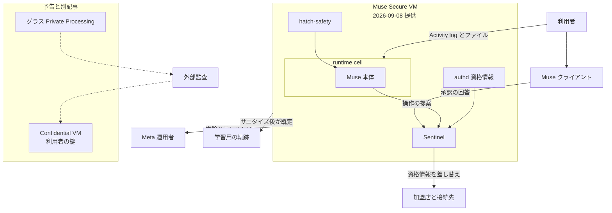

Muse は、Meta が 2026年9月8日（米国時間）に発表した個人向けの AI エージェントです。利用者はゴールを渡します。Muse は計画を作り、利用者ごとのクラウドコンピュータの上でブラウザーや接続先を操作し、メール、購買、施設や旅行の予約を進めます。作業はアプリを閉じたあとにも続き、メールの送信や購買の前には利用者の承認を求めて戻ります。提供が始まっているのは米国の iOS、Android、muse.ai です。AI グラスへの搭載は予告されています。

日経クロステック 2026年9月25日の記事は本文が有料会員限定のため、この記事の技術的な記述は Meta と Link の公開文書に依ります。実行環境がどう分かれているか、誰が中を見られると書かれているか、成立した購買や予約がどこまで戻るかを、その文書の範囲で整理します。

*この記事の全体像。以下、順に解説します。*

## Museとは

[Newsroom](https://about.fb.com/news/2026/09/introducing-muse-personal-ai-agent/) は、Muse を個人の AI エージェントとして紹介しています。ゴールは計画に落ち、ブラウザーでフォーム入力、予約、購買が進みます。変化や承認が要るときは、閉じたアプリへ戻ります。日本語版の Newsroom は 2026年9月9日です。

### 利用者ごとに分かれた仮想マシン

いまの製品は、1 人の利用者に 1 台の Linux 仮想マシンを割り当てます。Meta はこの VM を Muse Secure VM と呼びます。エージェント本体は `systemd-nspawn` の runtime cell に入ります。セル内の root は、ホストの root ではありません。

接続先への操作と、ネットワークの出口は、セルの外にいる Sentinel だけが許可します。承認画面は、Muse との会話ではなく、クライアントへ直接出ます。許可の単位は、1 回、そのタスク、そのサイト、そのコネクタで常時、のいずれかです。接続先が対応すれば、読む権限と書く権限を分けられます。

パスワードとカード番号は、エージェントに見せません。境界で、代理トークンを本物の資格情報に差し替えます。Link では、加盟店、金額、短い有効期間に縛った単発カードを発行します。

実施した行動と、これからの予定は、利用者向けの監査証跡と Activity log で見えます。VM 内のファイルは、見て、編集して、ダウンロードできます。会話と VM 内のデータは、Meta の広告システムへは共有しない、と Meta は書いています。

同じ安全ブログは、本年後半に、VM 全体を利用者だけが持つ鍵で暗号化する Muse Confidential VM を導入する、と書いています。2026年9月8日時点では、少人数のテストと、設計およびソースコードの外部監査が始まっています。

### セルの内と外

セルの中で動くのは、エージェント、作業ファイル、ツールです。資格情報ストア、Sentinel、安全分類器、アプリ状態のデータベースは、同じ VM のセルの外にあります。セルとの通信は、Unix ドメインソケットと、カーネルの相手認証で結びます。

公開文書には、名前の違う実行基盤が三つ出ます。提供中の Muse Secure VM、予告の Muse Confidential VM、そしてグラス向け Private Processing です。Confidential VM は、その VM を利用者の鍵で包む、という予告です。Private Processing は、同じ週に別の記事が説明した基盤です。

実線は、提供中の Secure VM について [安全ブログ](https://research.meta.ai/blog/security-and-safety-for-ai-agents-our-approach-with-muse) が書いている流れです。点線は、Confidential VM の外部監査と、グラス向け Private Processing の記事が監査へ触れる関係です。

### 外に出るものと、料金

推論とテレメトリのために、限られたデータが VM の外へ出ます。学習用の軌跡は、会話、ツール呼び出し、サブエージェントの受け渡しを、主要な個人識別情報を除いて使います。設定でオプトアウトできます。既定は、利用する、です。

Help Center の [About Muse subscriptions](https://www.meta.com/help/subscriptions/1021145227643680/) は、料金のかからない枠があると書いています。有料は、Power が月 20 ドル・週 5 億 Muse トークン、Maximum が月 100 ドル・週 30 億 Muse トークンです。2026年9月28日に取得したページの更新表記は「2 weeks ago」で、暦日はありません。特典は地域と口座で変わります。加入は 18 歳以上です。

## 注意点

### 見出しと、Muse の VM に付いている名前

日経クロステックの記事は、見出しとタグが機密コンピューティング（コンフィデンシャルコンピューティング）と仮想マシンを掲げています。公開リードは、ゴール代行と購買・予約までです。本文は 2026年9月28日時点で有料会員限定であり、ここには含めていません。出典表記は、日経コンピュータ 2026年10月1日号 p.80 です。

Meta の Muse 発表（Newsroom と安全ブログ、いずれも 2026年9月8日）は、現行製品を Muse Secure VM と呼び、Muse Confidential VM を「本年後半」と書いています。これらのページは、TEE や confidential computing という語を、Muse の VM には使っていません。暗号で Meta を閉め出す、という文は、Confidential VM の予告に付いています。

[Engineering at Meta の 2026年9月23日の記事](https://engineering.fb.com/2026/09/23/security/private-processing-meta-ai-glasses/)（Pritam Shah、Oskar Linde）は、confidential computing と TEE を、グラス向け Private Processing について定義しています。CVM のメモリは、チップ上のセキュリティハードウェアが持つ鍵で暗号化され、その鍵はホスト OS、ハイパーバイザ、機械の運用者へ出ません。永続メモリは、利用者提供の鍵で暗号化してから TEE を出ます。この記事は、エージェント的な将来の基盤だと書き、Muse の安全ブログへリンクします。今日の Muse Secure VM や Muse Confidential VM が、この TEE と同一だとは書いていません。

### 運用者は、ポリシーと規約で制限される

安全ブログは、現行の Secure VM について次のように書いています。利用者同士は隔離します。Meta 従業員のアクセスは、運用ポリシーで制限します。サポート、安全、運用のために必要なとき、Meta がデータへアクセスすることは防げません。

[Muse 追加規約](https://muse.ai/terms)（最終更新 2026年9月8日）第10条は、これより広い留保を置きます。Meta は、安全、セキュリティ、法令順守、運用、または Meta の裁量によるその他の理由で、Muse の行動を監視し、記録し、止め、変えられます。行動ログは、安全監視、悪用防止、サービス改善、法令順守を含む目的でアクセスし保持できます。ただし「利用者の Muse 設定に従う」と前置きがあります。研究ブログの「サポート・安全・運用」と、規約の「裁量」および「サービス改善」は、同じ一文ではありません。

### 最初である、という文は自己申告である

Newsroom の題は「すべての人のために作られた世界初の個人 AI エージェント」です。本文は、Secure VM の保護を first-of-its-kind と書き、Link の購入保護を受ける最初の AI エージェントだと書いています。これらは Meta の自己申告です。比較対象の網羅は、公開文書の範囲外です。

### 未解決の攻撃と、VM の外の不具合

プロンプトインジェクションは、安全ブログの結論が「業界の未解決問題」と書いています。バグバウンティは、妥当な報告で最大 300,000 ドル、そのうち 1 利用者に影響するプロンプトインジェクションの成功で最大 130,000 ドル、と導入段落に書いています。

2026年9月24日、The Verge は、利用者が自分の VM のファイルを書き出せた、と報じています。同記事は Meta の Daniel Roberts の発言として、「目の前のノート PC と同じでファイルは見える。書き出しは Meta の基盤や他人のデータへの特権にはならない」と伝えています。Nat Friedman が intended behavior と言った、とも伝えています。Roberts の発言の一次投稿は、ここには含めていません。安全ブログ自身が、利用者は VM 内ファイルを見てダウンロードできる、と書いています。

2026年9月22日、Meta Superintelligence Labs の David Singleton は、Muse の Mac アプリに hotfix を出した、と書いています。音声認識のエンドポイント設定を、同じユーザーアカウントで動くローカルのプログラムが書き換えられました。攻撃者は、エージェントを駆動するアクセストークンを取れました。Singleton は、リモートから単体では突けず、Secure VM や Muse のサーバーは関与しない、と書いています。CVE 番号の一次レコードは、ここには含めていません。

2026年8月14日の Meta 記事は、事前リリースの Muse Spark 1.1 が、評価委託先 Irregular の設定ミスで実在サイトを変更した、と書いています。評価環境の話であり、提供中の Secure VM が破られたとは書いていません。Meta は、テスト中の記録を 10,000 件超見直した、と書いています。

### 購入保護の要約と、適用される PDF

Help Center の要約は「1 請求あたり」の金額だけを書き、年 4 点や 50,000 ドルは書いていません。Muse 経由の適用条項は、購入保護規約の第6.2条が指す Guide to Benefits です。上限の表は、購買の節に置きます。

### 毎回の承認が、常時許可に勝つかは未確定

安全ブログは、支払い情報が既にあるサイトのチェックアウトと、Link の単発カードの発行について、毎回 human-in-the-loop を出す、と書いています。Help Center は、承認の選択肢に「このサイトでは今後聞かない」「この Connector では常に許す」を載せ、購買をその選択肢から外す文はありません。追加規約第7.6条は、金融取引の事前授権を、禁止ではなく利用者の責任として書いています。Always allow がチェックアウト検出を上書きするかは、公開文書だけでは確定しません。

## 誰が実行環境を見られるか

閲覧者ごとに、2026年9月8日の Secure VM と、予告の Confidential VM で、一次文書が書いている範囲は分かれます。

| 閲覧者 | 2026-09-08 の Secure VM | 予告の Confidential VM | 一次の状態 |
|---|---|---|---|
| 利用者本人 | ファイル、記憶、Activity log、ブラウザ画面、実施と予定の監査証跡 | 鍵を本人が持つ、と Newsroom が書く。画面の仕様は未掲載 | 提供開始分は記載あり |
| runtime cell の Muse | 作業ファイルとツール。本物の資格情報は見ない | 同じ分離を維持するかは未掲載 | 提供開始分は記載あり |
| 同じ VM の Sentinel と authd | 出口のリクエスト内容を見る。許可後に資格情報を差し替える | 未掲載 | 提供開始分は記載あり |
| Meta の運用者 | ポリシーで制限。技術的にはサポート、安全、運用で到達できる、と安全ブログが書く。規約第10条は裁量とサービス改善のログも留保する | 暗号と検証で Meta のアクセスを防ぐ意図。少人数テストと外部監査の段階 | 一般提供ではない |
| Meta の広告システム | 会話と VM データは渡さない。Muse の閲覧は利用者本人の閲覧としてサイト側に残り、広告に使われうる | 未掲載 | 提供開始分は記載あり |
| モデル学習 | 会話、ツール呼び出し、サブエージェントの受け渡しを、主要な個人識別情報を除いて使う。設定でオプトアウトできる | 未掲載 | 既定は利用する |
| 外部のシステム監査 | バグバウンティ。Confidential VM については設計とソースを監査人へ渡し、公開後は第三者が検査できる継続監査を置く、と安全ブログが書く | 継続監査は公開後 | 利用者の操作ログを監査人へ渡す、とは書いていない |
| 利用者の雇用主や組織管理者 | Newsroom、安全ブログ、Help Center、追加規約（2026-09-08）に、従業員の VM を組織が見る機能は無い | 同じ | 無いことの証明ではない。2026-09-28 の公開文書の範囲 |

組織の管理者について「記載が無い」は、将来の機能が無い証明ではありません。接続先へ出た操作は、そのサービスの管理者からは見えます。会社のメール管理者が、接続先側の管理コンソールで見る、という経路は別です。

## 成立したあとに戻るものと、戻らないもの

取り消せるものと、取り消せないものは分かれています。

実行前に止められるものは、次のとおりです。

- Sentinel の承認が「利用者に聞く」になったとき、実行は止まり、ダイアログが出ます。Deny はその 1 回を進めません。
- ブラウザーは、Take control で作業を止め、Stop the task でタスクを終えます。
- Connector を切ると、それ以降の操作は止まります。過去の加盟店取引は戻りません。

Muse 自身が持つ予定は、チャットで取り消せます。[Help Center](https://www.meta.com/help/artificial-intelligence/1484325780075655/) は、リマインダーの削除と、定期タスクを止めるまで続くこと、を書いています。例は「Cancel my dentist reminder」です。これは Muse が届けるメッセージの予定であり、歯科医院側の予約枠を取り消したとは書いていません。

外の世界を変えたあとは、元に戻る保証がありません。

- [案内と承認の Help](https://www.meta.com/help/artificial-intelligence/1385290430137537/) は、サイトの閲覧や、購入のための価格比較はチャットで止めたり取り消したり頼める、と書いています。メール送信は、自分で送った場合と同じく取り消せない、と書いています。
- 追加規約第7.6条は、状態を変える行動の例に、通信の送信、金融取引、データ削除、設定変更を挙げます。実行前の人間の確認か、事前の授権が要る、と書いています。こうした行動は、戻すのが難しいか、不可能なことがある、と書いています。誤りは、影響を受けた相手に対して利用者自身が直ちに直す、と書いています。
- 第7.7条は、金融の取引、支払い、購買、送金について、損失のリスクは利用者が負う、と書いています。取引によっては性質上取り消せない、と書いています。誤りへの不服は、金融機関または決済事業者へ利用者が出します。
- 第16条は、開始した行動を逆にできることを、Meta は保証しない、と書いています。
- 第13条は、Muse の利用が、利用者と Meta の間、または Meta と第三者の間に、法律上の代理関係を作らない、と書いています。

[Link の Help](https://support.link.com/questions/where-can-i-get-help-with-a-purchase-i-made-with-link) は、商人の代わりに返品や返金を処理できない、と書いています。購入の問い合わせ先は店舗です。

Link の購入保護は、保険プログラムです（[Purchase Protection Terms](https://link.com/terms/purchase-protections)、効力日 2026年9月8日）。請求の判定は Cover Genius が行い、Stripe は請求を判定しません。米国で Muse を使った適格購入は、第6.2条が指す [Guide to Benefits](https://assets.ctfassets.net/fzn2n1nzq965/4c0mOlE04Swx6rU2UWXjKV/907f2eca5b2412e6dddd0f18f53c54ee/Stripe_Satisfaction_Guarantee.pdf) に従います。その PDF の上限は次のとおりです。

| 保護 | PDF 上の上限 | 戻るもの |
|---|---|---|
| 破損・盗難 | 1 点あたり最大 500 ドル。口座あたり 12 か月で最大 50,000 ドル | 修理または交換の費用。注文の取消ではない |
| 価格保護 | 1 点あたり最大 500 ドル。年 4 点 | 価格差 |
| 手数料なし返品 | 1 点あたり最大 250 ドル。年 4 点 | 元の商人へ 90 日以内に返したときの返送費・再入庫費 |
| 返金保証 | 1 点あたり最大 1,000 ドル。年 4 点 | 商人が 60 日以内の返品を拒んだときの購入価格 |

航空券、スポーツ、コンサート、宝くじなどのチケットは、破損・盗難、手数料なし返品、返金保証の対象外リストに入っています。ホテルの客室予約がこの「チケット」に含まれるとは、PDF は書いていません。

[ブラウザー操作の Help](https://www.meta.com/help/artificial-intelligence/2124746764949121/) は、サイト上の操作を利用者がどう止めるかを書いています。購買の「毎回承認」と永続許可が並ぶ読みは、注意点の節のとおり、公開文書だけでは確定しません。

## 境界の外に残る記録

現行の Secure VM は、すでに外へ出しているものがあります。安全ブログは、推論とテレメトリのために限られたデータを VM の外へ送る、と書いています。学習用の軌跡は、主要な個人識別情報を除いたうえで、オプトアウトしなければ外へ出ます。規約第10条は、行動ログをサービス改善を含む目的で保持できる、と留保します。利用者向けの Activity log は、製品の中で利用者に見せる記録です。

Confidential VM の公開文書が約束している監査は、別物です。設計とソースを外部監査人に渡し、公開後は、Meta が中を見られないことを第三者が検査できる、と安全ブログは書いています。利用者の会話や購買の中身を、監査人へ出すとは書いていません。推論のために何が VM の外へ残るかは、Confidential VM の節にはありません。

グラス向け Private Processing は、運用者が中を見ないときの観測を、すでに文章にしています。デバッガ、メモリダンプ、モデルの入出力ログは使いません。残すのは、CPU 使用率、メモリ割当、ネットワーク遅延、ハードウェア故障率のような集約信号です。画像のハッシュは、追記専用の公開台帳に載ります。この切り方は、Muse Confidential VM の仕様としては未掲載です。境界の外に出すものを先に決めた実例として読めます。

三者の分け方は、公開文書の上では次のようになります。

| 隠す相手 | 現行 Secure VM | 暗号で隠す、と書かれているもの |
|---|---|---|
| 基盤運営者（Meta） | ポリシーと規約上の留保。技術的には到達できる | Muse Confidential VM（予告）。グラスの TEE（別記事、提供の説明あり） |
| 利用者の組織 | 閲覧機能の記載が無い | 記載が無い |
| 監査 | 利用者には操作の証跡を見せる。システム監査は Confidential VM の公開後に、Meta が中を見られないことの検査として予告 | 操作の全文を監査へ出す、とは書いていない |

## 承認の単位に閲覧者を足す

人とエージェントが同じ仕事を進めるとき、承認は「何をするか」だけでは閉じません。Muse の公開文書が分けている単位は、行動の種類、許可の寿命、実行環境の閲覧者、境界の外に残る記録、成立後に誰が戻すか、です。

| 承認の要素 | Muse が既に分けているもの | 職場の仕事へ写すときの問い |
|---|---|---|
| 行動 | 読む、書く、メールを送る、購買する、状態を変える | その操作は外の世界を変えるか |
| 寿命 | 1 回、タスク、サイト、常時。規約は金融取引の事前授権も書いている | 常時許可が、高額や予約まで含むか |
| 閲覧者 | 利用者、セル内のエージェント、Sentinel、Meta 運用者、学習、広告の間接経路 | 基盤運営者、雇用主、監査人の誰が、実行中の画面と資格情報を見られるか |
| 外に残す記録 | サニタイズした軌跡、テレメトリ、規約上の行動ログ、利用者向け Activity log | 監査に必要なのは目的、金額、相手、承認者、時刻か。プロンプト全文と資格情報は外に出さないか |
| 成立後 | Muse 内の予定はチャットで消せる。メールと金融取引は戻らないことがある。商人・銀行・保険が別経路 | 承認画面に「成立後は加盟店か銀行へ」と書くか |

職場の承認単位に足す一行は、「この実行環境を見られるのは誰か」です。Muse の現行製品では、その答えは「利用者と、ポリシーおよび規約の範囲の Meta」です。組織の管理者は、公開文書の範囲では閲覧者に入っていません。監査人は、操作の中身ではなく、Meta が中を見られないことの検査として予告されています。

監査を残すと決めた項目だけを、暗号で閉じた計算の外へ出します。軌跡の全文、資格情報、プロンプトは、そのリストに入っていなければ外に出しません。

## 公開文書が支える範囲

ゴール代行の承認は、操作の前に利用者へ戻す単位と、実行環境を誰が見られるかという単位を分けて持ちます。現行の Muse は、前者を Sentinel とダイアログで実装しています。後者は、運用ポリシーと規約の留保にとどまります。暗号で運営者を外に出す Confidential VM は、一般提供前です。成立した購買や予約を、利用者が Muse の中で取り消す権限は、一次文書では確認できません。

この読みを支えているのは、次の四点です。

- 安全ブログが、Secure VM では Meta のアクセスを技術的に防げない、と書いています。
- Newsroom が、Confidential VM を本年後半とし、鍵は利用者だけが持つ、と書いています。
- 追加規約第16条が、開始後の取消を保証しない、と書いています。
- Link が、商人に代わって返金しない、と書いています。航空券などのチケットは、Muse 向け購入保護の対象外リストに入っています。

次の条件では、読みは狭くなります。

- リマインダーと定期タスクは、チャットで取り消せます。「何も取り消せない」まで広げると誤りです。
- 安全ブログは、購買と単発カードについて毎回承認と書いています。Help Center と規約は、サイト単位の常時許可と、金融取引の事前授権を並べています。毎回が常に勝つかは未確定です。
- ファイルの書き出しは、Meta の説明では自分のコンピュータを見ていることです。運営者が中を見られない、という主張の反証にはなりません。利用者自身が runtime cell の中身を見られる、という記述の支持になります。
- Mac のローカル権限の不具合は、Secure VM の外でエージェント駆動用トークンを取れる、と Singleton が書いています。クラウド VM の隔離が、クライアントまで含む、という読みは弱まります。
- 組織管理者が見られない、は公開文書に記載が無いという範囲です。

まだ文書が閉じていない問いは、次のとおりです。

- 日経クロステック本文が、Secure VM、Confidential VM、グラスの TEE のどれを機密コンピューティングと呼んでいるか。本文は未取得です。
- Always allow や事前授権が、チェックアウトの毎回承認を上書きするか。
- ホテルやレストランの予約が、Link の「チケット」除外に入るか。除外されなくても、Muse が予約を取り消すとは書かれていません。
- Confidential VM の推論とテレメトリが、利用者の鍵の外へ何を残すか。
- Muse Confidential VM が、グラスの Private Processing と同じ TEE か。
- 日本での提供開始日。日経電子版の見出しとリードは、近い日本展開を言っています。リードは会員限定記事のもので、本文は未取得です。
- Wardle が報告した Mac の不具合の CVE 番号。NVD の一次レコードは特定できていません。

## 三つの層で書く

記事や設計メモで Muse の機密コンピューティングに触れるときは、三つの層を分けます。

1. 提供中の Secure VM。利用者間の隔離、Sentinel、資格情報の不可視、利用者向けの証跡。Meta 自身はポリシーと規約で制限され、暗号では閉め出されていません。
2. 予告の Confidential VM。利用者の鍵。一般提供前。システム監査は「Meta が見られないこと」の検査として書かれています。
3. グラスの Private Processing。TEE と、集約信号だけを外に出す観測。Muse の VM と同一とは書かれていません。

承認画面に足すなら、操作、許可の寿命、実行環境の閲覧者、境界の外に残す項目、成立後の戻し先、の五行です。

書き換える条件は三つあります。Confidential VM が一般提供され、推論の出口一覧が一次文書で公開されたとき。購買の毎回承認が、常時許可より優先すると Meta が書き分けたとき。組織管理者向けの閲覧が製品に載ったとき。いずれかが起きたら、閲覧者の行を書き換えます。

## まとめ

Muse の提供中の実行環境は、利用者ごとの Secure VM です。エージェントは runtime cell の中にあり、出口と資格情報は Sentinel がセルの外で扱います。Meta の運用者は、ポリシーと追加規約の留保の範囲でデータへ到達でき、暗号で閉め出されてはいません。暗号で運営者を外に出す Confidential VM は一般提供前であり、グラスの TEE は別記事の基盤です。

成立前の操作は、承認ダイアログ、ブラウザーの停止、Connector の切断で止められます。Muse 内のリマインダーはチャットで消せます。送ったメールと、成立した金融取引は、戻る保証がありません。戻し先は商人、銀行、購入保護の保険です。

職場の承認に足す一行は、この実行環境を見られるのは誰か、です。監査に出すのは、目的、金額、相手、承認者、時刻のように、外へ出すと決めた項目だけにします。

この記事が少しでも参考になった、あるいは改善点などがあれば、ぜひリアクションやコメント、SNSでのシェアをいただけると励みになります！

## 参考リンク

- [Meta Newsroom, "Introducing Muse"](https://about.fb.com/news/2026/09/introducing-muse-personal-ai-agent/)（2026-09-08）
- [Meta Newsroom 日本語版](https://about.fb.com/ja/news/2026/09/introducing-muse-personal-ai-agent/)（2026-09-09）
- [Tarek Sheasha, "How We Built Safety Into Muse"](https://research.meta.ai/blog/security-and-safety-for-ai-agents-our-approach-with-muse)（Meta AI Research, 2026-09-08）
- [Muse Supplemental Terms of Service](https://muse.ai/terms)（Last updated 2026-09-08）
- [How Muse works with your guidance and approval](https://www.meta.com/help/artificial-intelligence/1385290430137537/)
- [How your Muse agent browses the web](https://www.meta.com/help/artificial-intelligence/2124746764949121/)
- [How to manage reminders and scheduled tasks with Muse](https://www.meta.com/help/artificial-intelligence/1484325780075655/)
- [About Muse subscriptions](https://www.meta.com/help/subscriptions/1021145227643680/)
- [Bringing Private Processing to Meta AI Glasses](https://engineering.fb.com/2026/09/23/security/private-processing-meta-ai-glasses/)（Pritam Shah, Oskar Linde, 2026-09-23）
- [Where can I get help with a purchase I made with Link](https://support.link.com/questions/where-can-i-get-help-with-a-purchase-i-made-with-link)
- [Link Purchase Protections](https://link.com/terms/purchase-protections)（Effective 2026-09-08）
- [Stripe Guide to Benefits](https://assets.ctfassets.net/fzn2n1nzq965/4c0mOlE04Swx6rU2UWXjKV/907f2eca5b2412e6dddd0f18f53c54ee/Stripe_Satisfaction_Guarantee.pdf)（Muse 向け第6.2条のリンク先）
- [Addressing an issue involving a third-party cyber evaluation of Muse Spark 1.1](https://research.meta.ai/blog/addressing-third-party-testing-misconfiguration-muse-spark-1-1)（2026-08-14）
- [David Singleton の投稿](https://x.com/dps/status/2102248329111634067)（2026-09-22）
- [日経クロステック「メタの新AIエージェント Muse 機密コンピューティングに注目」](https://xtech.nikkei.com/atcl/nxt/mag/nc/18/052100111/092400186/)（中田敦, 2026-09-25。本文は有料会員限定）
- [The Verge](https://www.theverge.com/ai-artificial-intelligence/1000222/meta-muse-ai-filesystem)（2026-09-24。Roberts と Friedman の発言の伝聞）
