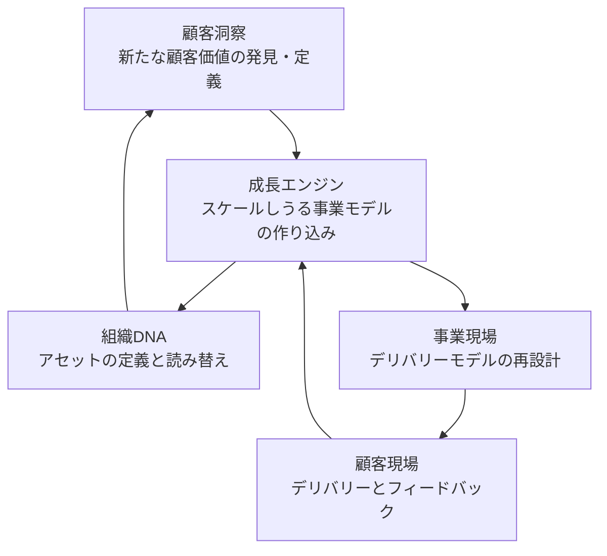
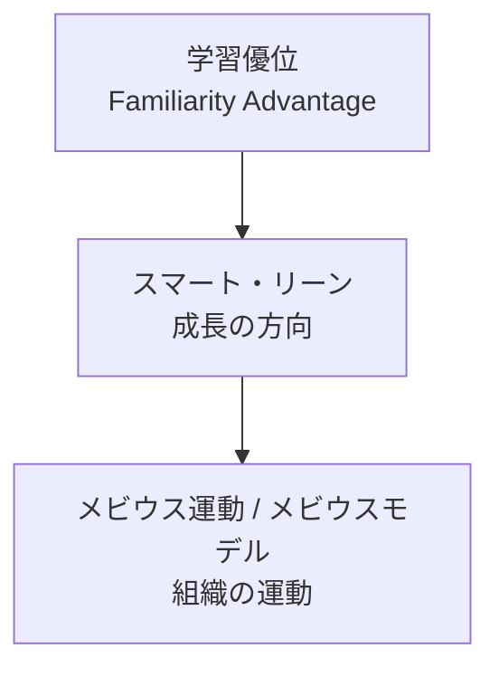

「顧客の現場で学んだことを組織の DNA に照らし、新しい価値を定義して、また現場に返す」。名和高司氏が提唱するメビウスモデルは、この循環を 1 枚の図にした組織学習のフレームワークです。この記事では、書籍と本人の講演資料をもとに、図の構成要素、循環の経路、上位概念との関係を整理します。そのうえで、呼称の揺れ、事例の扱い、同名の別概念との切り分けなど、引用や助言で使うときの注意点をまとめます。

対象読者は、経営企画・事業開発・技術顧問として、この図を記事や社内資料で正確に使いたい人です。読み終えると、5 つの構成要素と循環の順序を一次資料に基づいて説明でき、どこまでを「実証済み」として語ってよいかを判断できるようになります。なお、書籍本文の逐語は公開されている目次と本人の講演・取材記事で代替している箇所があります。

*この記事の全体像。以下、順に解説します。*

## 名和高司のメビウスモデルとは

メビウスモデルは、3×3 のマトリクス上にある 5 つのホットスポットを、中央の成長エンジンを通して循環させる組織学習の図です。横軸は着想・構築・提供というバリューチェーン（時間）、縦軸は顧客・商品サービス・企業というエコシステム（空間）を表します。

提唱者の名和高司氏は、一橋大学ビジネススクール（一橋 ICS）の客員教授、京都先端科学大学の教授を務め、ファーストリテイリングやデンソー、味の素などの社外取締役を歴任した経営学者です。2010 年の書籍『学習優位の経営』（ダイヤモンド社）では、この循環を「組織のメビウス運動」という章題で説明しています。後年の講演スライドでは「メビウスモデル」と呼ばれます。

### 〈4＋1〉のボックス

図は四隅の 4 つのボックスと中央の 1 つ、あわせて〈4＋1〉で構成されます。ボックス名は、2023 年 4 月 12 日の消費者庁「消費者志向経営に関する連絡会」で名和氏本人が使ったスライドの原文に合わせています。

| 位置 | ボックス | スライド原文の中身 | 時間軸 | 空間軸 |
|---|---|---|---|---|
| 左上 | 顧客洞察 | 新たな顧客価値の発見・定義 | 着想 Define | 顧客 |
| 右上 | 顧客現場 | 顧客への価値のデリバリー / フィードバック | 提供 Deliver | 顧客 |
| 中央 | 成長エンジン | 大きくスケール(規模)をとり得るビジネスモデルの作り込み | 構築 Develop | 商品・サービス |
| 左下 | 組織DNA | 自社のDNA・アセットを定義・読み替え | 着想 Define | 企業 |
| 右下 | 事業現場 | デリバリーモデルの再設計 | 提供 Deliver | 企業 |

2010 年の ITmedia エグゼクティブの取材記事では、右上のボックスを「顧客接点」と表記しています。同じ位置を指す表記の揺れです。

中央の成長エンジンは、ITmedia の記事では「大きく規模を取りうるビジネスモデルの作り込み作業」と説明されています。顧客の声をそのまま製品にするのではなく、規模を取れる事業モデルに作り込む工程を、循環の中心に置いている点がこの図の特徴です。

### 循環の経路

図の名前は、ボックスをつなぐ線が「メビウスの輪」や無限大記号に見えることに由来します。右上の顧客現場から中央を通って左下の組織 DNA へ降り、左上の顧客洞察へ上がり、再び中央を通って右下の事業現場へ向かう線です。

消費者庁スライドには、この循環に対応する番号付きの吹き出しが 5 つ置かれています。原文は次のとおりです（改行のみ連結）。

1. 顧客のフィードバックを組織のDNAに照らして判断することで、自社にとっての「顧客の声」の意味合いを明確化
2. 顧客の声の自社にとっての意味合いを明確にした上で、自分達が提供する価値(スマート)を定義
3. 発見した価値をベースにスケーラブルな事業モデルをどのように構築するかを設計
4. 顧客へ価値をいかに廉価にデリバーするか(リーン)を検討
5. デリバリーを通じて顧客の反応を観察

上の Mermaid 図は、スライドのボックス配置に沿って、中央の成長エンジンをハブにした ∞ の経路で描いています。

### スマートとリーン

吹き出しの 2 と 4 に出てくる「スマート」と「リーン」は、この図の成長方向を示す一対の言葉です。ITmedia の 2010 年の記事では、スマートを顧客から見た価値の高さ、リーンを提供手段のコストの低さと説明しています。価値の高さとコストの低さという二律背反を両立させる方向として、図の中に組み込まれています。

### 三つのミドル

消費者庁スライドの右端には、フロントミドル、コアミドル、バックミドルという 3 つのラベルがあります。同じスライドの p.19 には「ミドルを核としたメビウス運動」という記述があります。『学習優位の経営』第 6 章の見出しも「ミドル機能によるつなぎ」「ユニクロを駆動するミドル機能」「ミドル機能の埋め込み」と、ミドル層が循環をつなぐ役割を担う構成になっています。

### 学習優位との関係

メビウスモデルは単独のフレームワークではなく、「学習優位」という上位概念を組織で回すための実践図です。学習優位は、ポジショニングではなく学習という動的能力を競争優位の源泉に置く考え方で、一橋 ICS の英語プロフィールでは *Familiarity Advantage* と表記されています。スマート・リーンがその成長方向、メビウスがその組織運動という入れ子になっています。

『学習優位の経営』の目次も、第 4 章が〈4＋1〉、第 5 章が運動、第 6 章がミドル、第 7 章が実践例と、この入れ子に沿って並んでいます。第 4 章には「ＤＮＡの二つの螺旋構造」「ＤＮＡの読み解きと読み替え」「四つの未成功パターン」という見出しがあり、組織 DNA の読み替えを循環の起点に置いています。

### 2018 年『企業変革の教科書』での位置づけ

2018 年の『企業変革の教科書』（東洋経済新報社）では、第 4 章がメビウスモデルの章です。同書では、V 字回復、自己破壊、組合せと並ぶ企業変革 4 モデルの 1 つとして位置づけられています。章題は出版社の目次で「メビウス（永久反転）モデル」、電子版の目次で「メビウス（永久反転）運動モデル」と表記されています。

## 注意点

一次資料に当たると、呼称、事例、実証の扱いで見落としやすい点がいくつかあります。引用や助言に使うときは次の点を押さえてください。

### 2010 年の正本呼称は「メビウス運動」

『学習優位の経営』の目次に「メビウスモデル」という語はありません。名和氏本人の 2010 年の発言は「この一連の思考と実践という思考錯誤の流れをわたしはメビウス運動と呼んでいます」です。書籍で「モデル」の呼称を確認できるのは 2018 年『企業変革の教科書』の第 4 章題で、2023 年の消費者庁スライドの図題は「次世代イノベーションを駆動するメビウスモデル」です。ただし同じスライドの p.19 は「ミドルを核としたメビウス運動」と書いており、本人資料の中でも両方の呼称が使われています。一橋 ICS の英語プロフィールは “Möbius” cycle であり、model ではありません。

引用するときは「2010 年はメビウス運動、後年のスライドではメビウスモデル」と時期を添えると、どの資料を指しているかが明確になります。

### 循環の経路の書き方は資料で 3 通りある

同じ図を指していても、一次資料の中で経路の書き方は 3 通りあり、番号の起点と中央を通る回数が一致しません。

| 系統 | 出典 | 順序 |
|---|---|---|
| 吹き出し番号 ①〜⑤ | 消費者庁スライド p.14 | DNA に照らす → 価値(スマート)を定義 → 事業モデルを設計 → 廉価にデリバー(リーン) → 反応を観察 |
| 視覚の ∞ | 同スライドの配置、ITmedia の図の説明 | 顧客現場 → 成長エンジン → 組織DNA → 顧客洞察 → 成長エンジン → 事業現場 → 顧客現場 |
| 2010 年の口述 | ITmedia 2010-09-28 | 顧客接点から中央を通過して組織DNAへ向かい、顧客洞察へ上昇して再び中央を通って事業現場へ |

吹き出し番号は組織 DNA から始まり、成長エンジンを 1 回だけ通ります。視覚の ∞ と 2010 年の口述は顧客現場から始まり、成長エンジンを 2 回通ります。循環の順序を引用するときは、どの系統かを添えてください。

### 三つのミドルの役割定義は公開資料にない

フロントミドル、コアミドル、バックミドルの各層が何を担うかを定義した逐語は、『学習優位の経営』の公開目次にはありません。2010 年の ITmedia の取材記事にも三つのミドルは登場しません。層の名前と「つなぎ役」という位置づけまでが、一次資料で確認できる範囲です。各層の役割を説明する Web 記事は講義の編集記事に基づくものが多いため、書籍の一次表記として引用しないでください。

### 4 つの未成功パターンの固有名は書籍の目次にない

『学習優位の経営』第 4 章の見出しは「四つの未成功パターン」までで、各パターンの固有名は公開目次に含まれていません。Web 上で見かける「市場開拓型 / マーケティング型 / 資産深耕型 / 現場深耕型」という名称は、CULTIBASE の 2024 年の編集記事が使っている表記です。書籍本文の表記と一致するかは未確認のため、これらを書籍の一次表記として引用しないでください。

### 成功事例は事後の当てはめ

書籍と講演で使われる Apple、ユニクロ、リクルートなどの事例は、循環図を後から当てはめた説明です。iPod の説明では、名和氏本人が「初代iPodが生まれた時点を当てはめてみると」と前置きしています。

また、事例企業のその後は、循環が持続を保証する証拠にはなりません。第 1 章に置かれた「ノキアのインド攻略」のあと、ノキアの携帯電話事業は 2013 年 9 月にマイクロソフトへの売却が発表され、2014 年 4 月に完了しました。第 7 章「デジカメにみるメビウス運動」で扱われるパナソニックは、2012 年 12 月に三洋のデジカメ事業の譲渡を発表しています。事例を出すときは「事後写像」であることを明記し、事例の賞味期限を意識してください。

### 査読による再現研究は見当たらない

2026 年 9 月時点で、CiNii、J-STAGE、Google Scholar を検索した範囲では、メビウス運動や学習優位を検証した査読論文は確認できませんでした。書籍より 7 年先行する『Diamond ハーバード・ビジネス・レビュー』2003 年 3 月号「学習優位の戦略」は雑誌論文であり、査読誌の実証研究ではありません。「この循環を実装すると持続的イノベーションが起きる」という因果は、未測定として扱うのが正確です。

### 失敗を補助仮説で回収できる

うまくいかない場合の説明は、組織 DNA の読み解き不足、成長エンジンの飛ばし、脱学習の不足、ミドルのつなぎ切れ、のいずれかで閉じることができます。「循環を実装したがイノベーションが起きない」という外部からの反証条件を、公開資料から置くことはできません。ブクログに投稿された『学習優位の経営』の読者レビューには「PDCA の難語化」「フレームワークが腹落ちしない」という評もあります。この図を KPI や監査手順のように「満たしたか」を判定する道具として使うのは適していません。

### 同名の別概念と混同しやすい

「メビウス」を冠した経営・プロダクト系の概念は複数あり、いずれも名和氏のモデルとは別物です。

- **CX-EX の Möbius Strip**: ServiceNow が 2021 年に Forbes BrandVoice で提唱した、顧客体験（CX）と従業員体験（EX）の一体運用の比喩
- **Mobius Outcome Delivery**: Discover / Decide / Deliver の 3 ループでプロダクト開発を進めるナビゲータ。日本語のアジャイル圏で「メビウスループ」として紹介される
- 社名の Möbius / メビウス、JT の銘柄 Mevius

記事や資料の冒頭で、どのメビウスを指すかを明示してください。

### 取締役在任はモデルの実証ではない

名和氏はファーストリテイリング（2012〜2022 年）、デンソー（2013 または 2014 年〜2018 または 2019 年）、味の素（2015〜2023 年）、SOMPO ホールディングス（2020〜2026 年 6 月 22 日）などの社外取締役を務めました。これらの企業での実務がモデルの裏付けとして語られることがありますが、次の事実も確認できます。

- SOMPO ホールディングス在任中の 2023 年 12 月 26 日、金融庁は損保ジャパンを含む大手 4 社へ保険料調整行為で業務改善命令を出しました。2024 年 1 月 25 日には、ビッグモーター対応で損保ジャパンと SOMPO ホールディングスの双方へ業務改善命令を出しています
- デンソーは燃料ポンプの品質問題を「過去最大の品質問題」と社史に記し、2019 年度の大幅減益の主因を 2,000 億円超の品質引当としています。この引当は名和氏の退任後の計上です

これらは名和氏個人に対する処分ではありません。ここで示したいのは、学習の循環が統治・品質・顧客保護を自動的に保証するわけではない、という限界です。

### 大学プロフィールは陳腐化している

在任状況や年次を引用するときは、大学プロフィールを正本にしないでください。京都先端科学大学の日英プロフィールは 2026 年 9 月時点でもファーストリテイリングを現任と書いていますが、同社の 2023 年の招集通知は「2022年11月24日開催の2022年8月期定時株主総会終結の時をもって、取締役名和高司氏は退任いたしました。」と記しています。デンソーの就任年は一橋 ICS が 2013 年、SOMPO の法定開示が 2014 年 6 月、終了年は一橋 ICS が 2018 年、京都先端科学大学と消費者庁資料が 2019 年と割れています。任期は会社の IR 資料と突合してください。

書誌情報も揃っていません。『学習優位の経営』の頁数は NDL と CiNii が 270 頁、ダイヤモンド社の現行ページが 272 頁で、刊行時の定価は NDL が 2,000 円、現行公式は本体 2,400 円＋税です。

## 隣接概念とどう違うか

学習や循環を扱う既存の理論と並べると、メビウスモデルの位置がはっきりします。

| 基準 | 名和メビウス | CX-EX Möbius | Mobius Outcome Delivery | SECI | ダイナミック・ケイパビリティ |
|---|---|---|---|---|---|
| 対象 | 顧客現場と組織DNA | CX と EX | プロダクトのアウトカム | 暗黙知と形式知 | 感知・捕捉・変容 |
| 出自 | 2010 年書籍、日本のコンサル実践 | 2021 年 ServiceNow | Benefield / Open Practice Library | Nonaka & Takeuchi 1995 | Teece et al. 1997 |
| 図 | 3×3 ＋中央エンジン | 片面一辺の帯 | Discover / Decide / Deliver | 4 象限スパイラル | プロセス記述が中心 |
| 混同リスク | — | 高 | 高（日本語アジャイル圏） | 中（学習循環） | 低（名前が違う） |

### ポーターの二者択一との関係

ポーターは 1980 年の『競争の戦略』で、コストリーダーシップと差別化の中途半端な状態（stuck in the middle）を戒めました。1996 年の論文 “What is Strategy?” では、業務効率の改善は戦略ではないと論じています。名和氏は『学習優位の経営』第 1 章でこの二者択一を要約したうえで、スマート×リーンという両立を突破口として置いています。

両立が常に失敗するという実証は一様ではありません。ただし、活動のトレードオフを宣言しない「全方位改善」は、1996 年のポーターが批判した型に入ります。スマート×リーンを掲げるときは、何を捨てるかも同時に決める必要があります。

### クリステンセンのジレンマとの関係

クリステンセンの『イノベーターのジレンマ』は、優良企業が既存顧客から学ぶほど破壊的イノベーションへの対応が遅れる、という対抗命題です。名和氏自身が第 1 章でこのジレンマに触れています。顧客現場での学習を循環に組み込む設計は、持続的イノベーションへの偏重と重なる可能性があります。循環の起点を組織 DNA の「読み替え」に置いているのは、この偏重への答えとして読めますが、それが機能するかは事例ごとに確認が必要です。

## どこまで信じて、どう使うか

### 一次資料が支持していること

- 『学習優位の経営』の目次が、第 4 章〈4＋1〉、第 5 章運動、第 6 章ミドル、第 7 章実践例と一連で並ぶ
- 2023 年の消費者庁スライドで、名和氏本人が 5 つのボックスと①〜⑤の吹き出しを図示している
- 2010 年の ITmedia の記事が、本人発言として循環の経路とスマート／リーンの定義を残している
- 一橋 ICS の英語プロフィールが、*Familiarity Advantage*、Smart-Lean、Möbius cycle を公式に対応づけている
- 2018 年『企業変革の教科書』が、変革 4 モデルの 1 つとして章を立てている

### 一次資料が支持していないこと

- 査読・再現研究が主要データベースで見当たらない
- 成功事例は事後の当てはめであり、ノキアやデジカメ事業は出版後に縮小・売却された
- 循環の順序と成長エンジンを通る回数（1 回か 2 回か）が資料で揺れる
- 失敗を DNA・飛ばし・脱学習で回収でき、外部からの反証条件が弱い

図としての一貫性は、2010 年の書籍と 2023 年のスライドの間で高く保たれています。一方で「この循環を実装すると持続的イノベーションが起きる」という因果は未測定です。

### 実務での使い方

メビウスモデルは、**学習循環の地図**として使うのが適切です。「実証済みの成長エンジン」や、KPI・ガバナンスの証明としては使わないでください。

具体的には、次の 4 点を守ると引用の正確さを保てます。

1. 呼称に時期を添える。「2010 年はメビウス運動、後年のスライドではメビウスモデル。図は〈4＋1〉」
2. 5 つのホットスポット名は 2023 年の消費者庁スライドを優先し、2010 年の「顧客接点」表記の揺れを注記する
3. Apple / ユニクロ / リクルートの事例を出すときは「事後写像」と書く
4. 取締役の任期や数値は、会社の IR 資料と突合する。大学プロフィールを現任の正本にしない

自組織で使うときは、まず 5 つのボックスに自社の活動を当てはめ、どのボックスが空いているか、中央の成長エンジンを飛ばしていないかを点検する用途に向いています。循環が回っているかどうかの判定基準は図の中にないので、顧客フィードバックの件数や事業モデルの改訂回数など、自組織で観測できる指標を別に決める必要があります。

## まとめ

- メビウスモデルは、3×3 のマトリクス上の 5 つのホットスポット（顧客洞察・顧客現場・成長エンジン・組織 DNA・事業現場）を、中央の成長エンジンを通して循環させる組織学習の図です
- 学習優位という上位概念の実践図であり、スマート×リーンを成長方向、メビウスを組織運動とする入れ子になっています
- 2010 年の書籍では「メビウス運動」、2018 年以降の資料では「メビウスモデル」と呼ばれ、英語公式は Möbius cycle です
- 成功事例は事後の当てはめで、査読による再現研究は見当たりません。因果は未測定として扱ってください
- CX-EX の Möbius Strip や Mobius Outcome Delivery とは別物です。冒頭でどのメビウスかを明示してください
- 実務では「学習循環の地図」として使い、KPI や統治の証明には使わないのが安全です

この記事が少しでも参考になった、あるいは改善点などがあれば、ぜひリアクションやコメント、SNSでのシェアをいただけると励みになります！

## 参考リンク

一次資料:

- 名和高司『学習優位の経営――日本企業はなぜ内部から変われるのか』ダイヤモンド社、2010 年 2 月。ISBN 978-4-478-00224-7。[公式ページ](https://www.diamond.co.jp/book/9784478002247.html) / [目次](https://www.diamond.co.jp/_itemcontents/0201_biz/00224-7.html) / [NDL](https://ndlsearch.ndl.go.jp/books/R100000002-I000010712685)
- 名和高司『企業変革の教科書』東洋経済新報社、2018 年 12 月。ISBN 978-4-492-53405-2。第 4 章「メビウス（永久反転）モデル」
- 名和高司「学習優位の戦略――ラーニングとアンラーニングの良循環」『Diamond ハーバード・ビジネス・レビュー』28(3), 72-86, 2003 年 3 月
- [消費者庁「消費者志向経営に関する連絡会」資料、2023-04-12](https://www.caa.go.jp/policies/policy/consumer_partnerships/meeting_materials/assets/consumer_partnerships_cms201_20230412.pdf)
- [大西高弘「Apple が証明した企業 DNA の力」ITmedia エグゼクティブ、2010-09-28](https://mag.executive.itmedia.co.jp/executive/articles/1009/28/news071.html)
- [Hitotsubashi ICS, “NAWA, Takashi”](https://www.ics.hub.hit-u.ac.jp/nawa-takashi)
- [京都先端科学大学「名和 高司」](https://www.kuas.ac.jp/faculty-members/faculty/nawa-takashi)
- [ファーストリテイリング「第 62 回定時株主総会招集ご通知」（2023 年 8 月期）](https://www.fastretailing.com/jp/ir/stockinfo/pdf/shoshu_2023Aug.pdf)
- [SOMPO ホールディングス「役員の選任、退任に関するお知らせ」、2026-05-20](https://www.sompo-hd.com/-/media/hd/files/news/2026/20260520_3.pdf?la=ja-JP)
- [金融庁「大手損害保険会社に対する行政処分」、2023-12-26](https://www.fsa.go.jp/news/r5/hoken/20231226/20231226.html)
- [金融庁「株式会社損害保険ジャパン及び SOMPO ホールディングス株式会社に対する行政処分」、2024-01-25](https://www.fsa.go.jp/news/r5/hoken/20240125/20240125.html)
- Porter, M. E. *Competitive Strategy*. Free Press, 1980.
- Porter, M. E. “What is Strategy?” *Harvard Business Review* 74(6), 1996, pp. 61–78.
- Teece, D. J., Pisano, G., & Shuen, A. “Dynamic Capabilities and Strategic Management.” *Strategic Management Journal* 18(7), 1997, pp. 509–533.
- Nonaka, I. & Takeuchi, H. *The Knowledge-Creating Company*. Oxford University Press, 1995.
- Christensen, C. M. *The Innovator’s Dilemma*. Harvard Business School Press, 1997.

二次資料・講義録:

- [CULTIBASE「学習優位により、持続的にイノベーションを起こすメビウスモデル」、2024-11-11](https://www.cultibase.jp/articles/mobius-innovation)
- [翁長潤「次世代型イノベーション組織の作り方」Human Capital Online、2023-02-03](https://project.nikkeibp.co.jp/HumanCapital/atcl/column/00069/012200023/)
- [名和高司「次世代イノベーションの本質と実践における要諦」JBpress Innovation Review、2023-06-26](https://jbpress.ismedia.jp/articles/-/75497)

同名概念:

- Robison, D. “The Möbius Strip Of CX And EX.” Forbes BrandVoice, 2021-08-12.
- [Mobius Outcome Delivery](https://www.mobiusloop.com)
