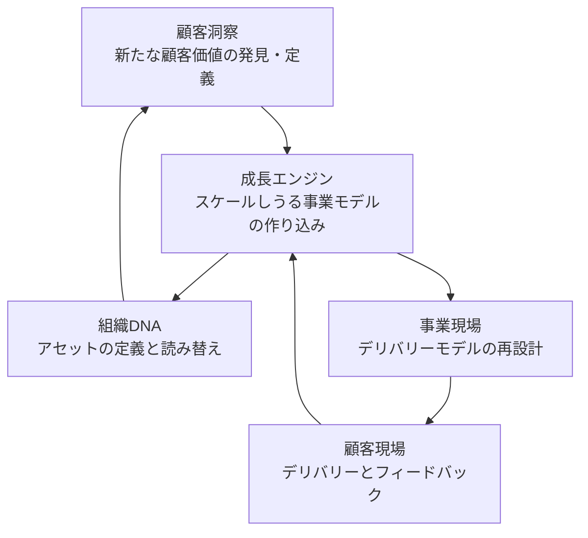
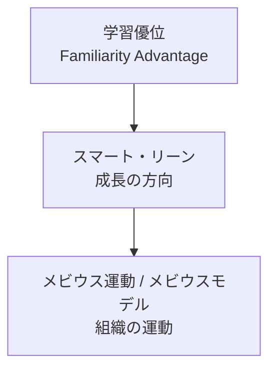

「顧客の現場で学んだことを組織の DNA に照らし、新しい価値を定義して、また現場に返す」。名和高司氏が提唱するメビウスモデルは、この循環を 1 枚の図にした組織学習のフレームワークです。この記事では、書籍と本人の講演資料をもとに、図の構成要素、循環の経路、循環を組織に埋め込むための仕組み、上位概念との関係を整理します。そのうえで、どこまでが検証された話で、どこからが未検証の主張かをまとめます。

対象読者は、経営企画・事業開発・組織開発として、この図の考え方を自組織に当てはめてみたい人です。読み終えると、5 つの構成要素と循環の順序、日本企業が陥りやすいショートカット、循環を支える中間管理職の 3 機能を説明でき、どこまでを「実証済み」として扱ってよいかを判断できるようになります。なお、書籍本文の逐語は公開されている目次と本人の講演・取材記事で代替している箇所があります。

*この記事の全体像。以下、順に解説します。*

## 名和高司のメビウスモデルとは

メビウスモデルは、3×3 のマトリクス上にある 5 つのホットスポットを、中央の成長エンジンを通して循環させる組織学習の図です。横軸は着想・構築・提供というバリューチェーン（時間）、縦軸は顧客・商品サービス・企業というエコシステム（空間）を表します。

提唱者の名和高司氏は、一橋大学ビジネススクール（一橋 ICS）の客員教授、京都先端科学大学の教授を務め、ファーストリテイリングやデンソー、味の素などの社外取締役を歴任した経営学者です。2010 年の書籍『学習優位の経営』（ダイヤモンド社）では、この循環を「組織のメビウス運動」という章題で説明しています。2018 年の『企業変革の教科書』（東洋経済新報社）以降の資料では「メビウスモデル」と呼ばれます。この記事では両方を同じ図を指す言葉として扱います。

### 前提となるイノベーションの捉え方

名和氏は 2022 年 12 月の DX フォーラム基調講演で、シュンペーターの教えをもとにイノベーションの本質を次のように整理しています。

- イノベーションは外ではなく、内側から生まれる
- 0 から 1 を生む「発明」ではなく、既存のものを「異結合」して創出する
- 本質は社会実装しながらスケール化させることにある。「技術革新」ではなく「市場創造」である
- 今のビジネスに埋もれている資産を「創造的な破壊」で新しいものに変える
- Blue Ocean はすぐ Red Ocean になるので、その間の「Purple Ocean」にずらす

メビウスモデルは、この意味でのイノベーションを持続的に生み出す組織の動き方として提示されています。図の中央に「スケールしうる事業モデルの作り込み」が置かれているのは、社会実装とスケール化を本質と見るこの前提の表れです。

### 〈4＋1〉のボックス

図は四隅の 4 つのボックスと中央の 1 つ、あわせて〈4＋1〉で構成されます。ボックス名は、2023 年 4 月の消費者庁「消費者志向経営に関する連絡会」で名和氏本人が使ったスライドに合わせています。

| 位置 | ボックス | スライドでの中身 | 時間軸 | 空間軸 |
|---|---|---|---|---|
| 左上 | 顧客洞察 | 新たな顧客価値の発見・定義 | 着想 Define | 顧客 |
| 右上 | 顧客現場 | 顧客への価値のデリバリー / フィードバック | 提供 Deliver | 顧客 |
| 中央 | 成長エンジン | 大きくスケール(規模)をとり得るビジネスモデルの作り込み | 構築 Develop | 商品・サービス |
| 左下 | 組織DNA | 自社のDNA・アセットを定義・読み替え | 着想 Define | 企業 |
| 右下 | 事業現場 | デリバリーモデルの再設計 | 提供 Deliver | 企業 |

中央の成長エンジンは、顧客の声をそのまま製品にするのではなく、規模を取れる事業モデルに作り込む工程です。この工程を循環の中心に置いている点がこの図の特徴です。

### 循環の経路

図の名前は、ボックスをつなぐ線が「メビウスの輪」や無限大記号に見えることに由来します。出発点は右上の顧客現場です。そこから中央を通って左下の組織 DNA へ降り、左上の顧客洞察へ上がり、再び中央を通って右下の事業現場へ向かい、顧客現場へ戻ります。

消費者庁スライドには、この循環に対応する番号付きの吹き出しが 5 つ置かれています。原文は次のとおりです（改行のみ連結）。

1. 顧客のフィードバックを組織のDNAに照らして判断することで、自社にとっての「顧客の声」の意味合いを明確化
2. 顧客の声の自社にとっての意味合いを明確にした上で、自分達が提供する価値(スマート)を定義
3. 発見した価値をベースにスケーラブルな事業モデルをどのように構築するかを設計
4. 顧客へ価値をいかに廉価にデリバーするか(リーン)を検討
5. デリバリーを通じて顧客の反応を観察

講演では、この経路の意味を次のように説明しています。顧客現場では、顧客だけでなく未顧客のフィードバックも拾います。それを組織 DNA、つまり「組織のコアコンピタンスが潜んでいるゾーン」に落とし込み、組織の強みと突き合わせながら未来を読み解きます。「顧客の未来」と「自社の潜在的な能力」が掛け合わされることで、他社に模倣されにくい新しいコンセプトが生まれる、という筋道です。

### 名和氏が指摘するショートカット

循環の経路の意味を説明するなかで、名和氏は日本企業の多くがこの循環を省略してしまうと述べています。講演で挙げられた省略の仕方は 3 つです。

| ショートカット | 何が起きるか |
|---|---|
| 顧客現場 → すぐ事業現場 | 単なる「改善」に過ぎない |
| 顧客現場 → すぐ顧客洞察 | 組織 DNA を通らないため、すぐ模倣されるコンセプトしか生まれない |
| 顧客洞察 → すぐ事業現場 | 成長エンジンを通らないため、すでに持っている資産の範囲でしか市場を作れない |

循環を ∞ の形にしているのは、この 3 つのショートカットを避け、組織 DNA と成長エンジンを必ず経由させるためです。

### スマートとリーン

吹き出しの 2 と 4 に出てくる「スマート」と「リーン」は、この図の成長方向を示す一対の言葉です。2010 年の ITmedia エグゼクティブの取材記事では、スマートを顧客から見た価値の高さ、リーンを提供手段のコストの低さと説明しています。価値の高さとコストの低さという二律背反を両立させる方向として、図の中に組み込まれています。

### 三つのミドル

循環を組織の中で回す主体として、名和氏は中間管理職に 3 つの機能を割り当てています。消費者庁スライドの右端にはフロントミドル、コアミドル、バックミドルというラベルがあり、講演では次のように定義しています。

| 機能 | 担い手 |
|---|---|
| フロントミドル | 営業企画の人 |
| バックミドル | オペレーションの企画ができる人 |
| コアミドル | 事業をつくれる人 |

この 3 つの「ミドル」には、具体的な役職や目標数字をあえて持たせません。この 3 人を起用してメビウスの動きを組織に埋め込むことで、イノベーション活動が継続的に行われるようになる、という考え方です。『学習優位の経営』第 6 章の見出しも「ミドル機能によるつなぎ」「ユニクロを駆動するミドル機能」「ミドル機能の埋め込み」と、ミドル層が循環をつなぐ役割を担う構成になっています。

### 学習優位との関係

メビウスモデルは単独のフレームワークではなく、「学習優位」という上位概念を組織で回すための実践図です。学習優位は、ポジショニングではなく学習という動的能力を競争優位の源泉に置く考え方で、一橋 ICS の英語プロフィールでは *Familiarity Advantage* と表記されています。スマート・リーンがその成長方向、メビウスがその組織運動という入れ子になっています。

『学習優位の経営』の目次も、第 4 章が〈4＋1〉、第 5 章が運動、第 6 章がミドル、第 7 章が実践例と、この入れ子に沿って並んでいます。第 4 章には「ＤＮＡの二つの螺旋構造」「ＤＮＡの読み解きと読み替え」という見出しがあり、顧客現場で得た声を組織 DNA の読み替えにつなげる構成になっています。

## 循環を組織に埋め込む仕組み

2022 年の講演では、メビウス運動を実現するための組織の条件と、運動を回す仕掛けが併せて示されています。

### DACO: 自律しつつ関係性でつながる組織

名和氏は組織を 2 つの軸で捉えます。横軸は「スケール・スコープの経済」、縦軸は「スキル・スピードの経済」です。デジタル時代に最も適しているのは両方の度合いが高い DACO（Decentralized Autonomous Connected Organization、創発型組織）だとしています。

Web3 の文脈で語られる DAO（自律分散型組織）は、一つ一つの事業やプロジェクトを自律して推進できる一方で、大きくスケールする事業や市場を作れません。DACO はそこに Connected（関係性）を加えたもので、名和氏は「Connected があってこそ、市場を生み出せる」と強調しています。

### Innovation @ Edges: ゆらぎ・つなぎ・ずらし

「Innovation @ Edges」は、イノベーションは現場からしか起こらない、という考え方です。市場に埋め込まれた現場の一つ一つがセンサーのように新しい動きを察知することを、名和氏は「ゆらぎ」と呼びます。現場の数が多いほどゆらぎの機会は増えますが、それだけでは小さなゆらぎしか起こせません。

現場がゆらぎを作り、本社がそれを「つなぎ」「ずらし」ていくことで地殻変動が起き、初めてスケールします。名和氏はこれを生物の進化のプロセスになぞらえ、「共進化」の重要性を説いています。

人の面では、ゆらぎを起こすには「よそ者」「わか者」「ばか者」と言われるような、常識的な見方にとらわれない人が現場に必要です。一方で、ゆらぎをつなぎ、ずらすにはインクルージョン（包括）が欠かせません。ダイバーシティのための頭数をそろえるよりも、多様な人が活躍できるインクルーシブな環境を作る力が求められる、という指摘です。

### クリエーティブ・ルーティン: たくみをしくみに落とす

ゆらぎ・つなぎ・ずらしを実践する方法として、名和氏は「クリエーティブ・ルーティン」を提案しています。「n=1」の新しいものを作るには人の「たくみ」の力が必要ですが、それだけではスケールしません。たくみを「しくみ」、つまりルーティンに落とす作業が必要です。

たくみをしくみに落とすと、たくみが生まれるたびにしくみも進化します。この「進化するルーティン」が回ることで、常に新しいことが生まれ続けてスケールします。名和氏はこれをイノベーションの本質だと位置づけています。講演では、最近の日本企業はたくみに走りすぎてしくみに落とすことをおろそかにしている、とも指摘しています。

### デュアル OS と時間軸の両利き

進化するルーティンを生み出す組織形態として、名和氏は「両利きの経営」ではなくジョン・P・コッター氏の「デュアル OS」を推奨しています。デュアル OS では、新しい事業を始めるときにエース人材を事業をインキュベーションする組織に送り込み、成し遂げた後は新しいアイデアとともに元の組織に戻します。

この往復には 2 つの効果があります。エースが抜けた元の組織は、不在でも回るように整流化され、無駄のない構造に変わります。新しい組織で生まれた事業を戻すことで、既存のビジネスが触発されて事業全体が進化します。新規事業を触媒として本業自体を進化させることが、イノベーションの本質的な価値だとしています。

時間軸にも両利きがあります。大事なのは 30 年くらい先を見る長期と、日々変わる景気や国際情勢に対応する短期です。日本企業が経営計画で重視する 3 年程度の中期については、予測が難しいため「あまり意味がない」と述べています。

### マネジメントそのものをイノベーションする

講演の締めくくりで名和氏は、イノベーションをどうマネージするかよりも、マネジメントそのものをイノベーションすることに重きを置いてほしいと述べています。その進め方は 3 つのプロセスです。

1. **ドリームセッション**: 創業の思いを見つめ直し、その企業ならではの「ありたい姿」を北極星として置く。「本当にワクワクできるか」「われわれならではのものか」「従業員、顧客、社会が『この企業ならできる』と思えるものか」の 3 つが合致していれば、いくらでも思いを高く飛ばしてよい
2. **内省セッション**: 今と未来のギャップを見つめ、なぜそこにたどり着けていないのかを考える。内省から始めると進まないため、必ずドリームセッションの後に置く。自社の「クセ」や「やってるつもり病」と向き合う
3. **変革**: Innovation @ Edges、メビウス運動、クリエーティブ・ルーティンの埋め込みによって、ありたい姿を目指して現状を変える

変革のレバーについては、コッター氏の議論を引いて、「このままではだめだ」という危機感ではなく、パーパスや志を使うべきだとしています。危機感は生存本能を働かせて身を守らせるため、イノベーションを生み出せなくなります。もっと素敵な自分たちになりたいという前向きな気持ち（繁栄本能）に火がつけば、やらされ感のない変革が始まる、という主張です。

## 注意点

ここまでは名和氏の主張をそのまま整理しました。自組織に当てはめる前に、どこまでが検証された話かを押さえてください。

### 査読による再現研究は見当たらない

2026 年 9 月時点で、CiNii、J-STAGE、Google Scholar を検索した範囲では、メビウス運動や学習優位を検証した査読論文は確認できませんでした。書籍より 7 年先行する『Diamond ハーバード・ビジネス・レビュー』2003 年 3 月号「学習優位の戦略」は雑誌論文であり、査読誌の実証研究ではありません。「この循環を実装すると持続的イノベーションが起きる」という因果は、未測定として扱うのが正確です。

### 成功事例は事後の当てはめ

書籍と講演で使われる Apple、ユニクロ、リクルートなどの事例は、循環図を後から当てはめた説明です。iPod の説明では、名和氏本人が「初代iPodが生まれた時点を当てはめてみると」と前置きしています。事例企業のその後も循環の持続を保証しません。『学習優位の経営』第 1 章の「ノキアのインド攻略」のあと、ノキアの携帯電話事業は 2013 年 9 月にマイクロソフトへの売却が発表され、2014 年 4 月に完了しました（日本経済新聞 2013-09-03、CNET Japan 2014-04-26）。第 7 章で扱われるパナソニックも、2012 年 12 月に三洋のデジカメ事業の譲渡を発表しています（日本経済新聞 2012-12-21）。

### 失敗を補助仮説で回収できる

うまくいかない場合の説明は、組織 DNA の読み解き不足、成長エンジンの飛ばし、脱学習の不足、ミドルのつなぎ切れ、のいずれかで閉じることができます。「循環を実装したがイノベーションが起きない」という外部からの反証条件を、公開資料から置くことはできません。この図を KPI や監査手順のように「満たしたか」を判定する道具として使うのは適していません。

### 同名の別概念と混同しやすい

「メビウス」を冠した経営・プロダクト系の概念は複数あり、いずれも名和氏のモデルとは別物です。

- **CX-EX の Möbius Strip**: ServiceNow が 2021 年に Forbes BrandVoice で提唱した、顧客体験（CX）と従業員体験（EX）の一体運用の比喩
- **Mobius Outcome Delivery**: Discover / Decide / Deliver の 3 ループでプロダクト開発を進めるナビゲータ。日本語のアジャイル圏で「メビウスループ」として紹介される

## 隣接概念とどう違うか

学習や循環を扱う既存の理論と並べると、メビウスモデルの位置がはっきりします。

| 基準 | 名和メビウス | CX-EX Möbius | Mobius Outcome Delivery | SECI | ダイナミック・ケイパビリティ |
|---|---|---|---|---|---|
| 対象 | 顧客現場と組織DNA | CX と EX | プロダクトのアウトカム | 暗黙知と形式知 | 感知・捕捉・変容 |
| 出自 | 2010 年書籍、日本のコンサル実践 | 2021 年 ServiceNow | Benefield / Open Practice Library | Nonaka & Takeuchi 1995 | Teece et al. 1997 |
| 図 | 3×3 ＋中央エンジン | 片面一辺の帯 | Discover / Decide / Deliver | 4 象限スパイラル | プロセス記述が中心 |
| 混同リスク | — | 高 | 高（日本語アジャイル圏） | 中（学習循環） | 低（名前が違う） |

### ポーターの二者択一との関係

ポーターは 1980 年の『競争の戦略』で、コストリーダーシップと差別化の中途半端な状態（stuck in the middle）を戒めました。1996 年の論文 “What is Strategy?” では、業務効率の改善は戦略ではないと論じています。名和氏は『学習優位の経営』第 1 章でこの二者択一を要約したうえで、スマート×リーンという両立を突破口として置いています。

両立が常に失敗するという実証は一様ではありません。ただし、活動のトレードオフを宣言しない「全方位改善」は、1996 年のポーターが批判した型に入ります。スマート×リーンを掲げるときは、何を捨てるかも同時に決める必要があります。

### クリステンセンのジレンマとの関係

クリステンセンの『イノベーターのジレンマ』は、優良企業が既存顧客から学ぶほど破壊的イノベーションへの対応が遅れる、という対抗命題です。名和氏自身が第 1 章でこのジレンマに触れています。顧客現場での学習を循環に組み込む設計は、持続的イノベーションへの偏重と重なる可能性があります。顧客の声を必ず組織 DNA の「読み替え」に通す設計と、講演で「未顧客」のフィードバックを強調している点は、この偏重への答えとして読めます。それが機能するかは事例ごとに確認が必要です。

## どこまで信じて、どう使うか

### 一次資料が支持していること

- 『学習優位の経営』の目次が、第 4 章〈4＋1〉、第 5 章運動、第 6 章ミドル、第 7 章実践例と一連で並ぶ
- 2023 年の消費者庁スライドで、名和氏本人が 5 つのボックスと①〜⑤の吹き出しを図示している
- 2010 年の ITmedia の記事が、本人発言として循環の経路とスマート／リーンの定義を残している
- 2022 年の講演採録が、三つのミドルの定義、ショートカットの弊害、DACO やクリエーティブ・ルーティンとの接続を本人の言葉で残している
- 一橋 ICS の英語プロフィールが、*Familiarity Advantage*、Smart-Lean、Möbius cycle を公式に対応づけている

### 一次資料が支持していないこと

- 査読・再現研究が主要データベースで見当たらない
- 成功事例は事後の当てはめであり、ノキアやデジカメ事業は出版後に縮小・売却された
- 失敗を DNA・飛ばし・脱学習で回収でき、外部からの反証条件が弱い

図としての一貫性は、2010 年の書籍と 2023 年のスライドの間で高く保たれています。一方で「この循環を実装すると持続的イノベーションが起きる」という因果は未測定です。

### 実務での使い方

メビウスモデルは、**学習循環の地図**として使うのが適切です。「実証済みの成長エンジン」や、KPI・ガバナンスの証明としては使わないでください。

自組織で使うときは、次の順で点検する用途に向いています。

1. 5 つのボックスに自社の活動を当てはめ、どのボックスが空いているかを見る
2. 3 つのショートカットのどれを踏んでいるかを見る。顧客の声がそのまま改善に流れていないか、コンセプトが組織 DNA を通っているか、事業モデルの作り込みを飛ばしていないか
3. フロント・バック・コアのミドル 3 機能を誰が担っているかを見る。役職ではなく、営業企画・オペレーション企画・事業づくりの機能で見る
4. たくみをしくみに落とすルーティンがあるかを見る

循環が回っているかどうかの判定基準は図の中にありません。顧客フィードバックの件数や事業モデルの改訂回数など、自組織で観測できる指標を別に決める必要があります。

## まとめ

- メビウスモデルは、3×3 のマトリクス上の 5 つのホットスポット（顧客洞察・顧客現場・成長エンジン・組織 DNA・事業現場）を、中央の成長エンジンを通して循環させる組織学習の図です
- 出発点は顧客現場です。組織 DNA と成長エンジンを必ず経由させることで、模倣されにくいコンセプトとスケールする事業モデルを作ります。日本企業はこの 2 つを飛ばすショートカットに陥りやすいと指摘されています
- 循環を回す主体は中間管理職で、営業企画（フロント）・オペレーション企画（バック）・事業づくり（コア）の 3 機能に分けます
- 循環を組織に埋め込む仕組みとして、DACO、ゆらぎ・つなぎ・ずらし、クリエーティブ・ルーティン、デュアル OS、ドリームセッションから始めるマネジメント変革が提示されています
- 査読による再現研究は見当たらず、成功事例は事後の当てはめです。因果は未測定として扱い、学習循環の地図として使うのが安全です

この記事が少しでも参考になった、あるいは改善点などがあれば、ぜひリアクションやコメント、SNSでのシェアをいただけると励みになります！

## 参考リンク

一次資料:

- 名和高司『学習優位の経営――日本企業はなぜ内部から変われるのか』ダイヤモンド社、2010 年 2 月。ISBN 978-4-478-00224-7。[公式ページ](https://www.diamond.co.jp/book/9784478002247.html) / [目次](https://www.diamond.co.jp/_itemcontents/0201_biz/00224-7.html)
- 名和高司『企業変革の教科書』東洋経済新報社、2018 年 12 月。ISBN 978-4-492-53405-2。第 4 章「メビウス（永久反転）モデル」
- 名和高司「学習優位の戦略――ラーニングとアンラーニングの良循環」『Diamond ハーバード・ビジネス・レビュー』28(3), 72-86, 2003 年 3 月
- [消費者庁「消費者志向経営に関する連絡会」資料、2023-04-12](https://www.caa.go.jp/policies/policy/consumer_partnerships/meeting_materials/assets/consumer_partnerships_cms201_20230412.pdf)
- [名和高司「次世代イノベーションの本質と実践における要諦」JBpress Innovation Review、2023-06-26](https://jbpress.ismedia.jp/articles/-/75497)（2022-12-02 講演の採録）
- [大西高弘「Apple が証明した企業 DNA の力」ITmedia エグゼクティブ、2010-09-28](https://mag.executive.itmedia.co.jp/executive/articles/1009/28/news071.html)
- [Hitotsubashi ICS, “NAWA, Takashi”](https://www.ics.hub.hit-u.ac.jp/nawa-takashi)
- Porter, M. E. *Competitive Strategy*. Free Press, 1980.
- Porter, M. E. “What is Strategy?” *Harvard Business Review* 74(6), 1996, pp. 61–78.
- Teece, D. J., Pisano, G., & Shuen, A. “Dynamic Capabilities and Strategic Management.” *Strategic Management Journal* 18(7), 1997, pp. 509–533.
- Nonaka, I. & Takeuchi, H. *The Knowledge-Creating Company*. Oxford University Press, 1995.
- Christensen, C. M. *The Innovator’s Dilemma*. Harvard Business School Press, 1997.

二次資料・講義録:

- [CULTIBASE「学習優位により、持続的にイノベーションを起こすメビウスモデル」、2024-11-11](https://www.cultibase.jp/articles/mobius-innovation)
- [翁長潤「次世代型イノベーション組織の作り方」Human Capital Online、2023-02-03](https://project.nikkeibp.co.jp/HumanCapital/atcl/column/00069/012200023/)

同名概念:

- Robison, D. “The Möbius Strip Of CX And EX.” Forbes BrandVoice, 2021-08-12.
- [Mobius Outcome Delivery](https://www.mobiusloop.com)
