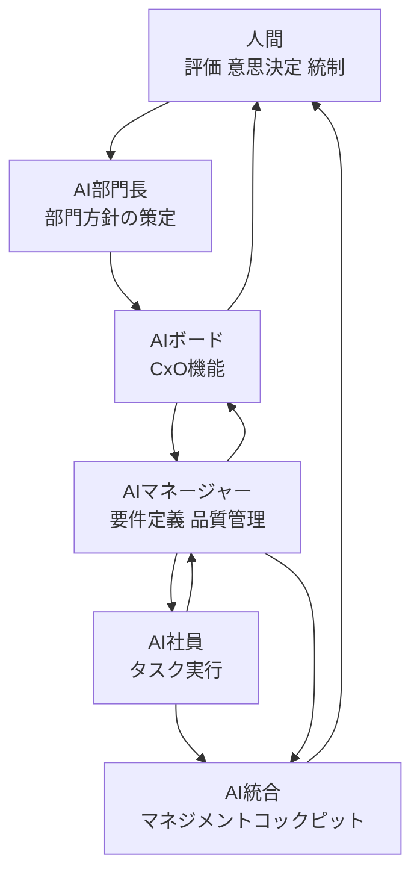

## この記事で扱うこと

NECは2026年8月1日付で「コーポレートAI・Workforce部門」を新設したと発表しました（発表は2026年8月10日報道）。特徴は、部門長から一般社員まで**すべての役割をAIが担い、人間は評価・意思決定・統制だけを受け持つ**という役割分担にあります。

この記事では、次の3点を扱います。

- この組織が**どういう構造**で動くのか（4階層とその責務）
- 「人間は統制に専念する」という設計が、**どこで壊れやすい**のか
- 自社で同じ構造を試すときに、**何を先に決めておくべきか**

対象読者は、AIエージェントを「道具」ではなく「組織の構成要素」として置くかどうかを判断する立場の方です。実装の細部より、責任と検証の置き場所を決めたい方に向けています。

:::message
本記事の事実関係は報道ベースの二次情報に基づきます。数値（後述の「業務時間7分の1」など）は要再検証として扱い、断定を避けています。
:::


*この記事の全体像。以下、順に解説します。*

## 何が新しいのか：ツールではなく「部門」として置いた

生成AIの導入は、多くの場合「既存の人間の業務を補助するツール」として設計されます。今回の構造が異なるのは、AIを**組織の構成員かつ管理者**として位置づけた点です。

| | 一般的なAI導入 | 今回の構造 |
|---|---|---|
| AIの位置 | 個人の業務補助 | 組織の構成員・管理者 |
| 実行主体 | 人間（AIが支援） | AI |
| 人間の役割 | 実行＋判断 | 評価・意思決定・統制のみ |
| 管理単位 | 個人／チーム | 部門 |

NECはこれを自社で先に運用する「クライアントゼロ」の実証と位置づけています。つまり、外販前に自社の業務で構造の耐久性を試す設計です。

## 構造：4階層とタスクの流れ

組織は4階層で構成されます。



各階層の責務は次のとおりです。

| 階層 | 責務 |
|---|---|
| AI部門長 | 部門としての方針決定 |
| AIボード | CxO相当の機能。案件の評価・承認 |
| AIマネージャー | 社内ニーズの要件化、AI社員の生成と任命、品質・コスト管理 |
| AI社員 | 個別タスクの実行 |

### 動的に「社員」が生成される

注目すべきは、AI社員が**固定の常設リソースではない**ことです。社内ニーズが発生すると、AIマネージャーがその都度AI社員を生成し、パーパスや社内規定をオンボーディングしたうえで役割を任命します。

人間の組織で言えば、案件ごとに採用・研修・配属を行い、終われば解散する運用に相当します。ここが「AIエージェントを何体か常駐させる」構成との決定的な違いです。人員計画ではなく、**生成ポリシーとオンボーディング内容が設計対象**になります。

### 可視化の器：マネジメントコックピット

デジタルツイン上に構築された「AI統合マネジメントコックピット」を通じて、全AIの稼働状況と活動がリアルタイムに可視化されます。人間が実行から外れる以上、**見えていない稼働は統制できない**ため、この可視化層は付随機能ではなく前提条件にあたります。

## 実証で出た成果と、その読み方

2026年7月の1か月間、役員会議向けの経営分析やシミュレーションで運用され、業務時間が約7分の1に短縮されたとされています［二次情報、要再検証］。

この数字を自社に当てはめる前に、次の切り分けが必要です。

- **削減されたのは何の時間か**：主に資料の骨子作成やドラフト生成の時間です。ゼロから書き起こす工程は確かに圧縮されます。
- **削減されていない時間は何か**：AIが提示したリスク根拠やハルシネーションの有無を人間が確認する**検証時間（Verification Cost）**です。

したがって、End-to-Endのサイクルタイムは次の形で決まります。

```
E2E時間 = 生成時間（大幅に短縮） + 検証時間（変わらない、または増える）
```

役員会議向けという条件は、入力データが比較的整っている状況を意味します。本番のノイズが多い非構造化データ環境では検証工数が膨らみ、**生成が速くなっても全体は速くならない**可能性があります。「7分の1」を横展開の前提に置かず、自社の検証工数を実測してから判断するのが安全です。

## この設計が壊れやすい2つの地点

AIがAIを管理し、AI同士が評価し合う（LLM-as-a-Judge）構造には、階層構造に固有の弱点があります。

### 1. 誤差の連鎖的拡大と目標漂流

上流のAIマネージャーが要件定義の段階で微細な誤認を起こすと、下流のAI社員はそれを「与えられた真実」として受け取ります。人間の組織なら「その前提はおかしい」と差し戻す動きが起きますが、指示への追従性が高いAIでは起きにくくなります。

結果として、階層が深いほど誤差は連鎖的に拡大します。各AI社員は与えられたタスクを高い精度でこなしているのに、**部門全体としては当初の目的からずれていく**（目標漂流）という失敗の形です。個々の出力品質を測っても検出できない点が厄介です。

### 2. 合意形成型ハルシネーション

AI社員の出力をAIマネージャーやAIボードが評価する構造では、LLM特有の**前段の出力に同調しやすい傾向（Sycophancy）**が働きます。

誤ったデータや論理の飛躍があっても、評価側が高評価を返し、それが承認として上位に積み上がります。多層レビューは通常「品質保証」として設計されますが、レビュアーが同じ弱点を共有している場合、**層を重ねるほど誤りが「合意」として固定化される**方向に働きます。レビュー階層の数は、この構造では安心材料になりません。

## 統制のパラドックス：人間は本当に統制できるか

「人間は統制と意思決定に専念する」という整理は、責任の所在としては明快です。しかし実務では次のパラドックスが生じます。

### 形式的承認（ラバースタンプ）のリスク

4階層のAI組織は、人間より速く・大量に、緻密なシミュレーションを生成します。人間がそのすべてを一次ソースまで遡って検証することは現実的に困難です。

結果として、人間がAIの結論を実質的に追認するだけの承認者になった場合、会社法上の**善管注意義務違反・任務懈怠**を問われる余地が生じます。「統制していた」という形式と、「統制できていた」という実質のあいだに乖離が生まれます。

### ブラックボックス問題

AI同士の非連続的・確率的なプロンプトのやり取りを経た意思決定は、株主や監査役に対して決定論的な説明を提供できません。「なぜその結論になったのか」を再現可能な形で示せない状態です。

これはEU AI Actなどが求める**意味のある人間の関与（Meaningful Human Oversight）**の要件に抵触するおそれがあります。人間が承認ボタンを押した事実だけでは、関与の実質を示す証拠になりません。

つまり、人間を統制に限定する設計は、**統制が実質を伴う仕組みとセットでなければ、責任だけが人間に残る**構造になり得ます。

## 自社で試すなら、先に決める3つのこと

構造そのものは強力です。AIを「部下」ではなく「部門」として扱えば、タスク単位ではなく機能単位で任せられます。そのうえで、責任設計として次の3点を先に決めることを推奨します。

### 1. Human-in-the-Loopを「置く場所」を決める

すべてを人間が見ることはできません。だからこそ、どこに監査ゲートを置くかを事前に固定します。

- 手戻りコストが大きい分岐点（方針決定・外部公表・契約に関わる判断）
- 最終的なリスク評価

AIボードの決議を無条件に受け入れず、上記の点では専門知識を持つ人間が介在する設計にします。判断基準は「重要そうかどうか」ではなく、**間違えたときの取り返しのつかなさ**で選ぶと運用が安定します。

### 2. 決定論的な検証機構を評価パイプラインに組み込む

LLMによる相互評価だけに依存しないことが要点です。同調バイアスは、同種の評価者を増やしても解消しません。

- 静的解析ツールによる形式チェック
- 外部データベースとの照合による事実確認
- 数値・計算の再計算による突合

これらは確率的な評価と異なり、同じ入力に同じ結果を返します。**AIの合意で崩せない層**を1つ入れることが、合意形成型ハルシネーションへの直接的な対策になります。

### 3. 人間の理由づけをログとして残す

AIの提案を採用または却下した際の**理由（Human Reasoning Log）**を記録します。

| 記録する項目 | 何を防ぐか |
|---|---|
| 採否の判断 | 承認の事実そのものが不明になること |
| 判断の理由 | 形式的承認との区別がつかなくなること |
| 参照した根拠 | 説明可能性の欠如 |

これは監査対応のための事務作業ではありません。**「意味のある人間の関与」が実在したことを示せる唯一の証跡**であり、ブラックボックス化と法的責任の両方に効きます。逆に言えば、この記録が書けないような判断は、その時点で統制が成立していない兆候と読めます。

## まとめ

- NECは全役割をAIが担う「コーポレートAI・Workforce部門」を新設し、人間を評価・意思決定・統制に限定しました。構造は4階層（AI部門長／AIボード／AIマネージャー／AI社員）で、AI社員は都度生成されます。
- 「業務時間7分の1」［二次情報、要再検証］は生成工程の短縮であり、検証時間は残ります。E2Eの短縮を約束する数字として扱わないほうが安全です。
- 弱点は2つ。上流の誤認が下流へ連鎖する**目標漂流**と、AI同士が同調して誤りを固定化する**合意形成型ハルシネーション**です。レビュー階層を増やしても解消しません。
- 人間を統制に限定する設計は、統制の実質を担保する仕組みがなければ、**責任だけが人間に残る**構造になり得ます。
- 自社で試すなら、①監査ゲートの配置、②決定論的検証の併用、③人間の理由づけログ、の3点を先に決めます。

AIをどこまで組織の内側に入れるかは、技術の成熟度ではなく、**検証と責任をどこに置けるか**で決まります。今回の事例は、その問いを実物で示した点に価値があります。

この記事が少しでも参考になった、あるいは改善点などがあれば、ぜひリアクションやコメント、SNSでのシェアをいただけると励みになります！

## 参考リンク

- [NEC、部門長から一般社員まで全ての役割をAIが担う組織を新設（ITmedia AI+）](https://www.itmedia.co.jp/aiplus/article/2608/10/2000000484/)
- EU AI Act（Meaningful Human Oversight の要件に関する参照枠組み）
