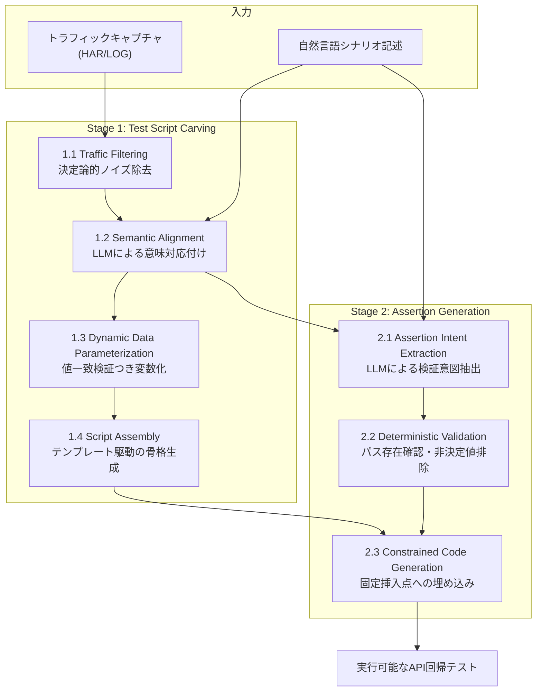

ドキュメントが古い、あるいは存在しないシステムに、回帰テストを後付けしたい。モダナイゼーションの現場でほぼ必ず出てくる要求です。仕様書がないので、テストの正解を誰も書けません。

この状況に対して、ByteDance の実践報告 [Industrial Practice of LLM-Based Test Case Carving and Assertion Generation (arXiv:2607.24000)](https://arxiv.org/abs/2607.24000) は、割り切った答えを出しています。**実際に流れている通信ログを「現行仕様の証拠」として扱い、そこからテストを彫り出す**。手法の名前は NL2Test です。

9 ヶ月の本番運用で 3,196 件のテストを生成し、そのうち 2,730 件がエンジニアのレビューを通ってテストスイートへ取り込まれました。採用率 85.4% です。

この記事では、その数字を支えている設計原則と、自分の現場へ持ち帰るときの前提条件を整理します。

## なぜ「LLM にテストを書かせる」だけでは足りないのか

通信ログを LLM に投げてテストコードを書かせる、という発想自体は難しくありません。難しいのは、それが**実行し続けられるテスト**になるかどうかです。

素朴な生成には、少なくとも 3 つの壊れ方があります。

| 壊れ方 | 具体例 | 結果 |
|---|---|---|
| ノイズ混入 | JS/CSS/画像取得、OPTIONS、ポーリングまでテスト化 | 本質的な業務 API が埋もれる |
| 値のハードコード | 記録時の注文 ID・トークンをそのまま埋め込む | 次の実行で 404 になる |
| 非決定値のアサーション | `updated_at` やトレース ID を期待値にする | 実行のたびに落ちる (Flaky) |

いずれも「意味を理解する」能力の不足ではなく、「機械的に検証すればわかること」を検証していないことが原因です。LLM は 3 つ目のような一見重要そうなフィールドを、むしろ積極的に拾ってきます。

NL2Test の中心的な判断は、ここにあります。**意味解釈だけを LLM に任せ、それ以外は決定論的アルゴリズムで固める**。論文はこの構造をハイブリッドなガードレールとして設計しています。

## パイプラインの全体像

処理は 2 ステージ、7 コンポーネントで構成されます。



Stage 1 が「どの通信を、どういう順で、どう変数化して再実行するか」を決め、Stage 2 が「何をもって成功と判定するか」を決めます。

役割分担を、担当主体の観点で並べ直すと構造が見えます。

| コンポーネント | 主体 | やること |
|---|---|---|
| 1.1 Traffic Filtering | 決定論的 | 静的リソース・OPTIONS・ポーリングを除去 |
| 1.2 Semantic Alignment | LLM | シナリオの各ステップに対応する API 通信を特定 |
| 1.3 Dynamic Data Parameterization | LLM + 決定論的検証 | ID・トークンを前段レスポンス由来の変数へ変換 |
| 1.4 Script Assembly | 決定論的 | 確定した順序からテスト骨格を合成 |
| 2.1 Assertion Intent Extraction | LLM | 検証意図を構造化候補として抽出 |
| 2.2 Assertion Validation | 決定論的 | パス存在確認と非決定値の排除 |
| 2.3 Constrained Code Generation | LLM | 検証済みアサーションを固定挿入点にコード化 |

LLM が登場するのは 4 箇所ですが、そのすべてが**決定論的処理に挟まれている**点が重要です。1.2 の前にはフィルタが、1.3 と 2.1 の後には検証が置かれています。2.3 も自由なコード生成ではなく、骨格の決められた挿入ポイントにだけ書き込む制約付きです。

LLM の出力が誤っても、次の決定論的ステップで落ちる。この配置が採用率を支えています。

## 再実行性はどう確保されるのか

回帰テストとして最も効くのは、Stage 1.3 の Dynamic Data Parameterization です。

記録された通信には、その瞬間だけ有効な値が大量に含まれます。注文 ID、セッショントークン、生成されたリソースの URI。これをそのまま書き写したテストは、記録した環境でしか動きません。

NL2Test は、リクエストに現れる値が**前段のレスポンスのどこかに存在するか**を機械的に照合し、見つかればその参照へ置き換えます。

```
# 素朴な生成 (記録時の値をハードコード)
POST /api/v1/orders/8f3c2a91-.../confirm

# パラメータ化後 (前段レスポンス由来の参照)
order_id = resp_create_order.json()["data"]["order_id"]
POST /api/v1/orders/{order_id}/confirm
```

LLM は「この値は動的リソースの識別子らしい」という意味的な当たりをつけるだけで、**採否は値一致の照合が決めます**。照合が通らなければパラメータ化されません。意味解釈の誤りが、そのままテストの破綻にはつながらない構造です。

## 効果はどこまで検証されているか

論文はオフライン評価と本番運用の 2 面から報告しています。

**オフライン評価 (51 シナリオ、ByteDance 内部 5 プロダクトライン)**

| 指標 | 結果 |
|---|---|
| Exact Match (完全一致) | 82.4% (42/51) |
| Functionally Usable Draft (手修正で利用可能) | 98.0% (50/51) |

ノイズ除去の効きを示す例として、あるシナリオでは 300 件を超える生リクエストから、本質的な業務 API 2 件が抽出されています。

**本番運用 (2025 年 3 月〜11 月、9 ヶ月)**

| 指標 | 結果 |
|---|---|
| 生成テストケース数 | 3,196 件 |
| エンジニアが採用 (マージ) | 2,730 件 |
| 採用率 | 85.4% |

読み方に注意が必要なのは、これが**経験報告 (Experience Paper)** である点です。単一企業の環境で、既にトラフィック収集基盤とテストスイートが整っている前提での数字です。他社環境で同じ採用率が出る保証はありません。

それでも意味があるのは、「完全一致 82.4%」と「手修正で使える 98.0%」の差です。この差は、**人間がレビューして直す前提の下書き生成として設計されている**ことを示しています。全自動を目指した数字ではありません。

## 自分の現場へ持ち込むときの前提条件

実トラフィックを入力にする以上、論文の枠外で自前に用意すべきものがあります。3 つあります。

### 1. PII とクレデンシャルの除去

生の HAR には、認証ヘッダー、Cookie、顧客の氏名・電話番号・決済情報が不可避的に含まれます。これを LLM へそのまま投入するのは、情報漏洩の経路をひとつ増やす行為です。

対策は、LLM に渡す前段にサニタイズ層を置くことです。

- 認証トークン・Cookie は、ヘッダー名指定と正規表現の確定ルールでマスクする
- レスポンスボディ内の個人情報は、フィールド単位で置換する
- 置換は**一貫したダミー値**へのエンコーディングにする

3 つ目が地味に重要です。同じ値をリクエストとレスポンスで別のダミーに置き換えてしまうと、1.3 の値一致検証が成立せず、パラメータ化がすべて失敗します。サニタイズと再実行性は、この一点で結合しています。

### 2. 非決定値の除外ルール

論文では 2.2 の決定論的検証がこれを担いますが、どのキーを非決定とみなすかは環境依存です。最低限、次のパターンは強制除外の候補になります。

```
timestamp, *_at, *time, duration,
trace_id, span_id, request_id, *_uuid
```

より確実なのは、**同じシナリオを複数回記録して差分を取る**方法です。実行ごとに変わるフィールドが決定論的に特定できるので、キー名の命名規則に依存せずに済みます。命名が統一されていないレガシー環境ほど、この差分比較が効きます。

### 3. 異常系トラフィックの確保

これが最も構造的な限界です。本番トラフィックの大半は正常系です。在庫切れ、限度額超過、二重決済防止、認可エラーといった業務例外は、そもそも記録に現れる頻度が低い。

正常系だけから生成したテストスイートは、リグレッション検知の網としては粗くなります。モダナイゼーションで壊れやすいのは、むしろ例外分岐の側です。

打ち手は 2 つあります。

- フォールトインジェクションやカオスエンジニアリングの環境で、意図的に例外トラフィックを発生させて捕獲する
- 自然言語シナリオ側に「在庫がない場合は 400 が返ること」と条件を明示し、対応する異常系通信とアライメントさせる

いずれも「生成手法の改善」ではなく「入力の質の確保」です。NL2Test が有効に働く範囲は、記録できたトラフィックの範囲を超えません。

## モダナイゼーションへの接続

この手法の価値は、テスト自動生成そのものよりも、**現行仕様を機械可読な形で固定できる**ことにあります。

段階的に組むなら、次の順序が現実的です。

1. **フィルタとサニタイザを先に作る** — 静的リソース・ヘルスチェックの除去と PII マスクを、生成パイプラインより先に完成させる
2. **主要業務フローのトラフィックを捕獲する** — E2E 操作時の通信ログを自動保存する環境を整える
3. **ハイブリッド生成を導入する** — 意味アライメントは LLM、値一致と存在確認は決定論的処理に任せる
4. **テストから仕様へ逆展開する** — 採用されたテストとアサーションを、OpenAPI 仕様や業務フロー図として還元する

判断支援者として言えば、**投資の重心は 1 と 2 にあります**。3 の生成部分は論文の構造をなぞれば済みますが、1 と 2 が欠けていると、生成物の品質は入力のノイズと欠落にそのまま引きずられます。採用率 85.4% という数字は、ByteDance がその土台を既に持っていた上での結果です。

そして 4 まで到達すると、目的が変わります。テストは回帰検知のためだけでなく、**誰も書けなかった仕様書の代替**になります。ドキュメントのないシステムを刷新するとき、「現行と同じ振る舞いをする」という要件を検証可能な形で持てることの価値は、テスト工数の削減より大きいはずです。

## まとめ

- NL2Test は、実トラフィックと自然言語シナリオから API 回帰テストを生成する手法。ByteDance の 9 ヶ月運用で 3,196 件を生成し、採用率 85.4% を報告している
- 設計の核は、意味解釈を LLM に、ノイズ除去・値一致検証・非決定値排除を決定論的アルゴリズムに割り当てた役割分担。LLM の出力は必ず決定論的ステップに挟まれる
- 再実行性はハードコード値の変数化で確保される。LLM は候補を出すだけで、採否は前段レスポンスとの値一致照合が決める
- 経験報告であり、単一企業・整備済み環境での数字。他社環境への一般化は保証されていない
- 自前で用意すべき前提は 3 つ。PII サニタイズ (一貫したダミー値化)、非決定値の除外ルール (複数回記録の差分比較が確実)、異常系トラフィックの意図的な確保
- モダナイゼーション文脈での本命は、テストから現行仕様を逆展開できること

この記事が少しでも参考になった、あるいは改善点などがあれば、ぜひリアクションやコメント、SNSでのシェアをいただけると励みになります！

## 参考リンク

- [Industrial Practice of LLM-Based Test Case Carving and Assertion Generation (Experience Paper) — arXiv:2607.24000](https://arxiv.org/abs/2607.24000)
