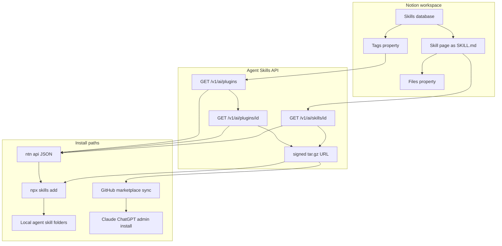

2026年9月17日、Vercelは `skills` CLI 1.7.0 で Notion をスキルのインストール元に追加した、と changelog で発表しました。Notion ページとして書いた手順を、Agent Skills 標準のフォルダ（`SKILL.md` と添付ファイル）として取り出し、CLI が対応するローカルエージェントへ入れます。裏側は Notion の Agent Skills API です。gzipped tar の一時 URL を返します。Git リポジトリは必須ではありません。

本記事の中核は Vercel changelog、Notion 開発者ドキュメント、Help Center、`vercel-labs/skills` のソースです。顧客コメントは公式ブログ掲載の自己申告です。

この記事を読み終えると、次の3つが手元で判断できます。

- Notion 上のスキルが、どの経路で標準フォルダになるか
- CLI 直接インストールと GitHub marketplace 同期の違い
- 編集面と配布ゲートをどこで分けるか

対象読者は、社内で Agent Skills の作成・配布経路を決める立場の方です。


*この記事の全体像。以下、順に解説します。*

## Notion上のAgent Skills配布とは

「Notion スキル」は、次の3層に分かれます。

| 層 | 何をするか | 一次の置き場 |
|---|---|---|
| 実行 | Notion Agent 上でスキルを動かす | Help Center の製品スキル |
| エクスポート | ページを標準フォルダへ取り出す | Agent Skills API |
| 配布 | CLI や GitHub 経由でエージェントへ入れる | `skills` CLI / GitHub 同期サンプル |

今回の発表の起点は3層目の CLI です。同日、Notion は Skills API をブログで出しました。開発者ガイドは、skills を [agentskills.io](https://agentskills.io/home) のディレクトリ、packs を [agent-plugins.org](https://agent-plugins.org) の plugin として返す、と書いています。製品側のスキル（Library、スキル DB、ローカルエージェントへのダウンロード）は Help Center が別文書です。Help は API のエンドポイントを書いていません。

### 何ができるか

- インストール: `npx skills add notion`（共有された skill pack を選び、選んだ pack の全スキルを入れる）と `npx skills add <NOTION_PAGE_URL>`（単一ページ）
- 認証: Notion CLI `ntn`。changelog は `ntn login` とワークスペースの PAT 許可を前提にします
- ストレージ: スキル本体は Notion ページ（=`SKILL.md`）。補助ファイルはスキル DB の Files プロパティ
- API: `GET /v1/ai/plugins`、`GET /v1/ai/plugins/{id}`、`GET /v1/ai/skills/{id}`。ヘッダ `Notion-Version: 2026-03-11` が必須です
- 配布単位: スキル DB の Tags のユニーク値が plugin になります。未タグのスキルは 1 スキル = 1 plugin です
- 成果物: 標準準拠のディレクトリ。plugin は `plugin.json` + `skills/`。単一 skill アーカイブはトップレベル 1 ディレクトリ + `SKILL.md`（`plugin.json` なし）
- 版識別: 各 plugin / skill に opaque な `version_id`（長さ 64）。値が同じなら再ダウンロードをスキップできます
- 公式の別経路: `makenotion/notion-skills-github-sync` が Notion → GitHub plugin marketplace へ定期同期するサンプルを提供します
- CLI 対応エージェント: README 時点で 70 超。プロジェクト既定は `./<agent>/skills/`、グローバルは `~/<agent>/skills/` です

### 標準フォルダの中身

ページ本文は `SKILL.md` になります。Files プロパティは同梱ファイル / フォルダになります。

Get skill は `plugin.json` も `skills/` ラッパも付けません。Get plugin は plugin 標準のディレクトリです。現状は skills のみです。公式は「将来 MCP resources / extensions を含みうる」と書いています。

同期サンプルは、ネストした `scripts/` が必要なら Files の zip を展開します。`SKILL.md` は常に Notion 側から来ます。

### 概念構造

Notion ワークスペース、Agent Skills API、インストール経路の関係は次のとおりです。



処理の流れは次のとおりです。

1. スキル DB の行がスキルになります。Tags が pack（plugin）名になります。
2. API が標準フォルダの tar.gz を一時 URL で返します。
3. CLI は `ntn api` で JSON（`id` / `version_id` / `url`）を取ります。署名 URL の tar.gz は CLI 自身がダウンロードします。展開したフォルダを、検出したエージェントの skills ディレクトリへ入れます。
4. 別経路として、同じ API を GitHub へ同期し、エージェントアプリの管理インストールへ渡せます。

### 認証の形

Skills API は connection トークンまたは PAT を受け付けます。必須 capability は **Read content** です。接続に共有されていないスキルは list から省略されます。エラーにはなりません。

PAT は作成者のページ権限で動きます。bot への「Add connections」は不要です。PAT ガイドは、製品を多ユーザーに配る用途には PAT を使うな、と書いています。チーム所有の自動化で一人の権限に依存させたくないなら internal connection を使え、とも書いています。

PAT 作成の既定はプランで違います。

| プラン | 既定 | 変更 |
|---|---|---|
| Free | owners only | 不可 |
| Plus | 全メンバー | 不可 |
| Business | owners only | 切替可 |
| Enterprise | owners + 選択グループ | 3 択 |

Guest / restricted member は PAT も `ntn login` も使えません。期限は 7 / 30 / 90 / 180 日 / 1 年です。未指定は 1 年です。期限切れは `unauthorized` です。

ntn 公式はブラウザ認可が主経路です。トークンは OS keychain（service `notion-cli`）に入ります。無人ジョブは `NOTION_API_TOKEN` です。keychain より優先されます。

changelog は `ntn login` に PAT が必要と書きます。ntn 公式はブラウザ認可が主経路で、PAT は `NOTION_API_TOKEN` です。

### API の呼び方

ベース URL は `https://api.notion.com` です。Bearer と `Notion-Version: 2026-03-11` が必須です。Skills API が受け付けるバージョンは、この値だけです。

```bash
curl -X GET "https://api.notion.com/v1/ai/plugins?page_size=100" \
  -H "Authorization: Bearer $NOTION_API_KEY" \
  -H "Notion-Version: 2026-03-11"
```

```bash
curl -X GET "https://api.notion.com/v1/ai/plugins/$PLUGIN_ID" \
  -H "Authorization: Bearer $NOTION_API_KEY" \
  -H "Notion-Version: 2026-03-11"
```

Get skill の公式 curl 例は未掲載です。Get skill ページの一次サンプルは TypeScript SDK です。同一ヘッダ規約からの対応形は次です。公式サンプルではありません。

```bash
curl -X GET "https://api.notion.com/v1/ai/skills/$SKILL_PAGE_ID" \
  -H "Authorization: Bearer $NOTION_API_KEY" \
  -H "Notion-Version: 2026-03-11"
```

`id` は skill ページの Notion page ID です。

skills CLI が実際に叩く形は `ntn api` です。`Authorization` と `Notion-Version` は ntn が付けます。

```text
ntn api /v1/ai/plugins page_size==100 --notion-version 2026-03-11
ntn api /v1/ai/plugins/{id} --notion-version 2026-03-11
ntn api /v1/ai/skills/{pageId} --notion-version 2026-03-11
```

list の `page_size` は最大 100 です。plugin 内スキルも最大 100 です。超過時は最近更新されたものだけが入ります。公式は打ち切り時の HTTP エラーコードを書いていません。

接続あたりのレートは Business / Enterprise が 600 req/min、その他が 180 req/min です。ワークスペース共有レートは全 connection で共有します。数値は非公開です。接続が予算内でも 429 になりえます。429 は `rate_limited`、529 は `service_overload` です。Retry-After を使います。

署名 URL は一時です。MCP は 1 時間と書いています。REST サンプルは `X-Amz-Expires=3600` です。REST Get plugin/skill の本文は 1 時間と書いていません。

CLI 展開ガードは `src/notion-test.ts` に定数があります。50 MiB DL / 100 MiB extract / 5000 files / ntn 30s / ntn stdout+stderr 10 MiB です。README の汎用 DL 上限（10 MiB 等）とは別定数です。

Public API の SLA % と Skills API の料金は公式未掲載です。MCP download は「Skills API が有効」が必要です。`notion-download-skill` は workspace-owned connection では使えません。

## 注意点

発表文面と実装・製品モデルのあいだに、取り違えやすい境界があります。

- 「No Git repository required」は **ローカル CLI インストール** の話です。Notion 公式ブログは、Claude / ChatGPT の `/` メニューと **admin installation controls** のために GitHub marketplace 同期を残しています。
- 「Access follows Notion's page permissions … controlling who can install a skill is the same as controlling who can view the page」は **Vercel changelog の CLI 説明**です。Help Center は、アクセスと `Enable for me` を分けています。編集権限があれば共有スキルは全員分変わります。
- changelog は `ntn login` に PAT が必要と書きます。ntn 公式はブラウザ認可が主経路で、PAT は `NOTION_API_TOKEN`（無人・CI）です。Guest / restricted member はどちらも使えません。ワークスペースの PAT 作成ポリシーが CLI 経路を止めます。
- `version_id` は差分同期用の opaque 比較値です。セマンティックバージョンでも署名でもありません。
- tar.gz の `X-Amz-Signature` は **ダウンロード URL の時限アクセス**です。アーカイブ内容の publisher 署名ではありません。Agent Skills 仕様の frontmatter に signature フィールドはありません。[RFC #247](https://github.com/agentskills/agentskills/issues/247) は 2026-03-16 に closed（completed）です。仕様本文には未反映です。
- plugin は最大 100 スキルです。超過時は最近更新されたものだけが入ります。公式は打ち切り時の HTTP エラーコードを書いていません。
- GitHub star 約 3.2 万は **2026-09-19 取得の変動値**です（`gh repo view` 整数 31967）。npm 週間ダウンロードはソース間で値がずれます。本文には整数を書きません。
- Pearmill / Candidly / Brainlabs の引用は公式ブログ上の顧客コメントです。
- 公開スキルレジストリ（ClawHub 等）の悪意スキル件数は Notion 公式ではありません。同一フォルダ形式が手順書＋スクリプトの配送路になりうる、という一般リスクの傍証に留めます。
- 日本語の API / CLI 1.7.0 一次ドキュメントは、執筆時点では確認できませんでした。製品スキルの日本語ヘルプはあります。

未解決の問いは次です。採用判断をブロックしません。ゲート設計を Notion 共有だけにしない理由になります。

- Skills API の有効化手順、対象プラン、料金
- REST Get plugin/skill の URL 期限を本文が 1 時間と書いていない（MCP とサンプル 3600 秒に依存）
- `npx skills update` が Notion `version_id` を追うか（README に記載なし。未検証）
- changelog の「PAT 必須」と ntn ブラウザ login の、実失敗モード
- レジデンシー設定時の S3 ホスト
- 日本語の開発者向け一次（発表 2 日後時点では未確認）

README の Source Formats から Notion が欠落しています（1.7.0 時点）。ローカルへ落としたコピーはバッジ通知またはスナップショットです。自動追従ではありません。仕様は permission / sandbox を対象外にします。

## CLI直接とGitHub同期のどちらを使うか

配布経路は3つあります。編集面と承認ゲートが違います。

| 基準 | Notion → skills CLI 直接 | Notion → GitHub marketplace 同期 | Git 正本のみ |
|---|---|---|---|
| 非エンジニアの編集 | Notion ページ | Notion で編集し GitHub へ出る | 低い |
| 承認ゲート | ページ共有と PAT。publish フラグ無し | GitHub の review / admin install | PR / CODEOWNERS |
| 版の固定 | インストール時点のスナップショット。`version_id` は取得時チェック | git SHA + marketplace | git SHA |
| ロールバック | page history（ブロック）。ローカルは再ダウンロード | git revert | git revert |
| コンテンツ署名 | URL 時限署名のみ | git 署名タグを自前で足せる | 同上 |
| Claude/ChatGPT 管理インストール | 対象外（ローカル CLI） | 公式がこの経路を示す | 可能 |
| `--yes` 事故面 | 非 TTY で全 pack | ワークフロー次第 | リポ範囲 |

最適条件は次です。

- CLI 直接: 少人数、編集者=利用者、ローカルコーディングエージェントだけ、下書き DB を PAT から隔離できる
- GitHub 同期: 業務部門が Notion で書き、実行環境へ出す前にレビューしたい。Claude/ChatGPT の管理インストールが要る
- Git 正本: すでにエンジニアがスキルを git 管理しており、非エンジニア編集が不要

同期サンプルの `.env.example` は、読めることが publish 制御である、と書きます。スキル単位の publish フラグはありません。

現在の主要な結論は次です。Notion は「経験者の手順を非エンジニアが直せる編集面」として使えます。実行環境へ出す統治（承認済み版、差分レビュー、署名、導入先の版追跡）は、閲覧権限だけでは足りません。

支持になる事実は次です。

- ページと DB でスキルを書く、という製品モデル（Help）
- API が標準フォルダを返すため、CLI は Notion 固有ブロックを解釈しない（ブログ + CLI 実装）
- `version_id` による変更検知のフックがある
- 公式が GitHub sync サンプルを出している（統治を足す余地がある、という支持でもある）

足りない点は次です。

- 閲覧と Enable、閲覧と PAT 発行資格は一致しない
- 編集 1 人で全員の手順と scripts が変わる
- 100 スキル打ち切り、`--yes` / 非 TTY の全 pack インストール
- README の Source Formats から Notion が欠落（1.7.0 時点）
- ローカルはバッジ通知またはスナップショット。自動追従ではない
- MCP `notion-download-skill` は workspace-owned connection では使えない
- 仕様は permission / sandbox を対象外にする

「Git を使わず配れる」は事実です。「Git なしで統治が足りる」は公式自身の GitHub 推奨と権限モデルに反します。

## 導入時にどこへゲートを置くか

編集は Notion、配布は承認済みスナップショット（GitHub marketplace またはそれと同等のゲート）に分けます。CLI の `npx skills add notion` は、下書き DB が見える PAT で本番エージェントへ直結しません。

直近で置く具体は次です。

1. スキル DB を少なくとも 2 つに分けます（下書き / 配布）。配布 DB だけを connection または専用 PAT に共有します。
2. Tags を pack 名として設計します。1 タグ 100 スキルを超えないようにします。未タグは独立 pack になります。
3. Claude/ChatGPT へ出すなら公式サンプルの GitHub 同期を使い、admin install を残します。
4. ローカル CLI は pack 名を `--skill` で指定します。CI で `add notion -y` を使いません。
5. 導入先に `version_id` と取得日時を残します。Notion 更新後は再インストールを運用ルールにします。
6. PAT は無人ジョブ専用にします。人間の対話インストールは `ntn login` です。Guest には CLI を期待しません。
7. Files の scripts / zip は、Git で見るのと同じレビュー対象にします。

逆転条件は次です。いまのままでは満たしません。

- Notion がスキル単位の publish と署名付き成果物を API で出す
- CLI が `version_id` ピンと pack 内スキル選択と自動更新ポリシーを提供する
- 対象がローカル個人利用のみで、共有編集者がいない

## まとめ

Vercel `skills` CLI 1.7.0 は、Notion のスキル DB を Agent Skills 標準フォルダのインストール元にしました。ページ本文が `SKILL.md`、Files が添付、Tags が pack 名です。API は gzipped tar の一時 URL を返します。CLI はそれをローカルエージェントの skills ディレクトリへ入れます。

Git なしで配れるのはローカル CLI までです。Claude / ChatGPT の管理インストールは公式が GitHub marketplace 同期を残しています。閲覧権限はインストール権限と一致しません。編集 1 人で全員の手順と scripts が変わります。`version_id` は opaque な比較値であり、署名でもセマンティックバージョンでもありません。

設計の分かれ目は、編集面と配布ゲートを分けることです。下書き DB を本番 PAT から隔離し、配布は承認済みスナップショットへ出す。これが、公式資料と CLI 実装から読み取れる運用の床です。

この記事が少しでも参考になった、あるいは改善点などがあれば、ぜひリアクションやコメント、SNSでのシェアをいただけると励みになります！

## 参考リンク

- [The skills CLI now supports Notion hosted skills](https://vercel.com/changelog/skills-cli-notion-skills)
- [A skills library for every agent](https://www.notion.com/blog/a-skills-library-for-every-agent)
- [Agent Skills API overview](https://developers.notion.com/guides/agent-skills/overview)
- [List plugins](https://developers.notion.com/reference/agent-skills/list-skills-plugins)
- [Get plugin directory](https://developers.notion.com/reference/agent-skills/get-plugin-directory)
- [Get skill directory](https://developers.notion.com/reference/agent-skills/get-skill-directory)
- [Request limits](https://developers.notion.com/reference/request-limits)
- [Personal access tokens](https://developers.notion.com/guides/get-started/personal-access-tokens)
- [Notion CLI authentication](https://developers.notion.com/cli/get-started/authentication)
- [Notion skills in MCP](https://developers.notion.com/guides/mcp/notion-skills)
- [Create and manage skills](https://www.notion.com/help/create-and-manage-skills)
- [vercel-labs/skills](https://github.com/vercel-labs/skills)
- [makenotion/notion-skills-github-sync](https://github.com/makenotion/notion-skills-github-sync)
- [Agent Skills specification](https://agentskills.io/specification)
- [npm package skills](https://www.npmjs.com/package/skills)
- [agentskills RFC #247](https://github.com/agentskills/agentskills/issues/247)
