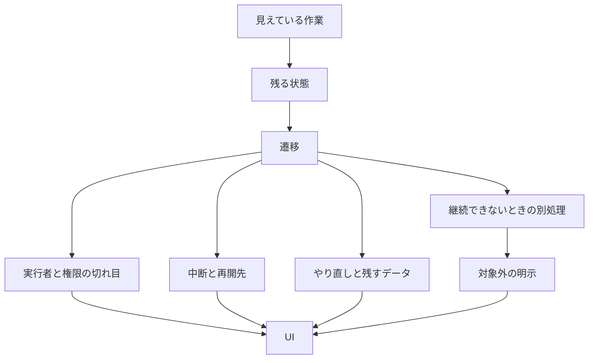

2026年9月27日、きしだなおき氏は、目に見える作業を電子化しても使えるシステムにはならない、と書きました。業務担当者が生成AIで作ったシステムが使い物にならない、という話です。記事が理由として名指しするのは、見えている作業をUIとして電子化することです。件数、業種、使った道具は記事に書かれていません。伝聞として読む範囲で、この記事は見えている作業と、残る状態、遷移、UIの関係を整理し、一つの流れを実装する前に埋める行を示します。

*この記事の全体像。以下、順に解説します。*

## 見えている作業の電子化とは

きしだ氏の記事が扱うのは、担当者が生成AIで組み立てたシステムが、現場で回らないという現象です。記事が並べる対象は、ワークフロー、状態遷移、データ構造、例外、そしてその後に作るUIです。読むよう勧めているのは、羽生章洋氏の三冊です。『はじめよう！要件定義』（技術評論社、紙の発売日2015年2月28日、ISBN 978-4-7741-7228-6、184ページ）、『はじめよう！システム設計』（同、出版社ページの発売日表示は2018年1月25日と1月26日、ISBN 978-4-7741-9539-1、224ページ）、『こんにちは！要件定義①【情報活用とデータベース編】』（同、発売日2025年10月21日、ISBN 978-4-297-15237-6、392ページ）です。

記事は、担当者が知っているものを「業務」と「目の前の作業」に分けています。担当外のこと、手順の理由、手順を変えたときの影響は、作業を回しているだけでは分かりにくい、と書かれています。全体のワークフロー、状態遷移、データ構造が無いと、見える作業のUIを電子化するだけになります。正常な流れを外れると、業務がこなせなくなる、とも書かれています。いまの作業をそのまま写すと、非効率と不確実さも残ります。あるべき姿の実装が要る、とも書かれています。

複数の視点を統合し、欠けている例外を掘り、データフローと状態遷移を整理し、そのためのUIを作る技能を、記事は「システムやさん」の技能と呼んでいます。

『はじめよう！要件定義』の出版社概要は、要件定義を「作ってほしい人と作る人の合意」とし、中身をUI、機能、データとしています。第2部の順は、利用者の行動シナリオ、概念データモデル、UI、機能、データです。第1部の定め方には「何はともあれUI」という節があります。

『こんにちは！要件定義①』の出版社が示す手順は、対象の仕事、必要な情報、データ構造、やり取り、裏方のアクション、保存、正規化、ER図です。目次には「仕事の本質──変換、状態の変化」「状態の遷移」「状態の表現」があります。対象読者には、ITを本業としない職能が含まれます。

IPA『ユーザのための要件定義ガイド 第2版』（2019年12月20日、ISBN 978-4-905318-72-9）の解説では、業務フロー、業務処理定義書、状態遷移図、画面遷移図が、別々の成果物として並びます。

ISO/IEC/IEEE 29148:2018は、業務の unsteady な状態と、システムが使えないときの手動継続を、business operational modes の例にしています。運用シナリオには、通常に加えて、負荷、例外、縮退の変種があり得ると書いています。確認した節は 9.3.13、9.4.13、運用モードと運用シナリオを扱う Annex です。

見えている作業は、状態を変える活動の一時点です。状態が残らない電子化は、画面上の操作の写しになります。遷移には、誰が移すか、止められるか、戻せるか、継続できないときに別の処理へ行くか、が付きます。UIは、その遷移を人が触る面です。

画面の名前は、状態の名前ではありません。「申請画面」は面であり、「申請中」は状態です。ボタンの位置が違っても、遷移と、残るデータと、実行できる人が同じなら、欠落は状態側にはありません。ボタンが無くて遷移できない、途中で閉じるとデータが消える、権限の無い人に操作が出る、差戻し先が無い。これらは状態側の欠落です。

## 注意点

きしだ氏の「話を聞くようになった」は伝聞です。件数、業種、使った道具は記事にありません。「作れるほど業務を知っている人はなかなかいない」についても、母数を示した調査は、公開資料を当たった範囲では見つかりませんでした。この文を比率にしてはいけません。

IPAの2020年講演スライドは、日本情報システム・ユーザー協会「ソフトウェアメトリックス調査2016」を再掲し、プロジェクト数479のうち「要求仕様の決定漏れ」を44.1%（211件）と示しています。百分率は並びで100を超えるので、複数回答と読みます。同じスライドは、要件定義側の括りを55%、プロジェクト管理側の括りを45%と描きます。55%は、単一原因のシェアではありません。図の注記は「調査をもとに加筆」です。55%と45%のラベルだけが加筆なのかは、JUASの原票を開いていないため未確認です。調査年は2016年であり、生成AIで業務担当者が実装した失敗の計測ではありません。44.1%を使うときは、複数回答、要求仕様の決定漏れ、2016年、IPAによる再掲、とセットで書きます。

2015年の本の公開目次に、状態遷移や例外処理という節名はありません。羽生氏の方法を「画面を描くな」と要約すると、公開資料とずれます。技術評論社のセミナー報告（公開日2015年6月25日、開催は本文の2015年6月6日）は、書籍について「要件定義の中核は画面遷移図」であり、画面と画面の間に機能とイベントを書く、と記します。これは報告者の要約です。書籍本文はここでは未読です。2018年の出版社インタビューで羽生氏は、書いたあとに無駄だと感じる画面遷移図と、画面だけでは三点が揃わないことを話しています。無駄だとされたのは、機能とデータを伴わない図の側です。羽生氏の本を引くときは、本文を読んだ箇所だけを使い、セミナー報告の「中核は画面遷移図」を書籍の文として扱いません。

29148:2018は、プロトタイプとストーリーボードを、運用シナリオの情報の一部として使ってよいと書いています。例外などの変種は “In most cases, it may be necessary” です。画面の禁止でも、遷移表が完成するまで実装を禁じる条文でもありません。

市民開発と生成AIの難点を、状態の欠落だけに寄せることも、ここで確認した範囲では過剰です。Sodano, DeFranco, Laplante の IEEE Computer 58巻5号（2025年、101から104ページ、DOI 10.1109/MC.2025.3547073）は、abstract では project governance と security の課題だと書いています。本文は未取得です。状態や、画面の写しには、abstract は触れていません。

画面上の操作を真似る自動化が、常に無駄、でもありません。Wallace, Waizenegger, Doolin の ACIS 2021 論文は、RPAが向く過程を、構造化されたサービス活動のうち、大量で、反復で、仕様が明確で、ばらつきと例外が比較的少ないもの、と書いています。設計し直さないと、既存の非効率や誤りをボットが再生する、とも書いています。この文は Wellmann ほか2020を引いており、そちらの原論文は未読です。事例では、ボットを単純な規則に限り、範囲外は人が処理しています。論文自体は、その過程を「画面作業」とは呼びません。

次の点は、まだ埋まっていません。

- 業務担当者が自分の作業しか知らない、という主張の割合は測られていません。
- 画面の試作を先にしたチームと、遷移表を先にしたチームの業務完了率を比べた試験は、見つかっていません。
- 羽生氏の本文が、画面遷移図をどの定義で中核と呼んでいるかは未読です。
- Sodano らの本文が、機能要求の不完全さにどこまで触れているかは未確認です。
- 規制で手順が固定された業務では、手順の写しが最初の成果物として正しい場合があります。母数つきの成功率は、ここでは取れていません。

## 画面の違いと、状態の欠落

きしだ氏の記事本文に、「画面が違う」と「状態が欠けている」という二語そのものはありません。公開資料に照らすと、この分け方は保てます。混ぜると、ボタン位置の好みと、差戻しが無いことを、同じ欠陥として扱ってしまいます。

| 見え方 | 分類 | 実装を止めるか |
|---|---|---|
| 色、余白、文言、ボタンの位置が想像と違う。遷移、残るデータ、実行できる人は同じ | 画面が違う | 止めない。UIの修正として扱う |
| クリック順の手順書と画面が違う。遷移、残るデータ、実行できる人は同じ | 画面が違う | 止めない |
| その状態から目的の遷移ができない | 状態が欠けている | 止める |
| 途中で閉じると、再開に必要なデータが残らない | 状態が欠けている | 止める |
| 権限の無い人に移行操作が出る。または、責任者不在のとき誰が持つかが空 | 状態が欠けている | 止める |
| 差戻し、入力ミス、取消のあと、残すものと捨てるものが空 | 状態が欠けている | 止める |
| 継続できないときの別処理も、対象外であることも書いていない | 状態が欠けている | 止める |

画面が違う話を、状態のチェックリストへ入れると、リストが画面レビューになります。状態が欠けている話を「使い勝手」と呼ぶと、遷移が無いのに実装へ進みます。

画面の差を状態の表へ移すのは、次のときだけです。遷移できない、データが残らない、権限が違う、再開先が無い、のいずれかが起きたときです。それ以外の画面差は、この表の不合格にしません。

## 空の行がある流れは、実装しない

生成AIに渡す最初の文を、画面案や操作手順にしません。対象の流れについて、次の節の行を先に埋めます。空の行がある流れは、その流れの実装に進みません。「無い」と書くことは、空欄ではありません。この判断は、規格の禁止条項ではありません。きしだ氏の主張を、要件の入力に落とすための規則です。

この向きを支える公開資料は、次のとおりです。

- きしだ氏の記事自身が、正常フローの外と、例外の掘り起こしと、状態遷移と、UIを分けて書いています。
- 29148:2018 の 9.3.13 は、多忙のような unsteady な状態と、障害時の手動継続を、業務の運用モードとして書くよう例示しています。Annex は degraded、backup、emergency を、重要なモードとして含めるよう書いています。運用シナリオの節は、通常に加え、負荷、例外処理、縮退の変種があり得ると書いています。
- IPAの2019年2月26日セミナー資料（崎山直洋氏、NTTデータ、システム化要求 WG）は、例外処理を「処理を継続できないエラーが起きたときの、業務上の別処理」と書いています。確認点に、入力ミス、決算またぎ、責任者不在、緊急時、サービス時間外を挙げています。業務フローは「手段に依存しない目的レベル」と書き、運用・操作の要件とは章が分かれます。
- 2020年のIPAスライドの4ヶ月の例では、To-Beの業務フローと業務処理定義の近くに「例外業務のシステム化対応範囲の確定」があります。画面を含む機能一覧は後半です。状態遷移図は相互作用モデル、画面遷移図はインターフェース、と別枠です。
- 2025年の本の目次は、状態の遷移と状態の表現を、データモデリングの節として持っています。画面は、この8段の手順にはありません。
- 2018年のインタビューは、画面だけを渡されても、機能とデータが決まらなければ開発は困る、と述べています。

注意点で見たとおり、同じ資料は画面を禁じてはいません。2015年の目次はUIから定め始め、セミナー報告は画面遷移図を中核成果物と呼び、29148はストーリーボードを許し、IPAの2019年資料は画面一覧を成果物に残します。Wallace ほかは、例外が比較的少ない定型では、人に例外を残す条件で模倣を候補にします。設計し直さない転写は、同じ論文が失敗の側に置いています。

「画面を描いてはならない」は採りません。「状態と例外の行が空なら、その流れは実装しない」は、記事と公的資料の向きに合い、画面を併記する資料ともぶつかりません。確信度は、実証された成功率としてではなく、入力の規則として中程度です。

最初の成果物は、画面のモックでも、クリック順の手順書でもありません。上の分け方に沿った、状態の1行です。業務フローを先に書くことと、クリック順の手順書を先に書くことは、IPAの見出しでは別物です。前者は、手段に依存しない目的の流れであり、次の表と併用できます。後者は画面側に落ちやすいので、最初の成果物にしません。

非ITの担当者が生成AIへ渡す入力が、見えている作業と画面だけだと、要件の行が空のまま実装が始まります。空なのは知識一般ではなく、分岐、中断、やり直し、権限の切れ目です。羽生氏の本は、その行の埋め方を勉強するための入口として、きしだ氏の記事が挙げています。典拠にするのは、UI・機能・データの合意、状態をデータとして持つ2025年の本の目次、IPAの例外処理の定義です。「羽生氏は画面を禁じた」とは書きません。

## 実装前の8行

対象は、システムに載せる一つの流れです。各行は空欄不可です。「無い」と書くことは空欄ではありません。画面の見た目は、この表に入れません。

| # | 行 | 空だと何が起きるか | 記入例の型 |
|---|---|---|---|
| 1 | 状態の名前 | 画面名で状態を代用し、途中が消える | 下書き、申請中、差戻し、完了、取消 |
| 2 | 遷移のきっかけ | 正常なボタンしか残らない | 誰のどの出来事で次の状態へ移るか |
| 3 | 権限の切れ目 | 権限の無い操作が残る。不在時に止まる | 実行できる役割。責任者不在のときの所持者 |
| 4 | 中断と再開先 | 閉じると最初に戻る | 止めた状態、残るデータ、再開する人 |
| 5 | やり直し | 差戻しと取消が口頭に残る | 入力ミス、差戻し、取消。残すものと捨てるもの |
| 6 | 継続できないエラーの別処理 | エラーが行き止まりになる | 処理の途中で継続できないエラーが起きたときの、業務上の別処理。崎山氏の資料の定義は、このエラーの場合に限る |
| 7 | 対象外と、抜けやすい確認点 | 例外を無限に想像して実装が始まらない | 今回やらないもの。入力ミス、決算またぎ、責任者不在、緊急、サービス時間外、低頻度は、同資料では定義そのものではなく、抜け漏れの確認点 |
| 8 | 写すか、変えるか | 非効率な手順が保存される | いまの作業を残す理由、またはあるべき姿の一文 |

1から7が埋まっていない流れは、実装しません。8が「いまの作業をそのまま残す」なら、残す理由を1行書きます。理由が「今そうしているから」だけなら、きしだ氏の言う非効率の保存に当たるので、実装の前に戻します。

個人の定型作業で、例外を人に残すと決めたものは、この関門の外に置けます。置けるのは、Wallace ほかが書く条件（例外が比較的少ない、範囲外は人）を、行7に「対象外」として明示したときだけです。共有の業務記録になるものは、この外に置きません。

この関門を外す条件は、三つあります。画面を先にした方が、状態を先にしたよりも業務完了率が高い、と母数つきで示されたとき。扱う流れが個人の生産性に閉じ、例外を人が持つと行7に書いたとき。統治とセキュリティの欠陥が、状態の行とは別に本番投入を止めているとき。三つ目は、この表を廃する理由にはなりません。別の関門として足します。

## まとめ

見えている作業は、状態を変える活動の一時点です。状態の名前、遷移のきっかけ、権限の切れ目、中断と再開、やり直し、継続できないときの別処理、対象外が空のままでは、画面を電子化してもその流れは実装に進めません。画面の色やボタン位置の差は、遷移とデータと権限が同じなら、UIの修正として扱います。

羽生氏の本は、UI・機能・データの合意と、状態をデータとして持つ手順の入口です。画面を描くな、という禁止としては読みません。29148とIPAの資料は、例外と縮退を書くよう促しつつ、画面そのものを成果物から外してはいません。例外の少ない個人の定型だけは、対象外と明記したときに限り、この関門の外です。

この記事が少しでも参考になった、あるいは改善点などがあれば、ぜひリアクションやコメント、SNSでのシェアをいただけると励みになります！

## 参考リンク

- [きしだなおき「目にみえる作業を電子化しても使えるシステムにならないので業務やってる人がAI使ってシステム作っても使い物にならないがち」](https://nowokay.hatenablog.com/entry/2026/09/27/115507)（URL上の日時は2026年9月27日。本文確認は2026年9月28日）
- [技術評論社『はじめよう！要件定義』](https://gihyo.jp/book/2015/978-4-7741-7228-6)
- [技術評論社『はじめよう！システム設計』](https://gihyo.jp/book/2018/978-4-7741-9539-1)
- [技術評論社『こんにちは！要件定義①【情報活用とデータベース編】』](https://gihyo.jp/book/2025/978-4-297-15237-6)
- [gihyo.jp「第2回 はじめよう！要件定義」（羽生章洋インタビュー）](https://gihyo.jp/news/interview/01/getting-started/0002)
- [gihyo.jp セミナーレポート「まずは要件定義から！」（公開2015年6月25日、開催2015年6月6日）](https://gihyo.jp/news/report/2015/06/1501)
- [IPA『ユーザのための要件定義ガイド 第2版』](https://www.ipa.go.jp/archive/publish/tn20191220.html)
- [村岡恭昭「ユーザが自ら実践！最新事例で学ぶ要件定義の勘どころ 第一部」（2020、PDF）](https://www.ipa.go.jp/publish/qv6pgp000000a6t8-att/000085749.pdf)
- [崎山直洋「事例3：要件定義ドキュメントの漏れや曖昧性の低減」（2019年2月26日、PDF）](https://www.ipa.go.jp/archive/files/000072725.pdf)
- [Sodano, DeFranco, Laplante. Citizen Development, Low-Code/No-Code Platforms, and the Evolution of Generative AI in Software Development. Computer, 58(5), 2025](https://doi.org/10.1109/MC.2025.3547073)（読んだのは abstract）
- [Wallace, Waizenegger, Doolin. Opening the Black Box: Exploring the Socio-technical Dynamics and Key Principles of RPA Implementation Projects. ACIS 2021 Proceedings, 86](https://aisel.aisnet.org/acis2021/86)（本文PDFは [aisel の viewcontent](https://aisel.aisnet.org/cgi/viewcontent.cgi?article=1085&context=acis2021)）
