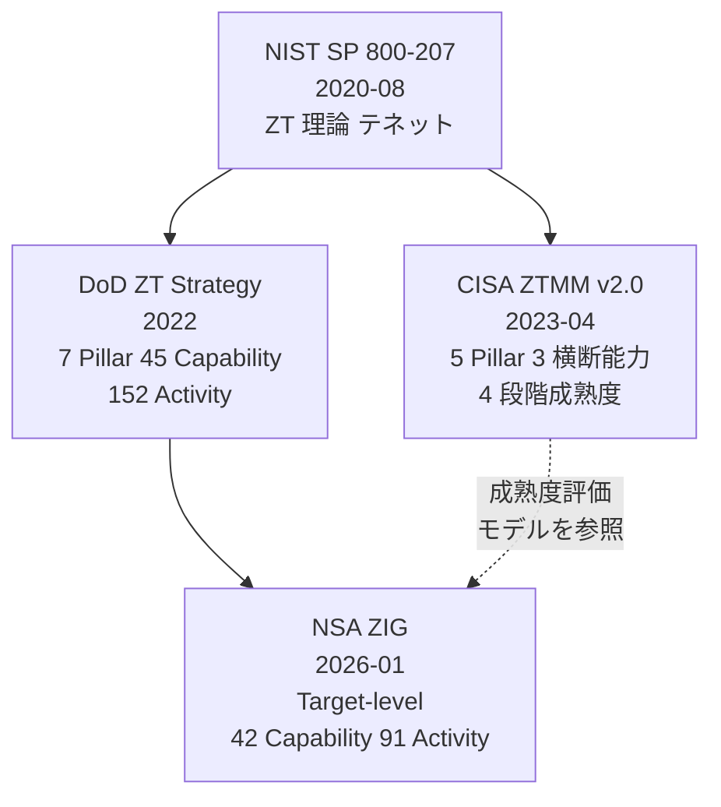
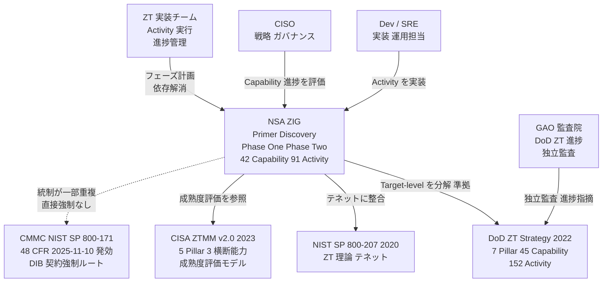
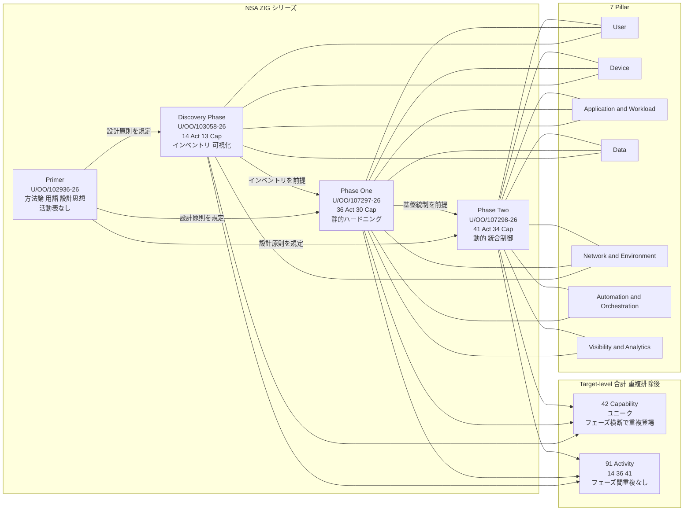
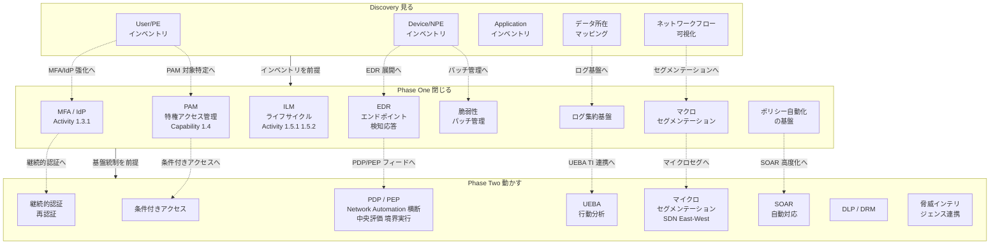
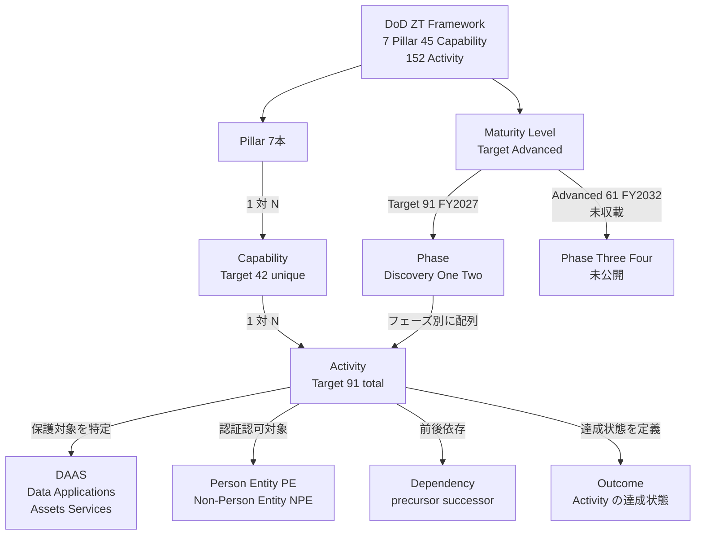
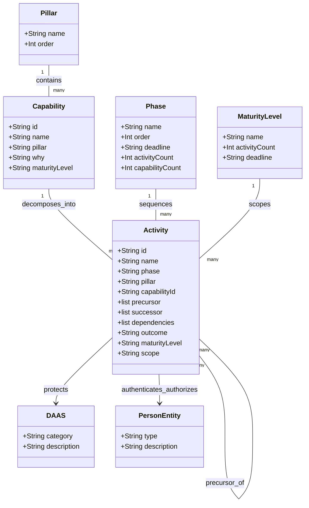

> 調査日: 2026-05-31（調査基準日: 2026-05-30）
> 対象: NSA ZIG（Zero Trust Implementation Guidelines）を「正しい情報を元に、どう実現すればよいか」という実装ロードマップの視点で整理する技術調査。
> 情報源: 本文中の数値・日付は NSA/DoD 公式インデックス・プレス・Federal Register API で確認しました。執筆メイン環境では NSA PDF が Akamai 403 で逐語取得できず、質的内容の一部は専門メディアの一次引用経由です（各所に「二次情報」と明示）。別環境の検証では 4 PDF を直接取得し、文書番号・日付・42/91 等の集計値・User Pillar の Capability/Activity ID 構造を一次確認しました。DoD Activity ID と逐語名称は Microsoft Learn（DoD ZT 実装推奨、2026-03 更新）でも確認しました。補完した実装例・技術選定はすべて「実装案/例」と明示し補完元を付記します。

## 概要

NSA ZIG は、新しいゼロトラスト理論でも新しい戦略でもありません。DoD（米国防総省）Zero Trust Strategy が定める Target-level 達成を、組織が着手できる作業単位（Activity）へ分解した実装支援文書群です。

NSA は Cybersecurity Technical Report（CTR）として、2026年1月に 4 文書（Primer / Discovery Phase / Phase One / Phase Two）を公開しました。2026年5月28日には専用ランディングページを開設しました。

### 正式名称・発行主体・文書種別

| 項目 | 内容 |
|---|---|
| 正式名称 | Zero Trust Implementation Guidelines（ZIGs） |
| 発行主体 | NSA Cybersecurity |
| 文書種別 | NSA Cybersecurity Technical Report（CTR） |
| 公開時期 | 2026年1月（Primer / Discovery=1/8 公開・1/14 NSA 公表、Phase One / Two=1/30） |
| 専用ランディングページ | NSA 公式（2026-05-28 開設） |

文書種別が CTR である点は重要な区別です。NSA が以前に発行した Pillar 別文書群は CSI（Cybersecurity Information Sheet）であり、ZIG とは別系統です。NSA は旧 CSI と ZIG の整合に齟齬があると認識しており、2026年中に旧 CSI を ZIG へ合わせて更新すると表明しています（二次情報: Help Net Security 2026-02-02, NSA 声明引用）。

### ZIG が解決する課題（公開背景の 4 つの圧力）

| 圧力 | 内容 | 確度 |
|---|---|---|
| 国家期限 | DoD Target-level 達成期限はFY2027末（2027-09-30）。Advanced level はFY2032 | 一次確認 |
| 進捗遅延 | DoD 全体の Target-level 進捗は約14%（2024年10月時点データ。Col. Gary Kipe が 2025-02-19 Zero Trust Summit で説明） | 二次情報: 口頭発言報道。PMO 自己申告であり外部監査値ではない |
| 契約圧力 | CMMC 48 CFR 最終規則が 2025-11-10 発効。フローダウンにより下請（DIB サプライヤ含む）へ波及 | 一次確認（FR API） |
| 国家 APT | PRC 系 Salt Typhoon による米通信インフラ侵害（CISA/NSA/FBI AA25-239A, 2025-08-27） | 一次確認 |

これらの圧力に対し、ZIG は国防 Target-level という最も厳しい基準の実装手順書として機能します。組織は ZIG の 91 Activity をチェックリスト代わりに用い、自組織の ZT 進捗を棚卸しできます。

### エコシステム上の位置づけ

ZIG はフレームワーク階層の最下層（実装手順書）に位置します。



NSA は ZIG を「NIST SP 800-207 と DoD ZT Framework の双方に align する」と明言しています。CISA ZTMM との Pillar 数の差（5 vs 7）は、CISA が横断能力に置く Visibility & Analytics と Automation & Orchestration を DoD/NSA が独立 Pillar へ格上げしている点に起因します。

### 主要な価値提案

- 作業分解。各 Activity は discrete tasks から recommended processes/actions まで分解
- 依存関係の明示。Activity ごとに required activities・dependencies・precursors/successors を定義
- 自己診断の地図。ベンダー・製品に依存しない形で 91 Activity 単位の棚卸しを可能にする共通言語

## 特徴

### 1. 「何でないか」による自己定位

ZIG は自らを否定形で定義します（NSA 原文 Primer の逐語リスト形式かは未確認ですが、各否定は一次相当の引用として二次媒体で確認できます）。

- not mandatory（義務ではない）。"not prescriptive or mandatory"（二次情報: Primer 引用）
- not prescriptive（処方的ではない）
- not a rigid checklist（固定チェックリストではない）。"rather than following a rigid checklist"（二次情報: Primer 引用）
- not doctrinal（教義ではない）。"These phases are not doctrinal but are a structured approach"（二次情報）
- not one-size-fits-all / not strictly sequential（画一的・強制的順序ではない）（二次情報: Industrial Cyber）
- not exhaustive / not vendor-specific（製品リストではない）。"vendor-agnostic, ... provided for consideration rather than as an exhaustive or vendor-specific list."（二次情報: Industrial Cyber）
- 既存法制度を置き換えない。"not designed to supersede, impact, or alter any existing authority, law, or policy."（二次情報）
- 新しい戦略ではない。DoD ZT Strategy（2022）の実装支援

### 2. モジュール式・高カスタマイズ設計

- フェーズは Activity 単位の依存関係（precursor/successor）で連結
- 各 Capability と Activity は standalone reference として機能。意図的な重複を保持（二次情報: Industrial Cyber）
- 異なる ZT 成熟度の組織が、自組織に最も関連する Capability を選択して実装

### 3. 3 フェーズ構造（Target-level）

| フェーズ | 通称 | 規模 | 主な作業内容 |
|---|---|---|---|
| Discovery Phase | 見る | 14 Act / 13 Cap | DAAS と Users/PE/NPE のインベントリ・可視化・データフロー・認証認可の観測。ZT 統制適用前のベースライン確立 |
| Phase One | 閉じる | 36 Act / 30 Cap | セキュアな基盤確立。MFA/IdP・PAM・Federation・ILM・マクロセグメンテーション・ログ集約の静的ハードニング |
| Phase Two | 動かす | 41 Act / 34 Cap | コア ZT ソリューションの統合。条件付きアクセス・マイクロセグメンテーション・UEBA・PDP/PEP・継続的認証・SOAR による動的・リスク適応型 enforcement |

Capability のフェーズ別集計（13+30+34=77）は重複を含みます。ユニーク Capability 総数は 42 です。Activity はフェーズ間で重複しないため 14+36+41=91 が成立します。

### 4. 7 Pillar 横断（DoD ZT Framework と同一）

| Pillar | 代表的な実装技術・Capability |
|---|---|
| User | MFA/IdP、PAM、Federation・User Credentialing、ILM、Conditional Access |
| Device | Device Inventory、Compliance 検査、EDR/XDR、Patch Management |
| Application & Workload | Application Inventory、Secure Application Access、DevSecOps、脆弱性スキャン |
| Data | Data Catalog/Labeling、Classification、DLP、Encryption（at rest & in transit） |
| Network & Environment | Data Flow Mapping、Macro/Micro Segmentation、SDN、East-West 可視化 |
| Automation & Orchestration | Dynamic Policy Enforcement 自動化、SOAR、ML/AI 活用 |
| Visibility & Analytics | Centralized Logging、SIEM、UEBA、Threat Intelligence 連携、Continuous Monitoring |

各 Pillar の Activity 割当の正式逐語マッピングは一次 PDF 未取得のため未確認です。上記は NSA プレス・DoD ZT Reference Architecture・専門メディア解説のクロス参照値です。

> Activity ID 体系と Pillar 帰属の注意（重要）: DoD ZT の Activity ID は先頭番号が Pillar を表します（`1.x.x`=User Pillar=Pillar 1、`2.x.x`=Device）。本稿で扱う `1.3.1`（MFA/IdP）・`1.4.1/1.4.2`（PAM）・`1.5.1/1.5.2`（Identity Federation & User Credentialing）・`1.6.1`（UEBA/UAM）・`1.7.1`（Least Privileged Access の Deny User by Default Policy）・`1.8.1/1.8.2`（Continuous Authentication）はすべて User Pillar（Pillar 1）の Activity です。一方、本稿のコンポーネント図・Pillar 別表で UEBA を Visibility & Analytics、PDP/PEP を Network/Automation と記す箇所がありますが、これは機能的な連携先を示すもので、ID 体系上の所属 Pillar（多くは User）とは一致しません。（一次相当: Microsoft Learn DoD ZT User Pillar、Capability 1.1〜1.9）
>
> User Pillar の Capability 正式名（参考）: 1.1 User Inventory / 1.2 Conditional User Access / 1.3 Multi-Factor Authentication / 1.4 Privileged Access Management / 1.5 Identity Federation & User Credentialing / 1.6 Behavioral, Contextual ID, and Biometrics / 1.7 Least Privileged Access / 1.8 Continuous Authentication / 1.9 Integrated ICAM Platform。

### 5. Target-level 42 Capability / 91 Activity の構造

ZIG 本文（Primer）は次のように明記します。"assist skilled practitioners in adopting and integrating ZT Target-level Capabilities (42) and Target-level Activities (91)"

### 6. ベンダー非依存・NIST SP 800-207 / DoD ZT Framework 双方に整合

- vendor-agnostic。参照技術は考慮対象の例示であり特定製品を推奨・強制しない
- NIST SP 800-207 準拠。never trust always verify / assume breach / PE・NPE の継続的認証認可
- DoD ZT Framework 準拠。7 Pillar 構造・45 Capability・152 Activity の定義を継承し Target-level 部分を実装手順へ変換

### 7. 民間・日本企業への参照価値と適用上の注意

- 最も厳格な基準の自己診断地図。国防 Target-level を上限として自組織の ZT 進捗を棚卸し
- 共通言語の提供。Pillar / Capability / Activity の語彙で ZT ロードマップを説明
- 実装序列の指針。Discovery（知る）→ Phase One（閉じる）→ Phase Two（動かす）の順序原則

注意点:

- ZIG 自体に契約強制力なし。DIB への強制は CMMC（NIST SP 800-171 統制）を通じて働くが、ZT 実装そのものが契約要件になるわけではない
- 日本企業が防衛装備庁「防衛産業サイバーセキュリティ基準」（SP 800-171 同等）と CMMC を両立する場合も統制基盤は SP 800-171 が中心。ZIG は補完参照
- Advanced-level（Phase Three/Four 相当）は未公開。FY2032 期限の活動は現時点で ZIG 未カバー

## 構造

### システムコンテキスト図

ZIG を中心に、利用者アクター・外部規範・監査機関を配置します。



| 要素名 | 説明 |
|---|---|
| Dev / SRE | Discovery・Phase One・Phase Two の Activity を実装・運用するエンジニアリング層 |
| CISO | ZIG の Capability を自組織のリスク判断で取捨選択し進捗をガバナンスする層 |
| ZT 実装チーム | Activity 単位の precursor/successor を管理しフェーズ計画を実行するチーム |
| NSA ZIG | 本ドキュメント群。DoD Target-level を 91 Activity へ分解した実装支援文書（CTR 種別） |
| DoD ZT Strategy | ZIG の上位規範。7 Pillar / 45 Capability / 152 Activity を定義 |
| NIST SP 800-207 | ZT の理論・概念レイヤ。ZIG の整合基盤 |
| CISA ZTMM v2.0 | 成熟度評価モデル（5 Pillar）。DoD/NSA の 7 Pillar と数が異なる |
| CMMC / NIST SP 800-171 | DIB サプライチェーンへの契約強制ルート。ZIG/ZT 自体を直接強制しない |
| GAO | DoD ZT 進捗の独立監査機関。GAO-25-107649 等で実装計画の未完・遅延を指摘 |

### コンテナ図

ZIG を構成する 4 文書と 7 Pillar の交差、Capability/Activity のまとまりを示します。



| 要素名 | 説明 |
|---|---|
| Primer | ZIG 全体の戦略・原則・設計思想を規定。Pillar > Capability > Activity の階層と precursor/successor 依存構造を定義。活動表は持たず他3文書の利用ガイドとして機能 |
| Discovery Phase | Target-level 実装前のベースライン確立。DAAS と PE/NPE のインベントリ・認証認可フローの観測。14 Act / 13 Cap |
| Phase One | 安全な基盤の確立。MFA / PAM / フェデレーション / ILM の静的ハードニングを 7 Pillar 横断で実施。36 Act / 30 Cap |
| Phase Two | コア ZT ソリューションの統合開始。条件付きアクセス・マイクロセグメンテーション・UEBA・PDP/PEP・SOAR による動的制御。41 Act / 34 Cap |
| 42 Capability（ユニーク） | what/why レイヤ。フェーズ横断で重複登場するため、フェーズ別合計（77）とユニーク数 42 は一致しない |
| 91 Activity（合計） | how レイヤ。フェーズ間で重複しないため 14+36+41=91 が成立。各 Activity は discrete tasks へ分解され precursor/successor を定義 |
| 7 Pillar | ZIG が横断する 7 本の柱。Discovery は主に User/Device/App/Data/Network の可視化に特化し、Phase One/Two は全 Pillar 横断で統制を積み上げる |

### コンポーネント図

各フェーズ × Pillar のドリルダウンです。代表的な実装技術を含みます（二次情報が多い点に注意）。



#### Discovery フェーズ 説明テーブル

| 要素名 | 説明 |
|---|---|
| User/PE インベントリ | アカウント・ロール・権限の権威あるリスト作成。後続 MFA/PAM の対象確定に必須 |
| Device/NPE インベントリ | 管理・未管理デバイスの全数把握。EDR・パッチ管理の対象を確定 |
| Application インベントリ | 本番・シャドー IT アプリの所在把握と認証方式の現状確認 |
| データ所在マッピング | DAAS の分類・依存・フローの可視化 |
| ネットワークフロー可視化 | 認証認可フローの観測。セグメンテーション設計の入力 |

#### Phase One 説明テーブル

| 要素名 | Pillar | 説明 |
|---|---|---|
| MFA / IdP（Activity 1.3.1） | User | 組織全体の多要素認証と ID プロバイダ統合。ZT の最優先基盤統制（二次情報: Activity ID） |
| PAM 特権アクセス管理（Capability 1.4） | User | 特権 ID の発見・管理・移行（Activities 1.4.1 / 1.4.2）（二次情報: Activity ID） |
| ILM ライフサイクル（Activities 1.5.1/1.5.2） | User | アカウント生成〜廃止サイクルの管理（二次情報: Activity ID） |
| マクロセグメンテーション | Network | ネットワーク論理分割で爆発半径を抑制。マイクロセグメンテーションの前提 |
| ログ集約基盤 | Visibility | 集中ログ・SIEM 連携の土台。Phase Two の UEBA・TI に必須 |
| 脆弱性・パッチ管理 | Device | デバイスコンプライアンス基盤。EDR と連携してリスクスコアを生成 |
| EDR | Device | Phase Two の PDP/PEP へシグナルをフィード |
| ポリシー自動化基盤 | Automation | Phase Two SOAR 高度化の前提となる自動化の土台 |

#### Phase Two 説明テーブル

| 要素名 | Pillar | 説明 |
|---|---|---|
| 条件付きアクセス | User / Device | デバイス姿勢・リスク・コンテキストを評価しアクセス可否を動的に決定（二次情報） |
| マイクロセグメンテーション / SDN | Network | East-West トラフィックの workload 単位制御・爆発半径の最小化（二次情報） |
| UEBA | ID 体系上は User（1.6.1）／機能は Visibility 連携 | 行動ベースラインと異常検知。継続的認証のトリガに連携。Capability 1.6 Behavioral, Contextual ID, and Biometrics（一次相当: Microsoft Learn DoD 1.6.1） |
| PDP / PEP | Network & Environment + Automation 横断 | Policy Decision Point（中央評価）+ Policy Enforcement Point（境界実行）。特定 Pillar 専属でなく横断要素（二次情報） |
| 継続的認証・再認証 | User | セッション型アクセス判断。定期再認証・行動トリガ型再認証（二次情報） |
| SOAR 自動対応 | Automation | シグナル統合・自動化実行・オーケストレーション成熟化（二次情報） |
| DLP / DRM | Data | データの動的保護。分類タグ付け（Discovery）・暗号化（Phase One）の上に乗る（二次情報） |
| 脅威インテリジェンス連携 | Visibility | Visibility & Analytics Pillar の成熟化。SIEM・UEBA へのフィード（二次情報） |

## データ

### 概念モデル



#### 概念モデル 説明テーブル

| 要素名 | 説明 |
|---|---|
| Pillar | ZT を構成する7つの技術領域（一次相当: 複数独立ソース一致） |
| Capability | Pillar 内で達成する能力・到達状態（what/why）。Target-level のユニーク数 42。フェーズ横断で重複登場（一次相当: ZIG 本文明記） |
| Activity | Capability を実装する個別作業単位（最小実行単位・how）。Target-level 合計 91。precursor/successor 依存を持つ（一次相当: ZIG 本文明記） |
| Phase | Activity を配列した実装フェーズ。Target-level=Discovery / Phase One / Phase Two。順序は precursor/successor で連結（二次情報: Industrial Cyber / MeriTalk） |
| Maturity Level | Target（FY2027・91 Activity）と Advanced（FY2032・61 Activity）の2段階。ZIG は Target のみ収載（一次相当） |
| DAAS | ZT の保護対象概念。Data / Applications / Assets / Services。Discovery の棚卸し対象（二次情報: Discovery PDF 引用） |
| Person Entity / Non-Person Entity | 継続的認証・認可の対象。PE=ユーザー、NPE=デバイス・サービスアカウント等（二次情報: Primer 引用） |
| Dependency（precursor/successor） | Activity 間の前後依存。precursor=先行必須、successor=後続（二次情報: Industrial Cyber） |
| Outcome | Activity の達成状態・期待結果。各 Activity に定義（二次情報: 検索要約） |

### 情報モデル



#### 情報モデル 説明テーブル

| 要素名 | 説明 |
|---|---|
| Pillar.name / order | Pillar 正式名称と公式順序（User=1〜Visibility & Analytics=7、order は文書記述から推測） |
| Capability.id | Pillar 番号 + 連番（例: "1.4"=User Pillar の Capability 4）（二次情報: ComplianceHub 例示） |
| Capability.maturityLevel | "Target" / "Advanced"。Target ユニーク数 42（一次相当） |
| Activity.id | Capability ID + 連番（例: "1.3.1"=User, Cap 3, Act 1）（二次情報） |
| Activity.phase | "Discovery" / "Phase One" / "Phase Two"（一次相当: フェーズ別数 14/36/41） |
| Activity.precursor / successor | 先行・後続 Activity の ID 配列（二次情報: Industrial Cyber） |
| Activity.outcome | 達成状態・期待結果（二次情報: 検索要約） |
| Activity.scope | "Organizational" / "Enterprise"（組織規模別 2 段記述）（二次情報: ComplianceHub） |
| Phase.deadline | Target="FY2027 (2027-09-30)" / Advanced="FY2032"（一次相当） |
| Phase.activityCount / capabilityCount | Discovery=14/13, Phase One=36/30, Phase Two=41/34（一次相当） |
| MaturityLevel.activityCount | Target=91, Advanced=61（一次相当 / Advanced は複数二次一致） |
| DAAS.category | "Data" / "Applications" / "Assets" / "Services"（二次情報: Discovery PDF 引用） |
| PersonEntity.type | "PE" / "NPE"（二次情報: Primer 引用） |

### 補足: 数の整合マップ

| 区分 | Pillar | Capability | Activity | 期限 | 確度 |
|---|---|---|---|---|---|
| DoD ZT Strategy（全体） | 7 | 45 | 152 | — | 一次相当: 複数独立ソース一致 |
| Target-level（FY2027） | 7 | 42（ユニーク） | 91 | 2027-09-30 | 一次相当: ZIG 本文明記 |
| Advanced-level（FY2032） | 7 | — | 61 | 2032 | 二次情報: 複数ソース 91/61 一致 |
| ZIG Discovery Phase | 7横断(実質5Pillar中心) | 13（重複込） | 14 | Target | 一次相当 |
| ZIG Phase One | 7横断 | 30（重複込） | 36 | Target | 一次相当 |
| ZIG Phase Two | 7横断 | 34（重複込） | 41 | Target | 一次相当 |
| ZIG Target-level 合計（ユニーク） | 7 | 42 | 91 | 2027-09-30 | 一次相当: ZIG 本文明記 |

> Capability がフェーズ横断で重複登場する設計のため、13 + 30 + 34 = 77（重複込）と 42（ユニーク）は一致しません。Activity はフェーズ間で重複しないため 14+36+41=91 が成立します。

## 構築方法

ZIG の構築アプローチは「見る → 閉じる → 動かす」の 3 フェーズ連鎖です。前フェーズの成果物が後フェーズの入力となる Activity 単位の precursor/successor 依存で接続します。Discovery を飛ばして Phase One/Two に着手することは原則として推奨されません。

### 実装の前提整備（ガバナンス・体制・スコープ定義）

「やらないこと」の確認（Primer の自己定位）: mandatory でない / prescriptive でない / rigid checklist でない（91 Activity の全完了を目標化しない）/ one-size-fits-all・strictly sequential でない / doctrinal でない / vendor-specific でない（二次情報: Industrial Cyber / MeriTalk）。

体制整備（実装案/例）:

- スコープ定義。保護対象の DAAS と境界を定義。CUI（Controlled Unclassified Information）等の機密区分があれば分類マッピングを先行実施。[補完元: NIST SP 800-60]
- ガバナンス委員会。ZT 推進オーナー（CISO/CIO 相当）、Pillar オーナー（7 Pillar × 担当チーム）、Activity 実施チームの三層構造。[補完元: DoD ZT PMO 組織モデル]
- 成熟度ベースライン。CISA ZTMM v2.0 の Traditional/Initial/Advanced/Optimal 4 段階で Pillar ごとの現状を自己評価し、Discovery のスコープ優先順位を決定。[補完元: CISA ZTMM v2.0]
- 既存文書の照合。NIST SP 800-171（CMMC 対応）や CISA ZTMM 対応が既存なら、重複統制を ZIG Activity へマッピングし二重作業を排除。

### Discovery フェーズの実装（見る）— 何をインベントリするか

目的: ZT 統制を適用する前に、守る対象を権威あるインベントリとして確定します。

ZIG Discovery Phase の公式定義: "collect information about the organization's environment(s), such as DAAS, Users/PEs/NPEs, etc." / "identify critical data, applications, assets and services to be prioritized for zero trust implementation"（二次情報: Discovery PDF 引用・複数媒体一致）

14 Activities が答える問い: ①誰がアクセスしているか（User/PE）②誰が自動アクセスしているか（NPE）③どのデバイスが接続しセキュリティ状態はどうか ④どのアプリ・ワークロードが存在しどう接続されているか ⑤センシティブデータはどこにありどう流れているか ⑥現在の認証認可ポリシーはどう定義・適用・記録されているか（二次情報: AppGate / ComplianceHub.Wiki）。

#### Discovery Activity の実装（技術カテゴリ別）

| 対象 | 目標 | 実装案/例（補完元） | ツールカテゴリ |
|---|---|---|---|
| ユーザー・PE（Activity 1.1.1） | 通常/特権/ローカルアカウント棚卸し、IdP 管理外アカウント発見 | IdP 全ユーザーエクスポート、AD `Get-ADUser -Filter *` で孤立検出、Graph API `GET /users` で自動化、CASB で未承認 IdP 検出 [Microsoft Learn DoD 1.1.1] | IdP（Entra ID/Okta）、AD 管理、CASB |
| NPE | サービスアカウント・API キー・マネージド ID 棚卸し | `az identity list` / `az ad sp list`、CI/CD の Secrets スキャン（GitHub Advanced Security/truffleHog）[Microsoft Learn] | Workload ID 管理、Secrets スキャナ |
| デバイス（Assets） | 接続デバイスの権威レジストリとセキュリティ状態 | EDR（Defender/CrowdStrike）→ CMDB 統合、MDM（Intune/Jamf）列挙、未管理は ASM（Xpanse/Censys）[Microsoft Learn] | EDR、MDM/UEM、CMDB、ASM |
| アプリ・サービス | 本番・シャドー IT 棚卸し、認証方式現状確認 | CASB のクラウドアプリ検出、IdP アプリ登録一覧、CMDB 統合 [Microsoft Learn] | CASB、IdP アプリカタログ、CMDB |
| データ（Data） | センシティブデータの所在・分類・移動 | データ分類（Purview/Varonis）スキャン、PII/PHI/CUI 自動タグ付け、DLP 現状棚卸し [Microsoft Learn; NIST SP 800-60] | DLP/データカタログ |
| データフロー | システム間依存・認証フロー・East-West 把握 | NetFlow/IPFIX/Zeek/Gigamon でアプリ間通信可視化、VPC/NSG Flow Logs で依存マップ [Gigamon; NSA Network CSI] | NetFlow/NDR、サービスメッシュ（Istio+Kiali） |
| 認証認可（ポリシー） | アクセス制御ポリシー・ロール・権限の棚卸し | Conditional Access 一覧エクスポート、特権使用状況をログ確認、FW ルール棚卸し（過剰 ANY/ANY 特定）[CIS Controls v8; NIST SP 800-207] | IdP ポリシーエクスポート |

### Phase One の実装（閉じる）— 基盤ハードニング

目的: "build upon or further refine the Component environment(s) to establish a secure foundation that supports ZT Capabilities."（二次情報: Phase One PDF 引用）。ICAM・セグメンテーション・モニタリング基盤の静的ハードニングが中核です。

#### MFA / IdP（Activity 1.3.1）

DoD Activity の定義: "DoD Organizations procure and implement a centralized Identity Provider (IdP) solution and Multi-Factor (MFA) solution ... Mission/Task-Critical applications and services are utilizing the IdP and MFA solution"（一次相当: Microsoft Learn DoD 1.3.1）

実装案/例（補完元: Microsoft Learn; NIST SP 800-63B; FIDO Alliance）:

- フィッシング耐性 MFA（最優先）。DoD は CAC/PIV 証明書ベース認証（CBA）が第一選択。民間は FIDO2 セキュリティキー（YubiKey FIPS/Google Titan）または Windows Hello for Business（PIN+TPM）。パスワード+SMS/TOTP はフィッシング耐性がなく最終手段
- IdP 統合。Entra ID/Okta/PingFederate を SAML/OIDC で全アプリ接続。レガシーは Application Proxy / Secure Hybrid Access 経由
- PKI 統合。組織 CA → 中間 CA → エンドエンティティ証明書の信頼チェーン確立
- 段階ロールアウト。Staged Rollout でパイロット → 全社展開。特権ユーザーを最優先に MFA 強制

```yaml
# 実装案/例: Microsoft Entra 認証強度ポリシー（概念）
# 補完元: Microsoft Learn - Authentication strength (2026)
authenticationStrength:
  name: "DoD-CAC-Policy"
  allowedCombinations:
    - x509CertificateMultiFactor  # CAC/PIV 証明書（MFA 相当）
    - fido2                        # FIDO2 セキュリティキー
    - windowsHelloForBusiness      # Hello for Business
  # SMS/TOTP は phishing-resistant でないため除外
```

#### PAM — 特権アクセス管理（Activity 1.4.1 / 1.4.2）

DoD Activity の定義: 1.4.1 "procure and implement a Privileged Access Management (PAM) solution"、1.4.2 "Privileged activities are migrated to PAM and access is fully managed"（一次相当: Microsoft Learn DoD 1.4.1/1.4.2）

実装案/例（補完元: Microsoft Learn; CyberArk/BeyondTrust）:

- JIT（Just-in-Time）アクセス。Entra PIM で eligible 割当 → activation 時に承認フロー + MFA + 時間制限（例 8時間）
- PAW（Privileged Access Workstation）。特権操作専用端末を分離。PAW 以外からの特権操作を Conditional Access でブロック
- Break-glass アカウント。緊急用は金庫格納（CyberArk Vault/HashiCorp Vault）、アクセス時に SIEM アラート即時発報
- セッション記録。PAM による特権セッション記録（keystroke + screen）を有効化

#### Identity Federation & User Credentialing（Capability 1.5 / Activity 1.5.1・1.5.2）

実装案/例（補完元: Microsoft Learn; NIST SP 800-53 IA 族）:

- Joiner/Mover/Leaver 自動化。HR システム（Workday/SAP HCM）→ IdP への自動プロビジョニング（SCIM 2.0）。退職者は HR イベントから 24h 以内に自動無効化
- 孤立アカウント排除。90日無ログイン・所属なしを定期検出し Access Review 承認で無効化
- 外部ユーザー管理。ゲスト/パートナー ID を Entitlement Management のアクセスパッケージで期限管理

#### 脆弱性・パッチ管理

実装案/例（補完元: CISA KEV; NIST SP 800-40）:

- CISA KEV 優先。KEV カタログ掲載 CVE を最優先。DoD は DISA STIG タイムラインに従う
- 継続スキャン。Qualys/Tenable.io/Rapid7 を週次以上。エージェント型を優先
- パッチ自動化。エンドポイントは MDM、サーバーは WSUS/RHEL Satellite/AWS Systems Manager Patch Manager

#### マクロセグメンテーション

実装案/例（補完元: NSA Network Pillar CSI 2024）:

- VLAN/サブネット分割。機能・センシティビティ別（管理/ユーザー/DMZ/OT・IoT）。inter-VLAN を ACL 制御
- SDN 準備。Cisco ACI/VMware NSX または Overlay 設計。Phase Two マイクロセグメンテーションへの布石
- 境界準備。NGFW（Palo Alto/Fortinet）で East-West をインライン検査できる構成へ

#### ログ集約基盤（Visibility の土台）

実装案/例（補完元: NIST SP 800-92）:

- 集中ログ収集。SIEM（Sentinel/Splunk/Elastic）に IdP・EDR・ネットワーク・アプリログを集約。tamper-resistant（WORM/Immutable）保管
- ログ保持。DoD（STIG）最低 1年オンライン + 3年オフライン。民間は 1年以上
- UEBA 初期統合（Activity 1.6.1）。UEBA/UAM（Sentinel UEBA/Exabeam/Securonix）を IdP と初期統合し行動ベースライン取得を開始（一次相当: Microsoft Learn DoD 1.6.1）

#### Phase One の Pillar 別代表 Activity

| Pillar | 代表 Activity | 主な実装要素 |
|---|---|---|
| User | 1.1.1 User Inventory / 1.3.1 MFA・IdP / 1.4.1-2 PAM / 1.5.1-2 Federation・Credentialing / 1.7.1 Deny User by Default Policy（Cap 1.7 Least Privileged Access）/ 1.8.1 Single Authentication・1.8.2 Periodic Authentication | IdP 統合、FIDO2/PIV、JIT PAM、HR 連携 |
| Device | デバイスインベントリ・コンプライアンス・EDR・パッチ | EDR、MDM、脆弱性スキャナ |
| Application & Workload | アプリインベントリ・IdP 統合・脆弱性スキャン | CASB、SAST/DAST |
| Data | データカタログ・分類・暗号化 | DLP、TLS 1.2+/AES-256 |
| Network & Environment | フローマッピング・マクロセグメンテーション | VLAN/SDN、NGFW |
| Automation & Orchestration | 自動化の基盤整備 | IaC（Terraform）、スクリプト基盤 |
| Visibility & Analytics | ログ集約・SIEM・UEBA 初期（1.6.1） | SIEM、UEBA |

### Phase Two の実装（動かす）— 動的・統合制御

目的: "marks the start of integrating distinct zero trust foundational solutions within the component environment"（二次情報: Phase Two PDF 引用）。Phase One の静的基盤の上に動的・リスク適応型の enforcement を乗せます。

#### 条件付きアクセス（PDP/PEP アーキテクチャ）

ZIG の定義: "A ZT-enabled network access capability receives network traffic and sends it to an access control engine (or PDP) for approval. ... the decision is communicated back to the PEP for enforcement."（二次情報: Phase Two 引用）

- PDP（Policy Decision Point）。中央エンジン（IdP の Conditional Access / OPA）がアクセス可否を判断。評価軸 = identity + デバイス posture + リスクスコア + 場所 + セッション context + データ感度。ZIG は "policies must be centrally defined, consistently applied, continuously assessed, enforced through coordinated PDPs and PEPs" と強調（二次情報: Help Net Security）
- PEP（Policy Enforcement Point）。ZTNA ゲートウェイ（Zscaler Private Access/Cloudflare Access/BeyondCorp Enterprise）がアプリ前面で執行。ZTNA 単体では Application Layer 検査が不足するため、アプリ自体も PDP/PEP として機能させます（API ゲートウェイ・サービスメッシュ Istio mTLS をアプリ内 PEP に活用）（二次情報: Help Net Security）

```rego
# 実装案/例: OPA（Open Policy Agent）ポリシー記述（概念・Rego v1 構文）
# 補完元: OPA ドキュメント https://www.openpolicyagent.org/docs/
package zerotrust.access
import rego.v1

default allow := false

allow if {
    input.user.mfa_verified == true
    input.device.compliant == true
    input.device.risk_score < 50
    input.user.role == data.app_permissions[input.resource.app_id][_]
}
```

#### マイクロセグメンテーション（East-West 制御）

ZIG の定義: "Micro-segmentation: workload-level isolation, not just VLAN separation / ... confining blast radius through structure."（二次情報: ComplianceHub.Wiki / Help Net Security）

実装案/例（補完元: NSA Network Pillar CSI 2024; Illumio/Guardicore）:

- ホストベース FW。Windows Firewall/iptables をワークロード単位で。デフォルト拒否
- SDN/仮想化。VMware NSX-T/Cisco ACI で中央管理
- エージェント型。Illumio Core/Akamai Guardicore でフロー可視化と自動ポリシー生成
- Kubernetes Network Policy。Calico/Cilium で Pod 間通信を制限

```yaml
# 実装案/例: Kubernetes NetworkPolicy（デフォルト拒否 + 明示許可）
# 補完元: https://kubernetes.io/docs/concepts/services-networking/network-policies/
apiVersion: networking.k8s.io/v1
kind: NetworkPolicy
metadata:
  name: default-deny-all
  namespace: production
spec:
  # podSelector を空にし ingress/egress ルールを持たないことで
  # namespace 内の全 Pod の Ingress/Egress を既定拒否する
  podSelector: {}
  policyTypes:
  - Ingress
  - Egress
---
apiVersion: networking.k8s.io/v1
kind: NetworkPolicy
metadata:
  name: allow-frontend-to-backend
  namespace: production
spec:
  podSelector:
    matchLabels:
      app: backend
  ingress:
  - from:
    - podSelector:
        matchLabels:
          app: frontend
    ports:
    - protocol: TCP
      port: 8080
```

#### UEBA（User and Entity Behavior Analytics）

DoD Activity 1.6.1: "DoD Organizations procure and implement User and Entity Behavior Analytics (UEBA) and User Activity Monitoring (UAM) solutions. Initial integration point with Enterprise IdP is completed"（一次相当: Microsoft Learn DoD 1.6.1）

実装案/例（補完元: Microsoft Learn; CISA 監視ガイダンス）:

- 行動ベースライン確立。ログイン時刻・場所・アクセス対象・データ量の正常パターンを 30〜90 日で学習
- SIEM + UEBA 統合。Sentinel（UEBA 有効化）/Exabeam/Securonix/Splunk UEBA
- アプリ内監視。特権操作（設定変更・大量ダウンロード・エクスポート）を監査ログから UEBA へフィード
- IdP 連携アラート。UEBA 異常検知 → Conditional Access リスクスコア更新 → セッション終了/MFA 再要求

#### 継続的認証（Activity 1.8.1 / 1.8.2）

DoD Activity（Capability 1.8 Continuous Authentication）: 1.8.1 Single Authentication "authenticate users and NPEs at least once per session"、1.8.2 Periodic Authentication "re-authenticate user sessions based on security attributes"（一次相当: Microsoft Learn DoD 1.8.1/1.8.2）

実装案/例（補完元: Microsoft Learn; OpenID Foundation CAE 仕様）:

- サインイン頻度制御。Conditional Access で再認証頻度設定（高リスクセッション 1時間/高ユーザーリスク 毎回）
- Continuous Access Evaluation（CAE）。OIDC/OAuth 2.0 ベースでポリシー変更・リスク上昇・場所変化にリアルタイムでトークン無効化。M365 が対応
- セッションリスクトリガー。impossible travel・新デバイス・未知 IP を UEBA で検出し自動セッション終了

#### SOAR / 自動化（Automation & Orchestration Pillar）

実装案/例（補完元: NIST SP 800-61r3; Microsoft Sentinel Playbook）:

- SOAR Playbook 優先ケース。①UEBA 異常 → 特権アカウント一時停止 → 通知 → 承認後復旧 ②フィッシング検出 → エンドポイント隔離 → IoC を Watchlist 追加 ③MDM コンプライアンス違反 → ネットワークアクセス制限 → パッチ後自動解除

```yaml
# 実装案/例: GitHub Actions による ZT ポリシー CI/CD（概念）
# 補完元: GitHub Actions ドキュメント https://docs.github.com/en/actions
name: ZT-Policy-Deploy
on:
  push:
    paths: ['policies/**']
jobs:
  validate-and-deploy:
    runs-on: ubuntu-latest
    steps:
      - uses: actions/checkout@v4
      - name: OPA Policy Lint
        run: opa fmt --fail policies/
      - name: OPA Policy Test
        run: opa test policies/ -v
      - name: Deploy to Policy Engine
        if: github.ref == 'refs/heads/main'
        run: |
          ./deploy-policy.sh --env production --approve-required
```

#### Phase Two の Pillar 別代表 Activity

| Pillar | Phase Two の主要実装 |
|---|---|
| User | 1.8.2 定期再認証 / PDP/PEP Conditional Access / UEBA-PAM 統合 |
| Device | comply-to-connect 強制 / EDR リスクスコア連携 |
| Application & Workload | API ゲートウェイ PEP / DevSecOps 統合 / アプリ内監査 |
| Data | DLP アクティブ制御 / DRM / データアクセス動的承認 |
| Network & Environment | マイクロセグメンテーション / SDN 動的ポリシー / East-West 可視化 |
| Automation & Orchestration | SOAR Playbook / IaC ポリシー管理 / AI/ML 異常検知 |
| Visibility & Analytics | UEBA フル統合 / 脅威 Intel 連携 / 自動レポーティング |

## 利用方法

### 自己診断の地図としての使い方（91 Activity チェックリスト化）

ZIG の 91 Target-level Activities は「守るべきものをどれだけ実装しているか」の自己診断チェックリストとして転用できます。

手順:

1. Pillar × Phase のマトリクス作成。7 Pillar × 3 Phase の表に該当 Activity を列挙
2. Activity ごとに状態評価。`Not Started / In Progress / Completed` 3段階、または CISA ZTMM の 4段階で評価
3. precursor を確認。先行 Activity が未完なら後続を「ブロック中」とマーク
4. GAP を可視化。未着手 Activity と理由（ガバナンス/予算/技術的困難）を分類

NSA の注意喚起: ZIG は "standalone reference" として設計され、一部 Activity のみの部分適用を公式にサポートします。全 91 の完全達成を目標化しないでください（二次情報: Industrial Cyber / Primer）。

### 7 Pillar 別の着手手順（優先順位づけ）

ZIG は "non-sequential / modular" と明言しつつ、実務的優先順位は次の考え方で設定できます（実装案/例 — 補完元: CISA ZTMM v2.0; NIST SP 800-207）。

| 優先度 | Pillar | 理由 |
|---|---|---|
| 1 | User | Identity が ZT の根幹。MFA/PAM/ILM が全 Pillar の前提 |
| 2 | Device | アクセス判定のデバイス posture 入力が必要。EDR/MDM が先行 |
| 3 | Network & Environment | フロー可視化 → セグメンテーション。インフラ変更コスト大のため早期着手 |
| 4 | Application & Workload | IdP/MFA 統合が前提。アプリ改修を伴う |
| 5 | Data | 分類・タグ付けは並行可。DLP は App/Network 後に強制力を持つ |
| 6 | Visibility & Analytics | ログ集約は Phase One から、高度 UEBA は Phase Two |
| 7 | Automation & Orchestration | 他 Pillar が揃ってから自動化・SOAR を段階追加 |

各 Pillar の「まず何をやるか」:

- User。`1.1.1` ユーザーインベントリ → `1.3.1` MFA/IdP → `1.4.1` PAM → `1.5.1` ILM
- Device。デバイスインベントリ → EDR 全展開 → MDM コンプライアンス → パッチ自動化
- Application & Workload。アプリインベントリ → IdP 統合（SAML/OIDC）→ 脆弱性スキャン CI/CD 組込
- Data。データ所在スキャン → 分類・タグ付け → 暗号化（全通信 TLS 1.2+）
- Network & Environment。フロー可視化 → マクロセグメンテーション → NGFW East-West 検査 → マイクロセグ
- Visibility & Analytics。ログ集約 SIEM → UEBA 初期（`1.6.1`）→ 脅威 Intel 連携
- Automation & Orchestration。SOAR Playbook 基本3〜5本 → IaC ポリシー管理 → AI/ML 異常検知

### フェーズ作業依存を踏まえた段階導入

precursor/successor 依存を踏まえた実務的ロードマップです（実装案/例 — 補完元: ZIG Primer 設計思想; DoD ZT Capability Execution Roadmap）。期間は民間中堅規模を想定した目安です。

#### ステージ 0: 前提確立（〜3か月）

| 作業 | 目的 |
|---|---|
| スコープ・DAAS 定義 | 守る対象を特定。Discovery の入力を確定 |
| CISA ZTMM 現状評価 | Pillar 別の現在地（Traditional〜Optimal） |
| Activity 優先度マトリクス作成 | 91 Activity を「着手済み/未着手/スコープ外」で色分け |
| ガバナンス体制整備 | ZT PMO 相当の推進体制・RACI を確立 |

#### ステージ 1: Discovery（〜6か月）

| 作業 | 対応 Activity | ツールカテゴリ |
|---|---|---|
| ユーザー/NPE 棚卸し | 1.1.1 相当 | IdP、AD 管理、CASB |
| デバイスインベントリ | Device 棚卸し | EDR、MDM、CMDB |
| アプリ・サービス棚卸し | App Inventory | CASB、IdP アプリカタログ |
| データ所在・分類 | Data Catalog | DLP、Purview/BigID |
| ネットワークフロー可視化 | Network Flow | NetFlow/NDR、ASM |
| ポリシー・認証現状棚卸し | Policy Inventory | IdP ポリシーエクスポート |

成果物: DAAS インベントリ台帳、ネットワークフローマップ、認証現状ヒートマップ。

#### ステージ 2: Phase One — 基盤ハードニング（〜12か月）

| 優先グループ | 作業 | 依存 |
|---|---|---|
| A（必須先行） | MFA/IdP 全クリティカルアプリ展開（1.3.1） | Discovery アプリインベントリ完了 |
| A（必須先行） | PAM 導入・特権ユーザー移行 Pt1（1.4.1） | ユーザーインベントリ完了 |
| B | ILM 自動化・HR 連携（1.5.1/1.5.2） | IdP 確立後 |
| B | Deny User by Default Policy（1.7.1, Cap 1.7 Least Privileged Access） | IdP 統合完了後 |
| B | EDR 全展開・MDM コンプライアンス | デバイスインベントリ完了 |
| C | マクロセグメンテーション | フロー可視化完了後 |
| C | SIEM ログ集約・UEBA 初期（1.6.1） | ログ送信先統一後 |
| C | データ暗号化・DLP 基本設定 | データ分類完了後 |

成果物: MFA 適用率（クリティカルアプリ 100%）、PAM カバレッジ（特権アカウント 100%）、SIEM 集約ログ源数。

#### ステージ 3: Phase Two — 動的統合制御（〜18か月）

| 優先グループ | 作業 | 依存 |
|---|---|---|
| A（先行） | 定期再認証・Conditional Access 強化（1.8.2） | MFA/IdP 完了 |
| A（先行） | UEBA フル統合・行動ベースライン確立（1.6.1） | SIEM ログ集約完了 |
| B | PDP/PEP アーキテクチャ確立（ZTNA 展開） | Conditional Access + デバイスコンプライアンス |
| B | マイクロセグメンテーション（SDN/ホスト FW） | マクロセグ完了、フロー可視化完了 |
| B | PAM JIT/JEA 全面展開 Pt2（1.4.2） | PAM Pt1 完了 |
| C | SOAR Playbook 基本構築 | SIEM + UEBA 完了 |
| C | DLP アクティブ制御・DRM | データ分類・暗号化完了 |
| C | IaC ポリシー管理・CI/CD 統合 | SOAR 基盤確立後 |

成果物: 動的アクセス制御適用範囲（%）、UEBA 検知カバレッジ、マイクロセグメンテーション適用 Namespace 数、SOAR 自動対応率。

#### ステージ 4: 継続改善（Target-level 維持 → Advanced-level 準備）

- Target-level 91 Activity 完了後も継続的検証（テネット assume breach の実践）
- Advanced-level（61 Activity, FY2032 期限）の ZIG（Phase Three/Four、未公開）に向けた準備
- 四半期ごとの ZIG チェックリスト再評価 + CISA ZTMM 再評価でスコア推移を追跡

## 運用

### 進捗管理（Target-level 91 Activity の達成トラッキング、FY2027 期限管理）

DoD の現状（参考）: 58 コンポーネント横断で Target-level activities の完了は約 14%（2024年10月時点、Col. Gary Kipe が 2025-02-19 Zero Trust Summit で説明）（二次情報: 口頭発言報道。GAO 算定ではなく PMO 自己申告）。GAO-25-107649 は 4 つのプログラムが FY2027 期限までの ZT 実装計画を策定していないと指摘します（一次: GAO 報告書番号で確認。PDF 逐語は未照合）。

| 管理軸 | 実務上の意味 |
|---|---|
| Discovery → Phase One → Phase Two の依存 | フェーズをスキップすると後段の動的制御基盤が崩れる |
| 91 Activity の全体 vs 優先 | 「全91を均等に」でなく自組織のリスク・統制ギャップで優先順位を設定（NSA 自身が modular と明言） |
| Advanced-level は FY2032 スコープ外 | 61 の Advanced Activity は ZIG 未収載。FY2027 の対象は Target 91 のみ |
| 進捗の自己申告バイアス | 14% は PMO 自己申告。外部監査（GAO）は「計画未整備」を指摘 |

期限非達成リスクの構造要因: ①fragmented governance ②AI/クラウド/OT 投資との競合 ③専門人材不足（Gartner「2026年までに米連邦 75% が ZT 実装失敗」と予測。二次情報: Gartner press 2024-03）④compliance theater リスク。

### 計測とガバナンス（成熟度評価、監査=GAO 視点）

| 評価軸 | 文書 | 段階定義 |
|---|---|---|
| 連邦民政向け | CISA ZTMM v2.0 | 5 pillar × Traditional → Initial → Advanced → Optimal の 4 段階 |
| 国防（DoD）向け | DoD ZT Strategy / RA v2.0 | Target-level（FY2027）/ Advanced-level（FY2032）の 2 層 |
| 実装作業単位 | NSA ZIG | Target 42 Capability / 91 Activity（自己チェックリストに転用可） |

計測設計の原則: ①Activity 単位でエビデンス（ログ設定・ツール導入・ポリシー文書）を紐づける ②Pillar 間のばらつきを可視化し弱い Pillar を意図的に引き上げる（弱い Pillar があると Phase Two の Dynamic Policy が機能しない）③Discovery の継続性を担保する（クラウド/SaaS 拡大で陳腐化するため定期更新の cadence を計画に組み込む）。

## ベストプラクティス

構造は「よくある誤解 → 反証エビデンス → 推奨」です。反証は既存 06-counter-evidence を主要出所とし強度表記を維持します。

### BP-1. ZT は単独解にしない（APT 対策の役割分担）

誤解: ゼロトラストを導入すれば Salt Typhoon / Volt Typhoon 型の国家 APT を防げる。

反証:

- Salt Typhoon（AA25-239A, 2025-08-27）。被害規模は各種報道の累積値で米国内 200+ 組織 / 80+ か国（「600+ 組織」とする集計もある）（二次情報: FBI ブリーフィング等の報道。AA25-239A 本文が当該件数を明示しているかは未照合）。初期侵入では公開済み（既知）CVE の悪用が強調されている（CVE-2023-20198〔CVSS 10〕/ CVE-2023-20273 / CVE-2018-0171〔2018年公表・CVSS 9.8〕等）（二次情報: 公開報道。AA25-239A 一次本文の逐語は未照合。CVE-2023-20198 は当初ゼロデイとして悪用された経緯があり「ゼロデイ未使用」を網羅的には断定できない。初期アクセス経路も複数解説が「intelligence gap（解明途上）」と引用しており「主因」と断定はできない）。エッジ機器（ルータ/VPN/FW）は多くの ZT 実装でスコープ外。CISA は一次対策にパッチ・設定ハードニング・集中ログを挙げ、ZT を主対策として列挙していない
- Volt Typhoon（AA24-038A, 2024-02-07）。LotL + 正規資格情報 + EDR 回避で 5年以上潜伏。正規 ID・正規操作を模倣するため ZT の継続検証で弾きにくい
- Session Token 窃取。AiTM フィッシング・infostealer によるトークン再利用で SSO/MFA/Conditional Access を素通り。MFA bypass を伴う侵害の 80% が session token abuse（二次情報: Microsoft 2025 トレンド報道）
- 部分的有効性。ZT は横展開抑止・継続検証に効果がある。エッジ機器を ZT のポリシー実施点・検証対象に明示的に含めれば部分的に有効。「全く効かない」ではなく「スコープ限定で有効」

推奨: ZT を KEV パッチ管理・エッジ機器ハードニング・能動的 Threat Hunting / IR と組み合わせます。エッジ機器を Device Pillar のインベントリ・コンプライアンス対象に明示的に含めます。ID 防衛はセッショントークンの TTL・再利用制限・継続監視まで設計します。

### BP-2. CMMC = ZT/ZIG 強制 の混同を回避する

誤解: CMMC（48 CFR, 2025-11-10 発効）が義務化されれば ZIG/ZT の実装が契約強制される。

反証: CMMC が課すのは NIST SP 800-171（Level 2: 110 要件）/ Level 3（110 + SP 800-172 から選択 24 = 134 要件）のコントロールであり、ZT アーキテクチャ（800-207）や ZIG の直接実装義務ではありません。「strategically aligned but technically distinct」。ZIG/ZTA が契約強制される一次規則条文は発見できていません（未確認）。Level 2 認証保有 < 1,000社（対象 80,000+ 組織）、C3PAO 約 97 社（2026-01 時点）（二次情報: businesswire/secureframe 2026-01）。

推奨: DIB の優先事項は CMMC（SP 800-171）の統制充足です。ZIG は技術実装の指針として補完参照します。「ZIG 準拠 ≠ CMMC 準拠」を組織内で明示します。C3PAO 逼迫を踏まえ認証スケジュールは早期確保します。

### BP-3. Target-level オーバースペック回避（モジュラー適用）

誤解: ZIG の 91 Activity を全て達成することが目標。

反証: Target-level は国防 APT・機密情報・軍事ネットワーク前提の設計で、脅威モデル・予算・規制環境が異なる民間（特に中小）にはオーバースペックな箇所があります。NSA 自身が "modular, not prescriptive or mandatory" と定義します。

推奨: 自組織の脅威モデル・コンプライアンス要件・既存投資を基に 91 Activity から着手優先度を判定します。Discovery（14 Activity）を全着手前提とし、Phase One/Two は高リスク Capability から順次選択します。CISA ZTMM の 4 段階で現在地を測り、次段階の具体アクションとして ZIG Activity を参照する組み合わせが有効です。

### BP-4. フェーズ順序を尊重する（Discovery を飛ばさない）

誤解: MFA やセグメンテーションを先行させ Discovery を後回しにしても問題ない。

反証: 3 フェーズは連鎖します。Discovery なしに何を守るか不明なまま制御を入れてもカバレッジに盲点が残ります（Salt Typhoon がエッジ機器を突いたように）。Volt Typhoon が 5 年潜伏できた一因はフロー可視化不全で、正常フローのベースラインがないと LotL の異常検知が機能しません。

推奨: Discovery（14 Activity）を先行します。「全ユーザー/デバイス/アプリ/データの inventory」「データフローマッピング」を完成させてから Phase One へ進みます。インベントリは継続更新プロセスとして設計します。エッジ機器を inventory 対象に明示的に含めます。

### BP-5. 日本企業向け: 国内基準 / 防衛装備庁基準が第一義

誤解: 日本企業も ZIG に準拠すれば国内外の要件を網羅できる。

反証: 日本一般企業の第一義は ISMS（ISO/IEC 27001）・デジタル庁 DS-210・IPA 指南書・経産省経営ガイドライン Ver3.0 の国内枠組みです。ZIG/ZTA は国内法上の強制力を持ちません。防衛関連企業は防衛装備庁「防衛産業サイバーセキュリティ基準」（2023年4月適用、NIST SP 800-171 同等、約 9,000 社影響）が国内での直接義務です。米 CMMC と土台が同じ SP 800-171 なので統制基盤を共通化できます。「海外サプライヤへの CMMC 免除」は確認できず、DoD 系 CUI を扱う日本企業は CMMC 適用対象です。

推奨: 防衛関連企業は防衛装備庁基準を優先し CMMC と統制基盤をワンセット整備し、ZIG は補完参照します。一般企業は国内枠組みを第一とし ZIG/CISA ZTMM を自己診断の物差しにします。Pillar 数の差（CISA 5 / DoD・NSA 7）を社内基準として統一します。

### BP-6. Advanced-level（FY2032）の限界を把握する

誤解: ZIG を実装すれば国家 APT に対し必要な防御が揃う。

反証: ZIG がカバーするのは Target-level（91 Activity）のみです。高度防御を含む Advanced-level（61 Activity, FY2032）は未収載・未公開です。ファームウェア/サプライチェーン上流の信頼性検証と能動的 Threat Hunting は ZT モデル一般でも薄い扱いです。エッジ機器ファームウェアに攻撃者が 1 年以上潜伏しうる事実（二次情報: Eclypsium/NetRise）はデバイス trust の前提を崩します。

推奨: Target-level 達成を「完成」と見誤らないでください。ファームウェア整合性検証（SBOM/Secure Boot/Hardware Root of Trust）・SCRM・能動的 Threat Hunting を別途設計します。Threat Hunting は ZT スコープ外なので SIEM/UEBA 整備後に別プロセスとして追加します。

## トラブルシューティング

| 症状 | 原因 | 対処 |
|---|---|---|
| MFA 導入済みなのにアカウント侵害（TS-1） | AiTM/infostealer によるセッショントークン窃取で SSO/MFA を素通り。MFA 疲労。IdP 自体の侵害 | セッション有効期間短縮、Conditional Access にデバイス posture 追加、FIDO2/パスキー優先、ヘルプデスク本人確認強化、UEBA でトークン異常検知、IdP 侵害想定プレイブック整備 |
| ZT 実装済みなのにエッジ機器から侵害（TS-2） | エッジは EDR 非対応・ログ欠如・パッチ遅延で盲点化。Salt Typhoon 関連の既知 CVE 悪用対象に 2018年公表の CVE-2018-0171（CVSS 9.8）が含まれる（単一侵入経路の断定でなく既知脆弱性放置が共通リスク） | Discovery でエッジ機器を必ず inventory、CISA KEV パッチを最優先（KEV 期限を SLA 化）、エッジログを SIEM 集約、帯域外管理 NW を ZT 対象化、ファームウェア整合性検証 |
| 組織全体で ZT 移行が進まない・部門間ばらつき（TS-3） | 予算の単発化、人材不足、コンポーネント間ばらつき、Discovery 先送り、compliance theater | 複数年プログラムとして予算計上、弱いコンポーネントに集中投入、外部 MSSP/コンサル活用、Activity 完了にエビデンス紐づけ、経営層コミットメント獲得 |
| SIEM アラートが上がらず長期侵害が後判明（TS-4） | LOLBins 悪用でシグネチャ検知不可、正規トラフィック擬態、EDR 回避、低活動の事前配置 | Discovery でフローベースライン確立 → UEBA で統計的異常検知、NDR を EDR と併用、特権アカウント行動監視（PowerShell/WMI/RDP 全ログ）、能動的 Threat Hunting を四半期実施、IT/OT セグメント隔離 |
| CMMC Level 2 認証で C3PAO が見つからない（TS-5） | C3PAO 約 97 社・assessor 800 人未満で需要に対し不足。3 年 phased rollout。SP 800-171 readiness が律速 | 1〜1.5 年前から C3PAO 確保、SPRS スコア継続改善、phased rollout のフェーズ把握、110 要件を GAP 分析で優先付け（ZIG Phase One と技術的に重複） |

## まとめ

NSA ZIG は、DoD ゼロトラスト戦略の Target-level を 42 Capability / 91 Activity へ分解した「見る → 閉じる → 動かす」の実装手順書です。民間・日本企業も、これを全完了目標ではなくリスクベースの自己診断地図として使えば、ベンダー非依存の共通言語で ZT ロードマップを段階的に進められます。

この記事が少しでも参考になった、あるいは改善点などがあれば、ぜひリアクションやコメント、SNSでのシェアをいただけると励みになります！

## 引用文献・参考リンク

- 公式ドキュメント
  - [NSA ZIG ランディングページ (2026-05-28)](https://www.nsa.gov/Cybersecurity/Zero-Trust-Implementation-Guidelines/)
  - [NSA ZIG Primer (U/OO/102936-26, Jan 2026)](https://media.defense.gov/2026/Jan/08/2003852320/-1/-1/0/CTR_ZERO_TRUST_IMPLEMENTATION_GUIDELINE_PRIMER.PDF)
  - [NSA ZIG Discovery Phase (U/OO/103058-26)](https://media.defense.gov/2026/Jan/08/2003852321/-1/-1/0/CTR_ZIG_DISCOVERY_PHASE.PDF)
  - [NSA ZIG Phase One (U/OO/107297-26)](https://media.defense.gov/2026/Jan/30/2003868308/-1/-1/0/CTR_ZIG_PHASE_ONE.PDF)
  - [NSA ZIG Phase Two (U/OO/107298-26)](https://media.defense.gov/2026/Jan/30/2003868302/-1/-1/0/CTR_ZIG_PHASE_TWO.PDF)
  - [NSA Press: First in Series (2026-01-14)](https://www.nsa.gov/Press-Room/Press-Releases-Statements/Press-Release-View/Article/4378980/)
  - [NSA Press: Phase One & Two (2026-01-30)](https://www.nsa.gov/Press-Room/Press-Releases-Statements/Press-Release-View/Article/4393480/)
  - [NSA Press: ZIG Webpage Launch (Article 4496862)](https://www.nsa.gov/Press-Room/Press-Releases-Statements/Press-Release-View/Article/4496862/)
  - [DoD Zero Trust Strategy (2022)](https://dodcio.defense.gov/Portals/0/Documents/Library/DoD-ZTStrategy.pdf)
  - [DoD ZT Reference Architecture v2.0 (Sep 2022)](https://dodcio.defense.gov/Portals/0/Documents/Library/(U)ZT_RA_v2.0(U)_Sep22.pdf)
  - [DoD ZT Capability Execution Roadmap v1.1](https://dodcio.defense.gov/Portals/0/Documents/Library/ZT-ExecutionRoadmap-v1.1.pdf)
  - [DoD ZT Capabilities & Activities 全 Activity リスト](https://dodcio.defense.gov/Portals/0/Documents/Library/ZTCapabilitiesActivities.pdf)
  - [GAO-25-107649 DoD IT Systems Annual Assessment](https://www.gao.gov/products/gao-25-107649)
  - [NIST SP 800-207 Zero Trust Architecture (2020-08)](https://csrc.nist.gov/pubs/sp/800/207/final)
  - [CISA Zero Trust Maturity Model v2.0 (2023-04)](https://www.cisa.gov/zero-trust-maturity-model)
  - [NIST SP 800-63B Digital Identity Guidelines (MFA)](https://pages.nist.gov/800-63-3/sp800-63b.html)
  - [CISA Known Exploited Vulnerabilities (KEV) Catalog](https://www.cisa.gov/known-exploited-vulnerabilities-catalog)
  - [Microsoft Sentinel UEBA](https://learn.microsoft.com/en-us/azure/sentinel/enable-entity-behavior-analytics)
  - [Microsoft Entra PIM (Privileged Identity Management)](https://learn.microsoft.com/en-us/entra/id-governance/privileged-identity-management/pim-configure)
  - [Microsoft Learn: DoD ZT Strategy - User Pillar (2026-03 更新)](https://learn.microsoft.com/en-us/security/zero-trust/dod-zero-trust-strategy-user)
  - [Microsoft Learn: DoD ZT Strategy - Device Pillar](https://learn.microsoft.com/en-us/security/zero-trust/dod-zero-trust-strategy-device)
  - [Microsoft Learn: DoD ZT Strategy - Applications Pillar](https://learn.microsoft.com/en-us/security/zero-trust/dod-zero-trust-strategy-apps)
  - [CISA AA25-239A (Salt Typhoon, 2025-08-27)](https://www.cisa.gov/news-events/cybersecurity-advisories/aa25-239a)
  - [CISA AA24-038A (Volt Typhoon, 2024-02-07)](https://www.cisa.gov/news-events/cybersecurity-advisories/aa24-038a)
  - [CMMC 48 CFR 最終規則 (doc 2025-17359, 発効 2025-11-10)](https://www.federalregister.gov/documents/2025/09/10/2025-17359/defense-federal-acquisition-regulation-supplement-assessing-contractor-implementation-of)
  - [CMMC 32 CFR 最終規則 (doc 2024-22905, 発効 2024-12-16)](https://www.federalregister.gov/documents/2024/10/15/2024-22905/cybersecurity-maturity-model-certification-cmmc-program)
  - [デジタル庁 ゼロトラストアーキテクチャ適用方針 DS-210 (2022-06-30)](https://www.digital.go.jp/)
  - [IPA ゼロトラスト導入指南書 (2021-06)](https://www.ipa.go.jp/)
  - [経産省 サイバーセキュリティ経営ガイドライン Ver3.0 (2023-03)](https://www.meti.go.jp/)
  - [防衛装備庁 サイバーセキュリティ関連](https://www.mod.go.jp/atla/cybersecurity.html)
- GitHub
  - [Open Policy Agent Policy Language](https://www.openpolicyagent.org/docs/)
  - [Kubernetes Network Policies](https://kubernetes.io/docs/concepts/services-networking/network-policies/)
  - [GitHub Actions ドキュメント](https://docs.github.com/en/actions)
- 記事
  - [ComplianceHub.Wiki: NSA ZIG Complete FY2027 Roadmap](https://compliancehub.wiki/nsa-zero-trust-implementation-guidelines-zigs-complete-fy2027-compliance-roadmap-for-dod-contractors/)
  - [FedTech: Zero Trust Implementation Phase One and Two (Apr 2026)](https://fedtechmagazine.com/article/2026/04/zero-trust-implementation-understanding-nsas-phase-one-and-phase-two-guidance-perfcon)
  - [Help Net Security: NSA ZIG enterprise alignment (Feb 2026)](https://www.helpnetsecurity.com/2026/02/02/nsa-zero-trust-guidelines-cybersecurity-practices/)
  - [Industrial Cyber: NSA Phase One/Two (Jan 2026)](https://industrialcyber.co/zero-trust/nsa-publishes-zero-trust-implementation-phases-to-guide-target-level-maturity-aligned-with-dod-nist-guidance/)
  - [Zero Networks: Operationalizing NSA ZIG](https://zeronetworks.com/blog/implementing-zero-trust-how-to-operationalize-nsa-guidelines)
  - [Gigamon White Paper: DoD Zero Trust 152 Activities](https://www.gigamon.com/content/dam/resource-library/english/white-paper/wp-gigamon-zero-trust-152-activities.pdf)
  - [まるちゃんの情報セキュリティ気まぐれ日記 — ZIG Discovery 日本語私訳 (2026-01-14)](https://maruyama-mitsuhiko.cocolog-nifty.com/security/2026/01/post-90e5ca.html)
