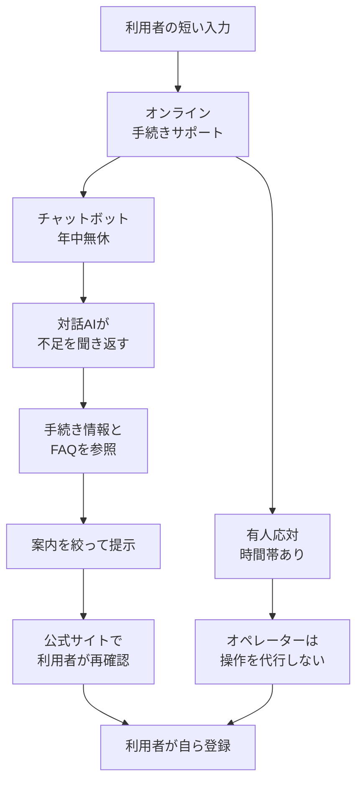

株式会社PKSHA Technologyは2026年9月24日、NTTドコモの契約・料金手続き窓口「オンライン手続きサポート」へ、PKSHA ChatAgentの対話AIエージェント機能を提供したと発表しました。短い入力に対して不足を聞き返し、手続き情報やFAQを参照して案内を絞ります。手続きの登録は、案内を見た利用者が各サイトで自ら行います。

この記事では、案内を絞る処理の流れ、窓口の利用条件、効果数値と制御パラメータの公開範囲を整理します。導入を公表しているのは、PKSHAの2026年9月24日の発表です。

*この記事の全体像。以下、順に解説します。*

## オンライン手続きサポートの対話AIとは

窓口そのものは、2023年3月27日に始まった既存のオンライン手続きサポートです。チャットボットと有人応対を併設します。開始の発表は2023年2月16日です。利用者は案内を見たうえで、各サイトの手続きを自ら登録します。

対象製品は、PKSHA AI SaaS「PKSHA ChatAgent」の対話AIエージェント機能です。機能の提供開始は2025年12月1日です。曖昧な問い合わせへの聞き返しと、対話全体を踏まえた回答生成を含みます。

### 聞き返す対象

ドコモ向けの動作例は「料金変更」です。対象の回線と、希望する変更時期を聞き返します。参照先は手続き情報とFAQです。2026年9月24日の発表は、短い入力から意図を絞りにくい従来チャットに対し、この聞き返しを具体例で書いています。2025年12月1日の機能は、企業ナレッジに基づく聞き返しと、対話全体を踏まえた回答生成です。

発表は、狙いを次のように書いています。

> 質問の仕方を工夫しなくても必要な手続きを探しやすくなることをめざします

「レスポンス安定化」オプションは、アクセス集中を見込んで処理能力をあらかじめ確保し、待ち時間を抑える、と発表にあります。

製品説明では、Webサイトへ数行のタグで導入でき、24時間365日のサポート体制構築を支援する、とあります。製品ページ（2026年9月29日取得）には、不足情報を対話で補完する意図理解、有人チャット連携、外部API、確認や手続きをフローにするアクションフローがあります。ドコモ向け発表が名指ししている参照先は、手続き情報とFAQです。

### 案内から登録までの流れ

公開資料から読める処理の流れは、次のとおりです。対話AIエージェントは案内を絞ります。登録の操作は利用者が行います。有人応対も代行操作をしません。

利用案内は、生成AIの結果を手続き前にドコモ公式HPで再確認する、と利用者へ求めています。確定前の再確認は、顧客向け文言として存在します。

### 顧客向けに公開されている条件

2026年9月29日に取得した顧客向けページから、設計に移せる仕様は次のとおりです。

| 項目 | 公開されている内容 | 出典 |
|---|---|---|
| 案内の主体 | 用件選択またはテキストから、AIがサポート方法を勧める | FAQ |
| 実行の主体 | 利用者。オペレーターの代行入力・代行操作はできない | FAQ、利用案内 |
| チャットボット | 24時間、年中無休 | FAQ、利用案内 |
| オペレーターチャット | 午前9:00〜午後10:00 | FAQ、利用案内 |
| ビデオ通話 | 午前9:00〜午後8:00。切断時、問い合わせ内容は引き継がれない | FAQ、利用案内 |
| 2023年開始時の時間 | ビデオ午前10:00〜午後7:00。チャット午前9:00〜午後8:00。AIチャットボット24時間 | ドコモ 2023-02-16 |
| 生成AI | 結果が適切でないおそれ。手続き前に公式HPで再確認。損害と第三者権利は同社が責任を負わない | 利用案内 |
| アクセス集中 | 受け付けできない場合がある | 利用案内 |
| 法人契約 | 利用できない | FAQ |
| 文字 | `<` `>` `&` `¥` `"` `'` など一部は使えない | 利用案内 |
| 有人のファイル | 画像（JPG/GIF/PNG）のみ。最大10MB | 利用案内 |
| 切断 | 無応答、総対応時間が一定時間超過、判読不能、目的外、ページ離脱、dアカウント認証、戻る、再読み込み、ネットワーク切替 | 利用案内 |
| 相談の費用 | 相談は無料。通信料は利用者負担。データ移行は専用の有料窓口 | FAQ |
| FAQの時点 | 「応対可能な範囲」の注記が2025年6月2日時点 | FAQ |
| 対象外の例 | 初期設定・操作説明はあんしん遠隔サポート。でんき新規のうち再点は対象外。スイッチングは対象 | FAQ |

対応相談の例は、機種変更、料金プラン変更、新規契約、契約内容変更、各種サービス、補償による交換、修理手続き、ドコモ光／ahamo光、ドコモでんき、ドコモ ガス、dカード、dポイントクラブです。

対応言語は日本語のみです。利用できるのは日本在住の利用者です。窓口には有人チャットとビデオがあります。

顧客向けFAQのサービス説明は、次のとおりです。

> 用件選択またはテキスト入力いただいた内容をもとに、AIがおすすめのサポート方法をご案内します

## 注意点

公開文の到達度は、聞き返しの具体例と、利用者自身による登録までに限られます。効果の倍率、聞き返しの上限、誤案内の回復は、ドコモ向けの一次発表にはありません。

### 効果として発表に無い数値

ドコモ向けの効果は「めざします」です。自己解決件数、待ち時間の実測、オペレーター削減件数は、2026年9月24日の発表にありません。人員についての文は「オペレーターは個別性の高い相談に時間を使えるようになる」という見立てです。失敗したときの移管条件ではありません。

「自己解決率を大幅に向上」「エスカレーション数を削減」は、2025年12月1日の製品発表の定性表現です。倍率と件数はありません。ドコモ窓口の測定結果としては書かれていません。

「累計7.5億回以上」は、PKSHA ChatAgentの製品紹介に繰り返される累計対話回数です。同じ段落が、2025年12月1日の製品発表、2026年3月25日の松井証券発表、2026年9月24日のドコモ向け発表、2026年9月28日のパナソニック プロジェクター＆ディスプレイ向け発表にあります。ドコモ窓口の成果でも、今回の対話AIエージェントだけの実績でもありません。ITmediaの本文は「7.5億回を超える」と書きます。

「レスポンス安定化」の公開定義は、生成AIの負荷で応答生成に時間がかかる場合があるため、処理能力をあらかじめ確保することです。確保量、目標遅延、適用開始時刻はありません。正答や人手移管の仕組みとしては書かれていません。

ドコモ向け発表は「提供した」と書きます。発表日と別の稼働開始日は、公開ページでは確認できませんでした。

### 聞き返しの上限と誤案内の回復

聞き返し回数の上限は、ドコモ向け発表、2025年12月1日の製品発表、2026年9月29日時点の製品ページには書かれていません。非公開の実装パラメータまで無い、とまでは言えません。公開仕様としては、上限も、打ち切りも、絞れないときの分岐も、ドコモ向け一次にはありません。

誤った手続きへ進んだあとの取消、実行前の確認ステップ、絞り切れないときの人手復帰は、ドコモ向け発表にはありません。製品ページの制御文は、複数候補から最適解を選び、曖昧な質問には聞き返して問題を特定し、誤回答や脱線を防ぐ制御と悪意ある入力への防御がある、という製品一般の説明です。しきい値、聞き返し回数、ドコモ窓口での有効化は書かれていません。

### 顧客向けFAQと生成AIの注意

上に引用したFAQのサービス説明に、聞き返しの説明はありません。時点注記「本情報は2025年6月2日時点のものです。」は、別項目「応対可能な範囲」の末尾にあります。注記の日付は、2026年9月24日の発表より前です。

同じ窓口の利用案内には「生成AIサービスの利用について」があります。質問内容によって適切な結果が表示されないおそれがあります。手続き前にドコモ公式HPで再確認します。本サービスに起因して生じた損害について、同社は責任を負いません。生成AIの利用（出力結果の利用を含む）に伴う第三者の権利侵害についても、責任を負わない、とあります。

### 有人応対の時間帯

有人応対には営業時間があります。夜間に案内を絞れなくても、チャットボットと同じ24時間の人手経路にはなりません。アクセスが集中している場合、問い合わせを受け付けできない場合があります。有人の総対応時間が一定時間を超えると、オペレーターが応対を切る場合があります。分数は書かれていません。

ビデオ通話は、切断時に問い合わせ内容が引き継がれません。製品ページには、自動チャットの途中から有人チャットへつなぐ機能があります。ドコモ案件でその機能が有効かは、発表にありません。

### 別案件の説明を移せない範囲

松井証券向け発表（2026年3月25日）は、回答生成に許可した情報源のみを使い、ハルシネーションを抑制する、と書きます。ドコモ向け発表の参照先は「手続き情報やFAQ」であり、許可リスト限定の同文はありません。非公開で同等の制約がある可能性は残ります。

オペレーターは操作を代行しません。製品ページのアクションフローが手続きを代理できる、という一般説明を、ドコモ窓口の実行主体へ移すことはできません。

運用AIエージェントは、2026年9月29日の製品ページで「※リリース予定」です。2025年12月1日発表で「今後リリースを予定」とされたタスク実行AIエージェントは、ドコモ向け発表の名指しに含まれません。2026年9月16日の「PKSHA AIタスク実行」は、PKSHA AIバックオフィス上の別エージェントです。

キーマンズネット（2026年9月27日 07:00、後藤大地）の見出し「正しく質問させるのをやめる」は編集の表現です。本文はPKSHA発表の再構成であり、聞き返し上限、回復手順、ドコモ名義のリリースは足していません。

2026年9月29日時点の公開検索では、NTTドコモ名義の当該ニュースリリースは見つかりませんでした。ニュースリリース一覧の全件照合はしていません。見つかったドコモ一次は別件です。2026年2月25日発表のAIエージェントは、2026年2月4日から商用利用を始めたモバイルネットワークの保守業務であり、この手続き窓口ではありません。技報 Vol.32 No.4（2025年1月号）のコミュニケーションAIは、ドコモ側の応対研究であり、PKSHA ChatAgentの提供発表とは別文献です。

損保ジャパンの事例ページには、別々の顧客発言があります。有人チャット接続は、1月2,427件から2月1,329件へ減った、とあります。年の記載はページにありません。1件あたりは、以前は2、3回で終わることが多かった状態から、10回程度やりとりしないと完了しないケースが増えた、という体感です。残件のすべてが10回になった、とは書かれていません。対象は2020年1月末に出した海外旅行保険の対話エンジンです。ページ末尾は「2026年5月7日時点の情報です」であり、測定日ではありません。同ページの月間リクエスト約6万7,000件（2020年8月）と、以前のエンジン約2,000件/月も同じ扱いです。ドコモの2026年9月の効果測定には使いません。この件数は、ドコモ窓口の人員配置を直接は否定しません。定型を対話側が受ければ人の対応が短くなる、という読みだけを弱めます。

候補として当たったSLAのURL（`https://www.bedore.jp/pdf/PKSHA_AIHelpdesk_SLA`）は、2026年9月29日時点で `PKSHA_AIHelpdesk_202410.pdf` へ向き、その先はPKSHAのHTMLトップになりました。PDF本文は読めず、製品名もAI Helpdeskであり、今回のChatAgent発表ではありません。検索断片の応答時間、稼働率、秒間リクエスト数は、この記事では採用しません。

### 公開検索で定まらなかった点

次の項目は、確認した公開ページにはありません。

- ドコモ社内の聞き返し上限、打ち切り、誤案内時の回復。
- ドコモ名義の導入リリースが、今回の検索の外に存在するか。
- レスポンス安定化の確保量、目標遅延、開始時刻。
- ドコモ案件で、許可した情報源だけを回答に使う制約があるか。
- FAQの顧客向け説明が、いつ聞き返しの仕様へ更新されるか。
- 有人の「一定時間」は何分か。
- 製品の有人チャット連携とアクションフローは、この窓口で有効か。
- リージョンとデータレジデンシー。

製品ページのシェア百分率は画像内にあり、テキストとしては取得していません。この記事には書きません。注記の企業数定義だけがテキストで読めました。「2024年9月までの1年間にPKSHAグループのAIソリューションおよび PKSHA AI Agents の販売実績があった企業数」です。

## 発注側が設計書に置く完了条件

「聞き返す案内が本番の発表にある」ことは、2026年9月24日の一次発表で言えます。「上限と回復が設計済みである」ことは、公開資料からは言えません。画面やAPIの体験設計では、入力の正しさを利用者へ寄せる範囲と、システムが不足を埋める範囲を、次の完了条件で分けます。

1. 聞き返しは、不足項目（対象、時期、手続き種別）に限る。回数の上限を設計書に書く。
2. 上限に達しても絞れないときは、人手へ渡す条件を書く。有人の営業時間外は、別経路（受付停止、翌営業日、自己申告フォーム）を書く。
3. 誤った手続きへ進んだときの回復（取消、一つ戻る、人へ戻す）を、案内の完了条件に含める。
4. 手続きの確定操作は、利用者が公式情報を再確認したあとに行う。エージェントが登録を代行するなら、その権限と確認画面を別仕様にする。
5. 本番運用の仕組みは、遅延（処理能力の事前確保）と正しさ（許可情報源、根拠表示、免責）を分けて契約する。待ち時間の安定を、正答の保証として読まない。
6. 効果指標は、その窓口の自己解決と誤案内を分母つきで取る。製品横断の累計対話回数を、導入先の成果として使わない。

ドコモの公開資料は、1の「聞き返す」と4の「確定前に公式情報を見る」までを、別々の文書で示しています。1の上限、2、3は発注側が足します。5は、公開されている本番オプションが遅延側であることを契約レビューの起点にします。

逆転条件は次です。ドコモまたはPKSHAが、この窓口の聞き返し上限、人手移管条件、回復手順、許可情報源を一次で公開した場合、完了条件の「未公開」という評価は取り消します。ドコモ名義の導入リリースが出た場合、「公表主体はベンダー」という限定を更新します。

## まとめ

オンライン手続きサポートは、2023年3月から続く窓口です。2026年9月24日のPKSHA発表は、そのチャットに対話AIエージェントを載せ、短い入力の不足を聞き返して案内を絞る、と書いています。登録は利用者が行い、オペレーターも代行しません。生成AIの結果は、手続き前に公式HPで再確認する、と利用案内が求めています。

自己解決の件数、聞き返しの上限、絞れないときの人手移管、誤手続きの回復、許可した情報源だけの回答は、ドコモ向けの公開仕様としては揃っていません。レスポンス安定化は待ち時間の話です。累計7.5億回は、この窓口の成果指標ではありません。発注側は、上限、時間外の別経路、回復、確定前の再確認、遅延と正しさの分離、分母つきの効果指標を、設計書の完了条件として置きます。

この記事が少しでも参考になった、あるいは改善点などがあれば、ぜひリアクションやコメント、SNSでのシェアをいただけると励みになります！

## 参考リンク

- [PKSHA Technology「NTTドコモの契約・料金手続き窓口に対話AIエージェント機能を提供」（2026-09-24）](https://www.pkshatech.com/news/20260924/)
- [同一本文のPR TIMES（2026年9月24日 11時00分）](https://prtimes.jp/main/html/rd/p/000000275.000022705.html)
- [PKSHA Technology「対話AIエージェント機能の提供開始」（2025-12-01）](https://www.pkshatech.com/news/20251201/)
- [PKSHA ChatAgent カスタマーサポート製品ページ（2026-09-29取得）](https://aisaas.pkshatech.com/chatbot/customer-support)
- [PKSHA ChatAgent 製品説明（2026-09-29取得）](https://aisaas.pkshatech.com/chatbot/)
- [NTTドコモ「オンライン手続きサポート」FAQ](https://tetsuduki-support.docomo.ne.jp/faq)
- [NTTドコモ「ご利用の注意事項」](https://tetsuduki-support.docomo.ne.jp/guide/)
- [NTTドコモ ニュースリリース「オンライン来店およびオンライン手続きサポートの提供開始」（2023-02-16）](https://www.docomo.ne.jp/info/news_release/2023/02/16_00.html)
- [NTTドコモ ニュースリリース「ネットワーク保守業務向けAIエージェント」（2026-02-25）](https://www.docomo.ne.jp/info/news_release/2026/02/25_01.html)
- [NTTドコモ テクニカル・ジャーナル Vol.32 No.4「コミュニケーションAI」](https://www.docomo.ne.jp/corporate/technology/rd/technical_journal/bn/vol32_4/002.html)
- [PKSHA Technology 松井証券向け発表（2026-03-25）](https://www.pkshatech.com/news/20260325/)
- [PKSHA Technology「PKSHAとトライアンフ、AI BPOサービスを開始」（2026-09-16）](https://www.pkshatech.com/news/20260916/)
- [パナソニック プロジェクター＆ディスプレイ向け発表（2026-09-28）](https://prtimes.jp/main/html/rd/p/000000274.000022705.html)
- [PKSHA 導入事例 損保ジャパン](https://aisaas.pkshatech.com/success/sompo_japan_01/)
- [ITmedia キーマンズネット 後藤大地（2026-09-27）](https://kn.itmedia.co.jp/kn/article/2609/27/2000001764/)
