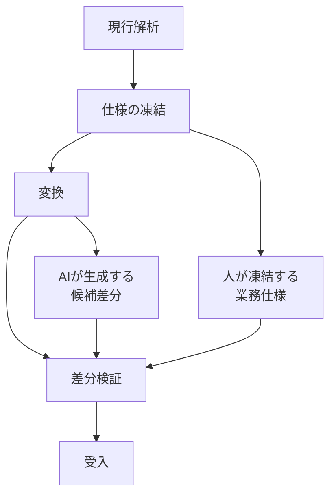
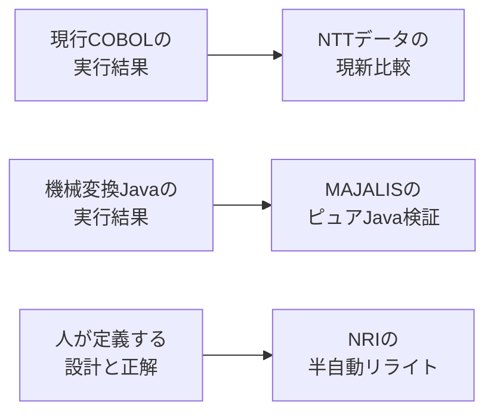

NTTデータ、野村総合研究所（NRI）、アクセンチュアは、COBOLで書かれた業務システムを、各社がピュアJavaまたは標準Javaと呼ぶJavaへ移す取り組みを公開しています。日経クロステックの公開リードは、争点を「AIをどの作業工程に、どこまで使うか」と置いています（森山徹、掲載日 2026-10-01）。本文は有料会員限定のため、工程の記述は公開リードと各社の一次資料によります。

この記事を読むと、移行を五つの工程に分け、各社の公開文がどの工程に何を書いているかを突き合わせられます。工程は、現行解析、仕様の凍結、変換、差分検証、受入です。

*この記事の全体像。以下、順に解説します。*

## COBOLのピュアJava化とは

ピュアJavaは、各社が標準的なJavaと呼ぶ成果物の呼び方です。NTTデータは、COBOLの制御構造が残るJavaを JaBOL と呼び、避ける対象に置いています。対象は変換ツールの一覧ではなく、移行の工程と、その工程を通る二種類の差分です。一方は、AIが生成する候補差分です。もう一方は、人が凍結する業務仕様です。

五つの工程は、次の順でつながります。

仕様の凍結で人が固定するのは、画面項目の型、画面以外で数値を扱う項目の型、丸め、例外取引、帳票、データの意味です。変換でAIが作るのは、その凍結に従ったJavaの候補、解析メモの下書き、テストの下書きです。差分検証は、候補が凍結した仕様と現行の実行結果のどちらに合うかを見る工程です。受入は、その一致と、あとから人が直せるJavaであることの確認です。

三社の公開文は、この五工程のどこにAIを置くかがずれています。

NTTデータは、2026年8月20日の DATA INSIGHT で、リビルド（設計から作り直す）の研究開発を「検証中」と書いています。品質の中心には、現新比較、機能適合性、COBOL構造を残さないJavaを置いています。2024年12月25日の記事は、ピュアJavaを出す前にJava向けの仕様を作る、と書いています。指針の例は、画面項目は String、画面以外で数値を扱う項目は範囲に応じた数値型、です。COBOLの仕様をそのままモデルに渡すと、固定長の詰めとバイト切り出しがJavaに残る、とも書いています。

NRIは、2024年11月14日のニュースリリースで、モダナイゼーションコンサルティングの実行フェーズに「AIリドキュメント」と「AIリライト」を置いています。AIリライトは、COBOLなどで書かれたプログラムをJavaへ半自動で変換する、という説明です。2026年2月16日の NRI JOURNAL は、生成AIの対象に現行分析、計画、設計、コーディング、テストケースの自動生成、古い言語の癖を残さない変換を含めています。

アクセンチュアの MAJALIS は、COBOL構造を残す機械変換と、AIでピュアJavaを生成する変換を選べる、と製品ページに書いています。ピュアJavaの確認は、機械変換したJavaとAI変換後のJavaに同じ入力を与え、実行結果を比べる手順です。テストの生成と実行、新旧の処理結果とデータの比較を、自動化の対象に含めています。ラックは、MAJALISの導入手順に、非互換機能の新規設計、現新比較テスト、結合テスト、総合テスト、データ移行を残しています。

## 三社の公開文が書く工程

次の表は、公開文から埋めたものです。「その工程をAIに閉じると書いていない」は、書いていないという意味です。書いていないことを、やっていないとは読みません。

| 工程 | NTTデータ | NRI | アクセンチュア MAJALIS |
|---|---|---|---|
| 現行解析 | 業務仕様、データ構造、有識者の知見を「設計コンテキスト」にまとめてからAIへ入れる、と2026年の記事が書く | AIリドキュメントでデータフローとワークフローを半自動で可視化する。JOURNALは現状分析の困難を最大の壁の一つに置く | 製品ページは、プログラムとデータの可視化にAIを使う、と書く。40年来の独自DBやフレームワークも含む、という説明 |
| 仕様の凍結 | Java向け仕様を先に作る（2024年12月25日）。画面項目は String、画面以外で数値を扱う項目は範囲に応じた数値型、という指針の例がある | リリースの本体は、EA組織、グランドデザイン、ロードマップ、ガバナンス。正解を人が決める枠はこちら | 公開の合格手順に、人が凍結した業務仕様という語は無い |
| 変換 | リビルドを検証中。変換率は動作と保守性の指標ではない、と明記。COBOL構造が残るJavaを JaBOL と呼んで避ける対象に置く | コンサルメニュー内の半自動「AIリライト」。JOURNALは癖を引き継がない自然なコード、と話す。変換率はリリースに無い | 機械変換のあと、AIで読みやすいピュアJavaへリファクタする、と製品ページが書く。方式はCOBOL構造を残す変換も選べる |
| 差分検証 | 変換前後の動作を突き合わせる現新比較。機能適合性を測定の中心に置く | JOURNALはテストケースとデータの自動生成を検証・適用中と書く。現行本番との突合手順の詳細はリリースに無い | ピュアJavaの基準は機械変換Javaの実行結果。カバレッジは機械変換後Javaの変換漏れ、命令網羅、分岐網羅 |
| データ検証 | 2026年の記事が中心に置くのは、現新比較と機能適合性 | リリース本文が中心に置くのは、EA組織とグランドデザイン | 製品ページは「資産分析から新旧データ検証まで」を自動化対象に含める。ブログはデータ変換と一致検証の段を置く。ラックはデータ移行をテストと移行の工程に残す |
| 受入・例外 | 暗黙知はコードに無い、と書く。例は、特定取引先の丸めと、年次バッチだけで意味を持つフラグ。大規模な実開発での完遂は検証中 | JOURNALは、合意形成と人と組織を、ツールの外の壁として話す | ブログは、特殊なデータが自動化から漏れる場合がある、と書く。ラックは非互換機能の新規設計と総合テストを工程に残す |

合格に使う基準だけを抜き出すと、比較の相手が三つに分かれます。

NTTデータの現新比較は、変換前後の動作を突き合わせる、と記事が書いています。比較の相手は、稼働中のCOBOLです。MAJALISのピュアJava検証は、機械変換したJavaとAIが変換したJavaの一致です。NRIの公開文は、半自動変換の前に可視化とグランドデザインを置いています。三社の公開文に、コードに書いていない例外をAIが確定した、という記述はありません。

## 注意点

販売文の到達宣言と、一次資料の表の数は、分母が違います。ここにあるパーセントを、基幹系の完了率として読まないでください。

| 言明 | 一次で確認できる中身 | 読み方 |
|---|---|---|
| MAJALIS製品ページの「100%」 | 「国内対応。開発も技術者もすべて国内で完結」（2026年10月2日時点の製品ページ） | 変換率ではない |
| 同ページの「¥0」 | 「ツール利用は無料。費用はカスタマイズ分のみ」 | プロジェクト費用がゼロという文ではない |
| 同ページの「3億＋」 | 「過去10年の累計変換ステップ」「10年以上、累計3億ステップ超」 | ベンダーの自己申告。製品ページに監査報告書への参照は無い |
| 金融ブログ 2025年8月29日の変換率100% | 「変換率100%を実現することで、手作業によるミスを完全に排除し、品質を担保します」 | 分母の定義はブログに無い。品質の完了の説明に変換率を使っている |
| リーフレットの「おおよそ100%」 | 「COBOL、PL/I、JCLからおおよそ100%の変換率」。続く文は、棚卸、分析、テスト自動化、データ移行のツールが別にある、と書く | パーセントの主語は言語変換 |
| 同ブログの完全自動化 | ソース変換から現新比較テストまでを完全自動化する、と書き、別の段で「まれに自動化できない特殊なデータ」があるとも書く | 例外業務や受入試験を100%の外とは書いていない。特殊なデータは外に出している |
| 某保険の生産性37%向上 | メインフレームの開発保守と比べたDevOps環境の実測、とブログが書く | 自己申告。測定期間、母数、生産性の定義は無い。JaBOLの保守性そのものの測定値としては書いていない |
| 事例の規模 | JFEスチール約5,000万ステップ、三菱重工業1,500万ステップ超、長野県信用組合は2027年中の稼働予定。ハイテクはCOBOLからJavaへ902本・19か月、製造はCOBOLからJavaへ9,060本・20か月、地方自治体はPL/IからCOBOLへ10,500本・12か月 | いずれもアクセンチュアの自己申告。地方自治体の例はJava化の事例ではない |
| NTTデータの「移行成功率は約15%」 | 注は Factory Legacy-Bench（2026年4月、GitHub）。READMEは、12のモデルとエージェントの組合せでの全体の通過率を16.9%から42.5%と書く。同じモデルは Terminal-Bench 2 と SWE-bench Verified で70%超、ともある | 約15%は、移行タスクだけの通過率としてはREADMEに無い。全体の下限に近い言い換えである。根拠の数字には使わない |
| 失敗の97%でAIが成功と自己判定 | README: "In 97% of failures, the agent believes it has solved the task." | 一次と一致する。NTTデータの「サイレント失敗」はこの文を指す |
| バグ修正、実装、移行の倍率 | READMEは、バグ修正が実装のおおよそ2倍、実装が移行のおおよそ2倍、と書く | 移行が最も低い、とだけ言える。移行のパーセントは書かれていない |
| COBOLの割合 | READMEの表では、COBOLがベンチマークの46%、Java 7が32% | ベンチマーク全体がCOBOL移行ではない |
| NTTデータの「6割超」「大企業は7割超」 | 記事は、経産省「レガシーシステムモダン化委員会総括レポート」（2025年5月28日）のプレスURLを注に置く。プレス本文にはこの割合が無い | 委員会PDFの該当文は未確認。割合の文はNTTデータ記事の要約にとどまる。確認できるまで根拠にしない |
| 「撤去案件の7割超が意図した成果を得られない」 | NTTデータの記事が「業界アナリスト」とだけ書く | 出典の名前、調査年、母数は記事に無い。根拠にしない |
| NRIの「テストは全体の約3割以上」 | NRI JOURNAL が IPA の統計として記載 | 原表は照合していない。割合の根拠にはしない |
| NRIの「大幅な負担軽減」 | 金融系プロジェクトで、人手と比べて大幅、と対談が話す。2024年7月に試行開始 | 割合は無い |

2026年9月の Factory スナップショットに最高60%という別記事があります。2026年4月の12組とタスク集合が同じかは、公開のREADMEだけでは確認できません。4月の16.9%から42.5%の置き換えには使いません。

## 発注書に書く二つの完了条件

基幹系の発注では、変換率を完了条件にしません。AIが生成してよいのは、解析の下書き、Javaの候補、テストの下書きです。人が凍結するのは、業務仕様と例外です。受入の合格は、凍結した仕様に対する現新の一致と、あとから保守できるJavaであることの確認です。機械変換したJava同士の一致は、その合格の代わりにしません。

完了条件は、次の二つです。

1. 凍結した業務仕様について、現行と同じ入力に対する結果が一致する。現行の欠陥を残すか直すかは、凍結のときに人が決める。
2. 生成されたJavaが、COBOLの制御構造を残したままのJavaになっていない。NTTデータが機能適合性と別に置いている、保守性の確認に相当する。

変換率、コンパイルが通った割合、国内対応の100%、機械変換JavaとAI変換Javaの一致は、この二つの代わりにしません。機械変換同士の一致は、ピュアJava化の回帰テストとしては使えます。現行業務の受入としては使いません。

この二つは、三社の公開手順をそのまま写したものではありません。MAJALISのピュアJavaの公開合格基準は、人が凍結した業務仕様ではなく、機械変換結果との一致です。凍結した仕様を等価性の相手にするのは、発注側が契約で置く条件です。基幹の勘定や決済で、機械変換Javaだけを受入の相手にすると、現行と違う挙動が両者に残っても合格になります。速度を優先する周辺系なら、機械変換を先の契約にし、ピュアJava化は保守性を改善する別契約にします。

同じアクセンチュアの2025年8月29日のブログは、変換率100%を品質の説明に使っています。完了条件から変換率を外す判断と、この販売文は競合します。契約では、販売文のパーセントを採用しません。

テストとデータ検証を、AIに入れていない工程と一括では言えません。MAJALISは、新旧データ検証とテストの自動化を書いています。NRI JOURNALは、テストケースの自動生成を書いています。人が残すのは、合格の判定と、コードに無い例外の凍結です。

NRIを、現行分析だけの会社とは置けません。2024年11月14日のリリースに、半自動のAIリライトがあります。変換率付きのピュアJava製品を発売した、というリリースは、ニュースリリースの範囲では見つかっていません。正解を人が決める枠は、リリースのEAとグランドデザイン側にあります。

「移行成功率は約15%」は、上の完了条件の支持数字には使いません。一次は、全体の通過率16.9%から42.5%です。支持に残るのは、失敗の97%でエージェントが成功と自己判定する、という文です。人が一行ずつ見られない、というNTTデータの問題設定と向きが合います。

ピュアJavaが本番で壊れ、JaBOLへ戻した実名の事例は、公開範囲では確認できていません。上の完了条件は、事故の実証ではありません。公開文の食い違いから、契約に書ける手続きです。

ベンダーの順位は、この範囲ではまだ決まりません。日経クロステックの本文が、上の工程表と違う分担を書いている可能性は残ります。経産省の委員会PDFが、6割超や7割超の文を別の数字に変える余地もあります。工程を五つに分けることと、完了条件を二つに置くことは、その割合がどちらでも変わりません。

公開文との対応は、次のとおりです。

- NTTデータの2026年の記事は、現新比較と、保守性と、暗黙知に近い位置にあります。状態は検証中であり、完遂済みの手法としては読みません。
- NRIの公開文は、現行の可視化と、半自動変換と、テストの下書きを、一つのコンサルに置いています。変換率の完了定義は出ていません。
- MAJALISの公開文は、テストと新旧データ検証を自動化の対象に含めています。ピュアJavaの合格相手は、機械変換Javaです。

日経の公開リードが問いを工程の範囲に置いていること、NTTデータが変換率では動作と保守性を測れないと書いていること、リーフレットの100%が言語変換の文であること、ラックが非互換の新規設計と総合テストを自動変換の外に残していることは、二つの完了条件と向きが合います。

## ベンダーに聞く四つの問い

発注の前に、ベンダーへ聞くことは四つで足ります。

1. 等価性の相手は、稼働中のCOBOLか、機械変換Javaか、人が書いた仕様か。
2. 提示されたパーセントの分子と分母は、言語変換か、テストか、データ移行か、例外取引か。
3. コードに無い丸め、例外、帳票、パック10進やマルチレイアウトの意味は、誰が凍結するか。
4. 生成してよい差分の一覧と、承認まで変えてはいけない差分の一覧は何か。

1の答えが機械変換Javaだけなら、その一致は回帰テストに使い、現行業務の受入には別の相手を契約へ書きます。2の答えが言語変換なら、そのパーセントは受入の完了条件から外します。3の凍結者が空欄なら、仕様の凍結は発注側の工程として残します。4の一覧が無い状態で、変換率だけを完了条件にしないでください。

## まとめ

COBOLのピュアJava化を基幹系で発注するときは、変換率を完了条件にしません。AIが生成してよいのは、解析の下書き、Javaの候補、テストの下書きです。人が凍結するのは、業務仕様と例外です。受入は、凍結した仕様に対する現新の一致と、あとから保守できるJavaであることの確認です。

機械変換したJavaと、AIが変換したJavaの一致は、ピュアJava化の回帰テストには使えます。現行業務の受入の代わりにはしません。ベンダーには、等価性の相手、パーセントの分子と分母、コードに無い意味の凍結者、生成してよい差分と凍結する差分の四つを聞きます。

この記事が少しでも参考になった、あるいは改善点などがあれば、ぜひリアクションやコメント、SNSでのシェアをいただけると励みになります！

## 参考リンク

- [日経クロステック、森山徹「NTTデータ・NRI・アクセンチュアが『COBOLのピュアJava化』で競う」（掲載日 2026-10-01、本文は有料会員限定）](https://xtech.nikkei.com/atcl/nxt/column/18/03770/092600003/)
- [NTTデータ、高須隼太、師芳卓、坂田祐司、岡田譲二「『変換できた』は『動く』ではない」（2026-08-20）](https://www.nttdata.com/jp/ja/trends/data-insight/2026/082001/)
- [NTTデータ、師芳卓「生成AIによる脱COBOLで考慮すべき再設計指針」（2024-12-25）](https://www.nttdata.com/jp/ja/trends/data-insight/2024/1225/)
- [経済産業省プレス「レガシーシステムモダン化委員会総括レポート」（2025-05-28）](https://www.meti.go.jp/press/2025/05/20250528003/20250528003.html)
- [Factory AI, Legacy-Bench README](https://github.com/Factory-AI/legacy-bench/blob/main/README.md)
- [NRI「モダナイゼーションコンサルティングサービスを提供開始」（2024-11-14）](https://www.nri.com/jp/news/newsrelease/20241114_1.html)
- [NRI JOURNAL、宇津亮太、岩松航輝「AI時代のレガシーモダナイゼーション」（2026-02-16）](https://www.nri.com/jp/media/journal/20260216.html)
- [アクセンチュア MAJALIS 製品ページ](https://www.accenture.com/jp-ja/services/cloud/product-platform-engineering/majalis)
- [アクセンチュア金融ブログ「革新的リライトツール MAJALIS が実現する完全自動化モダナイゼーション」（2025-08-29）](https://financialservicesblog.accenture.com/fully-automated-modernization-achieved-by-the-innovative-rewrite-tool-majalis?lang=ja_JP)
- [アクセンチュア MAJALIS リーフレット PDF](https://www.accenture.com/content/dam/accenture/final/accenture-com/document-4/Majalis-Leaflet.pdf)
- [ラック「MAJALISモダナイゼーションサービス」](https://www.lac.co.jp/system/majalis.html)
