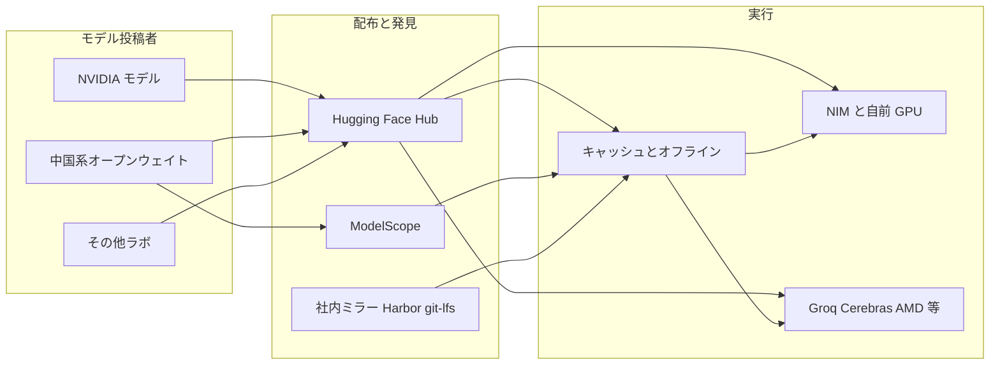

NVIDIA は 2026-09-02、Hugging Face, Inc. を買収する確定契約を結びました。
CEO Jensen Huang のブログは対価を **$12,930,300,000** と書いています。
Form 8-K は株主への支払を約 **$11.9 billion**（調整あり）、入社従業員向け株式リテンションを上限約 **$1.0 billion** に分けて開示します。
ブログ額と 8-K の二項を加算して一致させる読み方はしません。
クローズは **2027 年前半** を見込み、必要な規制承認が停止条件です。
支配はまだ移転していません。

発注側が今決めるべきなのは株価評価ではありません。
利用中のモデルとデータセットを、どの revision で再現できるかです。
本稿は取引条件、中立性約束の限界、Hub のロックイン面、代替レジストリの系統、今取る判断をこの順で整理します。

:::message
本稿の一次ソースは Form 8-K（提出 2026-09-03）、[NVIDIA ブログ](https://blogs.nvidia.com/blog/nvidia-to-acquire-hugging-face/)、Hugging Face TOS / Hub docs です。売上倍率に使う ARR など二次報道の数値は、使う箇所で明示します。
:::


*この記事の全体像。以下、順に解説します。*

## 取引は確定したが支配は移っていない

契約日は 2026-09-02 です。
提出は 2026-09-03、署名は CFO Colette M. Kress です。
クローズ前に「支配下に入った」と書くのは法的に不正確です。

| 項目 | 一次の書き方 | 出典 |
|---|---|---|
| 契約日 | 2026-09-02 に definitive agreement | [8-K Item 8.01](https://www.sec.gov/Archives/edgar/data/1045810/000104581026000078/nvda-20260902.htm) |
| 提出 | 2026-09-03、CFO Colette M. Kress | 同 8-K 署名頁 |
| 株主対価 | approximately $11.9 billion、調整あり | 同 8-K |
| リテンション | equity-based、上限 approximately $1.0 billion | 同 8-K |
| ブログ総額 | $12,930,300,000 | [NVIDIA Blog 2026-09-03](https://blogs.nvidia.com/blog/nvidia-to-acquire-hugging-face/) |
| クローズ | first half of 2027 | 同 8-K |
| 条件 | customary closing conditions と required regulatory approvals | 同 8-K |

Hugging Face CEO Clément Delangue の [X 投稿](https://x.com/ClementDelangue/status/2095482998674112733) は同じ $12,930,300,000 を使い、話を持ちかけたのは Hugging Face 側だと書いています。
創業者とチームは残留する、と述べます。
絵文字 🤗（U+1F917）の十進が 129303 であることは Unicode 上確かです。
金額をそのコードに合わせた、という意図の帰属は [PC Watch](https://pc.watch.impress.co.jp/docs/news/2138142.html) の二次です。

売上倍率の話に使う ARR 約 $1.5億 は The Information 経由の [Reuters 報道](https://www.reuters.com/technology/nvidia-talks-acquire-hugging-face-13-billion-deal-business-insider-reports-2026-08-27/) です。
独占の証明としては使いません。

ブログが示す規模指標は次です。

- 利用者 18 million 超
- モデル 3 million 超
- データセット 500,000
- アプリケーション 1 million
- 企業 200,000 超
- NVIDIA 自身の投稿は 500 超モデル、250 超オープンデータセット。largest contributor と自称

これらは発見面の大きさの説明です。
本番供給の唯一性の証明ではありません。

## 変わるのは所有予定であり物理的唯一性ではない

買収後も、重みそのものは投稿者の Git オブジェクトです。
変わるのは運営主体、発見面、レート制限、推論の既定導線です。



Hub は発見のハブであり、本番の唯一ソースではありません。
本番が毎回 `from_pretrained("org/model")` で `main` を取る設計だけが、運営主体の変更に直接晒されます。

NVIDIA NIM 自身が `hf://` に加え `modelscope://`、`s3://`、`gs://`、ローカルディレクトリをソースにします。
公式のモデル取得面は [NIM の model-free ドキュメント](https://docs.nvidia.com/nim/large-language-models/latest/deployment/model-free-nim.html) にあります。
「Hub を握れば NIM 供給を握る」は、この取得面とも一致しません。

NVIDIA は 2023 年 Series D の投資家であり、Hub 上の最大級投稿者です。
NIM は買収前から Hub に載っています。
Series D の金額と評価は二次（[TechCrunch 2023-08-24](https://techcrunch.com/2023/08/24/hugging-face-raises-235m-from-investors-including-salesforce-and-nvidia/)）です。

## 中立性約束は利用者の請求権ではない

Huang ブログは次を約束します。

- Hub は AI エコシステム全体のオープンなプラットフォームであり続ける
- モデル、フレームワーク、クラウド、推論プロバイダ、計算基盤は利用者が選ぶ
- Hugging Face 上の開発とデプロイに NVIDIA 計算は必須にしない
- マルチクラウドとマルチアクセラレータを続ける

8-K はこれを証券提出に落とします。

> keep Hugging Face's platform open, consistent with Hugging Face's existing practices
> … upload and download models and datasets of their choosing and to support other silicon vendors

提出時点の開示としては残ります。
同 8-K の Forward-Looking Statements は post-closing plans をセーフハーバー対象にしており、後の運用変更が直ちに虚偽記載になるわけではありません。
拘束の受益者は株主と SEC であり、Hub 利用者の請求権にはなりません。
「existing practices と consistent」は運用裁量を残します。
検索順位、料金、Inference Providers の既定（公式は `:fastest`）、有料枠の相対表示は 8-K にありません。

[Hugging Face TOS](https://huggingface.co/terms-of-service)（発効 2022-09-15）は別の層です。

- サービスは予告なく modify / suspend / discontinue できる
- Hugging Face は同意なく affiliate や successor へ権利義務を譲渡できる
- 公開 Repository の Content は他 User へ永続・取消不能のライセンスを付与する
- 個別の OSS ライセンス表記は残す
- 利用は米輸出管理と制裁法に従う
- 準拠法はニューヨーク州

クローズ後、契約相手は TOS 上すでに successor へ移り得ます。
中立性は「TOS が保証する権利」ではなく「8-K と当局条件を観測する対象」です。

8-K は中国由来オープンモデルへの政府規制を買収固有リスクとして挙げています。
途絶シナリオの主語は、NVIDIA の恣意より政府規制です。
「中立性を額面どおり信用して何もしない」は弱い判断です。
「所有が移る前に供給が途絶する」も過剰です。

歴史の当てはめにも注意が要ります。
NVIDIA による Arm 買収は、FTC が [2021-12-02 に垂直合併として提訴](https://www.ftc.gov/news-events/news/press-releases/2021/12/ftc-sues-block-40-billion-semiconductor-chip-merger) し、2022-02-07 に当事者が断念、FTC は [2022-02-14 に声明](https://www.ftc.gov/news-events/news/press-releases/2022/02/statement-regarding-termination-nvidia-corps-attempted-acquisition-arm-ltd) を出しました。
当時の市場はチップ IP ライセンスです。
Hub 配布面への当てはめは未検証です。

未解決の問いは次です。
アクションは止めません。
確信度を下げます。

- 合併契約に、利用者や競合シリコンが執行できる中立条項はあるか
- 当局が開放維持を同意審決の条件にするか。NVIDIA/Arm 型で止まるか
- 中国由来モデルへの米規制が、Hub のカタログを先に削るか
- Inference Providers のパートナー表と `:fastest` 既定はクローズ後も残るか
- 本番トラフィックのうち、毎回 Hub に出る割合は組織ごとに不明である

## Hub が変えるロックイン面

公式ドキュメント上、企業利用で効くレバーは次です。
取得日は 2026-09-04 です。

| レバー | 公式の現状 |
|---|---|
| オブジェクト | Git。revision は branch / tag / **40 hex commit**。Inference Endpoints の Advanced Setup に **Revision**（commit 指定可、既定は最新） |
| オフライン | `HF_HUB_CACHE`、`HF_HUB_OFFLINE=1`。Resolver URL の `/resolve/` がライブラリの実ダウンロード経路 |
| レート制限（抜粋） | 5 分固定窓。Free は API 1,000 / Resolver 5,000 / Pages 200。Team は 3,000 / 20,000 / 400。Enterprise は 6,000 / 50,000 / 600。超過は HTTP 429。[rate-limits](https://huggingface.co/docs/hub/rate-limits) の注記は September '25 |
| データ所在 | 無償は常に US。Team 以上で US または EU。Asia-Pacific と GCC は Coming soon。[Storage Regions](https://huggingface.co/docs/hub/storage-regions) |
| 企業統制 | Team 以上で SSO、監査ログ、公開 repo 無効化、データレジデンシー。Hub 全体の IdP 強制は Enterprise Plus |
| 料金表 | Team $20/user/月、Enterprise from $50/user/月、Plus は個別。TOS は次期サブスクリプションから価格調整可。[Team and Enterprise](https://huggingface.co/docs/hub/enterprise-hub) |

OSS ライブラリ（transformers、datasets、huggingface_hub）は Apache-2.0 でフォークできます。
クライアントは移せます。
Hub の Resolver URL と発見 UI は移せません。
Resolver に結合したツールチェーンは、URL をフォークできません。

## 本番は branch main ではなく 40 文字 commit で止める

取引と独立に今やる作業は、再現性の穴を塞ぐことです。
本番と評価で使うモデルとデータセットを、branch `main` ではなく **40 文字 commit**（または上流の不変 digest）でロックファイル化します。
そのうえで `HF_HUB_OFFLINE=1` で一度再現します。

次は、revision を環境変数から渡し、オフライン解決だけを試す最小例です。
キャッシュに無い revision では失敗します。
失敗は「Hub に出た」証拠として記録します。

```python
import os
from huggingface_hub import hf_hub_download

os.environ.setdefault("HF_HUB_OFFLINE", "1")

repo_id = os.environ["MODEL_REPO_ID"]
revision = os.environ["MODEL_REVISION"]
filename = os.environ.get("MODEL_FILENAME", "config.json")

if len(revision) != 40 or any(c not in "0123456789abcdef" for c in revision):
    raise SystemExit("MODEL_REVISION must be a 40-hex commit")

path = hf_hub_download(
    repo_id=repo_id,
    filename=filename,
    revision=revision,
)
print(path)
```

gated repo とトークン依存は、この確認と同時に列挙します。
CI が毎回 Hub の `main` を解決しているなら、所有予定の変更を待たず再現性が欠けています。

30 日以内には、社内の取得経路を棚卸しします。

- Hub 直結 CI
- Inference Endpoints
- NIM `hf://`
- ローカルキャッシュ
- オブジェクトストレージ
- gated repo とトークン依存

未クローズを理由に pin を先送りしません。
再現性の話だからです。

## 代替レジストリは系統を混ぜない

完全な Hub 代替は少ないです。
用途を混ぜると判断を誤ります。

| 系統 | 例 | pin の単位 | 向く用途 |
|---|---|---|---|
| Git commit | Hugging Face Hub、ModelScope | commit / tag | 重みとデータセットの再現 |
| ファイルハッシュ | Civitai SHA256 | ファイル | 画像系。LLM Hub の代替ではない |
| OCI digest | Harbor | sha256 digest | 社内成果物。tag は Immutability Rules が必要 |
| 整数 version | MLflow、Kaggle | version 番号 | 実験レジストリ。コンテンツアドレスではない |
| ベンダー version | Replicate 64 hex、Ollama `@digest` | ベンダー ID | 推論 SaaS またはローカルランタイム |
| 退役 | GitHub Models | なし | 2026-07-30 完全退役。代替に数えない |

[GitHub Models](https://docs.github.com/en/github-models/about-github-models) は 2026-07-30 に退役済みです。
公開の代替レジストリには使えません。

ModelScope は Qwen 等の二重配布先として実在します。
`modelscope.cn` の利用規約は中国法、杭州西湖区人民法院、mainland China 向けです。
国際面 `modelscope.ai` はシンガポール法です。
NIM の `modelscope://` がどちらのホストを指すかは、当該 NIM ページには書いていません。
EU/US の residency 要件を公式オプションとして満たす記述は、本稿の確認範囲では見当たりませんでした。

代替の位置づけは次で足ります。

- 中国モデルは ModelScope 側の revision も記録する
- 汎用の社内正本は Harbor または git-lfs ミラー
- Ollama は開発者ローカル用
- GitHub Models は使わない
- Hub を捨てて ModelScope だけに寄せない（準拠法が入れ替わるだけである）

公開の hash pin に近い代替は、ModelScope と自己ホスト（Harbor digest、git-lfs、HF キャッシュ）です。

非 NVIDIA 再現も 1 本通します。
同一 commit の重みを、CUDA 以外（AMD ROCm、CPU、Groq/Cerebras 経由の API のいずれか、組織が実在する経路）で動かします。
失敗しても「できない」ではなく、失敗条件を記録します。

## クローズまで観測する指標

観測は四半期で足ります。
倍率ニュースを独占証明として扱いません。

- Inference Providers 公式パートナー表から非 NVIDIA が落ちたか
- Team/Enterprise の料金と Resolver クォータ
- 検索とカード UI で NVIDIA / NIM が既定化していないか
- 8-K リスクどおり、中国由来モデルの掲載が規制で減っていないか

逆転条件は、当局が取引を止めるか、開放と他シリコン支援を執行可能な条件にすることです。
その場合も commit pin は残します。
再現性の話だからです。

## まとめ

供給網の**所有予定**は変わります。
供給網の**物理的唯一性**は変わりません。
今やるべきなのは「買収だから緊急プロジェクト」ではなく、再現性の穴を先に塞ぐことです。

- 確定契約は締結済み、クローズは未了（H1 2027、規制承認待ち）
- ブログ総額と 8-K の株主対価・リテンションは別の書き方であり、加算して一致させない
- 中立性約束の受益者は株主と SEC であり、TOS は予告なき変更と successor への譲渡を許す
- Hub は Git であり、40 文字 commit とオフラインキャッシュが公式手段である
- 本番が晒されるのは、毎回 `main` を解決する取得設計である

観測指標を決め、pin とオフライン再現だけは取引と独立に今やります。

この記事が少しでも参考になった、あるいは改善点などがあれば、ぜひリアクションやコメント、SNSでのシェアをいただけると励みになります！

## 参考リンク

一次:

- [NVIDIA, Form 8-K, Date of Report 2026-09-02, filed 2026-09-03](https://www.sec.gov/Archives/edgar/data/1045810/000104581026000078/nvda-20260902.htm)
- [Jensen Huang, “NVIDIA to Acquire Hugging Face”, NVIDIA Blog, 2026-09-03](https://blogs.nvidia.com/blog/nvidia-to-acquire-hugging-face/)
- [Clément Delangue, X, post 2095482998674112733](https://x.com/ClementDelangue/status/2095482998674112733)
- [Hugging Face Terms of Service, effective 2022-09-15](https://huggingface.co/terms-of-service)
- [Hub rate limits](https://huggingface.co/docs/hub/rate-limits)
- [Storage Regions](https://huggingface.co/docs/hub/storage-regions)
- [Team and Enterprise plans](https://huggingface.co/docs/hub/enterprise-hub)
- [FTC, NVIDIA/Arm 提訴, 2021-12-02](https://www.ftc.gov/news-events/news/press-releases/2021/12/ftc-sues-block-40-billion-semiconductor-chip-merger)
- [FTC, NVIDIA/Arm 断念に関する声明, 2022-02-14](https://www.ftc.gov/news-events/news/press-releases/2022/02/statement-regarding-termination-nvidia-corps-attempted-acquisition-arm-ltd)
- [GitHub Models retirement](https://docs.github.com/en/github-models/about-github-models)
- [NVIDIA NIM model sources](https://docs.nvidia.com/nim/large-language-models/latest/deployment/model-free-nim.html)

二次（数値に使用した場合は本文でマーク済み）:

- [Reuters, 2026-08-27（The Information の $12.9B 合意報道と ARR）](https://www.reuters.com/technology/nvidia-talks-acquire-hugging-face-13-billion-deal-business-insider-reports-2026-08-27/)
- [PC Watch, 2026-09-03](https://pc.watch.impress.co.jp/docs/news/2138142.html)
- [TechCrunch, 2023-08-24（Series D）](https://techcrunch.com/2023/08/24/hugging-face-raises-235m-from-investors-including-salesforce-and-nvidia/)
