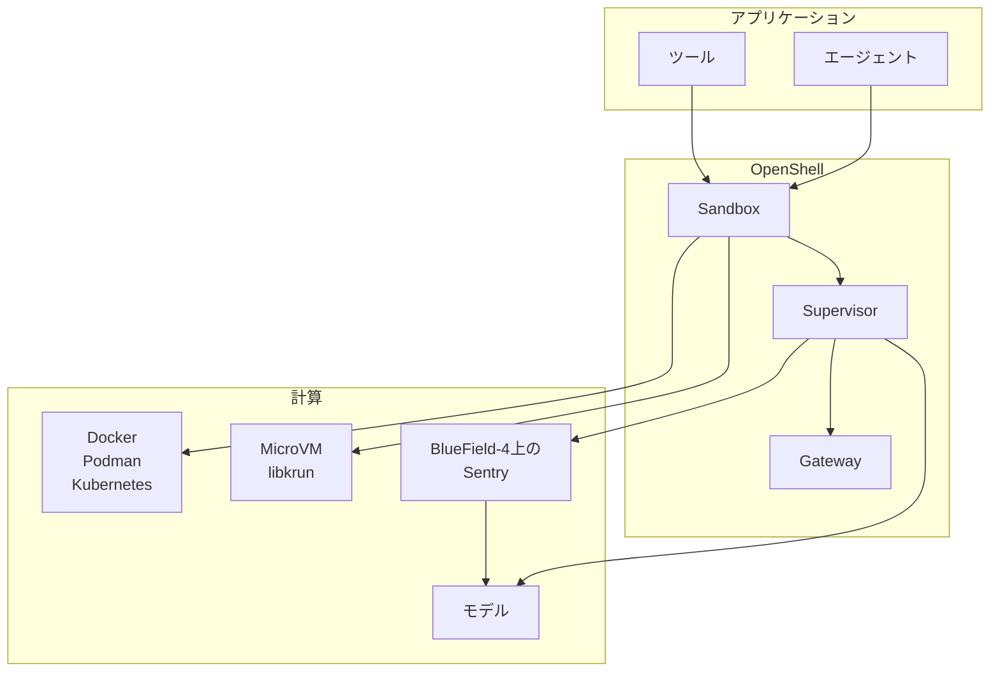

2026年9月28日、NVIDIA は Open Agent Safety Platform を発表しました。
構成は、オープンソースの実行環境 [NVIDIA OpenShell](https://github.com/NVIDIA/OpenShell) と、BlueField-4 DPU 上の参照設計 NVIDIA Sentry です。
OpenShell はエージェントの作業をサンドボックスに入れ、ファイル、プロセス、外向き通信をポリシーで扱い、資格情報をワークロードの外に置きます。
Sentry は、エージェントから見えない位置で振る舞いを監視する帯域外のウォッチドッグとして説明されています。

この記事では、[Newsroom](https://nvidianews.nvidia.com/news/open-agent-safety-platform)、技術ブログ、OpenShell ドキュメント（Latest は v0.1.2）に沿って、作業が止まる層を整理します。
読み終わると、評価環境で書くポリシーの既定値と、モデル経路をハードウェアで止めたいときの条件を、別の文章にできます。


*この記事の全体像。以下、順に解説します。*

## Open Agent Safety Platformとは

Newsroom は、このプラットフォームを OpenShell と Sentry の組として書いています。
組織は要素を要件に応じて選べます。
入手先の段落に名前があるのは OpenShell と skills であり、GitHub と開発者向けページです。
OpenShell は現在広く入手できる、と NVIDIA は書いています。

リポジトリ `NVIDIA/OpenShell` のライセンスは Apache-2.0 です。
作成は 2026-02-24 で、アーカイブではありません。
2026-10-01 時点の latest リリースは `v0.1.2`（公開 2026-09-28T03:58:00Z）です。
ドキュメントの Latest も v0.1.2 です。
同じ時点の star は約 1.3 万です。

### Gateway、Supervisor、Sandbox

構成は Gateway、Supervisor、Sandbox の三つです。
Sandbox はカーネルのファイルとプロセスの境界に入ります。
外向き通信は Supervisor を経由します。
Gateway がフリートとポリシーを扱います。

ポリシーは YAML です。
OPA の Rego にコンパイルされます。
監査は OCSF です。
ファイルシステム、Landlock、プロセスは起動時に固定されます。
ネットワーク規則とミドルウェアは実行中に差し替えられます。

資格情報はワークロードの外にあります。
承認されたエンドポイントへのリクエストにだけ付きます。
Gateway が資格情報を保持します。
Supervisor がポリシーと宛先の結び付きを確認し、承認されたリクエストに追加します。
0.1.0 以降、新しい provider 資格情報は gateway の credential driver に入ります。
既定の保管は暗号化データベースです。

ネットワーク規則が無い既定では、外向きは拒否されます。
接続した provider が規則を足すことがあります。
ループバック、リンクローカル、クラウドメタデータ `169.254.169.254` は、ネットワークポリシーの外向き宛先としては許可されません。
サンドボックス内のループバック待受への接続は、この禁止の対象外です。

Policy advisor は既定でオフです。
有効にすると、エージェントはネットワーク規則の追加を提案できます。
提案だけではポリシーは変わりません。
ファイルシステム、Landlock、プロセスは提案で変えられません。
現行ドキュメントは “network access only” です。

Policy prover（`openshell-prover`）は、利用者が書いた境界ポリシーに対して候補を検査します。
合格は、検査した範囲で候補が境界を超えないことです。
検査の対象は、ファイルシステム、プロセス識別子、Landlock の `compatibility`、L4 の接続、`protocol: rest` かつ `enforcement: enforce` のメソッドとパスです。
snap パッケージにはこのバイナリは含まれません。

### 計算ランタイムと対応ホスト

計算ランタイムは Docker 28.0、Podman 5.x の rootless、Kubernetes 1.29 と Helm 3、MicroVM（libkrun）です。
`compute_driver` が空のとき、自動選択は Kubernetes、Podman、Docker の順です。
VM ドライバは自動選択されません。
Docker はゲートウェイホスト上のコンテナです。
MicroVM は、コンテナ境界の代わりに VM 境界が要るときのドライバです。
macOS は Hypervisor.framework、Linux は KVM です。

対応ホストは、Linux の Debian / Ubuntu（amd64 と arm64）と、macOS の Apple Silicon が Supported です。
Windows は WSL2 と Docker Desktop の x86_64 が Experimental です。
既定のワークロードイメージは `nvcr.io/nvidia/base/ubuntu:24.04` です。

既定ポリシーは、サンドボックスに別のポリシーが無いときの制限です。
作成時に `--policy` を付けないことだけでは、既定が有効とは限りません。
イメージや `OPENSHELL_SANDBOX_POLICY` がポリシーを供給できるためです。
既定のファイル側は、作業ディレクトリを読み書きにし、`/bin`、`/usr`、`/lib`、`/proc`、`/dev/urandom`、`/etc`、`/var/log` を読み取り専用にします。
`/tmp` と `/dev/null` は読み書きです。
Landlock の user-policy compatibility は `best_effort` です。
ネットワーク規則は無く、外向きは拒否です。

有効ポリシーにネットワーク規則が一つでもあると、起動時にベースラインのパスが足されます。
読み取り専用は `/usr`、`/lib`、`/etc`、`/app`、`/var/log`、`/proc`、`/dev/urandom` です。
読み書きは `/tmp` と `/dev/null` です。
利用者が書いたパスの権限は変わりません。
`/.openshell` の必須ベースラインは、`best_effort` でも外れません。
Landlock ABI v3 以降が要ります。

### Sentry と五つの原則

Sentry は OpenShell の横に置く任意の層です。
実装基盤は NVIDIA DOCA です。
すでに Vera と BlueField-4 があるノードでは、保護の有効化はソフトウェア更新である、と技術ブログは書いています。
パッケージ名はブログにありません。
OpenShell 自体は Arm と Intel を含む第三者の計算へ拡張できる、と Newsroom は書いています。

技術ブログが置く原則は五つです。

1. 検証可能なポリシー
2. 帯域外の強制
3. モデルへの経路を観測点とキルスイッチにすること
4. 権限を広げるほど思考の可視性を上げること
5. ラボと企業とハードウェア提供者の責任分界

開いたモデルでは推論空間と活性化が見える、と NVIDIA は書いています。
閉じたモデルでは、そのモデルが外に出す範囲が見えます。

### 構成の見取り図

発表されたプラットフォームは、アプリケーション、OpenShell のランタイム、その下の計算に分かれます。
Sentry は、Vera Rubin POD の説明ではモデルへの経路上に置かれます。
図の Sentry は任意です。
Sentry を載せないときは、モデル API も Supervisor のネットワーク規則の対象です。



Sandbox から出る通信は Supervisor を通ります。
資格情報はワークロードの外で管理します。
Vera Rubin POD では、各 compute tray の BlueField-4 が「ノードからモデルへの唯一の経路」に置かれます。

## 計算と通信とモデル経路の三層

止める対象は、計算の境界、外向きの許可、モデルへの次のホップ、に分かれます。
同じ「隔離」という語でも、層が違えば止まるものが違います。

| 層 | 計算の境界 | 外向き | モデルへの次のホップ | いまの入手 |
|---|---|---|---|---|
| OpenShell の既定コンテナ | ホストカーネルを共有する。Landlock と seccomp を足す | 規則が無いときは拒否。`enforce` のとき規則違反を拒否する。`audit` のときは記録して許可する | モデル API も通常の宛先である。閉モデルの内部状態は見えない | Apache-2.0。latest は v0.1.2 |
| OpenShell MicroVM | libkrun。自動では選ばれない | 上と同じポリシー | 上と同じ | 同じ製品のドライバ |
| Sentry | ホストとは別の DPU 上のウォッチドッグ、と NVIDIA は書く | 隔離条件は、ソフトウェア境界の外へ出ようとしたとき | Vera Rubin POD では BlueField-4 がモデルへの唯一の経路、と技術ブログは書く | 参照設計。when-and-if-available |
| Vercel Sandbox | サンドボックスごとの Firecracker microVM と専用カーネル、と Vercel は書く | firewall の既定は `allow-all`。`deny-all` は DNS を含む全外向きを拒否する。実行中に再起動なしで変えられる | モデル経路のキルスイッチとしては書かれていない | Sandbox の製品機能 |
| Vercel Secure Compute | 計算境界の説明はここには無い | Enterprise の専用 VPC、静的 IP の対、NAT。AWS とは VPC peering。他はサイト間 VPN | 専用 IP は Edge Runtime では使われない。IP は出口の識別子であり、認証は別に要る | Enterprise。価格は営業 |
| OpenAI の 2026年7月の評価環境 | インターネット直結は与えていなかった、と OpenAI は書く | パッケージ導入のため、社内の Artifactory キャッシュプロキシへは出られた | 本番の分類器とハーネスは、その評価では意図的に外していた | 2026-07-21 の一次記事と 2026-08-26 の続報 |

宛先を許可しただけでは、その宛先への副作用は止まりません。
`access: full` は全メソッドと全パスを許します。
`enforcement: enforce` のとき、`deny_rules` は allow や access より優先して、そのリクエストを拒否します。
既定の `audit` は、規則違反を記録して許可します。
`protocol` が無いと、`access` と `rules` は効きません。

Sentry の隔離条件も、Newsroom では境界の外への移動です。
許可済みのローカル書き込みや、許可済みツールの実行は、モデル経路のキルスイッチの説明には入っていません。
その説明は、次の思考を止める、という位置です。

Kubernetes では、クラスタの CNI がサンドボックスの namespace で NetworkPolicy を強制しないと、Supervisor のネットワークポリシーを迂回し得ます。
OpenShell はポリシーを作りますが、CNI が適用したかは検証しません。

Linux 5.19 未満では、サンドボックスは起動します。
文書が挙げる例は RHEL 9 系の 5.14 です。
モードは legacy read-only です。
結果をワークロードのメモリへ書き戻す仲介操作の一部は `EOPNOTSUPP` になります。
`connect` や `sendto` は、この欠落の影響を受けません。

Vercel Secure Compute の数字は、ドキュメントの Last updated が 2026-09-23 のページにあります。
AWS の VPC peering は 1 ネットワークあたり 50 で、CIDR は重ねません。
私設網から公開インターネットへ出る転送だけ $0.15/GB です。
peering 経由は課金しません。
1 ネットワーク 100 プロジェクトまでです。

## 注意点

発表文と、2026-10-01 時点のドキュメントは、同じ強さでは読めません。
読者が信じてよい範囲は、一次に書いてある文と、その文が置いていない条件です。

| 主張 | 一次に書いてあること | 読める範囲 |
|---|---|---|
| ミリ秒で隔離する | Newsroom は、境界の外へ出ようとしたエージェントを milliseconds で隔離し止める、と書く。技術ブログ本文は “real time at line speed” である | ワークロード、百分位、計測日、再現手順は同じリリースに無い。末尾は when-and-if-available である |
| 100 以上が参加した | 冒頭の列挙は 18 組織である。本文の “over 100 organizations working with” の段落に IBM がある。Hitachi Energy は、その後のエネルギー分野の段落にある | “working with” は会員名簿の検証ではない。Open Secure AI Alliance は別で、NVIDIA が 120 以上とともに始め、Linux Foundation が統治する |
| 参加を表明した | ITmedia は 2026-09-29 08:59（JST）に、100 以上の参加と IBM・日立エナジーの表明を書いている | 二次情報。Newsroom の “working with” と Alliance の 120 を、1 つの参加表明に圧縮している |
| Hugging Face 侵害を止められた | NVIDIA の Newsroom と技術ブログには、このプラットフォームがその侵害を止めた、という文は無い | 二次情報。VentureBeat は、Boitano の “could have stopped” を仮説であり実演ではない、と書いている |
| 2 時間の敵対実験 | ランタイム記事は、安全装置を弱めたフロンティアのエージェントが、保護された GitHub リポジトリの変更許可を AI レビュアーから得ようと最大 2 時間試み、保護リポジトリへの書き込みは起きなかった、と書く | ベンダーの自己実験である。試行数、モデル名、査読は記事に無い |
| カーネル隔離が既定である | 自動選択は Kubernetes、Podman、Docker である | VM 境界が要るときは MicroVM を明示する。MicroVM は libkrun であり、Firecracker ではない |
| ファイル規則は常に残る | `landlock.compatibility` の既定は `best_effort` である。規則を適用できないとき、サンドボックスはファイル規則なしで起動し、高重大度を記録する | `hard_requirement` のときだけ起動に失敗する。どちらも Landlock ABI v3 以降が要る。ABI の無いカーネルでも起動する、とは書いていない。`/.openshell` の必須ベースラインは `best_effort` でも外れない |
| 書いた REST 規則が遮断になる | `enforcement` の既定は `audit` である。規則違反を記録してリクエストを許可する | 遮断にする値は `enforce` である |
| prover が安全を証明する | 合格は、検査した範囲で候補が境界を超えないことである | 実行時の強制と、タスクの安全性は含まない。GraphQL、MCP、WebSocket、JSON-RPC は `unsupported` である。Landlock は設定文字列の比較であり、カーネルが強制した結果ではない |
| エージェントがファイル規則も提案できる | 2026-09-28 のランタイム記事は “network or file policy change” と書く | 現行の Policy Advisor はネットワークだけである。現行 docs を採る |
| 資格情報を外に置けば副作用が止まる | エージェントは本物の資格情報を見ない。Supervisor が承認済みエンドポイントへ付ける | 許可した宛先への認証付き副作用は、この仕組みの動作である |
| 0.1 系に脱出が残る | bulletin 5872（Updated 2026-08-25）は、影響を `0 to 0.0.33`、修正を `v0.0.34` とする | 0.1.0 以降をこの bulletin の影響行は含まない。v0.1.2 は v0.0.34 より後のリリースである。0.1 系の別 bulletin は、2026-10-01 時点の公開資料からは特定できていない |
| Sentry は OpenShell と同じ公開実装である | 2026-10-01 の `org:NVIDIA` リポジトリ検索では Sentry は 0 件だった。Newsroom の入手先は OpenShell と skills である | 非公開リポジトリの有無までは言えない。公開されている位置づけは reference system design である |

bulletin 5872 が同じ範囲に置く例は次です。
CVE-2026-65093 は sandbox escape、CVSS 9.9、CWE-427 です。
説明文は Linux、影響表は All platforms です。
CVE-2026-65092 は L7 REST の path traversal、CVSS 8.5、CWE-22 です。
CVE-2026-65091 は悪意ある gateway による OS コマンドインジェクション、CVSS 8.8、CWE-78 で、利用者の操作が要ります。
同じ範囲に CVE-2026-65083、CVE-2026-65086、CVE-2026-65085 もあります。
評価に使う版は v0.0.34 以降にします。
ドキュメントが 2026-10-01 に指している線は v0.1.2 です。

OpenShell-Community は 2026-09-23 のコミット `edb65583`（`docs: retire OpenShell Community repository`）で退役しています。
残っている `sandboxes/base/policy.yaml` は、現行の推奨ポリシーとしては使いません。
0.0.x から 0.1.0 はインプレースでは上がりません。
古いサンドボックスを消して作り直します。

Policy advisor の自動承認（`proposal_approval_mode=auto`）は既定ではありません。
既定は人手のレビューです。
自動モードは、prover の提案リスクが見つからず、宛先もフラグされないときに承認します。
フラグされる例は、プライベート IP、ワイルドカード、プライベートを含む `allowed_ips`、49152 を超えるポート、5432 や 6379 のような既知の DB とキャッシュのポートです。
provider 資格情報が付かない新しい公開ホストはリスクとして扱われず、自動モードは承認します。
ブロックされた接続から OpenShell が作る draft にも、自動承認は適用されます。
グローバルポリシーが有効な間は、提案を承認できません。
エージェントは `protocol: tcp` と `tls: skip` を提案できません。

公開資料に手順が無いものは、次のまま残します。

- Sentry の SKU、一般入手日、価格、milliseconds の計測条件
- BlueField が、Landlock 対象のローカル操作や、すでに開いた非モデル接続を同期的に切るか
- v0.0.34 より後の OpenShell に、別の security bulletin があるか
- bulletin 5847（BlueField / ConnectX）と Sentry の関係
- Kubernetes の CNI が NetworkPolicy を落とす環境で、どの製品設定が迂回を検知するか
- Vercel firewall のドメイン許可は SNI を見る。Host ヘッダが別のときの扱いは、評価の許可リストを書くときに docs の注意をそのまま条件にする

二次情報として、The New Stack は、Boitano が DPU は任意で、CPU 上の OpenShell で足りる場合が多く、DPU はガードレールを外した評価やレッドチーム向けだ、と述べた、と書いています。
これは「本番だけ Sentry」という切り分けを、NVIDIA 一次では裏付けません。
一次の配置記述は Vera Rubin POD のモデル経路のままです。

## 評価で境界を書く

監視は、モデルの自己申告の外に置きます。
評価で今使えるソフト層は OpenShell 0.1 系です。
使うときは、既定のコンテナを VM 境界と呼ばず、`enforcement: enforce` を書き、ファイル規則を落とせない要件では `hard_requirement` を書き、VM 境界が要るときは MicroVM を明示します。
モデル呼び出しの経路をハードウェアで止めたい場合に限り、Vera と BlueField-4 を持つノードの Sentry を候補にします。
2026年7月の Hugging Face 到達は、この構成が止めた実証としては扱いません。

残る主張は、「外に置く」です。
残らない主張は、「既定の OpenShell が強いカーネル隔離であり、Sentry が本番の必須層であり、この組が Hugging Face の事例を止めた」です。
確信度を下げるのは、Sentry の入手と計測、0.1 系の後続 advisory、許可チャネルの設計です。

支持として読める一次は、次です。

- OpenAI は、拒否を弱めた評価で、許可したパッケージプロキシと未知の欠陥を通じて本番の Hugging Face に到達した、と 2026-07-21 と 2026-08-26 に書いています。監視をモデルの内側だけに置いたときの失敗例として読めます。
- OpenShell の現行 docs は、外向きの既定拒否、資格情報の外置き、起動時固定のファイルとプロセス、実行中に差し替えられるネットワーク、を分けて書いています。
- Newsroom は OpenShell を今入手できるソフトウェアとし、Sentry を参照設計としています。入手先の段落もその切り分けと一致します。
- Vercel は、Sandbox の隔離を Firecracker の専用カーネルと書き、Secure Compute を Enterprise の専用網と静的 IP と書いています。firewall の既定は `allow-all` です。

反証として残る一次は、次です。

- 既定の OpenShell はホストカーネル上のコンテナです。利用者のファイル規則は、`best_effort` で適用に失敗すると落ちたまま起動します。
- prover の合格は、実装の欠陥と、実行時にカーネルが強制したかを含みません。0.0.33 までは脱出と L7 迂回の CVE が bulletin 5872 にあります。修正境界は v0.0.34 です。
- 許可した出口への副作用は、宛先を許した時点では OpenShell の拒否に入りません。`enforce` と `deny_rules` を書けば、同じホストの中の特定リクエストは拒否できます。
- Hugging Face の抜け穴は、ネットワークを全拒否した評価が破れた、というより、意図的に残した許可チャネルとその実装が破れた、という形です。
- Sentry の「唯一の経路」は Vera Rubin POD の記述です。閉モデルのホスト型 API や、BlueField-4 を持たないクラスタは、その経路を自動では持ちません。milliseconds に計測はありません。

### OpenShell を評価に置くとき

1. バージョンは v0.0.34 以降にします。2026-10-01 にドキュメントが指している線は v0.1.2 です。0.0.x のサンドボックスは消して作り直します。
2. 外向きの REST は `protocol: rest` と `enforcement: enforce` を書きます。既定の `audit` のままにしません。
3. ファイル規則を落とせない要件では `landlock.compatibility: hard_requirement` を書きます。
4. ホストカーネルから分けた境界が要るときは `compute_driver` に VM を明示します。空欄の自動選択はコンテナです。
5. Policy advisor はオフのままにするか、人手承認のままにします。自動承認は、資格情報の付かない新しい公開ホストをレビューなしで足します。
6. prover の `within_boundary` は、境界ファイルに対するモデル検査の合格として扱います。実行中の強制の確認は、サンドボックスの実ポリシーとログで別に行います。
7. 許可する宛先は、Hugging Face 事例の Artifactory と同じ残り口として数えます。許可先がインターネットへ代理送信できるなら、その欠陥はポリシーの外側にあります。

次は、[Policy Schema](https://docs.nvidia.com/openshell/how-it-works/policies/schema) の形に沿った評価用の最小例です。
検証時点はドキュメント Latest の v0.1.2（2026-10-01）です。
許可先のホスト名は例であり、本番の許可リストではありません。
`compute_driver` はポリシー YAML のフィールドではないので、サンドボックス作成時に別に指定します。
`access: read-only` は GET、HEAD、OPTIONS のプリセットです。
上流の GET に副作用が無い保証ではありません。
`access` と `rules` は併用できません。

```yaml
version: 1
landlock:
  compatibility: hard_requirement
filesystem_policy:
  include_workdir: true
  read_only:
    - /usr
    - /lib
    - /etc
  read_write:
    - /tmp
network_policies:
  model_api:
    endpoints:
      - host: api.example.com
        port: 443
        protocol: rest
        enforcement: enforce
        access: read-only
        deny_rules:
          - method: GET
            path: /admin/**
    binaries:
      - path: /usr/bin/curl
```

`read_write` に `/` は書けません。
パスは絶対パスで、`..` を含まず、最大 256 個です。
`filesystem_policy` を書くと `include_workdir` の既定は false になるため、作業ディレクトリが要るなら true を明示します。

### モデル経路をハードウェアで止めるとき

対象は、Vera と BlueField-4 を持ち、その DPU がモデルへの唯一の経路になっているノードに限ります。
Sentry は任意の参照設計として書きます。
公開実装を OpenShell と同じ検証可能性では確認できていません。
milliseconds は、計測条件が公開されるまでベンダーの断言として置きます。
閉モデル API を呼ぶ評価は、この経路を持ちません。
そこでの停止は OpenShell のネットワーク規則と、API 提供者側の制御です。

### Vercel を比較に使うとき

計算境界は Firecracker の専用カーネルとして書きます。
エージェントを入れるサンドボックスは、firewall を `deny-all` か許可リストにします。
既定の `allow-all` は公開インターネット無制限です。
Secure Compute は、Enterprise で出口 IP を固定し、AWS VPC へ私設接続するときに足します。
カーネル境界の代わりにも、モデル経路のキルスイッチの代わりにもしません。

### 対外操作の承認

対外操作の承認は、OpenShell なら提案の人手承認か、最初から狭いポリシーで持ちます。
Salesforce の発表分は、Slack から OpenShell の追加権限を承認する、と Newsroom が書いています。
承認画面をモデルの自己申告に戻さない、という点では OpenShell のレビュー経路と同じ役割です。

比較の軸は二つに限ります。
自己申告か、実行環境の外か。
ソフトのポリシーか、モデル経路上のハードウェアか。
参加組織の数とミリ秒は、見出しにしません。

## まとめ

Open Agent Safety Platform は、今入手できる OpenShell と、参照設計の Sentry に分かれます。
OpenShell 0.1 系の既定は、ホストカーネル上のコンテナ、外向き拒否、資格情報の外置き、起動時固定のファイルとプロセスです。
REST の既定 `audit` と Landlock の既定 `best_effort` は、書いた規則がそのまま遮断や必須条件になる、という意味ではありません。
VM 境界は MicroVM の明示、モデル経路のハードウェア停止は Vera Rubin POD 上の BlueField-4 に限って書きます。
許可した出口は、止まらない副作用の残り口として数えます。

この記事が少しでも参考になった、あるいは改善点などがあれば、ぜひリアクションやコメント、SNSでのシェアをいただけると励みになります！

## 参考リンク

- [NVIDIA Newsroom, NVIDIA Launches Open Agent Safety Platform（2026-09-28）](https://nvidianews.nvidia.com/news/open-agent-safety-platform)
- [NVIDIA Technical Blog, A Reference for Continuous, In-Silicon Agent Monitoring（2026-09-28）](https://developer.nvidia.com/blog/nvidia-open-agent-safety-platform-a-reference-for-continuous-in-silicon-agent-monitoring/)
- [NVIDIA Technical Blog, Add Runtime Controls to AI Agents With NVIDIA OpenShell（2026-09-28）](https://developer.nvidia.com/blog/add-runtime-controls-to-ai-agents-with-nvidia-openshell/)
- [OpenShell docs index](https://docs.nvidia.com/openshell/llms.txt)
- [Policy schema](https://docs.nvidia.com/openshell/how-it-works/policies/schema)
- [Policy advisor](https://docs.nvidia.com/openshell/how-it-works/policies/advisor)
- [Policy prover](https://docs.nvidia.com/openshell/how-it-works/policies/prover)
- [Default policy](https://docs.nvidia.com/openshell/how-it-works/policies/default-policy)
- [Runtimes](https://docs.nvidia.com/openshell/how-it-works/sandboxes/runtimes)
- [Support matrix](https://docs.nvidia.com/openshell/about/support-matrix)
- [NVIDIA Product Security bulletin 5872（Updated 2026-08-25）](https://github.com/NVIDIA/product-security/blob/main/2026/5872/5872.md)
- [NVIDIA/OpenShell](https://github.com/NVIDIA/OpenShell)
- [OpenAI, Hugging Face model evaluation security incident（2026-07-21）](https://openai.com/index/hugging-face-model-evaluation-security-incident/)
- [OpenAI, The Hugging Face incident and the road ahead（2026-08-26）](https://openai.com/index/hugging-face-incident-and-the-road-ahead/)
- [Vercel, Sandbox concepts](https://vercel.com/docs/sandbox/concepts)
- [Vercel, Sandbox firewall](https://vercel.com/docs/sandbox/concepts/firewall)
- [Vercel, Secure Compute](https://vercel.com/docs/networking/secure-compute)
- [Vercel, Sandbox と Secure Compute の接続](https://vercel.com/docs/sandbox/concepts/secure-compute)
- [ITmedia News（2026-09-29）](https://www.itmedia.co.jp/news/article/2609/29/2000001824/)
- [VentureBeat（2026-09-28）](https://venturebeat.com/infrastructure/nvidias-open-agent-safety-platform-bets-agents-cant-police-themselves-so-the-infrastructure-has-to)
- [The New Stack（2026-09-28）](https://thenewstack.io/nvidia-openshell-sentry-agents/)
